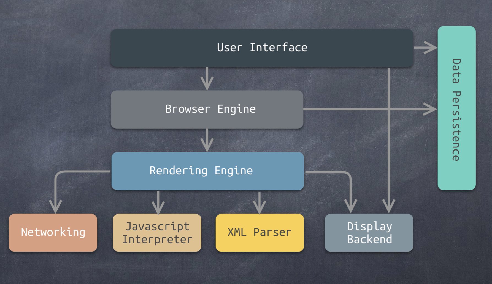

# Chrome浏览器的渲染机制

## 零、文章梗概

+ 浏览器的进化过程
+ 现代浏览器的特征与结构
+ chrome浏览器架构
+ chrome浏览器的渲染过程
+ 初窥WebKit

## 一、现代浏览器的进化

1. 1990年，蒂姆·伯纳斯·李开发了第一个万维网（WorldWideWeb）网页浏览器，后改名为Nexus。WorldWideWeb浏览器支持早期的HTML标记 语言，功能比较简单，只能支持文本、简单的样式表、电影、声音、图片等资源的显示。
2. 1993年，马克·安德森领导的团开发了一个真正有影响力的浏览器Mosaic，这就是后来世界上最流行的浏览器Netscape Navigator。
3. 1995年，微软推出了闻名于世的浏览器Internet Explorer。**第一次浏览器大战开始，持续两年。**
4. 1998年，Netscape公司开放Netscape Navigator源代码，成立了Mozilla基金会。**第二次浏览器大战开始，持续八年。**
5. 2003年，苹果公司发布了Safari浏览器。
6. 2004年，Netscape公司发布了著名的开源浏览器Mozilla Firefox。
7. 2005年，苹果公司开源了浏览器中的核心代码，基于此发起了一个新的开源项目WebKit(Safari浏览器的内核)。
8. 2008年， Google公司已WebKit为内核，创建了一个新的浏览器项目Chromium。以Chromium为基础，谷歌发布了Chrome浏览器。 至于这两者的关系，可以简单地理解为:Chromium为实验版，具有众多新特性;Chrome为稳定版。

**万维网是什么？**

万维网实际上是基于HTTP的一套内容。使用HTTP协议访问的那些网站都属于万维网，但是使用TelNet、ssh、FTP这些协议访问的不属于万维网。我们平时输入网址的www，就是万维网的缩写。第一个网页浏览器运行在Windows3上。

**Mosaic浏览器**

这个浏览器是需要特别注意的，这是一个真正的浏览器，发展成了Netscape Navigator（网景），也就是现在的FireFox。

**第一次浏览器大战**

1995年微软推出了windows划时代的版本，**Windows95**。Internet Explorer3就是跑在Windows95上，但是Internet Explorer一出来就是Internet Explorer 3版本，第一次的浏览器大战也由于Internet Explorer 3的出现与Netscape Navigator的竞争正式开始了。由于微软的手中掌握着Windows操作系统的技术，在技术上做垄断，在操作系统层面为IE浏览器做优化，隐藏了很多内部接口。所以第一次浏览器大战IE毫无疑问的胜出了。

**第二次浏览器大战**

1998年微软推出了windows98操作系统，IE4就是运行在Windows98上。这个时候微软就完全垄断了操作系统和浏览器市场。然后Netscape Navigator就开源，成立了Mozilla基金会。这两次浏览器大战在现代浏览器中还留下了一些痕迹：

我们可以看到在请求头中的user-agent：Mozilla/5.0就是竞争的产物。有意思的是第二次的浏览器大战持续的时间长达8年（1998-2006），在这八年的竞争中微软渐渐落后，因为出现苹果公司的**Safari浏览器**，Netscape公司发布了开源的Mozilla FireFox浏览器。从这个时候起现代浏览器架构的雏形出现了。现代浏览器的架构都是从03、04年开始的。2005年苹果公司开源了webkit内核，到此为止市面上就存在了三种浏览器内核：

+ IE的内核
+ FF的内核
+ 苹果的Webkit

第二次浏览器大战之后IE渐渐的就下课了，后来者居上。

**牛逼的Google Chrome**

2008年google推出了Chrome浏览器，并且觉得市场上的浏览器内核已经很成熟了，所以他借用了webkit的内核架构开发了Blink内核，webkit实际上是分为两个部分：

+ 第一部分是处理HTML和CSS的**WebCore**。
+ 第二部分是处理JS的**JSCore**。

但是Google觉得苹果的Webkit的JS core性能并不好，所以自己开发了V8引擎。现在就是google浏览器一家独大。

**Webkit架构图**

两个红色双向箭头之间的就是WebKit的架构图，一共分三层，最上面一层和最下面一层都是API层，不同的是上面的接口是可视化界面调用，下面的接口是调用底层库。WebKit真正的核心是中间层的两个：**WebCore**和**JSCore**。Chrome浏览器的V8引擎就是用来替换JSCore的。

## 二、现代浏览器的特征

### I、网络

现代浏览器的第一个特征就是强大的网络功能，不但能支持HTTP协议，而且还支持其他的协议，比如WebSocket、FTP等。

### II、资源管理

管理从服务器上下载下来的资源，包括但不限于HTML、CSS、JS、图片、视频、音频等。

### III、网页浏览

核心功能就是网页浏览，实际上网络功能、资源管理和网页浏览这三个功能属于浏览器的基本功能。不只是现代浏览器有，原始的浏览器也有这三个功能。

### IV、多页面管理

多页面管理是现代浏览器新增的特性，现代浏览器可以在不同的网页标签之间随意切换，这就是多页面管理。多页面是从火狐浏览器开始的，在之前打开一个页面就得出现一个新的窗口。

### V、插件和扩展

插件和扩展的功能仍然是火狐最先新增的特性。

### VI、账户和同步

账户和同步的功能仍然是火狐最先新增的特性。

### VII、安全机制

安全机制就是浏览器的同源策略，不允许跨域。安全机制的功能仍然是火狐最先新增的特性。

### VIII、开发者工具

开发者工具火狐是第一个开发出所见即所得的开发者工具的浏览器。

## 三、现代浏览器的架构

现代浏览器架构图：

+ 用户界面（User Interface）：直接和最终用户打交道，这是能带给用户直接感受的部分。
+ 浏览器引擎（Browser Engine）：用户界面的下面是浏览器引擎，他是浏览器中的一个组件，是渲染引擎的高级接口。
+ 渲染引擎（Rendering Engine）：是处理HTML和CSS的部分，对应了WebKit中的WebCore。
+ 网络（Networking）：提供浏览器的网络功能，是以库的形式存在。
+ XML解释器（XML Parser）
+ JS解释器（JavaScript Interpreter）：解释JS
+ 显示后端（Display Backend）：显示后端，在不写任何的样式时，所显示出来的纯HTML样式就是显示后端提供的。
+ 数据持久层（Data Persistence）：浏览器所需要的保存在硬盘中的数据，这些数据对用户都是不可见的。比如Cookie还有网站证书。

### I、常见的渲染引擎

| 渲染引擎 |          浏览器           |
| :------: | :-----------------------: |
| Trident  |      IE，Edge（旧）       |
|  Gecko   |          FireFox          |
|  Webkit  |          Safari           |
|  Blink   | Chrome、Opera、Edge（新） |

### II、渲染引擎结构与工作流程

渲染引擎结构与工作流程简图：

从大的方面看这个简图分三部分：

+ 第一部分是HTML、JavaScript、CSS作为输入。
+ 第二部分就是虚线框中的所有东西组成的**渲染引擎（Rendering Engine）**。
+ 第三部分是**显示（Display）**。

如果从整体来看，Rendering Engine现在对我们来说是一个黑盒子。我们不关系黑盒子的内部是什么样的，我们只关心黑盒子的输入和输出。也就是说以HTML、JS、CSS作为输入，以可视化内容作为输出，展示在显示器上。

搞清楚黑盒子的输入和输出之后我们就要深入到黑盒子的内部，看一下渲染引擎的内部做了什么？渲染引擎一共作了四件事情，按照时间的先后顺讯分别是：

+ 解析HTML并结构化成DOM树。这个过程叫结构化，用html解析器把文本变成dom对象。
+ 渲染树结构化，渲染树是在DOM书的基础之上，根据CSS生成。最早的DOM树上只有HTML的信息，然后再HTML上附加CSS的信息生成渲染树。
+ 生成布局树，布局树用来计算页面上的控件和元素在显示器上应该显示在什么地方。
+ 绘制渲染树，把像素点生成并画到显示器上。这四个步骤都是基于DOM树的。

现在可以提出一个问题，这四个步骤所对应的三个树到底是什么样子的，这个需要再深入到渲染引擎的内部进行观察。

渲染引擎结构与工作流程详图：

我们可以把这个图分为上下两部分来分析，上面一部分就是渲染引擎的渲染步骤，也就是我们分析过的上一张图。下半部分就是参与渲染的全部模块。主要模块有以下几个：

+ HTML解析器，存在于WebCore里面。
+ CSS解析器，存在于WebCore里面。
+ JavaScript解释器，JS解释器是一个独立的模块，有可能是JSCore也有可能是V8。
+ Layout：进行布局。
+ Painting：进行绘制。

整个流程的核心在于前三个：`HTML Parser`、`CSS Parser`、`JavaScript Interperter`。我们会发现图的下半部分有很多的箭头，也有很多的分支，我们先看主干：

**HTML Parser ------> DOM Tree ------> Render Tree -----> Painting -----> Display**

+ 第一步先做HTML解析生成DOM树，文档对象模型。后面的操作都是围绕这个文档对象模型的。
+ 第二步根据DOM树和结构化完成的CSS生成Render Tree。
+ 第三步基于Render Tree生成布局树。实际上就是布局渲染树，也就是在渲染树的基础上加上渲染规则。HTML的渲染是一层层的铺在浏览器上的，就是在排版。
+ 第四步根据布局树进行绘制。
+ 第五步Painting要去调用显示后端，调用字体，计算像素点，利用显卡最终显示在屏幕上。

我们一般的HTML文件会包含Style标签的CSS代码和script标签里的JavaScript代码，当从HTML文件的第一行开始解析的时候，会把HTML解析成DOM树：

+ 当遇到CSS代码的时候，会先把CSS代码进行结构化，但是CSS和HTML不一样，CSS不是树状结构。CSS是一块块的，然后CSS解析器会把CSS解析成一个个的CSS片段。 这些CSS片段会到DOM树上去找相应的HTML节点，这样就完成了DOM节点和CSS样式片段两者的匹配。匹配完毕之后就生成了**渲染树（Render Tree）**。渲染树就是DOM结构和CSS样式片段关联完成之后的产物。这样在后续过程中就知道了DOM树在渲染的时候会是什么样子。
+ 当遇到JavaScript代码的时候，JS的解释器在解释完JS代码的时候可能出现的结果有两种，可以作用在渲染树上，也可以作用在DOM树上，同时JS和DOM树之间是互相做用的**（我们仔细观察可以看到DOM树和JS解释器之间是双向箭头）**。因为JS是一种脚本语言功能很强大，可以操作DOM树上的节点。同时JS可以调整页面的样式，所以JS可以做用在渲染树上。另外就是DOM树对于JS的作用，当我们去解析HTML的时候，HTML的节点上存在着各种事件，就得在事件上绑定处理函数，这样在点击按钮的时候又会去调用JS的函数，所以DOM树和JS引擎能够相互作用。

经过上面的阐述，我们可以引出一个问题，那就是我们**为什么在页面上引用JS的时候都会尽可能的把JS代码放在HTML文件的最后？**

因为HTML解析器在解析HTML的时候如果遇到了JS，那么HTML解析器会暂停工作。然后把JS代码抽出来扔给JS解释器处理，JS代码处理完成之后，HTML解析器才会继续处理后端的HTML代码。也就是说HTML 解析器和JS解释器不能同时操作。

**那么HTML 解析器和JS解释器为什么不能同时操作呢？**

因为我们都知道JS是可以对DOM结构进行操作的，那么如果当JS操作DOM结构的时候，HTML解析器也进行操作，那么就会造成对资源的争抢。HTML解析器和JS解释器不在同一个线程里，两个不同的线程去争夺一个资源就造成资源挣钱，只有两种结果：

+ 大家谁都别操作了，这样的话程序机会卡死。
+ 大家都在操作，这样的话数据就会被破坏掉。生成的DOM树究竟是什么样子的是 不可预测的。
+ 并且还有一点要注意的是HTML解析器和JS解释器操作DOM的方式不同的，前者是直接操作，后者是采用桥接的方式操作。

## 四、Chrome架构

Chrome浏览器开了一个先河，把原来的浏览器单进程模式扩展成了多进程模式。早期的浏览器都是单进程浏览器，一个进程中会有多个线程。

+ 主进程就是**浏览器进程（Browser Process）**，控制程序的Chrome部分，包括地址栏、书签、后退和前进按钮。还处理web浏览器的不可见的和特权部分，例如网络请求和文件访问。我们从Browser Process图中看到有三个明显的线程，分别是页面线程、网络请求的线程和文件访问的线程。

+ **渲染器进程（Render Process）**，Chrome把渲染器单独的放在了一个进程里，并且我们可以看到渲染器的进程有多个（图中画了三个渲染器进程），这是因为咱们在打开多个页面标签的时候，这些网页有的是属于不同的域，有的属于同一个域，一个渲染器进程负责一个域的渲染。单进程的浏览器如果一个页面崩溃，整个浏览器就会崩掉，但是多进程的浏览器则不会出现这种问题，一个页面崩溃了同一个域下面的页面会崩溃但是不会影响其他域下的页面的正常运行。这就是多进程渲染的好处。

  多进程渲染的缺点就在于吃内存，内存资源占用严重。但是现在硬件的发展很迅速，吃内存的应用现在也不是太大的问题。我们通过Renderer Process进程图片可以看到一个渲染器进程有两个线程：

  + 左边是处理DOM树的线程
  + 右边是排版的线程

+ **工具进程（Utility Process）**，比如说收藏夹、数据同步、多用户同步等一些浏览器工具。

+ **扩展、插件进程（Plugin Process）**，Chrome是一个插件一个进程，所以如果插件太多可以禁用一部分。插件越多背后跑的进程也就越多，更耗费资源。会拖慢浏览器。

+ **GPU进程**，用来做页面绘制的，Painting。GPU进程就一个，因为一般情况下我们一台电脑就一块显卡，那么控制箱显卡的进程也就只有一个。

### I、渲染器进程

我们的重点是看渲染器进程：

渲染器中有**一个主线程（Main thread）**，还有**多个工作线程（Worker threads）**、排版线程（Compositor）和预渲染线程（Raster thread）。JS跑在工作线程下，打开一个页面就需要分配一个JS解释器实例配合工作，因为JS是单线程的语言，所以会依附在一个线程之下。那么一个页面中也可能有多个webworker，那么一个web worker又是一个JS解释器的实例，对应一个工作线程。所以一个主线程中会存在多个工作线程。除此之外还会有service worker，这个东西相当于浏览器的后台，也是一个JS解释器的实例。

### II、Chrome渲染过程：解析部分

**问题：Chrome渲染的资源从哪里来？**

上文我们说到渲染器的输入就是一些HTML、CSS、JS文本文件和图片、视频、音频等等。这些资源都是通过网络请求下载到本地的。这一点我们从上图也可以看的出来。

然后得到了HTML等资源，HTML Parse就开始工作，把HTML解析成文档对象模型（DOM），因为这是一个树状结构，所以我们一般也称它为DOM Tree。而且生成DOM树的这一工作试下主线程（Main thread）中做的。

得到DOM之后，主线程就要处理CSS了，处理完成之后的CSS是很多个片段，这一点我们在上文中已经提到，并且在上图中也可以得到印证。根据这些片段然后生成数据结构，然后再DOM树上，寻找到对应的节点（Element），进行样式匹配关联上。这样就生成了**渲染树（Renderer Tree）**。

得到渲染树之后，要去计算所有的节点在应用上对应的样式之后的尺寸，把实际的坐标计算出来，之后再计算基于最左上角的相对位置。这个过程就是排版，最后生成布局树（Layout Tree）。

### III、Chrome渲染过程：合成部分

+ 把文档的结构、元素的样式、几何 形状和绘制顺序转换为屏幕上的像 素称为光栅化。
+ 合成是一种将页面的各个部分分 层，分别栅格化，并在一个被称为 **合成器线程**的独立线程中合成为页 面的技术。

最终Layout Tree就是最终输出的图像。本质上不管是文本还是图片在屏幕上都是图像，文字可以选中知识浏览器给用户的一种假象。文字和图片的对象种类是不同的，但本质上都是图像。Layer Tree就是生成像素点的最后一个结构。

### IV、Chrome渲染过程：渲染部分

生成的Layer Tree是最终生成图像的规则，最后要把这个规则交个GPU进行计算像素点，GPU是**众核处理器**，GUP中的每个核心都只负责浮点运算，这些GUP核心都是并行计算。把最终渲染的工作分解成若干个小的工作，每个核心都得到一份晓得工作。

**怎样拆分呢？**会把一张大图分割成一个个的tile，这一个tile交给一个GPU的核心，同时计算，算完之后把结果集中到显存里，最后直接输出到屏幕上。

整个Chrome渲染流程到这里就完成了，对于前端来说从开始到生成渲染树这一部分内容是跟我们息息相关的。直接影响到前端的性能。后面的布局树和和合成树到最后显示图像，这和计算机的性能是相关的。

## 五、总结

这篇文章主要探讨了浏览器的WebCore的渲染过程，并没有设计到怎么处理JS的问题。主要是DOM Tree和Render Tree，以及最后的合成和渲染。这对应了我们在写HTML和CSS的时候要想到页面的渲染问题，以提高我们的代码设计的质量。
