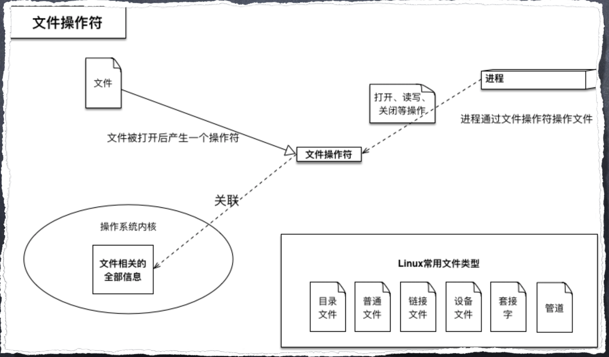
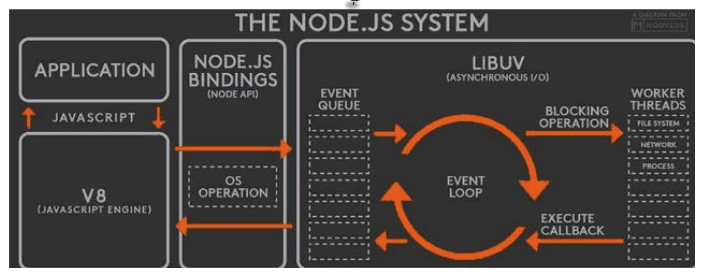
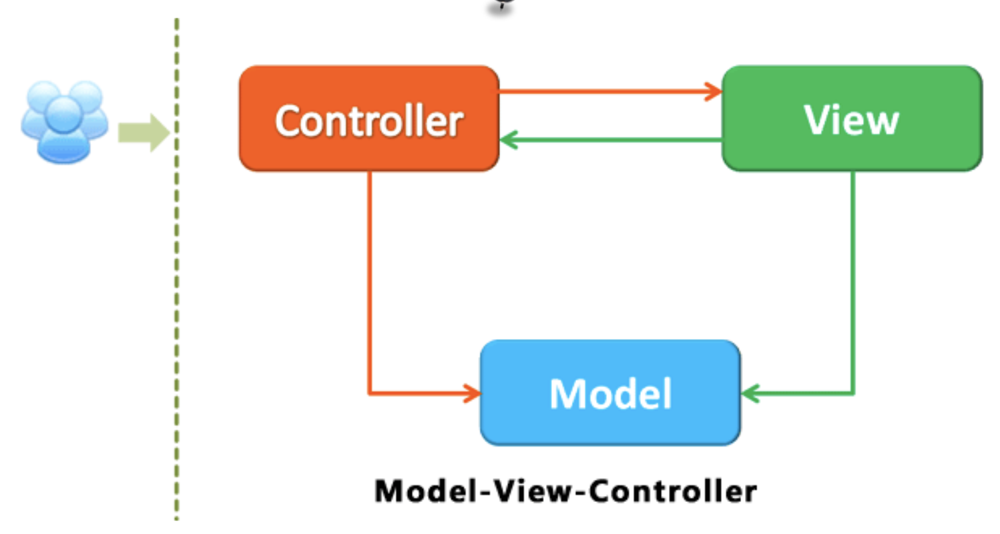
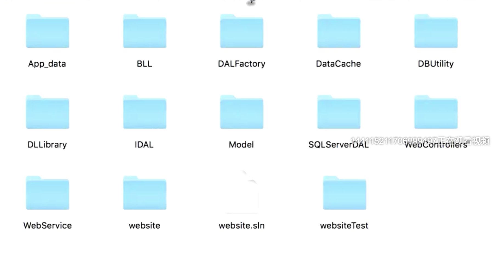
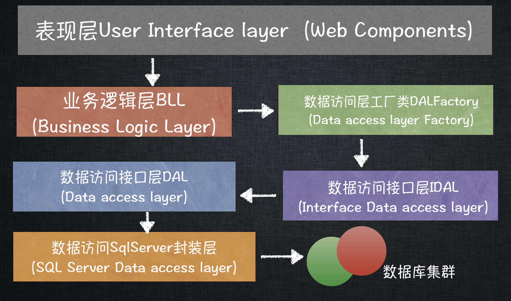
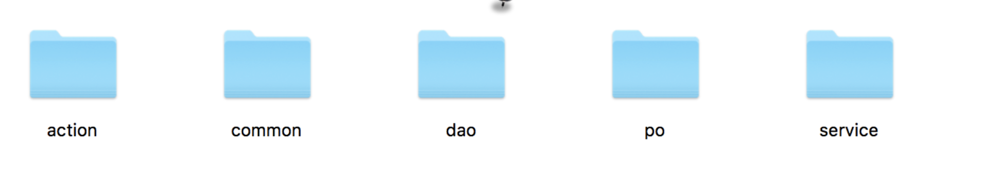
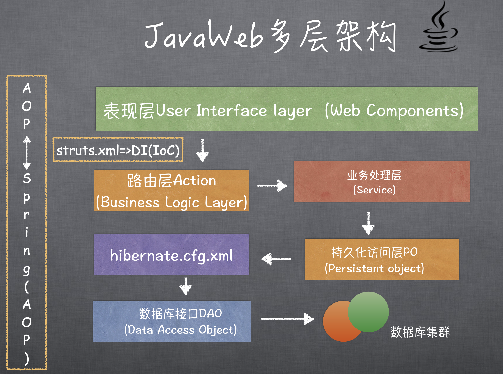

# 大规模NodeJS项目架构与优化

## 零、写在前面

这篇文章我们要探讨以下几点：

+ NodeJS异步I/O原理浅析及优化方案
+ NodeJS内存管理机制及内存优化
+ 大规模Node站点结构原理分析
+ 服务器集群管理与Node集群的应用
+ UV过千万的Node站点真身

## 一、Node现如今的意义

### I、现在最火的SPA开发

现在前端最火的就是SPA的开发，对应了Vue、React这两大SPA框架，由于Angular在国内市场的占有率非常低，我们在这里考虑。虽然SPA的开发非常火爆，但是也是最傻的，最low的一种技术实现。也就是我们大多数前端最喜欢使用的**Vue + Vue-Cli**，其中最大的问题就是这一套技术实现完全是假的路由，是依靠pushState实现的假路由。

这一套前端页面要想和后端的Java服务器通信，那么在Java服务器和前端项目之间需要搭建一层代理服务器，通常这个代理服务器是Nginx，为什么需要代理服务器，第一个原因是因为存在跨域的问题，第二个是需要代理服务器来承接前端的假路由。比如说后端的路由是 **/api/***，需要把**/api/***加入白名单，而所有其他的路由都直接跳转回 **/index**。把所有的页面渲染交给JS来处理。

经过刚才的描述我们就可以看出SPA虽然实现了前后端的分离，但是带来的问题也不少。而且这种技术实现使得页面全是前端来渲染，这使得前端只有一次请求，就把所有的JS请求到本地，然后前端路由的跳转完全是按照JS的逻辑来pushState。这样就造成了SEO的不友好，跨域等等问题。这也是为什么说SPA的技术实现非常low的原因。

### II、MPA的开发

与SPA相对的就是MPA，也是SPA概念没出来之前web的开发形式，它是一种服务器直出形式，直接把页面的页面（这里指的是HTML）在后端生成好，然后前端请求来直接浏览器渲染。也即是我们现在经常提到的**Server Side Render（服务端渲染）**。多页渲染。这种形式的路由就是真的。这种形式比较古老且有效，后端可以使用任何后端语言和框架，也可以使用任何的模板引擎来生成HTML页面。这种的优势就在于不会出现跨域问题和对SEO友好。

### III、MPA + SPA混合开发

MPA + SPA混合模式开发，也就是说真假路由联动。以前SPA开发，前端和服务器之间需要有Nginx来代理，采用SPA + MPA的话就不需要Nginx的参与了，前端和Java服务器之间搭建一层NodeJS服务，用Node来连接服务器。这种技术方案就是BFF，也就是Backends For Frontends，这也是现在一些互联网大厂普遍使用的技术方案。

那么现在就出现了一个问题，为什么要在后端和前端之间加一层Node呢？这有什么好处，解决了什么问题？这些问题我们下文会详细解答。

### IV、同构开发

MPA + SPA混合开发也是有一些天生的短板的，我们在使用node的模板渲染页面的同时，如果有Vue的话我们需要使用模板在渲染Vue，那么Vue本质上也是一个模板引擎，那么就出现一个页面使用两个模板殷勤渲染的情况，这无疑是对性能的一种浪费。为了解决这个问题我们完全可以使用同构来进行开发，直接使用Node + Vue的模式，使用Node把Vue渲染出来。

以上的这四种技术实现，就是到现在为止全部的实现方案，所有的站点都逃不出这四种方案。

那我们继续探讨一个中心话题，那就是在当前的前端领域中Node到底是在担任一个什么角色，它的存在究竟是一个什么意义。

**毫无疑问的是，Node的最重要的任务就是BFF。**BFF究竟解决了什么问题呢？

## 二、BFF究竟解决了什么问题

接下来我们主要说一下Node的优势和劣势，以及Node的应用场景。

### I、BFF

+ Node解决的第一个问题就是前端的地位问题，Node的出现就使得前后端分离真正的实现了。
+ 使得前端的性能优化更好实现。性能优化的指标更加容易达标。
  + FCP
  + FP
  + FID
  + LCP
+ 可以对后端接口的json数据进行裁剪，以达成更适合前端使用的目的。我们都遇到过这种情景，明明只需要一个字段，但是后端开发人员为了省事儿，把所有的字段都在接口中返回，这就使得我们前端在fetch数据的时候，数据量过大，对前端的性能造成了影响。有了BFF层，我们就很好的解决了这个无人能提。
+ 同构开发，对于前端的Vue项目和React项目只支持Node做同构开发，其他的后端语言是做不到的，Node就有了自主权。

### II、解决高并发问题

NodeJS天生的优势就是可以利用低配置来吃高IO，特别适合做H5游戏的中间层。对Socket支持非常棒。

### III、Node的劣势

一个技术既然优势很明显，那么对于劣势来说也是很明显的，Node的劣势就在于不善于操作数据库。

### IV、对于BFF的思考

使用BFF架构最重要的一步就是使用Node来连接后端的服务，那么Node和后端如何通信呢？使用HTTP协议来通信的话，Node请求后端是一次HTTP请求，前端请求Node又是一次HTTP请求。那么久导致了一个问题，那就是对于一次前端的请求，会发生两次HTTP请求，这是很不正常的，HTTP请求的效率是有问题的，所以多的这一次Node请求后端的HTTP就需要优化。

解决这个问题我们可以使用IPC通信，也就是使用**Unix domain socket**。

## 二、NodeJS异步I/O原理浅析及优化方案

这一小节我们将讨论以下几个问题：

+ 异步IO的优缺点
+ Node对异步IO的实现
+ 几个特殊的API
+ 函数式编程在Node的应用
+ 常用的Node控制异步API的技术手段

### I、异步IO的好处

+ 前端通过异步IO可以消除UI阻塞。
+ 假如请求资源A的时间为M，请求资源B的时间为N，如果使用同步请求的方式，最大时间为M + N。如果使用异步请求的方式，最大时间为max(M, N)。
+ 随着业务的复杂，会引入分布式系统，时间会线性的增加， M+N+...和Max(M,N...)，这会放大同步和异步之间的差异。
+ IO是昂贵的，异步IO是更加昂贵的，关于异步IO需要了解一些它与QPS的关系。（面试必问）
+ NodeJS适用于IO密集型，不适用于CPU密集型。

**什么是文件操作符？**

操作系统对计算机进行了抽象，将所有输入输出设备抽 象为文件。内核在进行文件**I/O**操作时，通过文件描述符进 行管理。应用程序如果需要进行**IO**需要打开文件描述符， 在进行文件和数据的读写。异步**IO**不带数据直接返回，要 获取数据还需要通过文件描述符再次读取。

### II、Node对异步IO的实现

先来看一张经典的图：

完美的异步IO操作应该是应用程序发起非阻塞调用，无需通过遍历或者事件轮询。这个图需要分析的很透彻，后面的文章我们会仔细的分析这张图，如果想高薪，这张图必然要会。

### III、几个特殊的API

1. SetTimeout和SetInterval 线程池不参与。
2. process.nextTick() 实现类似 SetTimeout(function(){},0);每次调用放入队列中， 在下一轮循环中取出。
3. setImmediate();比process.nextTick()优先级低。

## 三、函数式编程在Node中的应用

+ 高阶函数：可以将函数作为输入或者返回值，形成一种后续传递风格的结果接受方式，而非单一的返回值形式。后续传递风格的程序将函数业务重点从返回值传递到回调 函数中。
+ 偏函数：指定部分参数生成一个新的定制函数的形式就叫做偏函数。Node中异步编程非常常见，我们通过哨兵变量会很容易造成业务的混乱。

### 常用的Node控制异步的技术手段

1. Step、wind(提供等待的异步库)、Bigpipe、Quntitled:Untitled-1.js
2. Async、Await
3. Promise/Defferred是一种先执行异步调用，延迟传递的处理方式。Promise是 高级接口，事件是低级接口。低级接口可以构建更多复杂的场景，高级接口一 旦定义，不太容易变化，不再有低级接口的灵活性，但对于解决问题非常有效。
4. 由于Node基于V8的原因，目前还不支持协程。协程不是进程或线程，其执行 过程更类似于子例程，或者说不带返回值的函数调用。
5. 一个程序可以包含多个协程，可以对比与一个进程包含多个线程，因而下面我 们来比较协程和线程。我们知道多个线程相对独立，有自己的上下文，切换受 系统控制;而协程也相对独立，有自己的上下文，但是其切换由自己控制，由 当前协程切换到其他协程由当前协程来控制。

## 四、内存的管理与优化

内存的管理和优化，主要的内容就是GC。

### I、V8的垃圾回收机制

V8的垃圾回收处理机制Node和浏览器中的处理方式是一样的。这部分内容在后面还会再继续讲。

+ Node在使用JavaScript在服务器端操作大内存对象受到了一定的限制（堆区），64位系统下约为1.4GB，栈区32位操作系统下是0.7GB，新生代64位是32M，32位是16M。
  + node —max-new-space-size
  + -max-old-space-size
+ V8的垃圾回收策略主要基于分代式垃圾回收机制，在自动垃圾回收的演变过程中，人们发现没有一种垃圾回收算法能够适用于所有场景，V8内存分为新生代和老生代两代。新生代为存活时间较短的对象，老生代为存活时间较长的对象。

V8的垃圾回收器，目前V8采用了两个垃圾回收器，主垃圾回收器——Major，主要负责回收老生代的垃圾回收。副垃圾回收器——MInor GC（Scavenger）主要负责新生代的垃圾回收。V8之所以使用两种垃圾回收处理机制主要是受到了”代际假说“的影响。

**什么是代际假说？**

第一个是大部分对象都是”朝生夕死“的，存活时间较短，第二个是短时间不死的对象会存活更长的时间，比如全局对象window、DOM、Web API等等。

## 五、大规模Node站点结构原理分析

不过多大的站点，即使是百度、阿里的站点使用MVC模式是完全可以的。但是MVC仅仅也是够用，只会MVC失于单薄。

**经典的MVC框架**

**.NET多层架构**

这个就是一个典型的分层架构。我们来简单额说一下：

+ 首先第一层就是对外服务 `WebService`，静态资源服务 `WebSite`，单元测试 `websiteTest`。
+ 然后是业务层，应用的数据 `App_data`、`BLL`，第一册的WebService和WebSite自己不能渲染，得需要 `WebControllers`。然后WebControllers调用BLL。

.NET多层架构的图示：

**JavaWeb多层架构**

+ dao层是对数据库的封装
+ action是动作
+ service是服务

JavaWeb的多层架构示意图：

## 六、Node集群的应用

### I、预备上线

+ 前端工程化的搭载动态文件的MAP分析压缩打 包合并至CDN。
+ 单测、压测性能分析工具发现Bug。
+ 编写nginx-conf实现负载均衡和反向代理。
+ PM2启动应用程序小流量灰度上线，修复Bug。

### II、多线程

+ Master进程均为主进程，fork可以创建主从进程。
+ 通过child_process可以和NET模块组合，可以创建多个线程并监听统一端口。通过句柄传递完成自动启动，发射自杀信号，限量重启，负载均衡。
+ Node默认的机制是采用操作系统的抢占式策略，闲着的进程争抢任务，但是会造成CPU闲置的IO暂时并未闲置。Node后来引 入了Round-Robin机制，也叫轮叫调度。
+ 每个子进程做好自己的事情，然后通过进程间通信将他们连接起来，这符合Unix的设计理念，每个进程只做一件事情，并做好。将复杂分解为简单，将简单组合成强大。

### III、PM2

PM2是一个带有负载均衡功能的Node应用的进程管理器。

+ 内建负载均衡（使用Node cluster集群模块）。
+ 后台运行
+ 0秒停机重载
+ 具有Ubuntu和CentOS的启动脚本
+ 停止不稳定的进程（避免无限循环）
+ 控制台监测
+ 提供HTTP API
+ 远程控制和实时的接口API（NodeJS模块可以和PM2进程管理器交互）

### IV、服务器集群

+ 首先Nginx lvs做负载均衡和反向代理，下面就是两台使用PM2做进程管理的机器。
+ Varnis和stupid是做HTTP缓存的机器，我们的NodeJS的服务通过Varnish访问真正的后台也就是JAVA服务器。
+ 然后JAVA到DB（数据库），数据库也是有集群的，有写集群和读集群。以及Back备份。
+ 如果PM2需要加载静态资源的话，还需要用到CDN服务器。
+ Nagios监测的是服务与服务之间的使用的情况。
+ 由于Varnish和Java之间是长连的，所以需要发送心跳包，来确定Java服务器是不是挂了。
+ 简单来说我们所有的机器和机器之间都是长连的，都需要做心跳检测。

## 七、经典代码

+ router.get(/^\/(\d+)_(\d+)/, cModel.A,cModel.B,cModel.C);

+ var shaObj = new jsSHA(string, 'TEXT');

  var hash = shaObj.getHash('SHA-1', 'HEX');

+ var forPound = req.headers['x-forwarded-for-pound'];

+ callback(new Error('Fail to parse http response to json, url:' + reqOptions.url + '), res, body);

+ require(‘./middleware’)(app);

+ async( await ctx.render(‘index.html’));

## 八、总结

这篇文章简单总结了一下Node现在在前端的地位，以及BFF架构的基本思路，V8的垃圾回收机制和Node服务器集群。

其中V8的垃圾回收机制和Node服务器集群这两部分内容写的不好，愿意是笔者的实践和理论不统一。有机会这两部分内容会拿出来重新写，敬请期待。