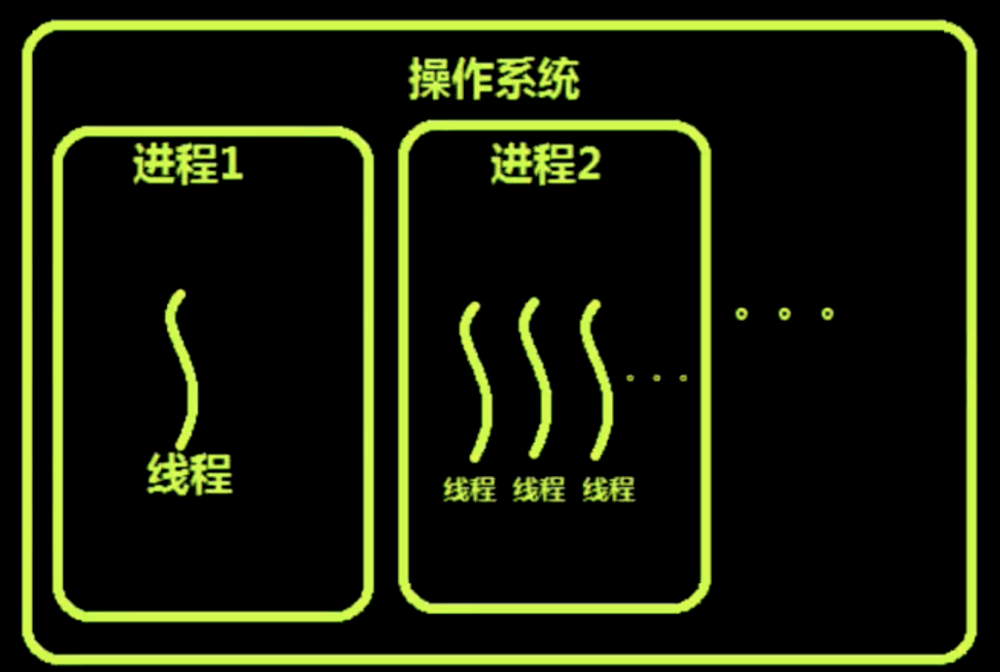
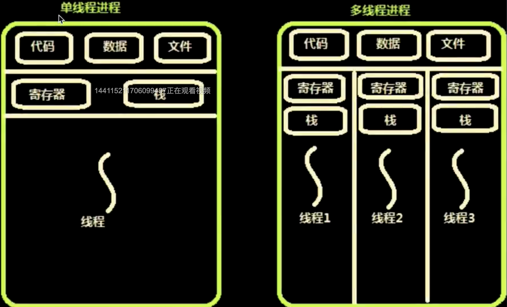

# 前端工程化Linux预备知识

## 零、写在前面

+ **为什么讲前端的工程化会设计到Linux？**

因为前端的工程化会需要很多的第三方的系统，这种第三方的系统是用来帮助我们建立工程化流程的，而这些系统是跑在Linux下面的，所以讲前端的工程化，必然会讲到Linux系统。

+ **这篇文章主要讲些什么？**
  + 操作系统概述
  + 强调重要的Linux命令
  + Linux网络的坑
  + Linux的进程与线程
  + 配置Linux免密登录
  + 进程管理实践：PM2源码分析


## 一、操作系统概述

Linux操作系统出现的时间在整个计算机发展的时间角度来说已经非常长了，如果算上Linux参照的系统历史来说Linux的历史已经有50年了，Linux参照了Unix系统，所以Linux处处都像Unix。我们平常使用的MacOS是Unix。Linux和Unix的差异不大，主要的差异在于内核的一部分差异和命令集一小部分的差异。

+ 适合开发的Linux
+ 适合娱乐的Windows
+ 非常好用的MacOS

### I、重要的Linux命令

+ 行编辑器vi
+ 服务管理命令 systemctl
+ 网络管理命令 ifconfig、ip命令、router
+ 命令行下载工具（核心基于http协议） wget、curl
+ 命令的帮助  --help  手册：man

### II、怎样找到端口冲突的应用

一般我们在web开发的时候会运行很富哦服务，这些服务就有可能会出现端口冲突的情况，那么在Linux下怎么查看端口冲突的应用？使用netstate命令：

```
$ netstat -anp
```

**netstate -anp**是把当前端口号上运行的服务名称和进程号输出出来。当然我们也可以对结果进行过滤：

```
$ netstat -anp | grep 80
```

上面的命令就是要对结果进行过滤，只查看80相关的关口（80， 8080...）。找到了占用端口的服务，根据服务的进程号，我们可以使用kill命令把进程杀死。

**重启网卡的命令：**我们重启网卡一般是先关闭网卡，然后再开启网卡。

```javascript
// 关闭网卡
$ ifdown eth0(网卡号)

// 开启网卡
$ ifup eth0(网卡号)
```

要注意这个命令不要随意使用，尤其是在VPS上，一旦在VPS上使用这个命令，网络就会关闭，然后用户就会被强行踢下线，这时候你就登录不上你的VPS了。

那么如果你再VPS上想重启网络，还是有办法的，可以使用下面这个命令：

```
$ systemctl network
```

使用systemctl可以重启network服务，这样可以在不掉线的情况下重启网络服务，重启网卡硬件这个操作是个坑，尽量避免。


## 二、进程、线程和协程

### I、程序和进程有什么区别？

其实我们可以用一句话来说明这个问题，那就是程序是静态的，而进程则是动态的。我们类比一下可以认为进程就是程序的实例。进程存在于CPU和内存中，当我们把一个程序执行起来的时候，操作系统首先会从硬盘上把这个程序的文件读到内存中，然后再找到进程的执行入口，把入口中的指令拿出来交给CPU去执行。

我们在平时执行程序的时候，感觉CPU是在并行的执行很多程序，但是对于一个单个单核的CPU本质上却不是这样的，CPU执行程序需要又操作系统去调度。CPU会让多个程序轮流去使用CPU，每次使用的市价非常短暂，然后在单位时间内会觉得CPU是并行的。然而CPU的时间片也不是平均分配的，操作系统对于CPU的时间片是抢占式的分配，也就是说优先级高的先抢到，优先级低的后抢到。

恶意程序也会不断的抢占CPU的资源。

+ 进程的目的就是担当分配系统资源（CPU时间、内存）的实体。
+ 线程是操作系统能够进行运算调度的最小单位。
+ 协程是一种用户态的轻量级线程，无法利用多核资源。比线程更小的单位，又叫做管程或者微线程。
+ IO密集型应用的发展：多进程--->多线程--->事件驱动---->协程
+ CPU密集型应用的发展：多进程--->多线程
+ 调度和切换时间：进程 > 线程> > 协程

我们现在的操作系统都是多任务系统，这个多任务对应的就是多进程，进程是操作系统分配资源的基本单位，进程是收到操作系统管理，由操作系统创建和维护。比进程小的单位就是线程，由操作系统调度，进程和线程乍一看很相像，但是两个不同的概念。

### II、进程和线程的区别

+ 线程是依附于进程的，没有进程是不会有线程的。
+ 线程的代码是进程代码的一部分。但是如果想要创建线程必须通过操作系统创建。由操作系统创建和调度，但是要由进程来管理。当操作系统创建一个进程的时候，这个进程中至少会存在一个线程。当进程结束后，线程会跟着进程一起结束。当然在一个进程中也可以存在多个线程。

协程：是一种比线程更小的单位，而且是用户态的，进程和线程都是内核态的。

**什么是内核态和用户态？**

用户态是我们在执行程序的时候，执行的只是程序的代码并不存在系统调用的时候就是用户态。一旦使用课系统调用，调用了系统内核的功能，就从用户态转变成了内核态。所以根据内核态的定义再结合进程和线程的穿件都是操作系统使用系统调用创建出来的，那么可以得出结论，进程和线程在创建的时候都是内核态的。

那么说到协程，是由自己的代码创建出来的，所以是用户态的。一般是由第三方库实现这种协程的机制。因为协程是用户态的这就意味着操作系统无法对协程进行调度。这也就解释了为什么协程不能使用多核的原因。

### III、进程、线程到协程为什么会这样发展？

如果一个进程要想完成一个任务，比如说要写一个HTTP服务器。写服务器就得处理并发，处理并发就得想一个高效的方法。想象一下，如果只有一个TCP连接连接到我们的服务器，这时候服务器只管处理就行了，那么如果有多个TCP连接连接到服务器，而且每个TCP连接都有自己的任务要做，这个时候在早期一个比较好的方法就是一个TCP连接到我们的服务器的时候我们就创建一个新的进程，这个进程和原先的那个连接是父子关系，是父进程创建子进程，创建出一个子进程之后就把这个连接交给子进程处理，如果再来一个连接，就再次创建一个子进程，以此类推。这种方式叫做Fork。


Fork方式的优点：

+ 一个连接对应一个进程，这种方式非常方便不需要考虑任何机制，把所有的工作都交给了操作系统，没有别的任何心智负担。
+ 这种方法就属于一个活找一个人干，多来一个活，就加一个人。全部由操作系统管理。

Fork方式的缺点：

+ 连接一旦增加到一定的数量，每个进程都会占用一定的系统资源，这时候操作系统对于进程的管理就会很吃力了。操作系统如果想要对一个进程进行有效的管理就要在进程中加入很多数据，这么多的进程就都要附加相同的数据，这对于操作系统的管理无疑是有非常大的压力的。
+ 在fork的时候父进程会把自身的所有的数据都会复制一份到子进程中。这样的话占用的资源就会很大。

**为了解决fork模式的占用资源的缺点，我们需要一个更轻量的东西，那就是线程。**

线程在创建的时候，也会复制一些代码和数据，但是会共享进程中的资源，比如说文件句柄、网络套接字、公共代码等都可以从主线程共享。那么这样一来，线程的量级就小很多。

那么线程多了之后呢？和进程一样的会拖慢操作系统的处理。因为不管是进程还是线程本质上都是需要操作系统去调度。

那么我们可以想办法不让操作系统来调度，而是使用程序自己去调度。那么就出现了协程。协程和协程之间的切换没有线程和进程切换的开销（开销就是CPU的时间，CPU的切换需要时间，这部分时间CPU不会做有效的工作）。**进程间切换和线程间切换的内容在操作系统原理教材中会有详细的介绍，有兴趣的可以读一下，这里不做赘述。**协程在切换的时候不需要很大的开销，切换机制很简单，不需要操作系统的开销（CPU的寄存器和缓存）。协程的开销只是程序中的一个变量，更改的只是内存中的一个状态。但是协程的缺点也很明显，那就是无法使用多核的资源。

CPU最早之前，一个CPU里只有一个核心。但是在高级服务器一个CPU的运算能力不够就在一块主板上安装多个CPU，但是这种主板的价钱是非常昂贵的，因为CPU之间的通信全部是由主板来完成的。在多CPU的电脑上操作系统只能运行在一个CPU上，然后操作系统会把不同的程序分配到不同的CPU上。再到后来就发展成了一个CPU多个核心，和多CPU类似，核心与核心之间也需要通信，这种通信和协调由CPU内部专有的电路去协调，相比多CPU的主板这样更加节省成本，和多CPU类似在多核CPU上，操作系统只能跑在一个核心上。

CPU是一种通用型芯片，什么事情都可以做，在计算机中主要存在两种运算，一种是整数运算，一种是浮点数运算。这两种运算的运算规则是不一样的，CPU对于这两种运算是都可以做的。

对于应用程序来说一般也是分为两种，一种是IO密集型的操作，另一种是CPU密集型的操作。IO的意思是Input and Output，输入和输出都是相对于CPU来说的，数据进入CPU叫做输入，CPU输出数据到外部设备叫输出。注意这里的外部设备指的并不是内存而是外部设备，因为CPU有很多连接外部设备的引脚。这里说的IO一般分两种，一种是网卡另一种就是外部存储器（硬盘）。

平时的Web服务器就属于IO密集型的任务，浏览器应该属于CPU密集型的任务。对于服务器来说一般有三个衡量标准，高实时，高并发，高可用，三者全部都与IO有关。

 ### IV、进程和线程详解

操作系统的设计可以分为三点：

+ 以多进程的方式，允许多个任务同时运行。
+ 以多线程的方式，允许单个任务分成不同的部分运行。
+ 操作系统提供协调机制，一方面防止进程之间和线程之间产生冲突，另一方面允许进程之间和线程之间共享资源。



上图就明显的表明了进程是在操作系统的管理下运行的，在操作系统下可以有很多进程，进程一、进程二....，进程一和进程二也代表了两种不同的进程模式。进程一是单任务进程，进程二是多任务进程。进程一里面只有一个线程，这个线程也是主线程。进程二中有多个线程，这些线程中有且只有一个主线程。主线程随着进程的启动而启动，随着进程的停止而停止。在多任务进程中，除了主线程外其他的线程都归主线程管理。

### V、进程和线程的资源共享



前面说到多进程会消耗更多的资源，如果是多线程的话消耗的资源就少。这里说的资源就是进程中的代码（这里的代码是机器指令）、数据（堆栈中的数据）、文件（文件操作句柄）还有就是寄存器（保存在内存中的寄存器状态），内存中的栈（这里说的栈是函数调用栈）。其中代码、数据和文件是属于进程中的，栈和寄存器是属于线程使用的。我们上文说到的fork进程的方式来处理多任务，每次fork都会复制一份上述的所有资源，这无疑会占用很大的资源。

多线程和多进程的相同之处在于用到的资源是相同的，同样也要使用代码、数据、文件句柄、寄存器和栈，但是不同的是多线程中的代码、数据和文件句柄都是共享的，是多线程共享进程里的资源。不共享的是线程自己在CPU中执行的状态，也就是存储在内存中的CPU寄存器状态和函数调用栈。每一个线程都可以被调度使用CPU。所以每一个线程都有自己的寄存器状态，每个线程自己干自己的活儿，所以会有自己的函数调用栈。


## 三、Linux免密远程登录

### I、免密登录的原理

我们远程登录Linux的时候使用的是ssh命令，ssh协议的前身是telnet协议，ssh = telnet + SSL，也就是说telnet协议是一种不加密的远程登录协议。telnet是用电话线连接PC的协议。

**SSH的工作流程：**

我们在PC上终端使用SSH访问远程的Linux服务器，客户机连接服务器时必须保证这条链路不被窃听，如果直接使用TCP连接，不做任何加密的话那就很容易被旁路窃听。我们要给这条链路进行加密，加密的原理就是使用SSL，加密过程是先创建加密连接，然后再输入密码。在讲解HTTPS的加密原理的时候是客户端验证服务器，与HTTPS不同的是，SSH是服务器去验证客户端，需要客户端发送凭据，我们平时使用的是密码登录，这个密码就是客户机向服务端提供的凭据。

当我们不想使用密码作为凭据的时候，就是免密登录，纵然我们不使用密码作为登录凭据，也要提供别的凭据给服务器端。HTTPS就是一种免密的验证，HTTPS验证的是CA证书。与HTTPS不同的是SSH验正的是公钥和私钥。

**配置免密登录的步骤：**

1. 生成秘钥对，公钥和私钥生成在客户端。
2. 私钥保存在客户端，把公钥上传到服务器上。
3. 配置本地私钥。

**Linux免密远程登录详细步骤：**

+ 生成秘钥对
  + ssh-keygen -t rsa -C "你自己的名字" -f "你自己的名字_rsa"
+ 上传配置公钥
  + 上传公钥到服务器对应账号下的home路径下的.ssh/中（ssh-copy-id -i "公钥文件名" 用户名@服务器ip或域名）
  + 配置公钥文件访问权限为 600。
+ 配置本地私钥
  + 把第一步生成的私钥复制到你的home目录下的.ssh/ 路径下，这里要注意的是.ssh目录本身就是隐藏目录，所以在home目录下是ls是无法查看的，直接执行cp命令，cd进去检查一下就可以。
  + 配置你的私钥文件访问权限为 600
  + chmod 600 你的私钥文件名
+ 免密登录功能的本地配置文件
  + 编辑自己home目录下的.ssh/路径下的config文件，第一次查看的时候本机.ssh目录下可能没有config文件，需要自己创建。如果步配置config，在每次免密登录的时候需要显示的指定远程主机的ip或主机名还有本地私钥的路径，这就很麻烦。
  + 配置config文件的访问权限为644

配置文件的内容：

```javascript
// config
Host Renekton		# 设置远程登录的主机别名
User root		# 设置登录用户，这里设置为root用户
HostName 101.132.185.15		# 设置需要远程免密登录的主机ip或者主机名，注意这里不要加协议
IdentityFile ~/.ssh/Renekton	# 私钥的存放路径
Protocol 2
Compression yes
ServerAliveInterval 60	# 长链接时间
ServerAliveCountMax 20	# 最大连接数
LogLevel INFO		# 日志级别
```

这一部分内容需要自己动手配置，遇到问题解决问题之后才能真正的掌握Linux的免密登录。


## 五、进程管理实践：pm2源码分析

+ Pm2是什么？
  + PM2是node进程管理工具，可以利用它来简化很多node应用管理的繁琐任务，如性能监控，自动重启和负载均衡等，而且使用非常简单。
+ pm2官网：
  + https://pm2.io
+ pm2源码下载：
  + https://github.com/Unitech/pm2
+ 我们要在pm2源码中学到什么：
  + Linux进程管理方法
  + Linux创建进程的两种方式：fork和exec
  + 父子进程的管理机制

pm2中使用的创建进程的方式就是fork方式，下面我们来写一段简单的代码来说明pm2是怎么fork多进程，然后占满全部cpu核心的：

```javascript
// app.js

const Koa = require('koa');
const app = new Koa();

app.listen(3000, function() {
  console.log('Server is running at http://localhost:3000');
})
```

```javascript
// manager.js

var cluster = require('cluster');
var numCPUs = require('os').cpus().length;

if(cluster.isMaster) {
  console.log(numCPUs);
  for (var i = 0; i < numCPUs; i++) {
    var worker = cluster.fork();
	}
}else {
  require('./app.js');
}
```

我们在app.js中创建了一个很简单的服务，用manager.js来管理这个服务。这里的manage.js就相当于pm2，首先我们引入node集群cluster，然后引入os计算出本地机器的cpu数量。在程序开始执行的时候会创建一个主进程，cluster.isMaster就是判断当前是否为主进程，程序执行创建的进程必定为主进程，cluster.isMaster为true，然后执行for循环，for循环就根据本地机器的CPU核心数，fork出等量的进程，然后重点来了，这些进程是根据主进程fork出来（也就是完全复制）的，自然也会像主进程一样包含manager.js中的代码。所以子进程也会执行manager.js的代码，子进程在执行代码时cluster.isMaster自然是为false，所以所有的子进程都会执行app.js。就这样manager.js通过fork的方式让app.js的服务占满了所有的cpu核心。

这里关于父子进程的代码执行问题是有个转变问题的，所以一定要想明白，这个执行的方式其实和计算机语言无关，这实际上是操作系统的机制。

现在有一个问题就是，fork的进程都运行在3000端口，为什么不会出现端口冲突？

这个问题实际上和fork的时候操作系统的fork机制有关，主进程在fork出子进程的时候，子进程会复制主进程所有的资源和数据，但是所有被fork出来的子进程会共享主进程的文件句柄，所以不会出现端口冲突的问题。

## 六、总结

前端工程化的很重到的一部分在于发布和部署，现在的前端领域的发布和部署一般都是自动化的，也就是CICD，持续集成，持续部署。既然是自动化的部署就离不开Linux的远程免密登录，搭配Jekins等第三方的工具。所以前端自动化部署的第一步就是配置好远程免密登录，自己动手配置好，然后再往下看。