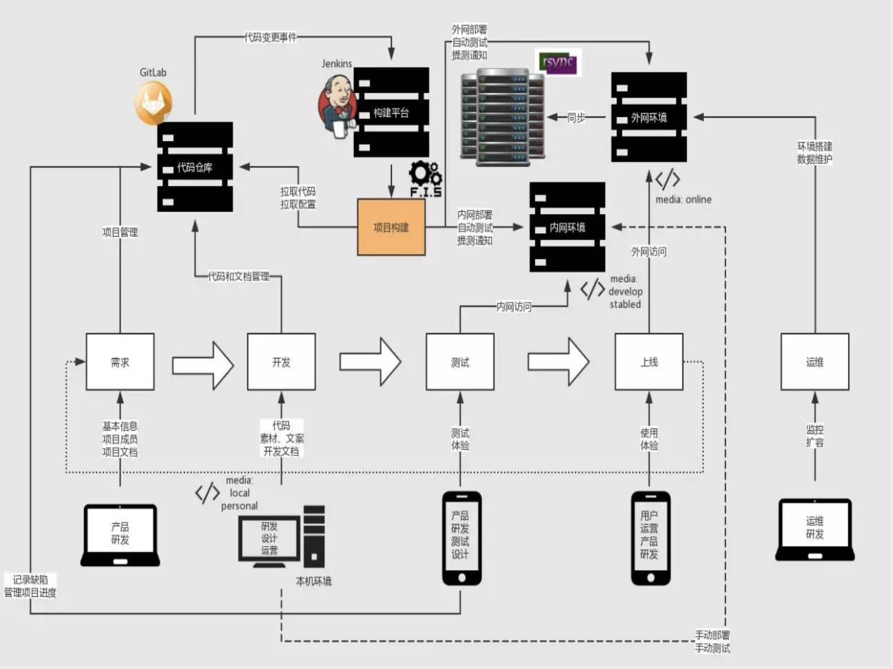
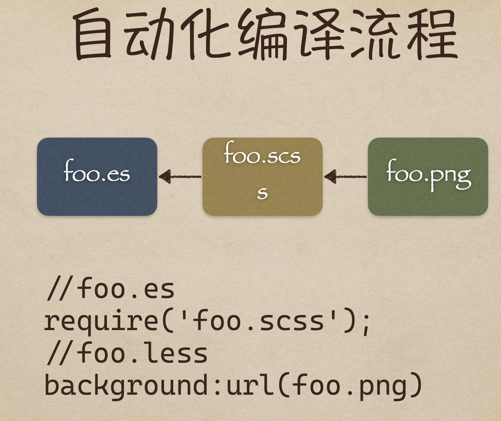
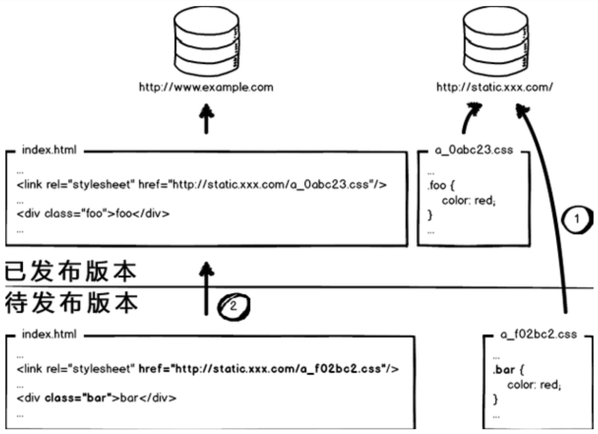

# 从小到大论前端持续集成

## 零、写在前面

最近几年市场上对于前端的持续集成有越来越多的要求，而持续集成这个概念对于大多数前端来说还很陌生，或者是只停留在听说的层面，大部分前端人员还没有到达能够实践完成的程度，所以前端持续集成这一块就成了前端人员的分水岭。

持续集成对于前端的要求也与日俱增，能对CI/CD有非常详细的了解。对于持续集成我们将在以下几个方面展开讨论：

+  什么是持续集成
+ 什么是统一代码仓库
+ 什么是前端工程化
+ 什么是自动化构建
+ 解放劳动力更多的自动化


## 一、什么是持续集成（Continuous integration）？

在持续集成环境中，开发人员会频繁的提交代码到主干。这些新提交的代码在最终合并到主线之前，都需要通过编译和自动化测试流进行验证。这样做是基于之前持续集成过程中很重视自动化测试验证结果，以保障所有的提交在合并主干之后的质量问题，对可能出现的一些问题进行预警。

持续集成的第一步就是版本管理库，因为开发人员开发完成之后的首先需要做的就是提交代码到版本管理库，现在流行的版本管理库有GitLab、GitHub、SVN。一旦把代码提交到版本管理库，下一步就是CI拦截。CI拦截中可以做很多的检查工作，比如说会检查提交的代码的重复率，如果重复率检测不通过就会被直接打回。CI拦截还会对提交上来的代码进行ESLint、HTMLLint、CSSLint的lint检查，如果lint检查不通过那么将再次被打回。如果通过CI拦截，提交上的代码还需要经过团队的code review，所谓code review就是开发人员提交上来的代码需要经过团队leader或者同事的检查，如果不合格也会被打回。

通过上述的CI拦截之后，提交到CI上的代码会进行一些自动化测试，测试机可能不是前端来掌握，但是测试的脚本和命令都需要前端来开发和配置，原因很简单，运维是不太懂前端的自动化测试的。

自动化测试过后就到了前端构建阶段，现在市面上主流的前端构建工具很多，Webpack、gulp、ESBuild、swc、Rollup、vite、Sonwpack，这里值得一提的是ESbuild，ESbuild的构建速度是很快的，构建速度快的原因有以下几个方面：

+ ESbuild是使用Go语言开发的，go语言能够编译成二级制机器码（类似于C语言），所以运行速度快。一般来说JS的操作是毫秒级的，Go语言的操作则在纳秒级。
+ 解析、生成最终打包文件和生成source maps的操作全部完全并行化。
+ 无需完成昂贵的数据转换，只需要有限的几步即可全部操作完成。
+ 该库以提高编译速度为编写代码的第一原则，并尽量避免不必要的内存分配。

现在新潮的vite和Sonwpack都是基于ESbuild的，这也是Vite打包为什么快的主要原因。如果想要开发SDK就需要用到Rollup和microbundle是必不可少的，Rollup需要自己手动配置。

构建完毕之后就到了缺陷管理阶段，也就是bug的记录平台，比如jira、Ambition等。构建完毕之后的代码会被送到容器里，比如要生成docker或者dockerFile，也有可能直接塞到web容器nginx里面。

发布完成之后，还要考虑一下文档的编写可以利用showDoc、TsDoc等工具进行文档的编写和管理。


## 二、什么是持续交付（Continuous Delivery）？

+ 持续交付就是我们的应用发布出去的过程，这个过程可以确保我们尽可能快的实现交付。这就意味着除了自动化测试，我们还需要有自动化发布流，以及通过一个按键就可以随时随地的实现应用的部署上线。
+ 通过持续交付，可以决定每天，每周发布一次，这完全可以根据自己的业务进行设置。
+ 如果真的希望体验持续交付的优势，就需要先进行小批量的发布，尽快部署到生产线，以便在出现故障时能够及时的进行故障排查。


## 三、什么是持续部署（Continuous Deployment）？

+ 持续部署是持续交付的进一步的深入，通过这个方式，任何修改通过了已有的工作流就会直接和客户见面。没有认为干预（没有一键部署按钮），只有当一个修改在工作流中构建失败时才能阻止他部署到产品线。
+ 程序部署是一个很优秀的方式，可以加速与客户的反馈循环，但是会给团队带来压力，因为不会在有”发布日“了，开发人员可以专注于构建软件，他们会看到他们的修改在完成工作几分钟后就上线了。基本上，当开发人员在主分支合并一个提交时，这个分支将会被构建、测试，如果一切顺利，则部署到生产环境中。


## 四、为什么要引入CICD？

+ 持续集成是通过平台串联各个开发环节，实现和沉淀工作自动化的方法。
+ 线上代码和代码仓库不同步，影响迭代和团队合作。
+ 静态资源发布依赖人工，浪费开发人力。
+ 缺少自动化测试，产品质量得不到保证。
+ 文案的简单修改上线需要依赖技术人员。


## 五、CI/CD的详细流程

我们用一张图来详细说明一下CI/CD的具体流程：



对于详细流程的分析我会出一篇实战。

1. 统一代码仓库，通过分支管理合并主干。
2. 自动化构建工具，编译、部署、测试、监控、本机开发上线环境。**FIS3、Webpack、jdists、package.json、chai、supertest、mocha、selenium-webdriver**。
3. 持续集成平台。**Jenkins、Travis CI**
4. 部署工具。**rsync、shelljs、yargs**


## 六、前端工程化

+ 自动化编译
+ 前端模块化
+ 定位静态资源
+ 前端开发组件化
+ 自动化部署测试配合版本库
+ 自动化性能优化

### I、自动化编译

自动化编译流程：



```javascript
// foo.js
require('foo.scss');

// foo.scss
background: url(foo.png);
```

+ 读入foo.es的文件内容，编译成js内容
+ 分析js内容，找到资源定位标记 'foo.scss'
+ 对foo.scss进行编译:
  + 读入foo.scss的文件内容，编译成css内容
  + 分析css内容，找到资源定位标记 ``url(foo.png)``
  + 对 foo.png 进行编译:
    + 读入foo.png的内容
    + 图片压缩
    + 返回图片内容
  + 根据foo.png的最终内容计算md5戳，替换url(foo.png)为url(/static/img/foo_2af0b.png)
  + 替换完毕所有资源定位标记，对css内容进行压缩
  + 返回css内容
+ 根据foo.css的最终内容计算md5戳，替换'foo.scss'为 '/static/scss/foo_bae39.css'
+ 替换完毕所有资源定位标记，对js内容进行压缩
+ 返回js内容
+ 根据最终的js内容计算md5戳，得到foo.coffee的资源url为 '/static/scripts/foo_3fc20.js'


### II、前端模块化

1. 前端模块化框架肩负着模块管理、资源加载两项重要的功能，这两项功能与工具、性能、业务、部署等工程环节都有非常紧密的联系，因此模块化框架的设计应该最高优先级考虑工程需要。
2. CommonJS API定义了很多普通应用程序（主要指非浏览器的应用）使用的API，从而填补了这个空白。他的终极目标是提供一个类似Python，Ruby和Java的标准库。
3. 根据这个规范，每个文件都是一个模块，有自己的作用域。在一个文件里面定义的变量、函数、类都是私有的，对其他文件不可见。
4. CMD和AMD都是CommonJS的一种规范的实现定义，RequireJS和seaJS是对应的实践。

AMD是依赖前置：

```javascript
define(['dep1', 'dep2'], function(dep1, dep2) {
	// 内部只能使用指定的模块
  return function() {};
});
```

AMD是异步的加载资源。

CMD：

```javascript
define(function(require, excports, module) {
  // 加载模块
  require('xx');
});
```

CMD会把JS文件内容当做文本，先分析出require加载，然后把require提前。所以AMD和CMD的资源请求都是前置请求，预请求。

CommonJS和CMD、AMD都不同，资源请求是同步的，webpack会把所有的请求的JS资源都打包到一个JS文件里面。UMD同时支持CMD、AMD、CommonJS。

现在普遍使用的是ESModule。

**Why Webpack？**

1. Webpack执行CommonJS标准，解决了依赖配置和请求流量。
2. 对于Webpack来讲，所有的资源都是模块，所有的文件都被合并到JS中，最终呈现在浏览器。
3. 兼容AMD和CMD。
4. JS模块化不仅仅是为了提高代码的复用性，更是为了资源文件跟合理的进行缓存。


### III、静态资源定位

在我们日常写页面的时候像css这样的静态资源浏览器会自动缓存，请求css的时候会发现status code变成了304，然后你会发现css这种静态文件是存在了缓存中。这样其实是浏览器自身的优化，但是我们并不能控制这种浏览器的自动缓存。为了解决我们不能控制的问题，就在css资源的定位符后面加上版本号，这样的话我们更改版本号之后资源就会重新请求。

```html
<link rel="stylesheet" href="a.css?v=1.0.0">
```

 如果只有有多个这种静态资源文件，但是我们只是改了其中一个，我们上线替换版本号的时候会把所有的版本号都进行更新，这就造成了很多不必要的重新的资源请求。为了解决这个问题，我们就不使用版本号这个方式，而是在每个静态资源的url后面加上一个文件的md5。这样的话只要是文件改变了，那么文件所对应的md5也一定会有所改变，就会重新请求。这就实现了被更改的文件重新请求，没有被更改的文件不请求的需求。

还有一种情况就是html和css同时做了改变，在上线的时候先上谁？

这个问题的答案是先上CSS静态资源，而且把md5加到文件名中。但是老的静态资源在服务器上也不删除，然后再上HTML，这样能实现CSS样式的平滑过度。不会造成CSS样式丢失的问题。但是会出现服务器上的CSS文件会越堆积越多，不过css的文件体量可以忽略。

解决方式的示意图：




### IV、前端开发组件化

这个问题我们以后会专门出一篇文章详细探讨，在这里暂不做讨论。只列出几个点：

+ Custom Elements
+ HTML Imports
+ HTML Templates
+ Shadow DOM


### V、自动化部署

关于自动化部署的工具，建议选择Jenkins。