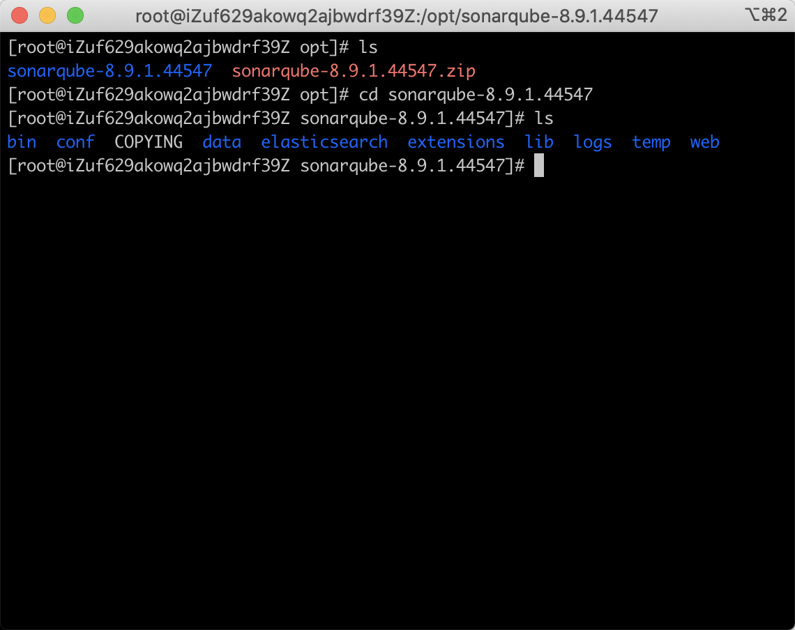

# 前端工程化之CI/CD

## 零、写在前面

这篇文章主要探讨以下几个方面：

+ CI/CD概述
+ 自动构建流程
+ 版本控制
+ 持续集成（CI）
+ 持续交付和持续部署（CD）
+ Jenkins和Travis


这是CICD的时序图，可以看到从代码开发完成到Test测试完成，这一系列的工作全部都是持续集成阶段的工作。持续交付是把测试完成的代码编译打包成为可以上线的产品，然后交付给运维人员。持续部署就是把生产包放到生产环境上，这也是整个流程中的最后一步。

这个完整的过程中有几个点需要注意：

+ CI中的测试并不是人工测试，而是自动化测试。最大可能的排除人的干扰。
+ code完之后是build，这个build的过程是在服务器上build，这是为了统一构建的环境。防止出现因为环境不同程序运行失败。
+ build完成之后我们去合并所有的代码，合并完所有的代码进行自动化测试。
+ 测试完成之后，要打一个包，交给运维。这个过程是不断的交付给运维最新的产品包。

### CICD的全景


+ 构建工具：现在的前端要求会使用市面上绝大多数的构建工具，精通Webpack、Gulp等主流工具，学会看工具的源码。
+ 版本管理：学会使用git命令，SVN比较老。
+ 缺陷管理：这是测试人员和开发人员工作上沟通的工具。一般使用jira，国产的使用禅道。
+ 文档管理：建议使用markdown，一定要让后端提供接口文档。
+ 代码质量：检查代码的质量，利于后期代码的维护。ESlint就可以帮助开发人员发现JS代码的一些隐藏的错误和代码不严谨的地方。这样就可以让我们在运行之前发现代码的错误，而不是在运行时才能发现。这就相当于把JS变成了编译型的语言。同样的HTML和CSS也有对应的Lint工具，这些工具就帮我们在运行之前检查代码错误。但是ESlint、HTML/STYLElint是单击版的，开发人员可以忽略它的报错，如果这样进入CICD流程可能会走不下去。Sonar则是一个网络版的Lint工具，也是这篇文章的主要内容。
+ 容器技术：容器就是一个环境，可以把代码直接扔进去。解决了代码运行的基本环境。对于前端比较熟悉的就是web容器，比如说nginx。我们这篇文章会简单的讲解一下docker的使用，Sonar就会装在docker中，这种方式也是比较简单的。
+ 镜像管理指的就是docker镜像。在整个流程中持续交付和持续部署都会使用到docker。持续交付就是生成docker镜像，持续部署就要把docker的镜像扔到服务器的docker环境下，把程序运行起来。这一步就是对多个版本镜像的管理。
+ 持续集成流程：持续集成的流程可以自己写脚本控制，如果流程标胶复杂就建议使用持续集成的框架设计流程，使用这种工具只需要我们设计流程的步骤，每一步需要干什么。作者使用Jenkins进行讲解。


**Sonar网络检测代码的意义：**

Sonar会把开发人员提交到git上的代码check下来，在Sonar的服务器上检测你的代码，会把检测的结果会存储在Sonar的数据库中。这样会让开发人员的错误代码曝光，错误必然会得到修改。毕竟Snoar的账号可能掌握在你的Leader手里。Sonar上的代码错误如果改不了也就不能往下执行流程。*这样就从流程和制度上保证了代码质量。*


## 一、CI&CD

CI就是持续集成，在前端工程化中CI分为四个步骤：编码、构建、集成、测试。在CI的整个过程中我们需要使用到：

1. 本地的代码编辑器。
2. 版本控制工具：Git或者SVN。
3. 自动化测试框架mocha、playWright。

CD是持续交付和持续部署，这个步骤和运维的关系是最密切的。

现代软件开发的需求加上部署到不同基础设施的复杂性使得创建应用程序成为一个 繁琐的过程。当应用程序出现规模性增长，开发团队人员变得更分散时，快速且不 断地生产和发布软件的流程将会变得更加困难。为了解决这些问题，开发团队开始探索新的策略来使他们的构建、测试和发布流程 自动化，以帮助其更快地部署新的生产。这就是持续交付和持续集成发展的由来。

### I、CI/CD的流程

我们来看一下CICD的流程图：


前两个步骤依赖Git和SVN的触发器（hock），把具体的操作脚本放在git操作的时间节点上。然后就是构建，构建完成进行自动化测试，如果测试不通过就需要用到缺陷管理工具，把bug记录到缺陷管理工具上，然后整个流程就回到了一开始。这个pipline是一个正常的流程，如果在其中的任何一个步骤出现错误，都不能继续进行下去。出错之后就会回滚。

需要注意的是我们不能完全相信这个流程，在关键的步骤需要设置关卡，让专门的人员去检查。防止流程上的漏洞。

### II、自动构建

在软件开发过程中，构建流程会将开发人员生成的代码转换为可执行的可用软件。自动构建大致分为两种：

+ 对于Go或者C语言等编译型的语言，此阶段需要通过编译器编译源代码以生成独立的二进制文件。
+ 对于JavaScript或者PHP等解释性语言，没有编译的步骤，但是代码依然要在特定的时间内冻结、绑定依赖项、打包以便分发。解释性语言虽然不需要编译器但也是有构建过程的，比如打包依赖包

开发人员可以手动构建，但是手动构建太费时费力，其次每个开发人员都在制作自己的工件，这可能导致构建过程不一致。为了解决这些问题许多开发团队配置了自动构建的流水线，这些系统监视源代码存储库，并在检测到更改时 自动启动预配置的构建过程。这一配置无需牵涉过多的人力在其中并且确保了每个构建过程一致。

### III、版本控制

版本控制系统（Version Control System，VCS），用于帮助维护项目历史记录，并行处理离散特征，以及解决存在冲突的更改。VCS允许项目轻 松采用更改并在出现问题时回滚。开发 人员可以在本地计算机上处理项目，并 使用VCS来管理不同的开发分支。

记录在VCS中的每个更改都称为提交。 每个提交都对代码库的更改进行编目分 类，元数据也包含在其中，例如关于查 看提交历史记录或合并更新的描述。

### IV、持续集成

持续集成(CI)是一个让开发人员将工作集 成到共享分支中的过程，从而增强了协作开 发。频繁的集成有助于解决隔离，减少每次 提交的大小，以降低合并冲突的可能性。

为了鼓励CI实践，一个强大的工具生态已经 构建起来。这些系统集成了VCS库，当检测 到更改时，可以自动运行构建脚本并且测试 套件。集成测试确保不同组件功能可以在一 个组内兼容，使得团队可以尽早发现兼容性 的bug。因此，持续集成所生产的构建是经 过充分测试的，并且是完全可靠的。

### V、持续交付和持续部署

持续交付和持续部署是在构建持续集成的基础之 上的两种策略。

持续交付 是持续集成的扩展，它将构建从集成测 试套件部署到预生产环境。这使得它可以直接在 类生产环境中评估每个构建，因此开发人员可以 在无需增加任何工作量的情况下，验证bug修复或 者测试新特性。一旦部署到staging环境中，就可 能需要进行额外的手动和自动测试。

持续部署 则更进一步。一旦构建在staging环境中 通过了自动测试，持续部署系统将会自动将它部 署到生产服务器上。换言之，每个通过测试的构 建都是实时的，可供用户及早反馈。这使得团队 可以不断发布新特性和修复bug，并以其测试流程 提供的保证为后盾。


## 二、Sonarqube的安装

Sonarqube是一个在线的代码检查工具，可以很好的保证团队内代码的质量。具体的流程是，开发人员将代码提交到远程仓库时，会触发Sonarqube的钩子把远程仓库的代码check到Sonarqube，然后对代码进行代码质量检查。

Sonarqube的安装有两种方式：

+ 基于真实的Java环境安装
+ 基于Docker安装

### I、基于真实Java环境安装

基于Java环境的安装是比较麻烦的，但是如果用于生产免不了公司会给你一台专门的CI服务器，这时候CI服务器上就会基于真实的Java环境去安装Sonarqube。我们在学习Sonarqube的安装时，可以使用VPS环境（云服务器），笔者使用的是阿里云服务器。一般我们使用一核心，2G内存或以上配置的VPS就完全够用。如果是1G的配置可能会稍微差一些。

+ 第一步，[下载安装JDK11](https://www.oracle.com/java/technologies/javase-downloads.html)，这是安装Sonarqube的必须环境，我们需要注意的是笔者在写这篇文章的时候JDK的最新版本是JDK16，长期支持版本（LTS）是JDK11，理论上这两个版本是都可以的，但是建议安装JDK11。在CentOS的Linux系统环境下默认安装的是OpenJDK，安装OpenJDK是不行的，他和JavaSE版本的JDK还是有细微的差别，造成很多软件注明只能跑在官方的JDK环境上。为了避免兼容性问题，我们还是下载JDK11。

  这是JDK11的官方下载网站：

  

  点击JDK Download之后会进入[选择下载版本页面](https://www.oracle.com/java/technologies/javase-jdk11-downloads.html)：

  

  点击最后一栏的下载链接会弹出下载框，接受Java下载协议：

  

  **下载之前要保证你是登录状态，如果不是请先登录在进行下载。**这时候迅雷或者chrome浏览器自带的下载工具就会进入下载，这里以chrome浏览器下载器为例说明。我们要取得JDK11的下载地址，我们最终的目的是在VPS环境下下载。所以我们只能去下载工具中获取下载地址：

  

  上文已经说到，我们得到下载地址最终会在VPS中进行下载，所以我们需要远程登录到我们自己的VPS上（远程登录的问题我们以前已经详细说过，这里就不再赘述了），使用wget 命令下载JDK11（当然你也可以在本地下载好之后上传到VPS，但是这样的话你还要搭建ftp服务器，有些麻烦）：

  

  下载完成之后我们可以执行rpm命令进行安装JDK：

```
# 注意这里的rpm命令要在你下载JDK的目录中进行，要不然会找不到jdk的rpm文件
# jdk的文件名以你下载到VPS的文件名为准

$ rpm -ivh jdk-11.11-linux-x64.rpm
```

​	安装完成之后在终端执行java命令，看是否有正确的返回：


​		如图所示，执行了在VPS环境执行了java命令之后，得到了正确的返回，这就证明java已经安装成功。

+ 第二步，下载Snoarqube，要注意这里的Sonarqube是个压缩包，下载下来直接解压就OK。但是有一个严重的问题一定要避免，那就是在启动Sonarqube的时候，Sonarqube因为集成了elasticsearch，而elasticsearch出于安全考虑是不允许在root权限下启动的。

  
  
  为了解决这个问题，我们在下载Sonarqube之前要新建一个Linux普通用户：
  
  ```
  ## 新建普通用户es
  $ adduser es
  
  ## 设置es用户的密码
  $ passwd es
  ```
  
  新创建出来的用户不包含sudo权限，所以要赋予权限：
  
  ```
  ## 更改/etc/sudoers
  
  $ vim /etc/sudoers
  ```
  
  ```
  ## /etc/sudoers
  
  ## Allow root to run any commands anywher  
  root    ALL=(ALL)       ALL  
  es  ALL=(ALL)       ALL  #这个是新增的用户
  ```
  
  这个文件是只读的，更改之后要执行wq!，进行强制保存。
  
  下载Sonarqube，[下载地址](https://www.sonarqube.org/downloads/)，如果是学习使用就下载社区版本，这个是免费的，在公司里使用就要使用企业版本。和Java下载相同的是需要获取sonarqube的社区版本的下载地址，放在VPS环境下载。
  
  然后在普通用户下的**/opt/**目录中，执行wget命令，下载Sonarqube，注意这里的wget命令需要加sudo，来暂时获取root权限才能允许下载，上文给普通用户配置权限就是为了这一步下载：
  
  ```
  $ sudo wget https://binaries.sonarsource.com/Distribution/sonarqube/sonarqube-8.9.1.44547.zip
  ```
  
  下载完成之后你会发现是一个压缩包，然后在**/opt**中解压缩：
  
  ```
  $ unzip sonarqube-8.9.1.44547.zip
  
  ## 如果是新买的阿里云服务器，可能会出现unzip命令不存在的情况，执行下列的命令安装unzip命令
  $ yum install unzip
  ```
  
  解压缩完成之后可以看到**/opt**下：
  
  

opt下存在了两个东西，一个是sonarqube的安装目录还有sonarqube的压缩文件。我们不关心压缩文件，解压出来的sonarqube由于是sudo wget命令下载的，所以sonarqube的用户组是root，如果执行sonarqube还会发生**不允许在root权限下启动**的错误，为了解决这个问题我们要更改sonarqube的用户组为当前用户es，执行：

```
## 执行这条命令也是需要root权限的
$ sudo chown -R es:es sonarqube-8.9.1.44547
```

然后验证一下，执行`ls -l`，如果用户组成为了es就说明设置成功了。进入到sonarqube的安装目录：

```
$ cd sonarqube-8.9.1.44547
```

我们ls一下可以看到：



我们主要关心的是bin目录，因为sonarqube遵从Linux软件包的标准，bin目录是启动脚本，执行：

```
$ cd bin

$ ls -l
```

我们可以看到


bin目录中有四个目录，这四个目录分别对应了四种操作系统下Sonarqube，另外一个值得注意的是由于我们在上面更改了sonarqube的用户组，现在这四个目录的用户组变成了es。四个目录分别代表了docker、linux、macos、windows四种环境。我们进入`linux-x86-64`中，可以看到：


存在三个东西，我们当前只需要关心sonar.sh，这是sonarqube的启动脚本，执行一下：

```
$ ./sonar.sh
```

执行过后终端会出现提示信息：


这说明启动sonarqube的时候要带参数，第一次启动我们要加console参数，不要直接使用start参数，因为第一次启动不能保证启动成功，如果第一次启动使用start参数，只会有一个启动完成的提示，没有启动成功或者失败的反馈，一旦启动失败如果不查看日志是无法得知的。

第一次启动执行：

```
$ ./sonar.sh console
```

启动成功你会看到SoonarQube is up：


现在说明，Sonarqube的服务已经启动成功。Sonarqube的默认启动的端口号是`9000`，假设VPS的IP地址是192.168.1.1，那么我们就可以访问**192.168.1.1:9000**来访问saonarqube的web服务。这时候如果你使用的是阿里云的服务器，那么会出现访问失败的情况，这是因为阿里云服务器出于安全考虑没有开放9000端口，解决这个问题的方法就是去阿里云官网中的控制台，登录之后找到对应的服务器然后配置安全组中的入方向安全组。


如图所示，手动添加上9000端口，再次访问就可以看到Sonarqube的登录页：


Sonarqube的默认用户名和密码都是admin。输入之后点击login即可登录完成。

但现在为止我们就在Java环境中安装上SonarQube。其实还是有些麻烦的。

### II、Docker环境安装SonarQube

未完待续...