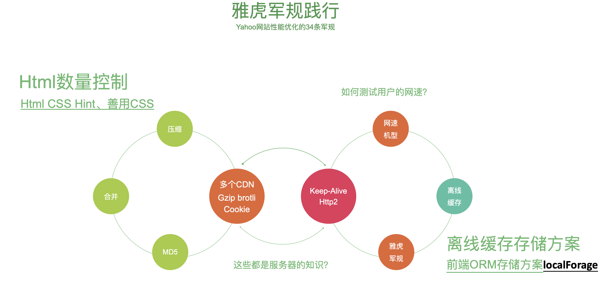
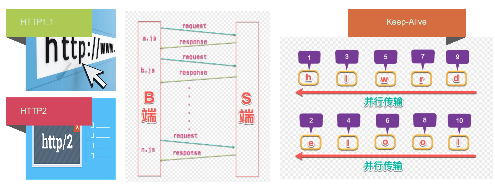
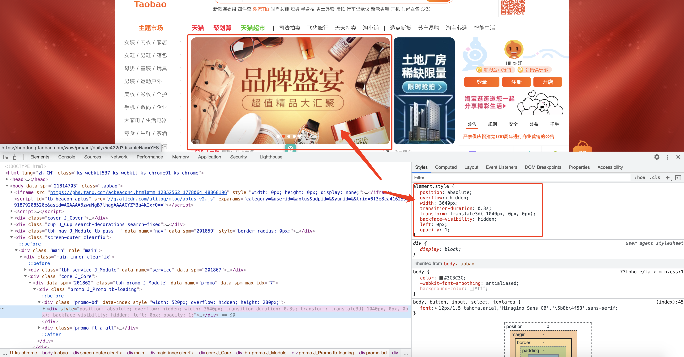

# 前端架构与性能优化那些事儿

## 零、写在前面

性能优化是大部分前端的短板，毕竟在企业里做需求的时间是最多的，大部分时间都是在赶工期，有些中小型企业对于性能的要求也并不高，所以就造成了大部分的前端工程师对于前端的性能优化了解的并不多。

随着Vue和React的风靡，大量的前端工作者都在从事B端的产品开发，做B端的产品开发也很少（其实就是没有）能涉及到前端性能优化的需求。

## 一、为什么要进行性能优化

+ 57%的用户更在乎网⻚在3秒内是否完成加载。
+ 52%的在线用户认为网⻚打开速度影响 到他们对网站的忠实度。
+ 每慢1秒造成⻚面 PV 降低11%，用户满意度也随之降低降低16%。
+ 近半数移动用户因为在10秒内仍未打开⻚面从而放弃。

这些数据都是来自性能优化的[白皮书](https://www.cdnetworks.com/resources/whitepapers/us/Global%20Web%20Performance%20Matters.pdf)。解释一下两个概念：

+ PV：Page View，即网页浏览量。
+ UV：Unique Visitor，独立访客数。

这是衡量一个网站活跃度最常用的两个指标。


## 二、性能优化学徒工

在我们刚做性能优化的阶段，去搜索殷勤上搜索现在还能搜索到一个叫**雅虎军规**的东西，这个是早些时候做性能优化必须做到的，共分为八个部分一共35条。其实性能优化就四个字：**小字为先**，只要是把所有的东西都变小，性能自然就上去了。

### I、雅虎军规

+ 内容部分：
  + 尽量减少HTTP的请求数
  + 减少DNS查找
  + 避免重定向
  + 让Ajax可缓存
  + 延迟加载组件
  + 预加载组件
  + 减少DOM元素数量
  + 跨域分离组件
  + 尽量少用ifream
  + 杜绝404
+ CSS部分：
  + 把样式表放在顶部
  + 避免使用CSS表达式
  + 选择舍弃@import
  + 避免使用滤镜
+ JS部分：
  + 去除重复脚本
  + 尽量减少Dom访问
  + 用智能的事件处理器
  + 把脚本放在底部
+ JS和CSS部分：
  + 把JS和CSS放在外面
  + 压缩JS和CSS
+ 图片部分：
  + 优化图片
  + 优化雪碧图
  + 不要用HTML缩放图片
+ Cookie部分：
  + 给Cookie减肥
  + 把组件放在不含Cookie的域下
+ 移动端：
  + 保证所有组件都小于25K
  + 把组件打包到一个复合文件里’
+ 服务器：
  + Gzip组件
  + 避免src属性为空
  + 配置Etags
  + 对ajax使用get请求
  + 今早清空缓冲区
  + 使用CDN
  + 添加上Exprice和Cache-Control

这些东西现在看来基本上都太老旧了，不过中间也有几条对于现在编写前端代码来说依然要遵从。



我们会看到雅虎军规的一个策略就是压缩，压缩就是把一个东西通过一定的手段体积变小。合并就是把多个HTTP请求合并成一个，这个和压缩是有一定的冲突的。首先加入有五个请求，把五个请求的文件压缩，文件会变小。然后合并五个请求变成一个请求，这时候文件就会变大。

**那么怎么平衡文件的大小和请求的个数呢？**

一般来说网站的并发请求上限是五个，怎么突破这个呢，那就是加CDN。比如当我们请求www.baidu.com的时候，会带一个非常大的cookie，每次请求相同域的资源都会带这个cookie，那么我们如果使用cdn就可以不带这个cookie，实现了去cookie化。权衡的结果就是我们在一个CDN的文件下不要写超过五个<scruipt>标签，如果超过了五个，剩余的就会使用chunk请求等待。如果想解决这个等待问题，就要在另一个域上新开，但是不要在同一个域上。每个JS文件的体积经过gzip之后在32Kb左右，因为webpack超过30Kb才会提取文件。

**BR和Gzip的区别：**

BR和gzip都是压缩协议，但是br对于图片的压缩效果非常好。

**离线的缓存**

前端ORM存储方案**localForage**。

+ 利用localstorage
+ Service Worker

localstorage离线缓存：

```javascript
1. {
  "a.js": "a.xx55dd.js"
}

2.启动JS
function 注入缓存() {
  a.js -> a.xx55dd.js
  a.xx55dd.js -> js.内容
}

if(本地是否有缓存) {
  if(过期) {
    1.加载a.xx55dd.js
    2.清理缓存
    	注入缓存
	}else {
		直接走缓存
  }
}else {
  1.加载a.xx55dd.js
  2.再次请求这个资源 fetch("a.xx55dd.js");
  注入缓存
}

3.service work
```

这就是使用简单的localStorage来做离线缓存。有很多的一线公司也是这么做的。


### II、缓存策略

**缓存的优先级：**

cache-control  > ecprise > etag > last-modified

+ cache-control：**强制缓存**

  设置过期的时间⻓度(秒)，在这个时间范围内，浏览器请求都会直 接读缓存。当 expires 和 cache-control 都存在时，cache-control 的 优先级更高。

+ ecprise：**强制缓存**

  \* expires: Thu, 16 May 2019 03:05:59 GMT
   在 http 头中设置一个过期时间，在这个过期时间之前，浏览器的请求都不会发出，而是

  自动从缓存中读取文件，除非缓存被清空，或者强制刷新。缺陷在于，服务器时间和用 户端时间可能存在不一致，所以 HTTP/1.1 加入了 cache-control 头来改进这个问题。

+ etag / if-none-match：

  这也是一组请求/相应头 

  **响应头:**
   etag: "D5FC8B85A045FF720547BC36FC872550" 

  **请求头:**
   if-none-match: "D5FC8B85A045FF720547BC36FC872550"

  原理类似，服务器端返回资源时，如果头部带上了 etag，那么资源下次请求时就会把值加入到请求头 if-none-match 中，服务器可以对比 这个值，确定资源是否发生变化，如果没有发生变化，则返回 304。

+ last-modified / if-modified-since：

  这是一组请求/相应头

  **响应头:**

  \* last-modified: Wed, 16 May 2018 02:57:16 GMT 01 

  **请求头:**

  if-modified-since: Wed, 16 May 2018 05:55:38 GMT

  服务器端返回资源时，如果头部带上了 last-modified，那么 资源下次请求时就会把值加入到请求头 if-modified-since 中，服务器可以对比这个值，确定资源是否发生变化，如果 没有发生变化，则返回 304。

### III、网站协议

**HTTP2多路复用**。浏览器请求//xx.cn/a.js-->解析域名—>HTTP连接—>服务器处理文件—>返回数据-->浏览器解析、渲染文件。Keep-Alive解决的核心问题就在此，一定时间内，同一域名多次请求数据，只建立一次HTTP请求，其他请求可复用每一次建立的连接通道，以达到提高请求 效率的问题。一定时间是可以配置的，HTTP1.1还是存在效率问题，

第一个:串行的文件传输。

第二个:连接数过多。

HTTP/2对同一 域名下所有请求都是基于流，也就是说同一域名不管访问多少文件，也只建立一路连接。同样Apache的最大连接数为300，因为有了 这个新特性，最大的并发就可以提升到300，比原来提升了60倍!




## 三、一些小题目

**第一题：JS代码的执行对于HTML代码解析和渲染的影响。**

```html
<!DOCTYPE html>
<html lang="en">
<head>
  <meta charset="UTF-8">
  <meta http-equiv="X-UA-Compatible" content="IE=edge">
  <meta name="viewport" content="width=device-width, initial-scale=1.0">
  <title>DOM加载</title>
</head>
<body>
  <h1>标题</h1>
  <script type="text/javascript">
    // 这段JS代码对于HTML的解析和渲染会有什么影响？
    prompt("测试");
  </script>
</body>
</html>
```

实际上这段JS的代码会影响到HTML的渲染，但是不会影响到HTML的解析。

**第二题：CSS的加载会不会影响HTML的渲染和解析吗？**

```html
<!DOCTYPE html>
<html lang="en">
<head>
  <meta charset="UTF-8">
  <meta http-equiv="X-UA-Compatible" content="IE=edge">
  <meta name="viewport" content="width=device-width, initial-scale=1.0">
  <style>
    h1 {
      color: red !important;
    }
  </style>
  <script>
    function h() {
      console.log(document.querySelectorAll('h1'));
    }
    // 这里使用定时器是为了不影响HTML的解析
    setTimeout(h, 0);
  </script>
  <link href="https://cdn.bootcdn.net/ajax/libs/twitter-bootstrap/5.0.2/css/bootstrap.css" rel="stylesheet">
  <title>CSS的加载会不会影响HTML的渲染和解析</title>
</head>
<body>
  <h1>这是红色的</h1>
</body>
</html>
```

这个demo如果在网络环境不好的情况下运行，会得到一个结论CSS的加载会影响HTML的渲染，但是不会影响HTML的解析。

**第三题：CSS的加载会阻塞JS代码的执行吗？**

```html
<!DOCTYPE html>
<html lang="en">
<head>
  <meta charset="UTF-8">
  <meta http-equiv="X-UA-Compatible" content="IE=edge">
  <meta name="viewport" content="width=device-width, initial-scale=1.0">
  <script>
    console.log('before css load');
  </script>
  <link href="https://cdn.bootcdn.net/ajax/libs/twitter-bootstrap/5.0.2/css/bootstrap.css" rel="stylesheet">
  <title>CSS的加载会阻塞JS代码的执行吗？</title>
</head>
<body>
  <h1>这是红色的</h1>
  <script>
    console.log('after css load');
  </script>
</body>
</html>
```

这个demo如果在网络环境不好的情况下运行，会得到一个结论CSS的加载会影响JS代码的执行。在浏览器的控制台上会先打印出`before css load`，然后等到CSS加载完成之后再打印`after css load`。为什么JS要等CSS加载完成才会执行呢？因为浏览器不能确定JavaScript是否需要CSS的类名，造成页面的重排和重绘。

**第四题：CSS会不会阻塞domready？**

这个问题要分两种情况讨论：

+ 如果CSS后面没有JS代码，那么CSS的加载不会影响DOMReady。
+ 如果CSS后面有JS代码，那么CSS的加载会影响DOMReady。

```html
<!DOCTYPE html>
<html lang="en">
<head>
  <meta charset="UTF-8">
  <meta http-equiv="X-UA-Compatible" content="IE=edge">
  <meta name="viewport" content="width=device-width, initial-scale=1.0">
  <title>Document</title>
  <script>
    document.addEventListener('DOMContentLoaded', function() {
      console.log('DOMContentLoaded');
    })
  </script>
  <link rel="stylesheet" href="">
  <script>
    console.log('到我了没');
  </script>
</head>
<body>
  
</body>
</html>
```

现在都提倡CSSinJS或者CSS inline，就是因为这个原因。

**这四个问题建议查一下资料好好研究一下，这是基础中的基础。**


## 四、在渲染中的性能优化


有关于渲染过程的性能优化问题，这张图中全部包括，而且这张图也是前端性能优化必须要理解透彻的一张图。

先上一段代码：

```html
```

我们可以对着浏览器的解析过程和火焰图进行分析：

+ 网页是分层的

  + 获取dom元素进行分层
  + 对每个图层进行样式计算 Recalculate Style
  + 对每个节点生成图形的位置 Layout
  + 将每个节点绘制填充到图层的位图中 Paint
  + 把图层作为纹理上传给CPU，纹理是CPU给GPU最小的bitMAP，GPU对纹理再进行偏移、缩放等。
  + Composite Layers 将符合的图层生成屏幕的图像。
  + Composite Layers 具体的工作是什么？
    + 主线程把绘制列表commit到合成线程
    + 合成线程会根据viewport切成tile，256 * 256， 512*512。
    + 把小图块生成位图（光栅化，raster），生成之后保存在GPU中。
    + 合成线程会生成一个绘制土块的命令 DrawQuad。发送这个命令给浏览器的进程。
    + 浏览器中的viz组件接收到DrawQuad命令生成页面
    + 首次合成图像的时候会生成低分辨率的图

+ 先是Layout（重拍）、Paint（重绘）、Composite Layers（合成）。

+ 什么东西会独立生成`层`？

  + 根元素
  + position
  + transform
  + 半透明
  + CSS滤镜
  + canvas
  + Video
  + Overflow

+ GPU在遇到下面这几个独立生成层的情况之后会直接参与，跨过重绘和重排（**要注意和上面的独立生成层是不一样的！！！**）：

  + CSS3D
  + Video
  + WebGL
  + Transform
  + CSS滤镜
  + will-change：transform

  根据我们列出来的能让GPU直接参与的情况我们举一个淘宝轮播图的例子：

  

  我们可以看到淘宝的主页轮播图，CSS的样式编写，在一般情况下我们写轮播图直接绝对定位，然后使用left或者right进行左右的移动就可以实现，但是淘宝的轮播图却多添加了一些有关于transform的样式，还设置了`translate3d`这样的CSS3D样式，这就是为了性能做考虑，因为单纯使用left或者right会触发渲染进程的重绘和重排，这无疑是对性能的浪费。让轮播图使用transform进行独立成层之后会让GPU直接参与进来跳过DOM的重绘和重排直接进入合成层。实现了性能优化，直接用GPU实现了硬件加速。

+ 哪些情况会造成重排（重排一定会造成重绘）：

  + 读offset、scroll、clientT、width这几个属性的时候浏览器会立马会放弃优化的队列，造成重排。
  + 盒子模型大小的变化，一定会造成重排。所以我们在进行设置盒子模型的时候会优先使用怪异盒模型在一定程度上能减少盒子大小的变化。

+ 我们可以把写放在requestAnimationFrame中，等到下一帧的时候在写入。

+ 推荐一个很牛的库**gpu.js**。

然后，我们来看一下**渲染流程总结**这张图：

当我们设置`div.style.height="xxx"`的时候，浏览器主线程会首先找到相应的DOM节点，然后改变节点上的Style块，更改了Render Tree。然后进行重排（layout）生成Layer树，进行重绘（paint）。然后浏览器合成线程（非主线程），接收小的tiles进行栅格化生成图片，通过draw quad进行绘制。

现在我们再看一下右半边的渲染进程的图示：

主线程就是DOM tree生成Render tree进行重排生成Layer tree和重绘（Paint），到了这里CPU的所有工作已经全部做完了。重绘完成之后进行Commit，交给合成线程把viewport生成小的tiles，但是tiles不能直接显示，需要进行光栅化，光栅化之后会进行CPU的raster，现在所有的图片都在GPU的显存中，然后GPU发送一个draw quad命令给浏览器的进程，浏览器把GPU中的小图片取出来显示（display）在显示器上。


## 五、我们能够用性能优化的理论做点什么？


### I、开发一款mini性能监控平台统计页面核心指标

### II、使用X-TAG完成直接刷新页面SSR切页SPA

+ 纯粹的SPA
+ 纯粹的MPA
+ MPA + SPA：假路由 + 真路由
+ MPA + SPA（自己开发、两套模板swig + vue）、next.js、nuxt.js


spa：

优点：

1. 切页的资源不重新加载。
2. vuex的状态公用

缺点：

1. 白屏（这个问题很严重！！！）

   原因：加载出index.js的时候看不到页面内容，需要加载完vue.min.js和vue相关的库，webpack公用文件，main.js、fetch，构建虚拟dom diff、patch页面、初始化事件引擎之后才能看见页面，中间的时间就会出现白屏。

2. SEO


mpa：

优点：

1. 所见即所得
2. 一次到位  直出

缺点：

1. 路由切换之后资源重新加载
2. index.html重，bigpie、quicklink


如何把两者的有点结合起来？

我们可以自己写一个系统，判断路由的切换：

+ 站内的切换就返回js、html、css
+ 如果是刷新则是ctx.render()

```javascript
if(站内切换) {
  {
    js,
    css,
    html
  }
}else {
  ctx.render();
}
```

这也就是同构框架的原理。

### III、使用localForage+basket.js完成前端缓存的管理