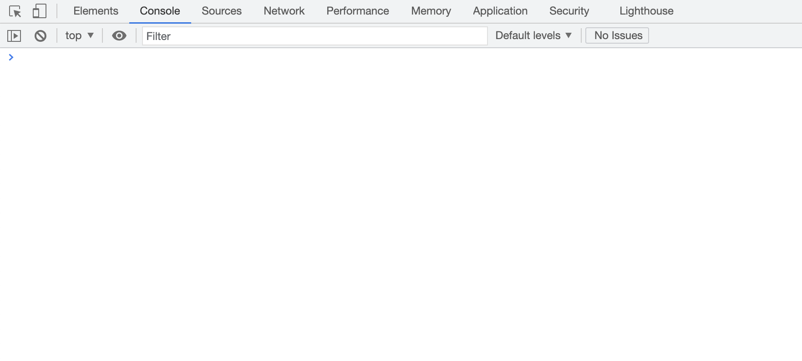
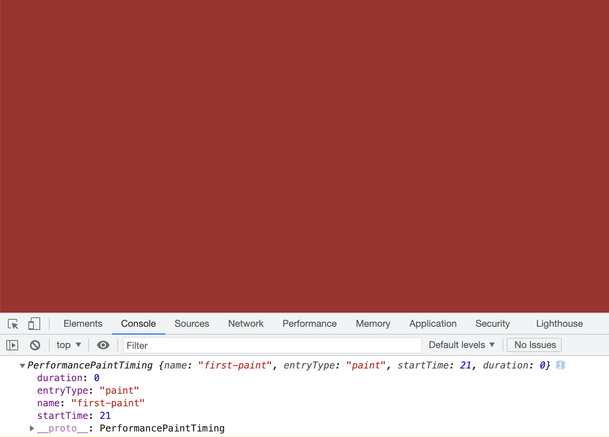
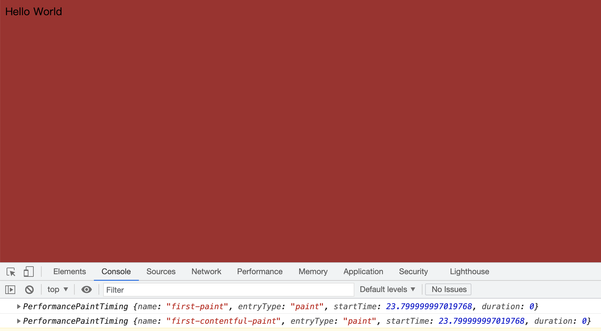
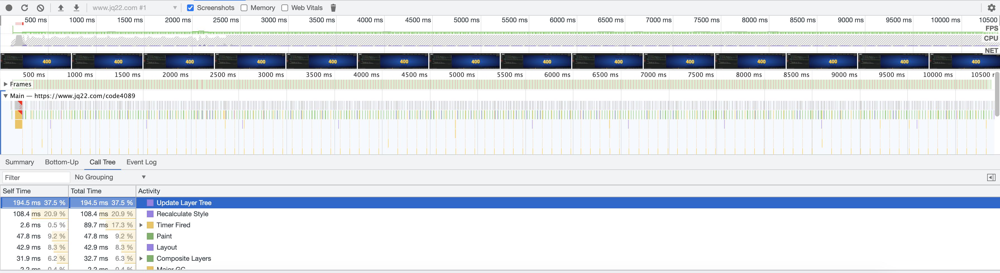
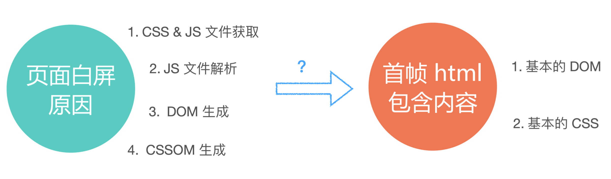
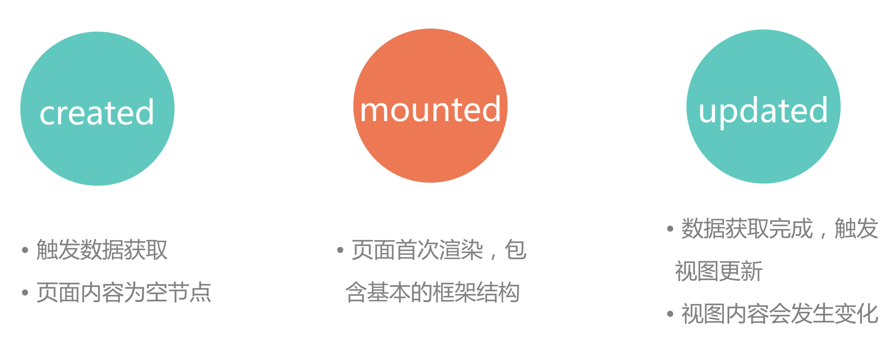
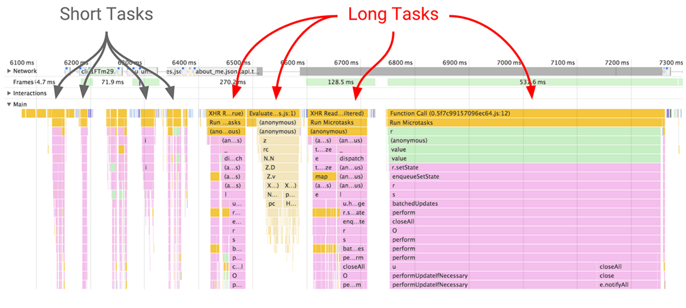
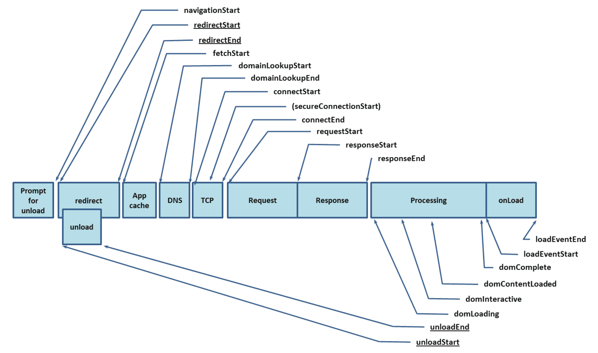
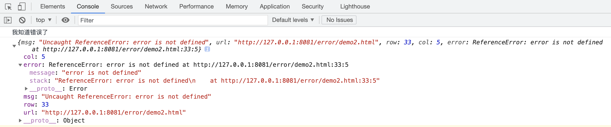

# 手摸手从零实现前端监控SDK


## 零、写在前面

前端开发者如果想找一个比较好的公司或者团队，在面试中展示自己，或者想跟面试官侃侃而谈的时候，如果缺了前端性能监控这一块，那么就会稍微显得有些不足。那么如果想在前端性能这一方面跟别人吹点儿干货，那么就要有一些自己实实在在的东西。毫无疑问前端性能监控的SDK是一个大杀器。

通过手动实现前端性能监控的SDK我们也可以对前端的性能优化的技术指标有一个非常清晰的认知。


## 一、你必须知道的概念

**核心的概念：**

+ **TTFB：**Time To First Byte，首字节时间。
+ **FP：**First Paint，首次绘制。
+ **FCP：**First Content Paint，首次有内容的绘制。
+ **FMP：**First Meaningful Paint，首次有意义的绘制。**（注意：这个指标已经废弃了！！）**
+ **TTI：**Time To Interactive，可交互时间。
+ **Long tasks：**超过50ms的任务。
+ **SSR&&CSR：**服务端渲染和客户端渲染。
+ **Isomorphic JavaScript：**同构化。


**必须知道的概念：**

+ **LCP（Largest Contentful Paint）：**最大内容绘制，用于记录视窗内最大元素的绘制时间。该时间会随着页面渲染的变化而变化，因为视窗内的最大元素在渲染过程中可能会发生变化，另外该指标会在用户第一次交互后停止记录。
+ **FID（First Input Delay）：**首次输入延迟。记录在FCP和TTI之间用户首次与页面交互时响应的延迟。React中的Fiber专门解决FID。
+ **TBT（Total Blocking Time）：**阻塞总时间。记录FCP和TTI之间所有长任务的阻塞时间的总和。
+ **CLS（Cumulative Layout Shift）：**累计位移偏移。记录了页面上非预期的位移波动。使用按钮动态添加了某个元素，导致了页面上其他元素的位置发生了偏移。造成了页面看着不爽。CLS代表了页面的稳定指标。


**核心的任务指标：**

+ **LCP：**LCP代表了页面的速度指标，能体现的东西更多一些。一是指标实时更新，数据更精确。二是代表页面最大元素的渲染时间，最大元素的快速载入能让用户感觉性能还挺好。
+ **FID：**FID代表页面的交互体验指标，交互响应的快会让用户觉得网页流畅。
+ **CLS：**CLS代表了页面的稳定指标，尤其在手机上这个指标更为重要。因为手机屏幕挺小，CLS的值如果过大会让用户觉得页面体验做的很差。


如果想要知道这些指标的详细情况，可以看一下Chrome的[WebDev官网](https://web.dev/)了解一下。

如果想要统计这些性能指标，浏览器也提供了很多API，这些API都是FRP的形式，也就是说全部都是响应式编程，是一些Observe。比如说我们想要统计一下FP和FCP这两个指标我们就可以使用对应的API进行统计。

+ IntersectionObserver
+ PerformanceObserver
+ Performance.timing：这个主要统计的是一些同步的数据，Observe统计的是异步的数据。

我们来写一个Demo，监听用户数据指标：

```html
<!-- demo/demo.html -->
<!DOCTYPE html>
<html lang="en">
<head>
  <meta charset="UTF-8">
  <meta http-equiv="X-UA-Compatible" content="IE=edge">
  <meta name="viewport" content="width=device-width, initial-scale=1.0">
  <title>监听用户数据指标</title>
</head>
<body>
  <script src="./fp.js"></script>
</body>
</html>
```

```javascript
// demo/fp.js

const observer = new PerformanceObserver((list) => {
  for(const entry of list.getEntries()) {
    console.log(entry);
  }
});

observer.observe({
  entryTypes: ["paint"],
});
```

然后我们使用`http-server`启一个服务器来运行这个网页（[http-server下载地址](https://www.npmjs.com/package/http-server)）。

```shell
## 安装并运行
## 安装http-server
$ npm install http-server -g

## 进入到项目的根目录下
$ http-server
```



我们会发现浏览器中什么都没有输出，这是因为html里面什么都没有，没有像素点的落点渲染，所以不会有任何的指标输出’。

然后我们改一下HTML代码：

```html
<!-- demo/demo.html -->
<!DOCTYPE html>
<html lang="en">
<head>
  <meta charset="UTF-8">
  <meta http-equiv="X-UA-Compatible" content="IE=edge">
  <meta name="viewport" content="width=device-width, initial-scale=1.0">
  <title>监听用户数据指标</title>
  <style>
    body {
      background-color: red;
    }
  </style>
</head>
<body>
  <script src="./fp.js"></script>
</body>
</html>
```

把body的背景设置成了红色，然后再看控制台的输出：



可以看到控制台输出了FP的指标信息，这是由于设置了body为红色，所以有了第一次渲染的像素落点。`duration: 0`是因为渲染的速度太快，可以忽略不计。

我们再来改一下HTML：

```html
<!-- demo/demo.html -->
<!DOCTYPE html>
<html lang="en">
<head>
  <meta charset="UTF-8">
  <meta http-equiv="X-UA-Compatible" content="IE=edge">
  <meta name="viewport" content="width=device-width, initial-scale=1.0">
  <title>监听用户数据指标</title>
  <style>
    body {
      background-color: red;
    }
  </style>
</head>
<body>
  <div id="app"></div>
  <script src="./fp.js"></script>
</body>
</html>
```

我们在写Vue的时候，经常会这么写，我们来看一下控制台的输出：


我们会发现和没有加div的时候是一样的，这是因为虽然有了元素，但是没有任何内容，所以除了FP，不会有其他的指标输出。

我们再来改一下HTML文件：

```html
<!-- demo/demo.html -->
<!DOCTYPE html>
<html lang="en">
<head>
  <meta charset="UTF-8">
  <meta http-equiv="X-UA-Compatible" content="IE=edge">
  <meta name="viewport" content="width=device-width, initial-scale=1.0">
  <title>监听用户数据指标</title>
  <style>
    body {
      background-color: red;
    }
  </style>
</head>
<body>
  <div id="app">Hello World</div>
  <script src="./fp.js"></script>
</body>
</html>
```

再来看一下浏览器控制台的输出：



我们会发现除了FP，控制台还输出了FCP，这是因为页面已经有了渲染的内容，所以会有第一次内容绘制的指标输出，相同的是`duration: 0`，这是因为渲染的时间太短，可以忽略不计。

我们清楚了这几个指标的之后，最重要的就是要学会看火焰图：



我们从火焰图中会发现，我们的网页是逐帧渲染的，实际上就是一张张的图片拼起来的。我们将要做的性能监控SDK，做完之后得到的数据也要和火焰图进行对比，如果得到的数据和火焰图相符就说明我们的性能监控的数据是准确的。

**在我们平常的面试中有一个出现频率非常高的面试题：网页为什么会白屏？**

关于这个问题我们在`前端架构与性能优化那些事儿`这篇文章中谈到SPA的优缺点时，分析了SPA白屏的原因，是因为要加载的资源太多，当我们强求到index.html的时候并不会有任何实质性的渲染，要等到SPA需要的所有资源全部加载完成之后才会进行网页的渲染，资源加载的时间自然也就出现了白屏的问题。

如果是一个多页应用的话，点击链接会跳到下一个页面，这样的话就会造成资源的重新加载，用户需要等待，资源加载的事件长了也会出现白屏，那么针对这个问题有一个库可以解决，那就是quicklink库，这是Google出的一个可以提升网页访问速度的库 ，基本原理就是当我们访问当前网页的时候，quicklink会把当前网页出现在视窗内的所有链接全部load下来。同时这种方式也带来一个问题，如果链接的数量太多一下子load下来这也是一个很大的隐患。

[quicklink-github](https://github.com/GoogleChromeLabs/quicklink)，感兴趣的可以详细的了解一下quicklink。

那么怎么解决上文中说到的quicklink的隐患呢？我们可以使用guess-js的库，guess-js顾名思义就是猜，你可以把近一年的所有的用户的使用习惯数据给guess，让guess-js来模拟出用户频率最高的操作，比如说当用户在列表页的时候，最常见的就是去详情页，guess-js获取到这个信息，就可以有选择的只把详情页prefetch一下。这些已经属于Web AI的范畴。

[guess-js](https://github.com/guess-js/guess)，感兴趣的可以详细的了解一下guess-js。

**一张图解释为什么会出现白屏：**



**关于Vue2的执行：**

+ created：
  + 触发数据获取
  + 页面内容为空节点
+ mounted：
  + 页面首次渲染，包含基本的框架结构。
+ updated：
  + 数据获取完成，触发视图更新。
  + 视图内容发生变化。



**前端还要监听Long Task**



我们主要是要注意这些**紫色**的。

**当面试官问到有关浏览器渲染的前端优化的时候，要牢记NavigationTiming的图：**



一个经典的面试题就是：从输入url敲回车到页面渲染完成经过什么步骤？这个面试题基本上可以考察一个前端开发者的功底，前端小白和有经验的前端开发者的回答是肯定不一样的。可以回答的很简单，也可以回答的巨详细。

### 总结

|          |                             CSR                              |                            预渲染                            |                       SSR                       | 同构                                                         |
| :------: | :----------------------------------------------------------: | :----------------------------------------------------------: | :---------------------------------------------: | ------------------------------------------------------------ |
| **优点** | 1. 不依赖数据。2.FP时间快。 3. 客户端用户体验好。 4. 内存数据共享 | 1. 不依赖数据。2. FCP时间比CSR快。 3. 客户端用户体验好。4. 内存数据共享。 | 1. SEO友好。2. 首屏性能高，FMP比CSR和预渲染快。 | 1.SEO友好。2. 首屏性能高，FMP比CSR和预渲染快。3. 客户端用户体验好。4. 内存数据共享。5. 客户端与服务端代码共享开发效率高。 |
| **缺点** |                1. SEO不友好。 2. FCP、FMP慢。                |                   1.SEO不友好。 2. FMP慢。                   |    1. 客户端数据共享成本高。2.模板维护成本高    | Node容易形成性能瓶颈                                         |

我们看CSR的优点，有一条是FP的时间快，这是因为现在webpack或者其他的一些打包的工具，会做CSS inline，那么必然的只要是加载HTML，FP就完成了，所以FP的时间快！而且现代浏览器中CSS的加载会影响DOM ready和JS的执行，如果做了CSS inline就不会出现这个问题。

同构在初期的时候性能是很差的，骂声一片，直到现在很多公司对同构化的开发还是保持一种观望的状态。但是同构这样的大一统的方式实际上确实是好的。


## 二、错误的捕获

我们先来看一个例子：

```html
<!DOCTYPE html>
<html lang="en">
<head>
  <meta charset="UTF-8">
  <meta http-equiv="X-UA-Compatible" content="IE=edge">
  <meta name="viewport" content="width=device-width, initial-scale=1.0">
  <title>Document</title>
</head>
<body>
  <script>
    throw Error('抛出错误');
    console.log(1);
  </script>

  <script>
    console.log(2);
  </script>
</body>
</html>
```

这里我们思考一个问题：**`console.log(2)`是否还能正常输出111？**

答案是肯定的，console.log(2);能够正常的输出。这是因为`console.log(1)`和`console.log(2)`属于不同的`<script>`标签，是不同的JS代码段，在浏览器中每一个JS的代码段都是一个宏任务，互相不受影响，所以`console.log(2)`能够正常执行。那么对于`console.log(1);`毫无疑问是不能正常执行的，那么既然不能正常执行，为了保证程序不至于崩溃，我们需要使用`try...catch`来进行捕获。

```html
<!DOCTYPE html>
<html lang="en">
<head>
  <meta charset="UTF-8">
  <meta http-equiv="X-UA-Compatible" content="IE=edge">
  <meta name="viewport" content="width=device-width, initial-scale=1.0">
  <title>Document</title>
</head>
<body>
  <script>
    try {
      throw Error('抛出错误');
    	console.log(1);
    }catch(e) {
      console.log('我知道错了');
      console.log(e);
    }
  </script>

  <script>
    console.log(2);
  </script>
</body>
</html>
```

这样的话是可以捕获到错误的，但是`try...catch`也不是什么错误都可以捕获，有些语法错误就不可以捕获：

```javascript
try {
  var data = ；// 大写分号
}catch(e) {
  console.log('捕获不到错误');
  console.log(e);
}
```

`try...catch`捕获不到异步的错误：

```javascript
try {
  setTimeout(() => {
    error;
  });
}catch(e) {
  console.log('捕获不到异步错误');
  console.log(e);
}
```

**如何捕获异步错误？**使用onError

```javascript
// window.onerror 捕获异常的能力比try...catch稍微强一点
// 无论是异步还是非异步的错误，onerror都能捕获到运行时错误。
/**
     * @param {String} msg    错误信息
     * @param {String} url    出错文件
     * @param {String} row    行号
     * @param {String} col    列号
     * @param {String} error  错误详细信息 
    */
window.onerror = function(msg, url, row, col, error) {
  console.log('我知道错误了');
  console.log({
    msg,
    url,
    row,
    col,
    error
  });
  return true;
}

setTimeout(() => {
  error;
});
```



我们可以看到浏览器的输出，证明onerror是可以捕获到异步错误的。我们使用try...catch和window.onerror可以解决大部分的错误捕获，但是在前端还有一种错误是任何办法都没有的，肯定会在浏览器爆红，那就是服务器的资源404或者500：

```html
<!DOCTYPE html>
<html lang="en">

<head>
  <meta charset="UTF-8">
  <meta http-equiv="X-UA-Compatible" content="IE=edge">
  <meta name="viewport" content="width=device-width, initial-scale=1.0">
  <title>Document</title>
</head>

<body>
  

  <script>
    window.addEventListener('error', function (msg, url, row, col, error) {
      console.log('我知道错误了');
      console.log({
        msg,
        url,
        row,
        col,
        error
      });
      return true;
    }, true);
  </script>
</body>

</html>
```

**全局去捕获Promise error**

```html
<!DOCTYPE html>
<html lang="en">
<head>
  <meta charset="UTF-8">
  <meta http-equiv="X-UA-Compatible" content="IE=edge">
  <meta name="viewport" content="width=device-width, initial-scale=1.0">
  <title>Document</title>
</head>
<body>
  <script>
    // 全局去捕获Promise error
    window.addEventListener('unhandledrejection', function(e) {
      e.preventDefault();
      console.log('我知道Promise的错误');
      console.log(e.reason);
      return true;
    });

    Promise.reject('promise error').catch((err) => {
      console.log(err);
    });

    new Promise((resolve, reject) => {
      reject('promise error');
    }).catch(err => {
      console.log(err);
    });

    new Promise((resolve) => {
      resolve();
    }).then(() => {
      throw 'promise error';
    });

    new Promise((resolve, reject) => {
      reject(123);
    });
  </script>
</body>
</html>
```

我们可以使用`unhandledrejection`这个API来捕获Promise的错误，可以捕获到catch中的以及reject中的错误。

**关于日志：**

+ navigator.sendBeacon 传送，新型的API。
+ img.src = "xxxx.gif?data=序列化"，img通常是一台独立的CDN，不会占API服务器的并发。
+ fetch
+ ajax


## 三、从 0 到 1 TS开发前端监控SDK

+ 代理用户所有的点击事件
+ [xpath]