# 现代化CSS方法论


## 零、写在前面

作为前端开发者，对CSS可以说是非常熟悉，可是事实真的是像我们的感觉一样吗？笔者认为不见得是这样。这篇文章当然不会讲具体的CSS语句怎么使用或者CSS的效果，而是探讨一下**CSS Work Flow（CSS 工作流）**。

### 文章概要：

本文主要是将两个方面：

+ CSS预处理器
+ CSS后处理器


## 一、CSS预处理器

### I、CSS预处理器的概念以及发展

首先，我们要明确一个概念什么是**CSS预处理器**。

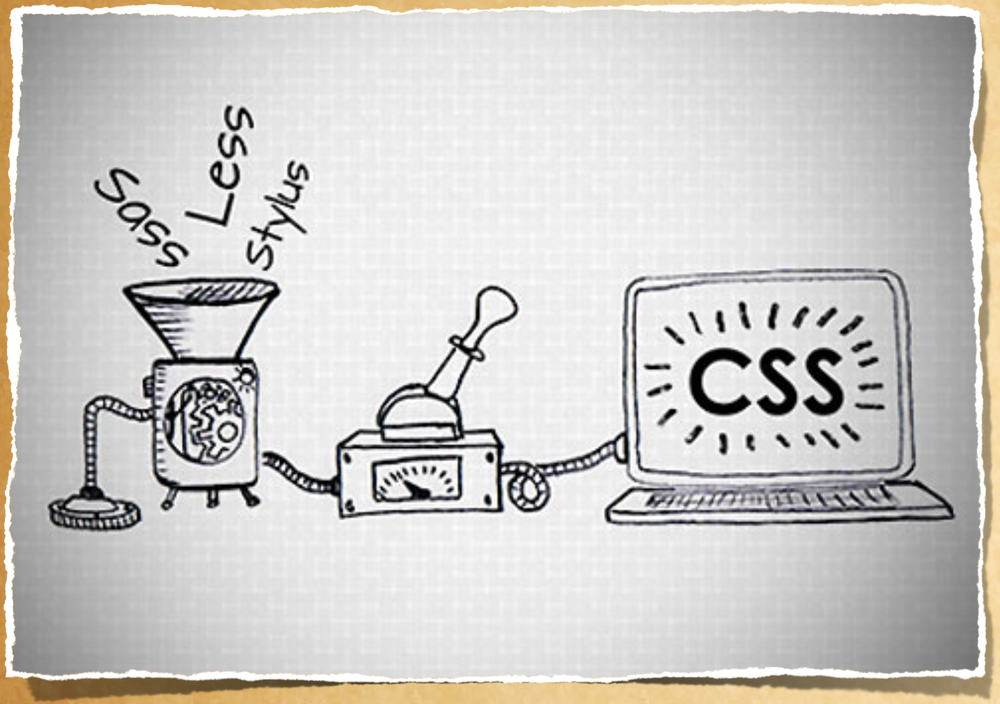

如图所示，CSS预处理器是处理特定格式的源文件到目标CSS的处理程序。我们平时使用的最多的CSS预处理器有Sass、Less、Stylus等。CSS预处理器和计算机语言一样也经过了很多年的发展：

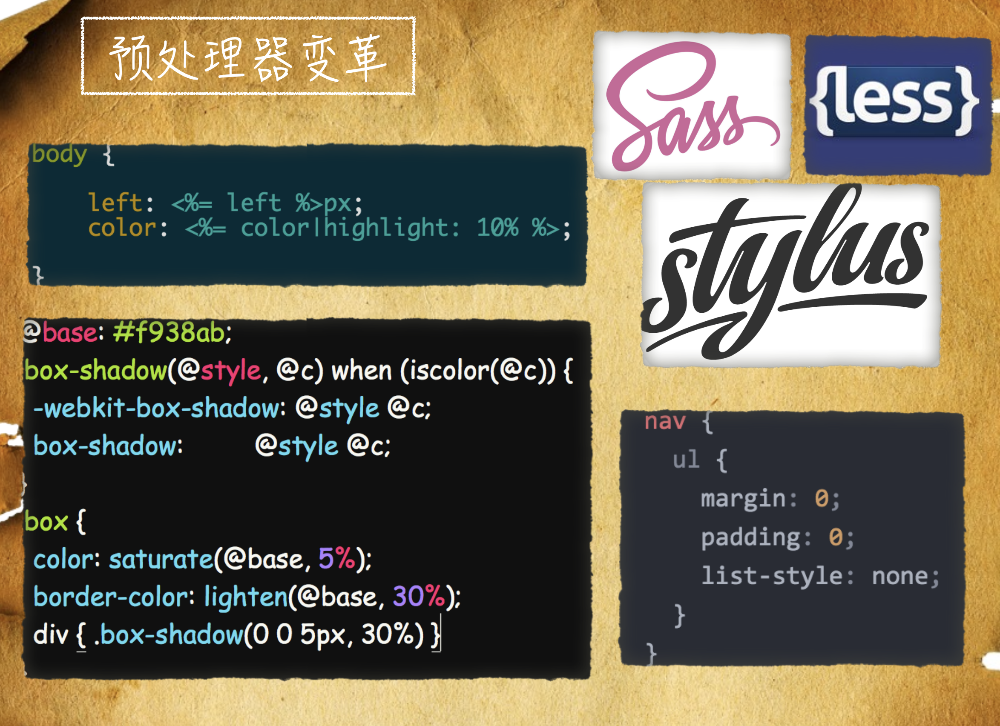

刚开始的阶段，CSS的预处理器采用了类似于后端语言模板的形式，类似于PHP的模板语法。把一些CSS的数据用变量表示，交给后端语言去Render。

第二个阶段就出现了著名的CSS预处理器Sass和Less。就现在来说，Sass太重了，很少有人用到Sass。相对于Sass，Less轻量了很多。往后又出现了Stylus。类似于这三者的CSS预处理器的好处是在编写的时候很舒服，可以使用程序设计语言中的逻辑来编写CSS。但是缺点也是显而易见的，这种写法需要编译成CSS，有性能负担并且编译完的CSS不利于阅读。

CSS发展到现在也没有出现CSS4、5等等，统一叫做**CSS Next**。CSS Next就是综合了一些CSS预处理器的优秀的语法，这也是我们需要掌握的现代CSS。


### II、预处理器的常用规范

一个CSS预处理器必然会有以下这些规范：

+ 变量
+ 混合（Mixin）继承（Extend）
+ 嵌套规则
+ 运算
+ 函数
+ 命名空间和访问器（Namespace & Accessors）
+ 作用域（Scope）
+ 注释

现代的CSS已经可以完全的实现这些规范，所以我们就没有必要再使用CSS预处理器了，直接使用CSS原生的语法来实现这些功能。这样就是省去了构建CSS的过程。这样一来CSS预处理器在CSS Next出现之后就失去了存在的意义。


## 二、CSS后处理器

首先明确一个概念：**什么是CSS后处理器？**我们在使用CSS预处理器构建完目标CSS之后，CSS后处理器对于目标CSS进行进一步的加工处理，包括**添加浏览器前缀、压缩等**操作，这就是CSS后处理器。

### I、CSS后处理器的作用

+ CSS压缩 CLEAN-CSS
+ 自动添加浏览器前缀Autoprefixer
+ CSS更加美观 CSScomb
+ Rework取代Stylus后处理器发热
+ PostCSS 既是预处理器又是后处理器

这样的工作流程存在这一个极大的问题，如果CSS预处理器的源文件出现了问题，导致CSS预处理器构建的目标CSS出现错误，那么CSS后处理器将无能为力。

**CSS预处理器（上半部分）和PostCss（下半部分）工作流程：**

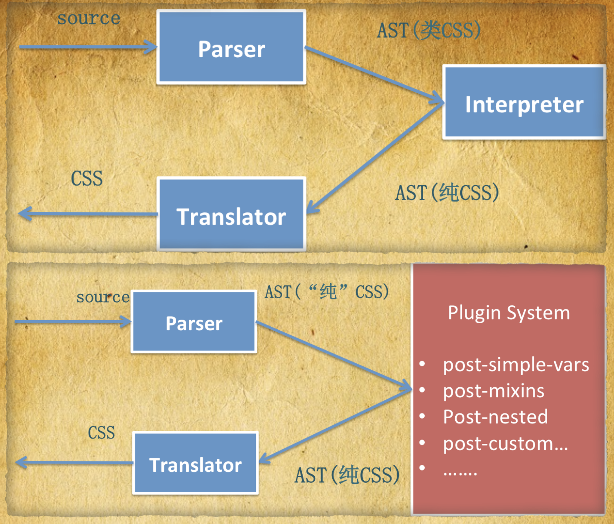

我们先看上半部分：

+ CSS预处理器会把源文件解析成**类CSS的抽象语法树**。
+ 类CSS的抽象语法树经过编译生成**纯CSS的抽象语法树**。
+ 纯CSS的抽象语法树经过编译生成目标CSS。

我们主要看下半部分**（下半部分才是POSTCSS的流程）**：

+ 源文件通过预处理器的解析，生成**纯CSS的抽象语法树**（要注意这里和一般的CSS预处理器处理方式不同）。
+ 纯CSS的抽象语法树经过PostCSS的的PluginSystem（插件系统）的处理生成**纯CSS的抽象语法树（这一步的处理没有改变本质的结构，只是使用插件做了处理）**。
+ 然后经过翻译，生成最终的CSS。

我们从图上可以看出PostCSS只是把CSS做成一棵抽象语法树。别的都利用插件来完成。这样的话我们可以放心大胆的使用**”未来的CSS“**也就是CSS Next，然后再使用PostCSS把我们的CSS处理成绝大多数浏览器都认识的CSS。


### II、CSS Next

```css
/* CSS变量 */
:root {
--fontSize: 1rem;
--mainColor: #12345678;
--highlightColor: hwb(190, 35%, 20%);
}

/* custom properties set & @apply rule */
:root {
  /* CSS类 */
  --centered: {
    display: flex;
    align-items: center;
    justify-content: center;
  };
}

.centered {
  /* 应用了centered类 */
  @apply --centered;
}

/* 自定义媒体查询 */
@custom-media --viewport-medium (width <= 50rem);

/* some var() & calc() */
body {
/* 使用自定义变量 */
color: var(--mainColor);

font-size: var(--fontSize);
/* 函数、变量的计算 */
line-height: calc(var(--fontSize) * 1.5);
padding: calc((var(--fontSize) / 2) + 1px);
}

/* 使用自定义的媒体查询 */
@media (--viewport-medium) {
body { font-size: calc(var(--fontSize) * 1.2); }
}

/* 自定义选择器 */
@custom-selector :--heading h1, h2, h3, h4, h5, h6;
:--heading { margin-top: 0 }

/* image-set 函数 */
.foo {
    background-image:
      /* 根据设备的dpi决定设置一倍图还是二倍图 */
      image-set(
        url(img/test.png) 1x,
        url(img/test-2x.png) 2x
      );
}

/* colors stuff */
a {
color: var(--highlightColor);
transition: color 1s; /* autoprefixed ! */
}
a:hover { color: gray(255, 50%) }
a:active { color: rebeccapurple }
a:focus { background-color: rgb(255 153 0 / 33%); outline: 3px solid hsl(1turn 60% 50%); }
a:any-link { color: color(var(--highlightColor) blackness(+20%)) }

/* font stuff */
h2 {
font-variant-caps: small-caps;
}

table {
font-variant-numeric: lining-nums;
}

/* filters */
.blur {
filter: blur(4px);
}
.sepia {
filter: sepia(.8);
}

/* overflow-wrap fallback */
body {
overflow-wrap: break-word;
}

/* CSS正则匹配 */
[frame=hsides i] {
border-style: solid none;
}

/* 获取系统的支持的全部字体，设置font-family */
body {
font-family: system-ui;
}
```

如上面的CSS代码所写的，就是CSS next的示例。下面我们来看一下使用一般的写法，实现上面的代码：

```css
/* custom properties set & @apply rule */

.centered {
  display: -webkit-box;
  display: -ms-flexbox;
  display: flex;
  -webkit-box-align: center;
      -ms-flex-align: center;
          align-items: center;
  -webkit-box-pack: center;
      -ms-flex-pack: center;
          justify-content: center;
}

/* custom media queries */

/* some var() & calc() */
body {
color: rgba(18, 52, 86, 0.47059);

font-size: 16px;
font-size: 1rem;
line-height: 24px;
line-height: 1.5rem;
padding: calc(0.5rem + 1px);
}

/* custom media query usage */
@media (max-width: 50rem) {
body { font-size: 1.2rem; }
}

/* custom selectors */
h1,
h2,
h3,
h4,
h5,
h6 { margin-top: 0 }

/* image-set function */
.foo {
    background-image:
      url(img/test.png);
}

/* colors stuff */
a {
color: rgb(89, 185, 204);
-webkit-transition: color 1s;
transition: color 1s; /* autoprefixed ! */
}
a:hover { color: rgba(255, 255, 255, 0.5) }
a:active { color: #639 }
a:focus { background-color: rgba(255, 153, 0, .33); outline: 3px solid hsl(360, 60%, 50%); }
a:link,a:visited { color: rgb(89, 142, 153) }

/* font stuff */
h2 {
-webkit-font-feature-settings: "c2sc";
        font-feature-settings: "c2sc";
font-variant-caps: small-caps;
}

table {
-webkit-font-feature-settings: "lnum";
        font-feature-settings: "lnum";
font-variant-numeric: lining-nums;
}

/* filters */
.blur {
filter: url('data:image/svg+xml;charset=utf-8,<svg xmlns="http://www.w3.org/2000/svg"><filter id="filter"><feGaussianBlur stdDeviation="4" /></filter></svg>#filter');
-webkit-filter: blur(4px);
        filter: blur(4px);
}
.sepia {
filter: url('data:image/svg+xml;charset=utf-8,<svg xmlns="http://www.w3.org/2000/svg"><filter id="filter"><feColorMatrix type="matrix" color-interpolation-filters="sRGB" values="0.5144 0.6152000000000001 0.1512 0 0 0.2792 0.7488 0.13440000000000002 0 0 0.21760000000000002 0.4272 0.30479999999999996 0 0 0 0 0 1 0" /></filter></svg>#filter');
-webkit-filter: sepia(.8);
        filter: sepia(.8);
}

/* overflow-wrap fallback */
body {
word-wrap: break-word;
}

/* attribute case insensitive */
[frame=hsides],[frame=Hsides],[frame=hSides],[frame=HSides],[frame=hsIdes],[frame=HsIdes],[frame=hSIdes],[frame=HSIdes],[frame=hsiDes],[frame=HsiDes],[frame=hSiDes],[frame=HSiDes],[frame=hsIDes],[frame=HsIDes],[frame=hSIDes],[frame=HSIDes],[frame=hsidEs],[frame=HsidEs],[frame=hSidEs],[frame=HSidEs],[frame=hsIdEs],[frame=HsIdEs],[frame=hSIdEs],[frame=HSIdEs],[frame=hsiDEs],[frame=HsiDEs],[frame=hSiDEs],[frame=HSiDEs],[frame=hsIDEs],[frame=HsIDEs],[frame=hSIDEs],[frame=HSIDEs],[frame=hsideS],[frame=HsideS],[frame=hSideS],[frame=HSideS],[frame=hsIdeS],[frame=HsIdeS],[frame=hSIdeS],[frame=HSIdeS],[frame=hsiDeS],[frame=HsiDeS],[frame=hSiDeS],[frame=HSiDeS],[frame=hsIDeS],[frame=HsIDeS],[frame=hSIDeS],[frame=HSIDeS],[frame=hsidES],[frame=HsidES],[frame=hSidES],[frame=HSidES],[frame=hsIdES],[frame=HsIdES],[frame=hSIdES],[frame=HSIdES],[frame=hsiDES],[frame=HsiDES],[frame=hSiDES],[frame=HSiDES],[frame=hsIDES],[frame=HsIDES],[frame=hSIDES],[frame=HSIDES] {
border-style: solid none;
}

/* system-ui font-family */
body {
font-family: system-ui, -apple-system, BlinkMacSystemFont, Segoe UI, Roboto, Oxygen, Ubuntu, Cantarell, Droid Sans, Helvetica Neue;
}
@media (-webkit-min-device-pixel-ratio: 2), (min-resolution: 192dpi) {
.foo {
    background-image:
      url(img/test-2x.png);
}
}
```

看完了CSS Next代码之后，我们来写一个简单的demo用一下：

```html
<!DOCTYPE html>
<html lang="en">
<head>
  <meta charset="UTF-8">
  <meta http-equiv="X-UA-Compatible" content="IE=edge">
  <meta name="viewport" content="width=device-width, initial-scale=1.0">
  <style>
    :root {
      --bgColor: yellowgreen;
    }

    body {
      background-color: var(--bgColor);
    }
  </style>
  <title>JS in CSS</title>
</head>
<body>
  
</body>
</html>
```

写好之后，我们看一下效果：

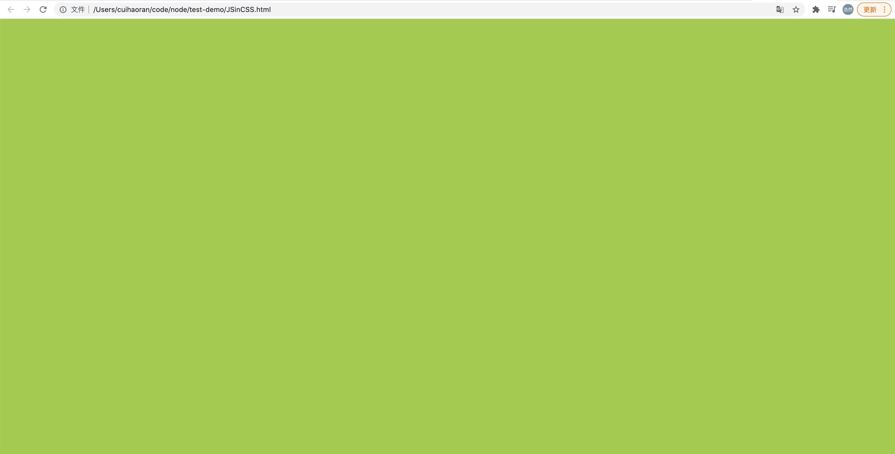

我们可以看到，确实是生效了。看完了这个我们继续探讨一下一个新的概念：**JS in CSS**，也就是说我们能在CSS中执行JS代码。

```html
<!DOCTYPE html>
<html lang="en">
<head>
  <meta charset="UTF-8">
  <meta http-equiv="X-UA-Compatible" content="IE=edge">
  <meta name="viewport" content="width=device-width, initial-scale=1.0">
  <style>
    :root {
      --bgColor: yellowgreen;
      --initFn: () => {
        console.log(123)
      }
    }

    body {
      background-color: var(--bgColor);
    }
    
    
  </style>
  <title>JS in CSS</title>
</head>
<body>
  
</body>
</html>
```

我们可以看到确实是在CSS中定义了一个函数，现在Vite也弄了一套这种 JS in CSS的代码书写方式，有兴趣可以去了解一下。

说了这么多，还要告诉读者一个消息，**上文中的CSS Next已经被废弃了，过时了**。刺不刺激？😌 前端就是这样的。废弃的原因也很简单，因为出现了更好的——**[postcss-preset-env](https://preset-env.cssdb.org/)**：

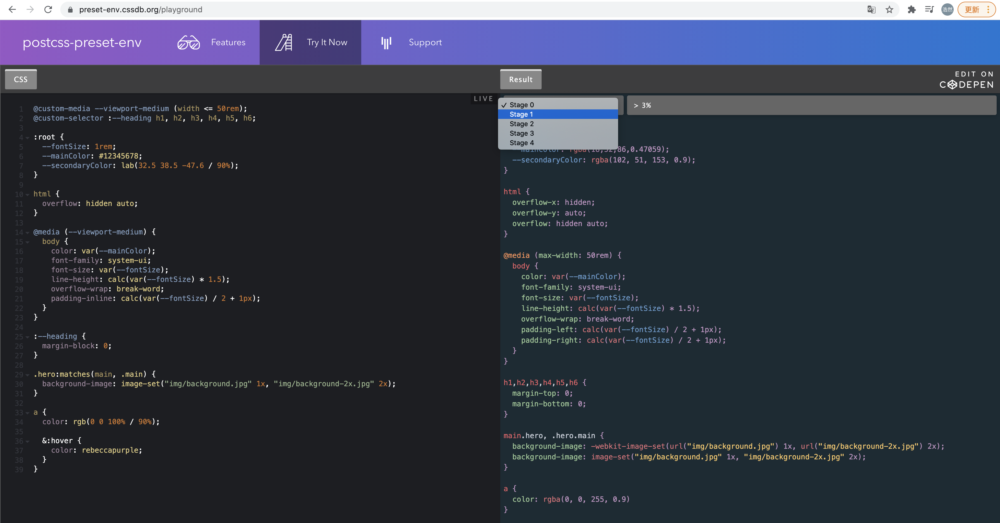

我们可以看到postcss-preset-env分了五个stage。stage越高，编译的越激进。现在由于浏览器的兼容性的问题，大多数浏览器还停留在stage0阶段。不过postcss-preset-env的出现就说明我们可以抛弃Sass和Less，去拥抱postcss-preset-env了！


## 三、PostCSS值得推荐的插件

+ POSTCSS-CUSTOM-PROPERTIES 运行时变量 

+ POSTCSS-SIMPLE-VARS 与SCSS一致的变量实现 

+ POSTCSS-MIXINS 实现类似SASS的@MIXIN的功能 

+ POSTCSS-EXTEND 实现类似SASS的继承功能 

+ POSTCSS-IMPORT 实现类似SASS的IMPORT 

+ CSSNext 面向未来 CSS Grace 修复过去


### 四、原子CSS

2020年CSS满意度最高的CSS框架——[tailwind-css](https://www.tailwindcss.cn/)，就是CSS原子化的代表作。CSS原子化主要解决CSS代码重复性高的问题。这篇文章我们不会探讨原子CSS的问题，这个重点内容留到以后。原子CSS是能够把CSS写到极致的。


## 五、PostCSS实战

讲了这么多的理论，现在我们来看一下PostCSS实战，创建一个**renekton-css**项目，执行 `npm init -y` ，目录结构如下：

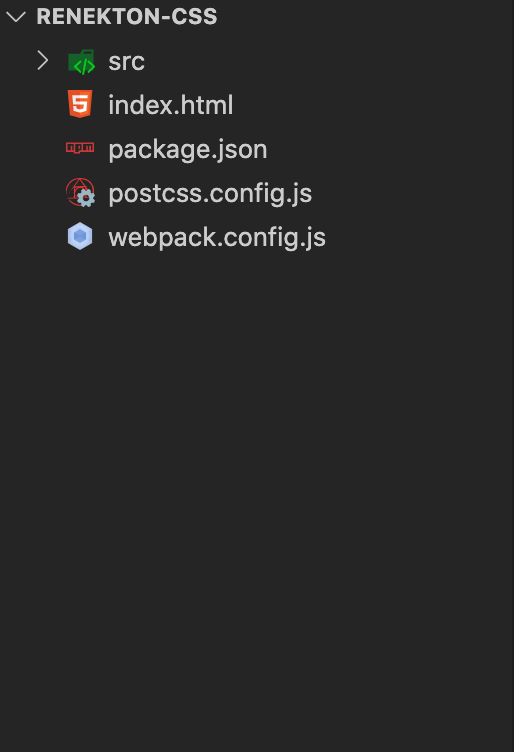

创建好项目之后，接下来我们安装webpack和webpack-cli：

```shell
$ npm install webpack webpack-cli -D
```

接下来安装postcss-preset-env：

```shell
$ npm install postcss-preset-env
```

安装完成之后，我们需要编写一下postcss.config.js文件：

```javascript
module.exports = {
  plugins: {
    'postcss-preset-env': {
      stage: 0,
      features: {
        'nesting-rules': true,
      }
    }
  }
};
```

配置了'postcss-preset-env'插件，使用了stage0和CSS嵌套的处理。编辑完postCSS的配置文件，我们就要配置一下webpack.config.js，我们需要使用webpack来打包css以及为了性能的优化做css的inline。所以我们需要两个webpack的loader：

+ css-loader：处理CSS。
+ style-loader：把处理完成的CSS做成inline的形式。

现在我们安装这两个loader：

```shell
$ npm install -D css-loader

$ npm install -D style-loader
```

安装完成之后我们来编写webpack.config.js：

```javascript
module.exports = {
  module: {
    rules: [
      {
        test: /\.css$/i,
        use: [
          "style-loader", 
          {
            loader: "css-loader",
          }
        ],
      },
    ],
  },
}
```

我们不难看到，style-loader和css-loader的配置是不一样的，这是因为style-loader现在我们还用不到，现在最主要的还是使用css-loader来处理CSS。

配置好webpack之后，在src中新建`index.js`和`index.css`两个文件。然后在index.css中随便写点代码：

```css
:root {
  --ydColor: black;
}

body {
  background-color: var(--ydColor);
}

.test {
  & h1 {
    color: yellowgreen;
  }
}
```

然后我们在index.js中引入index.css，我们的最终目的是使用webpack来进行打包css，所以一定要在index.js中引入index.css。至于为什么要在index.js中引入，这是webpack的基础问题，这里不做赘述。

```javascript
// css in js
import index from './index.css';
console.log('index--->', index);
```

**这段JS主要是去加载index.css。**写完这些之后，在项目根目录下新建dist目录，把index.html文件放到dist目录中。我们编写一下这个index.html：

```html
<!DOCTYPE html>
<html lang="en">
<head>
  <meta charset="UTF-8">
  <meta http-equiv="X-UA-Compatible" content="IE=edge">
  <meta name="viewport" content="width=device-width, initial-scale=1.0">
  <title>Document</title>
</head>
<body>
  <div class="test">
    <h1>Renekton</h1>
  </div>
  <script src="./main.js"></script>
</body>
</html>
```

在html中我们事先引入一会webpack打包之后要生成的**main.js**。注意，现在dist中是没有main.js的，main.js是一会我们要使用webpack构建出来的。**这里有点绕，大家不要晕。。**

接下来，我们就要在package.json中编写webpack的打包命令了：

```json
{
  "name": "renekton-css",
  "version": "1.0.0",
  "description": "",
  "main": "postcss.config.js",
  "scripts": {
    "dev": "webpack --mode development"
  },
 ...
}
```

现在万事具备，我们来用webpack打包：

```shell
$ npm run dev
```

构建成功之后，我们打开网页：

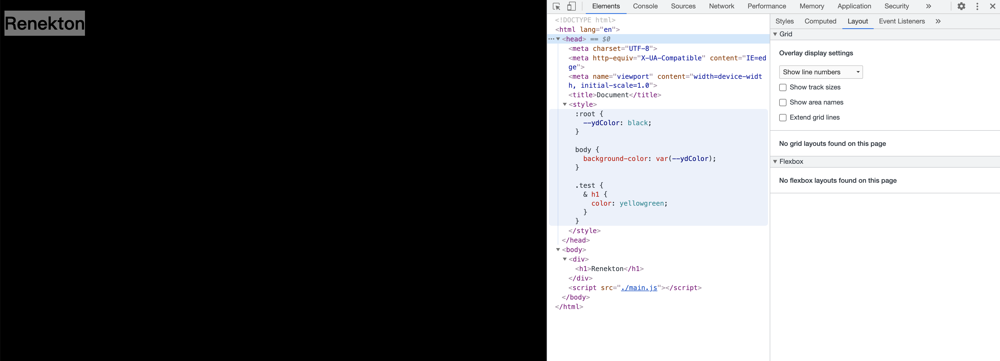

显然只有body的样式应用上了，test的样式并没有应用上。这也很好解释，因为CSS的嵌套语法一直没有通过提案，所以浏览器不会支持。为了解决这个问题我们需要使用`postcss-loader`来处理我们写的CSS源文件，在webpack中配置：

```javascript
module.exports = {
  module: {
    rules: [
      {
        test: /\.css$/i,
        use: [
          "style-loader", 
          {
            loader: "css-loader",
          },
          "postcss-loader",
        ],
      },
    ],
  },
}
```

添加上`postcss-loader`之后，重新进行打包，然后刷新刚才的页面：

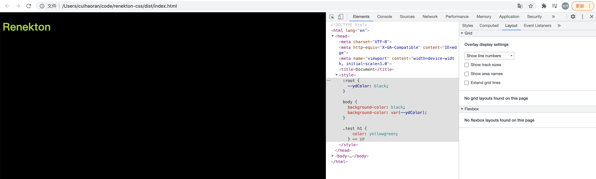

我们可以看到，CSS文件被编译成了浏览器能够识别的格式。样式全部应用上了。

但是我们在工作中使用webpack基本上都是打包单页面应用，这就要求打包的JS中有html的内容，我们来改写 index.js 和 index.css 、 webpack.config.js ：

```javascript
// index.js

// css in js
import index from './index.css';
console.log('index--->', index);

const _html = `<div class="${index.test}"><h1>Renekton</h1></div>`;

document.getElementById("app").innerHTML = _html;
```

```css
/* index.css */

:root {
  --ydColor: black;
}

body {
  background-color: var(--ydColor);
}

.test {
  & h1 {
    color: yellowgreen;
  }
}
```

```javascript
module.exports = {
  module: {
    rules: [
      {
        test: /\.css$/i,
        use: [
          "style-loader", 
          {
            loader: "css-loader",
            options: {
              modules: true
            }
          },
          "postcss-loader",
        ],
      },
    ],
  },
}
```

然后我们重新打包，刷新刚才的网页：

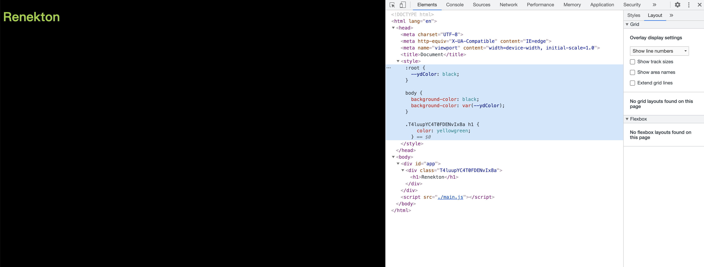

打包出来的代码能够正常运行，我们可以看到webpack对于index.css中的类名做了scope处理，类名处理成了一段字符串。我们再来看一下在index.js中输出的打包好的css：

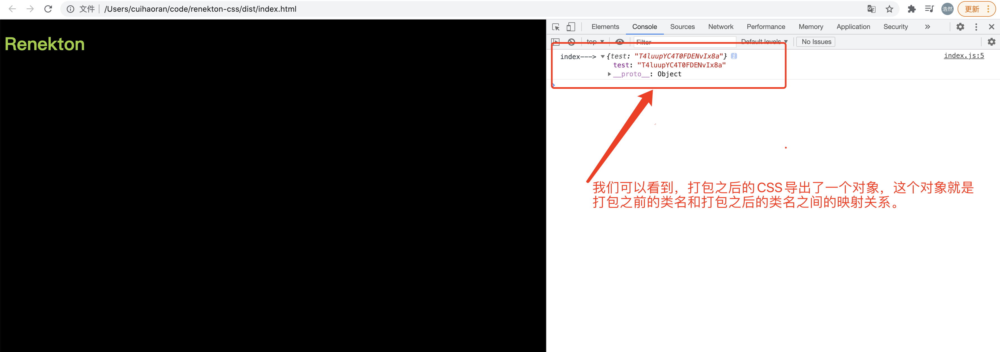

这样的话，我们通过`index.test`就能正确的应用上打包之后的CSS类名，从而使得样式一致。单页的内容我们也是使用innerHTML填充到了**div#app**的根节点中。

在这里我们要思考一个问题，webpack是怎么把css处理成这种形式呢？这主要是我们在css-loader中的设置起了作用：

```json
options: {
    modules: true
}
```

这样我们打包出的CSS就有了模块支持。现在还有最后一个问题没有解决，当我们在index.js中使用index.css的时候，index没有代码提示，点不出来类名的提示，使用者如果不知道有什么类，这将是个麻烦的问题。

为了解决这个问题，我们自然而然的能够想到TS的代码提示，给打包之后的index.css生成的JS代码加一个xxx.d.ts声明文件，这个问题就迎刃而解了。这个声明文件也不需要我们自己编写，**安装typed-css-modules-loader**，这个loader会帮助我们生成一个xxx.d.ts。

```shell
$ npm install typed-css-modules-loader -D
```

安装完成之后我们需要在webpack.config.js中做响应的配置：

```javascript
module.exports = {
  module: {
    rules: [
      {
        enforce: 'pre',
        test: /\.css$/,
        exclude: /node_modules/,
        loader: 'typed-css-modules-loader'
      },
      {
        test: /\.css$/i,
        use: [
          "style-loader", 
          {
            loader: "css-loader",
            options: {
              modules: true
            }
          },
          "postcss-loader",
        ],
      },
    ],
  },
}
```

配置完成之后，重新构建。会发现src和dist目录下多出了一个`index.css.d.ts`文件。文件内容如下：

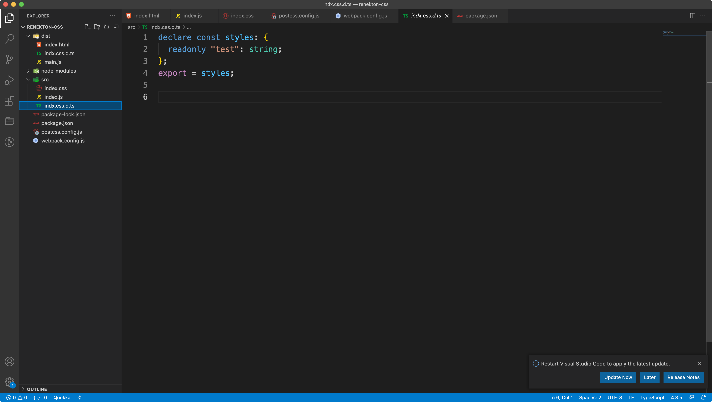

这样我们在使用index.css的时候就可以有代码提示了：

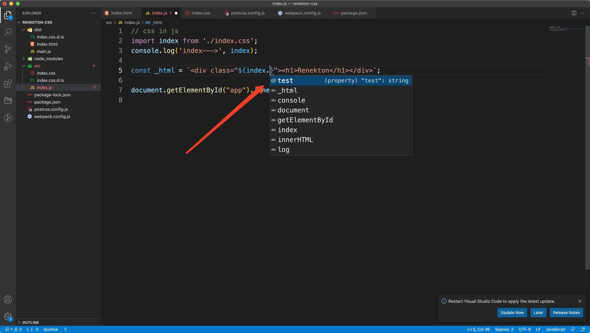

有声明文件，这下就舒服多了。

## 六、CSS Next

```html
<!DOCTYPE html>
<html lang="en">
  <head>
    <meta charset="UTF-8" />
    <meta name="viewport" content="width=device-width, initial-scale=1.0" />
    <title>再次熟练CSS Next</title>
    <style>
      :root {
        --colors: red, yellow, lime, aqua, blue, magenta, red;
        --mouse-x: 50%;
        --mouse-y: 50%;
      }
      body {
        width: 100vw;
        height: 100vh;
        --center: var(--mouse-x) var(--mouse-y);
        background-image: radial-gradient(
            circle at var(--center),
            red,
            blue 2%,
            transparent 2%
          ),
          conic-gradient(at var(--center), var(--colors));
      }
    </style>
  </head>
  <body>
    <script>
      const root = document.documentElement;
      document.addEventListener('mousemove', (evt) => {
        let x = (evt.clientX / innerWidth) * 100;
        let y = (evt.clientY / innerHeight) * 100;
        root.style.setProperty('--mouse-x', `${x}%`);
        root.style.setProperty('--mouse-y', `${y}%`);
      });
    </script>
  </body>
</html>
```


## 六、CSS doodle

[CSS doodle](https://github.com/css-doodle/css-doodle)

