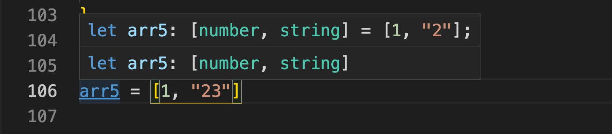
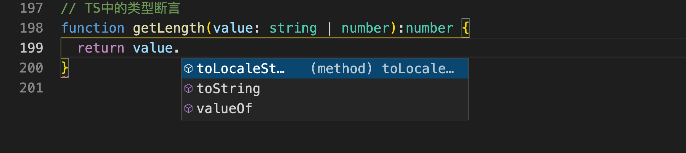
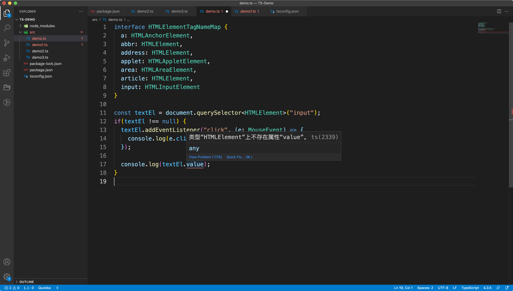

# TypeScript从入门到实战——基础篇

## 零、写在前面

TypeScript系列文章的大纲如下：

+ TS基础篇
+ TS进阶篇
+ TS实战篇
+ NodeJS + TS BFF篇
+ Vite + Vue3 + TS实战篇
+ React Hooks + TS实战篇


## 一、TypeScript概述

+ TypeScript是拥有类型的JavaScript，可以编译成JavaScript。同时拥有类型检查、语言扩展、工具属性。
+ 它的好处：接口定义直接生成文档，让前端开发者重塑类型思维。
+ 什么是强类型语言：不允许改变变量的数据类型，除非强制类型转换。
+ 静态类型语言：在编译阶段确定所有变量类型，类似于C++。
+ 动态类型语言：在执行阶段确定变量类型，类似于JavaScript。TS属于静态类型语言。
+ JS和TS的核心差异是灵活性和性能。
+ 提前进行类型检查。方便V8编译器进行优化。


### I、为什么要学习TypeScript？

JavaScript是没有类型的，但是TypeScript是有类型的，并且可以编译成JS，很好的弥补了JavaScript没有类型的缺点。但是有些读者会想如果知识解决了JavaScript没有类型的问题，只需要上Flow这个库就可以了，没有太大的必要使用TS。是的如果只是为了解决类型的问题确实不建议直接使用TS，更重要的是TS还具有接口定义直接生成文档的好处，TS的是C#的作者写的，所以决定了TS基本是个后端的语言，如果你接触过后端语言就可以很明显的感受到TS的优越。

Ts还是一个强类型的静态类型的语言，在编译的阶段就能确定类型，这样的话对性能是友好的。

### II、JavaScript与C++的比较

**JavaScript：**


+ 在程序运行时动态计算属性偏移量
+ 需要额外的空间存储属性名
+ 所有对象的偏移量信息各存一份

**TypeScript、C++:**


+ 编译阶段确定属性偏移量
+ 用偏移量访问代替属性名访问
+ 偏移量信息共享


### III、JavaScript与V8的关系


+ 首先JavaScript会先经过解析（词法分析和语法分析），然后经过JS解释器，生成字节码。
+ 字节码通过TurboFan编译器，编译成机器码
+ 执行机器码

针对这些，TS有两种优化手段：

+ 代码的热检查，type check类型检查，如果发现类型是对的，就会把中间生成的字节码直接换成机器码，这样对于V8是友好的。

总之前端有了TS之后，我们前端也可以做一些非常复杂的工作，比如复杂的设计模式以及多层的架构等等。


## 二、使用TS编写Hello World

hello world是学习一个新的语言所必须要写的程序。现在我们就来实现一下TS版本的Hello World！推荐使用VSCode，原因很简单VSCode是微软产的，TS也是微软产的，你品，你细品。代码提示上比较友好。创建`TS-Demo`的项目，用Vscode打开。

使用终端进入`TS-Demo`，执行`npm init -y`，初始化成node项目。

安装node `typescript`包：

```shell
$ npm install typescript -D
```

安装`ts-node-dev`：

```shell
$ npm install ts-node-dev -D
```

如果想要在项目中使用TS，typescript包是必须要安装的。

ts-node-dev包能够让我们不必使用传统的命令方式去运行TS，可以自动的编译TS文件。在编写程序之前，我们改写一下package.json：

```json
{
  "name": "ts-demo",
  "version": "1.0.0",
  "description": "",
  "main": "index.js",
  "scripts": {
    "dev": "ts-node-dev --respawn --transpile-only ./src/demo1.ts"
  },
  "keywords": [],
  "author": "",
  "license": "ISC",
  "devDependencies": {
    "ts-node-dev": "^1.1.8",
    "typescript": "^4.3.5"
  }
}
```

我们把添加了一个`dev`命令使其运行ts-node-dev的编译运行命令，在项目根目录新建src/demo1.ts：


然后我们还要在项目根目录新建一个tsconfig.json文件，这是TS的配置文件：

```json
{
  "compilerOptions": {}
}
```

这个配置文件需要什么就往里面填写什么，不建议去网上复制别人的配置，因为别人的配置有很多你自己都看不懂，不利于TS的学习。配置文件，我们开始写Hello World程序：

```typescript
// src/demo1.ts

const data: string = "Hello world!";
console.log(data);
```

写完之后我们要执行一下`npm run dev`命令：


可以看到正确的输出了`Hello world!`。到这里我们的Hello World程序已经写完了。


## 三、TypeScript基础数据类型

啥也不说了先上个图：


TS的数据类型包括ES6的所有基础数据类型，除了ES6的基础数据类型，TS还自带了：

+ void
+ any
+ nerver
+ 元组
+ 枚举
+ 高级类型

这里需要特别注意的是TS的数据类型全部是小写的，大写的数据类型表示的是JS的原始数据类型的类。下面我们通过一段代码来了解一下TS的数据类型：

```typescript
// src/demo1.ts

// 声明了一个布尔类型的变量：isDown，并赋值false。
let isDown: boolean = false;
// 并没有显示的声明为布尔类型
let isTrue = true;
```

我们上面声明了两个变量，但是这两个变量的声明方式有一些不同：

+ isDown：显示的声明成了boolean，并赋值true，为布尔值。
+ isTrue：并没有直接声明为boolean，但是赋值flase，为布尔值。

我们看一下IDE对于两个值的处理有什么不同：

**isDown：**


**isTrue：**


从图上我们可以看出，TS对于这两个值的处理上并没有什么不同。这就提醒我们一点：**在写TS的时候我们不要为了类型而显式的声明类型，TS是会有类型推断的，即使不明确的注明数据类型也能够推断出来。**至于在什么情况下必须要显式的声明类型，我们在实战的内容中会一点点的探讨。但是现在我们可以简单的记住一条规律：**如果一个变量有一个固定的值，那么类型是不需要显式的写的，TS能够推断出来。**现在我们是在写TS，有一个特别常见的错误我们是需要注意的，如果声明了一个变量并显式的注明了类型，那么就不能给这个变量赋予除注明的类型之外的类型值。例如，我们在声明变量`isDown`的时候显式的注明了为布尔类型，如果再给isDown赋值字符串，那么TS就会报错：


```typescript
// src/demo1.ts

/** 数字类型 */
let num:number;
num = 1;
// 十六进制数
let hexNum: number = 0xf00d;

/** 字符串类型 */
let str:string = "Renekton";
```

就像我们声明数字类型变量num一样，可以先声明，再赋值。要注意的是number类型是有进制的。字符串类型的声明和数字类型的类似就是为`string`。


```typescript
/** 函数 */
function alertName1():string {
  return '测试'
}
alertName1();

function alertName2(name: string):string {
  return '测试' + name;
}
alertName2('Renekton');

function alertName3(name: string):void {
  alert('测试' + name);
}
alertName3('Renekton');
```

上面这部分代码定义了三个函数，我们先来看第一个函数`alertName1`，这个函数的括号后面指定为string类型，我们可以理解为这个函数执行完之后要得到一个字符串，也就是说这个函数的执行结果是一个字符串即**alertName1函数必须返回一个值，并且返回值的类型必须是string类型。**

我们再看第二个函数`alertName2`，alertName2函数除了要求函数的返回值为字符串之外，还增加了一个参数（参数必须要传），并且规定了参数的类型必须是**string**类型。

第三个函数和前两个函数的区别是：必须要有一个参数，并且参数的类型必须是string类型。没有返回值**（ :void ）**，这里需要注意这里在函数的括号后面标注了void类型，学过C语言的读者自然知道这是什么意思，在JavaScript中void实际上代表了`undefined`，我们在html代码中尝尝会看到下面这种写法：

```html
<a href="javascript:void(0)"></a>
```

这就代表了这段代码不会向外输出任何东西，就是undefined。在TS中还支持以下这种写法：

```typescript
let unusable:void = undefinde;
```

这也从侧面证明了void类型就是JavaScript中的undefined。


```typescript
// 类型推断
function getString(something: string | number): string {
  return something.toString();
}
getString('Renekton');
getString(20);
```

我们在编写函数的时候会尝尝遇到接收参数不确定的情况，有可能是字符串，也有可能是数字，不能确定，那么这个时候我们在接收参数的时候就需要用`typeA | typeB`来处理一下，表明可以接收**typeA**或者**typeB**两种类型的参数。当前getString的返回值必须是string，所以在返回参数something的时候，如果something不是字符串类型需要转成字符串才能返回，否则程序会出错。这就是TS的类型推断。


```typescript
/** 枚举 enum */
enum Days {
  Sun,
  Mon,
  Tue,
  Wed,
  Thu,
  Fri,
  Sat
}

console.log('🐻', Days['Sun']);  // 0
console.log('🐻', Days[0]);	 // Sun 
```

TS也支持枚举类型，如果学过Python的读者对于这个数据类型应该不会陌生，使用枚举我们可以定义一些有名字的数字常量。如果没有初始化，第一个枚举元素是0，以后的每一个枚举元素的值为上一个枚举成员的值 +1。

```typescript
/** 枚举 enum */
enum Days {
  Sun = 7,
  Mon,
  Tue,
  Wed,
  Thu,
  Fri,
  Sat
}

console.log('🐻', Days['Sun']);		// 7
console.log('🐻', Days['Mon']);		// 8
```


```typescript
interface Person {
  readonly id: number,
  username?: string,
  age: number;
}

const Renekton:Person = {
  id: 1,
  age: 26,
}

Person.id = 2;
```

TypeScript的核心原则之一是对值所具有的结构进行类型检查。 它有时被称做“鸭式辨型法”或“结构性子类型化”。 在TypeScript里，接口的作用就是为这些类型命名和为你的代码或第三方代码定义契约。说的简单点，接口就是对对象的一种内容的约束，对象要实现接口中定义的所有内容。

我们看一下Person接口，它定义了id、username、age三个属性，并且id是只读的（不可更改）number类型的值，username是可缺省的string类型的值，age是必要的number类型的值。所以我们声明了一个Renekton对象，实现了Person接口。id和age是必要的，username为缺省项。Person.id = 2;对只读属性id做了更改，程序出现报错。


我们还可以试着对Person对象增加一个属性：

```typescript
interface Person {
  readonly id: number,
  username?: string,
  age: number;
}

const Renekton:Person = {
  id: 1,
  age: 26,
};
Renekton['xx'] = 30;
```

如果在没有设置tsconfig的话是可以新增属性的，但是我们一般会对TS进行一些规则的设置：

```json
## tsconfig.json
{
  "compilerOptions": {
    "noImplicitAny": true,
    "strict": true,
    "noImplicitThis": true,
    "strictNullChecks": true
  }
}
```

+ noImplicitAny：不允许**随意**使用any类型，要注意这里重点是随意！
+ strict：开启严格模式
+ noImplicitThis：不允许**随意**使用this，因为JS的this指向是非常灵活的，会出问题。
+ strictNullChecks：严格的null类型检查

我们加上这些设置之后，就开启了TS的地域模式，看我们的代码会发现刚才我们新添加的属性`xx`报错了：


出错的原因是TS认为属性`xx`是any类型。我们设置了不允许**随意**使用any。所以程序会报错。但是我们又想添加新的属性，为了解决这个问题我们需要在接口中写一些代码：

```typescript
interface Person {
  readonly id: number;
  username?: string;
  age: number;
  [proName: string]: any;
}

const Renekton:Person = {
  id: 1,
  age: 26,
};
Renekton['xx'] = 30;
Renekton['yy'] = 'hello';
```

这样的话我们就可以随意添加一个或者多个变量，并且这个变量的类型是any，TS不会对新增的变量做任何的类型校验。如果[proName: string]设置成除了any其他的类型，那么程序也会报错，这是因为设置的类型会和Person对象中的其他值的设置的类型发生冲突。


## 四、TypeScript的数组和元组

### I、数组

```typescript
// 已有的数组
let arr: number[] = [1, 2, 3, 4, 5, 6];
let arr2: Array<number> = new Array<number>(4);
let arr3 = new Array<number>(4);

console.log(arr);
console.log(arr2.length);
console.log(arr3.length);

// 使用interface定义数组
interface numberArray {
  [index: number]: number;
}

let arr4: numberArray = [1,1,1];

console.log(arr4);	// [ 1, 1, 1 ]

// 类数组
function sum() {
  let args: IArguments = arguments;
}
```

+ `let arr: number[] = [1, 2, 3, 4, 5, 6];`：一般的数组声明方式，如果是数字数组，就要使用`number[]`。
+ `let arr2: Array<number> = new Array<number>(4);`：使用泛型和构造函数来声明数组。
+ `interface numberArray`：使用接口定义数组，这和下面类数组的方式是相同的。

TS中的数组元素必须是相同类型的数据，不能出现混合。

### II、元组

和数组不同的是，元组是可以出现不同类型的数据的。

```typescript
let arr5: [number, string] = [1, "2"]; 
```

元组虽然可以放入不同类型的数据，但是也必须按照事先声明好的数据类型的集合去存放，如果在**arr5**的元组中放入布尔值，那么程序就会报错，因为arr5只接收number类型和string类型。


如果元组不声明类型集合，其实TS也能够根据元组中的元素进行类型推断：



虽然可以进行类型推断，但是我们在声明元组的时候最好也要事先声明一下类型。

> **元组和数组的区别：**


我们从图中可以看到，TS的类型推断的结果是response是string或number类型，这显然是不合适的，因为response显式的声明了string类型，按逻辑来说不应该会出现number的情况。为了解决这个问题我们需要写点代码来修正：

```typescript
// 数组和元组的区别
function useFetch() {
  const response: string = '京程一灯';
  const age: number = 23;
  return tuplify(response, age);
}

function tuplify<T extends unknown[]>(...elements: T): T {
  return elements;
}

const [response] = useFetch();
```

我们使用泛型，写一个功能函数，给出一个泛型T，这个泛型继承自unknown类型，并且按照泛型T收集了参数为elements元组，再把收集到的参数元组返回出去。

**泛型的知识我们之后会讲到...**


## 五、TypeScript的函数

在平时的开发中我们离不开函数的编写，所以这一部分内容比较重要

```typescript
/** 函数 */

// 1. 不要混淆ES6和TS中的 =>
let myNum:(x: number, y: number) => number = function(x: number, y: number):number {
  return x + y;
}

// 2. 函数默认参数
function buildName(firstName: string, lastName: string = 'Cat'): string {
  return firstName + ' · ' + lastName;
}

// 3. 剩余参数
function push(array: any[], ...items: any[]) {
  items.forEach(item => {
    array.push(item);
  })
}

let a: number[] = [4];
push(a, 1, 2, 3);

console.log('a--->', a);

// 4. 可选参数 必须放到最后
function buildName2(lastName: string, firstName?: string): string {
  if(firstName) {
    return firstName + ' · ' + lastName;
  } else {
    return lastName;
  }
}
```

+ TS中的箭头函数是作为函数类型声明用的，我们可以看到`myNum`其实是一个函数表达式，myNum的冒号后面整体是一个类型，这个类型就是一个函数类型，表明了myNum函数接收两个数字参数并返回一个数字。但是在ES6中是做箭头函数使用的。
+ 函数的默认参数和JS中的差不多，只不过TS的参数需要有类型声明，但是默认参数的赋值是相同的。默认参数的位置最好写在最后。
+ TS可以把剩余的参数收集成一个元组，供函数进行使用。
+ TS支持参数可选，但是可选参数必须放在参数列表的最后。


## 六、TypeScript中的类

首先要介绍的是TS中的抽象类，抽象类的抽象方法只在抽象类中定义，并不给出具体实现，需要继承这个抽象类的子类给出这个抽象方法的实现：

```typescript
/** 类 */

/**
 * 1. 抽象类可以定义抽象方法，也可以有具体实现的方法
 * 2. 方法修饰符
 *    public 公共的，任何地方都可以访问。
 *    private 私有的，不能在声明的类的外部使用，也就是说不能在对象上使用。不能被继承。
 *    protect 受保护的方法，可以在类的内部和子类的内部使用。不能在外部使用。
 */
// 抽象类
abstract class Animal {
  abstract makeSound(): void;

  move():void {
    console.log('动物移动');
  }

  protected bb() {
    console.log('bb');
  }
}

// TS中的类既可以是个实体类，又可以是一个类型。
class Dog extends Animal {
  constructor() {
    super();
  }
  makeSound():void {
    console.log('汪汪汪');
  }

  private aa() {
    this.bb();
    console.log('aa');
  }
}

const dog = new Dog();
dog.move();
dog.makeSound();

const s:Dog = new Dog();
```

我们可以看到抽象类中的抽象方法makeSound是不在Animal中实现的，他的子类必须完成抽象方法的实现。看到这里，抽象类的概念和接口的概念并没有什么不同，但是抽象类和接口肯定是有区别额，他俩的区别就是抽象类可以实现一写自己的方法，比如代码中的move方法。

子类Dog继承了Animal类，通过constructor构造方法中的super来实现对Animal的继承，由此可以让dog对象上存在了父类上的move方法和自身实现的父类上makeSound抽象方法。

在TS中实体类和抽象类都可以作为类型。


## 七、TypeScript的类型断言

TS的类型断言主要是针对联合类型。下面我们举例说明：



通过上面的代码可以看到，getLength函数的value参数可以是字符串或者数字，我们在使用value的时候，只能访问到字符串或数字的共有的参数或者方法。所以这是时候我们要进行断言。我们直接上代码：

```typescript
// 强制的类型断言

// 利用泛型
function getLength(value: string | number):number {
  if((<string>value).length) {
    return (<string>value).length;
  }else {
    return value.toString().length;
  }
}

// 利用as
function getLength2(value: string | number):number {
  if((value as string).length) {
    return (value as string).length;
  }else {
    return value.toString().length;
  }
}

// 使用type
type Name = string;
type NameResolver = () => string;
type NameOrResolver = Name | NameResolver;
function getName(n: NameOrResolver):Name {
  if(typeof n === "string") {
    return n;
  }else {
    return n();
  }
}

// 使用interface
interface A {
  a: string;
}

interface A {
  b: string;
}

const l: A = {
  a: 'a',
  b: 'b'
}
```

+ 使用泛型进行强行断言
+ 使用as断言
+ 如果类型组合比较多的时候，可以使用type，这种方式在开发中用的最多。
+ interface重复定义的话并不会被覆盖，而是合并。


## 八、TypeScript的泛型

### I、为什么会有泛型？

设计泛型的关键目的是在成员之间提供有意义的约束，这些成员可以是：

+ 类的实例成员
+ 类的方法
+ 函数参数
+ 函数返回值

我们先举一个简单的例子来引出泛型的必要性，写一个FIFO的数据结构——队列：

```typescript
class Queue {
  private data = [];
  push = (item) => {
    return this.data.push(item);
  }
  pop = () => this.data.shift();
}
```

这段代码实际上是存在一个问题的，它允许你向队列里添加任何数据，在出队的时候也可以是任何类型。那么我们设想一个场景，如果我们只允许数字进入队列，在出队的时候也只能是数字，该怎么满足呢？其实这个问题在TS中也是非常容易的，只需要给上面的代码加上类型的控制即可：

```typescript
class Queue {
  private data: number[] = [];
  push =  (item: number):number => {
    return this.data.push(item);
  }
  pop = ():number | undefined => this.data.shift();
}

const queue = new QueueNumber();

queue.push(0);
queue.push('1'); // Error: 不能推入一个 `string` 类型，只能是 `number` 类型
```

另外我们还见过一个例子，一个reverse函数，现在在这个函数里添加函数参数与函数返回值的约束：

```typescript
function reverse<T>(items: T[]): T[] {
  const data:T[] = [];
  for(let i = 0; i < items.length; i++) {
    data.push();
  }
  return data;
}

const reverse_arr = reverse<number>([1,2,3]);
```

我们也可以为成员函数添加泛型：

```typescript
class Utility {
  reverse<T>(items: T[]):T[] {
    const data:T[] = [];
    for(let i = items.length - 1; i >= 0; i--) {
      data.push(items[i]);
    }
    return data;
  }
}
```

>你可以随意调用泛型参数，当你使用简单的泛型时，泛型常用 `T`、`U`、`V` 表示。如果在你的参数里，不止拥有一个泛型，你应该使用一个更语义化名称，如 `TKey` 和 `TValue` （通常情况下，以 `T` 作为泛型的前缀，在其他语言如 C++ 里，也被称为模板）。

### II、泛型的使用姿势

TS的泛型是一个难点，也是前端开发者学习TS的痛点，每次一遇到泛型一下字就不好了。。。但是泛型的应用是很广泛的，Vuex和Redux都大量的使用了泛型。

泛型是解决类、接口、方法的复用性，以及对不确定的数据类型的支持。

```typescript
// 泛型

// 1. 不知道类型是什么的时候就会使用到泛型
interface LengthWise {
  length: number;
}

function getLength<T extends LengthWise>(arg: T): T {
  console.log(arg.length);
  return arg;
}

const result = getLength<string>("Renekton");
console.log(result);

// 2. demo2 类型 实体类
class GenericNumber<T> {
  zeroValue: T | undefined;
  add: ((x: number, y: number) => T) | undefined;
}

const genericNumber = new GenericNumber<number>();
genericNumber.add = function(x: number, y: number) {
  return x + y;
};
genericNumber.zeroValue = 22;

// 3. 泛型实现函数重载
function getData<T>(value:T):T {
  return value;
}

getData(123);
getData('renekton');

// 4. 泛型接口
interface ConfigFn {
  <T>(value: T): void;
}

const getData2:ConfigFn = function<T>(value: T):void {
  console.log(value);
}
getData2<string>('ren');

// 5. 动态泛型
interface Bookmark {
  mag: string;
}
class BookmarksService<T extends Bookmark> {
  items: T[] = [];
}

class BookmarksService2<T extends Bookmark = Bookmark> {
  items: T[] = [];
}
```

+ 泛型的重要作用就是在不知道是什么类型的时候就上泛型，我们使用了`<T>`来代表了泛型，并且这个泛型继承了LengthWise接口，在调用getLength的时候传入泛型。那么类型就确定了。
+ 使用泛型实现实体类
+ 使用泛型实现函数重载
+ 使用泛型来定义接口
+ 动态泛型


## 九、TypeScript实现接口

接口在开发SDK和写NodeJS的时候尤为重要，SOLID的设计原则都是interface先行。

```typescript
interface IPriceData {
  id: number;
  m: string;
}

type IPriceDataArray = IPriceData[];

function getPriceData() {
  return new Promise<IPriceDataArray>((resolve, reject) => {
    fetch("url").then(function (response) {
      return response.json();
    }).then(function(myJson) {
      const data: IPriceDataArray = [];
      resolve(data)
    });
  });
}

getPriceData().then(function(data) {
  console.log(data[0].m);
})
```

**Interface和Type的区别：**

+ 相同点：
  + 都可以描述一个对象或函数。
  + 都允许进行扩展。
+ 不同点：
  + type声明基本类型别名、联合类型、元组等。
  + 可以使用typeof获取实例的对象。
  + interface可以被合并。

**Interface的使用场景：**

+ 有关于后台的api接口，前端更愿意使用interface。
+ 第三方开发的SDK，比如说Vue。
+ 正常的开发任务用type更方便一些。


## 十、TypeScript装饰器


## 十一、细数 TS 中那些奇怪的符号

+ ! 非空断言操作符
+ ?. 运算符，可选链。
+ ?? 控制合并运算符
+ ?: 可选属性
+ & 运算符：将多个类型合并成一个类型
+ | 分隔符，在 TypeScript 中联合类型（Union Types）表示取值可以为多种类型中的一种，联合类型使用 `|` 分隔每个类型。
+ _ 数字分割符，正如数值分隔符 ECMAScript 提案中所概述的那样。对于一个数字字面量，你现在可以通过把一个下划线作为它们之间的分隔符来分组数字。
+ `<Type>` 语法
+ @XXX 装饰器
+ #xxx 私有字段


## 十二、TypeScript有关于DOM

作为前端开发者来说，最后我们的代码都会跑在浏览器中，所以对于DOM的处理还是很重要的。

```typescript
interface HTMLElementTagNameMap {
  a: HTMLAnchorElement,
  abbr: HTMLElement,
  address: HTMLElement,
  applet: HTMLAppletElement,
  area: HTMLAreaElement,
  article: HTMLElement,
  input: HTMLInputElement
}

const textEl = document.querySelector("input");
```

当我们使用TS来进行Dom选择的时候，我们得到了textEl有可能是一个`null`，这就造成了我们找不到HTML元素上的属性，这时候我们可以给他指定一个泛型：

```typescript
interface HTMLElementTagNameMap {
  a: HTMLAnchorElement,
  abbr: HTMLElement,
  address: HTMLElement,
  applet: HTMLAppletElement,
  area: HTMLAreaElement,
  article: HTMLElement,
  input: HTMLInputElement
}

const textEl = document.querySelector<HTMLInputElement>("input");
if(textEl !== null) {
  textEl.addEventListener("click", (e: MouseEvent) => {
    console.log(e.clientX);
  })
}
```

以上的代码可能还会使textEl的值为null，那么我们在textEl设置点击事件的时候可能取不到addEventListener这个方法，这里我们需要判断一下，在textEl不为null的时候设置监听事件。**这里需要注意的是：`<HTMLInputElement>`这个泛型一定要设置正确，如果设置的不合适，在取属性值的时候可能会出现错误。导致代码编译不通过。**

```typescript
interface HTMLElementTagNameMap {
  a: HTMLAnchorElement,
  abbr: HTMLElement,
  address: HTMLElement,
  applet: HTMLAppletElement,
  area: HTMLAreaElement,
  article: HTMLElement,
  input: HTMLInputElement
}

const textEl = document.querySelector<HTMLElement>("input");
if(textEl !== null) {
  textEl.addEventListener("click", (e: MouseEvent) => {
    console.log(e.clientX);
  });
	// HTMLElement类型上没有value属性
  console.log(textEl.value);
}
```

在上面的代码上我们传入的泛型改成了`<HTMLElement>`，但是在一般的`<HTMLElement>`上没有value属性，这时候代码的编译就会出现错误。所以我们在传入泛型的时候一定不能传错。



另外对于先前的取值出现null值的问题，我们除了if判断之外还有其他更优雅的方式：

### I、断言

我们可以使用断言把`textEl`断言成`HTMLInputElement`：

```typescript
interface HTMLElementTagNameMap {
  a: HTMLAnchorElement,
  abbr: HTMLElement,
  address: HTMLElement,
  applet: HTMLAppletElement,
  area: HTMLAreaElement,
  article: HTMLElement,
  input: HTMLInputElement
}

const textEl = document.querySelector("input") as HTMLInputElement;
console.log(textEl.value);
```

把textEl直接断言成HTMLInputElement，那么就相当于告诉编译器`textEl`确定就是HTMLInputElement类型，不需要检查和推断。

### II、可选链

我们在不确定是不是null的情况下，可以使用可选链来取属性值，如果有该属性则取值，如果没有则直接返回当前的值：

```typescript
interface HTMLElementTagNameMap {
  a: HTMLAnchorElement,
  abbr: HTMLElement,
  address: HTMLElement,
  applet: HTMLAppletElement,
  area: HTMLAreaElement,
  article: HTMLElement,
  input: HTMLInputElement
}

const textEl = document.querySelector("input");
console.log(textEl?.value);
```

由于编译器不能确定textEl是不是null，所以不能直接取值，使用可选链规避在null上访问属性的语法错误。

### III、使用！（非空断言操作符）强制指定

除了可选链可以解决问题之外，还有一个特殊符号可以强制的指定textEl非空（和断言很像）：

```typescript
interface HTMLElementTagNameMap {
  a: HTMLAnchorElement,
  abbr: HTMLElement,
  address: HTMLElement,
  applet: HTMLAppletElement,
  area: HTMLAreaElement,
  article: HTMLElement,
  input: HTMLInputElement
}

const textEl = document.querySelector("input");
console.log(textEl!.value);
```


## 十三、TypeScript其他基础

TS基础知识入门图谱：


很不幸，我们学完这张图才能算TS刚入门！

+ [TS英文文档](https://www.typescriptlang.org/)
+ [TS中文文档](https://typescript.bootcss.com/)

**建议读英文文档，笔者英文不好读的是中文文档。**
