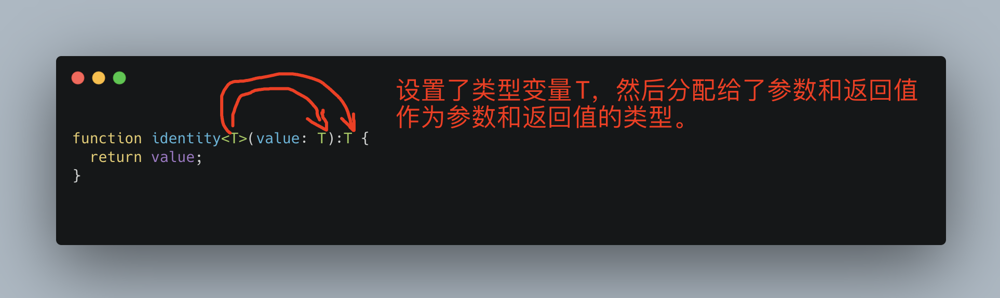
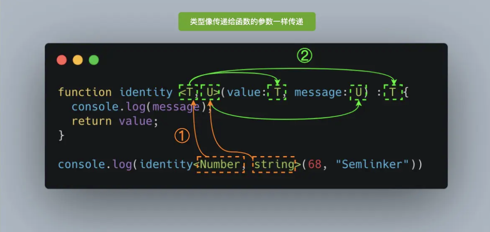
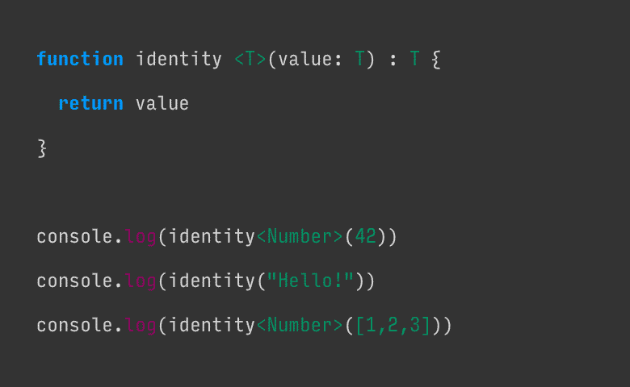

# TypeScript泛型

## 零、写在前面

TypeScript泛型是TS中的高级语法，他为强类型语言定义的函数参数、返回值、类的实例、类的实例方法提供了约束，这种约束是为了更好的扩展TS的类和方法的功能，使其一套代码能够接受多种类型的数据。

我们在学习泛型的时候要时刻记住三个要点：

1. 泛型是什么？
2. 泛型的使用场景有哪些？
3. 怎么使用泛型？

这三个问题的答案正好解答了对于泛型是什么？为什么？怎么办？这三个经典的问题。只要是解决了这三个问题，我们的泛型就算学会了。

这篇文章我们打算在以下8个方面来展开：

+ 泛型是什么？
+ 泛型接口
+ 泛型类
+ 泛型约束
+ 泛型参数默认类型
+ 泛型条件类型
+ 泛型工具类
+ 使用泛型创建对象


## 一、泛型是什么？

首先思考一个问题为什么叫泛型？我的理解是`泛型就是通用的范式，也就是通用的类型`。**通用的类型就是泛型。**而反应在编程上，我们编写一个函数或者组件，总是希望能够处理更多的数据类型，这样的话我们的程序或者组件就成为了通用的模板或范式。这就是泛型的最终目的。

> `泛`：从水，音泛，本义没有目标地漂浮漫流是泛之范式。
>
> 引申义：广泛的，自由的。

设计泛型的关键就是在成员之间提供有意义的约束，这些成员包括：

+ 函数的参数
+ 函数的返回值
+ 类的成员变量
+ 类的成员方法

既然是通用的类型，那么重点就在于**类型**和**通用**，也就是能够创建可重复使用的适合各种数据类型的模板。本质上这种通用就是可以处理多种类型，那么我们的重中之重就是如果优雅的处理多种数据类型。

理论阐述明白之后（我觉得我说明白了...），我们开始举例子解释一下理论，首先我们传建一个identity函数：

> `这里其实还有一个问题，为什么要用identity函数举例？`
>
> identity函数又被成为恒等函数，设M为一集合，在M上的恒等函数`f`被定义为具有`定义域`和`值域`M的函数，且在定义域M上，对M中的任意元素都符合`f(x) = x`。
>
> 恒等函数的代数性质被广泛的应用在函数式编程和范畴论中。

```typescript
function identity(value) {
  return value;
}
```

这个函数接收一个参数并直接返回这个参数，显然这个对于TS是不好的，因为没有设置类型。可以随意的传入参数和返回参数，而没有对参数进行校验，失去了TS的类型的意义。并且如果函数的逻辑复杂，参数的类型不对是会出现问题的。下面我们把这个函数改成只接收number类型的函数：

```typescript
function identity(value: number):number {
  return value;
}
```

我们改成了TS支持的number类型的参数，但是这里还存在一个问题，我们虽然把number类型分配给了参数和返回值，使得参数和返回值的类型都是number类型，但是这个参数并不是可以通用的，也就是说这个函数并不是通用的。这个函数无法接收除number类型之外的其他类型，这显然不符合通用的条件。

还有一种方式是把number换成any，但是这是不被允许的，因为换成了any就失去了TS类型推断的功能，并且失去了TS类型保护的作用。我们的最终目的，是让identity函数能够处理多种特定的类型，而不是any这种不确定的类型！实现这种功能，我们就要使用到泛型。这里的特定类型需要读者好好理解一下！

我们试着用泛型来改造一下identity：

```typescript
function identity<T>(value: T):T {
  return value;
}
```

我们观察一下代码，会发现我们给函数identity传递了一个类型，记作`<T>`，T是类型变量。



我们给函数传递了一个类型变量T，然后这个类型变量分配给了函数的参数和返回值，作为两者的类型。这里有两个步骤很重要：

+ `<T>`，类型变量的设置。
+ 类型变量的分配。

对比上面的图片，我们来调用一下identity：

```typescript
function identity<T>(value: T):T {
  return value;
}

// 调用identity
identity<number>(1);  // 正确调用
```

结合上图和代码我们可以看出来，当我们调用identity函数的时候，number类型就像参数一样，它将给任何出现T的位置替换成number类型，T就是一个类型变量，在`<T>`中就是一个变量的占位符，同时它被分配给 `value` 参数用来代替它的类型：此时 `T` 充当的是类型，而不是特定的 Number 类型。

T代表**type**，即类型。通常我们使用T来作为类型变量，实际上可以使用任何字母来代替：

+ K（Key）：表示对象中的键类型；
+ V（Value）：表示对象中的值类型；
+ E（Element）：表示元素类型。

要注意的是，并不是只能定义一个类型，也可以定义多个类型，比如：

```typescript
function identity<T, U>(value: T, meeage: U):T {
  console.log(message);
  return value;
}

// 调用identity
identity<number, string>(15, "Renekton");
```



当然我们也可以依靠编译器来进行类型推断，不显式的给类型变量赋值，在调用的时候省略尖括号，交给TS的类型推断去推断出类型，这样的代码看起来会更加简洁一些：

```typescript
function identity<T, U>(value: T, meeage: U):T {
  console.log(message);
  return value;
}

// 调用identity
identity(15, "Renekton");
```

这段代码，编译器就完全可以通过类型推断来完成类型的判断，不需要显示的传递。



这个图可以形象直观的看到编译器是怎么处理的在传入不容类型数据时的处理。

> 这张图实际上是有bug的，最后一行输出，应该传入的是`<number []>`

现在我们实现了identity函数的重用，它能够处理任何特定的数据类型，实现了上文中提出的需求。那么针对于我们刚才改的identity函数，可以接收两个类型变量，但是我们只返回了一个类型变量，那么如果我们需要返回两个呢？

```typescript
function identity<T, U>(value: T, meeage: U):T {
  console.log(message);
  return value;
}

// 调用identity
identity<number, string>(15, "Renekton");
```

上面的代码只返回了一个类型，如果想返回多个我们可以使用元组进行返回：

```typescript
function identity<T, U>(value: T, meeage: U):[T, U] {
  return [value, message];
}

// 调用identity
identity<number, string>(15, "Renekton");
```

毫无疑问元组是能够解决这个问题的，但是却不是最好的方法，最好的方法是我们使用泛型接口。


## 二、泛型接口

为了解决上文中提到的返回多个泛型的问题，我们需要创建一个适用于identity的接口——Identities：

```typescript
interface Identities<V, M> {
  value: V;
  message: M;
}
```

我们使用Identities作为identity函数返回值的类型：

```typescript
function identity<T, U>(value: T, message: U):Iidentity<T, U> {
  console.log('value type --->', typeof value);
  console.log('meeage type --->', typeof message);
  let result: Iidentity<T, U> = {
    value,
    message
  }
  return result;
}

console.log(identity<number, string>(22, 'renekton'));
```

执行identity函数之后结果是：

```
value type ---> number
meeage type ---> string
{ value: 22, message: 'renekton' }
```

这就是泛型在接口中的用法，**泛型接口主要是解决了返回多个泛型的问题**。另外泛型不但可以用在接口上，还可以用在类上。


## 三、泛型类

在类上使用泛型，直接在类名之后设置泛型即可：

```typescript
// 泛型类

// 定义一个接口GenericInterface
interface GenericInterface<U> {
  value: U;
  getIdentity: () => U;
}

// 定义一个类IdentityClass实现接口GenericInterface
class IdentityClass<T> implements GenericInterface<T> {
  constructor(value: T) {
    this.value = value;
  }

  value: T;
  getIdentity(): T {
    return this.value
  };
}

const myNumberClass = new IdentityClass<number>(22);
console.log(myNumberClass.getIdentity());

const myStringClass = new IdentityClass<string>('Renekton');
console.log(myStringClass.getIdentity());
```

我们来分析一下代码：

+ 首先我们定义了一个`GenericInterface`接口并设置了泛型U。
+ 然后定义了一个类`IdentityClass`，**设置了泛型T**，并且IdentityClass类实现了GenericInterface接口，并给接口**设置了泛型T**。
+ 在类的内部实现了GenericInterface，所以有了成员变量value和实例方法getIdentity。
+ 在实例化myNumberClass的时候，传入了number类型，所以返回值为**22**。
+ 实例化myStringClass的时候，传入了string类型，所以返回值为**'renekton'**。

泛型类可确保在整个类中一致的使用指定的数据类型。


## 四、泛型约束

有时候我们可能希望限制每个类型变量所能接受的类型的数量，这就是泛型约束。举例说明如何使用泛型约束：

### I、确保属性存在

一个经典的例子就是在处理字符串和数组的时候我们会假设length是可用的，声明一个getLength函数，返回字符串或者数组的长度：

```typescript
function getLength<T>(args: T):T {
  // console.log(args.length); // Error，不能确定args上是否存在length属性。
  return args;
}
```

在上面代码描述的情况下，编译器无法推断出T类型有没有length属性，因为T是可以是任意类型的，为了解决这个问题我们可以声明一个带有length属性的接口，让T extends 这个接口：

```typescript
interface Length {
  length: number
}

function getLength<T extends Length>(args: T):T {
  console.log(args.length); // 能确定args上存在length属性
  return args;
}
```

`T extends Length`等于告诉了TS编译器，已经支持所有实现了Length接口的任何类型（包括数组和字符串）。那么如果我们使用不带与length属性的参数，TS将会报错！

我们还可以使用多种约束类型，多种约束之间用`,`分隔。比如：`<T extends Length, Type2, Type3>`。而对于上述的 `length` 属性问题来说，如果我们显式地将变量设置为数组类型，也可以解决该问题，具体方式如下：

```typescript
// 泛型数组

// 推荐写法   个人推荐第一种
function getLength<T>(args: T[]): T[] {
  console.log(args.length);
  return args;
}

// 不推荐
function getLength<T>(args: Array<T>): Array<T> {
  return args;
}
```

### II、检查对象上的键是否存在

通过 `keyof` 操作符，我们就可以获取指定类型的所有键，之后我们就可以结合前面介绍的 `extends` 约束，即限制输入的属性名包含在 `keyof` 返回的联合类型中。具体的使用方式如下：

```typescript
function getProperty<T, K extends keyof T>(obj: T, key: K): T[K] {
  return obj[key];
}
```

在以上的 `getProperty` 函数中，我们通过 `K extends keyof T` 确保参数 key 一定是对象中含有的键，这样就不会发生运行时错误。这是一个类型安全的解决方案，与简单调用 `let value = obj[key];` 不同。

下面我们来看一下如何使用 `getProperty` 函数：

```typescript
enum Difficulty {
  Easy,
  Intermediate,
  Hard
}

function getProperty<T, K extends keyof T>(obj: T, key: K): T[K] {
  return obj[key];
}

let tsInfo = {
   name: "Typescript",
   supersetOf: "Javascript",
   difficulty: Difficulty.Intermediate
}
 
let difficulty: Difficulty = 
  getProperty(tsInfo, 'difficulty'); // OK

let supersetOf: string = 
  getProperty(tsInfo, 'superset_of'); // Error
```

很明显通过使用泛型约束，在编译阶段我们就可以提前发现错误，大大提高了程序的健壮性和稳定性。接下来，我们来介绍一下泛型参数默认类型。


## 五、泛型参数默认类型

在TS2.3版本之后，我们可以为泛型中的类型参数指定默认的值。当使用泛型时没有在代码中明确的赋值类型参数，从实际参数也无法推断出类型的时候，这个类型参数的默认值就会起作用。

```typescript
// 泛型参数默认类型
interface S<T=string>{
  name: T;
}

const strA: S = { name: "Semlinker" };
const numB: S<number> = { name: 101 };
```


与函数参数的默认值类似，类型参数的默认值语法也是这样的，`<T=Default Type>`，我们来看具体的使用：

+ 有默认类型的类型参数被认为是可选的。

+ 必选的类型参数不能在可选的类型参数后。

+ 如果类型参数有约束，类型参数的默认类型必须满足这个约束。

+ 当指定类型实参时，你只需要指定必选类型参数的类型实参。 未指定的类型参数会被解析为它们的默认类型。

+ 如果指定了默认类型，且类型推断无法选择一个候选类型，那么将使用默认类型作为推断结果。

+ 一个被现有类或接口合并的类或者接口的声明可以为现有类型参数引入默认类型。

+ 一个被现有类或接口合并的类或者接口的声明可以引入新的类型参数，只要它指定了默认类型。


## 六、泛型条件类型

我们可以根据一定的条件来得到不同的类型，这个条件也是类型的约束。尽管以上代码中使用了 `extends` 关键字，也不一定要强制满足继承关系，而是检查是否满足结构兼容性。

条件类型会以一个条件表达式进行类型关系检测，从而在两个类型中选择一个：

```typescript
T extends U ? X : Y
```

以上表达式的意思是：若 `T` 能够赋值给 `U`，那么类型是 `X`，否则为 `Y`。在条件类型表达式中，我们通常还会结合 `infer` 关键字，实现类型抽取。

> infer
>
> 

上代码：

Lib.es5.d.ts

```typescript
type ReturnType<T> = T extends (...args: any[]) => infer P ? P : any;
```

## 七、总结

对于前端开发者来说，我们在学习TS的时候实际上是有几大难点的：

+ 学习TS和ES相同写法但是意义不同的地方，比如说ES6的箭头函数就是函数定义的方式，TS的箭头函数指的则是函数类型。
+ 学习TS和ES不同的地方，比如说类型、泛型、接口等等。
+ TS的全称就是TypeScript这就表明了TS这门语言的重点就是类型以及和类型有关的所有东西：
  + 声明变量的时候最好指定类型之后使用
  + interface接口
  + 使用type和逻辑运算符来定义自己的类型，从而像使用基本类型一样，使用自己定义的类型。
  + 最重要的就是**泛型**。

**为了学习泛型，我们首先要弄清楚的是值和类型的关系！**

我们平时在编程的时候实际上使用逻辑语句操作数据，让数据进行各种变化。实际上本质是对值进行编程。数据就是值嘛，这很好理解。那么类型是什么呢？简单来说类型就是一类值的集合。例如所有数字的集合就是数字类型。**值和类型的关系就像元素和集合的关系一样！**

**那么泛型是怎么回事儿呢？**

区别于我们平时使用的类型，我们在声明的时候不给变量指定具体的类型，当具体在调用的时候才能确定类型，这就是泛型的使用方式，这样有一个好处就是组件的重用。我们还可以使用交并补这种逻辑操作生成新的泛型，泛型就是对类型的编程。
