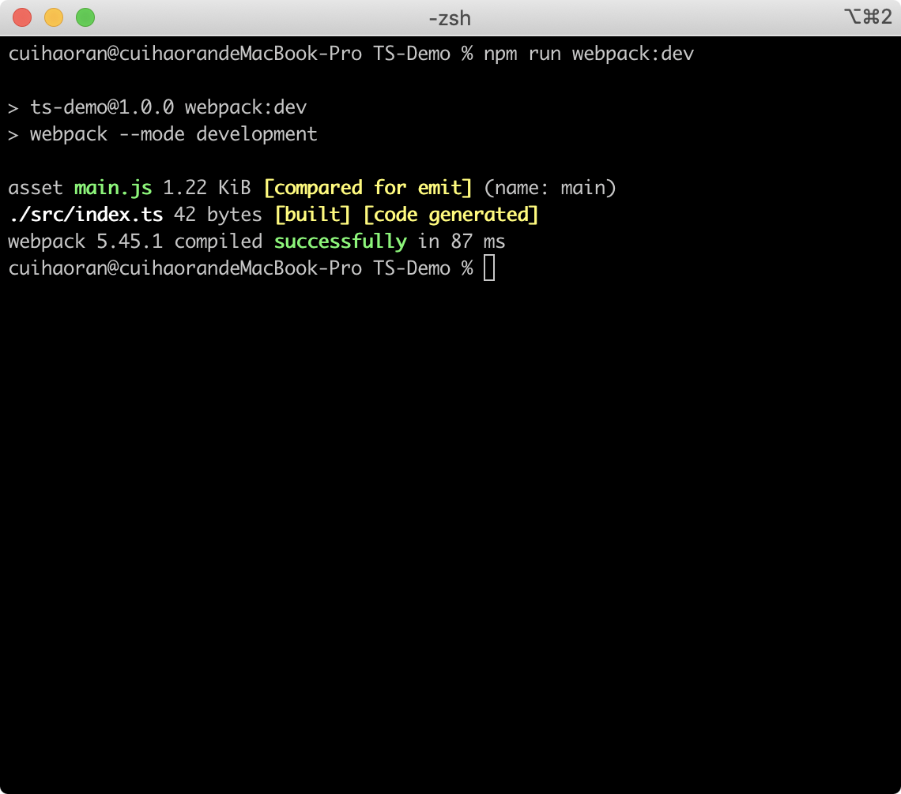
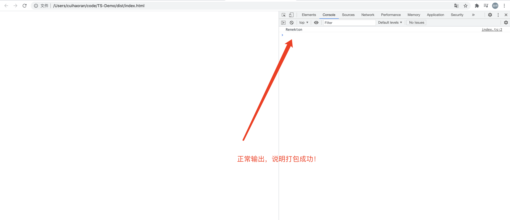
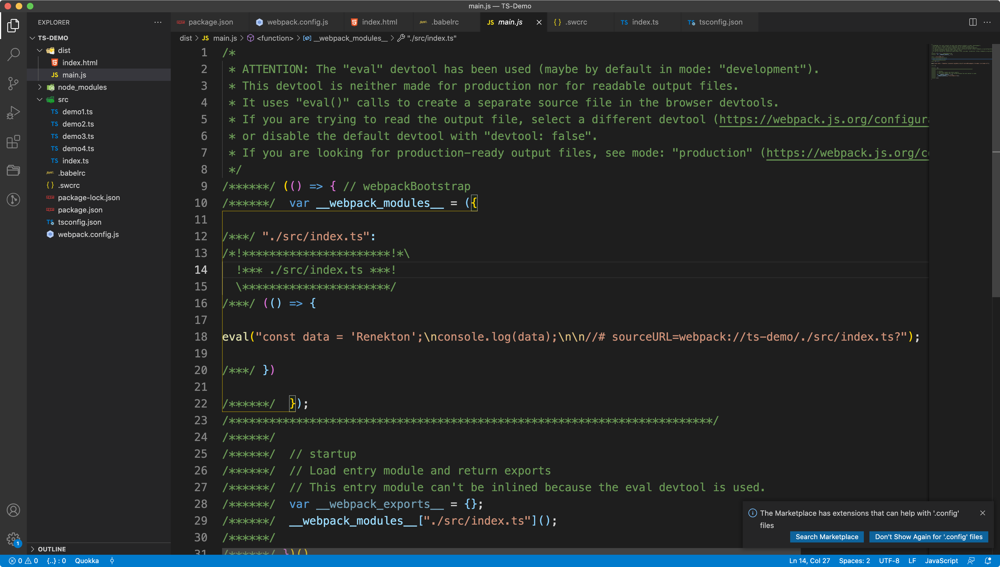
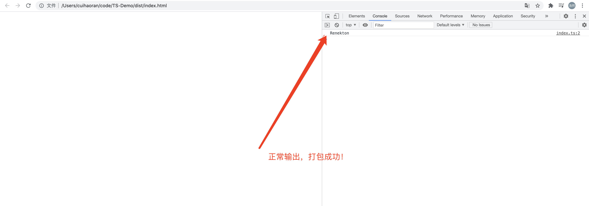
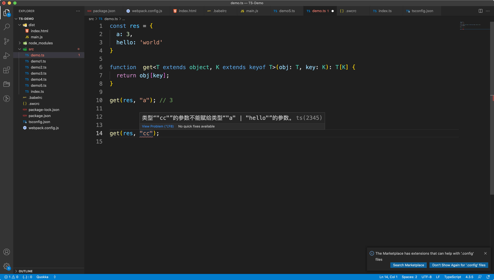

# TypeScript从入门到实战——进阶篇


## 一、使用Webpack + TS构建开发环境

webpack本身提供了大量的有关于TS的支持，先安装webpack和webpack-cli：

```shell
## 安装webpack和webpack-cli
$ npm install -D webpack webpack-cli
```

然后我们在package.json中配置打包命令`webpack:dev`：

```json
{
  "name": "ts-demo",
  "version": "1.0.0",
  "description": "",
  "main": "index.js",
  "scripts": {
    "dev": "ts-node-dev --respawn --transpile-only ./src/demo.ts",
    "webpack:dev": "webpack --mode development"
  },
  "keywords": [],
  "author": "",
  "license": "ISC",
  "devDependencies": {
    "@swc/core": "^1.2.65",
    "swc-loader": "^0.1.14",
    "ts-node-dev": "^1.1.8",
    "typescript": "^4.3.5",
    "webpack": "^5.45.1",
    "webpack-cli": "^4.7.2"
  }
}
```

现在我们如果想对TS打包是不可能的，因为还没有安装loader。如果团队内习惯使用babel-loader那么你仍然可以使用babel-loader进行编译，在这里我们使用一个比较激进的loader——`swc-loader`。先来安装它：

```shell
$ npm install -D @swc/core swc-loader
```

Swc-loader并不是使用JS编写的，他是用Rust 编写，然后直接编译成二进制的。所以执行效率比较高。然后我们在webpack.config.js中进行配置：

```javascript
// webpack.config.js
module.exports = {
  module: {
    rules: [
      {
        test: /\.ts$/,
        exclude: /(node_modules|bower_components)/,
        use: {
          loader: "swc-loader",
          options: {
              jsc: {
                  parser: {
                      syntax: "typescript"
                  }
              }
          }
        }
      }
    ]
  }
};
```

我们可以观察到webpack.config.js中应用了swc-loader，并对其进行了配置，具体配置写在了`options`中。如果配置全部写在webpack.config.js中会让webpack的配置文件变得十分臃肿，所以我们新建一个`.swcrc`文件，把配置信息分离到这个文件中**（这和.babelrc的作用是一样的，webpack在打包的时候会自动去找项目根目录下的.swcrc文件读取配置。）**。

写完了swc的配置这是如果运行打包命令，终端会报错，提示找不到打包的入口，那么我们需要在webpack.config.js中配置入口文件：

```javascript
// webpack.config.js
const { resolve } = require('path');
module.exports = {
  entry: {
    main: resolve("./src/index.ts")
  },
  module: {
    rules: [
      {
        test: /\.ts$/,
        exclude: /(node_modules|bower_components)/,
        use: {
          loader: "swc-loader",
        }
      }
    ]
  }
};
```

配置了入口文件在**src/index.ts**，那么我们在src目录下新建一个index.ts文件：

```typescript
// src/index.ts

const data: string = 'Renekton';
console.log(data);
```

就写了一个输出语句，然后我们现在运行打包命令：

```shell
$ npm run webpack:dev
```



打包完成之后在项目的根目录下会有一个dist目录，里面有打包好的文件：


我们可以看到TS代码编程了JS代码，我们在dist目录下新建一个html文件，把打包好的main.js引入：

```html
<!DOCTYPE html>
<html lang="en">
<head>
  <meta charset="UTF-8">
  <meta http-equiv="X-UA-Compatible" content="IE=edge">
  <meta name="viewport" content="width=device-width, initial-scale=1.0">
  <script src="./main.js"></script>
  <title>Document</title>
</head>
<body>
  
</body>
</html>
```

现在在浏览器中运行：



到这里我们webpack打包TS文件就完成了。当然这里我们使用了swc-loader这种比较激进的方式，如果想使用这种东西，需要有一定的基本功，需要明白为什么要使用它，其实就是快~~

除了swc-loader这种激进的方式，我们还可以使用比较传统的babel-loader，只不过时间会很慢，首先我们要安装babel-loader和@babel/preset-typescript：

```shell
$ npm install -D babel-loader @babel/core @babel/preset-env

$ npm install -D @babel/preset-typescript
```

安装完之后，新建`.babelrc`，并且把webpack.config.js中管swc-loader改成babel-loader，并在.babelrc中设置babel的配置：

```javascript
const { resolve } = require('path');
module.exports = {
  entry: {
    main: resolve("./src/index.ts")
  },
  module: {
    rules: [
      {
        test: /\.ts$/,
        exclude: /node_modules/,
        use: {
          loader: 'babel-loader',
        }
      }
    ]
  }
};
```

```json
## .babelrc

{
  "presets": ["@babel/preset-typescript"]
}
```

配置完之后，把之前打包的main.js删除，重新执行打包命令：

```shell
$ npm run webpack:dev
```



仔细观察一下两次编译的结果，还是有些不同的。我们打开浏览器刷新一下，发现仍然能够正常输出。说明打包成功。



## 二、使用Parameters获取函数参数

```typescript
const chr = (username: string, id: number) => {};

type yd = Parameters<typeof chr>;
const x = (...data: yd) => {
  const [ username ] = data;
  console.log(username);
}

x('cuihaoran', 20);
```


## 三、对象类型进行强制key校验

当我们日常开发中去取key的时候，尝尝会去到undefined。这个时候就需要对对象的key进行强制的校验。

```typescript
const res = {
  a: 3,
  hello: 'world'
}

function  get<T extends object, K extends keyof T>(obj: T, key: K): T[K] {
  return obj[key];
}

get(res, "a"); // 3


get(res, "cc"); // error
```

我们可以看到，我们利用了泛型T代表object（这里是必然的，因为T extends object），和keyof运算符把传入的对象所有的可以全部取出。返回值为T[K]。

这样的话我们能取得只能是实际存在对象中的key，否则报错。



这一部分在`TypeScript泛型`这篇文章中也有详细的介绍。


## 三、TypeScript高级类型

```typescript
interface IUser {
  id: number;
  name: string;
  age: number;
}

// 必须字段转成可选字段
type PartialUser = Partial<IUser>;

// 可选字段转成必选字段
type PullDownRefresh = Required<partialUser>;

// 选择必选字段
type PickUser = Pick<IUser, 'id' | 'name'>;

// 排除字段
type OmitUser = Omit<IUser, 'id' | 'name'>;

// 排除掉两个类型的交集
type P = Exclude<'x' | 'a', 'x' | 'y' | 'z'>;

// 单独把某些类型提出来
type Select = 'id' | 'age';

// 以上的这些操作可以嵌套
type PartialSelect = Partial<Pick<IUser, Select>>
type OmitUser2 = Omit<IUser, 'id' | 'name'>;

// 类型合并
type Final = PartialSelect & OmitUser2;
const ss: Final = {
  age: 20,
}

// Exclude、 Extract
interface FirstType {
  id: number;
  firstName: string;
  lastName: string;
}

interface SecondType {
  id: number;
  address: string;
  city: string;
}

type ExtractType = Extract<keyof FirstType, keyof SecondType>;
type ExcludeType = Exclude<keyof FirstType, keyof SecondType>;
```


## 四、玩转Record

```typescript
// 将属性K 对应的T 转换为U

interface ProductIncard {
  id: number;
  name: string;
  label?: string;
}

class CarModel {
  // string为key（"renekton"），对应的T（ProductIncard）为ProductIncard，U为最后的结构
  products: Record<string, ProductIncard> = {
    "renekton": {
      id: 1,
      name: "cuihaoran",
      label: ""
    }
  }
}
```

Record是用来描述对象的，类似于`type Product = ProductIncard[]`。只不过一个是对象，一个是数组。


## 五、TypeScript的默认参数

```typescript
type CoreIconName = 'user' | 'customer';
const opts: CoreIconName = 'customer';

type LiteralUnion<T extends U, U=string> = T | (U & {});

interface GreetSettings {
  greeting: string;
  duration: number;
  color?: false;
}
type Color = LiteralUnion<'red' | 'black' | keyof GreetSettings>;
const c:Color = "greeting";
```


## 六、检查参数不为null

```typescript
type NonNullableType = string | number | null | undefined;

function showType(args: NonNullable<NonNullableType>) {
  console.log(args);
}

showType('京程一灯');
showType(666);
// showType(null);
// showType(undefined);

type StringMap<T> = {
  [p in keyof T]: string;
}
function showType2(args: StringMap<{ id: number, name: string }>) {
  console.log(args);
}

showType2({ id: 'x', name: 'Test' });
```


## 七、apply的调用错误

```typescript
interface Cat {
  name: string;
}

const BobCat: Cat = {
  name: 'bob'
}

function printCatName(this: Cat) {
  console.log(this.name);
}

// 未完，以后细讲。
```


