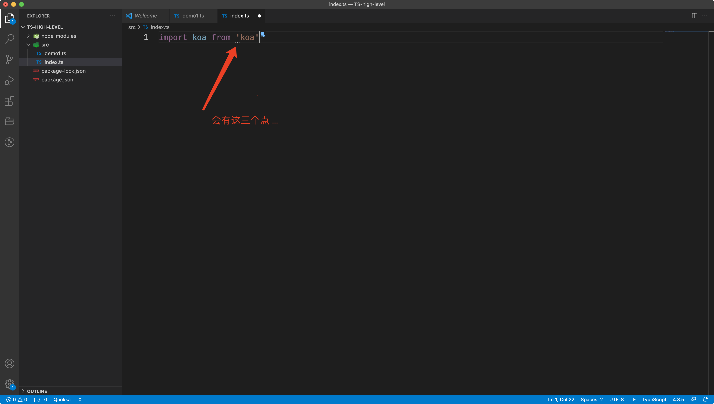
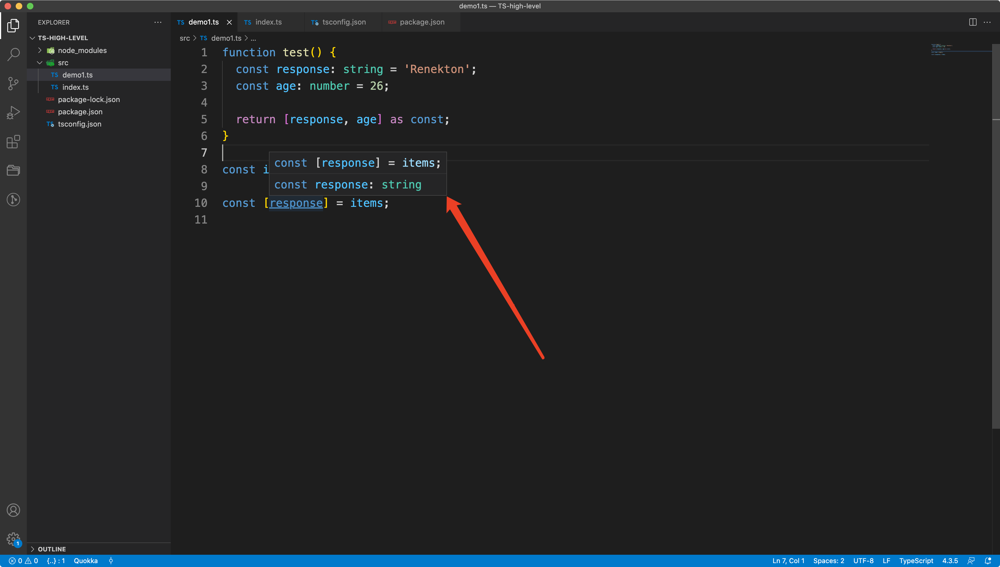
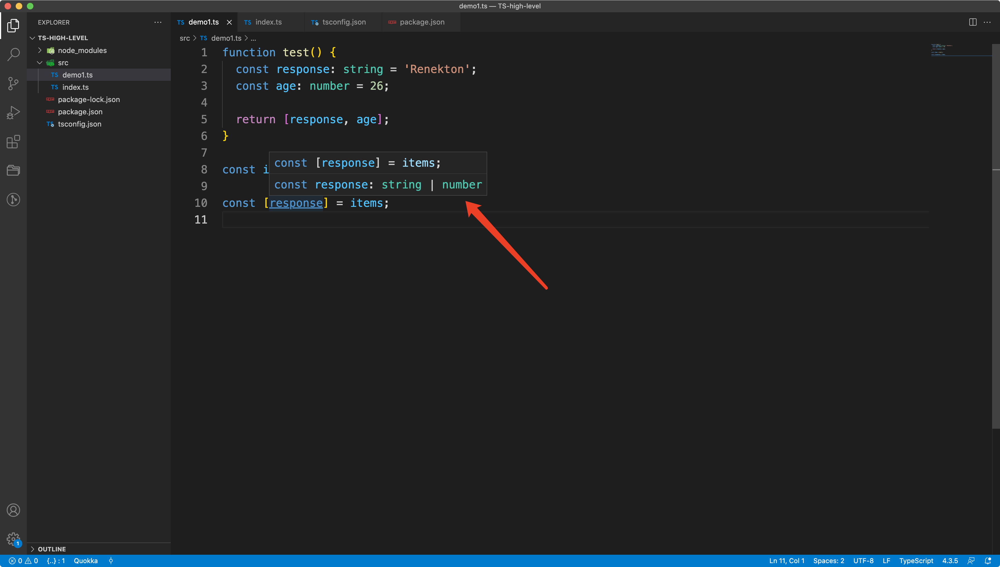

# TypeScript高级使用技巧（一）


## 零、写在前面

TypeScript（以下简称为TS），如果前端开发者想加入到一个不错的平台或想进入一家不错的公司，那么TS是必定要学会的。TS的一大难点和重点就是**泛型**。只要把泛型学好，可以说TS就能学好。TS也就只有一个高级的特性就是泛型，只要把泛型用好了TS就可以走遍天下！

在TS中，类（class）、接口（interface）、type、抽象类这些都是类型。TS的核心就是**类型**，带类型的JavaScript，只要是把类型弄明白，TS的一切问题就迎刃而解了。

前端工程师在学习TS的时候有两个文件是必须要看的：

+ lib.dom.d.ts
+ lib.es5.d.ts

这两个文件是TS的灵魂，在里面有很多问题的解释，比如说HTML元素对象的继承，Record、Pick的原理。这两个文件也是TS的核心所在，搞懂这两文文件也就明白了为什么要选用TS。


## 一、再次探讨TS基础

TS的学习最好有后端语言的基础，比如说PHP、Java等。如果没有接触过后端语言直接学TS会稍微有一些困难，因为TS的套路和JS是完全不同的，更加类似于后端语言，这也可以理解，TS的作者是写C#的那个大神。TS和JS的本质区别就是类型检查**（Type Check）**。**为什么要类型检查呢？**

+ 类型检查是V8所必须要做的一步，如果在TS中加入类型检查，那么直接可以对V8友好**（这一部分我们会在将V8原理的时候仔细讲解）**。
+ 类型检查也可以规避一些错误，让代码更加健壮。

**TS现在有两个方向：**

+ 使用TS写Node，基本上和写后端一样。
+ 使用TS开发前端（在国内不讨论Angular）：
  + 原生
  + Vue：**Vue2坚决不能使用TS！**Vue3用TS写很痛苦，因为源码里面使用了大量的**any**！但是Vue3必须要使用TS。
  + React：使用TS写。

我们来看一段比较简单的TS代码：

```typescript
const a = 10; // JS

const s: string = 'renekton';	// 正确写法

const c: String = 'renekton'; // 不要这么写
```

这段简单的TS代码说明了TS怎么声明类型，就是在变量后面加上冒号，冒号之后就是类型的表示。但是一定要注意，**TS的类型都是小写，不要写成大写！**写成大写的话TS的类型检查不会报错，但是会无形中把变量进行了**装箱（装箱的概念在JS基础的文章中详细解释过）**。所以写成大写的类型不好！

TS中还有一种万能类型：

```typescript
const v: {} = 30;
```

`{}`在TS中是万能类型，可以接收任何类型。本质上表示一个代码块与**Object**没有区别，要注意这里的`{}`不是any！`{}`是和Object是一样的，要注意这里的Object是大写的，还有一个小写的`object`，这个是typeof的返回值，是JS中的一个类型和`{}`无关。TS中就没有小写的object！

**还有一个特别要注意的点是我们要禁止使用Function做为变量的类型：**

```typescript
const fun: Function = ...
```

类似于上面的代码一定不要写，因为在JS中`Function.prototype`已经是**native code**了。JS的函数在V8中是用对象表示的。

现在用JS写的库一般都会有TS的类型声明文件——`xx.d.ts`。这是因为JS是弱类型的，所以需要一个声明类型的文件，当我们在Vscode中的TS文件中引入一个包，包名前面会有三个小点，出现这种情况的原因就是因为没有xx.d.ts这种声明文件。



如果没有ts的类型声明文件在引入包的时候就会出现这三个点，koa是一个很老的包，近期也没有更新过，所有没有类型声明文件。那么这三个点会有什么影响呢？其实没有声明文件的影响还是蛮大的：

+ TS Lint检查不通过。
+ 不知道包里面有什么方法，也不知道方法的参数和返回值的类型。

TS比JS多的就是typecheck，所以没有类型声明文件，对于TS来说是不能容忍的。那么在TS中怎么使用JS的一些库呢？就是要依靠TS的声明文件，举个例子来说明：

```javascript
// 这是某个js的库
function add(a, b) {
  return a + b;
}
```

这个js的库如果想要在TS的文件中使用，必须使用xx.d.ts来进行约束和说明：

```typescript
// xx.d.ts
add(a: number, b: number): number {}
```

本质上说，.d.ts文件就是给js文件准备的，它是和JS文件配对的，对JS文件中的方法和函数进行类型的定义和规范。假如说有一个index.js就需要有一个index.d.ts来和index.js进行配对，进行类型的约束。让TS可以正常的进行类型推断。

我们上文说了.d.ts是给JS文件做类型约束用的，但是index.ts同样也需要inde.d.ts。原因很简单，因为浏览器不认识TS，要把TS编译成JS才能运行在浏览器上，所以也需要index.d.ts。

**当我们使用TS开发Node程序的时候需要编译成js代码吗？**

和浏览器中不同的是，我们可以使用 `pm2`指定启动的cli用ts-node去loader你的TS代码就完事儿了，不需要编译。如果你实在想要编译，那么可以使用gulp编译一下。现在比较激进的编译工具就是`swc`。

**Vite能代替Webpack吗？**

这种问题显然是不能，因为不是一个东西：

+ webpack5的优化使用了v8-compile-cache + Sparkplug进行优化，但是还是没有放弃commonJS的方式。webpack的生态太完善。不是谁都可以取代的。
+ Vite的底层是使用esbuild，esbuild是用go开发的，go直接编译成了机器码，所以在运行速度上vite会比webpack快很多，使用的也是ESModule，相比较于CommonJS肯定是好。
+ 如果是使用webAssmably Vite是无法支持的。
+ 如果开发Vue3的话强烈推荐`Vue3 + Vite + TS`这样一点毛病没有！

我们在开发SDK的时候，推荐使用`rollup + parcel/sonwpack`。


## 二、开始写点TS

TS的编写和编译是需要配置和插件的，我们先看一下tsconfig.json：

```json
{
  "compilerOptions": {

  },
  "include": ["src/*.ts"]
}
```

这里要注意的是`tsconfig.json`对于TS的学习很重要，千万不要去百度然后复制粘贴网上的tsconfig，一定要自己知道每一个配置的含义，自己编写适合自己的tsconfig。

我们使用`ts-node-dev`来实时的编译TS：

```shell
$ npm install -D ts-node-dev
```

配置好package.json中的scripts脚本：

```
"scripts": {
   "dev": "ts-node-dev --respawn --transpile-only ./src/demo.ts",
 },
```

接下来我们在编写TS代码之前需要养成一个习惯：**在编写TS代码的时候，一定要明确输入和输出的类型！**

```typescript
// demo.ts
function alertName(name: string):void {
  alert(name);
}
```

一定要向上面的代码一样，规范好输入输出的类型，否则一旦上了TSlint会很痛苦。void代表什么都不返回。

**在我们初学TS的时候对于接口（interface）有一种执念，只要是定义一个对象，就要先写接口。**

```typescript
interface IUser {
  name: string;
  age: number;
  height: string;
  weight: string;
}

const user: IUser = {
  name: 'Renekton',
  age: 18,
  height: '179cm',
  weight: '106kg'
}
```

这样写不能算错，但是这么写实在是太傻了，这就是不知道TS类型应该怎么用的典型表现。我们在定义对象的时候是不需要使用接口约束的，因为TS有类型推断，我们大部分之间不需要自己编写interface。

**那么我们在什么时候会使用到interface呢？**

+ 在规范后端的api返回的数据的时候需要使用interface来约束一下。
+ 在开发SDK的时候会用到。因为interfae允许merge。

在我们使用interface约束api返回的数据时，不需要我们人肉的去写，我们可以自己写一个cli工具自动生成有两种方式可以供我们选择：

+ json2ts：这是一个专门生成interface的库，我们可以对其进行封装，做一个自己团队内使用的cli。不过这个库比较老了。
+ [quicktype](https://quicktype.io/)：这个和json2ts差不多，但是功能强大一些，我们也可以对它进行进一步封装。

这两个工具都可以根据后端返回的数据自动生成Ts代码，不要自己写，会累死的！！技术的意义就是提高生产力！请求接口的时候，用自己封装的cli工具，自动创建一个ts文件，把自动生成的代码写入ts文件并保存到models目录中。实现自动化。**一个接口一个model，自动生成。**

我们在平时写业务的时候，遇见类型主要是用`type`，type不能merge，interface能merge，就这个区别。

**TS中可以作为类型的东西：**

+ interface
+ type
+ class 类
+ 抽象类

**在TS中返回元组的时候一定要经过`as const`处理，如果不做这一步处理，解构会失败，类型会丢失：**

```typescript
function test() {
  const response: string = 'Renekton';
  const age: number = 26;

  return [response, age] as const;
}

const items = test();

const [response] = items;
```

我们看一下TS的类型推断结果：



我们可以看到，现在把response解构出来，TS的类型推断是正确的为`string`类型。那么我们把`as const`的处理去掉之后再看一下：

```typescript
function test() {
  const response: string = 'Renekton';
  const age: number = 26;

  return [response, age];
}

const items = test();

const [response] = items;
```



我么可以看到TS不能准确的推断出response的类型。这就是as const的重要作用。这样造成的影响就是现在的response的类型不是string类型而是一个联合类型。string类型下的方法都丢失了，只保留了string和number类型的共有方法。

**那么`as const`到底起到了什么作用呢？**

as const的作用是把元组中所有的元素都转换成了常量。属于强制类型转换。其实除了as const还有一种方式，那就是用泛型来处理：

```typescript
function test() {
  const response: string = 'Renekton';
  const age: number = 26;

  return <const>[response, age];
}

const items = test();

const [response] = items;
```

在元组之前用`<const>`做泛型约束，可以起到和as const同样的效果。可能有的读者觉得`as const`和`<const>`这种方式太傻了，那么解决这种稀奇古怪的问题的最终方案就是总结自己的工具库（utils）。以元组转数组为例：

```typescript
function tuplify<T extends unknown[]>(...elements: T): T {
  return elements;
}
```

这样的话我们可以使用这个工具改写刚才的代码：

```typescript
function test() {
  const response: string = 'Renekton';
  const age: number = 26;

  return tuplify(response, age);
}

const items = test();

const [response] = items;
```

这个小工具函数的精髓在于，虽然参数的类型都是不同的，但是泛型T继承了unknown的数组，也就是说泛型T就是个unknown的数组，因为这个特性返回的就是一个数组，所以可以正常解构。**元组转数组！路子就是这么野。**这种工具函数在React和Vue3中写hooks会用到。

看到这里有些读者可能会对`unknow`这个类型有疑问，unknow和any是不是一样的？答案是否定的，TS代码中坚决不能使用any，any是可以支持任何类型，也就是舍弃TS的类型系统。但是unknow则不同，unknow是有类型的，只是现在不能确定类型是什么！ Unknow和any是完全不同的！


## 三、学习TS的四个阶段

+ 夯实TS的基础，不要被TS的灵活所欺骗，学习Java/PHP/C#语言，顺带整理TS的Utils。
+ 开发Node阶段，相对标准。
+ 前端的原生TS开发，DOM的操作，Vue和React有关于Dom的API。
+ 开发SDK，主要是SDK的编译。


## 四、TS的伴侣模式

```typescript
type OrderID = string & { readonly brand: unique symbol };
type UserID = string & { readonly brand: unique symbol };
type ID = OrderID | UserID;

// 伴侣模式
function OrderID(id: string) {
  return id as OrderID;
}

function UserID(id: string) {
  return id as UserID;
}

function queryForUser(id: UserID) {
  // TODO
}

queryForUser(UserID('renekton'));
```

这就是伴侣模式，类似于强制类型转换，但是比强制类型转换优雅很多。

