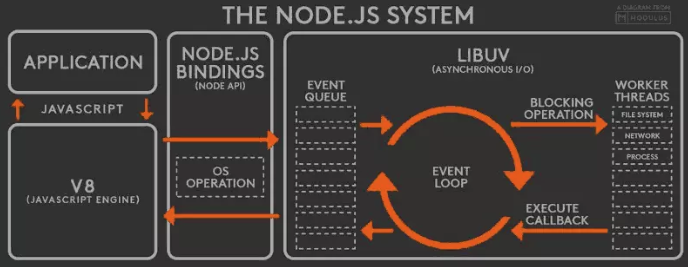
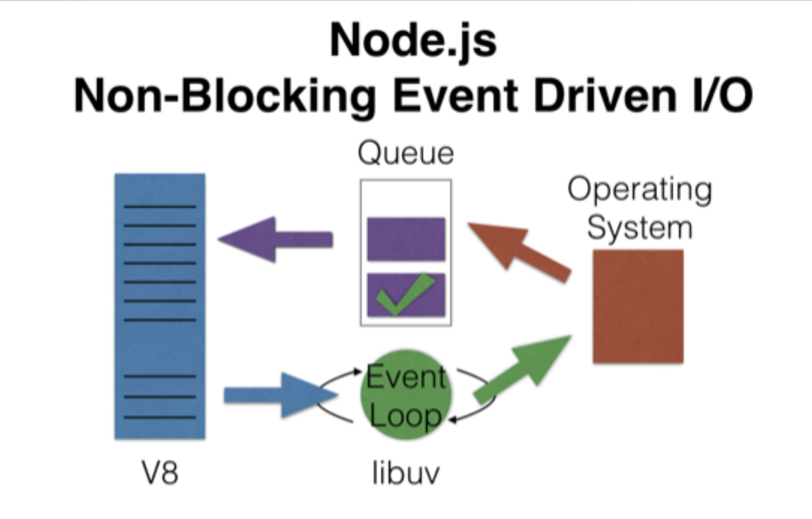

# V8引擎和Linux异步机制

## 零、写在前面

我们都知道JavaScript是单线程、单任务的语言，但是利用NodeJS也是可以执行多任务的。NodeJS执行多任务并不是利用的多进程或者多线程，NodeJS使用的是另外一种方式——事件循环机制

## 一、NodeJS系统体系

**NodeJS系统体系图：**

从图中我们可以看到整个NodeJS大致可以分为一下几个部分：

+ V8
+ NodeJS Bindings
+ libuv

从这几个组成部分我们可以得出这么一个结论，NodeJS的很多组成部分都是第三方的：

+ V8是Chrome浏览器中的JS解释器。
+ libuv是一个C语言的异步IO库。

这两个在Node中的重中之重全都是Nodejs使用的第三方的东西。

> **我们平时写的在Node环境中运行的代码在什么地方？**
>
> 我们平时写的代码就是图中的Application部分。是JS语言写成的。

NodeJS只是解释JS语言的其他的什么也不做，至于开发者在JS语言中调用底层的操作，是Node来替开发者去调用系统的API。

除了`V8`和`libuv`是第三方的东西，剩下的`Node Buildings`才是真正Nodejs自己的东西（只有这一部分是自己的）。

**那么问题来了，Node Buildings到底在NodeJS系统体系中起到了什么作用呢？**

其实Node Buildings就像一个交换机（网络交换机，当然这只是个比喻）。V8和操作系统底层的通信和操作都是要经过Node Buildings的。也就是说V8所有的操作都是要接到Node Buildings上的。

> 我们注意看NodeJS的体系图，在Node Buildings中有一个`OS Operation`的虚线框，这表示Node Buildings只是看起来像是和操作系统连在一起，但是实际上并不是，操作系统还在`libuv`之后。

既然NodeJS的多任务不是利用多进程或者是多线程，而是利用的异步IO、事件循环机制。举个例子，比如我们要请求一个网络端口，这时候肯定要启动一个新的任务，然后肯定是是异步去请求，先把这个任务（请求）放在事件队列（Event Queue）中，然后经过事件循环机制，把这个任务交给工作线程（Worker Thread）去调用更底层的API。

>NodeJS既然存在Worker Thread就表明了NodeJS并不是单线程的，只是JS是单线程语言。
>
>工作线程包括：
>
>+ 文件系统 File System
>+ 网络 Network
>+ 进程 Process

工作线程之后才是操作系统的系统调用，也就是说NodeJS是用工作线程来调用操作系统的系统调用。然后操作系统就需要干活了，到了操作系统的网络协议栈向远程发出请求接收响应这个操作是需要时间的。这个时间段内，我们的程序是不需要等待的，而是继续执行，干其他的事儿。工作线程会帮我们等到请求成功返回了，然后再立即通过回调，把回调交给事件循环机制，统一调度，从而执行开发者程序中的回调函数（一定是通过事件循环）。

> 上述的回调机制实际上依附的是NodeJS的主线程。这样才能保证回调不会出问题。
>
> 事件循环和工作线程之间的调用实际上是通过线程间通信完成的。

**NodeJS数据流向图（非阻塞事件驱动）：**

NodeJS处理的数据从V8来，V8之前就是开发者所写的程序代码。也就是说数据实际上就是程序代码中的数据，V8进行解释，然后再交给事件循环，事件循环之后就是工作线程去调操作系统的系统调用（具体干活的是操作系统），操作系统返回回来的结果去找事件队列里面所对应的事件，找到事件之后回调应用程序中的回调函数。

+ **V8引擎实际上是起到了执行程序代码的作用。**

> **同步、异步和阻塞、非阻塞两组概念之间的关系：**
>
> 简单来说就是，同步、异步是运作机制，而阻塞、非阻塞式调用机制。

**NodeJS实现结构图：**

上图是NodeJS`具体的实现`上的图。

先看一下左图，`Main Thread`是`主线程`，应用程序就是依附在主线程上执行的。主线程启动，在主线程启动之前NodeJS的进程肯定是提前启动的，那么同样的主线程一旦结束，那么NodeJS的进程也就随之结束了。既然应用程序是依附在主线程上执行的，那么显然地，`V8也是依附在主线程上的`，原因很简单执行应用程序的就是V8。应用程序需要调用大量的`NodeJS API`，NodeJS也为我们提供了大量的API，这些API的具体使用在官网文档中都有详细的介绍。

所以说，虚线框内的API就是NodeJS提供的API，这部分API有NodeJS自己实现的，还有一部分是封装的第三库的API。

再往下，我们会看到`Node Buildings`（也就是我们上文所说到的交换机），Node Buildings类似一个胶水一样的东西，把`V8、Async I/O、EventLoop、DNS`这些东西粘到一起，也就是说`V8、Async I/O、EventLoop、DNS`这些东西全部连接在了`Node Buildings`上。

最后，`Add-Ons`是插件，这些插件是功能上的插件，并不参与NodeJS的机制。

NodeJS的插件：

+ Cypto 加密库
+ Http请求
+ Zilb 压缩库

再看一下右图，我们可以清楚的看到最上层是`Node标准库(Node Standard Library)`，这是JS实现的，就对应了作图的API。往下是`Node Buildings`，这才是Node自己的核心，为什么这么说呢？因为Node的实现就是这个，其他的核心库都是用的第三方的，例如V8和libuv。再往下就是V8、Async I/O、Event Loop，这些都是用C来实现的。

综上所述，我们可以得出一个结论，NodeJS的所有实现包含了三个部分，两种语言来实现：

+ API（JS实现）
+ Node Buildings（C++实现）
+ Add-Ons（C++实现）

除了这三部分，其他的东西都是第三方的。我们接下来讨论的重点就在于第三方的Async I/O和Event Loop。要想弄清楚这俩玩意儿，就需要深入到操作系统的内部。因为我们在做NodeJS相关的东西的时候，调用Node的API，最后实际上都是在调用操作系统的系统调用。

## 二、Linux用户空间与内核空间

在前面的文章中我们粗略的探讨过有关于Linux的内容。我们知道Linux有两种状态：

+ 用户态
+ 内核态

> **什么是用户态？**
>
> 开发者自己写出来的代码去执行的时候叫**用户态**。
>
> **什么是内核态？**
>
> 当应用程序的代码中执行API的时候，API的执行必须由操作系统内核去做，这个时候是**内核态**。

### 为什么要区分内核空间和用户空间？

是为了代码在执行过程中的安全。防止这两种代码在执行的时候互相干扰。Linux在设计的时候是环形的，最内部的环是Linux内核，是最核心的部分，外面才是系统调用，再往外是shell和公共函数库，最后最外层才是应用程序（也就是用户的程序）。当用户的程序去调用内核的代码时，是不可能直接调用的。原因也很简单，因为内核的代码都是些二进制，用户的代码不可能直接调用二进制的程序，所以内核是以库的形式让用户的程序去调用。我们在调用的时候需要穿透那层库才能进入到内核空间。

> **举例说明：**
>
> **例子：**比如说我们现在有一个需求，输入a和b两个数字，计算出a + b，然后把结果写入到文件中。
>
> **解析：**这么一个简单的需求，就需要从用户态和内核态之间来回的切换。最开始，程序一开始执行是在用户空间内，也就是用户态，执行的是应用程序，当执行到输入的时候，程序会停止执行等待键盘的输入。键盘是硬件，应用程序是不能直接和键盘进行通信的，必须要交给内核进行操作。所以输入的时候应用程序就要去调用操作系统的API（也就是系统调用），然后操作系统从键盘这里读出数据，再传给应用程序。那么从系统调用的执行到操作系统把数据传给应用程序这一过程就是**内核态**。之后程序往下走，等待b的输入，同样的键盘的出入又进入到了内核态，把键盘数据传回来有切换到了用户态，在用户态应用程序的代码接着把这两个数字相加。最后应用程序要把这个结果写到文件中，写入文件就得操作硬盘（硬盘的写入）。因为硬盘又是一个硬件，和键盘一样的，应用程序是不能与硬件直接通信的。那么就要从用户态切换到内核态，又内核来进行真正的写操作。写完文件之后，操作系统把写入状态（成功或者失败）返回回来，这又从内核态切回到用户态。
>
> 最后，应用程序执行完了要退出，退出的时候还是要通知操作系统，这时候要调用操作系统的系统调用exit(0)，这时候就又回到了内核态，就再也不回到用户态了。这个时候整个的程序周期才算结束。

那么问题来了，怎么才能从用户空间到内核空间呢？

这个问题很简单，就是通过`系统调用`。

那么我们的程序在执行的时候实际上就存在着三种状态：

+ 用户态
+ 内核态
+ 两种状态之间切换的状态

两种状态之间切换的动作也是需要时间的，不过这个时间是很短的。

处理器在任何指定时间点上的活动概括为下列三者之一:

+ 运行于用户空间，执行用户进程。

+ 运行于内核空间，处于进程上下文，代表某个特定的 进程执行。

+ 运行于内核空间，处于中断上下文，与任何进程无 关，处理某个特定的中断。

这里有一个实际问题：**NodeJS在什么地方进行用户空间和内核空间的切换？**

我们再回到第一幅图——NodeJS的系统体系图，图中已经明确的告诉我们NodeJS利用`工作线程(work thread)`进行和操作系统的通信，也就是说是工作线程调用的操作系统的系统调用。当然就是在工作线程这个地方进行用户空间和内核空间的切换。

## 三、Linux的信号机制

我们在前面的文章中探讨过Linux的`kill`命令。kill命令就是用来发信号的命令，通过发信号杀死进程。

通过`kill -l`命令我们可以看到一共有64个信号，在linux中信号是进程间通信当中的唯一的一种异步机制。Linux中的信号只是用来通知并不传递数据（所谓的信号就是一个数字，没有复杂的数据结构）。

如果存在A和B两个进程，进程A需要发送一个数据到进程B。数据是不可能直接发送过去的，进程A不可能直接调用进程B的一个函数，把数据直接塞给进程B的。实际的情况是，进程A准备好数据之后放到共享内存中，然后向进程B发送一个信号——告诉进程B数据准备好了。进程B收到信号后再从共享内存中取出数据。

**信号最早是从Unix来的，Unix的信号只有前31个。所以在Mac下信号只有31个。**

对信号的处理方法：

+ 对于需要处理的信号，进程可以指定处理函数，由该函数来处理。
+ 忽略某个信号，对该信号不做任何处理，就象未发生过一样。其中，有两个信号不能忽略:SIGKILL及SIGSTOP。
+ 对该信号的处理保留系统的默认值，这种缺省操作，对大部分的信 号的缺省操作是使得进程终止。进程通过系统调 用signal来指定进程对某个信号的处理行为。

信号是由内核产生的。

## 四、Linux中的I/O模型

Linux中有四种I/O模型：`同步（Synchronous）`、`异步 (Asynchronous)`、`阻塞 (Blocking)`、`非阻塞 (Nonblocking)`。同步和异步是流程上的模式，阻塞非阻塞式调用上的模式。属于两个维度。这两个维度组合一下能出现一个矩阵。

+ 同步：同步是用户线程发起I/O请求后需要等待或者轮询内核I/O操作完成后才能继续执行。
+ 异步：异步是用户线程发起I/O请求后仍需要继续执行，当内核I/O操作完成后会通知用户线程，或者调用用户线程注册的回调函数。
+ 阻塞：阻塞是指I/O操作需要彻底完成后才能返回用户空间。
+ 非阻塞是指I/O操作被调用后立即返回一个状态值，无需等I/O操作彻底完成。

同步是一种调用模式~

### 同步阻塞I/O模型

同步阻塞I/O模型是最常见的IO模型。

**同步阻塞I/O模型时序图：**

图中存在两个维度，横向的是模块，我们可以看到有两个模块`Application`、`Kernel`，模块这个维度是静止的，一开始设计有几个模块就几个模块。纵向的是时间维度，时间线是按照时间的正向进行发展。横向的是应用程序和系统内核，分别属于用户空间和内核空间。同步需要等待，这个等待是在用户空间上。

这个时序图是以读文件（readFile）为例，应用程序调用操作系统的读文件的API的时候，主流程在用户空间，应用程序执行到readFile的代码之后，进入内核空间。内核空间再根据机制去读文件中的数据，这个操作是需要时间的，操作系统读文件的时间区间就是`initiate read I、O`到`Read response`这一段。那么内核在读文件的这一段时间，用户空间的应用程序一直处于等待的状态，等到系统内核返回数据之后应用程序才能往下继续执行。

**这就是同步阻塞式IO模型！**

简单来说就是，用户空间的应用程序在执行系统调用之后会被阻塞，直到系统调用完成（数据传输完成或者出现错误）。此时应用程序只是处于简单的等待响应状态不会消耗CPU。

### 同步非阻塞式I/O模型

**同步非阻塞式I/O模型时序图：**

同步非阻塞I/O模型属于比较`低效`的`调用方式`。关于同步非阻塞要分为两部分来看，一个是`同步`，一个是`非阻塞`，我们先来讨论非阻塞。

我们通过`时序图`可以看出来当应用程序调用操作系统的系统调用的时候，从用户态切换到了内核态，然后还没有执行完`读操作`就立马返回给应用程序一个返回值，这是从内核态切换到了用户态。然后应用程序接着再次调用操作系统的系统调用去执行读操作，然后再返回到用户态。这种操作会进行多次，直到操作系统的读操作执行完成，然后返回给应用程序最终结果。**这一过程中会有很多次的用户态与内核态的相互切换。**

应用程序要的是最终的结果，无法立马返回确切的结果，那么就会反复的确认询问。这样一直在做切换，这就是同步非阻塞I/O调用低效的原因。

然后我们再解释`同步`，我们可以看到用户空间的应用程序被切割出了很多的时间间隙，这些时间间隙应用程序很难利用。

非阻塞意味着如果I/O操作不能立 即完成，则需要应用程序多次调 用直到任务完成。这是非常低效的，大多数时间应用程序必须等待或者做其他的事情直到数据可用。

### 异步阻塞I/O模型

**异步阻塞I/O模型时序图：**

依然是调用`阻塞API`，但是主处理流程是`异步`的，这就意味着我们在等待的时候可以做别的事情。代码在运行的过程中调用了一个阻塞式的API，阻塞式的API是无法立即返回的，需要等待最终结果完成。异步的阻塞式的等待操作不是应用程序去等待，而是引入了一个组件，让组件去等待。这个组件就是selectAPI，帮我们等待结果。所以说应用程序的进程并没有在等待，就可以继续执行做其他的事情。

select系统调用最大的好处是可以监听多个文件描述符，而且可以指定每个描述符要监听的 事件:可读事件、可写事件和发生错误事件。

select系统调用的主要问题是效率不高。虽 然它是一个非常方便的异步通知模型，但不建议将其用于高性能I/O中。并发数是写在操作系统源代码中的。

### 异步非阻塞I/O模型

**异步非阻塞IO模型时序图：**

+ 异步非阻塞I/O模型是可以并行处理I/O的模型。
+ 异步非阻塞I/O模型的读请求会立即返回，表明读操作成功启动。然后应用程 序就可以在读操作完成之前做其他的事情。当读操作完成时，内核可以通过信 号或者基于线程的回调函数来通知应用程序读取数据。
+ 在单个进程可以并行执行多个I/O请求是 因为CPU的处理速度要远大于I/O的处理 速度。 当一个或多个I/O请求在等待处理 时，CPU可以处理其他任务或者处理其他 已完成的I/O请求。

## 五、select

select模型的关键是使用一种有序的方式，对多个套接字进行统一的管理和调度。

### select模型的缺点

+ 单个进程能够监视的文件描述符的数量存在最大限制，通常是 1024，当然可以更改数量，但由于select采用轮询的方式扫描 文件描述符，文件描述符数量越多，性能越差;(在linux内核 头文件中，有这样的定义:#define __FD_SETSIZE 1024)
+ 内核/用户空间内存拷贝问题，select需要复制大量的句柄数据 结构，产生巨大的开销;
+ select返回的是含有整个句柄的数组，应用程序需要遍历整个 数组才能发现哪些句柄发生了事件;
+ select的触发方式是水平触发，应用程序如果没有完成对一个 已经就绪的文件描述符进行IO操作，那么之后每次select调用 还是会将这些文件描述符通知进程。

**select图解：**

## 六、epoll模型

**epoll模型的优点：**

+ 支持一个进程打开大数目的socket描述符
+ IO效率不随FD数目增加而线性下降
+ 使用mmap加速内核与用户空间的消息传递

**epoll的两种工作模式：**

+ LT(level triggered，水平触发模式)是缺省的工作方式，并且同时支持 block 和 non-block socket。在这种做法中，内核告诉你一个文件描述符是否就绪了，然后你可以对这个就绪的fd 进行IO操作。如果你不作任何操作，内核还是会继续通知你的，所以，这种模式编程出错误可 能性要小一点。比如内核通知你其中一个fd可以读数据了，你赶紧去读。你还是懒懒散散，不 去读这个数据，下一次循环的时候内核发现你还没读刚才的数据，就又通知你赶紧把刚才的 数据读了。这种机制可以比较好的保证每个数据用户都处理掉了。
+ ET(edge-triggered，边缘触发模式)是高速工作方式，只支持no-block socket。在这种模式 下，当描述符从未就绪变为就绪时，内核通过epoll告诉你。然后它会假设你知道文件描述符 已经就绪，并且不会再为那个文件描述符发送更多的就绪通知，等到下次有新的数据进来的 时候才会再次出发就绪事件。简而言之，就是内核通知过的事情不会再说第二遍，数据错过 没读，你自己负责。这种机制确实速度提高了，但是风险相伴而行。

**epoll模型图解：**

## 七、IOCP模型

windows中的高效IO模型，这个模型有一个毛病就是层次不清楚。

**IOCP模型图解：**

1. 创建一个完成端口
2. 创建一个线程A
3. A线程循环调用GetQueuedCompletionStatus()函数来得到IO操作结果，这个 函数是个阻塞函数。
4. 主线程循环里调用accept等待客户端连接上来。
5. 主线程里accept返回新连接建立以后，把这个新的套接字句柄用 CreateIoCompletionPort关联到完成端口，然后发出一个异步的 WSASend或者 WSARecv调用，因为是异步函数，WSASend/WSARecv会马上返回，实际的发 送或者接收数据的操作由WINDOWS系统去做。
6. 主线程继续下一次循环，阻塞在accept这里等待客户端连接。
7. WINDOWS系统完成WSASend或者WSArecv的操作，把结果发到完成端口。
8. A线程里的GetQueuedCompletionStatus()马上返回，并从完成端口取得刚完 成的。
9. 在A线程里对这些数据进行处理(如果处理过程很耗时，需要新开线程处理)，然后接着发。

## 八、libuv

[libuv官方网站](https://libuv.org/)

