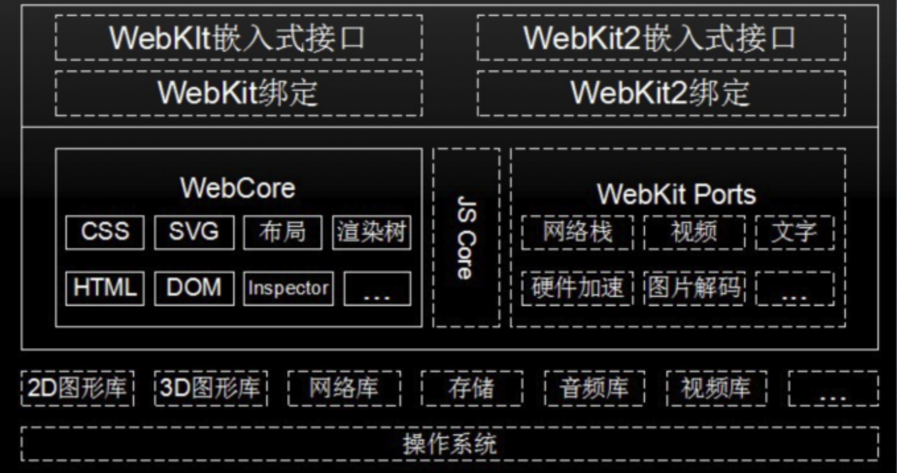
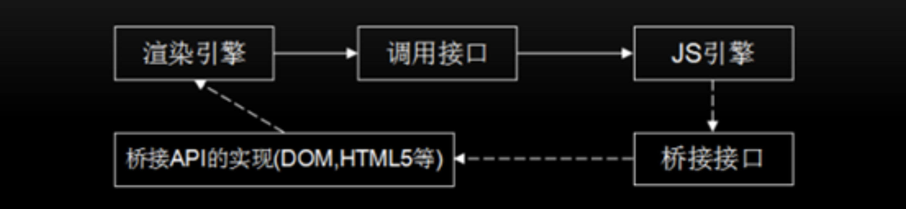
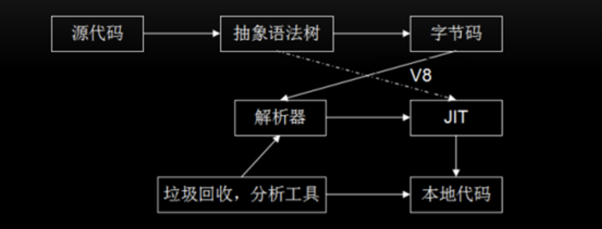

# V8引擎源码分析

## 零、写在前面

**本文大纲：**

+ 渲染引擎及 Webkit 体系结构
+ Node.js 中的 V8 引擎
+ V8 源码总览
+ V8 源码分析

## 一、渲染引擎及webkit体系结构

在以前的文章中我们探讨过浏览器的渲染引擎，渲染引擎就是能够将HTML、CSS、JS文本以及相应的资源文件转换成图像结果。

渲染引擎的分类：

+ Tridend(IE)
+ Gecko(FF)
+ webkit（Safari,Chrome,Andriod浏览器），处于独立的进程。

现在的浏览器基本上都是多进程浏览器，渲染引擎一般也处在独立的进程中。在前面的文章中我们主要是对于`WebCore`进行了探讨。

+ JS Core：苹果的JS引擎，在chrome中被换成了V8。
+ WebKit Ports：是对于底层第三方库的封装。
+ 最上层提供的是UI接口。

## 二、JS引擎和渲染引擎

在前面的文章中我们分析过渲染引擎的工作流程，里面提出了一个问题：

**为什么在解析HTML的时候，遇到JS代码，HTML解析器会暂停工作，先由JS解释器对JS代码进行解释执行？**

当时我们解释的比较笼统，现在就清楚的解释这个问题。

首先我们要明确一个概念：**渲染引擎使用JS引擎的接口来处理逻辑代码并获取结果。**那么现在问题就来了，JS代码中一般会有大量的DOM操作，那么JS引擎是怎么调用渲染引擎中的API来操作DOM呢？**在这里JS引擎并不是直接去调用渲染引擎中的DOM的。**

为什么不是JS引擎直接调用渲染引擎的接口呢？

这个问题很简单，因为如果直接调用，那么JS引擎和渲染引擎之间的调用就会是一个环路，这样的设计在代码实现上很容易产生**死锁**，函数的调用栈会出现嵌套从而产生**`死锁`**！

现在我们就知道了一个结论：

当渲染引擎要调用JS引擎的时候是直接通过JS引擎提供的接口直接调用的。但是JS引擎去操作DOM的时候却不是直接调用渲染引擎（先记住这个结论，后面我们会用到）。这里我们需要解答一个问题：

那就是JS引擎操作dom的时候渲染引擎是怎么被间接调用的？

HTML解析器是依附在渲染引擎的进程上的，HTML解析器在解析HTML文本的时候，解析出来的HTML的树形结构（也就是DOM结构）当然是在内存中，那么这个内存当然是由渲染引擎去管理。到这里看上去JS引擎可以直接通过渲染引擎去操作DOM结构的内存，但是前文中说道这样会在编码实现上产生**死锁**。

所以在设计调用方式的时候是不能这样环形调用的，正确的设计是要实现一个`桥接接口`，这个桥接接口就相当于发一个消息到渲染引擎。JS在直接调用webkit的时候实际上是发了一个数据包，发送数据包也不是直接发给渲染引擎，而是中间有一个消息处理框架，JS把数据包发送给消息处理框架。之后又消息处理框架把数据包发送给渲染引擎。最后渲染引擎根据具体的指令在对数据进行处理。

数据包结构：

+ 事件名称，可以当做一个指令。
+ 数据。

>综上所述：
>
>+ 渲染引擎使用JS引擎的接口来处理逻辑代码并获取结果。
>+ JS引擎通过桥接接口访问渲染引擎中的DOM及CSSOM

**调用关系图：**

我们在图中也可以看出，JS引擎在调用渲染引擎的时候都是虚线，调用的是桥接接口，发送了什么东西。那么相对应的渲染引擎也要提供桥接API。

## 三、JavaScript引擎的工作流程

**JS引擎工作流程示意图：**

+ 通过阅读源码结构我们会知道，首先是编译器会把源代码编译成`抽象语法树`
+ 然后编译器又会把抽象语法树会转成字节码。当前这一步和上一步是预处理阶段，就是为了把文本形式的源代码处理成更加高效字节码。
+ 在绝大部分情况下，是由解析器来解析字节码。但是这里还有一个提高执行效率的操作，那就是`JIT（Just In Time）`，直接把抽象语法树转成了二进制代码，然后再给解析器一个调用的方式，直接跑在CPU上的。这部分被处理成二进制的代码就不依赖解析器了。

> **JIT在什么时候用到？**
>
> 解析器在执行字节码的时候，会记录字节码的执行次数，当同一段代码被反复执行达到一个阈值，解析器就会记录重复执行的代码交给JIT，编译成二进制代码。JIT即时编译。

JS引擎会把源代码编译成抽象语法树，在编译成字节码，这源于JS引擎的`虚拟机化`。类比Java，JS引擎的虚拟机化和Java的虚拟机是相同的，都是把源代码编译成字节码，然后跑在一个系统上，Java的字节码是跑在JVM上。JS的字节码是跑在JS解析器上。和JVM相同的是JS引擎也是把底层的操作系统和CPU的不同做了封装。`一次编译，到处运行。`

这样处理把执行的效率提高了。

> **什么是抽象语法树？**
>
> 抽象语法树是编译过程中一个重要的数据结构。

## 四、V8与JavaScript Core

+ JavaScript Core 引擎是WebKit中默认的JavaScript引擎，也是苹果开源的一个项 目，应用较为广泛。最初，性能不是很好，从2008年开始了一系列的优化，重新实 现了编译器和字节码解释器，使得引擎的性能有较大的提升。随后内嵌缓存、基于正 则表达式的JIT、简单的JIT及字节码解释器等技术引入进来，JavaScriptCore引擎也 在不断的迭代和发展。
+ JavaScriptCore与V8有一些不同之处，其中最大的不同就是新增了字节码的中间表 示，并加入了多层JIT编译器(如:简单JIT编译器、DFG JIT编译器、LLVM等)优化 性能，不停的对本地代码进行优化。

## 五、V8源码一览

+ [V8文档地址](https://v8.dev/docs)
+ [V8源码](https://cs.chromium.org/chromium/src/v8/)
+ 通过源码可以学到的东西：
  + 增强对JavaScript的理解
  + 前端算法
  + 内存管理与CG算法
  + 编译原理、操作系统的知识
  + 面试装逼的高级方式

### V8引擎源码都看什么

1. 工作过程
2. 数据表示
3. 类型
4. 内存管理
5. 绑定机制与扩展机制
6. 字节码与JIT