# Webpack在一线开发中的优化

## 零、写在前面

`webpack5`已经出来很长时间了，但是一些公司还是在用`webpack4`，所以现在现在市场上是`webpack4`和`webpack5`并存的情况，这篇文章我们就一并分析一下`webpack4`和`webpack5`。


## 一、webpack4与webpack5的对比

关于webpack的优化实际上就是两个方面的优化：

+ 打包速度上的优化（时间上的优化）。
+ 打包结果大小上的优化（空间上的优化）。

对比所有的优化手段，其实最大的优化就是从webpack4迁移到webpack5。换了webpack的版本就是最大的优化。下面我们就对这两个webpack的版本进行详细的对比。

**1.新建webpack目录，在webpack目录中新建webpack4、webpack5两个目录。**

目录结构：

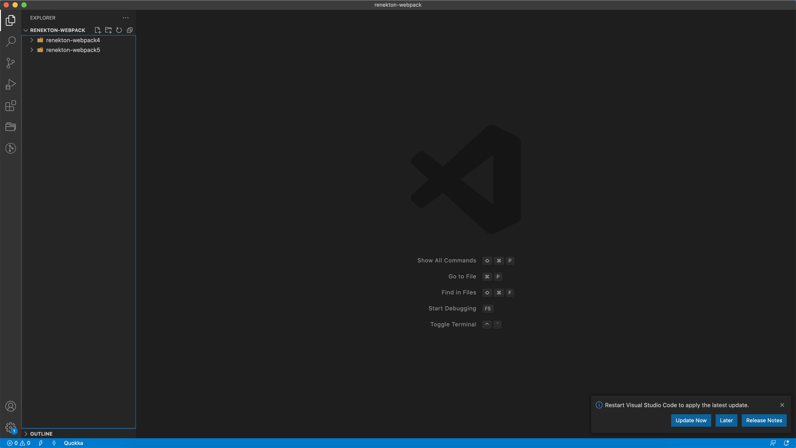

**2. 初始化两个目录**

分别在webpack4和webpack5目录下执行命令：

```shell
# webpack4、 webpack5

$ npm init -y
```

执行完之后我们会发现在两个目录下面多了package.json文件，编辑这两个文件：

`/webpack4/package.json`

```json
{
  "name": "renekton-webpack4",
  "version": "1.0.0",
  "description": "",
  "main": "index.js",
  "scripts": {
    "dev": "webpack --mode development"
  },
  "keywords": [],
  "author": "",
  "license": "ISC"
}
```

`/webpack5/package.json`

```json
{
  "name": "renekton-webpack5",
  "version": "1.0.0",
  "description": "",
  "main": "index.js",
  "scripts": {
    "dev": "webpack --mode development"
  },
  "keywords": [],
  "author": "",
  "license": "ISC"
}
```

添加了`dev`命令。

**3.在两个目录中创建src/index.js**

```javascript
// src/index.js

const data = "然哥是个冰冷的男人";
console.log(data);
```

**4.分别在两个目录下配置不同的webpack和webpack-cli**

`wepack4`

```shell
$ npm install webpack@4.46.0 webpack-cli -D
```

`webpack5`

```shell
$ npm install webpack@4.46.0 webpack-cli -D
```

**5.分别在webpack4和webpack5的目录下执行打包**

```shell
$ npm run dev
```

**执行结果对比**

Webpack4:

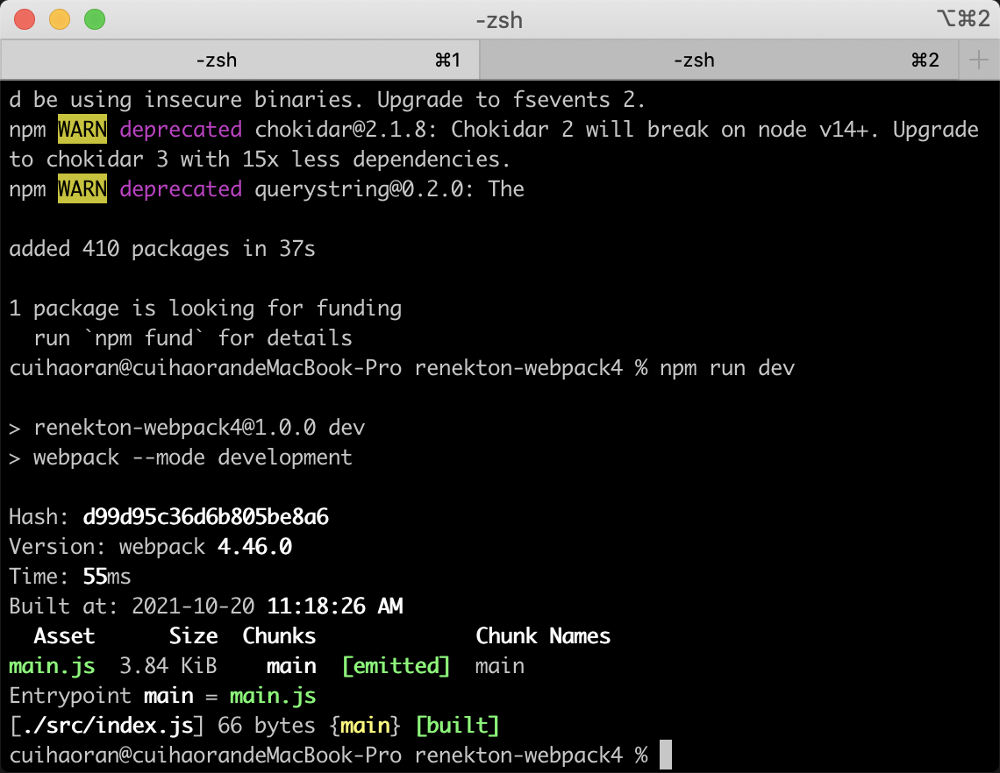

Webpack5:

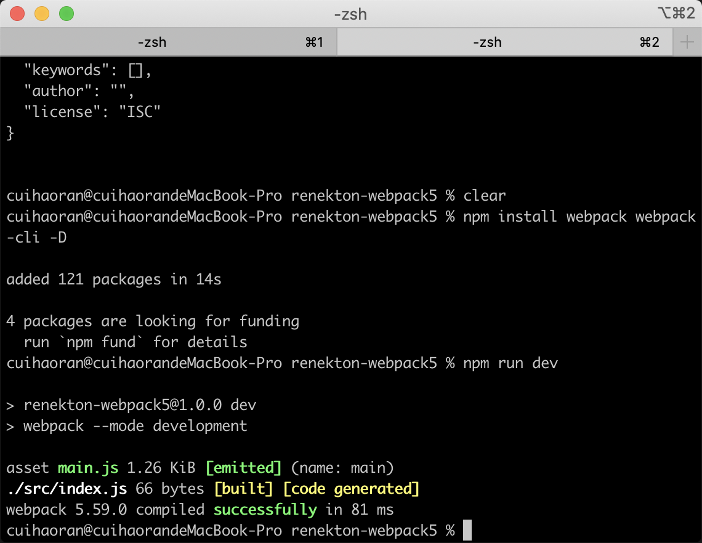

> **打包产生了dist/main.js**
>
> Webpack4：打包的结果大小为3.84KB
>
> Webpack5：打包的结果大小为1.26KB

**结论：**

在不做任何优化操作的前提下我们从webpack4迁移到webpack5大小就会变成之前的1/3。换句话说webpack5本身就替我们开发者做了很多的优化了。**升级webpack的版本本身就是一种重要的优化手段！**因为打完包之后的`main.js`，webpack4打完包有效代码是60行，webpack5是10行。

这些还只是`webpack5`在`开发阶段`的优化。


## 二、Webpack5 & Prepack

在最后构建ES代码的时候，Prepack可以深层次的优化JS的代码。`Prepack`拥有自己的代码解释器。Prepack 是一种优化 JavaScript 源代码的工具：可以在编译时而不是运行时完成的计算被消除。Prepack 将 JavaScript 包的全局代码替换为简单的赋值序列等价代码。这摆脱了大多数中间计算和对象分配。`这是个让人兴奋的工具！`

[Prepack官网](https://prepack.io/)，对Prepack有兴趣的读者可以深入的了解一下~~

值得关注的是webpack5模拟了Prepack的功能，给JS代码做了优化。我们来看一下Webpack5中是怎么优化代码的~

**1.更改webpack4以及webpack5的index.js中的代码**

```javascript
// src/index.js

(function () {
  function fibonacci(x) {
    return x <= 1 ? x : fibonacci(x - 1) + fibonacci(x - 2);
  }
  global.x = fibonacci(15);
})();
```

**2.配置两个版本webpack的生产环境的命令**

Webpack4的package.json

```json
{
  "name": "renekton-webpack4",
  "version": "1.0.0",
  "description": "",
  "main": "index.js",
  "scripts": {
    "dev": "webpack --mode development",
    "prod": "webpack --mode production"
  },
  "keywords": [],
  "author": "",
  "license": "ISC",
  "devDependencies": {
    "webpack": "^4.46.0",
    "webpack-cli": "^4.9.1"
  }
}
```

Webpack5的package.json

```json
{
  "name": "renekton-webpack5",
  "version": "1.0.0",
  "description": "",
  "main": "index.js",
  "scripts": {
    "dev": "webpack --mode development",
    "prod": "webpack --mode production"
  },
  "keywords": [],
  "author": "",
  "license": "ISC",
  "devDependencies": {
    "webpack": "^5.59.0",
    "webpack-cli": "^4.9.1"
  }
}
```

我们配置了生产环境的webpack命令，因为只有在生产环境下webpack5才有代码优化。

更改`src/index.js`：

```javascript
(function () {
  function hello() { return 'hello'; }
  function world() { return 'world'; }
  const s = hello() + ' ' + world();
  console.log('s: ', s);
})();
```

更改完成执行以下命令：

```shell
$ npm run prod
```

我们来看以下`dist/main.js`：

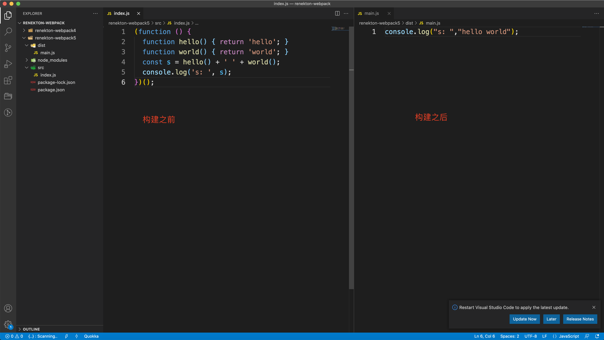

我们惊喜的发现，webpack5把index.js中的代码优化的只剩下一行代码。**掌声响起~~**

**不得不感叹以下，Webpack5太香了，简直残暴！**

同样的代码我们再放到webpack4中做同样的操作，结果如下：

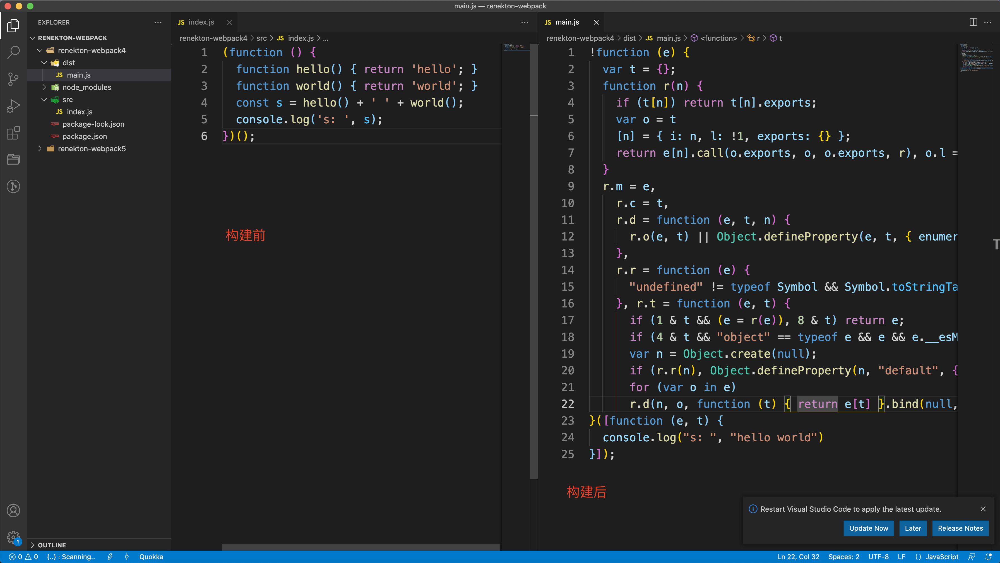

相比之下，webpack4的构建就差了很多。从这里可以看到webpack4的构建结果肯定是比webpack5的体量要大的。


## 三、Webpack到底怎么样？

面试中经常会被面试官问到以下这么几个问题：

### I、你觉得webpack慢吗？

那么webpack到底慢不慢呢？当然慢。原因显而易见，webpack就是JS写的，JS是解释型的语言需要V8进行解释执行。我们前面的文章写到V8执行JS源码的过程，从JS源代码到CPU能执行的二进制代码路径非常长。要先形成
AST，然后编译成字节码，然后经过JIT形成二进制。这个大致的路径是非常长的，这都需要时间，所以webpack`慢`。

对比esbuild的快速，webpack的慢是由于JS语言的慢。而esbuild使用go语言写的，go语言是编译型语言，会直接编译生成本地代码，CPU直接执行。和Vue3结伴出现的`Vite`没有自己的东西，核心的原理就是`esbuild + Koa`，没什么意思。

同理`swc`使用`Rust`写的，也是直接编译成二进制代码。


### II、优化webpack4的手段

对于webpack的优化，上文也提到了，主要是在两个方面：

+ 编译速度上
+ 打包之后的大小

在webpack4中新建webpack.config.js，其实拖慢webpack的大致有两个东西，一个是loader另一个就是plugin。那么我们需要具体的知道到底是什么拖慢了webpack，我们需要一个插件来监测一下：

**Speed Measure Plugin**这个插件能够很好的完成这个任务。安装：

```shell
$ npm install --save-dev speed-measure-webpack-plugin
```

创建`webpack.config.js`：

```javascript
const SpeedMeasurePlugin = require("speed-measure-webpack-plugin");

const smp = new SpeedMeasurePlugin();

const webpackConfig = smp.wrap({
  plugins: [],
});

module.exports = webpackConfig;
```

在我们平时的前端项目中`babel-loader`是必然会用到的，`babel-loader`也在一定程度上拖慢了webpack的速度。我们安装一下babel-loader：

```shell
$ npm install -D babel-loader @babel/core @babel/preset-env
```

```javascript
const SpeedMeasurePlugin = require("speed-measure-webpack-plugin");

const smp = new SpeedMeasurePlugin();

const webpackConfig = smp.wrap({
  module: {
    rules: [
      {
        test: /\.m?js$/,
        exclude: /node_modules/,
        use: {
          loader: 'babel-loader',
          options: {
            presets: [
              ['@babel/preset-env', { targets: "defaults" }]
            ]
          }
        }
      }
    ]
  },
  plugins: [

  ],
});

module.exports = webpackConfig;
```

上面是在webpack.config.js中配置好babel-loader。

再次执行构建命令：

```shell
$ npm run dev
```

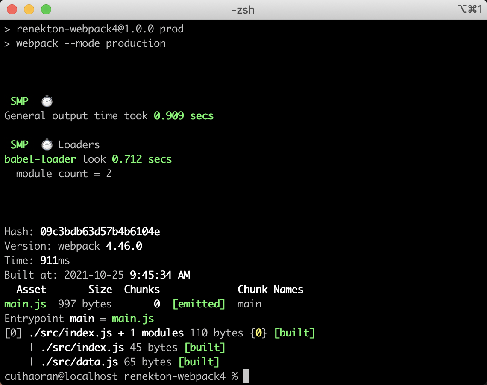

构建时间由上次的`55ms`增加到`911ms`，多出的这八百多毫秒毫无疑问是`babel-loader`，原因很简单，前后只有babel-loader这一条件发生了变化。虽然只有区区不到一秒的时间，但是这仅仅是只有一个文件的时候发生的变化，试想如果项目体量巨大结构复杂，这个时间就非常巨大了。

**这就产生了一个问题，我们如何优化掉babel-loader的时间？**

答案其实很简单，那就是把babel-loader换掉，换成`swc`。[swc-loader](https://www.npmjs.com/package/swc-loader)是一款对标babel-loader的webpack插件，配置和`babel-loader`几乎完全相同。

**安装swc-loader：**

```shell
$ npm install @swc/core swc-loader -D
```

配置swc-loader：

```javascript
const SpeedMeasurePlugin = require("speed-measure-webpack-plugin");

const smp = new SpeedMeasurePlugin();

const webpackConfig = smp.wrap({
  module: {
    rules: [
      {
        test: /\.m?js$/,
        exclude: /(node_modules|bower_components)/,
        use: {
          // Use `.swcrc` to configure swc
          loader: "swc-loader"
        }
      }
    ]
  },
  plugins: [

  ],
});

module.exports = webpackConfig;
```

然后再次执行：

```shell
$ npm run dev
```

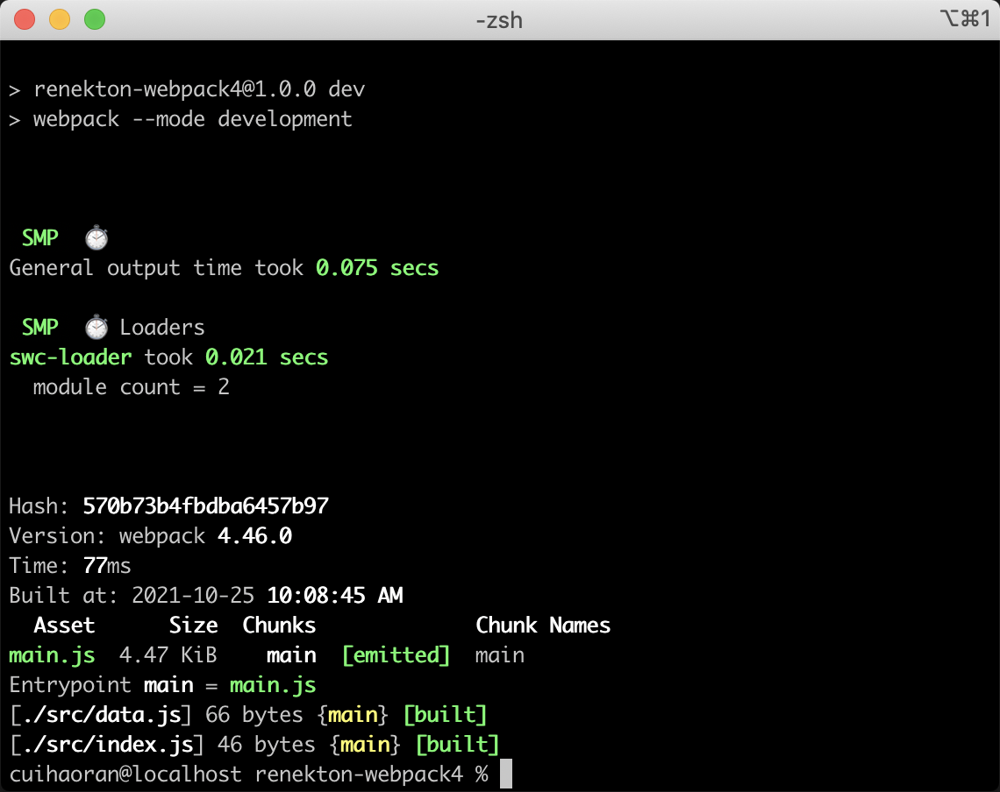

惊喜的发现构建时间为`77ms`，构建速度大幅度提升。

**速度为什么提升了这么多？**

这个问题其实我们在上文中已经提到了，`babel-loader`是用JS写的，JS要经过V8才能成为机器码给CPU执行，这个路径是很长的，所以会耗费大量的时间，但是`swc-loader`使用rust写的，rust会直接编译成机器码让CPU执行，所以速度会快很多。

还有很多的开发者试图使用多线程让多个loader并行执行，这乍一看能够提高webpack的构建速度，但是我们忽略了一个重要的因素，开启多线程会大大提升资源消耗。这也是需要时间的，所以说会出现使用了多线程之后反而拖慢了整个构建的过程。一般开发人员使用的多线程的包是`thread-loader`，这里大家作为了解，除非你的项目真的`巨大`，上thread-loader才会提升速度，否则反而会拖慢构建速度。

**thread-loader**

安装thread-loader：

```shell
$ npm install --save-dev thread-loader
```

配置thread-loader：

```javascript
const SpeedMeasurePlugin = require("speed-measure-webpack-plugin");

const smp = new SpeedMeasurePlugin();

const webpackConfig = smp.wrap({
  module: {
    rules: [
      {
        test: /\.m?js$/,
        exclude: /(node_modules|bower_components)/,
        use: [
          {
          // Use `.swcrc` to configure swc
          loader: "swc-loader"
          },
          'thread-loader'
        ]
      }
    ]
  },
  plugins: [

  ],
});

module.exports = webpackConfig;
```

配置完成之后执行`npm run dev`。

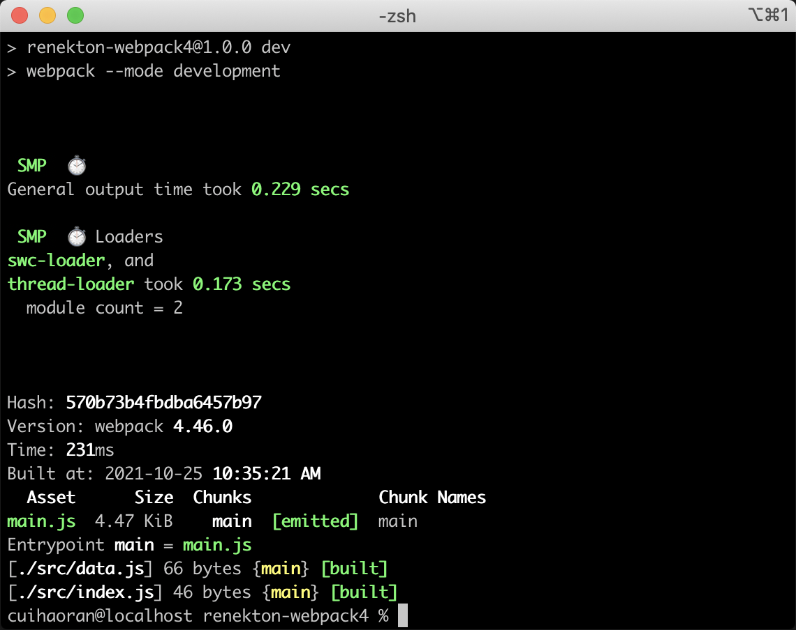

构建时间一下子成了`231ms`。多么悲伤的故事。所以说如果不是项目非常巨大，尽量不要使用多线程进行webpack的构建。因为多线程之间也是需要通信的，需要占用一定的系统资源，这些都是拖慢构建速度的原因。

`对webpack进行缓存`，这也是优化的重要手段。cache-loader能够做到。

安装cache-loader：

```shell
$ npm install --save-dev cache-loader
```

配置cache-loader：

```javascript
const SpeedMeasurePlugin = require("speed-measure-webpack-plugin");

const smp = new SpeedMeasurePlugin();

const webpackConfig = smp.wrap({
  module: {
    rules: [
      {
        test: /\.m?js$/,
        exclude: /(node_modules|bower_components)/,
        use: [
          {
          // Use `.swcrc` to configure swc
          loader: "swc-loader"
          },
          'cache-loader'
        ]
      }
    ]
  },
  plugins: [

  ],
});

module.exports = webpackConfig;
```

catche-loader在第一次进行构建的时候会比较耗费时间，但是第二次的时候会更快一些，这也符合缓存的基本原理。同时使用`swc-loader`和`cache-loader`效果不会很明显，因为`swc-loader`已经优化到了极致，cache-loader主要对于babel-loader进行优化。

如果不想使用cache-loader也可以使用`hard-source-webpack-plugin`这个插件。进行全局的缓存。

安装：

```shell
$ npm install --save-dev hard-source-webpack-plugin
```

配置：

```javascript
const SpeedMeasurePlugin = require("speed-measure-webpack-plugin");
const HardSourceWebpackPlugin = require("hard-source-webpack-plugin");

const smp = new SpeedMeasurePlugin();

const webpackConfig = smp.wrap({
  module: {
    rules: [
      {
        test: /\.m?js$/,
        exclude: /(node_modules|bower_components)/,
        use: [
          {
          // Use `.swcrc` to configure swc
          loader: "swc-loader"
          },
          'cache-loader'
        ]
      }
    ]
  },
  plugins: [
    new HardSourceWebpackPlugin()
  ],
});

module.exports = webpackConfig;
```

然后我们执行`npm run dev`，结果如下：


**我们可以明显的看出来使用了cache-loader和hard-source-webpack-plugin之后，webpack第一次构建和第二次构建之间差了58ms，缓存确实提高了构建速度。**

> **webpack4的尴尬：**
>
> 上述我们提到的所有的webpack的优化手段，除了SWC能够在webpack5中使用，其余的都不能在webpack5中使用。webpack5中把这些优化全都自己实现了。
>
> **一首凉凉送给当年给webpack4写开源的开发者们，前端真的太卷了~**

**JS多核压缩terser-webpack-plugin**

这个插件使用[terser](https://github.com/terser-js/terser)来缩小/最小化你的 JavaScript。这个插件是为数不多的webpack4和webpack5都推荐使用的插件（感动）。

安装：

```shell
$ npm install terser-webpack-plugin --save-dev
```

配置（webpack5）：

```javascript
const  TerserPlugin  =  require ( "terser-webpack-plugin" ) ;

module.exports = {
  cache: {
    type: 'filesystem',
    allowCollectingMemory: true,
  },
  optimization: {
    minimize: true,
    minimizer: [new TerserPlugin({
      parallel: true,
    })],
  },
};
```

构建结果：

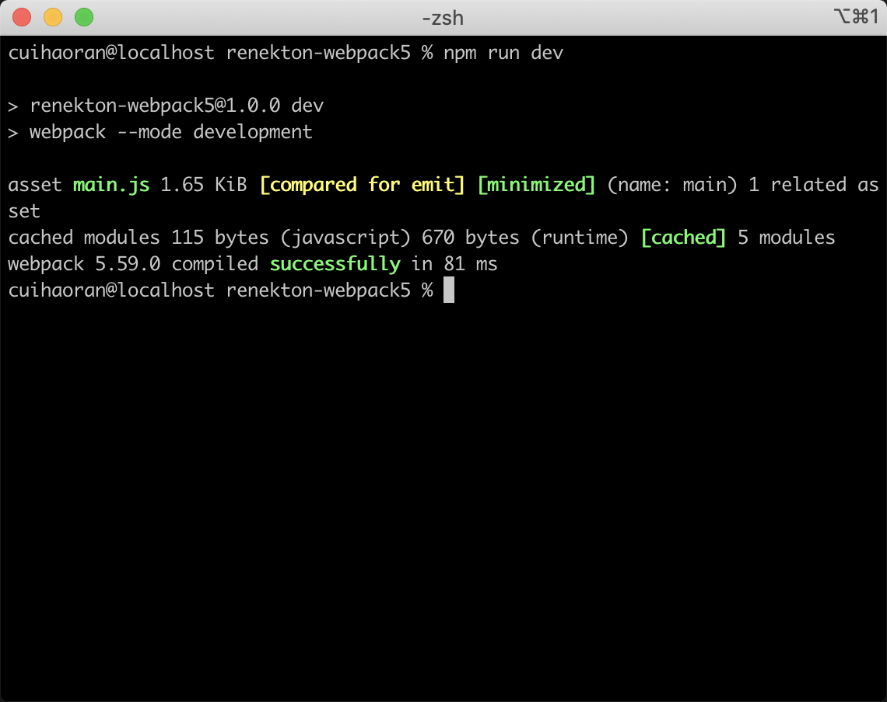

我们来看一下构建结果（dist/main.js）：

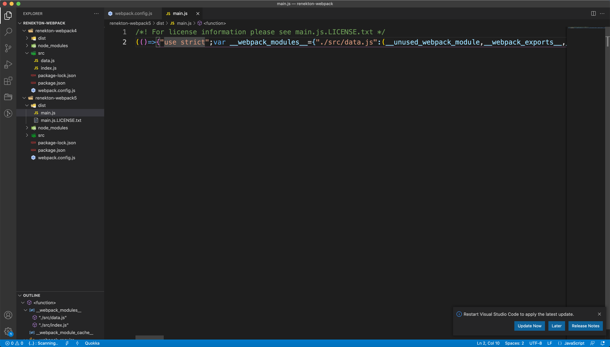

我们可以看到打包之后的代码都被压缩了。

代码压缩除了使用`hard-source-webpack-plugin`之外，性能更高的选择就是`esbuild-loader`，esbuild-loader也有自己的压缩方法。

安装：

```shell
$ npm i -D esbuild-loader
```

配置：

```javascript
const { ESBuildMinifyPlugin } = require('esbuild-loader');

module.exports = {
  cache: {
    type: 'filesystem',
    allowCollectingMemory: true,
  },
  optimization: {
    minimize: true,
    minimizer: [
      new ESBuildMinifyPlugin({
        target: 'es2015'  // Syntax to compile to (see options below for possible values)
      })
    ]
  },
};
```

执行`npm run prod`命令，压缩只有在开发环境下才能生效，结果如下：

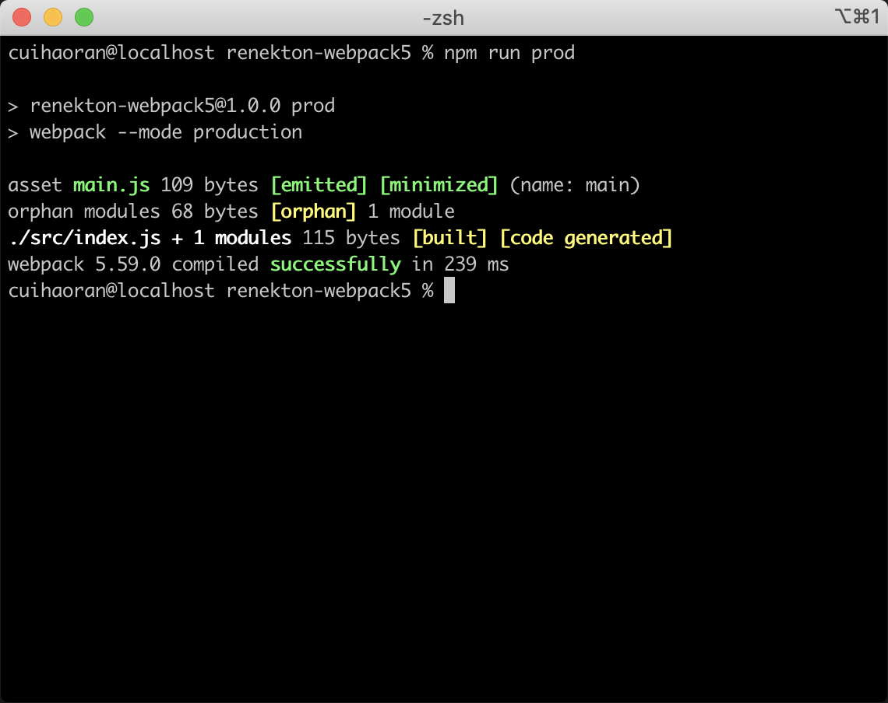

我们再来看一下构架之后的文件（dist/main.js）：

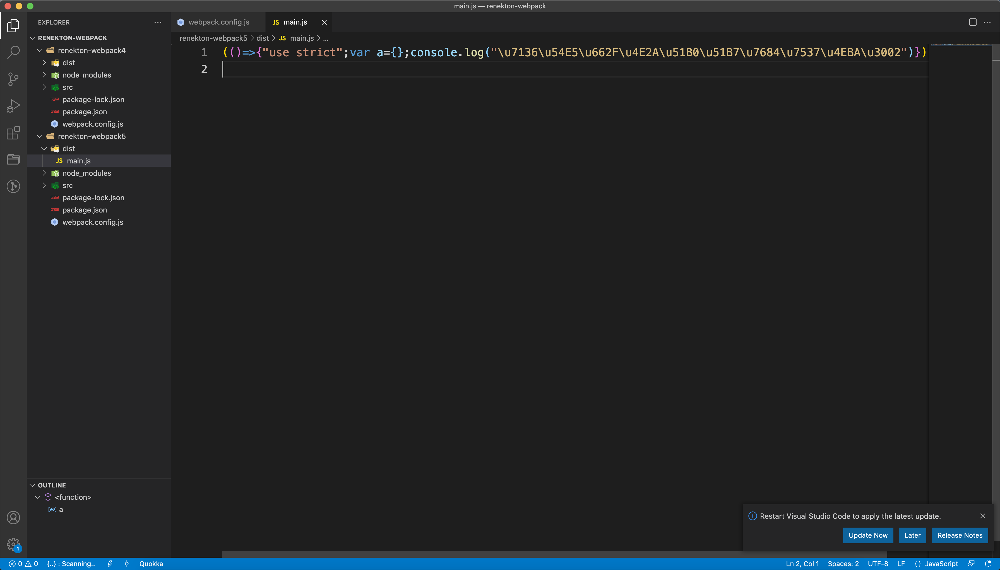

代码压缩的很完美。

> **webpack5和webpack4的最重要的区别就是webpack5去掉了loader。除了css-loader。**
>
> **比如说图片就不需要loader了**

不需要loader情况下的图片打包：

```javascript
const  TerserPlugin  =  require ( "terser-webpack-plugin" ) ;

module.exports = {
  output: {
    assetModuleFilename: 'images/[name].[hash:5][ext]'
  },
  module: {
    rules: [
      {
        test: /\.(png|jpg|svg)$/,
        type: 'asset'
      }
    ]
  },
  cache: {
    type: 'filesystem',
    allowCollectingMemory: true,
  },
  optimization: {
    minimize: true,
    minimizer: [new TerserPlugin({
      parallel: true,
    })],
  },
};
```

只需要匹配一个正则，设置type为`asset`，再配置好output中特定的文件名（assetModuleFilename）。完事儿了~~

### III、webpack5中的缓存

webpack4中使用了`cache-loader`和`hard-source-webpack-plugin`完美的解决了webpack的缓存问题，那么在webpack5中借鉴了webpack4中的这两个插件，自己实现了cache体系。只需要简单配置即可：

```javascript
module.exports = {
  cache: {
    type: 'filesystem',
    allowCollectingMemory: true,
  },
};
```

就这么简单。

### IV、webpack工程上的优化

**1. 我们可以利用hjs-webpack、Neutrino、webpack-blocks等库，把我们自己的webpack的配置封装起来供团队内其他人员使用。**

**2. 更友好的提示错误 **

**friendly-errors-webpack-plugin **

**webpack-build-notifier **

**标题和窗口内容修改**

**set-iterm2- badge && node-bash-title **


## 四、总结

以上就是webpack4和webpack5中所有的优化手段，webpack4中的优化手段会多一些，但是在webpack5中大部分webpack4中的优化都不能用。webpack5自己也做了很多的优化。

