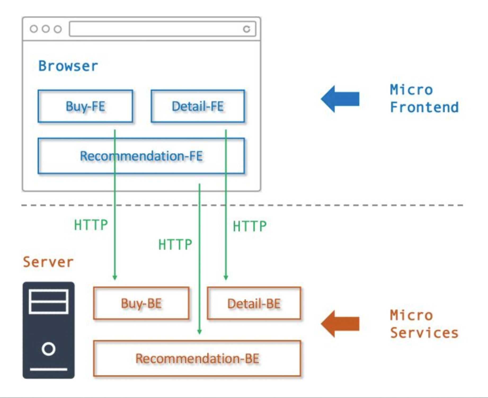
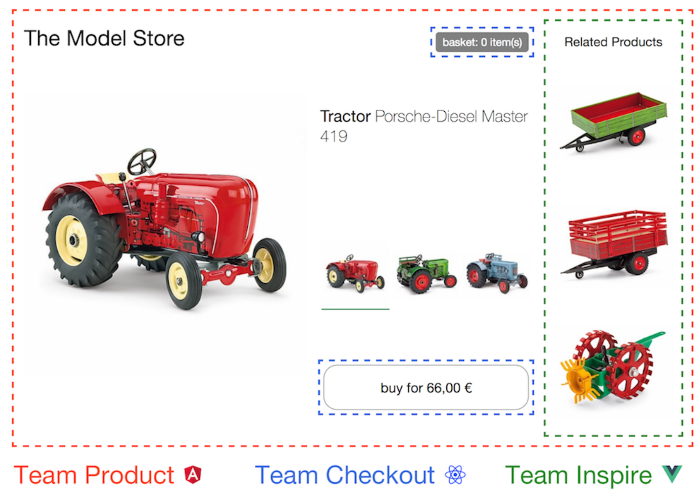

# 微前端架构设计深度原理分析

## 零、写在前面

微前端在前几年还是一个新的概念，经过这两年的发展，微前端现在已经比较成熟了。许多公司也在试着搞微前端，也有很多公司已经搞出了成功的微前端项目。这篇文章我们将会在以下的几个方面阐述微前端：

+ 微前端概念解读
+ 微前端快速入门
+ Web Components
+ 三大框架的微前端
+ 关于未来的思考

## 一、微前端概念的解读

微前端的概念来自于微服务，微前端的`'微'`和微服务的`'微'`是一个意思。微服务讲究的是`独立服务`，而微前端与之对应讲究的则是`独立模块`。

### I、微服务与微前端的对比

|          |                     微服务（服务端）                     |                    微前端（前端）                    |                   备注                   |
| :------: | :------------------------------------------------------: | :--------------------------------------------------: | :--------------------------------------: |
|   服务   |                `独立服务`，比如交易服务。                |            独立的应用或者模块，比如导航。            |   模块之间或者服务之间是不会项目影响的   |
| 服务治理 | 服务注册/发现/依赖管 理/跟踪/降级/限流/日 志/监控/运维等 |     应用的发现/路由/监控/降级/运行/注销/聚 合等      | 需要一个/多个系统统 一处理一些上层的事情 |
| 服务通信 |                    HTTP / RPC/ 中间件                    | eventBus/sharedWorker/ BroadcastChannel/ LocalStorge |                                          |

在国内一说起微前端来，我们首先的想到的是`乾坤（本人不喜欢）`这个框架，实际上微前端的实现不需要任何的前端框架。

**微前端（Micro-Frontend）**，是将**微服务（Micro-Seivices）**理念应用于前端技术后的相关实践，使得一个前端项目能够经由多个团队独立开发以及独立部署。

### II、微前端开发的特性

+ 技术无关性
  + 各个开发团队都可以自行选择技术栈，不受同一项目中其他团队影响。
+ 代码独立
  + 各个交付产物都可以被独立使用，避免和其他交付产物耦合。
+ 样式隔离
  + 各个交付产物中的样式不会污染其他组件。
+ 原生支持
  + 各个交付产物都可以自由使用浏览器原生API，而非要求使用封装后的 API。

### III、微前端核心解决问题和步骤

+ **页面加载**
  + 动态的分发路由
+ **传统开发模式**
  + 巨石应用（Frontend Monolith）
+ **根据服务发现结果加载资源**
+ **服务发现**
  + 客户端服务发现、服务端服务发现、分自注册和第三方注册。自注册不言而喻。第三方注册就是 一个保活机制，定期检查服务状态。

> **什么是巨石应用？**
>
> 单体应用在一个相对长的时间跨度下，由于参与的人员、团队的增多、变迁，从一个普通应用演变成一个巨石应用。

**微前端开发示意图：**

**微前端开发效果图：**

### IV、iframe现存问题

+ 不可控制：
  + iframe嵌入的显示区大小不容易控制，存在一定局限性
+ 存在兼容性问题：
  + iframe的样式显示、兼容性等都具有局限性
+ 性能问题：
  + iframe 阻塞 onload、占用连接池、多层嵌套⻚面崩溃。
+ bfcache
  + URL的记录完全无效，⻚面刷新不能够被记忆，刷新会 返回首⻚，iframe功能之间跳转也无效iframe的样式显示、兼容性等都具有局限性。iframe 阻塞 onload、占用连接池、多层嵌套⻚ 面崩溃。

## 二、微前端快速入门

微前端分为MPA的微前端和SPA的微前端。

### I、MPA的微前端实现方案

MAP的微前端实现方案可以参照国内百度公司开源的[yog2](http://fex.baidu.com/yog2/)还有[FIS](http://fis.baidu.com/)。

**什么是yog2？**

+ A Node.js UI Layer Framework Based on FIS & Express。
+ 专注提升NodeJS UI层的研发效率，优化前后端性能。

**yog2做了什么？**

+ **前端工程化**：基于 FIS 前端工程化思想打造的解决方案，拥有完备的后端静态资源资源管理能力，并与前后端开发流程完美契合。
+ **Pagelet**：原生实现BigPipe 与 Quickling 技术。BigPipe可以极大的提升复杂站点加载性能。使用 Quickling 技术可以快速搭建单页应用。
+ **自动路由**：自动路由基于以约定优于配置的思想设计，在 YOG2 中无需注册路由，只需要根据 URL 建立对应的处理文件就可以响应请求。
+ **项目拆分**：通过运行框架与业务代码分离的架构，业务可以解耦为多个独立的子项目，有效降低大型项目的复杂度。
+ **快速开发**：利用脚手架功能，快速启动 YOG2 项目。框架内置热更新模块，业务代码修改无需重启，开发更为迅捷。
+ **后端管理**：UI 层解决方案，对后端服务的请求是强依赖，YOG2 中将后端的配置规范化，并提供统一的异常处理与超时重试机制，提高系统稳定性。

