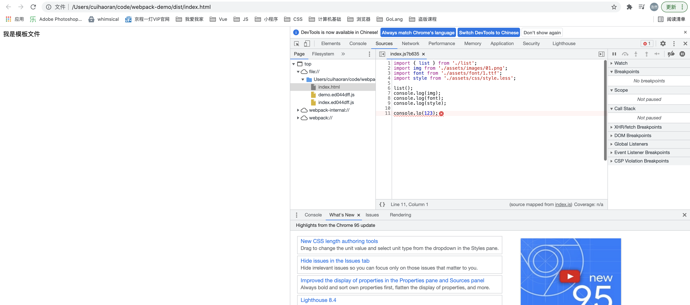

# webpack核心概念讲解

## 一、什么是webpack？

仔细想想一个问题：**webpack是什么？为什么要有webpack？webpack怎样才能熟练使用？**

很多前端开发者使用webpack很长时间，但是对于webpack的概念却不甚了解，设置不知道为什么要用webpack，长时间处于别人项目中用到了，我也要用。或者vue-cli里面用的是webpack，自己被迫接触webpack。

由以上困扰的读者这篇文章会给出答案。首先解决第一个问题：webpack是什么？

毫无疑问，我们听过的最熟悉的一句话就是：`webpack是一个前端的打包工具。`这句话是完全没有问题的，同样也说明了webpack是什么。但是什么是打包工具呢？为什么我们需要打包工具？要搞清楚这两个问题先看下图：


我们可以看到，这张图就说明了webpack干了些什么。实际上webpack是把前端所有的文件打包成了`静态资源`。当然这仅仅是我们在webpack的输入和输出上得到的结论。

加入我们现在有下面这样几个需求：

+ 代码保存，不必手动刷新浏览器，页面自动刷新，呈现最新的结果——热更新。
+ 写完CSS和JS代码，自动处理兼容性问题——代码编译。
+ 项目上线，代码自动压缩，图片等静态资源自动处理（比如说转成base64格式的，大图压缩等）——压缩打包服务。

这时候我们就可以使用webpack进行打包前端项目。webpack本质上一个JavaScript应用程序的`静态模块打包器（Static Module bundle）`。极大的简化了前端开发者的工作，使得前端开发者能够专注于业务逻辑的开发。

### I、什么是模块化？

webpack的模块：

+ ES6支持的ESModule
+ Node支持的CommonJS
+ AMD
+ Scss/Less文件中的import
+ 样式、图片、字体等文件也是模块

webpack对上述这些模块都可以进行模块化打包。

### II、webpack的构建过程

1. 代码转化
2. 文件优化
3. 代码分割
4. 模块合并
5. 自动刷新
6. 代码校验
7. 自动发布
8. ...

## 二、核心概念&代码实战

下面我们就通过代码实战来学习一下webpack的核心概念。`首先webpack是基于node的开发的JS打包工具。`所以我们要先安装Node。此处我们对于Node的安装不做赘述。

### I、从最简单的webpack配置开始

首先，新建一个项目目录，笔者这里取名为`webpack-demo`，然后在此目录下执行`npm init -y`初始化项目。这时候在项目目录中会增加一个`package.json`文件。

接下来我们在项目目录下安装开发环境下的`webpack`和`webpack-cli`，因为webpack在生产环境是不需要的，所以我们安装在开发环境就可以。当前文章依赖的webpack的版本为`4.12`，下文中的webpack如不明确说明版本皆是webpack@4.12（虽然现在webpack5已经非常成熟了）：

```bash
### webpack的安装命令
$ npm install webpack@4.16.1 -D

### webpack-cli的安装命令
$ npm install wabpack-cli@3.3.10 -D
```

> **注意：**
>
> 1. 不要全局安装webpack和webpack-cli。
>
> 2. 学会使用npx命令，这个命令首先会寻找当前目录下的node_modules包。

下面我们来写代码，webpack可以把一切当做模块，那么我们先创建一个index.js和list.js看一下webpack对于JS的处理：

```javascript
// index.js

import { list } from './list';
list();
```

```javascript
// list.js

export const list = () => {
  console.log('我是list文件.');
}
```

现在我们可以执行`npx webpack index.js`来打包index.js文件。打包完成之后我们会发现项目目录下多了一个dist目录，里面有一个`main.js`文件。打包结果如下图所示：


我们可以看到webpack完成了打包，并且做了代码压缩。这里有一个点需要注意，我们只运行了一个命令，就执行了打包和压缩等多种操作，这实际上是因为webpack有许多默认的配置，打包的时候会按照默认配置进行打包和压缩。webpack希望开发者尽量少配置最好是零配置也可以很好的使用webpack。

**那么如果我们不想使用webpack的默认配置，希望自定义配置应该怎么做？**

毫无疑问这也是可以的，如果想自定义webpack的配置，可以在项目里创建一个`webpack.config.js`的配置文件。webpack默认在不做任何配置的情况下可以打包JS文件，但是如果想要对图片和字体文件做特殊处理则需要很多第三方的工具，这些工具都需要自定义配置。

```javascript
// webpack.config.js

const path = require('path');

module.exports = {
  // 默认一般打包的模式为production，会对打包后的文件进行压缩。
  // 开发环境为development，不会对代码进行压缩。
  mode: 'production',
  // 入口文件的配置
  // 指定入口之后就不用手动指定打包的入口了。
  entry: './index.js',
  // 出口配置
  output: {
    // 指定打包出来的文件名
    filename: 'index.js',
    // 打包之后的出口路径，建议为绝对路径
    path: path.resolve(__dirname, './dist')
  }
}
```

配置完成之后，我们执行：

```bash
$ npx webpack --config webpack.config.js
```

在执行webpack打包命令的时候，我们要指定webpack的配置文件，执行结果如下图：


打包成功后我们会发现dist目录中多了一个index.js，打包的结果如下图：


以上就是最简单的webpack的自定义配置文件。在实际开发中我们的源代码一般都会放在src下，所以我们要规范一下项目结构，在根目录下新建src目录，把list.js和index.js放在src目录下。相应的webpack.config.js中的entry也要进行修改。


现在我们打包的时候还是在命令行直接运行`npx webpack --config webpack.config.js `，这就稍微有些复杂，并且一般开发中也不这么做。常规的做法是把打包的命令配置在package.json文件中：

```json
{
  "name": "webpack-demo",
  "version": "1.0.0",
  "description": "",
  "main": "index.js",
  "scripts": {
    "build": "webpack"  ## 配置build命令
  },
  "keywords": [],
  "author": "",
  "license": "ISC",
  "devDependencies": {
    "webpack": "^4.16.1",
    "webpack-cli": "^3.3.10"
  }
}
```

我们可以看到，在package.json的scripts中配置了build命令，这样我们就可以执行运行：

```bash
$ npm run build
```

来进行打包操作，并且npm run build命令使用的就是当前项目下node_modules中的webpack-cli工具进行打包，并不会与全局的webpack（如果你安装了的话）版本发生冲突。细心的读者可能发现了一个问题，我们配置的build命令只是webpack，并没有指定配置文件。这是因为node会自动在项目的根目录下找到webpack.config.js。执行命令结果如下图：


webpack打包实际上是把所有的文件都打包到一个文件中。我们在dist目录中新建一个html文件，并引入打包好的index.js文件，看打包完成的index.js是否能够正常使用。

```html
<!-- dist/index.html !-->

<!DOCTYPE html>
<html lang="en">
<head>
  <meta charset="UTF-8">
  <meta http-equiv="X-UA-Compatible" content="IE=edge">
  <meta name="viewport" content="width=device-width, initial-scale=1.0">
  <title>Document</title>
  <script src="./index.js"></script>
</head>
<body>
  <h1>dist/index.html</h1>
</body>
</html>
```

我们打开浏览器可以看到控制台的输出：


我们可以看到打包之后的index.js仍然是可以正常运行的~ 初有小成！下面我们来分析一下每次运行`npm run buid`命令打包完成的时候，命令行输出的一些信息：

```bash
Hash: 0e0363aa5380b5ef1235  ## hash值，每次打包对应一个唯一的hash值
Version: webpack 4.16.1		## webpack的版本
Time: 69ms		## 打包用时
Built at: 2021-11-03 6:21:32 PM		## 打包完成的时间点
   Asset       Size  Chunks             Chunk Names		## Asset：打包文件名  Size：文件大小
index.js  984 bytes       0  [emitted]  main		## Chunks：chunk ID  Chunk Names：入口名称
Entrypoint main = index.js	## 入口文件名
[0] ./src/index.js + 1 modules 103 bytes {0} [built]	## 打包文件的路径和大小
    | ./src/index.js 38 bytes [built]
    | ./src/list.js 65 bytes [built]
```

### II、常见loader和plugins及其配置

`webpack是一个模块化打包工具，在webpack中一切皆模块。`在上文中我们并没有配置JS的loder或者plugin，完全是按照webpack默认的对于JS文件的处理规则进行处理。那么，如果我们的源码文件中有图片或者其他的静态资源，我们应该怎么对其进行处理？

在src目录中新建`assets/images`目录，用来存放图片等静态文件。然后我们在index.js中引入图片。

```javascript
// src/index.js

import { list } from './list';
import img from './assets/01.png';
list();
console.log(img);
```


之后执行`npm run build`进行打包。打包结果如下图：


果然在无配置打包图片的情况下，webpack是会报错的，也就是说`在不经过配置的情况下，webpack是无法对图片进行打包的`。仔细看打包错误我们会发现一个非常有用的信息：`You may need an appropriate loader to handle this file type.（你可能需要你一个loader去打包这个类型的文件）`

webpack推荐使用的是`file-loader`对图片进行处理，安装`file-loader`：

```bash
$ npm install file-loader -D
```

安装完成之后，我们按照提示对webpack的配置做响应的修改，用一个file-loader来特定处理图片文件：

```javascript
// webpack.config.js

const path = require('path');

module.exports = {
  // 默认一般打包的模式为production，会对打包后的文件进行压缩。
  // 开发环境为development，不会对代码进行压缩。
  mode: 'production',
  // 入口文件的配置
  // 指定入口之后就不用手动指定打包的入口了。
  entry: './src/index.js',
  // 出口配置
  output: {
    filename: 'index.js',
    path: path.resolve(__dirname, './dist')
  },
  module: {
    rules: [
      {
        test: /\.(png|jpg|gif)$/, // 指定检测什么样的文件
        use: {
          loader: "file-loader"
        }
      }
    ]
  }
}
```

配置完成之后，我们进行构建，执行：

```bash
$ npm run build
```

打包结果如下图所示：


打包成功，我们刷新刚才的index.html页面，会发现打包完成的JS正常输出了img：


并且图片也被打包到了dist目录下（查看一下dist目录，应该是多了一张图片），至此为止我们完成了对图片的打包配置。

> **file-loader的执行流程：**
>
> 1. 发现代码中有图片模块
> 2. 打包到uotput执行的目录下，并且会改变该图片的名字（这个图片的名字也是可以配置的）。
> 3. 移动到dist中之后，图片的名字会作为返回值。
> 4. 图片名字同样会返回给我们引入的变量。

file-loader不止能处理图片文件，还可以处理字体文件，我们在assets目录中新建一个font目录，在font目录中存放一个字体文件——font.ttf。之后，添加相应的webpack配置：

```javascript
const path = require('path');

module.exports = {
  // 默认一般打包的模式为production，会对打包后的文件进行压缩。
  // 开发环境为development，不会对代码进行压缩。
  mode: 'production',
  // 入口文件的配置
  // 指定入口之后就不用手动指定打包的入口了。
  entry: './src/index.js',
  // 出口配置
  output: {
    filename: 'index.js',
    path: path.resolve(__dirname, './dist')
  },
  module: {
    // rules是一个数组，可以按照需要添加各种loader的配置
    rules: [
      {
        test: /\.(png|jpg|gif)$/, // 指定检测什么样的文件
        use: {
          loader: "file-loader"
        }
      },
      {
        test: /\.ttf$/, // 指定检测什么样的文件
        use: {
          loader: "file-loader"
        }
      }
    ]
  }
}
```

在index.js中引入：

```javascript
import { list } from './list';
import img from './assets/images/01.png';
import font from './assets/font/1.ttf';

list();
console.log(img);
console.log(font);
```

接着我们就执行构建命令：`npm run build`，构建结果如下图所示：


我们通过查看dist目录会发现，dist目录中多了一个`.ttf`文件。刷新页面会发现输出的是ttf的文件名。接下来我们可以实现一下对less的打包。对`.less`文件打包需要使用`less-loader`，所以我们要先安装less-loader：

```bash
$ npm install less-loader@5.0.0 less -D
```

> **注意：**
>
> 国内有些地区安装less-loader会有一些问题，根据安装失败的错误提示我们可以加上参数进行安装：
>
> **npm install --force less-loader@5.0.0 less -D**
>
> **npm install --legacy-peer-deps less-loader@5.0.0 less -D**
>
> 
>
> 我们在使用less-loader的时候，需要安装less-loader，否则会报
>
> module less is not found（找不到less） 
>
> 
>
> 另外less-loader一定要安装V5.0.0，否则会报TypeError: this.getOptions is not a function的错误，这是因为现在的less-loader的最新版已经是V10.21了，V8.x之后less-loader的配置方法已经发生了改变。这里我们安装V5.0.0，就不会出现这个错误。详情见官方网站。

安装完成之后，在webpack.config.js中添加上相应的配置：

```javascript
const path = require('path');

const path = require('path');

module.exports = {
  // 默认一般打包的模式为production，会对打包后的文件进行压缩。
  // 开发环境为development，不会对代码进行压缩。
  mode: 'production',
  // 入口文件的配置
  // 指定入口之后就不用手动指定打包的入口了。
  entry: './src/index.js',
  // 出口配置
  output: {
    filename: 'index.js',
    path: path.resolve(__dirname, './dist')
  },
  module: {
    rules: [
      {
        test: /\.(png|jpg|gif)$/, // 指定检测什么样的文件
        use: {
          loader: "file-loader"
        }
      },
      {
        test: /\.ttf$/, // 指定检测什么样的文件
        use: {
          loader: "file-loader"
        }
      },
      {
        test: /\.less$/,
        loader: "less-loader"
      }
    ]
  }
}
```

配置完成之后，在assets目录中新建css目录，并在该目录中添加`style.less`。随便写一些less样式：

```less
// src/assets/css/style.less

@width: 100%;
@height: 50px;

#header {
  width: @width;
  height: @height;
  color: red;
  background-color: aqua;
}
```

最后我们在index.js中引入：

```javascript
// src/index.js

import { list } from './list';
import img from './assets/images/01.png';
import font from './assets/font/1.ttf';
import style from './assets/css/style.less';

list();
console.log(img);
console.log(font);
console.log(style);
```

引入之后我们执行构建：`npm run build`，执行结果如下图：


果然又报错了，webpack的配置就是这样的，时常报错，大部分的情况都是缺少loader或者plugins，我们解决的方法就是缺少什么就安装什么。根据报错`You may need an appropriate loader to handle this file type.`我们得知，我们需要一个合适的loader来处理这个类型的文件，也就是说只有less-loader是不够的的。通过查看官网我们会知道还需要`css-loader`和`style-loader`进行配合才可以。这也非常好理解less-loader已经把less文件编译成了css文件，但是webpack处理css文件需要css-loader和style-loader，安装它们：

```bash
$ npm install css-loader@3.3.2 -D

$ npm install style-loader@1.0.1 -D
```

然后进行webpack配置：

```javascript
const path = require('path');

module.exports = {
  // 默认一般打包的模式为production，会对打包后的文件进行压缩。
  // 开发环境为development，不会对代码进行压缩。
  mode: 'production',
  // 入口文件的配置
  // 指定入口之后就不用手动指定打包的入口了。
  entry: './src/index.js',
  // 出口配置
  output: {
    filename: 'index.js',
    path: path.resolve(__dirname, './dist')
  },
  module: {
    rules: [
      {
        test: /\.(png|jpg|gif)$/, // 指定检测什么样的文件
        use: {
          loader: "file-loader"
        }
      },
      {
        test: /\.ttf$/, // 指定检测什么样的文件
        use: {
          loader: "file-loader"
        }
      },
      {
        test: /\.(less|css)$/,
        use: [
          "style-loader",
          "css-loader",
          "less-loader"
        ]
      }
    ]
  }
}
```

然后执行构建：`npm run build`，结果如下图：


毫无疑问我们又错了，根据报错信息我们可以得知，是配置错误。`Webpack has been initialised using a configuration object that does not match the API schema.`根据这个提示，我们可以得知只要把use数组里面的loader字符串换成对象即可：

```javascript
const path = require('path');

module.exports = {
  // 默认一般打包的模式为production，会对打包后的文件进行压缩。
  // 开发环境为development，不会对代码进行压缩。
  mode: 'production',
  // 入口文件的配置
  // 指定入口之后就不用手动指定打包的入口了。
  entry: './src/index.js',
  // 出口配置
  output: {
    filename: 'index.js',
    path: path.resolve(__dirname, './dist')
  },
  module: {
    rules: [
      {
        test: /\.(png|jpg|gif)$/, // 指定检测什么样的文件
        use: {
          loader: "file-loader"
        }
      },
      {
        test: /\.ttf$/, // 指定检测什么样的文件
        use: {
          loader: "file-loader"
        }
      },
      {
        test: /\.(less|css)$/,
        use: [
          {
            loader: "style-loader"
          },
          {
            loader: "css-loader"
          },
          {
            loader: "less-loader"
          }
        ]
      }
    ]
  }
}
```

配置完成，运行`npm run build`执行打包：


打包成功，我们会发现在dist目录中没有打包出来的`.css`，这是因为所有的css代码都打包到了`dist/index.js`文件中。我们给`dist/index.html`加上#header：

```html
<!DOCTYPE html>
<html lang="en">
<head>
  <meta charset="UTF-8">
  <meta http-equiv="X-UA-Compatible" content="IE=edge">
  <meta name="viewport" content="width=device-width, initial-scale=1.0">
  <title>Document</title>
  <script src="./index.js"></script>
</head>
<body>
  <h1 id="header">dist/index.html</h1>
</body>
</html>
```

刷新浏览器，会发现效果完美：


> **注：**
>
> 这里的css代码打包构建，是直接构建到JS文件中，所以我们并不会在dist中发现css文件。当然我们也可以把CSS文件单独打包出来，下面我们会讲到。

到现在为止我们接触了这么多loader，那么有一个问题：**什么是loader？**

官方的解释就是，文件处理器。webpack在处理文件的时候就需要用loader来处理。不同类型的文件需要不同的loder来进行处理。

现在我们观察一下dist目录中构建成功的文件：


不难发现打包好之后的图片和字体文件的命名都是一些不知义的乱码，这一点让我们很难受。我们希望可以知道打包好的文件是哪个文件打包的结果。要做到这个并不难，只需要在webpack中配置一下就可以了：

```javascript
const path = require('path');

module.exports = {
  // 默认一般打包的模式为production，会对打包后的文件进行压缩。
  // 开发环境为development，不会对代码进行压缩。
  mode: 'production',
  // 入口文件的配置
  // 指定入口之后就不用手动指定打包的入口了。
  entry: './src/index.js',
  // 出口配置
  output: {
    filename: 'index.js',
    path: path.resolve(__dirname, './dist')
  },
  module: {
    rules: [
      {
        test: /\.(png|jpg|gif)$/, // 指定检测什么样的文件
        use: {
          loader: "file-loader",
          options: {
            name: '[name].[hash:5].[ext]', // 打包后的文件名
            outputPath: 'images'	// 打包后的存放路径
          },
        }
      },
      {
        test: /\.ttf$/, // 指定检测什么样的文件
        use: {
          loader: "file-loader",
          options: {
            name: '[name].[hash:5].[ext]',
            outputPath: 'font'
          },
        }
      },
      {
        test: /\.(less|css)$/,
        use: [
          {
            loader: "style-loader"
          },
          {
            loader: "css-loader"
          },
          {
            loader: "less-loader"
          }
        ]
      }
    ]
  }
}
```

在一般的开发过程中，如果有一些很小的图片我们希望把他编译成`base64`格式的，以求减少http请求的数量。但是如果体量大的图片压缩成base64的格式反而会更大。所以我们的一般方案就是小的图片编译成base64格式，体量大的图片交给file-loader加载，webpack如果想做这样的优化只是用file-loader是不可能完成的。如果想做这样的优化，我们就需要`url-loader`，我们可以使用url-loader来代替file-loader。url-loader有file-loader所有的功能。

首先安装url-loader：

```bash
$ npm install url-loader -D
```

替换file-loader，并配置：

```javascript
const path = require('path');

module.exports = {
  // 默认一般打包的模式为production，会对打包后的文件进行压缩。
  // 开发环境为development，不会对代码进行压缩。
  mode: 'production',
  // 入口文件的配置
  // 指定入口之后就不用手动指定打包的入口了。
  entry: './src/index.js',
  // 出口配置
  output: {
    filename: 'index.js',
    path: path.resolve(__dirname, './dist')
  },
  module: {
    rules: [
      {
        test: /\.(png|jpg|gif)$/, // 指定检测什么样的文件
        use: {
          loader: "url-loader",
          options: {
            name: '[name].[hash:5].[ext]',
            outputPath: 'images',
            limit: 819200000
          },
        }
      },
      {
        test: /\.ttf$/, // 指定检测什么样的文件
        use: {
          loader: "file-loader",
          options: {
            name: '[name].[hash:5].[ext]',
            outputPath: 'font'
          },
        }
      },
      {
        test: /\.(less|css)$/,
        use: [
          {
            loader: "style-loader"
          },
          {
            loader: "css-loader"
          },
          {
            loader: "less-loader"
          }
        ]
      }
    ]
  }
}
```

我们给limit一个非常大的值，看一下打包出来的结果：


我们可以看到dist目录下没有image目录了，原因是把图片文件打包成了base64格式，直接打包在index.js中。然后我们在把`limit`改成2048(2KB)。执行打包，看结果：


到这里我们已经知道了url-loader的基本用法。

> **less-loader、css-loader、style-loader都有什么作用？**
>
> 1. style-loader：通过style标签，把css样式直接注入到html页面。
> 2. cee-loader：对css文件进行处理和加载
> 3. less-loader：把less文件编译成css。
>
> **在处理less文件的时候我们用到了三个loader，webpack在执行这这三个loader的时候，规则是从后往前执行，也即是说use数组中的loader，总是下表较大的那个先执行。**

做过前端开发的读者都会遇到CSS的浏览器兼容性问题，这个时候往往会出现一个css属性要写很多歌浏览器的前缀，以达到在不同浏览器下样式统一的目的：

```css
::-moz-placeholder {
  color: gray;
}
:-ms-input-placeholder {
  color: gray;
}
::placeholder {
  color: gray;
}
```

诸如上面的代码我们或多或少都写过，写起来很痛苦。像这种CSS浏览器兼容性的问题我们也可以交给webpack来做，`postcss-loader`可以帮助我们自动添加浏览器前缀，先安装它：

```bash
$ npm install postcss-loader@3.0.0 postcss -D
```

使用postcss-loader要安装postcss模块和postcss-loader。首先我们要配置一个loader，这个loader要在less-loader运行完之后运行，原因很简单postcss-loader是给css代码加前缀，处理的自然是css代码，所以我们要配置在less-loader之前。配置完loader之后，自动加前缀还需要一个插件（plugin）——`autoprefixer`，所以我们还要配置一它，先来安装它：

```bash
$ npm install autoprefixer@9.7.3 -D
```

接下来我们进行配置：

```javascript
const path = require('path');
const autoprefixer = require('autoprefixer');

module.exports = {
  // 默认一般打包的模式为production，会对打包后的文件进行压缩。
  // 开发环境为development，不会对代码进行压缩。
  mode: 'production',
  // 入口文件的配置
  // 指定入口之后就不用手动指定打包的入口了。
  entry: './src/index.js',
  // 出口配置
  output: {
    filename: 'index.js',
    path: path.resolve(__dirname, './dist')
  },
  module: {
    rules: [
      {
        test: /\.(png|jpg|gif)$/, // 指定检测什么样的文件
        use: {
          loader: "url-loader",
          options: {
            name: '[name].[hash:5].[ext]',
            outputPath: 'images',
            limit: 2048
          },
        }
      },
      {
        test: /\.ttf$/, // 指定检测什么样的文件
        use: {
          loader: "file-loader",
          options: {
            name: '[name].[hash:5].[ext]',
            outputPath: 'font'
          },
        }
      },
      {
        test: /\.(less|css)$/,
        use: [
          {
            loader: "style-loader"
          },
          {
            loader: "css-loader"
          },
          // postcss-loader要在less-loader之前
          {
            loader: "postcss-loader",
            options: {
              plugins: [
                autoprefixer
              ],
            }
          },
          {
            loader: "less-loader"
          }
        ]
      }
    ]
  }
}
```

给style.less加上一下兼容性样式：

```less
@width: 100%;
@height: 50px;

::placeholder {
  color: gray;
}
body {
  #header {
    width: @width;
    height: @height;
    color: red;
    background-color: aqua;
  }
}
```

执行打包命令，然后刷新浏览器看结果：


可以发现CSS的前缀已经自动加上了。一般地，在正式开发中是不会像上文这样在`webpack.config.js`中引入autoprefixer的，而是会在项目的根目录下创建`postcss.config.js`，和webpack.config.js的功能一样，自定义postcss的配置。所以我们关于postcss的配置全都挪到postcss.config.js中去写。

首先把webpack.config.js中关于postcss的配置全部干掉：

```javascript
const path = require('path');
// ...移除autoprefixer

module.exports = {
  // 默认一般打包的模式为production，会对打包后的文件进行压缩。
  // 开发环境为development，不会对代码进行压缩。
  mode: 'production',
  // 入口文件的配置
  // 指定入口之后就不用手动指定打包的入口了。
  entry: './src/index.js',
  // 出口配置
  output: {
    filename: 'index.js',
    path: path.resolve(__dirname, './dist')
  },
  module: {
    rules: [
      {
        test: /\.(png|jpg|gif)$/, // 指定检测什么样的文件
        use: {
          loader: "url-loader",
          options: {
            name: '[name].[hash:5].[ext]',
            outputPath: 'images',
            limit: 2048
          },
        }
      },
      {
        test: /\.ttf$/, // 指定检测什么样的文件
        use: {
          loader: "file-loader",
          options: {
            name: '[name].[hash:5].[ext]',
            outputPath: 'font'
          },
        }
      },
      {
        test: /\.(less|css)$/,
        use: [
          {
            loader: "style-loader"
          },
          {
            loader: "css-loader"
          },
          {
            loader: "postcss-loader",
            // ...移除postcss-loader的配置项
            // .....
          },
          {
            loader: "less-loader"
          }
        ]
      }
    ]
  }
}
```

在项目根目录创建一个`postcss.config.js`：

```javascript
const autoprefixer = require('autoprefixer');

module.exports = {
  plugins: [autoprefixer]
}
```

webpack会自去项目根目录找到并读取postcss.config.js。不需要额外说明。接下来，看这种配置方式是否能构建成功，执行构建`npm run build`，刷新刚才的网页，结果如下：


依然OK~~

在处理CSS浏览器前缀的问题上我们使用了plugin，那么**plugins和loder的区别是什么？**

+ 相对于loader转换指定类型的模块功能，plugins能够被用于执行更广泛的任务比如打包优化、文件管理、环境注入等……
+ loader，它是一个转换器，将A文件进行编译成B文件，比如：将A.less转换为A.css，单纯的文件转换过程。plugin是一个扩展器，它丰富了webpack本身，针对是loader结束后，webpack打包的整个过程，它并不直接操作文件，而是基于事件机制工作，会监听webpack打包过程中的某些节点，执行广泛的任务。

**下面我们要用一个最常用的plugin——html-webpack-plugin**

在上文中我们dist目录中的`index.html`是手动创建的，这里有一个问题，如果当打包好的文件增多，引入的文件随之增多，自己手动创建和注入引用不仅麻烦而且容易出现错误，html-webpack-plugin就可以帮我们自动创建index.html并自动注入各种css或JS等文件。

先来安装它：

```bash
$ npm install html-webpack-plugin@3.2.0 -D
```

然后我们在webpack中配置一下：

```javascript
const path = require('path');
const HtmlWebpackPlugin = require('html-webpack-plugin');

module.exports = {
  // 默认一般打包的模式为production，会对打包后的文件进行压缩。
  // 开发环境为development，不会对代码进行压缩。
  mode: 'production',
  // 入口文件的配置
  // 指定入口之后就不用手动指定打包的入口了。
  entry: './src/index.js',
  // 出口配置
  output: {
    filename: 'index.js',
    path: path.resolve(__dirname, './dist')
  },
  module: {
    rules: [
      {
        test: /\.(png|jpg|gif)$/, // 指定检测什么样的文件
        use: {
          loader: "url-loader",
          options: {
            name: '[name].[hash:5].[ext]',
            outputPath: 'images',
            limit: 2048
          },
        }
      },
      {
        test: /\.ttf$/, // 指定检测什么样的文件
        use: {
          loader: "file-loader",
          options: {
            name: '[name].[hash:5].[ext]',
            outputPath: 'font'
          },
        }
      },
      {
        test: /\.(less|css)$/,
        use: [
          {
            loader: "style-loader"
          },
          {
            loader: "css-loader"
          },
          {
            loader: "postcss-loader",
          },
          {
            loader: "less-loader"
          }
        ]
      }
    ]
  },
  // 配置plugins
  plugins: [
    new HtmlWebpackPlugin()
  ]
}
```

然后我们把当前dist目录删掉，随后执行构建，结果如下：


效果很好，自动创建了html并且把JS文件自动引入了。提高了开发效率，解放了双手。但是仍然有个问题，这个html是一个空的，和上文中的html页面不同。还需要我们手动的添加html元素。我们想要的是基于一个模板来进行自动创建和注入，`html-webpack-plugin`同样能够做到。

首先我们在src目录下创建一个HTML模板——index.html

```html
<!DOCTYPE html>
<html lang="en">
<head>
  <meta charset="UTF-8">
  <meta http-equiv="X-UA-Compatible" content="IE=edge">
  <meta name="viewport" content="width=device-width, initial-scale=1.0">
  <title>我是模板文件</title>
</head>
<body>
  <div>我是模板文件</div>
</body>
</html>
```

然后我们对html-webpack-plugin进行配置：

```javascript
const path = require('path');
const HtmlWebpackPlugin = require('html-webpack-plugin');

module.exports = {
  // 默认一般打包的模式为production，会对打包后的文件进行压缩。
  // 开发环境为development，不会对代码进行压缩。
  mode: 'production',
  // 入口文件的配置
  // 指定入口之后就不用手动指定打包的入口了。
  entry: './src/index.js',
  // 出口配置
  output: {
    filename: 'index.js',
    path: path.resolve(__dirname, './dist')
  },
  module: {
    rules: [
      {
        test: /\.(png|jpg|gif)$/, // 指定检测什么样的文件
        use: {
          loader: "url-loader",
          options: {
            name: '[name].[hash:5].[ext]',
            outputPath: 'images',
            limit: 2048
          },
        }
      },
      {
        test: /\.ttf$/, // 指定检测什么样的文件
        use: {
          loader: "file-loader",
          options: {
            name: '[name].[hash:5].[ext]',
            outputPath: 'font'
          },
        }
      },
      {
        test: /\.(less|css)$/,
        use: [
          {
            loader: "style-loader"
          },
          {
            loader: "css-loader"
          },
          {
            loader: "postcss-loader",
          },
          {
            loader: "less-loader"
          }
        ]
      }
    ]
  },
  plugins: [
    new HtmlWebpackPlugin({
      // 指定模板位置
      template: './src/index.html'
    })
  ]
}
```

然后进行构建，构建结果如下：


现在dist目录中的index.html已经是根据模板创建出来的了。

在上文中我们为了测试plugin和loader的效果，曾经多次手动清空或者删除dist，这非常麻烦。`clean-webpack-plugin`就可以自动帮助我们在每次构建的时候自动清空上一次dist目录中所有的内容，先来安装：

```bash
$ npm install clean-webpack-plugin -D
```

接着我们来配置一下clean-webpack-plugin：

```javascript
const path = require('path');
const HtmlWebpackPlugin = require('html-webpack-plugin');
const { CleanWebpackPlugin } = require('clean-webpack-plugin');

module.exports = {
  // 默认一般打包的模式为production，会对打包后的文件进行压缩。
  // 开发环境为development，不会对代码进行压缩。
  mode: 'production',
  // 入口文件的配置
  // 指定入口之后就不用手动指定打包的入口了。
  entry: './src/index.js',
  // 出口配置
  output: {
    filename: 'index.js',
    path: path.resolve(__dirname, './dist')
  },
  module: {
    rules: [
      {
        test: /\.(png|jpg|gif)$/, // 指定检测什么样的文件
        use: {
          loader: "url-loader",
          options: {
            name: '[name].[hash:5].[ext]',
            outputPath: 'images',
            limit: 2048
          },
        }
      },
      {
        test: /\.ttf$/, // 指定检测什么样的文件
        use: {
          loader: "file-loader",
          options: {
            name: '[name].[hash:5].[ext]',
            outputPath: 'font'
          },
        }
      },
      {
        test: /\.(less|css)$/,
        use: [
          {
            loader: "style-loader"
          },
          {
            loader: "css-loader"
          },
          {
            loader: "postcss-loader",
          },
          {
            loader: "less-loader"
          }
        ]
      }
    ]
  },
  plugins: [
    new HtmlWebpackPlugin({
      template: './src/index.html'
    }),
    new CleanWebpackPlugin()
  ]
}
```

为了验证是不是每次构建的时候都清除dist目录后再构建，我们在dist目录中新建两个文件a.txt、b.txt。然后执行构建，会发现构建成功后a.txt、b.txt都被删除了。证明确实是删除之后再重新构建。

**loader、plugin是webpack核心的功能，一定要掌握。官网上明确推荐的插件要全部看一遍，官网上没有推荐但是常用的，也要掌握。**

### III、多入口配置

Vue、React默认是单入口，但是在工作中项目复杂的话有的时候会用到多入口配置：

```javascript
const path = require('path');
const HtmlWebpackPlugin = require('html-webpack-plugin');
const { CleanWebpackPlugin } = require('clean-webpack-plugin');

module.exports = {
  // 默认一般打包的模式为production，会对打包后的文件进行压缩。
  // 开发环境为development，不会对代码进行压缩。
  mode: 'production',
  // 入口文件的配置
  // 指定入口之后就不用手动指定打包的入口了。
  // entry: './src/index.js',
  // 多入口配置
  entry: {
    index: './src/index.js',
    demo: './src/demo.js'
  },
  // 出口配置
  output: {
    // 使用占位符处理多个输出文件
    filename: '[name].[hash:8].js',
    path: path.resolve(__dirname, './dist')
  },
  module: {
    rules: [
      {
        test: /\.(png|jpg|gif)$/, // 指定检测什么样的文件
        use: {
          loader: "url-loader",
          options: {
            name: '[name].[hash:5].[ext]',
            outputPath: 'images',
            limit: 2048
          },
        }
      },
      {
        test: /\.ttf$/, // 指定检测什么样的文件
        use: {
          loader: "file-loader",
          options: {
            name: '[name].[hash:5].[ext]',
            outputPath: 'font'
          },
        }
      },
      {
        test: /\.(less|css)$/,
        use: [
          {
            loader: "style-loader"
          },
          {
            loader: "css-loader"
          },
          {
            loader: "postcss-loader",
          },
          {
            loader: "less-loader"
          }
        ]
      }
    ]
  },
  plugins: [
    new HtmlWebpackPlugin({
      template: './src/index.html'
    }),
    new CleanWebpackPlugin()
  ]
}
```

这就是具体的多入口打包配置方法，我们执行`npm run build `，看一下打包之后的dist目录：


我们可以发现，打包了两个JS文件，而且都自动的注入到了index.html中。相对来说还是比较简单的~~

有的时候我们打包完的JS文件会使用CDN进行引用，这样可以更快的引用。那么JS注入index.html的路径就要发生变化，变成一个网路地址，webpack也是可以配置的：

```javascript
const path = require('path');
const HtmlWebpackPlugin = require('html-webpack-plugin');
const { CleanWebpackPlugin } = require('clean-webpack-plugin');

module.exports = {
  // 默认一般打包的模式为production，会对打包后的文件进行压缩。
  // 开发环境为development，不会对代码进行压缩。
  mode: 'production',
  // 入口文件的配置
  // 指定入口之后就不用手动指定打包的入口了。
  // entry: './src/index.js',
  // 多入口配置
  entry: {
    index: './src/index.js',
    demo: './src/demo.js'
  },
  // 出口配置
  output: {
    // 使用占位符处理多个输出文件
    filename: '[name].[hash:8].js',
    path: path.resolve(__dirname, './dist'),
    // 使用publicPath自动加引用的前缀
    publicPath: 'https://cdn.example.com/assets/',
  },
  module: {
    rules: [
      {
        test: /\.(png|jpg|gif)$/, // 指定检测什么样的文件
        use: {
          loader: "url-loader",
          options: {
            name: '[name].[hash:5].[ext]',
            outputPath: 'images',
            limit: 2048
          },
        }
      },
      {
        test: /\.ttf$/, // 指定检测什么样的文件
        use: {
          loader: "file-loader",
          options: {
            name: '[name].[hash:5].[ext]',
            outputPath: 'font'
          },
        }
      },
      {
        test: /\.(less|css)$/,
        use: [
          {
            loader: "style-loader"
          },
          {
            loader: "css-loader"
          },
          {
            loader: "postcss-loader",
          },
          {
            loader: "less-loader"
          }
        ]
      }
    ]
  },
  plugins: [
    new HtmlWebpackPlugin({
      template: './src/index.html'
    }),
    new CleanWebpackPlugin()
  ]
}
```

配置完成之后，执行构建，结果如下图所示：


这里需要注意的是publicPath配置不对的话很有可能会出现资源404的错误。

对于打包好的项目我们定位错误的时候 不能定位到源文件上，这就让我们非常难受了。webpack可以为我们解决这个问题，可以利用`sourceMap`来解决：

```javascript
const path = require('path');
const HtmlWebpackPlugin = require('html-webpack-plugin');
const { CleanWebpackPlugin } = require('clean-webpack-plugin');

module.exports = {
  // 默认一般打包的模式为production，会对打包后的文件进行压缩。
  // 开发环境为development，不会对代码进行压缩。
  mode: 'development',
  devtool: 'cheap-module-eval-source-map',
  // 入口文件的配置
  // 指定入口之后就不用手动指定打包的入口了。
  // entry: './src/index.js',
  // 多入口配置
  entry: {
    index: './src/index.js',
    demo: './src/demo.js'
  },
  // 出口配置
  output: {
    // 使用占位符处理多个输出文件
    filename: '[name].[hash:8].js',
    path: path.resolve(__dirname, './dist'),
    publicPath: './',
  },
  module: {
    rules: [
      {
        test: /\.(png|jpg|gif)$/, // 指定检测什么样的文件
        use: {
          loader: "url-loader",
          options: {
            name: '[name].[hash:5].[ext]',
            outputPath: 'images',
            limit: 2048
          },
        }
      },
      {
        test: /\.ttf$/, // 指定检测什么样的文件
        use: {
          loader: "file-loader",
          options: {
            name: '[name].[hash:5].[ext]',
            outputPath: 'font'
          },
        }
      },
      {
        test: /\.(less|css)$/,
        use: [
          {
            loader: "style-loader"
          },
          {
            loader: "css-loader"
          },
          {
            loader: "postcss-loader",
          },
          {
            loader: "less-loader"
          }
        ]
      }
    ]
  },
  plugins: [
    new HtmlWebpackPlugin({
      template: './src/index.html'
    }),
    new CleanWebpackPlugin()
  ]
}
```

可以发现我们把模式改为了开发模式，然后配置了`devtool: 'cheap-module-eval-source-map'`，这样的话在开发模式下我们就配置好了sourceMap功能。我们在src/index.js中故意抛出一个错误：

```javascript
import { list } from './list';
import img from './assets/images/01.png';
import font from './assets/font/1.ttf';
import style from './assets/css/style.less';

list();
console.log(img);
console.log(font);
console.log(style);

console.lo(123);	// 故意制造一个拼写错误
```

执行打包之后，刷新页面，看控制台报错：



已经可以定位到源文件的出错位置了，说明我们sourceMap的配置生效了。

> **注意：**
>
> sourceMap的开启也是分环境的，不同的环境开启的方式不同：
>
> 开发环境：`devtool: 'cheap-module-eval-source-map'`（暴露源码）
>
> 生产环境：`devtool: 'cheap-module-source-map'`（不暴露源码）
>
> 这样做是为了再生产环境中报错友好，但是不会暴露源码。如果在生产环境中暴露源码作为一个开发人员来说这是很不专业的。
>
> sourceMap的配置还有很多类型，详细内容可在官网查询。

一般情况下在生产环境中是不需要错误调试的，那么可以把devtool置为`none`！到现在为止我们改动代码之后需要手动执行构建命令，然后在查看效果的时候还要手动刷新，这是非常麻烦的，我们希望的是自动打包并且自动刷新浏览器，这个可以在package.json中监听文件变化自动打包，在webpack中设置devServer自动刷新浏览器：

`package.json:`

```json
{
  "name": "webpack-demo",
  "version": "1.0.0",
  "description": "",
  "main": "index.js",
  "scripts": {
    "build": "webpack --watch", # 监听文件变化，自动打包。
    "dev:serve": "webpack-dev-server"
  },
  "keywords": [],
  "author": "",
  "license": "ISC",
  "devDependencies": {
    "autoprefixer": "^9.7.3",
    "clean-webpack-plugin": "^4.0.0",
    "css-loader": "^3.3.2",
    "file-loader": "^6.2.0",
    "html-webpack-plugin": "^3.2.0",
    "less": "^3.13.1",
    "less-loader": "^5.0.0",
    "postcss": "^8.3.11",
    "postcss-loader": "^3.0.0",
    "style-loader": "^1.0.1",
    "url-loader": "^4.1.1",
    "webpack": "^4.16.1",
    "webpack-cli": "^3.3.10"
  }
}

```

`webpack.config.js:`

```javascript
const path = require('path');
const HtmlWebpackPlugin = require('html-webpack-plugin');
const { CleanWebpackPlugin } = require('clean-webpack-plugin');

module.exports = {
  // 默认一般打包的模式为production，会对打包后的文件进行压缩。
  // 开发环境为development，不会对代码进行压缩。
  mode: 'development',
  devtool: 'cheap-module-eval-source-map',
  // 入口文件的配置
  // 指定入口之后就不用手动指定打包的入口了。
  // entry: './src/index.js',
  // 多入口配置
  entry: {
    index: './src/index.js',
    demo: './src/demo.js'
  },
  // 出口配置
  output: {
    // 使用占位符处理多个输出文件
    filename: '[name].[hash:8].js',
    path: path.resolve(__dirname, './dist'),
    publicPath: '/',	// devServer要改一下publicPath
  },
  // 配置devServer...
  devServer: {
    contentBase: path.resolve(__dirname, './dist'),
    port: 8080
  },
  module: {
    rules: [
      {
        test: /\.(png|jpg|gif)$/, // 指定检测什么样的文件
        use: {
          loader: "url-loader",
          options: {
            name: '[name].[hash:5].[ext]',
            outputPath: 'images',
            limit: 2048
          },
        }
      },
      {
        test: /\.ttf$/, // 指定检测什么样的文件
        use: {
          loader: "file-loader",
          options: {
            name: '[name].[hash:5].[ext]',
            outputPath: 'font'
          },
        }
      },
      {
        test: /\.(less|css)$/,
        use: [
          {
            loader: "style-loader"
          },
          {
            loader: "css-loader"
          },
          {
            loader: "postcss-loader",
          },
          {
            loader: "less-loader"
          }
        ]
      }
    ]
  },
  plugins: [
    new HtmlWebpackPlugin({
      template: './src/index.html'
    }),
    new CleanWebpackPlugin()
  ]
}
```

配置完后，还要安装`webpack-dev-server`和`@webpack-cli/serve`：

```bash
$ npm install webpack-dev-server@3.9.0 @webpack-cli/serve -D
```

安装完成之后，我们执行`npm run dev:serve`：


运行成功之后，打开http://localhost:8080/。修改`src/index.js`中的代码，保存之后webpack会自动刷新浏览器。

这时候我们会发现dist目录是空的，我们把dist目录删掉，重新运行`npm run dev:serve`，dist目录并没有生成，这是因为我们执行的是`webpack-dev-server`命令，不会构建生成真正的文件，只是把可以运行的文件存储在内存中。

现在虽然可以自动打包并刷新浏览器了，但是这里有一个性能问题：

**我们在对代码修改保存之后，webpack是将你全部的代码从新打包构建到内存中，然后刷新浏览器。**这个操作属于webpack的全量更新。但是我们只是改动了一笑部分代码，是没有必要全量构建更新的。并且随着项目的复杂度和代码量逐渐升高，全量更新会耗费很长的时间。为了提高开发的效率，webpack支持`HMR（Hot Module Replacment）`模式，也就是我们常说的`热模块更新`。

热模块更新的配置步骤还是有些复杂的：

+ 必须使用webpack-dev-server作为服务器启动。
+ webpack的devServer的配置中，hot属性要设置为true。
+ 要使用webpack的自带插件—— hot-module-replacement-plugin
+ js模块中要增加HMR支持代码

接下来我们具体实操一下：

`webpack.config.js：`

```javascript
const path = require('path');
const HtmlWebpackPlugin = require('html-webpack-plugin');
const { CleanWebpackPlugin } = require('clean-webpack-plugin');
const webpack = require('webpack');

module.exports = {
  // 默认一般打包的模式为production，会对打包后的文件进行压缩。
  // 开发环境为development，不会对代码进行压缩。
  mode: 'development',
  devtool: 'cheap-module-eval-source-map',
  // 入口文件的配置
  // 指定入口之后就不用手动指定打包的入口了。
  // entry: './src/index.js',
  // 多入口配置
  entry: {
    index: './src/index.js',
    demo: './src/demo.js'
  },
  // 出口配置
  output: {
    // 使用占位符处理多个输出文件
    filename: '[name].[hash:8].js',
    path: path.resolve(__dirname, './dist'),
    publicPath: '/',
  },
  devServer: {
    contentBase: path.resolve(__dirname, './dist'),
    port: 8080,
    hot:true,
  },
  module: {
    rules: [
      {
        test: /\.(png|jpg|gif)$/, // 指定检测什么样的文件
        use: {
          loader: "url-loader",
          options: {
            name: '[name].[hash:5].[ext]',
            outputPath: 'images',
            limit: 2048
          },
        }
      },
      {
        test: /\.ttf$/, // 指定检测什么样的文件
        use: {
          loader: "file-loader",
          options: {
            name: '[name].[hash:5].[ext]',
            outputPath: 'font'
          },
        }
      },
      {
        test: /\.(less|css)$/,
        use: [
          {
            loader: "style-loader"
          },
          {
            loader: "css-loader"
          },
          {
            loader: "postcss-loader",
          },
          {
            loader: "less-loader"
          }
        ]
      }
    ]
  },
  plugins: [
    new HtmlWebpackPlugin({
      template: './src/index.html'
    }),
    new CleanWebpackPlugin(),
    // HMR插件
    new webpack.HotModuleReplacementPlugin()
  ]
}
```

配置完webpack，接着在index.js中添加HMR代码：

```javascript
import { list } from './list';

alert(123);
list();

if(module.hot) {
  module.hot.accept("./list.js", () => {
    console.log('更新list模块');
    list();
  })
}
```

由于我们是修改了配置文件，所以要重新执行`npm run serve`。打开浏览器我们会看到HMR已经生效：


`src/index.js`中的代码说明了只是在list.js中的代码中修改的时候触发HMR，而不是全量更新。当然更改除了list.js之外的其他文件还是会触发全量更新。要想关闭热更新模块也很容易：

```javascript
module.hot.decline("./list")
```

**个人认为热更新还是很强的，但是会造成心智负担，Vue-cli中给我们默认配置好了。但是在平常自己搭建的项目中是否使用还是见仁见智。**


### IV、webpack对于ECMAScript新语法的处理

讲到这里，我们讲了关于webpack各种各样的配置、loader、plugin等，唯独还没有讲到Webpack对于ES6+的新语法的兼容性处理问题。众所周知处理JS的语法兼容性问题是webpack的核心功能，这个功能也是学webpack必不可少的要了解的重点内容。

ES6+新语法的处理一般是由babel这个库来实现的。webpack自然也有与之对应的loader——`babel-loader`，如果想在webpack中正确的使用babel编译JS，需要安装以下模块：

+ @babel/core —— babel的核心库
+ @babel/preset-env —— 转换babel环境
+ babel-loader —— babel的loader

安装他们：

```bash
$ npm install @babel/core@7.7.5 @babel/preset-env@7.7.6 babel-loader@8.0.6 -D
```

安装完成之后，配置webpack：

```javascript
const path = require('path');
const HtmlWebpackPlugin = require('html-webpack-plugin');
const { CleanWebpackPlugin } = require('clean-webpack-plugin');
const webpack = require('webpack');

module.exports = {
  // 默认一般打包的模式为production，会对打包后的文件进行压缩。
  // 开发环境为development，不会对代码进行压缩。
  mode: 'development',
  devtool: 'none', // 为了打包后的文件容易阅读，先把sourceMap功能干掉
  // 入口文件的配置
  // 指定入口之后就不用手动指定打包的入口了。
  // entry: './src/index.js',
  // 多入口配置
  entry: {
    index: './src/index.js',
    demo: './src/demo.js'
  },
  // 出口配置
  output: {
    // 使用占位符处理多个输出文件
    filename: '[name].[hash:8].js',
    path: path.resolve(__dirname, './dist'),
    publicPath: '/',
  },
  devServer: {
    contentBase: path.resolve(__dirname, './dist'),
    port: 8080,
    hot:true,
  },
  module: {
    rules: [
      // 配置babel-loader
      {
        test: /\.js$/,
        exclude: /node_modules/,
        loader: 'babel-loader',
        options: {
          presets: ['@babel/preset-env']
        }
      },
      {
        test: /\.(png|jpg|gif)$/, // 指定检测什么样的文件
        use: {
          loader: "url-loader",
          options: {
            name: '[name].[hash:5].[ext]',
            outputPath: 'images',
            limit: 2048
          },
        }
      },
      {
        test: /\.ttf$/, // 指定检测什么样的文件
        use: {
          loader: "file-loader",
          options: {
            name: '[name].[hash:5].[ext]',
            outputPath: 'font'
          },
        }
      },
      {
        test: /\.(less|css)$/,
        use: [
          {
            loader: "style-loader"
          },
          {
            loader: "css-loader"
          },
          {
            loader: "postcss-loader",
          },
          {
            loader: "less-loader"
          }
        ]
      }
    ]
  },
  plugins: [
    new HtmlWebpackPlugin({
      template: './src/index.html'
    }),
    new CleanWebpackPlugin(),
    // HMR插件
    new webpack.HotModuleReplacementPlugin()
  ]
}
```

为了打包后的文件容易阅读，先把sourceMap功能干掉。然后我们在index.js中写一些ES6的语法，看是否能够被编译为ES5的语法：

```javascript
const arr = [1, 2, 3, 4];
arr.map(item => {
  return item++;
})
```

然后执行`npm run build`进行构建，构建完毕我们阅读一下构架之后的index.[bash5].js：


我们会发现ES6的语法，包括const、箭头函数都被编译成了ES5的语法，但是ES6新增的map函数却没有被babel编译。这是正常的，因为babel-preset-env只是转换编译ES6+标准引入的新语法。但是对于标准引入的全局变量，以及原型上的新方法，babel-preset-env是没有办法识别的。

如果想要对新的原型方法进行转换我们需要`@babel/polyfill`，首先我们来安装它：

```bash
$ npm install @babel/polyfill@7.7.0 -D
```

然后直接在源文件中引入即可：

```javascript
import "@babel/polyfill";

const arr = [1, 2, 3, 4];
arr.map(item => {
  return item++;
})
```

再次运行`npm run build`：


我们可以看到在打包好的文件中已经引入了`@babel/polyfill`。但是我们前后对比会发现，在引入@babel/polyfill之后打包出来的文件大了很多，这是因为webpack在打包的时候把整个@babel/polyfill全部构建到了代码包中，这就是为什么文件变得很大的原因。

但是这是非常耗费性能的，我们只用了map，但是打包全部打进来了。如果能做到按需引用将会大大的提高性能。babel已经为我们想到了这一点，只需要配置一下就可以实现按需引用：

```javascript
const path = require('path');
const HtmlWebpackPlugin = require('html-webpack-plugin');
const { CleanWebpackPlugin } = require('clean-webpack-plugin');
const webpack = require('webpack');

module.exports = {
  // 默认一般打包的模式为production，会对打包后的文件进行压缩。
  // 开发环境为development，不会对代码进行压缩。
  mode: 'development',
  devtool: 'none',
  // 入口文件的配置
  // 指定入口之后就不用手动指定打包的入口了。
  // entry: './src/index.js',
  // 多入口配置
  entry: {
    index: './src/index.js',
    demo: './src/demo.js'
  },
  // 出口配置
  output: {
    // 使用占位符处理多个输出文件
    filename: '[name].[hash:8].js',
    path: path.resolve(__dirname, './dist'),
    publicPath: '/',
  },
  devServer: {
    contentBase: path.resolve(__dirname, './dist'),
    port: 8080,
    hot: true,
  },
  module: {
    rules: [
      {
        test: /\.js$/,
        exclude: /node_modules/,
        loader: 'babel-loader',
        options: {
          // @babel/preset-env 语法转换
          presets: [
            [
              '@babel/preset-env', 
              {
                // 实现babel/polyfill打包按需引入
                useBuiltIns: "usage"
              }
            ]
          ]
        }
      },
      {
        test: /\.(png|jpg|gif)$/, // 指定检测什么样的文件
        use: {
          loader: "url-loader",
          options: {
            name: '[name].[hash:5].[ext]',
            outputPath: 'images',
            limit: 2048
          },
        }
      },
      {
        test: /\.ttf$/, // 指定检测什么样的文件
        use: {
          loader: "file-loader",
          options: {
            name: '[name].[hash:5].[ext]',
            outputPath: 'font'
          },
        }
      },
      {
        test: /\.(less|css)$/,
        use: [
          {
            loader: "style-loader"
          },
          {
            loader: "css-loader"
          },
          {
            loader: "postcss-loader",
          },
          {
            loader: "less-loader"
          }
        ]
      }
    ]
  },
  plugins: [
    new HtmlWebpackPlugin({
      template: './src/index.html'
    }),
    new CleanWebpackPlugin(),
    // HMR插件
    new webpack.HotModuleReplacementPlugin()
  ]
}
```

这种自动的配置好之后，src/index.js中就不需要手动引入@babel/polyfill了。更改代码之后执行构建，阅读一下构建之后的代码：


我们会发现打包好之后的代码少了很多，而@babel-polyfill只是引用了es6的array部分。实现了按需引用。

> **注意：**
>
> 在设置@babel/preset-env的时候还有一个点需要注意，那就是@babel/preset-env需要配合corejs进行使用，否则会报警告。默认设置的是corejs2，但是现在需要设置corejs3，所有的es新的内容都会添加到corejs3中。

安装corejs3：

```bash
$ npm install core-js@3 -D
```

在webpack中进行配置：

```javascript
const path = require('path');
const HtmlWebpackPlugin = require('html-webpack-plugin');
const { CleanWebpackPlugin } = require('clean-webpack-plugin');
const webpack = require('webpack');

module.exports = {
  // 默认一般打包的模式为production，会对打包后的文件进行压缩。
  // 开发环境为development，不会对代码进行压缩。
  mode: 'development',
  devtool: 'none',
  // 入口文件的配置
  // 指定入口之后就不用手动指定打包的入口了。
  // entry: './src/index.js',
  // 多入口配置
  entry: {
    index: './src/index.js',
    demo: './src/demo.js'
  },
  // 出口配置
  output: {
    // 使用占位符处理多个输出文件
    filename: '[name].[hash:8].js',
    path: path.resolve(__dirname, './dist'),
    publicPath: '/',
  },
  devServer: {
    contentBase: path.resolve(__dirname, './dist'),
    port: 8080,
    hot: true,
  },
  module: {
    rules: [
      {
        test: /\.js$/,
        exclude: /node_modules/,
        loader: 'babel-loader',
        options: {
          // @babel/preset-env 语法转换
          presets: [
            [
              '@babel/preset-env', 
              {
                // 实现babel/polyfill打包按需引入
                useBuiltIns: "usage",
                // @babel/polyfill必须配合corejs3使用
                corejs: 3
              }
            ]
          ]
        }
      },
      {
        test: /\.(png|jpg|gif)$/, // 指定检测什么样的文件
        use: {
          loader: "url-loader",
          options: {
            name: '[name].[hash:5].[ext]',
            outputPath: 'images',
            limit: 2048
          },
        }
      },
      {
        test: /\.ttf$/, // 指定检测什么样的文件
        use: {
          loader: "file-loader",
          options: {
            name: '[name].[hash:5].[ext]',
            outputPath: 'font'
          },
        }
      },
      {
        test: /\.(less|css)$/,
        use: [
          {
            loader: "style-loader"
          },
          {
            loader: "css-loader"
          },
          {
            loader: "postcss-loader",
          },
          {
            loader: "less-loader"
          }
        ]
      }
    ]
  },
  plugins: [
    new HtmlWebpackPlugin({
      template: './src/index.html'
    }),
    new CleanWebpackPlugin(),
    // HMR插件
    new webpack.HotModuleReplacementPlugin()
  ]
}
```

再次构建会发现，警告已经没有了~~

除了@babel/polyfill还有一种方法可以兼容ES6新内容。使用`@babel/plugin-transform-runtime`和`@babel/runtime-corejs3`的组合。先来安装它们：

```bash
$ npm install @babel/plugin-transform-runtime @babel/runtime-corejs3 -D
```

然后进行配置：

```javascript
const path = require('path');
const HtmlWebpackPlugin = require('html-webpack-plugin');
const { CleanWebpackPlugin } = require('clean-webpack-plugin');
const webpack = require('webpack');

module.exports = {
  // 默认一般打包的模式为production，会对打包后的文件进行压缩。
  // 开发环境为development，不会对代码进行压缩。
  mode: 'development',
  devtool: 'none',
  // 入口文件的配置
  // 指定入口之后就不用手动指定打包的入口了。
  // entry: './src/index.js',
  // 多入口配置
  entry: {
    index: './src/index.js',
    demo: './src/demo.js'
  },
  // 出口配置
  output: {
    // 使用占位符处理多个输出文件
    filename: '[name].[hash:8].js',
    path: path.resolve(__dirname, './dist'),
    publicPath: '/',
  },
  devServer: {
    contentBase: path.resolve(__dirname, './dist'),
    port: 8080,
    hot: true,
  },
  module: {
    rules: [
      {
        test: /\.js$/,
        exclude: /node_modules/,
        loader: 'babel-loader',
        options: {
          // @babel/plugin-transform-runtime 按照plugins的方式。
          plugins: [
            [
              "@babel/plugin-transform-runtime",
              {
                corejs: 3
              }
            ]
          ]
        }
      },
      {
        test: /\.(png|jpg|gif)$/, // 指定检测什么样的文件
        use: {
          loader: "url-loader",
          options: {
            name: '[name].[hash:5].[ext]',
            outputPath: 'images',
            limit: 2048
          },
        }
      },
      {
        test: /\.ttf$/, // 指定检测什么样的文件
        use: {
          loader: "file-loader",
          options: {
            name: '[name].[hash:5].[ext]',
            outputPath: 'font'
          },
        }
      },
      {
        test: /\.(less|css)$/,
        use: [
          {
            loader: "style-loader"
          },
          {
            loader: "css-loader"
          },
          {
            loader: "postcss-loader",
          },
          {
            loader: "less-loader"
          }
        ]
      }
    ]
  },
  plugins: [
    new HtmlWebpackPlugin({
      template: './src/index.html'
    }),
    new CleanWebpackPlugin(),
    // HMR插件
    new webpack.HotModuleReplacementPlugin()
  ]
}
```

然后执行构建，构建完成之后会发现依然能够正常使用。

> **两种方式的对比：**
>
> @babel/polyfill：是以全局变量的方式引入，会造成全局变量的污染。适用于一般的业务开发使用。
>
> @babel/plugin-transform-runtime：以闭包的方式引入。适用于类库的开发使用。

babel的配置和postcss的配置类似，也可以独立出来，并不建议在webpack.config.js中直接配置。在项目的根目录新建`.babelrc`，把配置写在里面：

```json
{
  "plugins": [
    [
      "@babel/plugin-transform-runtime",
      {
        "corejs": 3
      }
    ]
  ]
}
```


**关于webpack的基本使用就到这里了~~**


## 总结

到现在为止我们讲了常用的loader和plugin，满足日常的开发。

注意事项：

+ 版本匹配

+ 学会看报错信息

+ 学会看文档和github的issue

**附：package.json**

```json
{
  "name": "webpack-demo",
  "version": "1.0.0",
  "description": "",
  "main": "index.js",
  "scripts": {
    "build": "webpack",
    "dev:serve": "webpack-dev-server"
  },
  "keywords": [],
  "author": "",
  "license": "ISC",
  "devDependencies": {
    "@babel/core": "^7.7.5",
    "@babel/plugin-transform-runtime": "^7.7.6",
    "@babel/polyfill": "^7.7.0",
    "@babel/preset-env": "^7.7.6",
    "@babel/runtime-corejs3": "^7.7.6",
    "@webpack-cli/serve": "^1.6.0",
    "autoprefixer": "^9.7.3",
    "babel-loader": "^8.0.6",
    "clean-webpack-plugin": "^4.0.0",
    "core-js": "^3.19.1",
    "css-loader": "^3.3.2",
    "file-loader": "^6.2.0",
    "html-webpack-plugin": "^3.2.0",
    "less": "^3.13.1",
    "less-loader": "^5.0.0",
    "postcss": "^8.3.11",
    "postcss-loader": "^3.0.0",
    "style-loader": "^1.0.1",
    "url-loader": "^4.1.1",
    "webpack": "^4.16.1",
    "webpack-cli": "^3.3.10",
    "webpack-dev-server": "^3.9.0"
  }
}

```


