# Webpack高级概念讲解

## 一、TreeShaking

Tree-shaking的本质是消除无用的js代码，是一种性能优化的手段。最早由Rollup提出，无用代码消除在广泛存在于传统的编程语言编译器中，编译器可以判断出某些代码根本不影响输出，然后消除这些代码，这个称之为DCE（dead code elimination）。Tree-shaking直译过来的意思是`摇树`，所以又叫做`摇树优化`。

需要注意的是，webpack的TreeShaking依赖的是ES6模块语法。下面我们在webpack中实践一下。

1. 在src中新建`common/utils.js`文件：

```javascript
export const fn1 = function() {
  console.log('fn1');
}

export const fn2 = function() {
  console.log('fn2');
}
```

2. 然后在src/index.js写入下面的代码：

```javascript
import { fn1, fn2 } from './common/utils';

fn1();
```

3. 执行：

```bash
$ npm run build
```

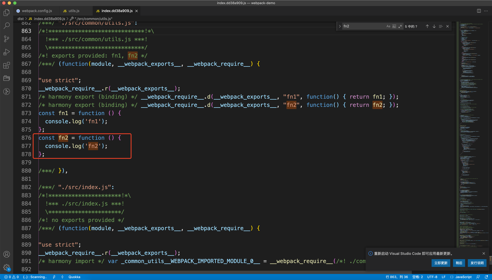

我们在index.js中并没有使用到`fn2`，但是webpack照样把fn2打包进去了，这是因为我们当前的打包环境是`development`，在开发环境下打包，webpack默认是不会开启tree-shaking的。然后我们把webpack.config.js中的`mode`改为`production`。再次执行构建命令，构建结果如下图：

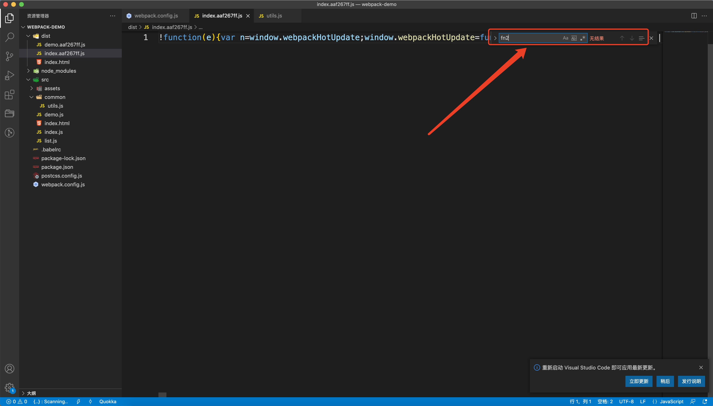

我们可以清楚的看到fn2已经没有了，但是fn1依然被打包到文件中了。这就是webpack在生产环境下进行的tree-shacking优化。`即使fn2引入了，但是没有使用，也是不会打包的。`

关于tree-shacking优化有一个特别需要注意的点，那就是如果项目中在引入像lodash这种库的时候，我们在index.js引入库中的一个函数：

```javascript
import { chunk } from 'lodash';

console.log(chunk([1, 2, 3, 4], 2));
```

然后执行构建，构建结果如下：


打包出来的文件大小是`80kb`，这显然是不正常的。这个问题的原因我们前文也提到了，那就是webpack的tree-shaking优化只适用于ES模块化的库，lodash这个库并没有使用ES模块化语法。知道了这个原因，想解决这个问题我们一定是不难的，可以安装`lodash-es`这个库，这个库是lodash用了es模块化语法的库。

我们安装它：

```bash
$ npm install lodash-es
```

然后在index.js中引入：

```javascript
import { chunk } from 'lodash-es';

console.log(chunk([1, 2, 3, 4], 2));
```

最后打包结果如下：

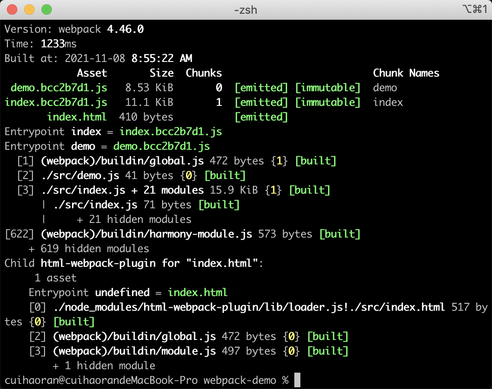

打包之后的结果为`11.1kb`，tree-shacking生效。


## 二、webpack环境区分

现在为止，我们webpack的配置全部写在了一个配置文件——webpack.config.js中。这样对于开发来说是非常不方便的，因为在正式开发中，不同的环境（开发环境、生产环境）对应的配置是不同的。对于特定的环境，都有一些特殊的配置。比如`publicPath`、`apid的路径`、`代码压缩`、`sourcemap`等。

所以我们在开发中一般会对webpack的环境进行区分，我们可以整理一下：

### 开发环境：

+ devServer
+ sourceMap
+ proxy

### 生产环境：

+ Tree-shacking
+ 代码压缩
+ 提取公共代码

### 共同点：

+ 入口文件
+ 部分相同的代码处理

整理好了之后，我们的方案就是新建不同环境的配置文件：

+ 生产环境：`webpack.prod.js`
+ 开发环境：`webpack.dev.js`
+ 公共配置：`webpack.common.js`
+ 配置合并：`webpack.config.js`，这里需要一个工具`webpack-merge`。

我们先来安装一下webpack-merge：

```bash
$ npm install webpack-merge -D
```

安装完之后，我们在项目根目录下新建一个config目录，在config目录中新建`webpack.prod.js`、`webpack.dev.js`、`webpack.common.js`文件。

下面我们依次配置这三个文件：

```javascript
// webpack.prod.js
const webpack = require('webpack');
const { merge } = require('webpack-merge');
const commonConfig = require('./webpack.common');
const prodConfig = {
  mode: 'production',
  devtool: 'none',
};

module.exports = merge(commonConfig, prodConfig);
```

```javascript
// webpack.dev.js
const path = require('path');
const webpack = require('webpack');
const { merge } = require('webpack-merge');
const commonConfig = require('./webpack.common');

const devConfig = {
  mode: 'development',
  devtool: 'cheap-module-eval-source-map',
  devServer: {
    contentBase: path.resolve(__dirname, '../dist'),
    port: 8080,
    hot: true,
  },
  plugins: [
    // HMR插件
    new webpack.HotModuleReplacementPlugin()
  ]
};

module.exports = merge(commonConfig, devConfig);
```

```javascript
// webpack.common.js
const path = require('path');
const HtmlWebpackPlugin = require('html-webpack-plugin');
const { CleanWebpackPlugin } = require('clean-webpack-plugin');
const webpack = require('webpack');

module.exports = {
  entry: {
    index: path.resolve(__dirname, '../src/index.js'),
    demo: path.resolve(__dirname, '../src/demo.js')
  },
  // 出口配置
  output: {
    // 使用占位符处理多个输出文件
    filename: '[name].[hash:8].js',
    path: path.resolve(__dirname, '../dist'),
    publicPath: './',
  },
  module: {
    rules: [
      {
        test: /\.js$/,
        exclude: /node_modules/,
        loader: 'babel-loader'
      },
      {
        test: /\.(png|jpg|gif)$/, // 指定检测什么样的文件
        use: {
          loader: "url-loader",
          options: {
            name: '[name].[hash:5].[ext]',
            outputPath: 'images',
            limit: 2048
          },
        }
      },
      {
        test: /\.ttf$/, // 指定检测什么样的文件
        use: {
          loader: "file-loader",
          options: {
            name: '[name].[hash:5].[ext]',
            outputPath: 'font'
          },
        }
      },
      {
        test: /\.(less|css)$/,
        use: [
          {
            loader: "style-loader"
          },
          {
            loader: "css-loader"
          },
          {
            loader: "postcss-loader",
          },
          {
            loader: "less-loader"
          }
        ]
      }
    ]
  },
  plugins: [
    new HtmlWebpackPlugin({
      template: path.resolve(__dirname, '../src/index.html')
    }),
    new CleanWebpackPlugin()
  ]
}
```

由于配置文件更改了路径，所以相应的路径也要变，这里推荐大家都写成绝对路径。使用node的path模块。

> **关于webpack的路径问题：**
>
> 1. 如果是在package.json中设置的build命令，路径的相对位置就是根目录，和package.json的位置是一样的。
> 2. merge也对相对路径有影响。
>
> 基于以上两点：**我们在webpack中遇到路径问题，推荐使用path.resolve方法，直接设置成绝对路径。**

既然我们区分了环境，那么打包的命令也需要跟着区分一下：

```json
{
  "name": "webpack-demo",
  "version": "1.0.0",
  "description": "",
  "main": "index.js",
  "scripts": {
    "build:dev": "webpack --config ./config/webpack.dev.js", # 开发环境打包
    "build:prod": "webpack --config ./config/webpack.prod.js", # 生产环境打包
    "dev:serve": "webpack-dev-server --config ./config/webpack.dev.js" # 开发服务器
  },
  "keywords": [],
  "author": "",
  "license": "ISC",
  "devDependencies": {
    ...
  },
  "dependencies": {
    "lodash": "^4.17.21",
    "lodash-es": "^4.17.21"
  }
}
```


## 三、JS的代码分割

对于jquery我们是非常熟悉的，如果在代码中引入jquery，然后开发环境下打包看一下结果。

1. 安装jquery模块

```bash
$ npm install jquery
```

2. 在index.js中引入jquery模块

```javascript
import { chunk } from 'lodash-es';
import $ from jquery;

console.log(chunk([1, 2, 3, 4], 2));
```

3. 执行开发环境下的构建：`npm run build:dev`，构建结果如下：

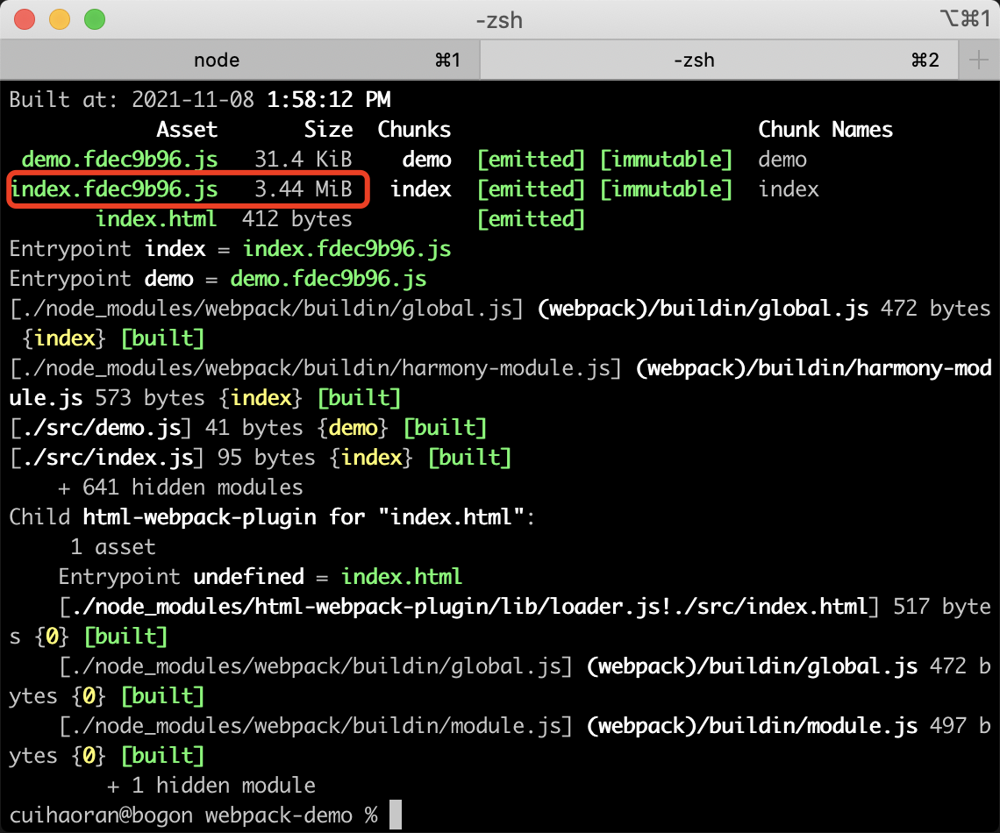

会发现，打完包之后index.js居然达到了惊人的3.44MB，这是没有经过生产模式的tree-shaking的打包优化的原因。像这种JS的代码库，我们一般会单独的提取出去，提取的方法有以下几种：

+ 入口配置，entry多入口。需要使用webpack.ProvidePlugin插件。
+ 抽取公共代码：splitchunks
+ 动态加载，也就是按需加载，俗称懒加载。需要配置@babel/plugin-syntax-dynamic-import插件。

我们引入了jquery，希望的把这个单独打包出去，先使用第一种方法

### I、配置多入口，单独打包jquery

在`webpack.common.js`中进行配置：

```javascript
const path = require('path');
const HtmlWebpackPlugin = require('html-webpack-plugin');
const { CleanWebpackPlugin } = require('clean-webpack-plugin');
const webpack = require('webpack');

module.exports = {
  entry: {
    index: path.resolve(__dirname, '../src/index.js'),
    demo: path.resolve(__dirname, '../src/demo.js'),
    // 配置jquery的入口
    jquery: "jquery"
  },
  // 出口配置
  output: {
    // 使用占位符处理多个输出文件
    filename: '[name].[hash:8].js',
    path: path.resolve(__dirname, '../dist'),
    publicPath: './',
  },
  module: {
    // ...
  },
  plugins: [
    new HtmlWebpackPlugin({
      template: path.resolve(__dirname, '../src/index.html')
    }),
    new CleanWebpackPlugin(),
    // 使用webpack自带的ProvidePlugin插件，注入jquery。
    // 并且配置$、jQuery变量
    new webpack.ProvidePlugin({
      $: "jquery",
      jQuery: "jquery"
    })
  ]
}
```

我们配置了jquery的入口，然后使用ProvidePlugin插件把jquery库注入到了index.html中并暴露出了`$`和`jQuery`变量，让我们能在其他的JS文件中使用`$`和`jQuery`。这样的话我们就不需要在每个JS文件中使用import引入了，修改index.js源文件：

```javascript
import { chunk } from 'lodash-es';

console.log(chunk([1, 2, 3, 4], 2));
```

然后我们执行构建：`npm run build`，构建结果如下：

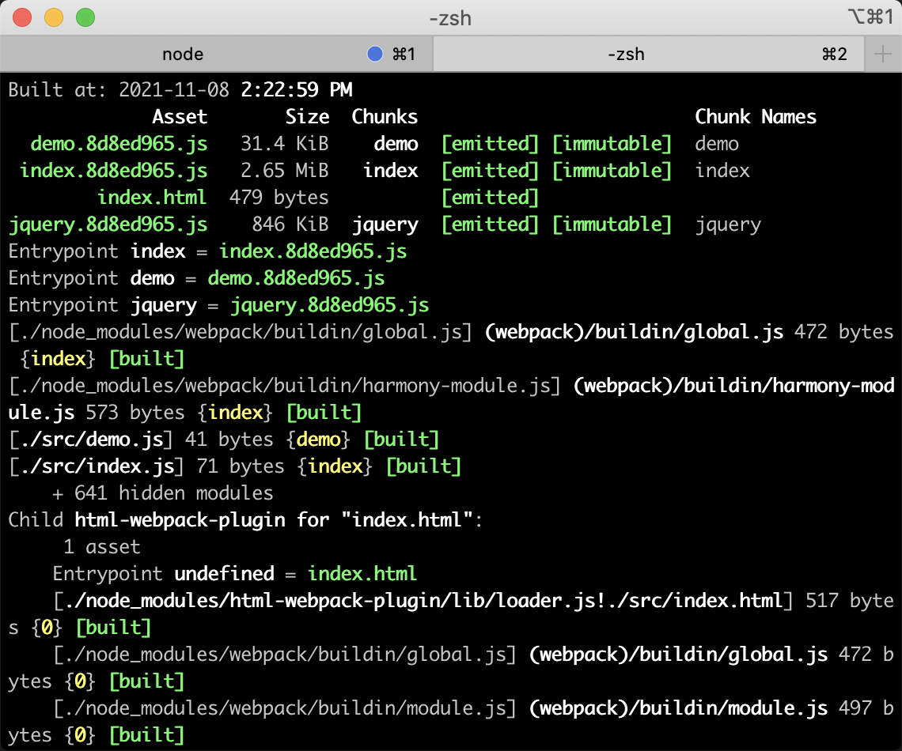

通过打包的结果显示，我们可以直观的看到打包完之后的index.[hash].js小了很多。打包的结果多了一个`jquery.[hash].js`。再看一下打包之后的`index.html`：

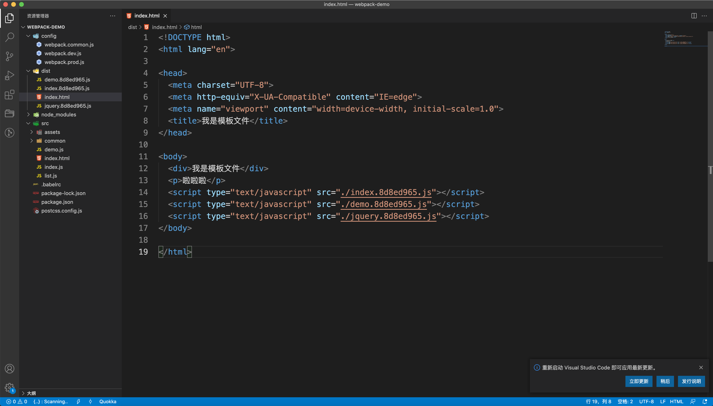

虽然在index.js中没有引入jquery，打包结果依然把jqery注入到了index.html中，这就是`ProvidePlugin`做的事情。

### II、动态加载jquery

我们可以使用动态加载的方式来使用第三方库，想要使用webpack的动态加载，需要提前安装一个`@babel/plugin-syntax-dynamic-import`：

```bash
$ npm install @babel/plugin-syntax-dynamic-import -D
```

然后把刚才多入口打包和注入的代码在webpack.common.js中删掉，更改index.js，在index.js中写动态加载的相关代码：

```javascript
import (/*webpackChunkName:'jquery'*/ 'jquery').then(({default: $}) => {
  console.log($('p'));
});
```

这个插件需要在`.babelrc`配置文件中进行配置：

```json
{
  "plugins": [
    "@babel/plugin-syntax-dynamic-import",
    [
      "@babel/plugin-transform-runtime",
      {
        "corejs": 3
      }
    ]
  ]
}
```

最后执行打包：`npm run build:dev`

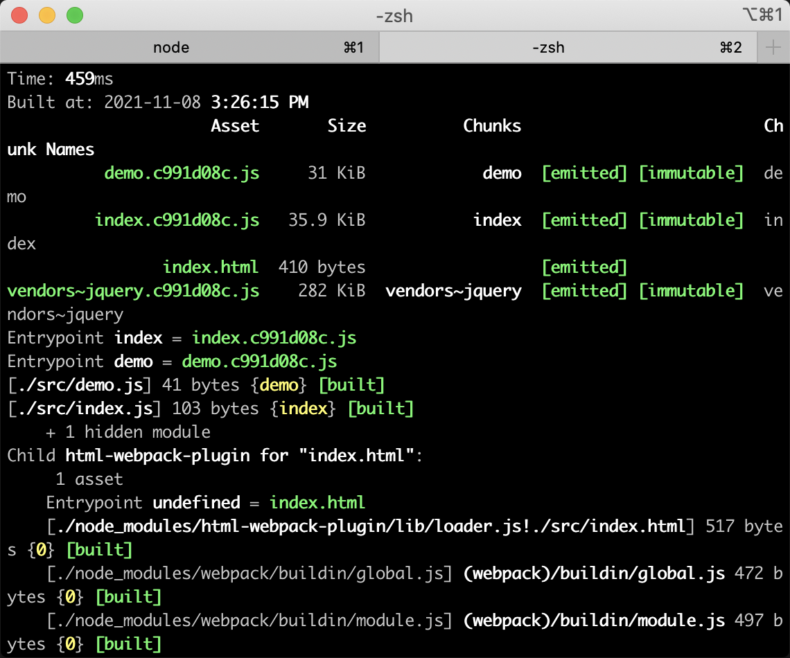

现在index.js的大小只有35.9kb，然后dist目录中多打包出来一个vendors-jquery.[hash].js文件。

### 三、抽取公共代码——splitchunks

webpack4中使用了splitchunksPlugin取代了之前的commonChunksPlugin，提高了打包的速度，这种方式不需要安装第三方插件，只需要在webpack.common.js中进行配置即可，并且功能比较丰富，比较推荐这种做法：

```js
const path = require('path');
const HtmlWebpackPlugin = require('html-webpack-plugin');
const { CleanWebpackPlugin } = require('clean-webpack-plugin');
const webpack = require('webpack');

module.exports = {
  entry: {
    index: path.resolve(__dirname, '../src/index.js'),
    demo: path.resolve(__dirname, '../src/demo.js'),
  },
  // 出口配置
  output: {
    // 使用占位符处理多个输出文件
    filename: '[name].[hash:8].js',
    path: path.resolve(__dirname, '../dist'),
    publicPath: '/',
  },
  // 打包优化
  optimization: {
    splitChunks: {
      chunks: 'all',
      minSize: 30000, # 超过30kb的自动打包
      name: false, # 自定义配置文件名，置为false。
      cacheGroups: {
        vendors: {
          test: /[\\/]node_modules[\\/]/,	# 匹配node_modules中的包
          priority: -10, # 打包优先级
          reuseExistingChunk: true,
          filename: "jquery.js" # 自定义文件名
        },
        default: {
          minChunks: 2,
          priority: -20,
          reuseExistingChunk: true, # 已经被打包过的模块不会再次打包
          filename: "common.js"
        },
      },
    },
  },
  module: {
    // ...
  },
  plugins: [
    new HtmlWebpackPlugin({
      template: path.resolve(__dirname, '../src/index.html')
    }),
    new CleanWebpackPlugin()
  ]
}
```

按照上面的代码进行配置，配置完之后在index.js和demo.js中引入jquery：

```javascript
// index.js
import $ from "jquery";
console.log($("p"));
```

```javascript
// demo.js
console.log('我是demo.js入口文件');
import $ from "jquery";
console.log($("p"));
```

执行构建：`npm run build:dev`，构建结果如下：

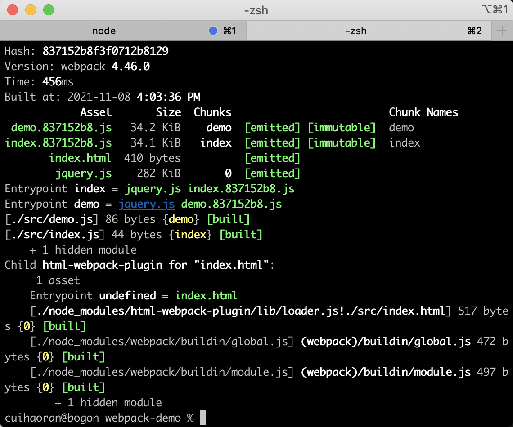

我们可以看到jquery已经独立打包出来了，并且我们自定义命名也生效了。更过配置参数的详解请参考[官方网站](https://webpack.docschina.org/plugins/split-chunks-plugin/)。前面讲的所有都是JS的代码分割，下面我们来看一下CSS的代码分割。


## 四、CSS的代码分割

我们在index.js中引入less代码：

```javascript
import './assets/css/style.less'
```

然后执行构建：`npm run build:dev`，打包结果如下：

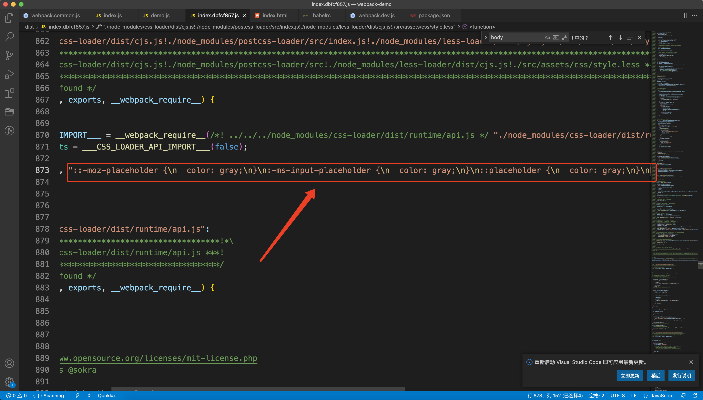

可以看到dis目录中是没有打包好的css文件的，并且css代码是直接打包到了JS文件中。我们希望css文件能够单独打包，也就是进行css代码分割：

1. 首先我们要用到`mini-css-extract-plugin`插件：

```bash
$ npm install mini-css-extract-plugin@0.8.0 -D
```

2. 配置CSS代码分割：

一般来说，CSS的代码分割只在生产环境下配置，开发环境下是不需要CSS代码分割的。下面我们配置`webpack.prod.js`：

```javascript
const webpack = require('webpack');
const { merge } = require('webpack-merge');
const commonConfig = require('./webpack.common');
const MiniCssExtractPlugin = require('mini-css-extract-plugin');
const prodConfig = {
  mode: 'production',
  devtool: 'none',
  module: {
    rules: [
      {
        test: /\.(less|css)$/,
        use: [
          {
            loader: MiniCssExtractPlugin.loader
          },
          {
            loader: "css-loader"
          },
          {
            loader: "postcss-loader",
          },
          {
            loader: "less-loader"
          }
        ]
      }
    ]
  },
  plugins: [
    new MiniCssExtractPlugin({
      filename: "[name].[hash:8].css"
    })
  ]
};

module.exports = merge(commonConfig, prodConfig);
```

3. 执行构建：`npm run build:prod`，构建结果如下：

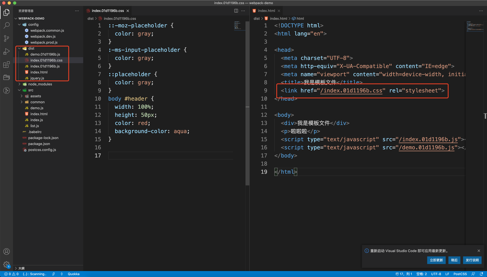

我们可以看到dist目录中多了一个`index.[hash].css`文件，这说明css文件已经可以单独打包，CSS代码的分割已经生效。

4. 对打包生成的CSS文件进行压缩。

在生产环境下CSS代码是需要压缩的，一般使用`optimize-css-assets-webpack-plugin`进行CSS代码压缩。

```bash
$ npm install optimize-css-assets-webpack-plugin -D
```

下载完毕之后，在webpack.prod.js中进行配置：

```javascript
const webpack = require('webpack');
const { merge } = require('webpack-merge');
const commonConfig = require('./webpack.common');
const MiniCssExtractPlugin = require('mini-css-extract-plugin');
const OptimizeCssAssetsPlugin = require('optimize-css-assets-webpack-plugin');
const prodConfig = {
  mode: 'production',
  devtool: 'none',
  optimization: {
    minimizer: [
      // 压缩插件
      new OptimizeCssAssetsPlugin()
    ],
  },
  module: {
    rules: [
      {
        test: /\.(less|css)$/,
        use: [
          {
            loader: MiniCssExtractPlugin.loader
          },
          {
            loader: "css-loader"
          },
          {
            loader: "postcss-loader",
          },
          {
            loader: "less-loader"
          }
        ]
      }
    ]
  },
  plugins: [
    new MiniCssExtractPlugin({
      filename: "[name].[hash:8].css"
    }),

  ]
};

module.exports = merge(commonConfig, prodConfig);
```

配置完之后，执行构建：

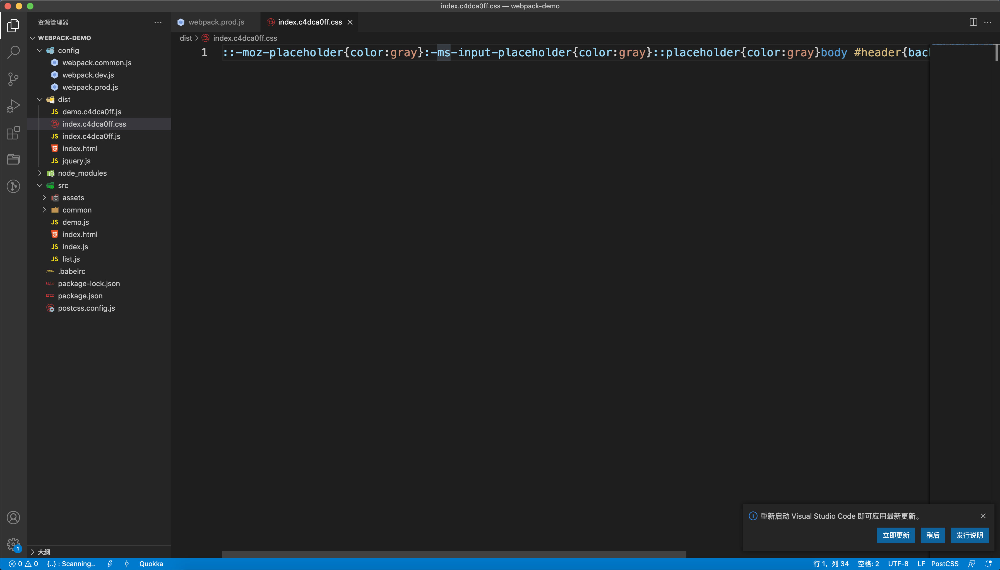

> **OptimizeCssAssetsPlugin也可以直接写在plugins中。**

这里出现了一个问题，在optimization配置CSS压缩插件OptimizeCssAssetsPlugin之后，我们会发现所有的JS都没有被压缩，这是因为optimization的配置由于我们的手动配置，被覆盖掉了。为了解决JS代码的压缩的默认插件被覆盖的问题，我们可以手动的添加JS的压缩插件——`terser-webpack-plugin`。

```bash
$ npm install terser-webpack-plugin -D
```

下载完成之后添加到`optimization.minimizer`中。

```javascript
const webpack = require('webpack');
const { merge } = require('webpack-merge');
const commonConfig = require('./webpack.common');
const MiniCssExtractPlugin = require('mini-css-extract-plugin');
const OptimizeCssAssetsPlugin = require('optimize-css-assets-webpack-plugin');
const TerserPlugin = require("terser-webpack-plugin");

const prodConfig = {
  mode: 'production',
  devtool: 'none',
  optimization: {
    minimizer: [
      // CSS代码压缩
      new OptimizeCssAssetsPlugin(),
      // JS代码压缩
      new TerserPlugin()
    ],
  },
  module: {
    // ...
  },
  plugins: [
    new MiniCssExtractPlugin({
      filename: "[name].[hash:8].css"
    })
  ]
};

module.exports = merge(commonConfig, prodConfig);
```

配置完之后，执行构建，会发现JS代码也被压缩了。

> **注意：**
>
> 在optimization.minimizer手动配置之后，会影响到webpack在production环境下JS代码的默认压缩。需要手动配置JS代码压缩。


## 五、代码包管理工具

随着我们开发的项目越来越大，安装的代码包也会随之增加。这里推荐一个非常好用的代码包管理工具：`webpack-bundle-plugin`。

先来安装它：

```bash
$ npm install webpack-bundle-analyzer -D
```

然后在webpack.prod.js（加入我们要分析生产环境的包）进行配置：

```javascript
const webpack = require('webpack');
const { merge } = require('webpack-merge');
const commonConfig = require('./webpack.common');
const MiniCssExtractPlugin = require('mini-css-extract-plugin');
const OptimizeCssAssetsPlugin = require('optimize-css-assets-webpack-plugin');
const TerserPlugin = require("terser-webpack-plugin");
const BundleAnalyzerPlugin = require('webpack-bundle-analyzer').BundleAnalyzerPlugin;

const prodConfig = {
  mode: 'production',
  devtool: 'none',
  optimization: {
    minimizer: [
      new OptimizeCssAssetsPlugin(),
      new TerserPlugin()
    ],
  },
  module: {
    // ...
  },
  plugins: [
    new MiniCssExtractPlugin({
      filename: "[name].[hash:8].css"
    }),
    // 代码包分析工具
    new BundleAnalyzerPlugin()
  ]
};

module.exports = merge(commonConfig, prodConfig);
```

配置完毕之后，进行构建：`npm run build:prod`，构建完成之后会自动打开一个网页，上面显示了每个源文件中引用的包：

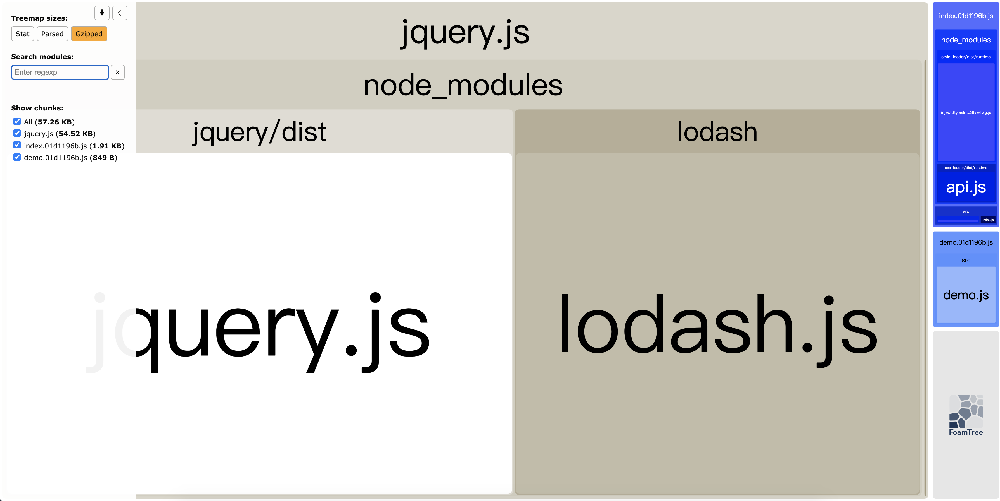


## 六、webpack的环境变量

有的时候我们需要在webpack的配置文件中获取当前打包的环境变量，以便我们在公共配置中，按照环境变量的不同实现不同的配置。

1. 在执行build命令的时候，传入环境变量，构建命令中的环境变量是可以自定义的。

```json
{
  "name": "webpack-demo",
  "version": "1.0.0",
  "description": "",
  "main": "index.js",
  "scripts": {
    "build:dev": "webpack --config ./config/webpack.dev.js",
    ## 这里的--env就是环境变量env  env的值为production，也可以定义除了env之外别的变量名
    "build:prod": "webpack --config ./config/webpack.prod.js --env production",
    "dev:serve": "webpack-dev-server --config ./config/webpack.dev.js"
  },
  "keywords": [],
  "author": "",
  "license": "ISC",
  "devDependencies": {
    
  },
  "dependencies": {
    "jquery": "^3.6.0",
    "lodash": "^4.17.21",
    "lodash-es": "^4.17.21",
    "yargs": "^13.2.4"
  }
}

```

2. 在webpack.common.js中获取环境变量。

想要在配置文件中获取环境变量，我们需要一个工具——yargs。先安装：

```bash
$ npm install yargs
```

然后在webpack.common.js中获取：

```javascript
const path = require('path');
const HtmlWebpackPlugin = require('html-webpack-plugin');
const { CleanWebpackPlugin } = require('clean-webpack-plugin');
const webpack = require('webpack');
const argv = require('yargs').argv;

console.log("环境变量env：", argv.env);
// 使用env
const modeFlag = argv.env === "production"? true: false;

module.exports = {
  entry: {
    index: path.resolve(__dirname, '../src/index.js'),
    demo: path.resolve(__dirname, '../src/demo.js'),
  },
  output: {
    filename: '[name].[hash:8].js',
    path: path.resolve(__dirname, '../dist'),
    publicPath: '/',
  },
  optimization: {
    splitChunks: {
      chunks: 'all',
      minSize: 30000,
      name: false,
      cacheGroups: {
        vendors: {
          test: /[\\/]node_modules[\\/]/,
          priority: -10,
          reuseExistingChunk: true,
          filename: "jquery.js"
        },
        default: {
          minChunks: 2,
          priority: -20,
          reuseExistingChunk: true,
          filename: "common.js"
        },
      },
    },
  },
  module: {
    rules: [
      {
        test: /\.js$/,
        exclude: /node_modules/,
        loader: 'babel-loader'
      },
      {
        test: /\.(png|jpg|gif)$/,
        use: {
          loader: "url-loader",
          options: {
            // 根据modeFlag实现不同的配置
            name: modeFlag? '[name].[contenthash:5].[ext]': '[name].[hash:5].[ext]',
            outputPath: 'images',
            limit: 2048
          },
        }
      },
      {
        test: /\.ttf$/,
        use: {
          loader: "file-loader",
          options: {
            name: '[name].[hash:5].[ext]',
            outputPath: 'font'
          },
        }
      },
      {
        test: /\.(less|css)$/,
        use: [
          {
            loader: "style-loader"
          },
          {
            loader: "css-loader"
          },
          {
            loader: "postcss-loader",
          },
          {
            loader: "less-loader"
          }
        ]
      }
    ]
  },
  plugins: [
    new HtmlWebpackPlugin({
      template: path.resolve(__dirname, '../src/index.html')
    }),
    new CleanWebpackPlugin()
  ]
}
```

这样我们就完成了在公共的配置文件中使用环境变量来进行分环境配置。


## 总结

到现在为止，webpack中的基本概念和高级概念就全部介绍完了。在项目中实践是最重要的。


