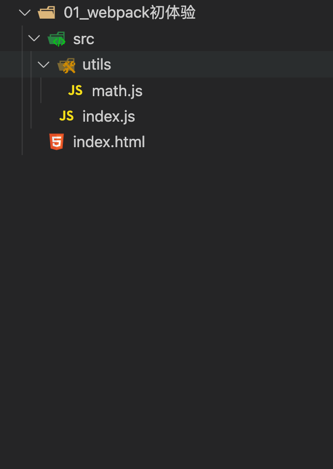
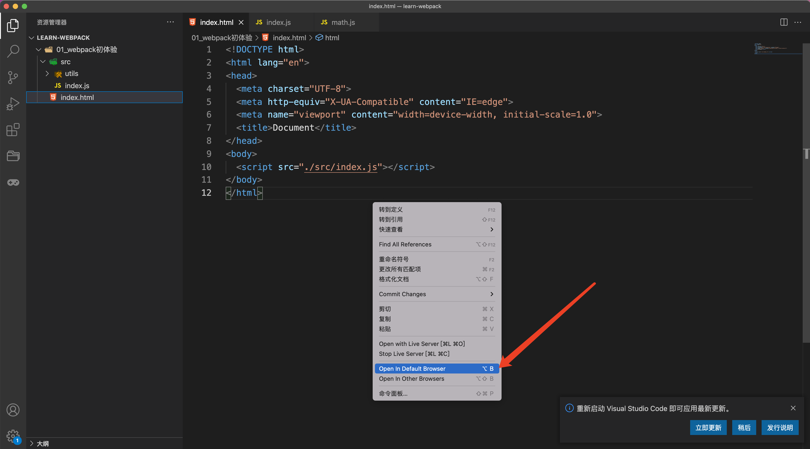
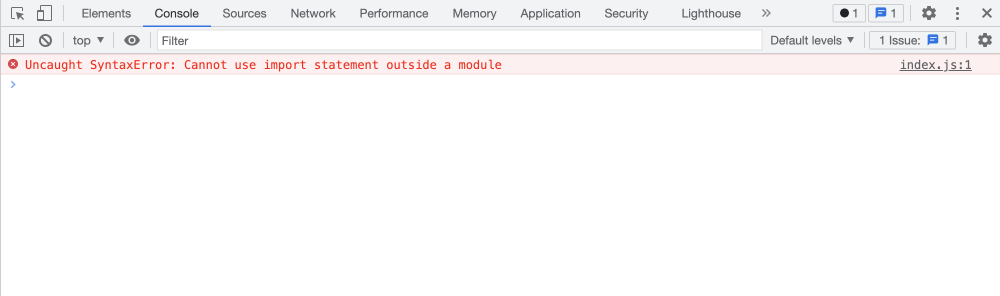
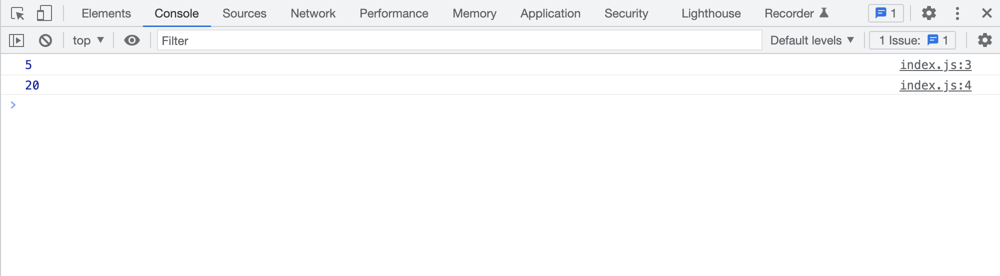
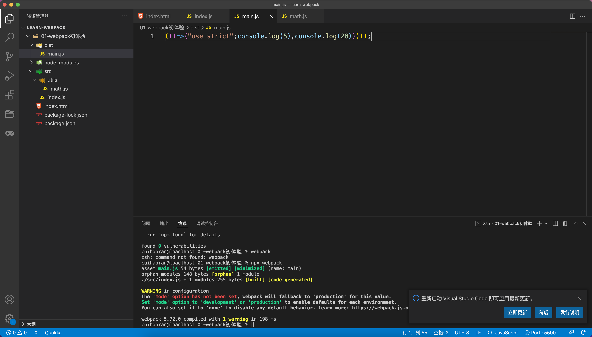
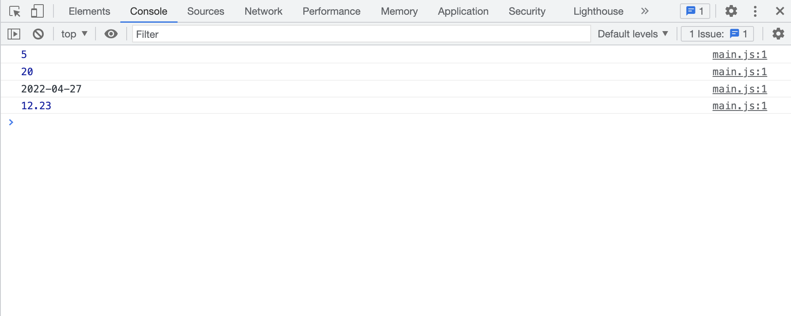
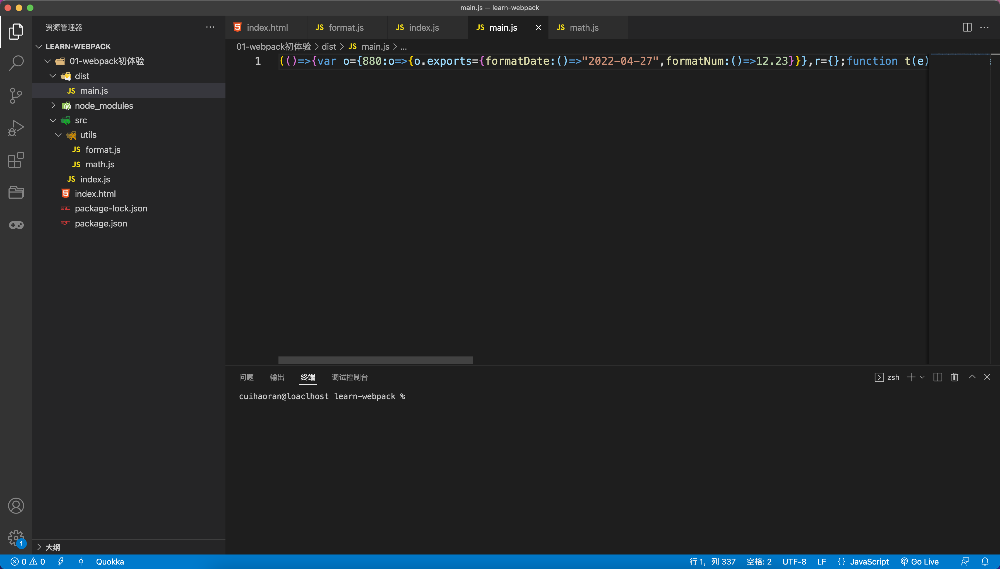

# Webpack初体验

**首先，欢迎大家阅读Webpack深入浅出系列文章。**

webpack是一个老生常谈的问题，接下来的一段时间里，笔者会由浅入深的介绍webpack的特性。

+ 为什么要打包？
+ 怎么打包？
+ 打包之后是什么？
+ ......

在webpack初体验中我们会解答这些问题~


## 一、为什么会出现Webpack？

Web开发的早期主要是后端渲染比如PHP、JSP等等，那时候的前端只需要写一些静态页面，做一些简单的前端展示，除此之外所有的交互和逻辑都需要后端来完成。

随着Web的发展，web2.0出现了`AJAX`技术，这使得在不刷新网页的情况下仍然可以获得后端的数据，并且改变页面的渲染。使得前端也可以操作数据，并和用户进行交互。

到如今，Web开发的发展已经一日千里，开发内容更加丰富，实现的功能更加复杂。随之而来的问题就是开发的复杂度大大提升。当前web开发主要面临下面这几个问题：

+ 由于开发复杂度提高，往往需要使用模块化的方式进行前端开发。
+ 涌现出了很多的高级特性来提高开发效率和安全性。比如使用ES6+、TS进行脚本的开发，使用sass、less进行css的开发。
+ 开发过程中，我们尝尝会多次刷新浏览器这非常繁琐，我们希望能够监听文件的变化自动刷新浏览器。
+ 开发完成之后还需要对代码进行压缩、合并或者分包以及其他的性能优化。

前端发展到现在，以上的这些问题都得到了解决，比如说我们非常熟悉的前端的三大框架：`Vue、React、Angular`。在使用这三个框架中的其中一个进行web开发的时候，我们很自然的使用到了`模块化开发`、`使用了Es6+的语法甚至是TS`、`代码的压缩和分包`。然而这些框架的脚手架无疑例外的都使用了`Webpack`来做这些事情。

**所以Webpack的出现就是为了解决现在Web开发所面临的的问题的。**


## 二、Webpack是什么？

关于Webpack是什么？这个问题在webpack的官方网站中有一句话说的很清楚：

`webpack is a static module bundler for modern JavaScript applications.`

这句话的意思是：Webpack是一个静态模块打包器，为了现代的JS应用程序。这句话高度概括了Webpack是什么。不免晦涩难懂，下面我们对这句话进行拆解：

+ 打包器——bundler：webpack就是为我们的应用程序打包的，所以它是一个打包工具。
+ 静态——static：webpack最终会把所有的前端代码打包成静态资源，部署在静态文件服务器上。
+ 模块化——module：webpack默认支持各种模块化的开发，包括：ESModule、CommonJS、AMD等。众所周知的，在浏览器端运行的JS脚本一般情况下是不支持模块化的，比如CommonJS模块化的代码如果放到浏览器中执行是 不会成功执行的，对于ESModule来说，现在有些新的浏览器是支持的，但是我们并不能保证我们开发的模块化代码都运行在现代新型的浏览器中。所以为了解决这个问题，webpack会将所有的模块化的代码编译成浏览器能够识别的代码。使得我们在开发的时候可以使用任何的模块化开发方式。
+ 现代的——modern：正是因为现在的前端开发面临着各种问题我们才会用到Webpack。

### 在工作中使用webpack的场景

+ 在开发Vue或者React的时候我们会对路径起一个别名
+ 支持less、sass
+ 支持TS
+ 安装性能分析工具
+ 编写自己需要的loader和plugin

### Webpack会不会被Vite替代？

这个问题很多人问，但是答案是显而易见的——短期内Vite并不能替代Webpack。有以下这些原因：

+ Vue3项目既可以使用Vite打包，也可以使用Webpack打包。
+ React、Angular的项目也没有默认支持Vite
+ Vite的最终打包生成静态文件的过程是借助于rollup来完成的。
+ Vite的核心思想并不是首创——借鉴的snowpack。具体的原理就是Koa + 中间件 + Esbuilde
+ Webpack生态完善，并不断发展。


## 三、Webpack的安装

现在Webpack最新的版本是Webpack5，在平时使用webpack对Vue或React进行打包的时候需要下载两个包：

+ Webpack
+ Webpack-cli

### Webpack和Webpack-cli的关系

1. 执行webpack命令的时候实际上执行的是node_modules下bin目录中的webpack。
2. webpack在执行的时候是依赖webpack-cli的，如果没有会报错。
3. 在webpack-cli中的代码执行时才会真正的利用webpack进行编译和打包的过程。
4. 所以在安装webpack的时候我们需要同时安装webpack-cli。

> 这里要注意一个问题：
>
> 第三方脚手架比`如Vue-cli`、`create-react-app`就没有使用webpack-cli，而是自己开发了cli工具。比如说：vue-service-cli。

关于webpack和webpack-cli现在是分开安装的，可以使用以下命令实现全局安装：

```shell
# 全局安装webpack、webpack-cli

$ npm install webpack webpack-cli -g
```

这样我们在项目中直接使用webpack的话就是使用的全局的webpack和webpack-cli。不过这样的操作会有一个问题：对于不同的开发者本地的webpack的版本可能有所不同。所以在打包同一份代码的时候可能会因为版本的差异出现打包的不一致。所以这就需要在初始化项目的时候安装webpack与webpack-cli到开发环境下：

```bash
# 初始化项目安装webpack、webpack-clis

$ npm install webpack webpack-cil -D
```

这样可以保证webpack、webpack-cli的版本写到`package.json`中，这样在多个人协同开发的时候就能够统一webpack的版本，不至于打包出现问题。

### 使用项目中安装的（而不是全局的）webpack的方法

1. `npx webpack` 

2. 配置package.json中的script脚本：

   ```json
   "scripts": {
       "start": "webpack serve --config ./config/webpack.development.js",
       "build:liantiao": "webpack --config ./config/webpack.production.js --env=liantiao",
       "build:preprod": "webpack --env=preprod --config ./config/webpack.production.js",
       "build:prod": "webpack --env=production --config ./config/webpack.production.js"
     },
   ```

3. 直接在项目的根目录执行：

   ```bash
   $ ./node_modules/.bin/webpack
   ```

   

## 四、webpack到底做了什么？

众所周知，webpack是一个静态文件打包器，前文也对这个概念做了详细的解释，但是纸上得来终觉浅，我们还是要通过代码来看一下webpack到底帮程序员做了什么？

### Step1、创建项目

+ 新建一个目录——`learn-webpack`
+ 在learn-webpack中创建一个新的目录——`01-webpack初体验`
+ 在01_webpack初体验中创建一个目录——`src`
+ 在src中创建`index.html、utils目录`
+ 在utils中创建`math.js`

当前我们的项目结构应该如下图：



### Step2、编写项目文件

**编写index.html：**

```html
<!DOCTYPE html>
<html lang="en">
<head>
  <meta charset="UTF-8">
  <meta http-equiv="X-UA-Compatible" content="IE=edge">
  <meta name="viewport" content="width=device-width, initial-scale=1.0">
  <title>Document</title>
</head>
<body>
  <script src="./src/index.js"></script>
</body>
</html>
```

**编写src/utils/math.js**

```javascript
const add = (num1, num2) => {
  return num1 + num2;
}

const multiplica = (num1, num2) => {
  return num1 * num2;
}

export {
  add,
  multiplica
}
```

**编写src/index.js**

```javascript
import { add, multiplica } from './utils/math.js';

console.log(add(2, 3));
console.log(multiplica(4, 5));
```

简单来说我们用ESModule的方式模块化的编写了两个数学函数——两数相加和两数相乘。然后在`src/index.js`中引入，并且在`index.html`中引入`src/index.js`。

### Step3、启动项目

做完这些，我们需要用本地服务器把项目跑起来，笔者推荐VScode的http-server插件——`Live Server`。安装好之后，在`index.html`右键启动就OK~——如下图：



启动项目之后我们会发现一个问题，根据我们写的逻辑控制台应该输出`5`和`20`，但是实际上却如下图所示：



如图所示，出现了一个语法错误，大概的意思是在当前的浏览器环境中并不支持`import`这种模块化的语法。这种情况下我们是有解决办法的：

> 在现在的Chrome浏览器中是支持ESModule模块化的语法的，只要在script标签添加`type="module"`的属性。
>
> `<script src="./src/index.js" type="module"></script>`
>
> 但是这个属性要遵从两个关键点：
>
> + 必须是http或者https协议，在file协议下这个属性值会失效。也就是说项目必须跑在http服务器上。
> + 在`import xxx from xxx.js`时，一定要写上完整的后缀名，因为这是在浏览器环境必须要有完整的后缀名才能定位文件。

按照上文给出的解决方法更改完之后，刷新浏览器可以看到控制台正常输出：



虽然解决了模块化的问题，但是另一个问题随之出现，那就是`type="module"`还是一个很新的的属性，不能保证每一个浏览器都支持。

> 关于`type="module"`的浏览器支持的问题：
>
> 到笔者写这篇文章为止，Chrome、FF、Safari是都可以支持`type="module"`的。

那么有没有一个方式把我们写的模块化的代码编译成浏览器能运行的良好的代码。毫无疑问，这个问题很容易解决——Webpack就是解决此类问题的利器。

在项目的根目录`（01-webpack初体验）`运行：

```bash
$ webpack
```

这条命令会默认寻找src中的index.js文件，把index.js当做入口文件，然后对入口文件中使用到的文件或者方法生成依赖图，随之进行编译——把模块化代码编译成普通的浏览器能识别的代码。

执行完之后会发现项目根目录下生成了一个`dist`目录，这里面就是打包生成的代码：



可以看到经过webpack的处理之后，不但把模块化的代码编译成了浏览器能够执行的代码，而且webpack5还做了大量的prepack的工作。

**以上就是webpack所做的主要工作，也就是其主要的作用——把模块化的代码打包成浏览器能够认识的代码。**

> 新版本的Webpack5新加入了`prepack`的功能。会把简单的逻辑直接预先打包成结果代码。

但是现在还有一个问题，编译之后的结果仍然保留了ES6的箭头函数，也就是说Webpack的打包只是对模块化进行了处理，并没有对 `ES6+`的语法进行降级到`ES5`的语法。这是因为webpack本身对于JS的编译功能是不会对`ES6`的 语法做处理的，如果想要对语法进行编译最常用的就是`babel-loader`。使用babel-loader能够方便的转译`ES6+`成为ES5。

在`index.html`中引入dist中的`main.js`，在浏览器中打开网页：


刚才我们使用了Webpack打包编译了ESModule的模块化编码，其实Webpack天然支持CommonJS、ESModule两种模块化的语法。

新建`src/utils/format.js`：

```javascript
const formatDate = () => {
  return '2022-04-27';
}

const formatNum = () => {
  return 12.23;
}

module.exports = {
  formatDate,
  formatNum
}
```

 编写`src/index.js`

```javascript
import { add, multiplica } from './utils/math.js';
const { formatDate, formatNum } = require("./utils/format");

console.log(add(2, 3));
console.log(multiplica(4, 5));

console.log(formatDate());
console.log(formatNum());
```

这样在`index.js`中就有了两种模块化语法，然后进行webpack打包：

```bash
$ npx webpack
```

打包完成之后打开浏览器查看：



可以看到，CommonJS的代码也被成功的打包了。看一下打包的结果：



果然，一堆乱七八糟的被压缩的代码，在后面的文章中笔者会读这一部分代码，当然不是这种压缩之后的。。。


## 五、总结

+ Webpack是一个静态资源打包器为了现代的JavaScript应用。
+ Webpack可以使用全局安装的也可以安装在项目中局部使用。
  + npx
  + 在package.json中配置脚本
+ webpack和webpack-cli的关系，webpack-cli不是必要的。可以自己开发CLI
+ webpack的核心就是支持多种模块化编码方式，然后打包成浏览器能够执行的代码。