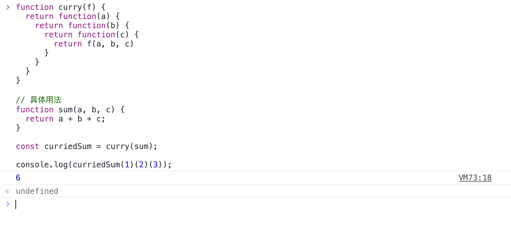

# 深入剖析函数柯里化——JavaScript版本

## 前言

`函数柯里化（Currying）`是函数式编程的一个重要概念，同样也是关于函数的高阶技术，弄懂函数柯里化对于我们理解函数式编程，函数为什么是`一等公民`等问题都有很大的帮助。

> 这里要注意的是函数的柯里化并不是JavaScript独有的特性或者技术，可适用于多种编程语言。


## 什么是函数柯里化？

函数柯里化并不是要调用什么特殊的函数，函数柯里化只是对于函数的`转化`，即从一个函数向另一个函数的转化。而这个转化的过程一般也是封装成一个函数。

**柯里化不会调用函数。它只是对函数进行转化。**

上文揭示了函数柯里化是什么的问题，由于太过晦涩难懂，我们举个例子说明一下：

**示例一：**

我们将创建一个辅助函数——`curry(f)`，这个函数接收一个拥有多个参数的函数 f ，对函数 f ，进行柯里化。简单来说就是执行 ` f(a, b, c, ....) --->  f(a)(b)(c)...`的转换。

**Talk is cheap, show me the code.**

```javascript
function curry(f) {
  return function(a) {
    return function(b) {
      return function(c) {
        return f(a, b, c)
      }
    }
  }
}

// 具体用法
function sum(a, b, c) {
  return a + b + c;
}

const curriedSum = curry(sum);

console.log(curriedSum(1)(2)(3));		// 6
```

下面我们看一下上述代码的执行结果



和我们预期的结果相同。

其实实现的方式非常简单——只有三个`包装器`。

+ 三个包装器非别为`function(a)、function(b)、function(c)`
+ `curry(f)`函数由内而外返回这三个包装器，目的是为了把`a,b,c`保存在ECS（执行栈）中。调用curriedSum(1)是参数会保存在ECS中，然后返回`function(b)`。
+ 一层层往下调用最后会把所有的参数汇集到最原始（也就是最里面一层）的`f(a)(b)(c)`中，而这样就是和调用`sum(a, b, c)`是完全同理的。

至此也很好的解释了我们开篇说的中心话题：柯里化不是函数的调用而是函数的转换。

很遗憾，到这里只是柯里化的低级实现方式，柯里化更高级的实现可以参考一下`lodash`库的`_.curry`，这个函数会返回一个包装器，允许该包装器（即函数）正常调用或者以`偏函数(下文会解释偏函数的概念)`的方式调用。

```javascript
function sum(a, b) {
  return a + b;
}

let curriedSum = _.curry(sum); // 使用来自 lodash 库的 _.curry

alert( curriedSum(1, 2) ); // 3，仍可正常调用
alert( curriedSum(1)(2) ); // 3，以偏函数的方式调用
```


## 为什么要进行柯里化？

为了说明这个这个问题，我们举一个实际开发中的例子，如果有前端的同学做过Node的服务端开发就会知道一个问题，那就是日志记录的重要性。假如我们现在有一个用于格式化和输出日志信息的日志函数——log。`log(date, importance, message)`这个函数用于记录日志。

```javascript
function log(date, importance, message) {
  // 在PM2中console.log会把输出的信息写入日志文件
  console.log(`[${date.getHours()}:${date.getMinutes()}] [${importance}] ${message}`)
}
```

使用lodash的_curry对log函数进行柯里化：

```javascript
const log = _.curry(log);
```

柯里化之后log函数仍然可以正常运行：

```javascript
log(new Date(), "ERROR", "error info");		// log(a, b, c)
```

也可以按照柯里化的方式调用：

```javascript
log(new Date())("ERROR")("error info");		// log(a)(b)(b)
```

到这里函数柯里化的真正用途就可以见到了，我们可以很轻松的创建一些高效的偏函数——也就是更加简短的偏应用函数：

创建一个基于当前时间的日志函数——logNow

```javascript
const logNow = log(new Date());

logNow("ERROR", "error info");
```

我们会发现`logNow`其实就是固定了第一个参数（date）的log函数。logNow就是更为简短实用的偏应用函数。其实还可以更进一步，创建一个基于当前时间的错误日志函数——errorNow

```javascript
const errorNow = logNow("ERROR");

errorNow("error info");
```

结论：

+ 柯里化之后并没有丢失任何参数，log还可以正常调用
+ 可以生成更加简短的偏函数


## 柯里化的高级实现

文章开始我们实现的柯里化非常死板，需要考虑到原函数的参数个数，这非常不通用。这次我们做一个通用版本：

```javascript
function curry(func) {
  return function curried(...args) {
    if(args.length >= func.length) {
      return func.apply(this, args);
    }else {
      return function(...args2) {
        return curried.apply(this, args.concat(args2));
      }
    }
  }
}

function sum(a, b, c) {
  return a + b + c;
}

const curriedSum = curry(sum);

console.log(curriedSum(1,2,3));
console.log(curriedSum(1,2)(3));
console.log(curriedSum(1)(2)(3));
```

新的curry函数相对来说比较复杂，里面存在两个if语句：

+ 如果柯里化后的函数传入的参数args的长度大于等于原始函数的参数长度，那么直接使用`func.apply`调用原始函数即可。
+ 如果柯里化后的函数传入的参数args的小于原始函数的参数长度，会返回一个偏函数，先把偏函数的参数和柯里化后的函数参数一起收集起来，作为参数传入柯里化后的函数，再调用柯里化后的函数。（确实有点绕，说白了其实就是包装器，偏函数）。

再次调用柯里化后的函数，还会获得一个偏函数（参数不够的情况）或者直接调用原始函数（参数足够的情况）。


## 总结

**柯里化** 是一种转换，将 `f(a,b,c)` 转换为可以被以 `f(a)(b)(c)` 的形式进行调用。**JavaScript 实现通常都保持该函数可以被正常调用，并且如果参数数量不足，则返回偏函数。**


