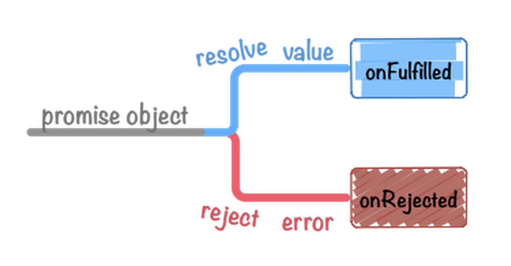

# 深度剖析实现Promise


## Promise的基本语法

Promise是为了解决回调函数的嵌套问题——也就是我们通常所说的 ”回调地狱“，以then链的方式把回调的层层嵌套展开，拉平。 

**如何创建一个Promise对象**

```javascript
const p = new Promise((resolve, reject) => {
  resolve(100)
});

p.then((res) => {
  console.log(res);		// 100
});
```

通常我们会使用Promise来解决异步问题，也就是在Promise的回调函数中编写异步代码，然后结果由resolve传出。

```javascript
const p = new Promise((resolve, reject) => {
 	// promise内部一般可以封装一个异步操作
  // resolve, reject 是 promise 内部提供好给你的两个函数
	// 成功调用 resolve
	// 失败调用 reject
})
```

Promise的回调函数接收两个参数，这两个参数是函数类型。resolve函数是成功的时候调用，失败时调用reject函数。

通过`new Promise`得到的实例上会有一个`then`方法和一个`catch`方法，then方法接收两个回调函数作为参数，第一个回调函数式成功的时候调用，第二个则是失败时调用。`catch`方法则是在整个Promise链路上不管哪里出了错误都会触发catch方法。

```javascript
p.then(res => { ... }) 处理成功
 .catch(res => { ... }) 处理失败
```


## Promise A+规范

`PromiseA+`是一个规范，这个规范描述了Promise是什么，应该具有哪些属性和方法。也就是说，任何人都可以实现Promise A+规范，只要是实现了PromiseA+规范的代码就是Promise。

### 术语

+ Promise：promise 是一个拥有 `then` 方法的对象或函数，其行为符合本规范；

+ thenable：是一个定义了 `then` 方法的对象或函数，文中译作“拥有 `then` 方法”；
+ value（值）：指任何 JavaScript 的合法值（包括 `undefined` , thenable 和 promise）；
+ exception（异常）：是使用 `throw` 语句抛出的一个值。
+ reason：表示一个 promise 的拒绝原因。

### Promise的三个状态

一个Promise的状态必须为以下三个状态中的一个：**等待态（Pending）**、**执行态（Fulfilled）**和**拒绝态（Rejected）**。

+ pending（等待态）：这是Promise的初始状态，处于等待态的Promise可以转变为执行态（Fulfilled）或者拒绝态（rejected）
+ Fulfilled（执行态）：处于执行态的Promise需要满足以下的条件
  + 不能迁移至其他任何状态
  + 必须拥有一个**不可变**的终值
+ 拒绝态（Rejected）：处于拒绝态时，promise 需满足以下条件：
  + 不能迁移至其他状态
  + 必须拥有一个不可变的原因

### then方法

一个Promise对象必须拥有一个then方法，用来访问`当前值`、`最终值`或者是`据因`。

promise的then方法接收两个函数作为参数：

```javascript
promise.then(onFulfilled, onRejected);
```

**参数可选：**

`onFulfilled`和`onRejected`都是可选的，如果这两个参数不是函数类型则必须被忽略。

**onFulfilled特性：**

如果`onFulfilled`是函数：

- 当 `promise` 执行结束后其必须被调用，其第一个参数为 `promise` 的终值
- 在 `promise` 执行结束前其不可被调用
- 其调用次数不可超过一次

**`onReject`特性：**

如果 `onRejected` 是函数：

- 当 `promise` 被拒绝执行后其必须被调用，其第一个参数为 `promise` 的据因
- 在 `promise` 被拒绝执行前其不可被调用
- 其调用次数不可超过一次

**then方法可以被同一个promise多次调用：**

- 当 `promise` 成功执行时，所有 `onFulfilled` 需按照其注册顺序依次回调
- 当 `promise` 被拒绝执行时，所有的 `onRejected` 需按照其注册顺序依次回调

**返回Promise——支持链式调用**

then方法必须返回一个Promise对象

```javascript
const promise2 = promise1.then(onFulfilled, onRejected);
```

- 如果 `onFulfilled` 或者 `onRejected` 返回一个值 `x` ，则运行下面的 **Promise 解决过程**：`[[Resolve]](promise2, x)`
- 如果 `onFulfilled` 或者 `onRejected` 抛出一个异常 `e` ，则 `promise2` 必须拒绝执行，并返回拒因 `e`
- 如果 `onFulfilled` 不是函数且 `promise1` 成功执行， `promise2` 必须成功执行并返回相同的值
- 如果 `onRejected` 不是函数且 `promise1` 拒绝执行， `promise2` 必须拒绝执行并返回相同的据因

也就是说：**不论 `promise1` 被 reject 还是被 resolve 时 `promise2` 都会被 resolve，只有出现异常时才会被 rejected**。

### Promise解决过程

**Promise 解决过程** 是一个抽象的操作，其需输入一个 `promise` 和一个值，我们表示为 `[[Resolve]](promise, x)`，如果 `x` 有 `then` 方法且看上去像一个 Promise ，解决程序即尝试使 `promise` 接受 `x` 的状态；否则其用 `x` 的值来执行 `promise` 。

运行 `[[Resolve]](promise, x)` 需遵循以下步骤：

#### `x`与`promise`相等：

如果 `promise` 和 `x` 指向同一对象，以 `TypeError` 为据因拒绝执行 `promise`

#### `x` 为 Promise

如果 `x` 为 Promise ，则使 `promise` 接受 `x` 的状态 ：

- 如果 `x` 处于等待态， `promise` 需保持为等待态直至 `x` 被执行或拒绝
- 如果 `x` 处于执行态，用相同的值执行 `promise`
- 如果 `x` 处于拒绝态，用相同的据因拒绝 `promise`

### `x` 为对象或函数

如果 `x` 为对象或者函数：

- 把 `x.then` 赋值给 `then` 
- 如果取 `x.then` 的值时抛出错误 `e` ，则以 `e` 为据因拒绝 `promise`


## Promise手写——实现PromiseA+规范

我们先看一下官方的Promise是怎么使用的：

```javascript
const promise = new Promise((resolve, reject) => {
  // 成功时调用resolve
  resolve('成功的信息');
  // 失败时调用reject
  reject('失败的据因');
});
```

从上面的代码我们可以得出以下的结论：

+ 在实例化Promise的时候，Promise的回调函数会立即执行
+ resolve函数和reject函数是Promise类内部实现的，两个函数的参数——最终值和据因是从外面传进去的。
+ 当调用resolve时会从`pending`状态转变为`fulFilled`，调用reject时会从`pending `状态转换为`rejected`。
+ 多次调用

### Promise既然可以new，那么说明Promise是一个类

```javascript
class MyPromise {
  constructor(executor) {
    const resolve = () => {
      // 成功之后调用
      consolog.log('将状态改为成功, 记录成功的信息');
    }
    
    const reject = () => {
      // 失败之后调用
      console.log('将状态改为失败，记录失败信息');
    }
    // 立即执行
    executor(resolve, reject);
  }
}

const p = new MyPromise((resolve, reject) => {
  console.log('正常解析');
});
```

### 通过PromiseA+规范我们可以得知Promise的状态变化如下图所示



```javascript
const PENDING = 'PENDING';
const FULFILLED = 'FULFILLED';
const REJECTED = 'REJECTED';

class MyPromise{
  constructor(executor) {
    this.status = PENDING;
    this.value = undefined;
    this.reason = undefined;
    
    const resolve = (value) => {
      // 成功之后调用
      if(this.status === PENDING) {
        this.status = FULFILLED;
        this.value = value;
      }
    }
    
    const reject = (reason) => {
      // 失败之后调用
      if(this.status === PENDING) {
        this.status = REJECTED;
        this.reason = reason;
      }
    }
    // 立即执行
    try{
      executor(resolve, reject);
    }catch(err) {
      reject(err);
		}
  }
}
```

### .then的说明

```javascript
const PENDING = 'PENDING';
const FULFILLED = 'FULFILLED';
const REJECTED = 'REJECTED';

class MyPromise{
  constructor(executor) {
    this.status = PENDING;
    this.value = undefined;
    this.reason = undefined;
    
    const resolve = (value) => {
      // 成功之后调用
      if(this.status === PENDING) {
        this.status = FULFILLED;
        this.value = value;
      }
    }
    
    const reject = (reason) => {
      // 失败之后调用
      if(this.status === PENDING) {
        this.status = REJECTED;
        this.reason = reason;
      }
    }
    // 立即执行
    try{
      executor(resolve, reject);
    }catch(err) {
      reject(err);
		}
  }
  
  // then 方法 有两个参数onFulfilled onRejected
  then(onFulfilled, onRejected) {
    // 状态为fulfilled，执行onFulfilled，传入成功的值
    if(this.status === FULFILLED) {
     	onFulfilled(this.value); 
    }
    // 状态为rejected，执行onRejected，传入失败的原因
    if(this.status === REJECTED) {
      onRejected(this.reason)
    }
  }
}
```

### 处理异步

+ 

```javascript
const PENDING = 'PENDING';
const FULFILLED = 'FULFILLED';
const REJECTED = 'REJECTED';

class MyPromise{
  constructor(executor) {
    this.status = PENDING;
    this.value = undefined;
    this.reason = undefined;
    
    this.onResolvedCallbacks = [];
    this.onRejectedCallbacks = [];
    
    const resolve = (value) => {
      // 成功之后调用
      if(this.status === PENDING) {
        this.status = FULFILLED;
        this.value = value;
        this.onResolvedCallbacks.forEach(fn => fn());
      }
    }
    
    const reject = (reason) => {
      // 失败之后调用
      if(this.status === PENDING) {
        this.status = REJECTED;
        this.reason = reason;
        this.onRejectedCallbacks.forEach(fn => fn());
      }
    }
    // 立即执行
    try{
      executor(resolve, reject);
    }catch(err) {
      reject(err);
		}
  }
  
  // then 方法 有两个参数onFulfilled onRejected
  then(onFulfilled, onRejected) {
    // 状态为fulfilled，执行onFulfilled，传入成功的值
    if(this.status === FULFILLED) {
     	onFulfilled(this.value); 
    }
    // 状态为rejected，执行onRejected，传入失败的原因
    if(this.status === REJECTED) {
      onRejected(this.reason)
    }
    // 状态为pending，
    if(this.status === PENDING) {
      // onFulfilled存入onResolvedCallbacks数组
      this.onResolvedCallbacks.push(() => {
        onFulfilled(this.value);
      });
      
      this.onRejectedCallbacks.push(() => {
        onRejected(this.reason);
      });
    }
  }
}

// promise的三个状态: pending fulfilled rejected
// resolve 将promise的状态从 pending 改成了 fulfilled
// reject 将promise的状态从 pending 改成 rejected
const p = new Promise((resolve, reject) => {
  // resolve 和 reject 是两个promise内部内置的函数
  // console.log('promise正常解析')
  // resolve(500)
  setTimeout(() => {
    resolve(200)
  }, 2000)
});
```

### 实现链式调用——基本链式

then方法能够链式调用

```javascript
const p = new Promise((resolve, reject) => {
  resolve(500) // 将promise的状态从pending改成了fulfilled
})

promise.then(res => {
    return 200
}).then(res => {
    console.log(res) // 200
})
```

核心要点：

+ 上一个.then要返回一个Promise对象。
+ 下一个 .then 的参数, 要拿到上一个.then的回调返回值。

```javascript
const PENDING = 'PENDING';
const FULFILLED = 'FULFILLED';
const REJECTED = 'REJECTED';

class MyPromise{
  constructor(executor) {
    this.status = PENDING;
    this.value = undefined;
    this.reason = undefined;
    
    this.onResolvedCallbacks = [];
    this.onRejectedCallbacks = [];
    
    const resolve = (value) => {
      // 成功之后调用
      if(this.status === PENDING) {
        this.status = FULFILLED;
        this.value = value;
        this.onResolvedCallbacks.forEach(fn => fn());
      }
    }
    
    const reject = (reason) => {
      // 失败之后调用
      if(this.status === PENDING) {
        this.status = REJECTED;
        this.reason = reason;
        this.onRejectedCallbacks.forEach(fn => fn());
      }
    }
    // 立即执行
    try{
      executor(resolve, reject);
    }catch(err) {
      reject(err);
		}
  }
  
  // then 方法 有两个参数onFulfilled onRejected
  then(onFulfilled, onRejected) {
    const promise2 = new Promise((resolve, reject)=> {
      // 状态为fulfilled，执行onFulfilled，传入成功的值
      if(this.status === FULFILLED) {
        const x = onFulfilled(this.value); 
        resolve(x);
      }
      // 状态为rejected，执行onRejected，传入失败的原因
      if(this.status === REJECTED) {
        const x = onRejected(this.reason);
        resolve(x);
      }
      // 状态为pending，
      if(this.status === PENDING) {
        // onFulfilled存入onResolvedCallbacks数组
        this.onResolvedCallbacks.push(() => {
          const x = onFulfilled(this.value);
          resolve(x);
        });

        this.onRejectedCallbacks.push(() => {
          const x = onRejected(this.reason);
          resolve(x);
        });
      }
    });
  }
}
```

### 处理链式调用 - 情况判断

x 是前一个.then的成功回调的返回值

对 x 进行分析：

1. 如果是普通值，直接resolve。

2. 如果是promise对象, 看promise对象返回的结果

   根据结果决定, 调用 resolve 还是 reject

封装方法对 x 进行分析：

```javascript
function resolvePromise(x, resolve, reject) {
  if(x instanceof MyPromise) {
    // promise 对象
    // x.then(value => resolve(value), reason => resolve(reason))
    x.then(resolve, reject)
  }else {
    resolve(x)
  }
}
```

代码：

```javascript
const PENDING = 'PENDING';
const FULFILLED = 'FULFILLED';
const REJECTED = 'REJECTED';

function resolvePromise(x, resolve, reject) {
  if(x instanceof MyPromise) {
    // promise 对象
    // x.then(value => resolve(value), reason => resolve(reason))
    x.then(resolve, reject)
  }else {
    resolve(x)
  }
}

class MyPromise{
  constructor(executor) {
    this.status = PENDING;
    this.value = undefined;
    this.reason = undefined;
    
    this.onResolvedCallbacks = [];
    this.onRejectedCallbacks = [];
    
    const resolve = (value) => {
      // 成功之后调用
      if(this.status === PENDING) {
        this.status = FULFILLED;
        this.value = value;
        this.onResolvedCallbacks.forEach(fn => fn());
      }
    }
    
    const reject = (reason) => {
      // 失败之后调用
      if(this.status === PENDING) {
        this.status = REJECTED;
        this.reason = reason;
        this.onRejectedCallbacks.forEach(fn => fn());
      }
    }
    // 立即执行
    try{
      executor(resolve, reject);
    }catch(err) {
      reject(err);
		}
  }
  
  // then 方法 有两个参数onFulfilled onRejected
  then(onFulfilled, onRejected) {
    const promise2 = new Promise((resolve, reject)=> {
      // 状态为fulfilled，执行onFulfilled，传入成功的值
      if(this.status === FULFILLED) {
        const x = onFulfilled(this.value); 
        // resolve(x);
        resolvePromise(x, resolve, reject);
      }
      // 状态为rejected，执行onRejected，传入失败的原因
      if(this.status === REJECTED) {
        const x = onRejected(this.reason);
        //resolve(x);
        resolvePromise(x, resolve, reject);
      }
      // 状态为pending，
      if(this.status === PENDING) {
        // onFulfilled存入onResolvedCallbacks数组
        this.onResolvedCallbacks.push(() => {
          const x = onFulfilled(this.value);
          // resolve(x);
          resolvePromise(x, resolve, reject);
        });

        this.onRejectedCallbacks.push(() => {
          const x = onRejected(this.reason);
          //resolve(x);
          resolvePromise(x, resolve, reject);
        });
      }
    });
  }
}

// 测试代码
p.then(res => {
  console.log(res, '1')
  return new Promise((resolve, reject) => {
    resolve(300)
  })
}).then(count => {
  console.log(count)
})
```


### 处理循环调用的问题

在then方法中，回调函数的promise对象不能是自己。

```javascript
// 标准语法
const p = new Promise((resolve,reject)=>{
  resolve(200);
});

const p2 = p.then((res) => {
  console.log(res);
  return p2;
})
```

给resolvePromise做一些功能的扩展，处理循环调用问题：

```javascript
resolvePromise(x, resolve, reject, promise2);
```

```javascript
function resolvePromise (x, resolve, reject, promise2) {
  if (promise2 === x) {
    return reject(new TypeError('Chaining cycle detected for promise 循环调用问题'))
  }
  if (x instanceof Promise) {
    // promise 对象
    // x.then(value => resolve(value), reason => resolve(reason))
    x.then(resolve, reject)
  }
  else {
    // 普通值
    resolve(x)
  }
}

const PENDING = 'PENDING';
const FULFILLED = 'FULFILLED';
const REJECTED = 'REJECTED';

class MyPromise{
  constructor(executor) {
    this.status = PENDING;
    this.value = undefined;
    this.reason = undefined;
    
    this.onResolvedCallbacks = [];
    this.onRejectedCallbacks = [];
    
    const resolve = (value) => {
      // 成功之后调用
      if(this.status === PENDING) {
        this.status = FULFILLED;
        this.value = value;
        this.onResolvedCallbacks.forEach(fn => fn());
      }
    }
    
    const reject = (reason) => {
      // 失败之后调用
      if(this.status === PENDING) {
        this.status = REJECTED;
        this.reason = reason;
        this.onRejectedCallbacks.forEach(fn => fn());
      }
    }
    // 立即执行
    try{
      executor(resolve, reject);
    }catch(err) {
      reject(err);
		}
  }
  
  // then 方法 有两个参数onFulfilled onRejected
  then(onFulfilled, onRejected) {
    const promise2 = new Promise((resolve, reject)=> {
      // 状态为fulfilled，执行onFulfilled，传入成功的值
      if(this.status === FULFILLED) {
        setTimeout(() => {
          const x = onFulfilled(this.value); 
          // resolve(x);
          resolvePromise(x, resolve, reject);
        }, 0);
      }
      // 状态为rejected，执行onRejected，传入失败的原因
      if(this.status === REJECTED) {
        const x = onRejected(this.reason);
        //resolve(x);
        resolvePromise(x, resolve, reject);
      }
      // 状态为pending，
      if(this.status === PENDING) {
        // onFulfilled存入onResolvedCallbacks数组
        this.onResolvedCallbacks.push(() => {
          const x = onFulfilled(this.value);
          // resolve(x);
          resolvePromise(x, resolve, reject);
        });

        this.onRejectedCallbacks.push(() => {
          const x = onRejected(this.reason);
          //resolve(x);
          resolvePromise(x, resolve, reject);
        });
      }
    });
  }
}
```


### 完整版代码

```javascript
function resolvePromise(promise2, x, resolve, reject){
  // 循环引用报错
  if(x === promise2){
    // reject报错
    return reject(new TypeError('Chaining cycle detected for promise'));
  }
  // 防止多次调用
  let called;
  // x不是null 且x是对象或者函数
  if (x != null && (typeof x === 'object' || typeof x === 'function')) {
    try {
      // A+规定，声明then = x的then方法
      let then = x.then;
      // 如果then是函数，就默认是promise了
      if (typeof then === 'function') { 
        // 就让then执行 第一个参数是this   后面是成功的回调 和 失败的回调
        then.call(x, y => {
          // 成功和失败只能调用一个
          if (called) return;
          called = true;
          // resolve的结果依旧是promise 那就继续解析
          resolvePromise(promise2, y, resolve, reject);
        }, err => {
          // 成功和失败只能调用一个
          if (called) return;
          called = true;
          reject(err);// 失败了就失败了
        })
      } else {
        resolve(x); // 直接成功即可
      }
    } catch (e) {
      // 也属于失败
      if (called) return;
      called = true;
      // 取then出错了那就不要在继续执行了
      reject(e); 
    }
  } else {
    resolve(x);
  }
}


class Promise{
  constructor(executor){
    this.state = 'pending';
    this.value = undefined;
    this.reason = undefined;
    this.onResolvedCallbacks = [];
    this.onRejectedCallbacks = [];
    let resolve = value => {
      if (this.state === 'pending') {
        this.state = 'fulfilled';
        this.value = value;
        this.onResolvedCallbacks.forEach(fn=>fn());
      }
    };
    let reject = reason => {
      if (this.state === 'pending') {
        this.state = 'rejected';
        this.reason = reason;
        this.onRejectedCallbacks.forEach(fn=>fn());
      }
    };
    try{
      executor(resolve, reject);
    } catch (err) {
      reject(err);
    }
  }
  then(onFulfilled,onRejected) {
    // onFulfilled如果不是函数，就忽略onFulfilled，直接返回value
    onFulfilled = typeof onFulfilled === 'function' ? onFulfilled : value => value;
    // onRejected如果不是函数，就忽略onRejected，直接扔出错误
    onRejected = typeof onRejected === 'function' ? onRejected : err => { throw err };
    let promise2 = new Promise((resolve, reject) => {
      if (this.state === 'fulfilled') {
        // 异步
        setTimeout(() => {
          try {
            let x = onFulfilled(this.value);
            resolvePromise(promise2, x, resolve, reject);
          } catch (e) {
            reject(e);
          }
        }, 0);
      };
      if (this.state === 'rejected') {
        // 异步
        setTimeout(() => {
          // 如果报错
          try {
            let x = onRejected(this.reason);
            resolvePromise(promise2, x, resolve, reject);
          } catch (e) {
            reject(e);
          }
        }, 0);
      };
      if (this.state === 'pending') {
        this.onResolvedCallbacks.push(() => {
          // 异步
          setTimeout(() => {
            try {
              let x = onFulfilled(this.value);
              resolvePromise(promise2, x, resolve, reject);
            } catch (e) {
              reject(e);
            }
          }, 0);
        });
        this.onRejectedCallbacks.push(() => {
          // 异步
          setTimeout(() => {
            try {
              let x = onRejected(this.reason);
              resolvePromise(promise2, x, resolve, reject);
            } catch (e) {
              reject(e);
            }
          }, 0)
        });
      };
    });
    // 返回promise，完成链式
    return promise2;
  }
}
```


## 手写Promise的四个静态方法

### Promise.resolve()、Promise.reject()

```javascript
Mypromise.resolve = function(val) {
  return new MyPromise((resolve, reject) => {
    resolve(val);
  })
}

Mypromise.reject = function(val) {
  return new MyPromise((resolve, reject) => {
    reject(val);
  })
}
```

### Promise.all()、Promise.race()

```javascript
// race 竞速原则, 谁先满足条件, 就先被 .then 处理, 其他的忽略
//      返回最快的结果
// Promise.race([promise1, promise2, promise3]).then(value => {})
//      value是promise1 或 promise2 或 promise3 中最快满足条件的成功的值
Promise.race = function(promises) {
  return new Promise((resolve, reject) => {
    // 遍历promises, 看谁先满足条件, 谁先满足条件, 就先让外层的promise resolve
    // promise的状态只能被修改一次, 只要第一个改了, 就成功, 后续再改, 也无效了
    for (let i = 0; i < promises.length; i++) {
      promises[i].then(resolve, reject)
    }
  })
}

// all 等待原则, 传入多个promise, 等所有的promise都满足条件, 拿到所有的成功的结果
// 获取所有的promise, 执行then的结果
Promise.all = function(promises) {
  let arr = [] // 存结果, 将结果返回, 需要按顺序
  let i = 0    // 计数器, 累计有多少个成功了, 如果结果的个数 和 promises.length 相等, 满足条件

  function processData(index, data, resolve) {
    arr[index] = data // 按顺序存结果
    i++
    if (i === promises.length) {
      resolve(arr)
    }
  }

  return new Promise((resolve, reject) => {
    for (let j = 0; j < promises.length; j++) {
      promises[j].then(data => {
        // 你拿到的, 仅仅只是你的结果, 将你的结果, 存到 arr 中
        processData(j, data, resolve)
      }, reject)
    }
  })
}
```


