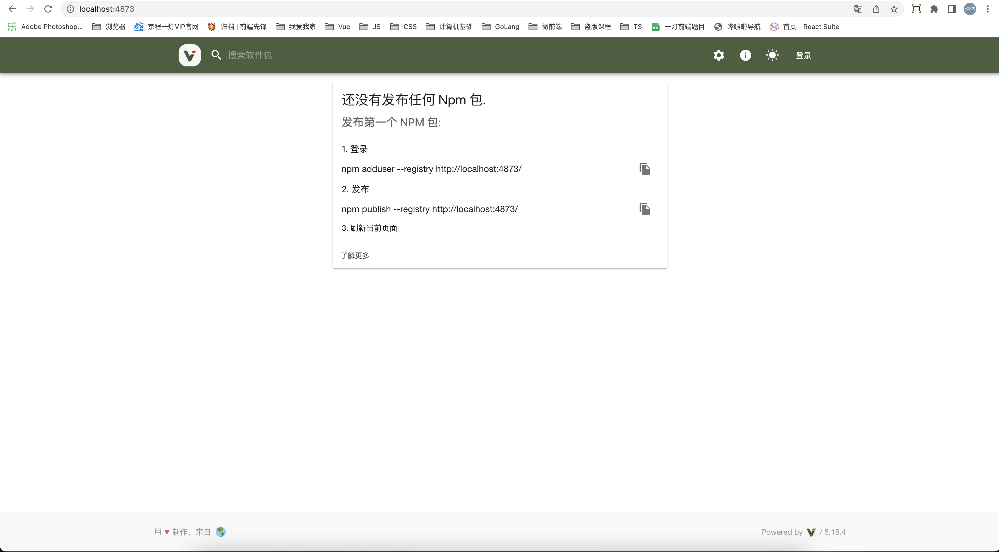
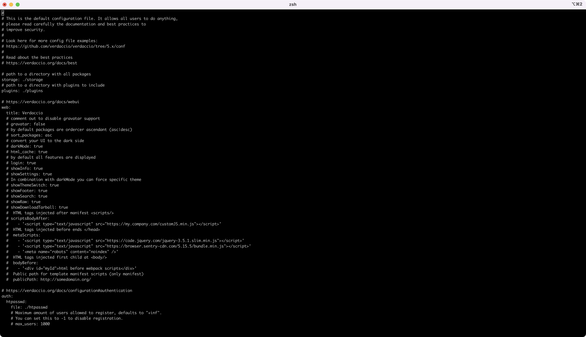
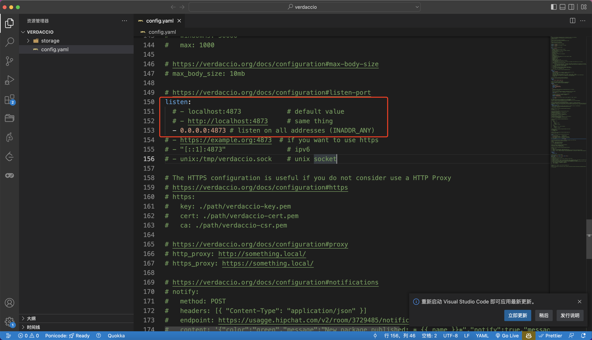
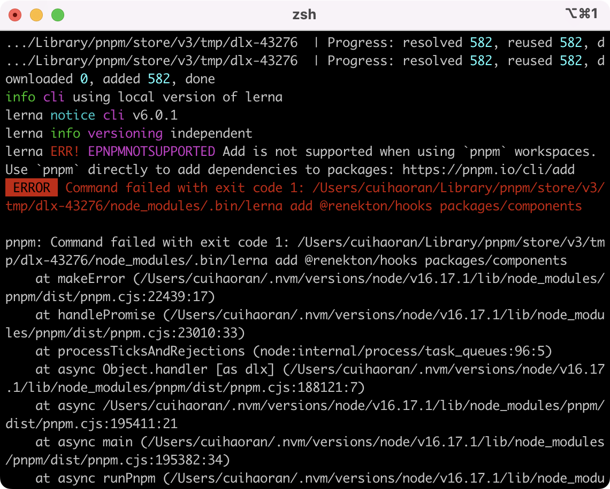
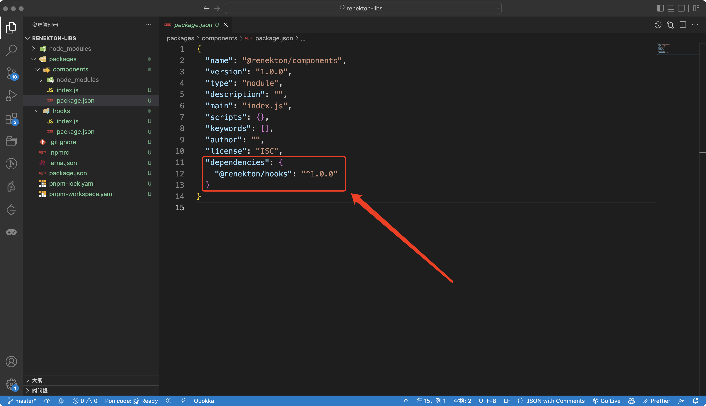
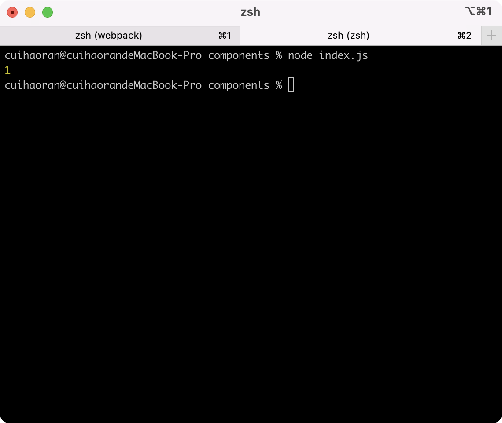
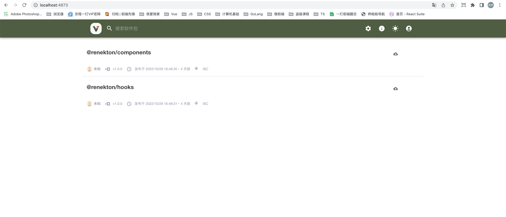

# 私仓（一）

## 零、写在前面

### I、什么是私仓

简单来说私仓就是私有仓库，平时我们在使用`Element Plus`或者`Ant Design`这种npm包时，会通过：

```bash
$ npm install antd
$ npm install element-plus
```

命令行安装，`Element Plus、Ant Design`这种npm包是部署在公网上的，那么如果公司内部的UI组件库或者自研的工具库只是想在公司内部使用，并且也希望通过`npm包`的方式在项目中使用，这时候把包放在公网上显然不合适，那么就要在公司内部建立`npm包的私有仓库`——这就是**`私仓`**。

### II、建立私仓的工具

一般我们建立私仓需要一个工具，这种工具很多，现在推荐一个：**`Verdaccio`**

```bash
## 全局安装Verdaccio
$ npm install --global verdaccio
```

verdaccio是一个建立私仓的工具，私仓实际上就是一个服务，我们可以通过**`PM2`**启动verdaccio服务：

```bash
## pm2启动verdaccio
$ pm2 start verdaccio
```

> PM2启动Verdaccio：
>
> 首先要有PM2环境，关于PM2的介绍，笔者在往期的文章中有详细介绍——BFF架构设计与实现
>
> **npm install pm2 -g**

Verdaccio启动之后，会在本地监听4873端口——http://localhost:4873/



verdaccio的`config文件`路径：**~/.config/verdaccio/config.ymal**



我们会看到有一个listen字段，如果想要私仓服务器让外网下的其他机器访问到需要把listen字段的`locahost:4873`改为`0.0.0.0:4873`。此外如果是部署在阿里云上还要打开相应端口的安全组。



### II、如何使用私仓

当前，我们已经启动了私仓服务器，也看到了私仓的页面。那么我们使用私仓的目的就是为了在公司或者组织内部发私有的`npm包`，怎么发包是我们首先要解决的问题。那么在解决这个问题之前我们必须做两件事：

1. 把npm的源设置成你的私仓地址——这个地址有可能是个网络地址（如果你把你的私仓部署到阿里云或者别的什么云的服务器上），也有可能是一个本地地址（例如本地启动的http://localhost:4873）。
2. 添加私仓用户，设置用户名和密码和邮箱地址。

> **关于npm换源问题：**
>
> 笔者建议使用`nrm`管理npm源，比较简洁方便。
>
> 如果不想使用nrm也可以使用命令行直接切换（具体命令下文会提到）。
>
> 如果以上两种方式都不愿意采纳，那么还有一种方式比较简单，那就是在项目的根目录下加上`.npmrc`文件，在文件中设置源地址。

**关于npm换源和添加用户的命令（命令和使用的包管理工具有关系，笔者提供npm和pnpm两个版本）：**

+ npm

  ```bash
  # 设置本地私仓源
  $ npm set registry http://localhost:4873/
  # 添加用户
  $ npm adduser --registry http://localhost:4873/
  # 设置密码
  $ npm profile set password --registry http://localhost:4873/
  ```

+ pnm

  ```bash
  # 设置本地私仓源
  $ pnpm set registry http://localhost:4873/
  # 添加用户
  $ pnpm adduser --registry http://localhost:4873/
  # 设置密码
  $ pnpm profile set password --registry http://localhost:4873/
  ```

为什么不提供yarn版本呢？原因很简单这些命令在私仓页面的配置中都可以找到，但是yarn的经典版本和Yarn2+的命令不一致，所以这里暂不提供，GOOGLE一下可以找到。

**monorepo + 私仓 笔者建议使用pnpm包管理工具**

**monorepo + 私仓 笔者建议使用pnpm包管理工具**

**monorepo + 私仓 笔者建议使用pnpm包管理工具**

重要的事情说三遍~~~

最后一步，也是最重要的一步——在`http://localhost:4873`上登录刚才设置的用户！并使用

```bash
$ npm whoami
```

进行检查登录用户。

## 一、初始化一个Node项目

我们使用pnpm初始化一个基于`monorepo`设计的项目。

在电脑上磁盘的某一个位置执行以下命令：

```bash
## 新建一个目录——renekton-libs
$ mkdir renekton-libs

## 进入该目录
$ cd renekton-libs

## pnpm初始化项目
$ pnpm init
```

我们可以用VSCode打开这个项目。使用pnpm的workspace去管理monorepo这种形式的项目。那么如果我们想要使用pnpm管理当前的monorepo项目，就需要在根目录下创建`pnpm-workspace.yaml`并编辑它：

```yaml
packages:
  - "packages/*"
```

配置表示的是，pnpm会帮我们管理packges目录下的所有的包，把packages目录下的每个目录当做一个独立的项目，packages下的多个目录对应多个项目，这样的话多个项目就可以放在一个仓库（如git仓库）中管理，简单来说这就是monorepo。

既然要管理packages下的所有项目，那么我们就要在当前的`renekton-libs`下新建`packages`目录。要想更好的管理monorepo项目并且发布npm包，我们还需要一个工具——`Lerna`。

首先我们全局安装Lerna：

```bash
## pnpm安装lerna在项目的最外层
$ pnpm install lerna@5.3.0 -D -w

## lerna初始化项目
$ lerna init
```

我们可以看到这里对于lerna的安装是指定版本的，笔者建议使用V5.X。笔者在写这篇文章的时候Lerna已经是6版本了但是搭配Node 16（写这篇文章的时候，Node18已经是LTS版本了，但笔者还是喜欢使用Node 16）会出现一些报错，回头笔者会仔细研究一下，先把报错信息贴图：



说完了版本问题，下面开始说正事儿。

执行`lerna init`之后，lerna会给项目git初始化，并创建一个lerna.json的文件，我们需要手动编辑一下这个文件：

```json
{
  "$schema": "node_modules/lerna/schemas/lerna-schema.json",
  "useWorkspaces": true,
  "version": "independent",
  "npmClient": "pnpm",
  "publishConfig": {
    "registry": "http://localhost:4873/"
  },
  "packages": ["packages/*"],
  "command": {
    "publish": {
      "ignoreChanges": ["ignored-file", "*.md", "test/**"],
      "message": "chore(release): publish"
    }
  }
}
```

解释一下各个字段的意思：

+ $schema：这个定义了lerna.json的配置项有哪些，编辑器会依靠这个文件给出提示。
+ useWorkspaces：是否使用工作区间，如果配合pnpm、yarn、npm做monorepo，这个一定要置为`true`。npm的工作区间的支持需要`npm 8+`的版本才有。
+ version：手动修改成`"independent"`，这个表示多个monorepo的包之间可以独立发版。
+ npmClient：这个取决于用的是什么npm包管理工具，默认是`npm`，不过这里推荐`pnpm`。
+ publishConfig：设置私仓地址。
+ packages：设置packages，设置成packages下的所有目录，也就是说monorepo的所有项目都在packages目录下面。


## 二、monorepo实战

前面我么讲了两个重要的问题：私仓的启动和配置，lerna初始化Node项目。现在我们要实战一下monorepo。首先，要在packages目录下面创建两个项目：

1. components
2. hooks

并用`pnpm init`初始化一下，并手动更改一下两个项目的package.json

packages/components/package.json

```json
{
  "name": "@renekton/components",
  "version": "1.0.0",
  "description": "",
  "main": "index.js",
  "scripts": {},
  "keywords": [],
  "author": "",
  "license": "ISC",
}
```

packages/hooks/package.json

```json
{
  "name": "@renekton/hooks",
  "version": "1.0.0",
  "description": "",
  "main": "index.js",
  "scripts": {},
  "keywords": [],
  "author": "",
  "license": "ISC"
}
```

然后在这两个项目中各自创建`index.js`.

packages/hooks/index.js

```javascript
const hooks = 1;

export default hooks;
```

packages/components/index.js

```javascript
import hooks from "@renekton/hooks";

console.log(hooks);
```

简单来说就是在hooks中声明一个变量暴露出去，然后在components中去引用。虽然很简单，但是大家都可以看的出来，这个例子足以说明问题。

当然现在我们什么都没做，就这么在components中引用hooks，这执行起来肯定会报错。因为没有任何理由能让components找到hooks。那么为了解决这个问题，我们就用到了lerna，执行下面这条命令：

```bash
$ lerna add @renekton/hooks packages/components
```

这条命令的作用就是把`@renekton/hooks`这个包添加到`packages/components`目录下，作为components的依赖。

> **注意：**
>
> **@renekton/hooks就是`packages/hooks/package.json`中我们手动修改的name字段。**

执行完这条命令之后我们再看`packages/components/package.json`的变化：



我们可以看到，hooks确实作为components的依赖存在了。这里需要注意的是，在components的node——modules中的包都是以软链的形式存在的。

`关于软链、硬链的区别是Linux操作系统的概念这里不做赘述（其实笔者也不是很精通）。`

为了证实确实引用到了hooks，我们需要执行一下components/index

```bash
$ node ./components/index
```

结果当然是报错：node会告诉你你执行的默认不是一个ES Module，但是你却使用了import语句。

解决办法也很简单，我们要修改一下components和hooks的package.json：

```json
{
  ...
  "type": "module"
  "description": "",
  "main": "index.js",
  "scripts": {},
  "keywords": [],
  "author": "",
  "license": "ISC",
}
```

再次执行，结果如下：



完美~~monorepo实战完成。

虽然很简单，但是却很说明问题。当然这只是九牛一毛，接下来我们还会一步步深入。


## 三、发包——publish

千呼万唤始出来，恭喜你坚持到了发包阶段。显然我们需要使用lerna去发包，在上文中我们已经在`lerna.json`中配置了publish的路径。除此之外我们还要配置一下command：

```json
{
  "$schema": "node_modules/lerna/schemas/lerna-schema.json",
  "useWorkspaces": true,
  "version": "independent",
  "npmClient": "pnpm",
  "publishConfig": {
    "registry": "http://localhost:4873/"
  },
  "packages": ["packages/*"],
  "command": {
    "publish": {
      "ignoreChanges": ["ignored-file", "*.md", "test/**"],
      "message": "chore(release): publish"
    }
  }
}
```

+ ignoreChanges：publish的忽略文件
+ message：publish的提示语

配置好之后我们执行下面这条命令，进行发包：

```bash
$ lerna publish from-package
```

Lerna-cli会在此时会检测你packages下的包有多少个，然后询问你是否发包，输入`Y`成功。发布成功之后我们可以看一下`localhost:4873`



可以明确看到，两个包已经被我们发到私仓上去了！

> **注意：**
>
> 我们在执行`lerna publish`之前，最好是先执行一下：
>
> ```bash
> $ npm login
> 
> $ npm whoami
> ```
>
> 这两条命令，来检查一下我们当前的登录状态和登录用户。
>
> pnpm发的包怎么移除？执行以下命令
>
> ```bash
> $ pnpm unpublish packageName
> ```
>
> 

## 四、总结

我们简单的说了一下关于私仓发包的问题，下一篇文章将会结合TS进行私仓的搭建。


