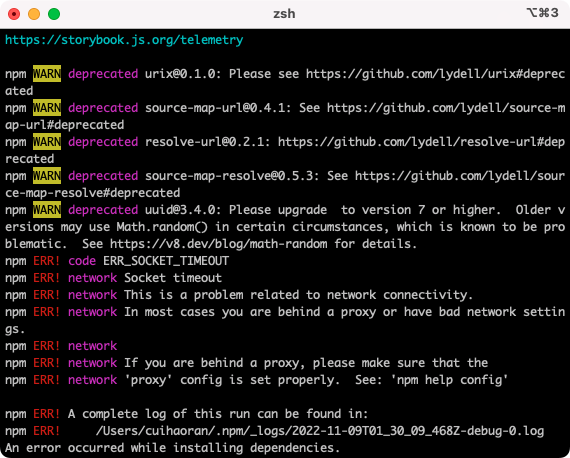
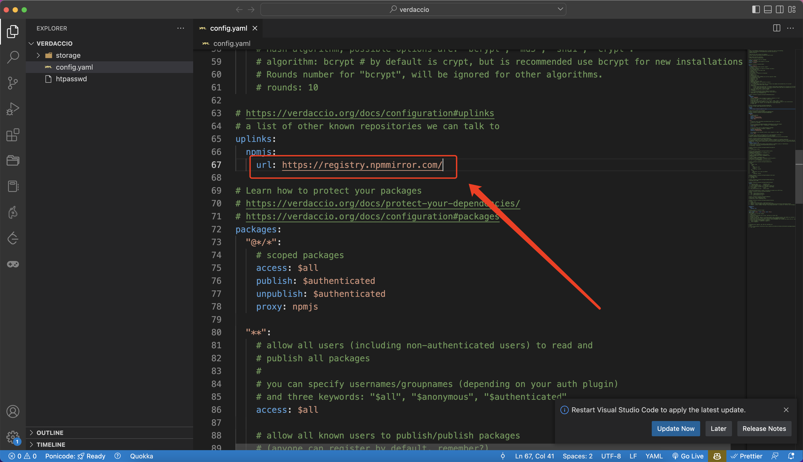
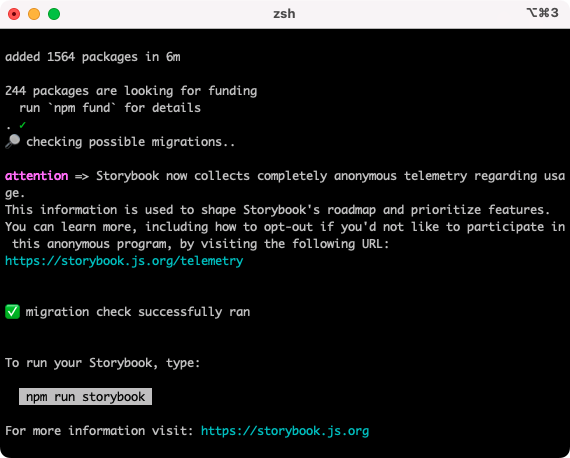
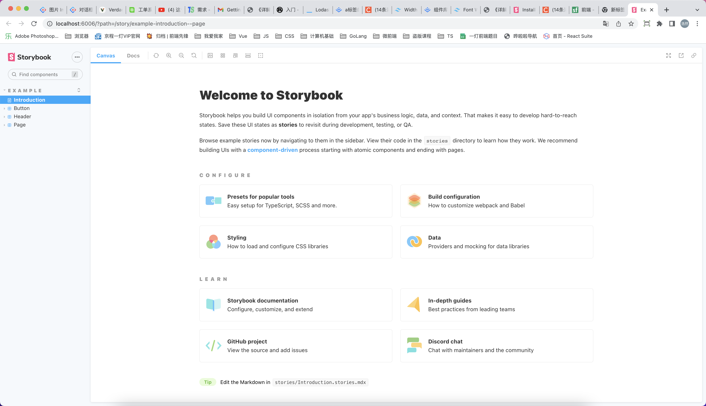

# 私仓（二）

## 零、写在前面

这篇文章主要是讲TS与私仓的结合，以及一些关于私仓的深度应用


## 一、使用TS改造

### I、安装&配置TS

在项目的根目录创建`tsconfig.json`(renekton-libs/tsconfig.json)：

```json
{
  "compilerOptions": {
    "incremental": true,
    "jsx": "react-jsx",
    "target": "es5",
    "lib": ["DOM", "ESNext"],
    "allowJs": true,
    "skipLibCheck": true,
    "esModuleInterop": true,
    "allowSyntheticDefaultImports": true,
    "strict": true,
    "noImplicitAny": true,
    "strictNullChecks": true,
    "noImplicitThis": true,
    "forceConsistentCasingInFileNames": true,
    "noFallthroughCasesInSwitch": true,
    "module": "esnext",
    "noImplicitReturns": true,
    "moduleResolution": "node",
    "resolveJsonModule": true,
    "isolatedModules": true,
    "noEmit": true,
    "rootDir": ".",
    "baseUrl": "src",
    "paths": {}
  },
  "include": ["packages"],
  "exclude": ["node_modules"]
}

```

需要注意的是include要配置成"packages"。

然后需要在项目的根目录的安装TypeScript的开发环境依赖：

```bash
$ pnpm add typescript -D -w
```

这样的话子项目是可以继承，或者说可以读到根目录中的TS配置的。除了TS的配置之外，还有ESLint、babel的配置也是可以被子项目继承的。

### II、TS改造项目

现在packages中的项目都是使用都 JS 开发的，我们要先把 @renekton-components 中依赖的 @renekton/hooks 删掉：

```bash
$ pnpm remove @renekton/hooks --filter @renekton-components
```

然后把 @renekton-hooks 中的`index.js`改成`index.ts`

更改 @renekton-hooks 的`packages.json`:

```json
{
  "name": "@renekton/hooks",
  "version": "1.0.0",
  "description": "",
  "type": "module",
  "main": "index.ts", // main：index.js --> index.ts
  "module": "index.ts",	// module: index.js ---> index.ts
  "scripts": {},
  "keywords": [],
  "author": "",
  "license": "ISC"
}
```

最后执行：

```bash
$ lerna add @renekton-hooks packages@renekton-components
```

把更新后的 @renekton-hooks 加入到 @renekton-components 中。


## 二、安装Storybook

storybook的安装难度是众所周知的，笔者在安装的时候着实是费了好大的劲儿。这里着重说一下安装时可能会遇到的问题以及解决办法：

首先安装storybook的命令如下：

```bash
$ npx storybook init
```

### I、安装问题以及解决方法

**问题一：sh: line 1: sb: command not found**

如果遇到这个问题实际上就是`npx storybook init`不存在，我们可以换成以下命令：

```bash
$ npx sb init
```

**问题二：npm ERR! Cannot read properties of null (reading 'matches')**

如果出现了这个问题大概率是package-lock.json或者npm的缓存导致的，解决方式按照以下步骤依次执行即可：

1. `npm cache clear --force` (执行完成后npm install 没效再执行步骤2)

2. 删了项目文件夹下面的package-lock.json,然后再运行npm install(没效执行步骤3)

3. ```bash
   $ rm -rf node_modules
   $ rm package-lock.json
   $ npm cache clear --force
   $ npm install
   ```

**问题三：socket timeout 网络问题（详细信息见下图）**



如果想解决这个问题就有点复杂

1. 首先有可能是公司的网络有拦截，最好使用自己的`4G`热点。

2. 科学上网（懂得都懂，不多说了）。

3. 升级你的npm版本（这个就很怪异），笔者的版本是`npm 8.x`

4. 把私仓的npm代理源修改成`淘宝源`

   


**问题四：npm ERR! syscall rename**

解决方式直接干掉`node_modules`

**问题五：404、500问题**

1. 先检查是否登录了私仓
2. 更改私仓的npm源
3. 参照问题三的解决方式


### II、安装成功



执行`npm run storybook`启动storybook~~



鼓掌~~

撒花~~


