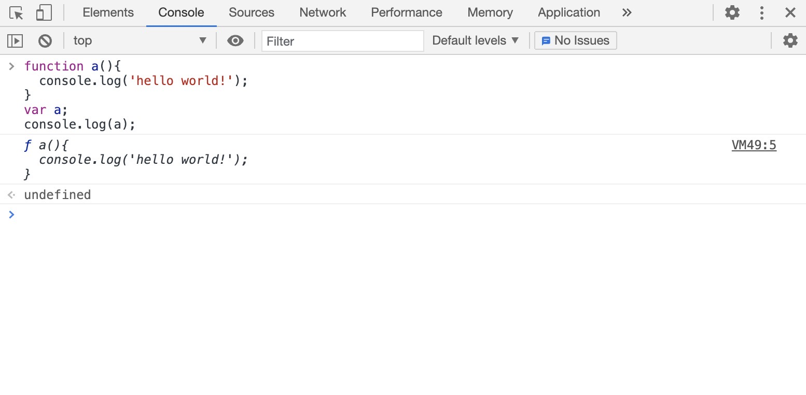
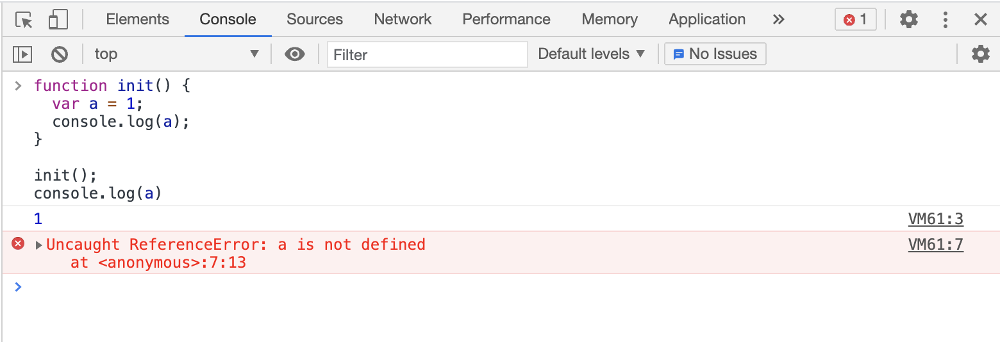
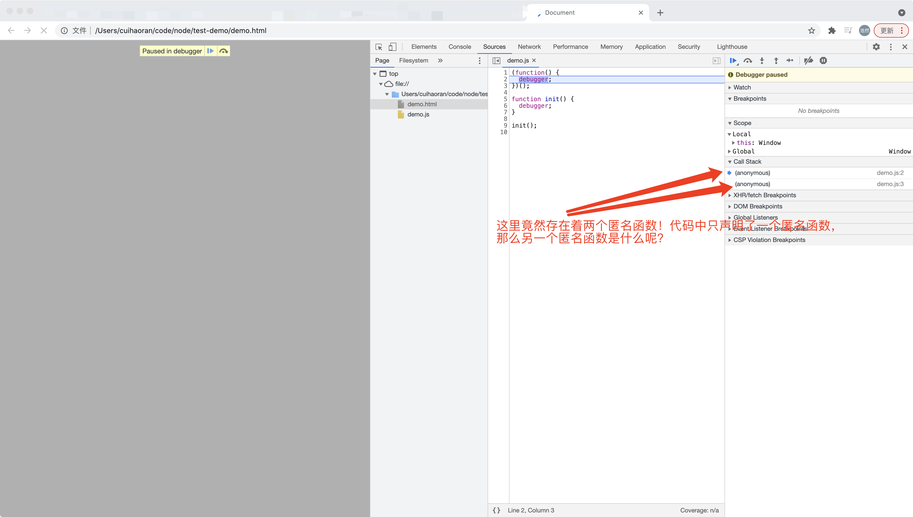
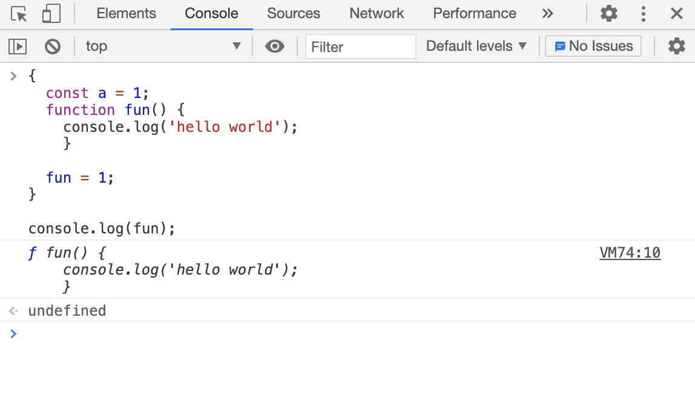
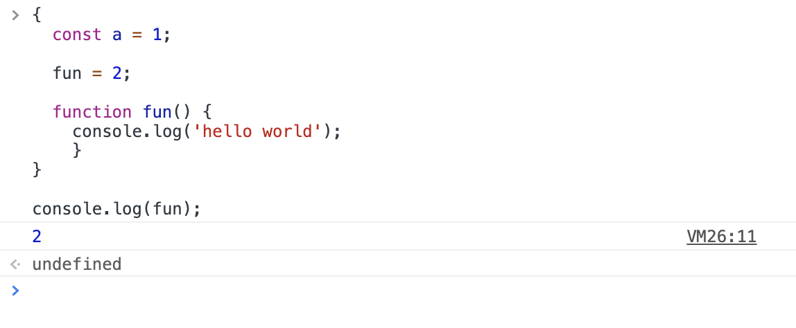
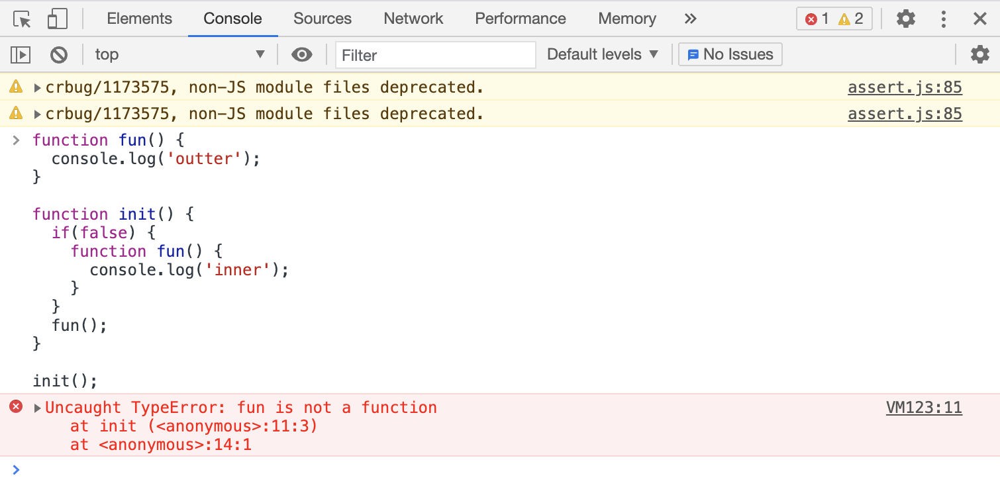

# JavaScript面试题详解

## 零、写在前面

读了这篇文章会让你觉得你并不了解JavaScript，我们一起来看。。。

## 一、高频面试题精讲

### I、变量声明提升类型的题目

#### 1.第一题

```javascript
// 变量声明提升的最初级

console.log(a);
var a = 12;
```

上面的这段代码，我们打印`a`的结果是什么？我想绝大多数前端，只要是会JS的都知道，a的值打印出来肯定是`undefined`，因为在JS中有变量声明提升的概念，上面这段代码的解释顺序如下：

```javascript
// 变量声明提升之后的代码解释，也就是在JS解释器中代码是如下解释的

var a;
console.log(a);	// 这里可以看出，a的值明显是undefined
a = 12;
```

我们再看变量声明提升之后，也就是JS解释器解释之后的代码，很容易得出打印出来的a的值显然就是undefined。综上所述，在JS中变量的声明会提升到所在的作用域的顶部，这里的作用域指的是函数作用域，看到这里有些读者可能会问，为什么是`函数作用域`，关于这个问题我们稍后做说明。

```javascript
// 函数声明提升的最初级

a();
function a() {
  console.log('hello world');
}
```

我们可以看出我们在函数a声明之前执行了函数a，那么JS会报错吗，在C或者Java中这肯定是不行的，控制台一定会报`function a is not defined`，也就是说函数a未定义。但是在JS中与变量声明提升类似的，也存在函数声明提升，只不过函数声明提升，提升的是整个函数的声明，也就是说整个函数都会提升到函数作用域（同上文所说，我们稍后会解释为什么是函数作用域）的顶部。所以在JS解释器中是做如下解释：

```javascript
// 函数声明提升之后的JS解释

function a(){
  console.log('hello world');
}

a();
```

我们思考一个问题，如果是同名的函数a和变量a同时声明提升呢？

```javascript
// 同名的变量和函数同时提升
console.log(a);

var a = 1;
function a() {
  console.log('hello world');
}
```

由上面的代码我们可以发现变量a和函数a同名，那么打印出来的a的值是什么呢？单纯从代码角度我们看不出什么，如果瞎猜的话，至少有三种答案：

+ 报错
+ undefined
+ function a() { console.log('hello world'); }

我们首先排除报错的答案，原因很简单，因为JS有变量声明提升和函数声明提升的概念，所以不可能报错，剩下的那两个答案，就要考虑一个问题，函数声明提升和变量声明提升哪个更靠前？也即是说在声明提升的语法解释上哪种提升优先级更高？答案是函数声明提升的优先级更高！所以在JS解释器中代码的解释结果成如下：

```javascript
// 代码解释如下

function a(){
  console.log('hello world!');
}
var a;
console.log(a);
a = 1;
```

得到了代码的解释结果，我们会发现变量a的声明是会在函数a声明之后的，所以我们得到一个结论，打印出来的a是`undefined`，因为这是按照变量声明提升的规律来得出的，但是事实真的如此吗？

下面我们打开浏览器的控制台来运行下面一段代码：

```javascript
function a(){
  console.log('hello world!');
}
var a;
console.log(a);
```

我们贴出运行的结果：



我们会发现打印出来的竟然是函数a，这可能会超出一些读者的设想，之所以会打印出来函数a，是因为当同名的变量a，在函数a之后声明但是没有复制的情况下，JS解释器会忽略没有值的变量，所以打印出来的是函数a，因为函数a是实实在在有值的。但是当变量a有值的情况下打印的便是变量a的值。

知道了这些恶心的东西，我们就可以玩一玩进阶版本了：

```javascript
// 变量声明提升进阶版

if(false) {
  var a = 2;
}
console.log(a);
```

这个打印a的值，结果为`undefined`还是报错`a is not defined`，其实这个问题的本质是`false`这种逻辑上的假影响到了代码的执行，那么会不会也影响到变量声明提升？我们回顾一下变量声明提升的概念：变量声明提升是指，在JS解释器解释JS代码的时候，会把var声明的变量的声明提升到函数作用域的顶端，那么if表达式属于函数作用域吗？很显然，并不是函数作用域，所以并不会影响变量声明提升！

JS解释器解释之后的代码如下：

```javascript
// 变量声明提升之后

var a;
if(false) {
  a = 2;
}

console.log(a); // undefined
```

在变量声明提升之后，我们会发现，结果很自然的为undefined，而不是报错`a is not defined`。


现在我们来解答一个上文中说道的一个问题：***为什么说变量声明提升和函数声明提升是提升到函数作用域的顶端？***

```javascript
// 变量声明提升和函数声明提升是提升到函数作用域的顶端

function init() {
  var a = 1;
  console.log(a);
}

init();
console.log(a)
```

我们可以确定的是init函数里面的`console.log(a)`的结果肯定是1，那么函数外的`console.log(a)`，打印的结果是什么呢？是`undefined`还是`a is not defined`。这两个结果有本质的不同，`undefined`的含义是a能够访问到，但是值为undefined，`a is not defined`，则是解释器报错，含义是a在作用域中找不到，没有定义！

我们先看一下这段代码在浏览器中的执行结果：



执行结果是JS解释器报错，`a is not degined`，也就是说在当前的作用域中没有找到变量a，所以我们能得出一个结论，变量a提升到了init函数作用域的顶端，而不是全局作用域的顶端。到此这个问题我们解释了一半，另一半是如果没有init函数，只在全局作用域下面，是不是就不是提升到函数作用域的顶端了呢？答案是：`在全局作用域下，变量声明提升和函数声明提升仍然是提升到函数作用域的顶端！`，这时候很多读者应该就会很迷惑，全局作用域下也没有函数啊！答案是：**全局作用域下有函数！**

为了证明全局作用域是有函数的，我们写一个JS文件，把这个JS文件引用到html文件中，看浏览器会怎么处理：

```javascript
// demo.js
(function() {
	debugger;
})();

function init() {
  debugger;
}

init();
```

```html
<!-- demo.html --> 
<!DOCTYPE html>
<html lang="en">
<head>
  <meta charset="UTF-8">
  <meta http-equiv="X-UA-Compatible" content="IE=edge">
  <meta name="viewport" content="width=device-width, initial-scale=1.0">
  <title>Document</title>
</head>
<body>
  <script src="./demo.js"></script>
</body>
</html>
```

下面我们看一下浏览器的调用栈（Call Stack）：



我们在代码中只声明了一个匿名函数，但是在浏览器的调用栈中出现了两个匿名函数（anonymous），另一个匿名函数就是全局的匿名函数，也就是说全局的JS代码在执行的时候都会被包含在一个大的匿名函数里，这个匿名函数就相当于JS的入口函数（关于入口函数的概念可以类比一些Java或者C的main函数的概念）。

JS解释器在对JS代码进行解释的时候，会把所有的JS代码全都塞进一个匿名函数，然后执行这个匿名函数，**所以在全局作用域下，变量声明提升和函数声明提升仍然是提升到函数作用域的顶端！**

说到这里我们需要补充一下块级作用域的知识，现在的JS存在两种作用域，块级作用域和函数级作用域。但是块级作用域适用于ES6。

```javascript
{
  console.log(1);
}
```

上面这段代码是能够正常执行的。

```javascript
{
  var a = 1;
}

console.log(a); // 1
```

上面这段代码，在代码块外面也是能够得到a的。这不是块级作用域，因为a是用var声明的变量！我们把代码改变一下：

```javascript
{
  const a = 1;
}

console.log(a);
```

我们在浏览器中执行这段代码会发现，浏览器会报错`a is not defined`，这说明在全局作用域中根本找不到a，所以这说明在es6的const定义下的变量是存在块级作用域的。这里还有一个特殊的情况就是function，一旦块级作用域遇到function立马就会不一样：

```javascript
{
  const a = 1;
  function fun() {
    console.log('hello world');
	}
}

console.log(fun);
```

打印的结果是fun的函数体，也就是说函数式声明是不受块级作用域影响的，依然会提升到函数级作用域的顶部！下面我们在块内重写这个函数：

```javascript
{
  function fun() {
    console.log('hello world');
	}
  
  fun = 1;
}

console.log(fun);
```

我们在chrome中执行上面的代码，执行结果如下：



函数重写竟然没有生效，迷惑开始了，我们再次修改代码：

```javascript
{  
  fun = 2;
  
  function fun() {
    console.log('hello world');
	}
}

console.log(fun);
```

在chrome中运行结果如下：



神奇的一幕发生了，这次竟然改写成功了，这怎么解释？这实际上是浏览器对于块级作用域的优化，只有在块级作用域中才会这样解释，脱离了块级作用域就不行了。

关于块级作用域，还有一个点就是`TDZ`，也就是暂时性死区。

```javascript
var a;
{
  a = 10;
  let a = 12;
}
```

这段代码在浏览器中执行会报错：`Cannot access 'a' before initialization`，这也就是暂时性死区，let会锁定局部作用域，局部作用域中只能声明一次a，而且不能在声明之前使用，块内的a和块外的a是没有任何关系的！

讲到这里，块级作用域讲的差不多了，和函数级作用域比起来，块级作用域还是比较简单的，真正头痛的是函数级作用域：

```javascript
function fun() {
  console.log('outter');
}

function init() {
  if(false) {
    function fun() {
      console.log('inner');
    }
  }
  fun();
}

init();
```

上面这个函数在chrome浏览器中运行结果：



意想不到的事情发生了，`fun is not a function`，之所以出现这种情况，是因为在chrome中init函数中的fun会发生函数声明提升，但是fun函数的声明被if(false)所包裹，逻辑执行语句执行不到，所以chrome认为不应该把函数的声明全部提升到init函数顶部，只做了变量的声明提升，我们看一下提升之后的结果：

```javascript
function fun() {
  console.log('outter');
}

function init() {
  var fun;
  if(false) {
    function fun() {
      console.log('inner');
    }
  }
  fun();
}

init();
```

从上面的代码可以得到一个结论，在这种情况下chrome只是把fun函数的函数名作为变量提升到init函数作用域的顶端，作为变量，这时fun的值为undefined，不是function，这就解释了浏览器为什么会报错。说到这里，我们已经感受到了一些JS的恶心！

更恶心的是，在chrome浏览器中会报错，但是在别的浏览器中会有 不同的执行结果：

**IE浏览器**

在IE下会把init函数内的fun整个全部都提升到init函数级作用域的顶部，所以在IE下回打印出`inner`。

**FireFox浏览器**

在早期的FF中，由于语句的逻辑走不到if分支中，所以FF认为，不需要提升fun函数的声明，所以，经过作用域链的查找，会找到全局作用域下的fun函数，打印出`outer`，但是在现在的FF中，修正了这一解释方法，优化成了和chrome相同的情况。


说到这里，我们看一个实战的面试题：

```javascript
alert(a);
a();
var a = 3;
function a() {
  alert(10);
}
alert(a);
a = 6;
a();
```

根据上文所述的变量声明提升和函数声明提升，解释后的代码为：

```javascript
// 函数声明提升
function a() {	
  alert(10);
}
// 变量声明提升
var a;
alert(a);
a();
a = 3;
alert(a);
a = 6;
a();
```

函数声明提升的优先级要比变量声明提升的优先级高，所以函数a要在变量a之前，紧接着是alert(a)，此时的a仍然是函数a，因为变量a只是声明，并没有赋值，所以在内存中，指针仍然指向函数a，栈内指针存储的仍然是函数a的堆地址！所以alert(a)，打印出的是函数a的函数体。然后执行a，弹出的是10，随后执行 a  =  3，改写了a的值，现在a的值为3，执行alert(a)，弹出的自然是3，然后执行 a = 6，改写了a的值为6，当前a为Number类型，所以执行a()，浏览器会报错`a is not function`！


到这里，第一题的基本题目已经讲完，难度不大，所以我们还可以加强一下，看一下第一题的进阶题目：

```javascript
```

