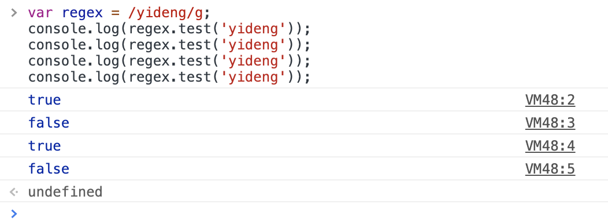

# JavaScript面试题详解

## 零、写在前面

读了这篇文章会让你觉得你并不了解JavaScript，我们一起来看。。。

## 一、高频面试题精讲

### I、变量声明提升类型的题目

#### 1.第一题

```javascript
// 变量声明提升的最初级

console.log(a);
var a = 12;
```

上面的这段代码，我们打印`a`的结果是什么？我想绝大多数前端，只要是会JS的都知道，a的值打印出来肯定是`undefined`，因为在JS中有变量声明提升的概念，上面这段代码的解释顺序如下：

```javascript
// 变量声明提升之后的代码解释，也就是在JS解释器中代码是如下解释的

var a;
console.log(a);	// 这里可以看出，a的值明显是undefined
a = 12;
```

我们再看变量声明提升之后，也就是JS解释器解释之后的代码，很容易得出打印出来的a的值显然就是undefined。综上所述，在JS中变量的声明会提升到所在的作用域的顶部，这里的作用域指的是函数作用域，看到这里有些读者可能会问，为什么是`函数作用域`，关于这个问题我们稍后做说明。

```javascript
// 函数声明提升的最初级

a();
function a() {
  console.log('hello world');
}
```

我们可以看出我们在函数a声明之前执行了函数a，那么JS会报错吗，在C或者Java中这肯定是不行的，控制台一定会报`function a is not defined`，也就是说函数a未定义。但是在JS中与变量声明提升类似的，也存在函数声明提升，只不过函数声明提升，提升的是整个函数的声明，也就是说整个函数都会提升到函数作用域（同上文所说，我们稍后会解释为什么是函数作用域）的顶部。所以在JS解释器中是做如下解释：

```javascript
// 函数声明提升之后的JS解释

function a(){
  console.log('hello world');
}

a();
```

我们思考一个问题，如果是同名的函数a和变量a同时声明提升呢？

```javascript
// 同名的变量和函数同时提升
console.log(a);

var a = 1;
function a() {
  console.log('hello world');
}
```

由上面的代码我们可以发现变量a和函数a同名，那么打印出来的a的值是什么呢？单纯从代码角度我们看不出什么，如果瞎猜的话，至少有三种答案：

+ 报错
+ undefined
+ function a() { console.log('hello world'); }

我们首先排除报错的答案，原因很简单，因为JS有变量声明提升和函数声明提升的概念，所以不可能报错，剩下的那两个答案，就要考虑一个问题，函数声明提升和变量声明提升哪个更靠前？也即是说在声明提升的语法解释上哪种提升优先级更高？答案是函数声明提升的优先级更高！所以在JS解释器中代码的解释结果成如下：

```javascript
// 代码解释如下

function a(){
  console.log('hello world!');
}
var a;
console.log(a);
a = 1;
```

得到了代码的解释结果，我们会发现变量a的声明是会在函数a声明之后的，所以我们得到一个结论，打印出来的a是`undefined`，因为这是按照变量声明提升的规律来得出的，但是事实真的如此吗？

下面我们打开浏览器的控制台来运行下面一段代码：

```javascript
function a(){
  console.log('hello world!');
}
var a;
console.log(a);
```

我们贴出运行的结果：


我们会发现打印出来的竟然是函数a，这可能会超出一些读者的设想，之所以会打印出来函数a，是因为当同名的变量a，在函数a之后声明但是没有复制的情况下，JS解释器会忽略没有值的变量，所以打印出来的是函数a，因为函数a是实实在在有值的。但是当变量a有值的情况下打印的便是变量a的值。

知道了这些恶心的东西，我们就可以玩一玩进阶版本了：

```javascript
// 变量声明提升进阶版

if(false) {
  var a = 2;
}
console.log(a);
```

这个打印a的值，结果为`undefined`还是报错`a is not defined`，其实这个问题的本质是`false`这种逻辑上的假影响到了代码的执行，那么会不会也影响到变量声明提升？我们回顾一下变量声明提升的概念：变量声明提升是指，在JS解释器解释JS代码的时候，会把var声明的变量的声明提升到函数作用域的顶端，那么if表达式属于函数作用域吗？很显然，并不是函数作用域，所以并不会影响变量声明提升！

JS解释器解释之后的代码如下：

```javascript
// 变量声明提升之后

var a;
if(false) {
  a = 2;
}

console.log(a); // undefined
```

在变量声明提升之后，我们会发现，结果很自然的为undefined，而不是报错`a is not defined`。


现在我们来解答一个上文中说道的一个问题：***为什么说变量声明提升和函数声明提升是提升到函数作用域的顶端？***

```javascript
// 变量声明提升和函数声明提升是提升到函数作用域的顶端

function init() {
  var a = 1;
  console.log(a);
}

init();
console.log(a)
```

我们可以确定的是init函数里面的`console.log(a)`的结果肯定是1，那么函数外的`console.log(a)`，打印的结果是什么呢？是`undefined`还是`a is not defined`。这两个结果有本质的不同，`undefined`的含义是a能够访问到，但是值为undefined，`a is not defined`，则是解释器报错，含义是a在作用域中找不到，没有定义！

我们先看一下这段代码在浏览器中的执行结果：


执行结果是JS解释器报错，`a is not degined`，也就是说在当前的作用域中没有找到变量a，所以我们能得出一个结论，变量a提升到了init函数作用域的顶端，而不是全局作用域的顶端。到此这个问题我们解释了一半，另一半是如果没有init函数，只在全局作用域下面，是不是就不是提升到函数作用域的顶端了呢？答案是：`在全局作用域下，变量声明提升和函数声明提升仍然是提升到函数作用域的顶端！`，这时候很多读者应该就会很迷惑，全局作用域下也没有函数啊！答案是：**全局作用域下有函数！**

为了证明全局作用域是有函数的，我们写一个JS文件，把这个JS文件引用到html文件中，看浏览器会怎么处理：

```javascript
// demo.js
(function() {
	debugger;
})();

function init() {
  debugger;
}

init();
```

```html
<!-- demo.html --> 
<!DOCTYPE html>
<html lang="en">
<head>
  <meta charset="UTF-8">
  <meta http-equiv="X-UA-Compatible" content="IE=edge">
  <meta name="viewport" content="width=device-width, initial-scale=1.0">
  <title>Document</title>
</head>
<body>
  <script src="./demo.js"></script>
</body>
</html>
```

下面我们看一下浏览器的调用栈（Call Stack）：


我们在代码中只声明了一个匿名函数，但是在浏览器的调用栈中出现了两个匿名函数（anonymous），另一个匿名函数就是全局的匿名函数，也就是说全局的JS代码在执行的时候都会被包含在一个大的匿名函数里，这个匿名函数就相当于JS的入口函数（关于入口函数的概念可以类比一些Java或者C的main函数的概念）。

JS解释器在对JS代码进行解释的时候，会把所有的JS代码全都塞进一个匿名函数，然后执行这个匿名函数，**所以在全局作用域下，变量声明提升和函数声明提升仍然是提升到函数作用域的顶端！**

说到这里我们需要补充一下块级作用域的知识，现在的JS存在两种作用域，块级作用域和函数级作用域。但是块级作用域适用于ES6。

```javascript
{
  console.log(1);
}
```

上面这段代码是能够正常执行的。

```javascript
{
  var a = 1;
}

console.log(a); // 1
```

上面这段代码，在代码块外面也是能够得到a的。这不是块级作用域，因为a是用var声明的变量！我们把代码改变一下：

```javascript
{
  const a = 1;
}

console.log(a);
```

我们在浏览器中执行这段代码会发现，浏览器会报错`a is not defined`，这说明在全局作用域中根本找不到a，所以这说明在es6的const定义下的变量是存在块级作用域的。这里还有一个特殊的情况就是function，一旦块级作用域遇到function立马就会不一样：

```javascript
{
  const a = 1;
  function fun() {
    console.log('hello world');
	}
}

console.log(fun);
```

打印的结果是fun的函数体，也就是说函数式声明是不受块级作用域影响的，依然会提升到函数级作用域的顶部！下面我们在块内重写这个函数：

```javascript
{
  function fun() {
    console.log('hello world');
	}
  
  fun = 1;
}

console.log(fun);
```

我们在chrome中执行上面的代码，执行结果如下：


函数重写竟然没有生效，迷惑开始了，我们再次修改代码：

```javascript
{  
  fun = 2;
  
  function fun() {
    console.log('hello world');
	}
}

console.log(fun);
```

在chrome中运行结果如下：


神奇的一幕发生了，这次竟然改写成功了，这怎么解释？这实际上是浏览器对于块级作用域的优化，只有在块级作用域中才会这样解释，脱离了块级作用域就不行了。

关于块级作用域，还有一个点就是`TDZ`，也就是暂时性死区。

```javascript
var a;
{
  a = 10;
  let a = 12;
}
```

这段代码在浏览器中执行会报错：`Cannot access 'a' before initialization`，这也就是暂时性死区，let会锁定局部作用域，局部作用域中只能声明一次a，而且不能在声明之前使用，块内的a和块外的a是没有任何关系的！

讲到这里，块级作用域讲的差不多了，和函数级作用域比起来，块级作用域还是比较简单的，真正头痛的是函数级作用域：

```javascript
function fun() {
  console.log('outter');
}

function init() {
  if(false) {
    function fun() {
      console.log('inner');
    }
  }
  fun();
}

init();
```

上面这个函数在chrome浏览器中运行结果：


意想不到的事情发生了，`fun is not a function`，之所以出现这种情况，是因为在chrome中init函数中的fun会发生函数声明提升，但是fun函数的声明被if(false)所包裹，逻辑执行语句执行不到，所以chrome认为不应该把函数的声明全部提升到init函数顶部，只做了变量的声明提升，我们看一下提升之后的结果：

```javascript
function fun() {
  console.log('outter');
}

function init() {
  var fun;
  if(false) {
    function fun() {
      console.log('inner');
    }
  }
  fun();
}

init();
```

从上面的代码可以得到一个结论，在这种情况下chrome只是把fun函数的函数名作为变量提升到init函数作用域的顶端，作为变量，这时fun的值为undefined，不是function，这就解释了浏览器为什么会报错。说到这里，我们已经感受到了一些JS的恶心！

更恶心的是，在chrome浏览器中会报错，但是在别的浏览器中会有 不同的执行结果：

**IE浏览器**

在IE下会把init函数内的fun整个全部都提升到init函数级作用域的顶部，所以在IE下回打印出`inner`。

**FireFox浏览器**

在早期的FF中，由于语句的逻辑走不到if分支中，所以FF认为，不需要提升fun函数的声明，所以，经过作用域链的查找，会找到全局作用域下的fun函数，打印出`outer`，但是在现在的FF中，修正了这一解释方法，优化成了和chrome相同的情况。


说到这里，我们看一个实战的面试题：

```javascript
alert(a);
a();
var a = 3;
function a() {
  alert(10);
}
alert(a);
a = 6;
a();
```

根据上文所述的变量声明提升和函数声明提升，解释后的代码为：

```javascript
// 函数声明提升
function a() {	
  alert(10);
}
// 变量声明提升
var a;
alert(a);
a();
a = 3;
alert(a);
a = 6;
a();
```

函数声明提升的优先级要比变量声明提升的优先级高，所以函数a要在变量a之前，紧接着是alert(a)，此时的a仍然是函数a，因为变量a只是声明，并没有赋值，所以在内存中，指针仍然指向函数a，栈内指针存储的仍然是函数a的堆地址！所以alert(a)，打印出的是函数a的函数体。然后执行a，弹出的是10，随后执行 a  =  3，改写了a的值，现在a的值为3，执行alert(a)，弹出的自然是3，然后执行 a = 6，改写了a的值为6，当前a为Number类型，所以执行a()，浏览器会报错`a is not function`！


```javascript
console.log(a);
var a = 0;
console.log(a);
if(true) {
  console.log(a);
  a = 1;
  function a() {};
  console.log(a);
  a = 21;
  console.log('after 21', a);
}

console.log('end', a);
/*
undefined
0
function a() {}
1
after 21 21
end 1
*/ 
```

这道题主要考察了条件函数声明的声明提升：

1. if里的函数声明首先会定义一个全局的同名变量 `a = undefined `
2. if里的函数声明会提升到if块的顶部
3. 执行到函数声明语句时，会把if块里的a赋值到全局同名变量a，注意这里说的`if块里的a的值是执行到函数声明语句时a的值，if块内函数声明之后a的赋值则不会被赋值到全局。` 
4. 不同浏览器之间实现不同！**`（实在太恶心）`**。


到这里，第一题的基本题目已经讲完，难度不大，所以我们还可以加强一下，看一下第一题的进阶题目：

```javascript
var x = 1,
    y = 0,
    z = 0;
function add(x) {
  return (x = x + 1);
}
y = add(x);
console.log(y);
function add(x) {
  return (x = x + 3);
}
z = add(x);
console.log(z);
```

首先解释一下`(x = x + 1)`，这个就是对x求值然后返回x的值，相当于`++x`。然后就是这段代码中存在两个add函数，我们可以知道的是，JS的函数声明提升会使得add函数重写，所以解释之后的JS代码如下：

```javascript
function add(x) {
  return (x = x + 3);
}
var x,y,z;
x = 1,
y = 0,
z = 0;

y = add(x);
console.log(y);

z = add(x);
console.log(z);
```


#### 2.第二题

```javascript
// this指向的乞丐版

this.a = 20;
var test = {
  init: function() {
    console.log(this.a);
  }
}

test.init();
```

test.init()，这里init函数中的this指向是test对象，但是test对象中没有a属性，所以打印this.a的是值为undefined。

我们改变一下上面的代码：

```javascript
this.a = 20;
var test = {
  a: 40,
  init: function() {
    console.log(this.a);
  }
}

test.init();
```

修改后的代码，在test对象中加了一个a属性，init函数中的this仍然指向test对象，test对象中a属性的值为40，所以打印的this.a的值就是40。继续修改代码：

```javascript
this.a = 20;
var test = {
  a: 40,
  init: function() {
    console.log(this.a);
  }
}

test.init();

var fn = test.init;
fn();
```

修改后的代码声明了一个fn赋值为test.init()，然后再全局作用域下执行fn()，这里直接指向fn相当于`window.fn()`，所以函数fn中的this指向的是window，this.a则是20，打印的结果即为20。

继续修改代码：

```javascript
this.a = 20;
var test = {
  a: 40,
  init: function() {
    function init() {
      console.log(this.a);
    }
    
    init();
  }
}

test.init();

var fn = test.init;
fn();
```

test.init()，函数内部执行init子函数，子函数没有被挂载到任何对象上，所以就等价于`window.init()`，那么init子函数中的this就指向了window，window.a为20，fn被赋值为test.init()，直接执行fn，相当于执行`window.fn()`，fn函数中的this指向了window，所以init函数中的this.a仍然为window.a，仍然是20，综上所述，两次打印的结果都为20。

**上述代码，只在非严格模式下可以这样执行，如果加上严格模式，this的指向就不会指向window，而是指向undefined。**

关于this指向还有一种更为特殊的情况，也就是存在构造函数的时候，new操作符会使this改变：

```javascript
function go() {
  this.a = 30;
}

go.a = 50;
go.prototype.a = 40;
var instance = new go();

console.log('instance.a --->', instance.a);
```

我们知道，new操作符的作用就是可以改变构造函数内this的指向的，使得this指向构造出来的对象，然后给对象添加属性并赋值。这里也就是指向instance对象，然后instance对象上有一个属性a，值为30，所以打印的结果就是30。

我们来修改一下代码：

```javascript
function go() {
  
}

go.a = 50;
go.prototype.a = 40;
var instance = new go();

console.log('instance.a --->', instance.a);
```

可以看到，构造函数go里面什么都没做，所以说我们new go()，只有了一个作用那就是改变了this的指向，仍然指向instance。我们输出instance.a，但是instance对象上是没有a的，**JS解释器这时候就会去构造函数的原型上去找而不是去构造函数上去找**，go.prototype.a = 40，所以打印的结果就是40。至于构造函数上的属性，它相当于ES6中类的static属性，只有go.a的时候才会访问到。

下面我们看一个面试真题：

```javascript
// this指向性问题的面试真题

this.a = 20;
function go() {
  console.log(this.a);
  this.a = 30;
}
go.prototype.a = 40;
var test = {
  a: 50,
  init: function(fn) {
    fn();
    console.log(this.a);
    return fn;
  }
};
console.log(new go().a);
test.init(go);
var p = test.init(go);
p();
```

首先，我们先看一下`console.log(new go().a);`，先执行了new go()，构造函数go中打印了this.a，现在this的指向受到new操作符的影响，指向的是实例化出来的对象，但是还没有执行this.a = 30; 所以实例化出来的对象上并不存在a属性，那么JS解释器就会去构造函数的原型上去找属性a，构造函数上的属性a为40，所以构造函数go中打印的this.a的值就是40。然后就是new go()实例化对象完成，this指向实例化出来的对象，并且对象上存在了属性a，值为30，那么console.log(new go().a);的打印结果为30。

接下来，执行的是`test.init(go);`所以我们来看test对象上的init方法，init方法接收一个参数fn，这个参数的类型是一个function，执行fn()，当前的fn没有任何对象调用，所以相当于`window.fn()`，穿进去的fn实际上是函数go，函数go中执行`console.log(this.a);`，这里的this毫无疑问指向的是window，全局作用域下this.a = 20; 所以打印的结果为20，打印之后将window.a改为30。init方法中执行的console.log(this.a); 毫无疑问的是init方法中的this现在指向的是test，即访问的是test.a的值，test.a为50，所以打印的结果为50。最后，init方法返回fn。

然后执行`var p = test.init(go);`，又是重复了刚才的运行逻辑，不同的是返回的fn被p接收。先执行window.fn()，this.a的值为30，打印结果为30，init方法中，`console.log(this.a);` 毫无疑问是50。p为init的返回值fn函数。

最后执行p函数，当前的this指向的window，window.a当前是30。所以打印结果为30。


**总结一下可以改变this指向的操作**

+ new操作符
+ bind、call、apply
+ 箭头函数


```javascript
this.a = 20;

var test = {
  a: 40,
  init() {
    console.log(this.a);
  }
}

test.init();
```

上面的代码，打印的结果是40，`init() { ... }`，这种写法只是对象的简便写法，实质上和对象的写法是一样的！

我们继续修改代码：

```javascript
this.a = 20;

var test = {
  a: 40,
  init: () => {
    console.log(this.a);
  }
}

test.init();
```

现在这种情况是把test的init方法改写成箭头函数，箭头函数是能够改变this指向的，箭头函数中的this指向的是init方法的父对象（test对象）所在的作用域，test对象所在的作用域是全局作用域，所以init方法中打印的this.a等同于window.a。结果为20。

继续修改：

```javascript
this.a = 20;

var test = {
  a: 40,
  init: () => {
    setTimeout(function() {
      console.log(this.a);
    });
  }
}

test.init();
```

我们在init方法中，设置定时器，在定时器的函数中打印this.a。因为定时器中的方法没有任何对象去执行它，所以定时器函数中的this指向的是window，this.a为20。

继续修改：

```javascript
this.a = 20;

var test = {
  a: 40,
  init: function() {
    setTimeout(function() {
      console.log(this.a);
    });
  }
}

test.init();
```

在chrome中运行上面的代码，你会发现打印的是20，这也印证了上面的解释，无论init是普通函数还是箭头函数，也就是说无论init方法中的this指向什么，一旦有了定时器的存在，那么定时器中的this就一定指向window，因为定时器中的函数没有任何的对象去执行它，在它内部的this就只能指向window！

**到此为止，我们所有的this指向问题都是在非严格模式下讨论的，但是我们知道JS还有一个严格模式，在严格模式下类似于指向window的做些操作可能就会有一部分发生变化**

```javascript
// 严格模式下的this指向
var num = 1;
function fun() {
  'use strict'
  console.log(this.num++);
}

fun();
```

在chrome浏览器中的执行结果：


在严格模式下，浏览器是不会让this指向window的，this为undefined！因为浏览器会考虑到this指向全局，会把全局变量污染了。

我们修改一下代码：

```javascript
// 严格模式下的this指向
var num = 1;
function fun() {
  console.log(++this.num);
}
(function() {
  'use strict';
  fun();
})();
```


这段代码的执行表明，this又是指向了window。原因就是严格模式的声明只有在相应的函数内部才会有作用。在函数外，对于函数内部的执行并不会起到严格模式的作用。

怎样才能让所有的代码都在严格模式下执行呢？那就要把 'use strict' 加到全局。

再看一个关于this指向的面试题：

```javascript
function C1(name) {
  if(name) {
    this.name = name;
  }
}

function C2(name) {
  this.name = name;
}

function C3(name) {
  this.name = name || 'fe';
}

C1.prototype.name = 'yideng';
C2.prototype.name = 'lao';
C3.prototype.name = 'yuan';

console.log(new C1().name + new C2().name + new C3().name);
```

我们可以看到实例化这三个构造函数时，这三个构造函数都没有传值，也就是说name属性值为undefined。new操作符会改变this的指向，使得this指向实例化出来的对象，new C1().name，C1实例化后的对象上是没有name的属性的，JS解释器会查询构造函数的原型上有没有name属性，找到了C1原型上的name属性为"yideng"，同理，new C2()，实例化后的对象上存在name属性，但是属性值为undefined。new C3()得到的对象上的name属性值为“fe”，所以最后的结果为 “yidengundefinedfe”。

我们看一下chrome浏览器中的执行结果：


与我们分析的一致。

再看一道经典的题目：

```html
<!DOCTYPE html>
<html lang="en">
<head>
  <meta charset="UTF-8">
  <meta http-equiv="X-UA-Compatible" content="IE=edge">
  <meta name="viewport" content="width=device-width, initial-scale=1.0">
  <title>Document</title>
</head>
<body>
  <ul>
    <li>1</li>
    <li>2</li>
    <li>3</li>
    <li>4</li>
    <li>5</li>
    <li>6</li>
  </ul>

  <script>
    // 改写下面这段代码，使得点击每个li元素的时候打印li元素中相应的数字（至少使用三种方法实现）。
    var list_li = document.getElementsByTagName('li');
    for(var i = 0; i < list_li.length; i++) {
      list_li[i].onclick = function() {
        console.log(i);
      }
    }
  </script>
</body>
</html>
```

上面这段代码如果执行点击事件所有的输出都是6，先解释一下为什么，因为ES5是没有块级作用域的，在for执行完之后`i`的值就变成了6，你代码逻辑中所有的`i`，其实都是同一个`i`，这时候所有的`i`，就都变成了6。那么这只是从块级作用域上来讲，更深层次的是JS有同步执行的任务和异步执行的任务，同步任务就是一般的逻辑代码，异步任务里面包括定时器、ajax、promis、dom事件等。JS会先执行完同步任务再执行异步任务。对于这段代码出现所有的点击事件都打印6的根本原因是JS会把for循环先执行完，然后在执行dom事件的注册。这时候 i 已经是6了。

那么怎么才能不让所有的`i`都变成6呢？解决这个问题的方向有以下两种：

+ 实现局部作用域
+ 利用this指向

**解法一：利用es6的let关键字使得for循环成为块级作用域**

```html
<!DOCTYPE html>
<html lang="en">
<head>
  <meta charset="UTF-8">
  <meta http-equiv="X-UA-Compatible" content="IE=edge">
  <meta name="viewport" content="width=device-width, initial-scale=1.0">
  <title>Document</title>
</head>
<body>
  <ul>
    <li>1</li>
    <li>2</li>
    <li>3</li>
    <li>4</li>
    <li>5</li>
    <li>6</li>
  </ul>

  <script>
    // let实现。
    var list_li = document.getElementsByTagName('li');
    // 修改
    for(let i = 0; i < list_li.length; i++) {
      list_li[i].onclick = function() {
        // 修改
        console.log(i + 1);
      }
    }
  </script>
</body>
</html>
```

上面的代码修改了两处，一个是把`var`改成了`let`，这个修改是为了形成块级作用域。另一个是把点击事件的处理函数中打印的内容改成`i + 1`，i是从0开始，所以要加1才能成为li元素中的值。

**解法二：使用闭包来实现块级作用域**

```html
<!DOCTYPE html>
<html lang="en">
<head>
  <meta charset="UTF-8">
  <meta http-equiv="X-UA-Compatible" content="IE=edge">
  <meta name="viewport" content="width=device-width, initial-scale=1.0">
  <title>Document</title>
</head>
<body>
  <ul>
    <li>1</li>
    <li>2</li>
    <li>3</li>
    <li>4</li>
    <li>5</li>
    <li>6</li>
  </ul>

  <script>
    // 闭包实现。
    var list_li = document.getElementsByTagName('li');
    for(var i = 0; i < list_li.length; i++) {
      list_li[i].onclick = (function(i) {
        return function() {
          console.log(i + 1);
        }
      })(i)
    }
  </script>
</body>
</html>
```

使用闭包构建一个块级作用域，使得内层函数的i不会收外部作用域的影响。这也是es6的块级作用域出现之前最常用的方式！

**解法三：使用this**

```html
<!DOCTYPE html>
<html lang="en">
<head>
  <meta charset="UTF-8">
  <meta http-equiv="X-UA-Compatible" content="IE=edge">
  <meta name="viewport" content="width=device-width, initial-scale=1.0">
  <title>Document</title>
</head>
<body>
  <ul>
    <li>1</li>
    <li>2</li>
    <li>3</li>
    <li>4</li>
    <li>5</li>
    <li>6</li>
  </ul>

  <script>
    // 闭包实现。
    var list_li = document.getElementsByTagName('li');
    for(var i = 0; i < list_li.length; i++) {
      list_li[i].onclick = function() {
        console.log(this.inner);
      }
    }
  </script>
</body>
</html>
```

通过观察html代码，我们可以看到，只要是得到各自li元素中的数字就可以解决这个问题，所以我们可以可用this，this指向的正好是当前点击事件操作的dom元素，然后打印this.innerText。

#### 3.第三题

JS有两种引用方式：

+ 按值引用：所有的基本类型、函数的实参都是按值引用。
+ 按址引用：原型链、复杂类型都是按址引用。

```javascript
// 按值引用
var a = 1;
var b = a;
b = 3;
console.log(a, b);
```

在chrome中运行a是1，b是3。证明了基本类型都是按值引用。

```javascript
// 按址引用
var a = {};
var b = a;
b.uname = '测试一下';

console.log(a, b);
```

在chrome中的运行结果a，b两个对象都是`{ uname: '测试一下' }`，本质就是，变量a的栈内存中只能存储值类型，遇到`var a = {}`这种情况，a的栈内存中存储的并不是`{}` 对象，像`{}`这样的对象属于复杂类型，存储在堆内，a的栈内存中本质上只存储了`{}`对象的**堆地址**。所以，`var b = a;`的执行结果就是把a里存储的`{}`堆地址赋值给b，那么现在就造成了a和b的栈内存中都存储了对象`{}`的堆地址，也就是说a，b这两个变量都指向了同一个对象，所以当b增加一个属性时，实际上就是操作`{}`新增了一个uname属性，属性值为`测试一下`，也就是解释了打印a和b，为什么都是`{ uname: '测试一下' }`。

```javascript
function test(m) {
  m = { v: 5 };
}

var m = { k: 30 };
test(m);
alert(m.v);
```

函数的参数是按值传递的，传进去的是m对象的地址，但是在函数中断开了和外部m对象的连接，重新赋值了一个新对象，这个新对象在函数执行之后就会被销毁，外面的m还是 `{ k: 30 }`，不会有任何变化，所以`m.v`是undefined。

更改一下代码：

```javascript
function test(m) {
  m.v = 5;
}

var m = { k: 30 };
test(m);
alert(m.v);
```

这段代码在chrome中运行你会得到5，这是因为test函数中并没有断掉与外部m对象的联系，形参m是外部m对象的堆地址，并没有重新赋值一个新的对象，所以会得到5。

再看一个面试题：

```javascript
function fun() {
  console.log(1);
}

(function() {
  if(false) {
    function fun() {
      console.log(2);
    }
  }
  fun();
})();
```

这个问题其实本质上和上文中的题是相同的，本质上都是函数声明提升的问题，函数声明提升会提升到自身所在的函数作用域的顶端！如果函数的定义在`if(false) { ... }`代码块中，结果是要看运行在什么浏览器中，这个原理我们在上文中已经详细讲解，这里不再赘述。

#### 第四题

```javascript
// 请用一句话算出0-100之间学生的等级，90-100为一等生，80-90为2等生。

10 - 98 / 10
```

既然题目要求是一句话解决这个问题，那么首先应该排除的是`switch`和`if else`。那么这个题锻炼的是我们解决问题的能力，不能思维定式，其实就是一道数学题而已。**平时在写代码的时候需要想一想和数学之间的关系。**

#### 第五题

```javascript
// 如何把'abc'转成数组，禁止使用split()方法和for

var a = "abc";
// 方法一
[...a];
// 方法二
[...new Set(a)];
// 方法三
Array.from();
// 方法四  借用方法
Array.prototype.slice.call(a);
```

这个题主要是第四种解法比较有意思，借用Array原型上的slice方法，改变this，然后就可以把参数变成一个数组。这种方式在很多plofy中很常见，大家可以去网上查一下，很多老代码都是这么处理的！

#### 第六题

```javascript
// JS面向对象的静态属性的继承

class Car {
  static price = 4;
}

class BMW extends Car {
  // 这里什么也不做
}

console.log(BMW.price);
```

我们看一下在chrome中的执行结果：


竟然会得到4，这简直是不可思议。对于稍微有一点计算机基础或者是任何一个学过面向对象变成语言的读者来说，这都是不可理解的。因为我们知道除了JS之外，其他的绝大多数面向对象语言，类的静态方法都是不能被继承的！JS竟然可以继承父类的静态属性。这又是JavaScript恶心的一个地方。

那么如果让我们手写继承，应该怎么写呢？看个面试题

```javascript
/*
请在下面写出JavaScript面向对象编程的混合式继承。并写出ES6版本的继承。 要求:汽车是父类，Cruze是子类。父类有颜色、价格属性，有售卖的方法。Cruze子 类实现父类颜色是红色，价格是140000,售卖方法实现输出如下语句:将 红色的 Cruze买给了小王价格是14万。(20分)
*/

"use strict"
function Car(color) {
  this.car = car;
}
Car.myName = 'Renekton';
Car.prototype.x = function() {
  console.log('父类方法');
};

function BMW(color) {
  // 继承父类属性
  Car.call(this, color);
}

// 修正constructor的指向
BMW.prototype = Object.create(Car.prototype, {
  constructor: {
    value: BMW,
    writeable: false,
  }
});

// 继承静态属性
var staticKeys = Object.entries(Car);
for(var i = 0; i < staticKeys.length; i++) {
  var key = staticKeys[i][0];
  var value = staticKeys[i][1];
  BMW.key = value;
}
```

这是全网最正确的混合继承的写法。特别是修正constroctor指向和继承静态属性。这个没什么可说的。。。

#### 第七题

```javascript
var regex = /yideng/g;
console.log(regex.test('yideng'));
console.log(regex.test('yideng'));
console.log(regex.test('yideng'));
console.log(regex.test('yideng'));
```

我们来看一下这段代码在chrome中的运行结果：



这道题实际上是考察了正则匹配的lastIndex的概念。

`lastIndex` 是正则表达式的一个可读可写的整型属性，用来指定下一次匹配的起始索引。只有正则表达式使用了表示全局检索的 "`g`" 标志时，该属性才会起作用。此时应用下面的规则：

- 如果 `lastIndex` 大于字符串的长度，则 `regexp.test` 和 `regexp.exec` 将会匹配失败，然后 `lastIndex` 被设置为 0。
- 如果 `lastIndex` 等于字符串的长度，且该正则表达式匹配空字符串，则该正则表达式匹配从 `lastIndex` 开始的字符串。（then the regular expression matches input starting at `lastIndex`.）
- 如果 `lastIndex` 等于字符串的长度，且该正则表达式不匹配空字符串 ，则该正则表达式不匹配字符串，`lastIndex` 被设置为 0.。
- 否则，`lastIndex` 被设置为紧随最近一次成功匹配的下一个位置。

了解了正则的lastIndex的概念，还有一个重要的概念就是正则的克隆，分为深克隆和浅克隆。区别就在于对于lastIndex的处理：

```javascript
function cloneReg(target, isDeep) {
  var regFlag = /\w*$/;
  var result = new target.constructor(target.source, regFlag.exec(target));
  if(isDeep) {
    result.last = 0;
  }else {
    result.last = target.lastIndex;
  }
}
```

#### 第八题

```javascript
// 克隆buffer

function cloneBuffer(buffer, isDeep) {
  if(!isDeep) {
    return buffer.slice();
  } else {
    const length = buffer.length;
    result = allocUnsafe? allocUnsafe(length): new buffer.constructor(length);
    return result;
  }
}
const buf = Buffer.from("Renekton");
const buf2 = cloneBuffer(buf);
```

如果不知道什么是buffer需要补一下这部分知识！buffer的深克隆的概念可以对比对象的深克隆。 笔者认为这个很好理解，故这里不做赘述。