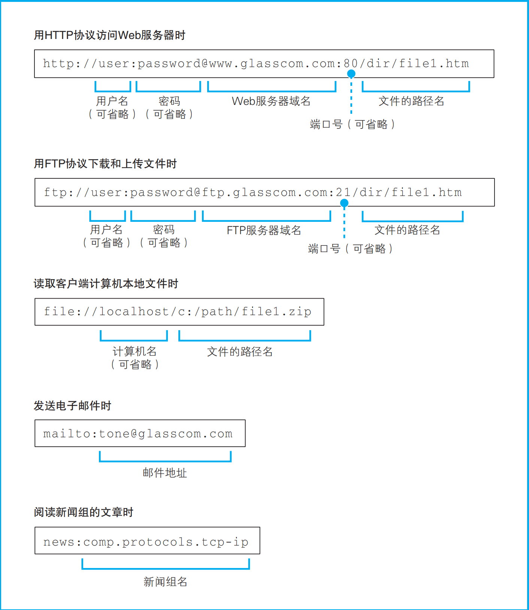
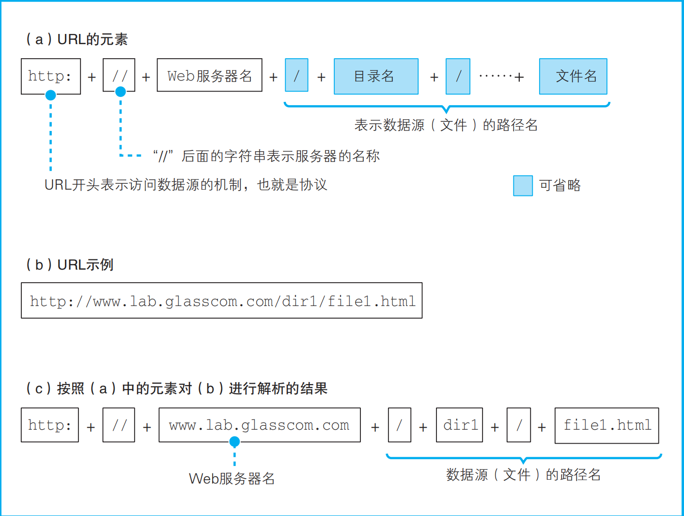

# 一、浏览器是怎么发出请求的

## 零、写在前面

从输入URL到页面展现出来这个过程中，其实蕴含了一个简单的模型——请求-响应模型。这个模型对应了两个端——客户端和服务端。

在Web开发中客户端负责发送请求接收响应这个工作一般是浏览器来做，服务端是被动的接收请求，并做出响应发送到客户端，所谓的服务器就是网络中的一台计算机，和一般的计算机所不同的是这台计算机上运行着服务程序。

请求响应就构成了这两端的通信，这个通信过程就需要网络的参与。所以要想弄清楚前端的基础回答好前面的面试题，我们就需要弄清楚网络是怎么连接的。

网络连接的第一个要点就是**浏览器是怎么发送请求的？**这就是本篇文章的重点内容。

本篇文章重点：

+ 浏览器生成请求消息
+ 发送DNS查询请求查询服务器的IP地址
+ DNS查询的详细过程
+ 浏览器委托协议栈发送消息

## 一、浏览器生成请求消息

浏览器要想发送请求则需要先对输入的URL进行解析处理，生成请求消息。一般地，URL都是http://www.xxxx.com这种样式，但实际上URL的种类有很多——如下图所示：

我们可以看到，浏览器不止可以访问HTTP服务器，也可以访问FTP服务器和邮件服务器等。虽然URL的种类很多，但是URL的组成部分基本一致，以HTTP服务器的URL为例：

http://www.xxx.com:80/simple/simple.html

+ http——访问方法（协议类型）。
+ www.xxx.com——Web服务器的域名。
+ 80——端口号，默认是80，可以省略。
+ /simple/simple.html——文件的路径名。

浏览器会把URL按照上面这几个关键的要素进行解析，具体的解析过程如下图所示：

上图是一种完全的路径的URL，但是我们在日常的开发中很容易遇到省略文件名的URL：

**www.baidu.com/simple/**

这种URL的含义是访问服务器程序中simple目录下的默认文件——一般服务器程序会设置好目录下的默认文件比如index文件或者default文件。

http://www.lab.glasscom.com/

这种URL表示的是要访问的是服务器程序根目录下的默认文件

http://www.lab.glasscom.com

这种URL表示要访问的是服务器程序的根目录下的默认文件。

http://www.lab.glasscom.com/whatisthis

这种URL最奇怪，如果根目录下存在whatisthis文件就访问whatisthis文件，如果存在whatisthis目录就访问该目录下的默认文件。

> 注：不会存在同为whatisthis的目录和文件。

URL的路径除了可以指向一个具体的存在于服务器上的文件，更多的时候是指向了一段计算机程序，服务器在接收到请求之后会根据URL的数据源路径去执行这段程序，并把返回值作为响应的消息体返回给客户端（这里一般指代的是浏览器）。

根据以上浏览器对于URL的解析结果，浏览器知道了服务器的域名、端口号、数据源的路径（URI）。知道了这些就可以生成请求消息。HTTP的请求消息是有严格的格式的：

+ 第一部分就是请求行，包括请求方法（一般为GET或者POST）、URI、协议和协议版本号
+ 第二部分是头信息又叫做消息头，有若干个请求头字段，这些头字段的作用是用于表示请求的附加信息。请求头一般延续到空行之前。
+ 第三部分是分割消息头和消息体的空行。
+ 第四部分是消息体，消息体是客户端向服务端发送的数据，只有在请求方法是POST的时候才有，GET方法一般不存在消息体。

这四部分就是HTTP请求消息的全部。

> 注：关于头字段的种类可以深入了解HTTP协议的头字段。这里不做解释。

既然有请求消息也会有响应消息，响应消息也有严格的格式：

+ 第一部分是状态行，包括协议及版本号、状态码、响应短语。状态码和相应短语代表的意义相同不同的是状态码是返回给程序使用的，响应短语则是给人看的。
+ 第二部分是响应的头信息，和请求的头信息一样也有若干个头字段，作用是表示响应的附加信息。
+ 第三部分是一个空行
+ 第四部分是响应体。是服务器返回给客户端的结果。

## 二、发送DNS查询请求查询服务器的IP地址