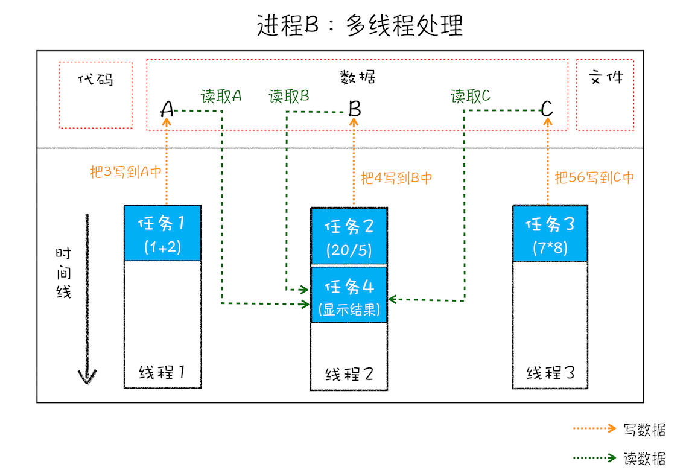
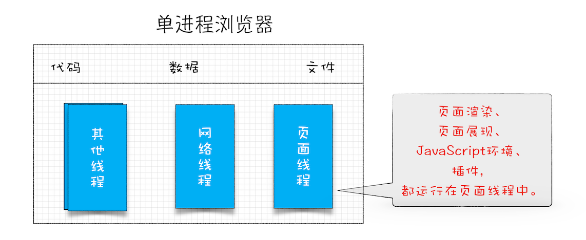
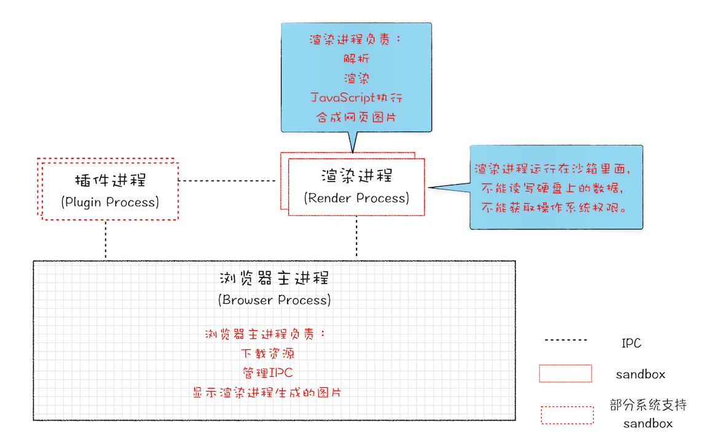
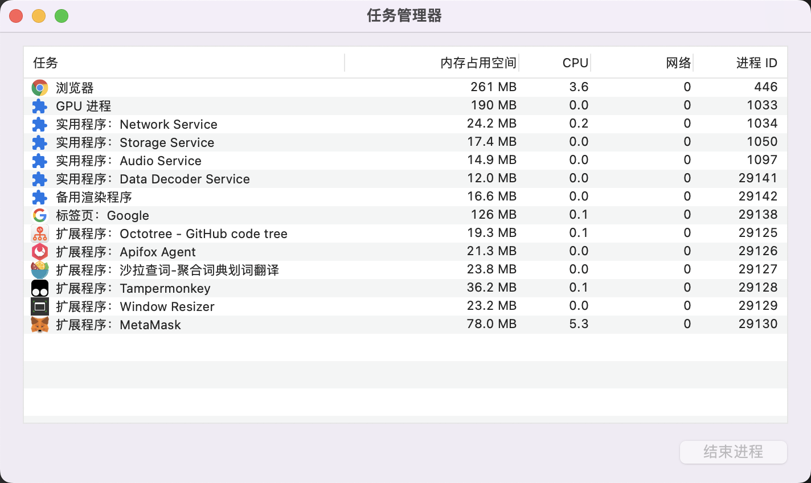
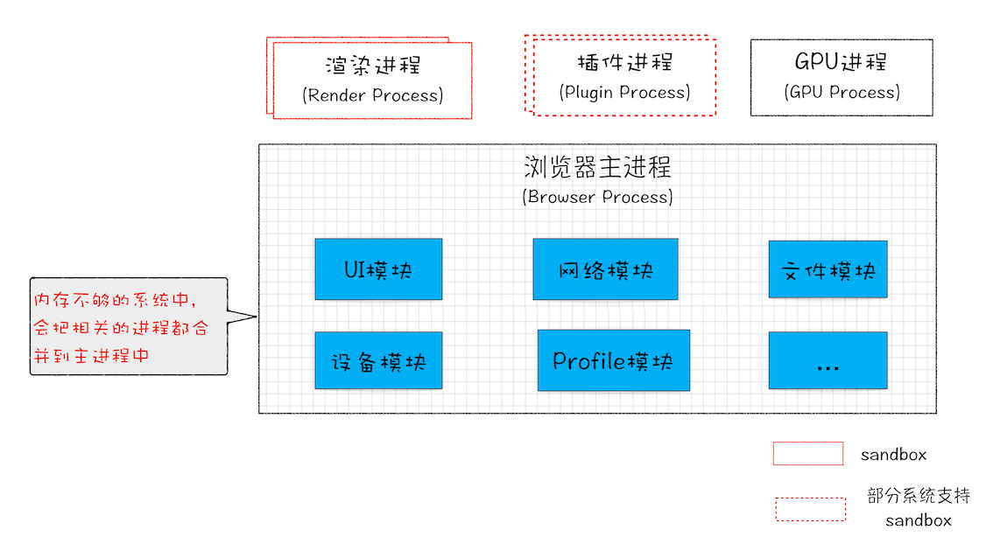

# 二、现代浏览器——单进程到面向服务架构的升级

## 零、写在前面

作为一个九五年出生的前端程序员，在小时候上网的时候用的还是Windows XP系统。上网的浏览器用的是IE7，那时候我记得打开多个页面的时候任务栏会有很多页面的标签。一个页面对应一个IE浏览器窗口。

如果其中的一个页面崩溃，那么其他的浏览器窗口也会崩溃。打开的视频网站、4399小游戏网站就都不在了，如果想玩游戏看视频就需要重头开始。

上述的这种情况就是上一代浏览器的典型特点——**`不稳定`**。

而且在打开非常多网页的时候，浏览器就会不流畅，出现卡顿甚至卡死的现象。这就是上一代浏览器的另一个典型特点——**`不流畅`**。

在多年前我们上网的时候，很容易被莫名其妙的网站上的病毒攻击电脑。这是上一代浏览器另一个典型特点——**`不安全`**。

出现上述不稳定、不流畅、不安全这三个问题的根本原因是因为当时的浏览器都是`单进程浏览器`。

那么什么事单进程浏览器，以及为什么会出现这些问题，最后怎么解决这些问题？

下面的文章会详细地解答.....


## 一、进程和线程

上文说到出现上述问题的根本原因是当时的浏览器全都是单进程浏览器，要想理解什么事单进程浏览器就要先弄明白什么是`进程`？什么是`线程`？

在了解进程和线程的概念之前，我们需要先了解什么是`并行处理`？

### I、并行处理

**在计算机中同一时刻处理多个任务就是并行处理。**

举个例子：计算下面表达式的值，并显示结果

```javascript
let a = 1 + 2;
let b = 20 / 5;
let c = 7 * 8;
```

在编写程序的时候我们可以把这个过程拆分为四个任务：

1. 计算 A = 1 + 2
2. 计算 B = 20 / 5
3. 计算 C= 7 * 8
4. 显示计算结果

如果是`单线程`来处理这四个任务，毫无疑问需要`四步`，从 1 到 4 顺序执行就好。如果是`多线程`那么只需要`两步`就可以处理完。

+ 第一步：使用三个线程分别处理前三个任务。
+ 第二步：使用一个线程处理显示任务。

因此，我们可以粗略的得到一个结论：**使用并行处理可以大幅度的提升程序的执行效率，从而提升性能**。

> **使用并行处理可以大幅度的提升程序的执行效率，从而提升性能。这个结论其实还需要一个前置的条件：**
>
> 运算是计算密集的，你的前提应该是多核吧，如果是单核就算多线程也没有办法加速运算。单核的处理器甚至会拖慢多线程的执行速度，因为增加了切片时间。
>
> 具体什么情况需要看一下计算机操作系统原理。这里不做赘述。


### II、进程和线程

多线程可以并行处理任务，但是**线程并不能单独存在，线程是由进程来启动和管理的**。所谓的**进程就是一个程序的运行实例**。两者具体的概念如下：

进程是对运行时程序的封装，是**操作系统进行资源调度和分配的的基本单位，实现了操作系统的并发**；

线程是进程的子任务，**是CPU调度和分派的基本单位**，**用于保证程序的实时性，实现进程内部的并发；线程是操作系统可识别的最小执行和调度单位**。每个线程都独自占用一个**虚拟处理器**、独自的**寄存器组**，**指令计数器和处理器状态**。每个线程完成不同的任务，但是**共享同一地址空间**（也就是同样的**动态内存，映射文件，目标代码等等**），**打开的文件队列和其他内核资源**。

启动一个程序的时候，操作系统会为这个程序开辟一块内存用来存放代码和数据，还会创建一个主线程来执行程序，这样一个运行环境就叫进程。所以说线程是依附于进程存在的，而进程可以创建多个线程来并行执行程序，从而提高执行效率，提升性能。

我们可以画出并行执行的示意图来理解进程和线程的关系，以及多线程的优势。


### III、进程和线程之间的关系

**1. 进程中只要有任何一个线程崩溃，整个进程随之崩溃。**

举个例子，如果把上面的那个程序其中的`B = 20 / 5` 修改成 `B = 20 / 0`，那么整个程序就会崩溃。

**2. 多个线程之间可以共享进程的内存，实现数据共享。**

线程可以对进程中的**`公共数据(注意这里说的是公共数据)`**进行读写操作。我们用一张图来解释一下这句话：



如图所示，线程1、线程2、线程3分别把任务1、任务2、任务3的执行结果写入了位于进程的数据A、B、C中。线程2则读取了内存中A、B、C的值，用来显示结果。

**3. 当进程关闭后，操作系统会回收掉这个进程所占用的所有内存。**

当一个进程退出后，操作系统会回收掉这个进程申请的所有资源，包括由于某个线程操作不当所造成的内存泄漏的情况，当进程退出后，内存泄漏所占用的内存也都会被全部回收。

比如之前的之前IE浏览器支持很多插件，这些插件就极容易产生内存泄漏问题，那么当浏览器关闭的时候会回收浏览器所有的内存。

这也解释了文章开头单进程浏览器不流畅的问题，随着页面越开越多，单进程浏览器内存占用的内存就会越来越多，所有的页面都全部存在于一个进程中，这时候一旦内存不够用，那么会导致所有的页面卡顿，甚至所有的页面卡死。但是当我们关闭浏览器，再重新打开的时候这个问题就会得到解决，那是因为操作系统回收了浏览器进程所占用的内存。

**4. 进程之间的数据是相互隔离的。**

操作系统这么做是为了保护进程，不至于进程A去更改进程B的数据。这样的话一旦进程A崩溃不至于影响到其他的进程。如果进程之间需要数据通讯，那么就要使用IPC（inter-process communication）——进程间通讯机制了。

能够实现IPC的方式有很多：

+ 消息队列
+ Socket
+ 管道
+ 共享内存：内核开辟一块数据缓冲区域，将进程a的数据copy到缓冲区，b进程再将数据从缓冲区读取。


## 二、单进程浏览器所带来的问题

**`所谓的单进程浏览器就是浏览器的所有功能模块都运行在一个进程里。`**通常浏览器会最少包含以下几个功能模块：网络、插件、渲染引擎、JS引擎、页面等。这么多功能模块都运行在一个进程中，这是导致单进程浏览器`不稳定`、`不流畅`、`不安全`的根本原因。

单进程浏览器架构如下图所示：



下面我们逐一分析出现这三个问题的详细原因。

### I、不稳定

早期的浏览器需要借助插件才能实现视频、音频的播放、Web游戏等强大的功能。但是插件是最容易出现问题的，一旦插件模块崩溃，整个浏览器进程随之崩溃。

另外，渲染引擎模块也是极其不稳定的，一旦JS代码由于编写不当出现内存泄漏问题，那么也会导致整个渲染引擎崩溃，整个进程也就随之崩溃了——浏览器也就崩溃了。

### II、不流畅

从单进程浏览器的架构图中可以看到页面渲染引擎、页面展现、JS引擎、插件都在一个线程中。这就说明一个问题：`在同一时刻只有一个模块可以运行`。

例如我们在单线程浏览器中执行下面这段脚本：

```js
for(;;) {
	console.log('renekton');
}
```

这个程序是一个死循环，运行这段程序会占用整个线程，使得其他的模块无法执行，这样的话就会导致整个浏览器不能做出任何相应，所有的页面就会卡顿。

除了无限循环的脚本能够使单进程浏览器变卡顿之外，`页面中代码的内存泄漏`也可以使得浏览器的内存占用越来越高，从而浏览器会变得越来越慢。浏览器的内核比较复杂，有时关闭一个页面的时候内存会不能完全被回收，所以打开的页面越多这种情况就会越多，这也是导致单进程浏览器越来越慢的原因。

### III、不安全

这个问题依然可以从插件和脚本两个方面来说。以前的浏览器，比如IE，是支持插件功能的，但是这些插件是C和C++编写的，可以通过浏览器对操作系统进行操作，从而完全控制你的电脑。如果插件里面存在恶意程序，那么就会盗取你的重要信息，或者对计算机进行破坏，引发安全问题。

再说脚本，一般来说JS脚本都是从网络上下载下来然后执行的，如果这些JS脚本中存在恶意程序，也可以通过浏览器的`漏洞`来获取系统权限，从而攻击你的计算机，引发安全问题。


以上就是单进程浏览器的特点，以及产生的原因。


## 三、多进程浏览器

现代浏览器都是多进程浏览器，已经解决了单进程浏览器不稳定、不流畅、不安全的缺点。下面我们具体分析一下是如何解决的。

### 多进程浏览器的架构

2008年Chrome的进程架构图：



从图中可以看出插件和渲染功能已经独立出来，成了进程。渲染进程还不止一个。这说明页面是运行在单独的渲染进程之中，多个页面对应了多个渲染进程。插件进城独自运行在插件进程中，各个进程之间通过IPC进行通信。而且还多了一个浏览器主进程负责管理各进程IPC通信以及下载和显示渲染进程生成的图片。

**1. 如何解决不稳定的问题？**

早期浏览器不稳定的问题主要是因为插件和渲染模块不稳定，导致崩溃之后整个浏览器进程随之崩溃。多进程架构下渲染引擎运行在单独的进程中，一个页面对应一个渲染进程。一个插件对应一个插件进程。由于进程之间是相互隔离的，所以就算某个插件或者渲染引擎崩溃影响的也只是对应的页面或者tab页。对于其他的页面并不会产生影响。

> **`这里说的一个页面对应一个渲染进程是不准确的，因为我们在多进程浏览器下也会遇到一个页面崩溃之后，导致多个页面随之崩溃的场景。原因如下：`**
>
> 通常情况下是一个页面使用一个进程，但是，有一种情况，叫"同一站点(same-site)"，具体地讲，我们将“同一站点”定义为一级域名（例如，geekbang.org）加上协议（例如，https:// 或者http://），还包含了该一级域名下的所有子域名和不同的端口，比如下面这三个： 
>
> https://time.geekbang.org 
>
> https://www.geekbang.org 
>
> https://www.geekbang.org:8080 
>
> 都是属于同一站点，因为它们的协议都是https，而根域名也都是geekbang.org。你也许了解同源策略，但是同一站点和同源策略还是存在一些不同地方，在这里你需要了解它们不是同一件事就行了。 Chrome的默认策略是，每个标签对应一个渲染进程。但是如果从一个页面打开了新页面，而新页面和当前页面属于同一站点时，那么新页面会复用父页面的渲染进程。官方把这个默认策略叫process-per-site-instance。 直白的讲，就是如果几个页面符合同一站点，那么他们将被分配到一个渲染进程里面去。 所以，这种情况下，一个页面崩溃了，会导致同一站点的页面同时崩溃，因为他们使用了同一个渲染进程。 
>
> **`为什么要让他们跑在一个进程里面呢？`** 
>
> 因为在一个渲染进程里面，他们就会共享JS的执行环境，也就是说A页面可以直接在B页面中执行脚本。因为是同一家的站点，所以是有这个需求的。

> **读到这里，或许有些同学会有疑问，在单进程浏览器中多个页面的渲染都跑在同一个线程中，那么为什么不能一个页面渲染新开一个线程呢？这样不是更合理吗？**
>
> 对于这个问题的回答我们从IE6开始讲起，IE6时代，浏览器是单进程的，所有页面也都是运行在一个主线程中的，当时IE6就是这样设计，而且此时的IE6是单标签，也就是说一个页面一个窗口。 这时候，国内有很多国产浏览器，都是基于IE6来二次开发的，而IE6原生架构就是所有页面跑在单线程里面的，意味着，所有的页面都共享着同一套JavaScript运行环境，同样，对于存储Cookie也都是在一个线程里面操作的。而且这些国产浏览器由于需要，都采用多标签的形式，所以其中的一个标签页面的卡顿都会影响到整个浏览器。基于卡顿的原因，国内浏览器就开始尝试支持页面多线程，也就是让部分页面运行在单独的线程之中，页面运行在单独的线程之中意味着每个线程拥有单独的JavaScript执行环境，和Cookie环境。
>
> 这时候问题就来了： 比如A站点页面登陆一个网站，保存了一些Cookie数据到磁盘上，再在当前线程环境中保存部分Session数据，由于Session是不需要保存到硬盘上的，所以Session只会保存在当前的线程环境中。这时候再打开另外一个A站点的页面，假设这个页面在另外一个线程中里面，那么它首先读取硬盘上的Cookie信息，但是，由于Session信息是保存在另外一个线程里面的，无法直接读取，这样就要实现一个Session同步的问题，由于IE并没有源代码，所以实现起来非常困难，国内浏览器花了好长一段时间才解决这个问题的。
>
> Session问题解决了，但是假死的问题依然有，因为进程内使用了一个窗口，这个窗口是依附到浏览器主窗口之上的，所以他们共用一套`消息循环机制`，消息循环我们后面会详细地讲，这也就意味这一个窗口如果卡死了。也会导致整个浏览器的卡死。 国产浏览器又出了一招，就是把页面做成一个单独的弹窗，如果这个页面卡死了，就把这个弹窗给隐藏掉。 
>
> **这里还要提一下为什么Chrome中的一个页面假死不会影响到主窗口呢？**
>
>  这是因为chrome输出的实际上图片，然后浏览器端把图片贴到自己的窗口上去，在Chrome的渲染进程内，并没有一个渲染窗口，输出的只是图片，如果卡住了，顶多图片不更新了。 
>
> 国产浏览器这一套技术花了四五年时间，等这套技术差不多成熟时，Chrome发布了。

**2. 如何解决不流畅的问题？**

JS引擎是运行在渲染进程中的，所以就算执行无限循环的脚本，影响的也只是当前的渲染进程。和其他的渲染进程无关。没有响应的也只是当前页面和其他页面以及整个浏览器无关。**`（但是通过测试 并不是这样）`**其他页面也会出现卡顿，整个浏览器也会出现卡顿。至于原因还在探究。。。。。TODO。。。。

至于内存泄漏问题就很好解决了，关闭发生内存泄漏的页面，渲染进程随之关闭，操作系统会回收这个渲染进程申请的所有资源。这也就解决了内存泄漏的问题。

**3. 如何解决安全问题？**

出现安全问题主要是插件和脚本中有恶意程序，通过直接控制操作系统或者利用浏览器的漏洞获取操作系统权限，对计算机做一些恶意的事情。那么采用多线程的一个额外的好处是可以使用`安全沙箱`。线程在沙箱中运行，不能在硬盘上写入数据，也不能在敏感的区域做任何事情。这样就算是渲染进程或者插件中有恶意程序，也只能在安全沙箱里面执行，也不会对操作系统有任何影响，恶意不可能突破沙箱去获得系统权限。


## 四、当前的面向服务架构浏览器架构

当前的浏览器已经差不多完成了从多进程架构到面向服务架构的转变。当我们打开一个网页时，我们来观察一下浏览器的进程管理器：



通过任务管理器中的进程我们可以看到下面几个进程：

+ **浏览器进程**：主要负责界面显示、用户交互、子进程管理，同时提供存储等功能。
+ **GPU进程**：其实，Chrome 刚开始发布的时候是没有 GPU 进程的。而 GPU 的使用初衷是为了实现 3D CSS 的效果，只是随后网页、Chrome 的 UI 界面都选择采用 GPU 来绘制，这使得 GPU 成为浏览器普遍的需求。最后，Chrome 在其多进程架构上也引入了 GPU 进程。
+ **Network Service进程**：主要负责页面的网络资源加载，之前是作为一个模块运行在浏览器进程里面的。之后独立成一个单独进程，作为浏览器的一个基础服务。
+ **Storage Service进程**：主要负责浏览器的本地存储，控制文件访问。已经独立成了一个基础服务。
+ **Audio Service进程**：主要音频播放服务。是Chrome的基础服务。
+ **Data Decoder Service进程**：主要负责数据解析。是Chrome的基础服务。
+ **备用渲染进程**：
+ **Google标签页渲染进程（可以有多个）**：核心任务是将 HTML、CSS 和 JavaScript 转换为用户可以与之交互的网页，排版引擎 Blink 和 JavaScript 引擎 V8 都是运行在该进程中，默认情况下，Chrome 会为每个 Tab 标签创建一个渲染进程。出于安全考虑，渲染进程都是运行在沙箱模式下。
+ **插件进程（可以有多个）**：主要是负责插件的运行，因插件易崩溃，所以需要通过插件进程来隔离，以保证插件进程崩溃不会对浏览器和页面造成影响。
+ **Video Service 进程**：主要负责视频的播放，是Chrome的基础服务。

这么多的线程保证了现代Chrome浏览器的稳定与流畅，随之而来的问题也是明显的：

+ 更高的资源占用。因为每个进程都会包含公共基础结构的副本（如 JavaScript 运行环境），这就意味着浏览器会消耗更多的内存资源。

每个服务都运行在单独的进程中，形成了一种高内聚、低耦合的，易于维护和扩展的架构。

Chrome 最终要把 UI、数据库、文件、设备、网络等模块重构为基础服务，类似操作系统底层服务，下面是 Chrome“面向服务的架构”的进程模型图：


同时 Chrome 还提供灵活的弹性架构，在强大性能设备上会以多进程的方式运行基础服务，但是如果在资源受限的设备上（如下图），Chrome 会将很多服务整合到一个进程中，从而节省内存占用。



## 五、总结

以上就是浏览器从单进程架构到多进程架构最后形成面向服务架构的演变。从单进程到多进程的转变是为了解决浏览器不稳定、不流畅、不安全等问题。但是多进程架构复杂，并不利于扩展，耦合紧密。所以向面向服务架构转变，现代浏览器的面向服务架构实现了高内聚、低耦合，易于扩展。


