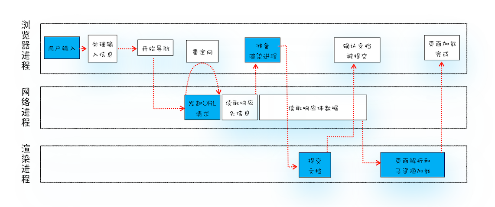

# 三、导航流程：从输入URL到展示页面浏览器做了什么？


## 零、写在前面

`从输入URL到页面展示，这个过程经历了什么？`这是一个极其经典的面试题。对于前端来说这道题考察了前端开发者对于`浏览器`、`网络`、`操作系统`、`性能优化`等前端涉及到的方方面面的问题。这个问题可以用来考察一个Web前端开发人员的总和素质。

那么这篇文章，笔者将试着从浏览器这个实体出发，来探究这个过程。本文会有意识的弱化关于HTTP、TCP、IP、网卡、集线器、路由器、交换机、子网、接入网、网络运营商、CDN、服务端局域网等这些晦涩难懂的网络通信的专业知识。主要是探究在这个过程中浏览器做了些什么。


## 一、从各进程的相互配合讲起

从输入URL到显示页面这个过程需要浏览器各线程之间的紧密配合。对与一个普通的页面——`没有复杂的、高级的功能的页面，比如百度主页`来说，这个过程需要`浏览器进程`、`网络进程`、`渲染进程`、可能还需要`GPU进程`和`备用渲染进程`。

**从用户发出 URL 请求到页面开始解析的这个过程，就叫做导航。**

这里为了概念完整，我们先交代一下浏览器进程、网络进程、渲染进程的主要工作：

+ 浏览器进程主要负责用户交互、子进程管理、文件存储以及管理进程间通信等功能。
+ 网络进程是向浏览器进程和渲染进程等提供网络服务——比如下载等功能。
+ 渲染进程的主要职责是把从网络下载的 HTML、JavaScript、CSS、图片等资源解析为可以显示和交互的页面。因为渲染进程所有的内容都是通过网络获取的，会存在一些恶意代码利用浏览器漏洞对系统进行攻击，所以运行在渲染进程里面的代码是不被信任的。这也是为什么 Chrome 会让渲染进程运行在安全沙箱里，就是为了保证系统的安全。

这里存在一个问题，由于现在的浏览器已经发展成了面向服务架构，Chrome浏览器更是新增了一个`备用渲染程序`，这使得我们在梳理整个过程时需要兼顾之前的Chrome多进程架构和现在Chrome面向服务架构这两种不同的浏览器架构进行分析。

下面我们先基于原有的Chrome多进程架构的浏览器对导航这一过程进行分析。


## 二、基于Chrome多进程架构的导航过程

多个进程之间相互配合完成导航过程，这个过程的示意图如下：



当然这个图并不是描述当前Chrome的面向服务架构的导航过程。根据这幅图我们来梳理一下大致的过程：

1. 首先浏览器进程接收到用户输入的URL，会转发给网络进程。
2. 在网络进程中发送真正的URL请求（实际上这里也不是浏览器的网络进程发送请求，具体的是委托给了操作系统的Socket库进行发送，不过我们这篇文章不做赘述，为了便于理解我们就看做是浏览器的网络进程发送的HTTP请求）。
3. 网络进程会接收响应数据，解析`响应头`的数据，并将数据发送给浏览器进程（又回到了浏览器进程）。
4. 因为网络进程发出请求到接收响应通常需要一段时间（这个时间与网络环境有关，通常是几十毫秒到几百毫秒），在这个时间段内，浏览器进程（准确来说是浏览器进程中的UI线程）尝试与网络请求并行地主动查找或启动渲染器进程。
5. `浏览器进程`接收到`网络进程`发送过来的`响应头数据`，就会发送 "`提交导航——CommitNavigation`" 消息到`渲染进程（刚才等待网络进程响应的时间内创建完成或者查找到的）`。
6. `渲染进程`接收到`提交导航`的消息之后，便开始准备接收`响应体的数据（一般来说是HTML）`，接收数据的方式是与网络进程之间简历数据管道。
7. 数据传输完成之后，`渲染进程`会向`浏览器进程` `"确认提交"` 。
8. 浏览器进程收到渲染器进程的 "确认提交消息" ，导航就完成了，便开始移除之前旧的文档，然后更新浏览器进程中的页面状态。

上面的这八个步骤是粗略的，大概的步骤，下面我们对上面的步骤进行详细的解释说明。

### I、处理用户输入

第一步是处理用户输入，有人可能会有疑惑，第一步不就是处理URL吗？其实这种说法并不完全对，因为用户除了URL可能还会输入一个查询关键字，然后回车之后Chrome就会使用默认的搜索引擎，根据输入的关键词拼装成响应的请求URL，在进行HTTP请求。

这一步实际上是由浏览器进程中的UI线程处理的。UI 线程负责绘制工具栏中的按钮、地址栏等。所以当我们在地址栏输入URL或者查询字符串的时候浏览器进程中的 UI 线程最先得知这个动作，并开始处理。具体过程如下：

当浏览器进程中的UI线程获得用户的输入之后，会判断输入的关键字是搜索内容，还是请求的 URL。

+ 如果是搜索内容，地址栏会使用浏览器默认的搜索引擎，来合成新的带搜索关键字的 URL。
+ 如果判断输入内容符合 URL 规则，比如输入的是 baidu.com，那么地址栏会根据规则，把这段内容加上协议，合成为完整的 URL，如 https://www.baidu.com。

上文中我们说到从URL的请求发送到页面开始解析的过程叫做导航。那么浏览器进程处理用户的输入其实并不算导航阶段的动作，那么在导航到新页面之前，浏览器会给当前页面一次执行`beforeUnload`事件的机会。beforeUnload事件允许当前页面在退出之前执行一些数据清理、回收内存的操作，还可以询问用户是否要离开此页面，因此用户还可以选择不离开，以此来`取消导航`。浏览器就不会执行后续的操作。

那么当用户在beforeUnload中离开当前页面，或者当前页面根本就没有监听 beforeUnload 事件的情况下会执行后续操作——进入页面导航阶段。

### II、URL请求及处理过程——发送请求及相应处理

这个过程是从输入URL之后点击回车键的这个节点开始的。浏览器进程会通过进程间通信（IPC）的方式与网络进程通信，把URL发送给网络进程。

然后网络进程首先会检查是否存在本地缓存，如果存在缓存，那么直接把缓存内容发送给浏览器进程。如果没有命中缓存，那么就直接进入网络请求流程，具体过程如下：

**DNS解析，网络进程会根据域名进行DNS解析，从而拿到导航目的站点的IP地址。**

**建立TCP链接，如果是HTTPS协议还要进行TLS连接。**

**连接建立之后，浏览器端会构建请求行、请求头等信息，并把和该域名相关的 Cookie 等数据附加到请求头中，然后向服务器发送构建的请求信息。**

**服务器接收到请求信息后，会根据请求信息生成响应数据（包括响应行、响应头和响应体等信息），并发给网络进程。等网络进程接收了响应行和响应头之后，就开始解析响应头的内容了。（为了方便讲述，下面我将服务器返回的响应头和响应行统称为响应头。）**

根据解析响应头所得到的不同结果，主要会发生以下几种不同的操作：

**（1）重定向**

当网络进程接收并解析完响应头后，会根据响应的状态码是否是301、302来决定是否进行重定向操作。如果状态码是 301 或者 302，那么网络进程就会在响应头的`Location`字段中读取重定向的地址，然后发起新的HTTP请求，一切又重新开始了。

为了解释重定向，我们举一下例子：

在终端输入下面这条命令

```bash
$ curl -I http://www.douyu.com/
```

`curl -I <URL>` 这条命令是接收服务器返回的响应头信息。执行命令之后我们发现返回的响应头如下图所示


从图中我们可以看到，斗鱼网站的服务器返回的状态码是 301 ，Location字段中的重定向地址的协议全部变成了HTTPS，这就说明斗鱼服务器会告诉浏览器重定向到HTTPS的地址。浏览器会根据Location中的地址进行重新导航。

为了做个对比我们可以看看请求HTTPS的地址会返回什么。


果然服务器返回了200，这就是告诉浏览器，可以正常的处理该请求。


**（2）对于Content-Type的处理**

不同的URL请求的数据类型也不一样，有的时候我们需要在服务器上下载一个图片或者安装包。那么浏览器怎么知道是一个网页还是一个要下载的文件呢？

这就需要根据响应头中的Content-Type字段来判断了。从上图可以看到`Content-Type: text/html;charset=utf-8`，这就是服务器要告诉浏览器返回的数据格式是HTML页面。那么浏览器自然就会按照HTML进行解析。

接下来我们可以请求一个下载的链接——以微信的安装包下载链接为例：

```bash
$ curl -I https://05c2181e0cb82bccbd33b37d2692d8ad.rdt.tfogc.com:49156/dldir1.qq.com/weixin/mac/WeChatMac.dmg
```


从图中我们可以看到 `Content-Type: application/octet-stream` 这是告诉浏览器，服务器返回的数据是一个字节流类型，这样的话浏览器就会按照下载类型来处理该请求。

所以，不同 Content-Type 的后续处理流程也截然不同。如果 Content-Type 字段的值被浏览器判断为下载类型，那么该请求会被提交给浏览器的下载管理器，同时该 URL 请求的导航流程就此结束。但如果是 HTML，那么浏览器则会继续进行导航流程，**这时候网络进程会把请求头的信息发送给浏览器进程，这样做事为了便于浏览器进程准备渲染进程**。由于 Chrome 的页面渲染是运行在渲染进程中的，所以接下来就需要准备渲染进程了。

### III、 对于准备渲染进程的优化

由于网络进程等待且处理返回数据是一个漫长的过程，通常要几十到几百毫秒不等，又因为在第一部处理用户输入的时候，浏览器进程实际上已经知道了这次导航的目的地址。所以浏览器进程会在网络进程请求数据的这段时间内会主动查找或启动渲染进程。这样，如果一切按预期进行，当网络线程接收到数据时，渲染器进程已经处于待命状态。如果导航重定向跨站点，则可能不会使用此备用进程，在这种情况下可能需要不同的进程。

默认情况下，Chrome 会为每个页面分配一个渲染进程，也就是说，每打开一个新页面就会配套创建一个新的渲染进程。但是，也有一些例外，在某些情况下，浏览器会让多个页面直接运行在同一个渲染进程中。举个例子，我从斗鱼的英雄联盟专区里面点击进入一个具体的直播间，这两个标签页的渲染进程的情况如下图所示：


从图中可以发现两个标签页共用同一个进程号为35496的渲染进程。但是百度的标签页就是单独运行在一个独立的渲染进程中。那么问题来了：

**那什么情况下多个页面会同时运行在一个渲染进程中呢？**

要解决这个问题，我们就需要先了解下什么是同一站点（same-site）。具体地讲，我们将“同一站点”定义为一级域名（例如，geekbang.org）加上协议（例如，https:// 或者 http://），还包含了该根域名下的所有子域名和不同的端口，比如下面这三个：

```http
https://www.baidu.com
https://tieba.baidu.com
https://map.baidu.com
```

它们都是属于同一站点，因为它们的协议都是 HTTPS，而且根域名也都是 badu.com。

Chrome 的默认策略是，每个标签对应一个渲染进程。但如果从一个页面打开了另一个新页面，而新页面和当前页面属于同一站点的话，那么新页面会复用父页面的渲染进程。官方把这个默认策略叫 process-per-site-instance。

如果点击打开的不是同一站点的新页面，比如在百度中点开斗鱼，那么这两个标签页就会分别运行在两个不同的渲染进程中。

总的来说，新打开一个页面的渲染进程的策略就是：

+ 通常情况下，打开新的页面都会使用单独的渲染进程。
+ 如果从 A 页面打开 B 页面，且 A 和 B 都属于同一站点的话，那么 B 页面复用 A 页面的渲染进程；如果是其他情况，浏览器进程则会为 B 创建一个新的渲染进程。

### IV 提交文档

所谓的提交文档就是浏览器进程将网络进程接收到的HTML数据提交给渲染进程。具体流程如下：

+ 首先当浏览器进程接收到网络进程的响应头数据之后，会发出 "提交文档" 消息给渲染进程。
+ 渲染进程接收到浏览器进程发送过来的 "提交文档" 消息之后，会跟网络进程建立数据传输的管道。
+ 等文档数据接收完成之后，渲染进程会给浏览器进程发送“确认提交”的消息。
+ 浏览器进程接收到渲染进程发来的“确认提交”的消息之后，会更新浏览器的页面状态，包括安全状态、地址栏的 URL、前进后退的历史状态，并更新 Web 页面。


到这里，一个完整的导航流程就结束了。

### V、渲染阶段

一旦文档被提交，渲染进程便开始页面解析和子资源加载了，关于这个阶段的完整过程，笔者会在后面的文章里使用篇文章讲述清楚。这里你只需要先了解一旦页面生成完成，渲染进程会发送一个消息给浏览器进程，浏览器接收到消息后，会停止标签图标上的加载动画。


## 三、当前面向服务架构对于渲染进程的优化

前面我们讲述了基于多进程架构的导航过程，但是Chrome的架构是一个不断变化革新的架构。现在的Chrome架构已经是成熟的面向服务架构了。随着架构的不断升级，Chrome对于页面导航的流程中涉及到的渲染进程有很大的改动。

我们重新看一下浏览器的任务管理器，着重看与渲染进程想过的内容。


我们可以发现有一个备用线程一直存在，且当前baidu主页的渲染进程ID为`45927`，备用渲染进程的进程ID位`45933`，此时我们再新开一个Tab页，如下图所示：


从图中可以看出，新开的标签页的渲染进程ID是`45933`，这就说明现在新页签的渲染进程是使用的备用渲染进程。

到这里，备用渲染进程的作用不言而喻，是作为下一个页面的渲染进程。而且在新页面用了备用渲染进程作为页面的渲染进程之后，浏览器会再次创建一个备用渲染进程。

总的来说，现在的Chrome会多创建一个备用渲染进程，当新开页面的时候，新开的页面会直接使用备用渲染进程。这就和原来的过程不一样了，省去了原来的查找或者创建渲染进程的时间。这样使得整个流程更加快，导航流程也更加流畅稳定。

**笔者猜测，备用渲染进程是浏览器进程所创建的子进程（惭愧，笔者的英文实在太差，没有找到有力的资料来证明猜想）。**


