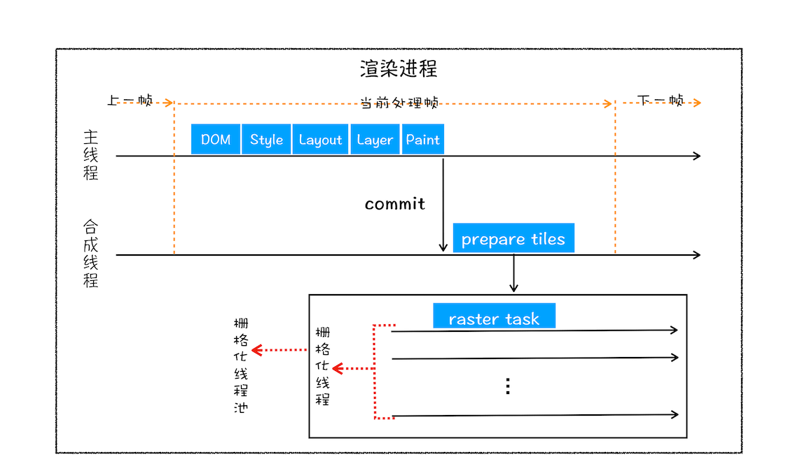

# 浏览器的渲染流程

## 零、写在前面

在上一篇文章中，笔者主要探讨了浏览器的导航流程，所谓的导航流程就是从浏览器处理用户在地址栏中的输入开始，一直到浏览器进程接收到渲染进程确认提交的消息为止。

也就是说一旦浏览器进程接收到渲染进程的确认提交消息之后，就说明渲染进程已经接收到了HTML文档，下面就到了渲染这个重要的过程。

这篇文章我们就来看看浏览器的渲染流程。在这里提醒读者，如果没有看浏览器的导航过程，建议先看一下浏览器的导航过程。


## 一、浏览器的渲染流程图解

我们都知道一个完整的可交付的页面离不开三个要素：HTML、CSS、JS，作为一个前端，应该都知道这三者是做什么用的，这里就不赘述了。

由于渲染流程是一个非常复杂的过程，所以这个流程中包含了很多的子阶段，我们可以先总体上看一下渲染流程分成了哪几个子阶段。

按照时间的顺序，渲染流程大致可以分为如下几个子阶段：构建DOM树、样式计算、布局阶段、分层、绘制、分块、光栅化、合成。由于子阶段比较多，可能需要篇文章才能讲清楚。

在讨论每个子阶段时，最重要的就是把握好以下三点：

+ 每个子阶段都有`输入内容`。
+ 每个子阶段都有其`处理过程`。
+ 每个子阶段都有`输出内容`。

只要牢牢抓住这三点，渲染进程就不难理解。

下面我们使用一张图来说明渲染流程的各个子阶段（从左到右按照时间的先后顺序）：


接下来我们就按照这幅简图，逐步的对这些子步骤进行详细分析。


## 二、构建DOM树

从上图所知，渲染流程的输入是`HTML、CSS、JavaScript`文档，在我们的普遍认知中有了`HTML`浏览器就可以显示一个页面。那么什么又是DOM树呢？为什么要构建DOM树？

这是因为浏览器不认识或者说无法直接理解`HTML`这三种文档，所以要先利用HTML文档来构建浏览器能够直接解读的东西，就是DOM树。

DOM树，顾名思义就是一个树状的结构，本质上DOM树是一个多叉树。

关于DOM树的构建过程可以参考下图：


从图中我们可以知道，HTML文本通过HTML解析器的解析最终生成了DOM树，DOM书是存储在内存中的树结构的数据。我们也可以从浏览器中进行观察，你可以打开 Chrome 的“开发者工具”，选择“Console”标签来打开控制台，然后在控制台里面输入“document”后回车，这样你就能看到一个完整的 DOM 树结构，如下图所示：


我们可以看到document就是是个树结构和HTML文本所表示的一致。和HTML文本不同的是，HTML是一段文本，但是DOM树是保存在内存中的树状结构，这样的话JS就可以对其进行操作。

我们可以试着用JS对DOM树进行操作：

```javascript
document.getElementsByTagName("p")[0].innerText = "black"
```

在浏览器的控制台中执行这行代码，看一下左侧的页面：


从图中可以看出，代码执行之后，DOM结构被修改成功，同时页面也被重新渲染。

这就是构建DOM树的意义，从HTML文本变成了内存中的树状结构数据，便于处理和操作。这一过程的输入是HTML文本输出的是构建好的DOM树。这一切都要归功于渲染进程中的HTML解析器。

现在我们构建了DOM树，但是DOM树各节点的样式我们仍然不知道是什么样子的，所以下面我们要看一下样式计算的部分。

## 三、样式计算

样式计算是为了计算出每个元素的样式，这个阶段大致分为三个步骤：

### 1. 把CSS转换成浏览器能够理解的结构

CSS的来源如下图所示：


从图中可以知道，CSS的来源主要有三个：

+ 外部的CSS文件
+ HTML中的Style标签里面的CSS文本
+ HTML元素标签中的style属性中的文本

和HTML的文本是一样的，浏览器是直接处理CSS的文本的，需要CSS解析器把CSS的文本解析成`StyleSheets`。为了形象的展示StyleSheets可以在浏览器的控制台中输入`document.styleSheets`并回车查看其结构，如下图所示：


CSS 解析器（CSS Parser）会把CSS文本解析成StyleSheets， StyleSheets包含了三种来源的CSS规则，这是一种能读能修改的结构，为下文JavaScript修改样式做准备。

### 2. 标准化CSS属性值

StyleSheets已经是浏览器能够理解的结构了，接下来就是要对其进行属性的标准化。那么什么是属性的标准化？

```css
body { font-size: 2em }
p {color:blue;}
span  {display: none}
div {font-weight: bold}
div  p {color:green;}
div {color:red; }
```

这是一段CSS文本，但是诸如`em、blue、bold`，这种语义化的属性值不太容易被渲染引擎理解，所以需要将所有值转换为渲染引擎容易理解的、标准化的计算值，这个过程就是属性值标准化。以下就是属性标准化之后的样子：

```css
body { font-size: 32px }
p {color: rgb(0, 0, 255);}
span  {display: none}
div {font-weight: 700}
div  p {color:rgb(0, 128, 0);}
div {color:rgb(255, 0, 0); }
```

2em 被解析成了 32px，red 被解析成了 rgb(255,0,0)，bold 被解析成了 700……

### 3. 计算DOM中每个节点的具体样式

现在样式的属性值已经被标准化了，接下来就是要计算每个节点具体的样式。如何计算节点样式涉及到了CSS两个重要的属性：CSS继承、层叠。

首先是CSS继承，CSS继承是子元素会继承父元素的某些CSS样式属性，当然这是指子元素不显式的设置某些属性的情况下。举个例子：

```CSS
body { font-size: 2em }
p {color:blue;}
span  {display: none}
div {font-weight: bold}
div  p {color:green;}
div {color:red; }
```

这张样式表应用到DOM节点之后的效果：


从图中可以看出，所有子节点都继承了父节点样式。比如 body 节点的 font-size 属性是 20，那 body 节点下面的所有节点的 font-size 都等于 20。这一特性在浏览器调试工具中也可得到印证。

样式计算过程中的第二个规则是样式层叠。

层叠是 CSS 的一个基本特征，它是一个定义了如何合并来自多个源的属性值的算法。它在 CSS 处于核心地位，CSS 的全称“层叠样式表”正是强调了这一点。

总之，样式计算阶段的目的是为了计算出 DOM 节点中每个元素的具体样式，在计算过程中需要遵守 CSS 的继承和层叠两个规则。这个阶段最终输出的内容是每个 DOM 节点的样式，并被保存在 ComputedStyle 的结构内。

我们也可以在浏览器的开发者工具中选中某一个节点，看它的ComputedStyle：


## 四、布局阶段——构建布局树

DOM树的构建和节点样式的计算完成之后，我们得到了DOM树和每个元素样式的计算结果——StyleSheets。只是知道这些信息不足以渲染出我们想要的页面，因为我们还不知道 DOM 元素的几何位置信息。那么接下来就需要计算出 DOM 树中可见元素的几何位置，我们把这个计算过程叫做布局。

Chrome 在布局阶段需要完成两个任务：**创建布局树和布局计算。**

### 1. 创建布局树

DOM树中还有很多对于渲染来说不可见的元素，比如`head标签、meta标签、以及使用display: none 的标签`，这些标签都是网页上不可见的，也是布局操作不需要的标签，所以在显示页面之前还需要构建一个只包含可见元素的树——布局树。

> 这里说的不可见是指对于布局没有用的标签，不是人眼不可见。如果对一个div使用visibility:hidden; 只是div变成透明的，但是还有占有空间，所以会存在于布局树内。

布局树的构建过程：


从图中可以看出所有对于布局没用的不可见元素都不会存在于布局树中。构建布局树的过程：

+ 遍历 DOM 树中的所有可见节点，并把这些节点加到布局树中；
+ 而不可见的节点会被布局树忽略掉，如 head 标签下面的全部内容，再比如 body.p.span 这个元素，因为它的属性包含 dispaly:none，所以这个元素也没有被包进布局树。

### 2. 布局计算

布局树创建完成，接下来我们需要计算布局树中所有节点的坐标位置。然后把计算出来的坐标位置重新写会到布局树中，也就是说布局计算这一步输入的是布局树输出的是带有坐标位置的布局树。输入和输出是一样的。


## 五、分层

现在我们有了布局树，下面就进入了分层的阶段。因为页面中有很多比较复杂的效果比如3D变换、页面滚动、z-index在Z轴方向上排列等。为了更加方便的实现这些效果，渲染引擎会为特定的节点生成单独的图层，并生成一棵图层树——LayerTree。就像PS的图层一样，正是这些图层堆叠在一起才构成了最终的页面图像。

现在我们知道了浏览器的页面实际上被分成了很多图层，这些图层叠加后合成了最终的页面。

我们用一张图说明层树和渲染树之间的关系，如图所示：


从图上我们可以看到，有些元素单独生成一个图层，有的则没有。没有对应图层的元素实际上是从属于父元素的图层上。也就是说最后每个元素都直接或者间接的属于一个图层。

什么样的节点渲染引擎会单独创建一个图层？以下两点满足其一即可

#### 1. 拥有层叠上下文属性的元素会被提升为单独一层。

页面是个二维平面，但是层叠上下文能够让 HTML 元素具有三维概念，这些 HTML 元素按照自身属性的优先级分布在垂直于这个二维平面的 z 轴上。如图所示：


即有明确定位属性的元素、定义透明属性的元素、使用 CSS 滤镜的元素等，都拥有层叠上下文属性。

#### 2. 需要裁剪的地方会被单独提升为一层

何为裁剪？也就是我们平时说的子元素在父元素内溢出。如果有滚动条的话滚动条也是单独的一层。


## 六、图层绘制

现在我们有了图层树（Layer Tree），渲染引擎就会对每个图层进行绘制。问题来了：渲染引擎如何绘制图层？

渲染引擎会把每一个图层的绘制分成多个很小的绘制指令，把这些绘制指令按照先后顺序组成一个绘制列表，如下图所示：


如图所示绘制列表就是按照先后顺序排列的多个绘制指令。这些绘制指令具体是什么样子，可以从浏览器开发者工具中的Layer选项中查看：


## 七、栅格化（raster）操作

图层绘制阶段实际上就输出了一个绘制列表，只是多个绘制指令按照时间先后的排列。实际意义上的绘制操作是由渲染进程中的合成线程完成的。渲染进程中比较重要的有两个线程：

+ 渲染主线程
+ 合成线程

两个线程之间的关系如图所示：


我们从图中可以看到，主线程在绘制过程完成之后想合成线程提交了点什么。那么问题来了，主线程向合成线程提交了什么呢？

答案就是：`主线程向合成线程提交了绘制列表。`

在收到主线程提交过来的绘制列表之后合成线程之后，会把图层划分为图块（tile）。至于为什么这样做，原因也很简单。因为在有些情况下，有的图层可以很大，比如有的页面你使用滚动条要滚动好久才能滚动到底部，但是通过**`视口`**，用户只能看到页面的很小一部分，所以在这种情况下，要绘制出所有图层内容的话，就会产生太大的开销，而且也没有必要。

> **视口**
>
> 通常一个页面可能很大，但是用户只能看到其中的一部分，我们把用户可以看到的这个部分叫做视口（viewport）。如下图所示：
>
> 

现在我们清楚了视口和图块的关系，那么**合成线程就会按照视口与整个页面的相对位置优先把视口附近的图块生成位图，实际生成位图的操作是由栅格化完成的，所谓的栅格化就是把图块生成位图的过程**。

> **栅格化**
>
> 图形的栅格化方法也叫光栅化方法，它的作用是把图形变成一个个屏幕上的像素从而显示出来。数学上描述图形用的“点”或“线”是没有大小的。而显示器屏幕是一系列像素组成的正交网格，就好像一个个的格子一样。我们需要把这些“点”“线”用格子描述出来，因此把这个过程称作“栅格化”更加贴切。

图块是栅格化执行的最小单位。渲染进程维护了一个栅格化的线程池，所有的图块栅格化都是在线程池内执行的，运行方式如下图所示：



通常栅格化的操作都会由GPU快速生成。使用 GPU 生成位图的过程叫快速栅格化，或者 GPU 栅格化，生成的位图被保存在 GPU 内存中。

GPU是一个独立的进程，如果栅格化使用了GPU，那么生成位图的操作肯定是在GPU进程中完成的，生成的位图毫无疑问也是保存在GPU内存中，那就要是跨进程操作，要使用的IPC。

具体的工作方式如下图所示：


从图中可以看出，渲染进程把生成位图的指令发送给 GPU，然后在 GPU 中执行生成图块的位图，并保存在 GPU 的内存中。

## 八、合成和显示

等到所有的图块都光栅化完成，合成线程就会生成一个绘制图块的命令——DrawQuad，然后将该命令提交给浏览器进程。

浏览器进程里面有一个叫 viz 的组件，用来接收合成线程发过来的 DrawQuad 命令，然后根据 DrawQuad 命令，将其页面内容绘制到内存中，最后再将内存显示在屏幕上。

到此为止，我们终于看到了页面。


## 九、渲染过程总结

现在我们已经分析完从构建DOM（DOM Tree）、样式计算（Recalculate Style）、构建布局树（Layout Tree）、生成图层树（LayerTree）、绘制（Paint）、分块（tile）、光栅化（raset）、合成和显示。用一张图来概括：


结合上图，一个完整的渲染流程大致可总结为如下：

1. 渲染进程将 HTML 内容转换为能够读懂的 DOM 树结构。
2. 渲染引擎将 CSS 样式表转化为浏览器可以理解的 styleSheets，计算出 DOM 节点的样式。
3. 创建布局树，并计算元素的布局信息。
4. 对布局树进行分层，并生成分层树。
5. 为每个图层生成绘制列表，并将其提交到合成线程。
6. 合成线程将图层分成图块，并在光栅化线程池中将图块转换成位图。
7. 合成线程发送绘制图块命令 DrawQuad 给浏览器进程。
8. 浏览器进程根据 DrawQuad 消息生成页面，并显示到显示器上。


## 十、相关概念——重排、重绘、合成

#### 1. 更新了元素的几何属性（重排）


从上图可以看出，如果你通过 JavaScript 或者 CSS 修改元素的几何位置属性，例如改变元素的宽度、高度等，那么浏览器会触发重新布局，解析之后的一系列子阶段，这个过程就叫重排。无疑，重排需要更新完整的渲染流水线，所以开销也是最大的。

#### 2. 更新元素的绘制属性（重绘）

接下来，我们再来看看重绘，比如通过 JavaScript 更改某些元素的背景颜色，渲染流水线会怎样调整呢？你可以参考下图：


更新元素背景从图中可以看出，如果修改了元素的背景颜色，那么布局阶段将不会被执行，因为并没有引起几何位置的变换，所以就直接进入了绘制阶段，然后执行之后的一系列子阶段，这个过程就叫重绘。相较于重排操作，重绘省去了布局和分层阶段，所以执行效率会比重排操作要高一些。

#### 3. 直接合成阶段

那如果你更改一个既不要布局也不要绘制的属性，会发生什么变化呢？渲染引擎将跳过布局和绘制，只执行后续的合成操作，我们把这个过程叫做合成。具体流程参考下图：


在上图中，我们使用了 CSS 的 transform 来实现动画效果，这可以避开重排和重绘阶段，直接在非主线程上执行合成动画操作。这样的效率是最高的，因为是在非主线程上合成，并没有占用主线程的资源，另外也避开了布局和绘制两个子阶段，所以相对于重绘和重排，合成能大大提升绘制效率。


