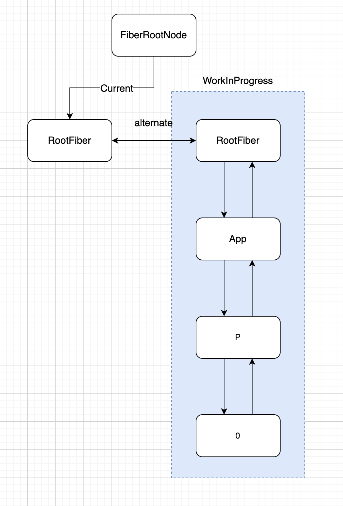

# React——Fiber

## Fiber的三层含义

笔者在学习React原理的时候，总会看到各种文章都会说：`React 16新引入的Fiber架构`，然后又会听到一个词叫做`Fiber Tree`——也就是常说的Fiber树，还有就是`Fiber的双缓存`，最后还有一个`Fiber Node`......

这些词对于没有接触过React原理的前端开发人员是听着熟悉，但是却不知道是什么东西。**既然Fiber是一个新的架构，为什么又是一课树？既然是一棵树，那么又为什么会实现可中断、任务又可以分优先级？Fiber的双缓存又是什么？**

相信很多人都会产生和笔者一样的疑惑，Fuck！这些都TM是啥？？？

其实关于Fiber不单单只是代表一层含义，Fiber至少代表了三层含义：

1. 在架构上，区别于React 15的Reconcile + Renderer两大模块的同步更新架构，React 16新加了一个`Scheduler模块`——这就是在`架构层面上Fiber`的含义，也就是Fiber架构的意思。
2. 在`静态的数据结构`上，就像HTML会被浏览器解析成DOM树一样，React中也存在和DOM树一样的由Fiber Node中`child、return、sibling、index`组成了Fiber Tree——这也就是Fiber Tree的含义。
3. 由于Fiber Node上还存在像`pendingProps、firstEffects、lastEffects`等属性，Fiber Node作为动态的工作单元，保存了组件需要更新的状态和需要执行的副作用。


## Fiber的双缓存

在理解Fiber的双缓存之前，先来了解一下动画的原理，动画是由一张张的图片连续播放形成的，一张图片称为动画的一帧，在渲染下一帧的时候，我们需要把当前这一帧的图片删除，用下一帧的图片代替。那么这个替换的过程如果时间过长那么人眼就会看出白屏闪烁，那么可以在内存中事先生成图片，直接替换，这种在内存中构建并直接进行替换的技术就叫做双缓存。

### React是怎么利用双缓存来更新页面

先来看一段代码：

```react
function App() {
  const [num, setNum] = useState(0);
  return (
    <p onClick={() => { setNum(num + 1) }}></p>
  );
}

ReactDOM.render(
  <App/>, document.getElementById('root')
);
```

下面是在初始化mount时，React的工作过程：



+ 当首次调用ReactDOM.render会创建一个FiberRootNode是整棵Fiber树的根节点。
+ 因为可以把多个应用（这里指ReactDOM.render方法的第一个参数）渲染到多个节点上，所以每次调用ReactDOM.render的时候还会创建一个RootFiber。多个RootFiber（如果有的话）由FiberRootNode统一管理。
+ FiberRootNode的current指针指向RootFiber，在首次渲染之前因为页面是空白的，所以`Current Fiber Tree` 不会有子节点。
+ 接下来进入首屏渲染，会在内存中创建一个根节点`RootFiber`，这两棵FiberTree中都有的RootFiber节点用alternate指针连接，来共用一些属性**（这里需要注意的是，不管是首次渲染还是setState、useState更新，都会重新在内存中重新生成一棵WorkInProgress Fiber Tree）**。
+ 然后使用深度优先遍历创建整棵WorkInProgress Fiber Tree。
+ 现在内存中有了两棵Fiber树，一个是current Fiber Tree，是现在代表页面内容的Fiber Tree。另一个是WorkInProgress Fiber Tree代表的是更新之后的Fiber Tree。
+ WorkInProgress Fiber Tree一旦构建完成，FiberRootNode的current指针就会指向WorkInProgress Fiber Tree的RootFiber节点。也就是说WorkInProgress Fiber树就变成了current fiber tree。
+ 此时，我们如果点击`P标签`执行`setNum(num + 1)`，会进行一次更新，在每次进行更新的时候都会重新创建一棵WorkInProgess Fiber Tree。
+ 我们知道当前的current Fiber Tree 的 RootFiber节点已经和上一棵Fiber Tree的 RootFiber 通过alternate指针连接。那么本次更新的WorkInProgress Fiber Tree会根据当前current Fiber Tree 的RootFiber节点上alternate指针指向的RootFiber节点来进行构建。
+ 本次更新会生成新的JSX结构，这种current fiber与本次更新所返回的JSX结构作对比生成新的WorkInProgress Fiber Tree的过程就是——DOM Diff

> **通过以上Fiber Tree的创建过程，我们可以得出一个结论，首次渲染和更新的区别就是在生成workInProgress Fiber Tree的时候有没有进行DOM Diff**


## Fiber架构——Schedule、Reconcile、Renderer


