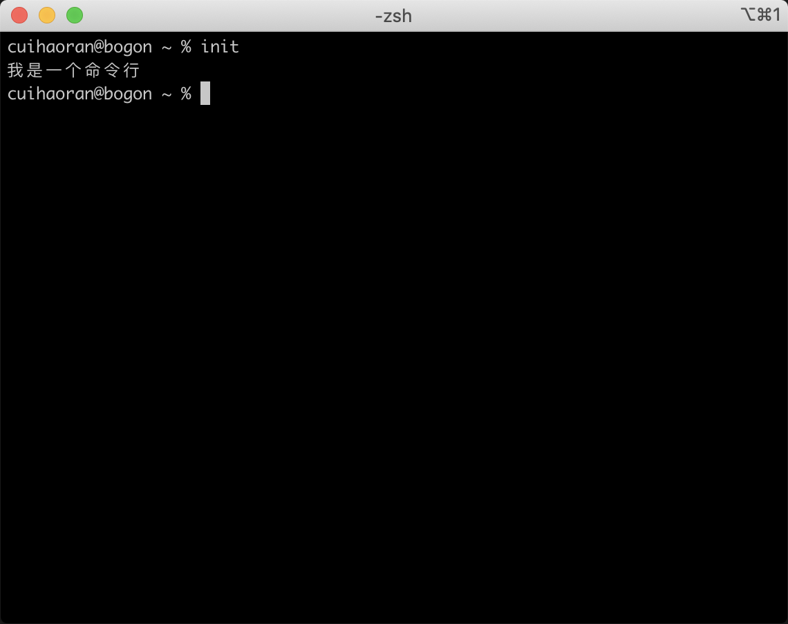

# 手写Vue-cli

## 零、写在前面

在阅读正文之前我们对于Vue-cli需要解决两个问题：

1. 什么是Vue-cli
2. 为什么会出现Vue-cli这种东西？

### I、什么是Vue-cli

vue-cli是Vue脚手架，是前端工程化中Vue工程项目的一个自动化工具，使用这个工具能够自动生成一个可供webpack打包的Vue项目。

### II、为什么会出现Vue-cli？

vue-cli简化了开发的流程，提高了前端的开发效率。隐藏了很多细节问题，可以让程序员把更多的精力放在业务开发上。

> **Vue和Vue-cli的区别：**
>
> vue是UI库，vue-cli是一个命令行工具，是一个脚手架。使用Vue-cli可以搭建出Vue项目开发的环境。两者虽然有关联但是关联不大。

### III、Veue-cli的特点

1. Vue-cli是一个命令行工具

> **什么是命令行工具？**
>
> 基于文本来查看、处理、操作计算机上的文件的程序。

2. 搭建vue项目的开发环境

> **什么是开发环境？**
>
> 这里的开发环境基本上等价于webpack的开发配置。自动的打包css、编译Vue文件。把Vue文件编译成html和JS文件。

在手动开发一个vue-cli之前，必须先了解真正的vue-cli是怎么使用的，具体的使用方法参照[vue-cli文档](https://cli.vuejs.org/zh/)，这里不做赘述。

### IV、vue-cli使用方式

> **Vue-cli使用方法摘要：**
>
> 查看帮助：vue --help
>
> 1. vue <command> [options]：vue是主命令，<command>是子命令<可选>，[options]是参数[可选]。
>
> 2. Options:
>      -V, --version                              output the version number
>      -h, --help                                 output usage information
>
>    Commands:
>      create [options] <app-name>                create a new project powered by vue-cli-service
>      add [options] <plugin> [pluginOptions]     install a plugin and invoke its generator in an already created project
>      invoke [options] <plugin> [pluginOptions]  invoke the generator of a plugin in an already created project
>      inspect [options] [paths...]               inspect the webpack config in a project with vue-cli-service
>      serve [options] [entry]                    serve a .js or .vue file in development mode with zero config
>      build [options] [entry]                    build a .js or .vue file in production mode with zero config
>      ui [options]                               start and open the vue-cli ui
>      init [options] <template> <app-name>       generate a project from a remote template (legacy API, requires @vue/cli-init)
>      config [options] [value]                   inspect and modify the config
>      outdated [options]                         (experimental) check for outdated vue cli service / plugins
>      upgrade [options] [plugin-name]            (experimental) upgrade vue cli service / plugins
>      migrate [options] [plugin-name]            (experimental) run migrator for an already-installed cli plugin
>      info                                       print debugging information about your environment
>
>    
>
>    **这是vue-cli所有的命令和命令的解释。**

看了这些命令之后以下这几条命令是我们需要实现的：

+  init [options] <template> <app-name>       generate a project from a remote template (legacy API, requires @vue/cli-init)——根据一个远程的模板，创建一个项目。
+ list : 所有可以使用的官方模板，如下图所示：


我们最常用的模板就是webpack模板，我们可以点开看一下，模板就在template目录中：


看到webpack-template的目录结构，相信只要是用过vue-cli的读者都会非常熟悉了，这就是我们使用vue-cli默认生成的项目结构！从这里我们也可以清楚一件事情：

**Vue项目的模板是根据用户输入的参数从github上远端拉取下来的。清楚这一点是非常重要的！**

### V、vue-cli的工作过程

1. 初始化：将vue命令添加到系统环境变量`PATH`中。

2. 通过命令行交互获取用户配置

3. 解析配置信息：用户配置 + 默认配置

4. 生成项目文件：通过上一步的配置 + 官方模板 = vue项目结构

   > 这里说的模板可以使vue官方支持的模板，也可以是自己写的模板。
   >
   > 如果是自己写的模板要注意以下几点：
   >
   > 1. 自己写的模板项目，一定要有一个template目录，里面是模板项目
   > 2. 一定要有meta.js，用来收集用户的信息。
   >    1. prompts：弹窗信息
   >    2. helpers：模板引擎的扩展
   >    3. complete：构建完成之后的钩子函数
   >    4. metalsmith：静态站点生成器

5. 清理工作和完善工作

清楚了这些下面我们就可以正式开始手写Vue-cli了。


## 一、实战Vue-cli（重点）

从上文中我们得知如果想造一个vue-cli的轮子，需要解决以下这几个问题：

+ 如何获取用户配置：怎么做交互？
+ 如何解析最终的配置？
+ 如何生成项目文件？

上文中提到有很多可用的`官方模板`，我们挑选一个最常用的——`vuejs-templates/webpack`。

想要解决上面提到的这几个问题需要用到以下工具：

+ Commander.js——完整的 [node.js](http://nodejs.org/) 命令行解决方案。
+ inquirer——弹窗交互
+ chalk——美化命令行
+ ora——做加载状态、进度条
+ execa——直接传入命令，直接执行。多用在持续集成。
+ download-git-repo——在git中下载模板
+ metalsmith——读取所有文件，实现模板渲染。
+ consolidate——统一模板引擎

vue-cli的项目目录：

+ lib：核心逻辑
+ test：测试
+ bin：
+ package.json：
  + bin：专门用来放置用户自定义命令的，然后执行npm link，把命令链接到全局或者某一个空间下。

**铺垫了这些，开始实战！**


新建my-vue-cli目录，在package.json中新增`bin`字段，添加自定义命令：

```json
{
  "name": "my-vue-cli",
  "version": "1.0.0",
  "description": "",
  "main": "index.js",
  "bin": {
    "init": "./bin/init.js"
  },
  "scripts": {
    "test": "echo \"Error: no test specified\" && exit 1"
  },
  "keywords": [],
  "author": "",
  "license": "ISC"
}
```

添加完命令之后，在项目根目录下新建`bin`目录，在其中新建init.js：

```javascript
#!/usr/bin/env node

console.log('我是一个命令行');
```

`#!/usr/bin/env node`让bin/init.js变成一个可执行文件。是为了标识这个文件中的代码是由node来执行的。然后我们进行link，把package.json中bin里面的命令链接到PATH环境中，执行链接：

```bash
$ npm link
```

在命令行执行`init`命令，效果如下图：



init命令执行成功，而且无论在什么路径下都可以执行成功。

接下来在项目中新建`lib/index.js`文件：

```javascript
module.exports = function logger() {
  console.log('我是一个命令行222');
}
```

更改`bin/init.js`：

```javascript
#!/usr/bin/env node
const logger = require('../lib/index');
logger();
```

重新执行`npm link`，执行init命令：


