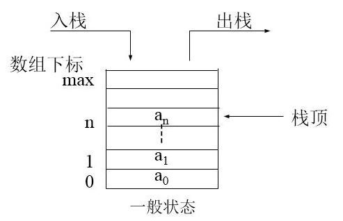
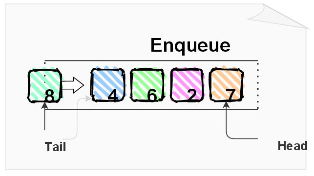

# 剑指 Offer月计划 · 第一天——栈与队列


## 写在前面

### 什么是栈？

栈（stack）又名堆栈，它是一种运算受限的线性表。限定仅在表尾进行插入和删除操作的线性表。这一端被称为栈顶，相对地，把另一端称为栈底。向一个栈插入新元素又称作进栈、入栈或压栈，它是把新元素放到栈顶元素的上面，使之成为新的栈顶元素；从一个栈删除元素又称作出栈或退栈，它是把栈顶元素删除掉，使其相邻的元素成为新的栈顶元素。

**栈的示意图：**



### 什么是队列？

队列是一种特殊的线性表，特殊之处在于它只允许在表的前端（front）进行删除操作，而在表的后端（rear）进行插入操作，和栈一样，队列是一种操作受限制的线性表。 进行插入操作的端称为队尾，进行删除操作的端称为队头。 队列中没有元素时，称为空队列。

**队列示意图：**




## 第一题：用两个栈实现队列

**用两个栈实现一个队列。队列的声明如下，请实现它的两个函数 appendTail 和 deleteHead ，分别完成在队列尾部插入整数和在队列头部删除整数的功能。(若队列中没有元素，deleteHead 操作返回 -1 )**

```javascript
const CQueue = function() {
	this.stackA = [];
  this.stackB = [];
};

/** 
 * @param {number} value
 * @return {void}
 */
CQueue.prototype.appendTail = function(value) {
	this.stackA.push(value);
};

/**
 * @return {number}
 */
CQueue.prototype.deleteHead = function(){
	if(this.stackB.length === 0) {
    while(this.stackA.length !== 0) {
      this.stackB.push(this.stackA.pop());
    }
  }
  
  if(this.stackB.length === 0) {
    return -1;
  }else {
    return this.stackB.pop();
  }
};
```

### **方法解析：双栈方式**

**思路和算法：**

维护两个栈，分别记作stackA和stackB。stackA支持插入操作，stackB支持删除操作。

根据栈的**先进后出**（First in last out）的特点，我们每次往stackA中插入元素的时候，stackA的**栈顶元素**是最后插入的元素，第一个栈的**栈底元素**是下一个待删除的元素。

但是为了维护队列的**先进先出（注意这里是队列，特点是先进先出与栈的特点完全不同）**的特点，我们需要引入一个辅助栈（也就是开头说到的stackB），这个辅助栈用于维护**待删除**的元素，在执行删除操作的时候我们先检验stackB是否为空，如果为stackB空，就把stackA中的元素一个个的弹出并压入stackB中。等到stackA中全部弹出并压入stackB中之后，stackB中的元素顺序就是待删除元素的顺序，直接弹出stackB中的栈顶元素即可。

上面的结题思路中，提到的判断条件是重点。stackB中如果不为空的话是不需要把stackA的元素弹出并插入到stackB中的。换句话只有在stackB为空的时候才会执行stckB的入栈操作。只要stackB不为空，在执行deleteHead的时候直接弹出stackB中的栈顶元素即可。当stackB弹空后再执行stackB的入栈操作。**这里不必担心会重复入栈的问题，因为在stackB入栈的时候，stackA在弹出，所以不会造成重复。**

**成员变量：**

- 维护两个栈 `stackA` 和 `stackB`，其中 `stackA` 支持插入操作，`stackB` 支持删除操作。

**构造方法：**

+ 初始化stackA和stackB为空。

**成员方法：**

插入元素对应方法 `appendTail`

- `stack1` 直接插入元素

删除元素的对应的方法`deleteHead`

+ 如果stackB为空而stackA不为空，那么直接把stackA的所有元素挨个弹出并压入stackB。
+ 如果stackB不为空，不管stackA是否为空，则直接弹出栈顶元素。
+ 如果经过第一步stackB仍然为空，那么说明stackA就是一个空栈，执行deleteHead的时候直接返回-1。


## 第二题：包含Min的栈

**定义栈的数据结构，请在该类型中实现一个能够得到栈的最小元素的 min 函数在该栈中，调用 min、push 及 pop 的时间复杂度都是 O(1)。**

**示例：**

```
MinStack minStack = new MinStack();
minStack.push(-2);
minStack.push(0);
minStack.push(-3);
minStack.min();   --> 返回 -3.
minStack.pop();
minStack.top();      --> 返回 0.
minStack.min();   --> 返回 -2.
```

**题解：**

```javascript
/**
 * initialize your data structure here.
 */
var MinStack = function() {
	this.stackA = [];
  this.stackB = [];
};

/** 
 * @param {number} x
 * @return {void}
 */
MinStack.prototype.push = function(x) {
	this.stackA.push(x);
  if(this.stackB.length === 0 ||  x <= this.stackB[this.stackB.length - 1]) {
    this.stackB.push(x);
  }
};

/**
 * @return {void}
 */
MinStack.prototype.pop = function() {
	const res = this.stackA.pop();
  if(res === this.stackB[this.stackB.length - 1]) {
    this.stackB.pop()
  }
};

/**
 * @return {number}
 */
MinStack.prototype.top = function() {
	return this.stackA[this.stackA.length - 1];
};

/**
 * @return {number}
 */
MinStack.prototype.min = function() {
	return this.stackB[this.stackB.length - 1];
};
```

### 解题思路

栈的**弹栈（pop）**和**压栈（push）**的操作时间复杂度是O(1)，但是获取栈的最小值也就是min方法需要遍历整个栈，时间复杂度为O(N)。

解答本题的关键点在于min函数的实现上，要把时间复杂度从O(N)降到O(1)。我们需要引入一个辅助栈。

+ **数据栈A（stackA）**：stackA用于存储所有的元素，保证栈的常规操作的实现，包括入栈（push）、出栈（pop）、返回栈顶元素（top）等方法。
+ **辅助栈B（stackB）**：stackB中存储stackA中所有**非严格降序**的元素。栈A的最小元素始终对应栈B的栈顶元素，min函数只要弹出栈B的栈顶元素即可。

我们最终得出结论，只要维护好栈B就可以做到min方法的时间复杂度为O（1）。


**具体的函数实现：**

+ push(x) 函数：stackA入栈的同时，重点保证stackB是非严格降序的。
  + 将x压入栈A（即A.push(x)）
  + 判断栈B，若栈B为空或者x小于等于栈B的栈顶元素，则把x压入栈B。
+ pop() 函数：重点是保持栈A和栈B的元素一致性。
  + 执行A.pop()，将弹出的元素记作y。
  + 如果y和当前栈B的栈顶元素相等，那么弹出栈B的栈顶元素。
+ top 函数：直接返回栈A的栈顶元素。
+ min函数：直接返回栈B的栈顶元素。

**这是一个典型的用空间换时间的算法题。**

