# HTTP协议哪些事儿（一）

## 零、前言

这一部分我们开始谈谈HTTP协议。这篇文章主要从一下几点讲HTTP：

+ 当我们输入网址敲回车后发生了什么？
+ HTTP协议详解
+ Cookie与Session
+ HTTP缓存机制

我们说的HTTP其实是规则部分也就是协议本身不变的东西，变化的东西我们先不考虑，既然有变化的部分就肯定有不变的部分，不变的部分实际上是协议的底层实现。但是至于协议怎么用，规则是什么，这些东西是不会变的。

## 一、HTTP请求模型

关于HTTP请求模型我们先看一张HTTP请求模型图：

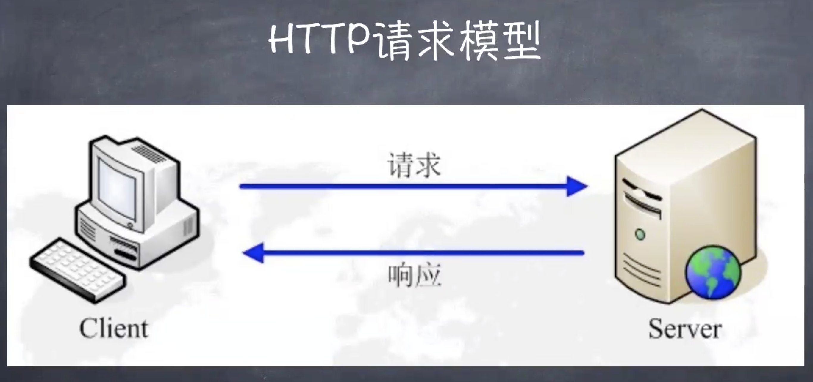

这张图是关于HTTP的最简单的图，对于这幅图我们需要记住两个动作和两端。两个动作是指请求和响应，两个端就是C端（Client）和S端（Server）。首先我们要搞清楚一个问题，究竟什么是客户端和服务器端？我们先简单来说：

+ 服务器端：硬件和程序一直在等待请求。
+ 客户端：需要依赖别人才能工作的是客户端。

在前端领域内可以写服务器端程序的只有NodeJS，我们可以利用NodeJS来搭一个服务器，当然这个服务器也可以向其他服务器端发起请求，那么我们就会发现，一个程序既可以作为服务端，也可以作为客户端。所以，判断一个程序是客户端还是服务器端我们要根据具体的场景，看程序在具体场景中是发起请求还是接收请求。发起请求的叫客户端，接收请求的叫服务端。

**既是客户端又是服务端的程序是真实存在的，我们在后来会讲到用NodeJS做BFF架构，这种场景下NodeJS既是客户端又是服务端**

HTTP协议的重点在于客户端和服务器端的通信过程，HTTP是无限接的协议。客户端向服务器发送数据叫请求，服务器端返回给客户端数据叫做响应，请求和响应是对于HTTP协议来说的。至于什么是**无连接协议**，我们下文会讲。

现在关于HTTP的认识问题，我们就先记住两个`二`：

+ 两个动作：
  + 请求（客户端向服务器）
  + 响应（服务器向客户端）
+ 两端：
  + 客户端
  + 服务端

什么是模型：复杂的概念或者系统经过简化和抽象的产物就是模型。比如说HTTP请求模型，就是HTTP请求响应这个完整流程的简化和抽象。

HTTP请求模型是我们第一个重点问题的前置知识，只有说完了请求模型我们再能更好的理解接下来的问题。我们的第一个重点问题就是：当我们在地址栏输入URL敲回车之后发生了什么？

## 二、当我们在地址栏输入URL敲回车之后发生了什么？

在说明白这个问题之前我们先来看一张图：

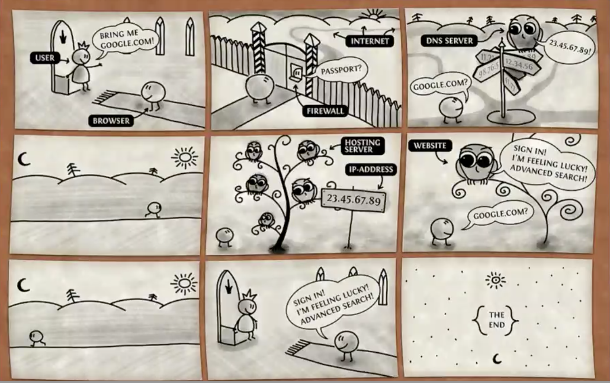

这张图是一个简单的HTTP请求响应的流程图，我们就这一张图来简略的说一下HTTP流程：

1. 首先第一张图是用户（USER）在地址栏中敲google.com，回车。这时候浏览器并不会马上去跟服务器通信，因为这条通信的链路通不通现在还不知道。那么要先保证通信链路是通的，才能让数据顺着这条路过去。第一幅图，浏览器发出请求的指令。
2. 第二幅图，浏览器要确定这条通信的链路是否是通的，首先要确定的是，是否能连到网络上去。再检查网络是否是通的，浏览器需要跨过一个设备，在图上标的是FireWall（防火墙），但是这个设备也有可能是路由器或者网关等等。这些设备就像关口，隔开了局域网和互联网。如果浏览器确认链路是通的，那么就会做好发送请求的准备。
3. 第三幅图，浏览器会做一些发送请求之前的准备，那就是DNS解析。我们输入在地址栏的是一个字符串（google.com）。这个就比较麻烦，计算机是不认识这些字符串的，计算机只认识IP地址，需要把这个字符串通过 `DNS服务器` 转化成对应的IP。也就是说浏览器在请求之前要把服务器的IP解析出来。DNS服务器维护了一个非常大的数据库（简单来说就是键值对的形式），存着域名和IP地址的对应关系。DNS把解析出来的IP地址会告诉计算机。
4. 到了第四幅图我们拿到了服务器的IP地址，建立TCP连接，可以上路了，这幅图代表的是http的请求发送。当然这幅图是简化了的请求，简化了底层的协议实现，比如说TCP/IP的三次握手和四次挥手。建立TCP连接在传输层上，HTTP请求在应用层上。第四幅图所描述的请求并不是从客户端到服务器端的直连，中间这条通路还需要做很多次的路由处理（路由技术）。路由转发的最终目的生成一个最优的路径。
5. 经过路由的最优路径，我们发现这里有一棵大树，书上很多鸟，这些鸟就代表了服务器，这棵树代表了一个机房，这个机房的出口只有一个，也就是说这个机房有一个IP地址（也就是DNS服务器解析出来的服务器地址）。我们的数据通过这个IP进入到这个机房中，那么究竟传到哪个服务器上呢？应对这种情况，就需要一个反向代理，这个反向代理他决定究竟把请求发送到哪个服务器上去。
6. 现在我们通过反向代理找到了一台服务器，之后，服务器会根据我们的请求（google.com）,会把google首页生成。
7. 按照路由选择的最优路径返回，这就是服务器的响应过程。
8. 响应到达客户端经过浏览器的解析和渲染，用户最终看到了页面。
9. 一次完整的请求和响应的流程结束。

**为什么计算机不识别域名只识别IP地址？**

因为对于计算机来说，处理字符串远比处理IP地址（本质是一个数字）要麻烦很多。以IPv4举例子：形如119.75.217.109是一个点分十进制的IP地址，这个IP地址包含了四个数字（119，75，217，109），在C语言中，表示一个整数使用int类型，int类型为四个字节，一个字节为8位，那么就把第一个数字放在第一个字节中，以此类推，正好能够存放一个IP。实际上 `.` 是用来划分字节的。这样存储，会提高运算的速度，因为这么存储就对应了是位运算，位运算在计算机中的效率是很高的。现在IPv4不够用了，又出现了IPv6，IPv6要比更长一点，存储量更大。

**什么是路由的最优路径？**

这个问题分为两方面讲，一个是经过的设备少，一个是延迟小。

### 总结：

我们总结一下HTTP的大体步骤：

1. 输入网址并回车
2. 检查通信链路是否是通的
3. DNS解析
4. 浏览器发送HTTP请求
5. 服务器处理请求
6. 服务器返回HTML响应
7. 浏览器解析渲染HTML
8. 继续请求其他的资源（例如CSS、JS）

## 三、什么是HTTP协议

+ HTTP是超文本传输协议，从`www`浏览器传输到本地浏览器的一种传输协议，网站是基于HTTP协议的，例如网站的JS、图片、CSS等都是通过HTTP协议传输的
+ HTTP协议是从客户机到服务器的请求（Request）和从服务器到客户机的响应（Response）进行约束和规范。

现在我们来看一个关于HTTP协议发展的图：

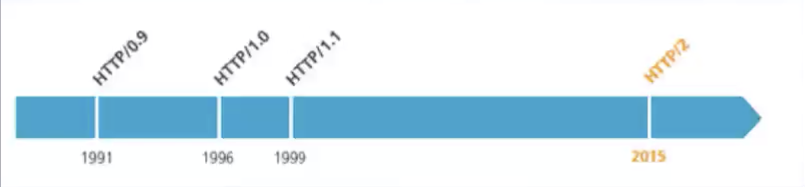

HTTP诞生于1991年，在这个时候HTTP还不是很成熟，到了1996年美国总统克林顿提出“信息高速公路”战略，保证美国在军事和科技方面的领先，HTTP/1.0应运而生。在99年发布了HTTP/1.1，HTTP到1.1版本就非常成熟了，1.1比之前的版本多了长链接。1999年也是美国互联网公司井喷式发展的一年，美国互联网泡沫开始了。中国的互联网泡沫在北京奥运会前后开始，比美国晚了十年。到2015年出现了HTTP2，改变了底层了一些机制。现在又出现了HTTP3。

**怎样区分HTTP2和HTTP1.1？**

HTTP2的请求头是伪头，带有冒号，看图：

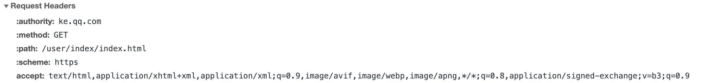

HTTP2是默认带HTTPS，也就是说HTTP2是默认加密的，现在也有越来越多的网站往HTTP2迁移。HTTP2对协议的封装进行了重新设计，为了保证兼容性，才有了伪头。

## 四、了解TCP/IP协议栈

为什么叫TCP/IP协议**栈**？先看一张图：

这张图中一共有两个部分，左边的有七层，右边的四层，而且七层和四层的结构中有四层是相同的。只不过四层的是把七层的前三层（应用层、表示层、会话层）合为一层（应用层）。把七层的最后两层（数据链路层、物理层）合并为网络接口层。其实最后两层也可以不合并，那么有一部分书上讲TCPIP是四层，也有的书上说TCP/IP是五层。

回答一下上文提出的问题：为什么把TCP/IP成为协议栈？

因为TCP/IP的协议是一层层的，而且在调用的时候只能逐层调用，也就是说我们写的程序只能调用应用层的API，应用层只能调用传输层的API，传输层只能调用网络层的API，网络层只能调用数据链路层的API。只能这样一层层的调用，不可跨层，这种结构类似数据结构中的栈，所以叫做协议栈。但是要注意物理层是没有API的，只是ss硬件。

我们说完右边的四层（或者五层）协议，再来看左边的七层协议模型。他的学名叫做IOS/OSI协议。是国际标注化组织制定的协议，而右边的协议是一个事实上的协议标准。由于在互联网发展初期，设计协议没有考虑全面，导致细节没有考虑到，才出现了事实上的四层协议，随着互联网的发展七层协议的标准被提出，但是事实上的协议标准也不可能轻易废除。但是现在的协议在指定的时候大多都是按照七层模型作为标准来指定。

我们熟知的HTTP协议就属于应用层的协议，凡是应用层协议就是可以让我们的程序直接使用的。

+ 应用层：为用户提供所需的各种服务，例如：HTTP、FTP、DNS、SMTP等。
+ 传输层：传输层只有两个协议
  + TCP：传输控制协议，是一种面向连接的协议，为应用层提供端到端的通信功能，保证数据包的顺序传送以及数据的完整性。所以说TCP协议是一种比较严格的协议，面向连接是指TCP在连接的时候会有三次握手，在断开连接的时候会有四次挥手。
  + UDP：用户数据报协议，是一种不面向连接的协议，只管发送数据，至于对方收没收到UDP不关心。
+ 网络层：主要解决主机与主机之间的通信问题，IP协议是网际互联层最重要的协议。UPD是根据该层的数据包协议进行封装的。平时使用的ping命令就是发送的ICMP数据包，就是使用的数据报协议。
+ 数据链路层：一般串口通信都是在数据链路层上，比如说电脑和打印机通信，USB串口的通信。
+ 物理层：网卡、网线、光缆、无线电等硬件。

虽然我们说UDP不可靠，但是在UDP上加上严密的控制机制，也可以使UDP变得可靠。比如说HTTP3的底层协议QUIC就是基于UDP协议封装的。QUIC非常可靠，但是不需要建立连接，性能比较好，更适合网络频繁切换的场景。

##  五、在TCP/IP协议栈中的位置

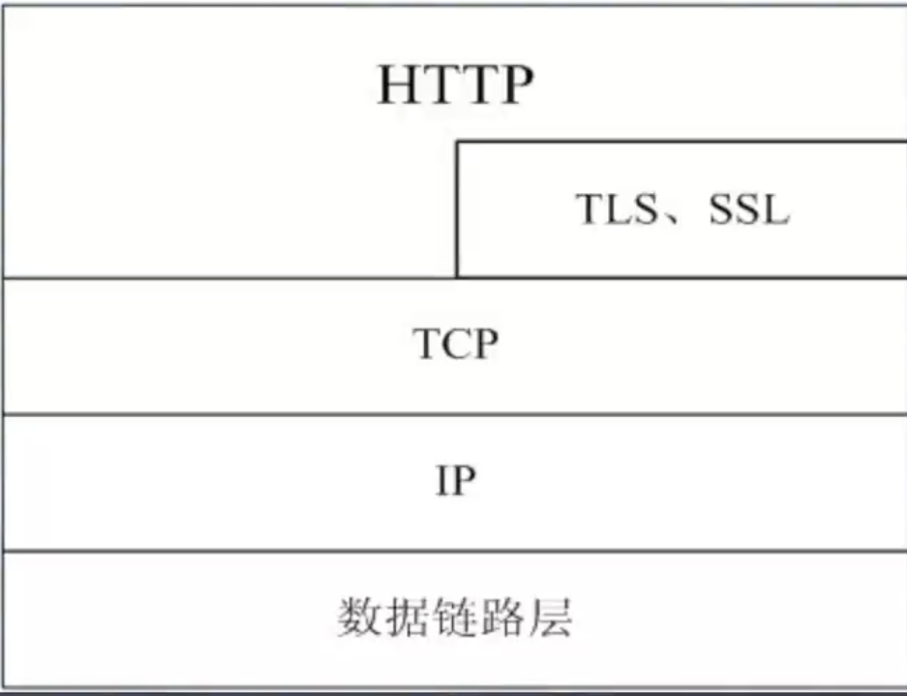

现在我们浏览网页更多的是https协议，我们可以看上图，这是HTTP/1.1的标准，基于HTTP/1.1协议的https是在HTTP协议中把TLS或者SSL协议硬塞进HTTP协议中，从图上我们可以看出，在HTTP/1.1中TLS不是单独的一层。基于HTTP/1.1的HTTPS只是加上了加密功能。我们可以看到TCP和IP、数据链路层都是完整的一层，HTTP也是完整的一层，但是TLS和SSL是嵌入到HTTP里面的，所以我们在使用HTTP/1.1的时候，我们既可以使用不加密的HTTP，也可以使用使用加密之后的HTTPS。

但是在HTTP2中TSL和SSL是完整的一层，因为HTTP2默认就是加密的。到了HTTP3也是单独的一层，现在刚出现不就的HTTP3就是严格按照ISO/OSI模型设计的。

HTTP和HTTPS的端口号也有所不同，HTTP的端口号是80，HTTPS的端口号是443。需要注意的是现在普遍应用的还是HTTP协议，但是正在逐渐向HTTPS迁移。

## 六、HTTP的工作过程

+ 一次HTTP操作就是一个事务，其工作过程分为四步：
  + 首先客户机和服务器先建立TCP连接。只要单击某个超级链接，HTTP工作就开始了。
  + 建立TCP连接之后，客户端发请求给服务器，请求是有固定格式的，格式分为三部分：
    + 请求行：包括统一资源标识符（URL）、协议版本号、请求方法。
    + 请求头：包括请求修饰符、客户机信息。
    + 请求体：可能的内容。
  + 服务器接收到请求之后，给与客户机响应。响应的数据包也有固定的格式，也分为三部分：
    + 状态行：包括协议版本号、一个成功或错误的代码
    + 响应头：包括服务器信息
    + 响应体：包括实体信息和可能的内容
  + 客户端接收到服务器返回的信息，通过浏览器解析渲染在屏幕上，然后客户机和服务器断开连接。

这四个步骤实际上是描述的短连接请求，而长链接则是建立TCP连接之后，会有多次请求和响应，一直到不需要数据传输才断开连接。**为什么需要长链接呢？**因为HTTP请求属于IO操作，IO操作是很消耗资源的（主要是太费时），那么如果频繁的断开连接和建立连接就又会花好多时间，那么我们就减少TCP建立和断开的操作，从而选择复用这条链路。所以就有了长链接。

为什么请求体里是可能的内容呢？因为GET请求时没有请求体的，只有POST请求才有请求体，请求体就是向后端发送的数据，所以是可能的内容。

## 七、请求与响应

+ HTTP请求组成：请求行、消息报头、请求正文。
+ HTTP响应组成：状态行、消息报头、响应正文。
+ 请求行组成：以一个方法符号开头，后面跟着请求的URI和协议的版本。
+ 状态行组成：服务器HTTP协议的版本，服务器发回的响应状态代码和状态代码的文本描述。

现在我们看一下浏览器中HTTP请求的具体情况：

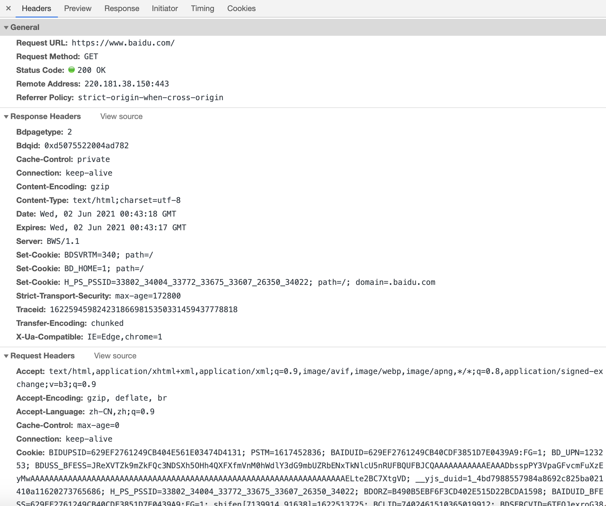

这是百度首页的get请求的具体情况，我们可以看到这个GET请求分为三部分：

1. General：请求行和响应行的集合。
2. Response Headers：响应头
3. Request Headers：请求头

我们点击浏览器中响应头后面的 **View source**就可以看到响应行，对照上文观察一下响应行的组成。同样的点击请求头后面的**View source**也可以看到请求行的内容，对照上文我们也可以看一下请求行的组成。

### I、请求的详细格式图解

我们来看一下请求的详细格式：

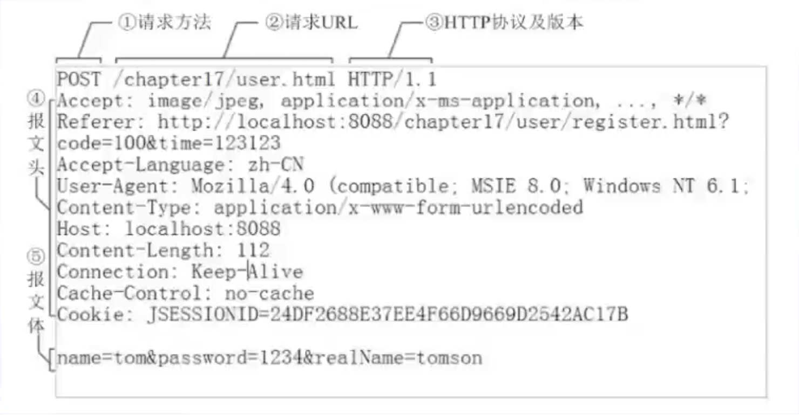

这是一个POST方法，我们可以清楚的看到，请求行包括了请求方法、请求URL、HTTP协议及版本号。请求头（报文头）是一个键值对的形式，再往后是请求体（报文体）。全部的请求格式是POST到后端的。他具体的格式见下图：

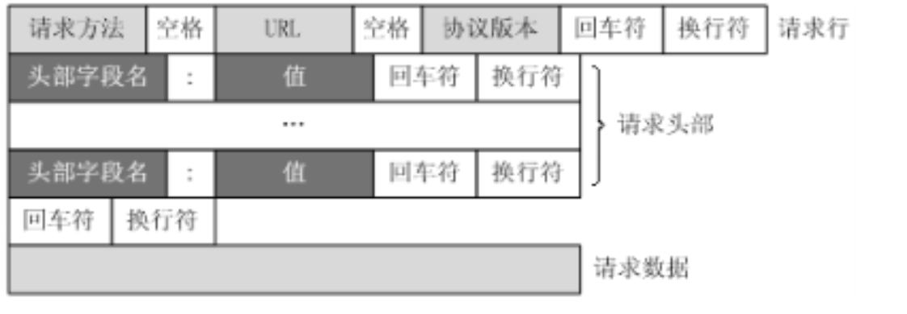

第一行是请求行，最后有一个回车符和一个换行符。紧接着是请求头，请求头里面是一行行的头记录，一行就是一个头记录，一个头记录是一个键值对。往下看最后一个请求头记录后面跟着两个回车符和换行符。这也就是说请求头和请求体之间存在一个空行。空行后面是请求的数据。需要注意的一点是，HTTP1.1以及之前的HTTP协议的请求头都是以纯文本的形式组织起来的。

这个请求中出现的最多的就是回车和换行符，这是个什么玩意儿？为什么要有？在windows系统中想要换一行必须需要有一个不可见字符，回车符合换行符都是不可见字符，也是控制符。在ascii码表中，回车符是`\r`（return），换行符是`\n`（next）至于为什么会同时存在回车符和换行符，有兴趣的读者可以去了解一下机械英文打字机的历史，这里不做赘述。

### II、响应的详细格式图解

响应的格式和请求的格式是一样的：

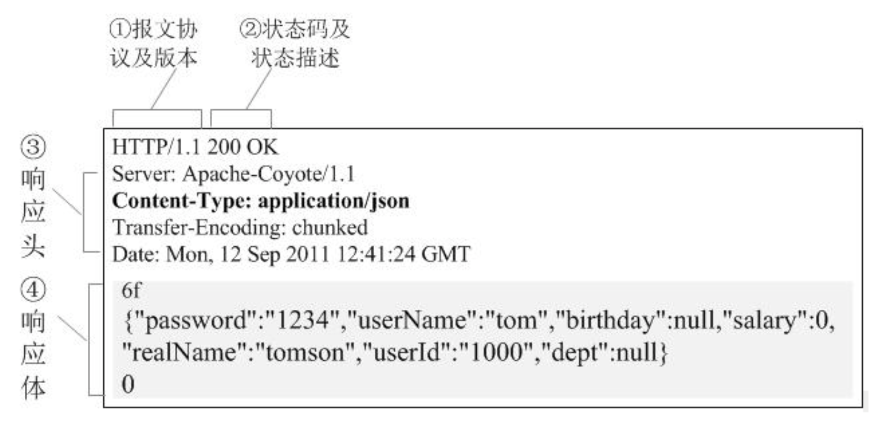

同样整个响应也是纯文本拼接出来的，响应行包括协议和版本号、状态码和状态描述。响应头也是一个个的键值对。响应体就是后台返回的信息。

### III、请求方法

HTTP的请求方法有四大动作，这四大动作和数据库的四个操作增删改查是相互对应的，我们看一下HTTP的常见方法：

+ GET：请求获取Request-URI所标识的资源。对应数据库中的查。
+ POST：在Request-URI所表示的资源后附加的新数据。对应数据库中的改。
+ HEAD：请求获取由Request-URI所标识的资源的消息报头。一般用于探查。
+ PUT：请求服务器存储一个资源，并用Request-URI作为其标识。对应数据库操作的增。
+ DELETE：请求服务器删除由Request-URI所标识的资源。对应数据库中的删。
+ TRACE：请求服务器回送收到的请求信息，主要用于测试或诊断。有点像ping命令，检查服务器在HTTP层面上能不能收到东西。更加像echo命令。
+ CONNECT：HTTP1.1协议中预留给能将连接改为管道方式的代理服务器。一般用在代理服务器上，例如HTTP代理。
+ OPTIONS：请求查询服务器的性能，或者查询与资源相关的选项和需求。用来查询服务器的性能和参数。

在我们平常的开发中，GET和POST是最常用的，在使用RESTful接口规范的时候，其他的方法就会用到。

### IV、HTTP状态码

HTTP状态码一般是三位数字，1到5打头分为五组，第一个数字定义了响应的类别：

+ 1xx：指示信息，表示请求已接收，继续处理。
+ 2xx：成功-表示请求已被成功接收、理解、接受。
+ 3xx：重定向，表示完成请求必须进行更进一步的操作。
+ 4xx：客户端错误--请求有语法错误或者请求无法实现。
+ 5xx：服务端错误--服务器未能实现合法的请求。

### V、常用的请求报头

我们在这里不全讲到，挑几个比较重要的进行讲解：

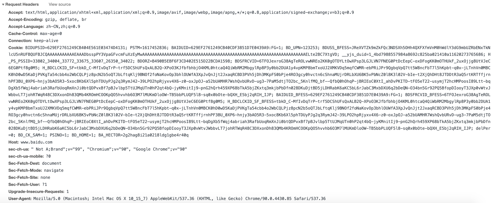

+ Accept：客户端能够接受的文件。也就是说客户端请求服务器，会告诉服务端，客户端需要什么类型的文件。请求RESTful接口的时候accept中必须要填**application/xml**或者**application/json**，否则服务器不会返回数据。
+ Accept-Encoding：这个头有一个最重要的参数**gzip**，意思是是否对返回的内容（响应体）进行压缩。
+ Accept-Language：指定了浏览器支持的自然语言。
+ Connection：keep-alive控制长链接。加上这个参数就是长连接，不加就是短连接。、
+ Cookie：把本地的cookie传给服务器，服务器需要。
+ Host：域名。
+ Referer：来源。防盗链和反爬虫会用到这个。
+ User-Agent：浏览器和操作系统的信息。

### VI、常用的响应头

先上图：

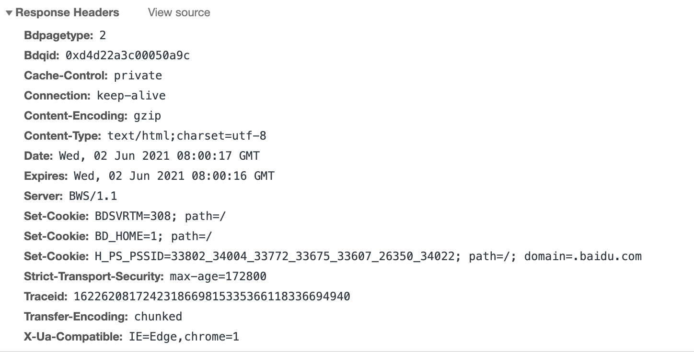

+ Cache-Control：和HTTP缓存有关。
+ Connection：keep-alive 表示服务器接受长连接。
+ Content-Encoding：gzip，对应Accept-Encoding，服务器压缩返回实体。
+ Content-Type：服务器返回的内容的格式。
+ Date：缓存时间。
+ Expires：与HTTP缓存有关。
+ Server：HTTP服务器是哪个软件。
+ Set-Cookie：服务器下发到服务端的Cookie。可以有多个Set-Cookie

## 八、Session与Cookie

HTTP是一个无状态协议，其中无状态指的是，一次HTTP事务结束之后服务器不能维持住客户端的状态，也就是说同一台客户机在第二次请求服务器的时候服务器不知道你是上一次请求的客户端，会认为是一个新的客户端请求，这就是无状态的含义。但是TCP是一个有状态的连接，但是在一次HTTP请求之后TCP连接就断开了所以HTTP并不能依靠TCP的状态。

就是因为HTTP是无状态连接，我们在登录的时候是无法维持住登录状态的，所以就需要cookie和session的机制来维持住状态。

+ Cookie是保存在客户端也就是浏览器中的一小段文本，随客户端点每一个请求发送该url下的所有cookies到服务器端。
+ Session则保存在服务器端，通过唯一的sessionID来区别每一个用户。SessionID随每个连接请求发送到服务器，服务器根据SessionID来识别客户端，再通过session的key来获取session的值。这个SessionID是要写进你的Cookie中去的。

**一般情况下是服务器生成Cookie，通过响应头中的SetCookie注入到浏览器里。极少见的情况会有在浏览器中生成的情况。**通过JS的API就可以设置cookie。

### I、Cookie的使用

一般来说浏览器在第一次访问网站的时候本地是没有Cookie的，当浏览器第一次访问服务器的时候，服务器会产生一个session记录存在服务器中，这时候必定会在浏览器中注入一个cookie，为的是维持住后续的操作。下次再访问的时候，会把cookie塞到http的请求头里面，发送给服务器。服务器接收到之后再根据实际业务的需要，对cookie进行处理（增删改）。

### II、Session的使用

先看一张图：

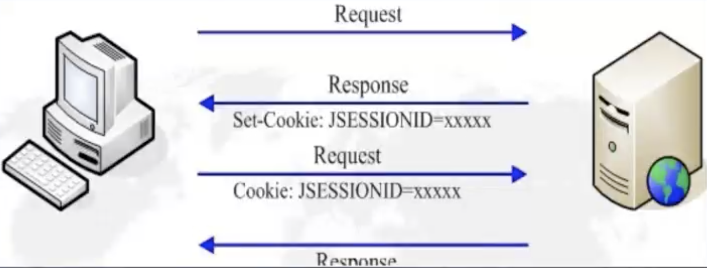

当客户端第一次访问服务器的时候，服务器发现客户端是第一次请求，就会在Session表中添加一条记录，那么服务器为了识别这一条记录，这条记录必定会有一个ID。在返回响应的时候，服务器会把这个sessionID通过Set-Cookie的值发送给客户机，那么这样服务器就完成了对客户机的cookie注入，当客户端再次请求服务器的时候，就会带着这个sessionID，后面在客户端需要登录的时候，带着sessionID，那么服务端就会在这条session记录上打上已登录的标记。当需要登录权限的时候，服务器会先检查登录标记，如果没有标记服务器会跳转到登录页。

我们会发现这种方式的安全性不是很高，那么为了提高安全性，还可以加上token，每一次请求服务器这个token都会发生改变，这样的话安全性就提高了不少。

在早期的手机浏览器中，是不支持cookie的，那么sessionID就添加到URL上，通过URL回显（WAP方式）。

总结一下Session的使用方式：

+ 使用Cookie实现
+ 使用URL参数回显

## 九、HTTP缓存机制

缓存在计算机领域无处不在，内存，硬盘、浏览器等等都有缓存，缓存的意义就在于就近原则。不用重复的去拿原始数据。因为HTTP是网络操作，网络操作都属于IO操作，IO操作是很耗时间的。所以我们需要HTTP缓存。**注意我们说的IO操作针对的是CPU，所有的输入输出都是针对CPU来说的。**

在计算机中，运算一般分为两种：一种是CPU密集型，另一种就是IO密集型。CPU密集型就是做数学运算，IO密集型就是要大量的请求服务器，很大程度上都是输入输出，所以缓存的意义是非常大的。

HTTP缓存会把最经常用到的加入到缓存里：

+ 缓存会根据请求保存输出内容的副本，例如HTML页面、图片、文件等，当下一个请求来到的时候，如果是相同的URL，缓存直接使用副本来响应请求，而不是向资源服务器再次发出请求。
+ 缓存的优点：
  + 减少延迟
  + 减少网络带宽的消耗（网络带宽是一种非常昂贵的资源）

HTTP的缓存主要有两大类：强制缓存和比较缓存。

+ 强制缓存：客户端向服务器请求一个资源，服务器会告诉浏览器一个缓存时间（保鲜期），这个保鲜期就放在响应头的Exprice上，在缓存时间内，下次请求直接使用缓存，不在时间内，执行比较缓存策略。
+ 比较缓存：讲缓存信息中的Etag和Last-Modified通过请求发送给服务器，由服务器校验，返回304状态码时，浏览器直接使用缓存，比较缓存又分为两种缓存策略：
  + Etag/If-None-Match策略
  + Last-ModiModified/If-Modifiried-Since策略

浏览器和服务器在使用缓存策略的时候，实际上是强制缓存和比较缓存同时使用。而且在使用比较缓存的时候，两种策略也同时在用。这样的话就得有一个优先级。先执行强制缓存策略，强制缓存策略失效时，再去执行比较缓存策略，这时候服务器上的资源是否发生了改变就需要使用两种比较缓存策略检查，Etag是检查文件指纹，所谓的文件指纹就是文件的MD5编码，使用MD5就是因为MD5相对可靠，因为重码率极低，Last-ModiModified是比对时间戳。

**有的时候浏览器会绕过强制缓存，直接走协商缓存**

现在我们看一张关于缓存策略的流程图：

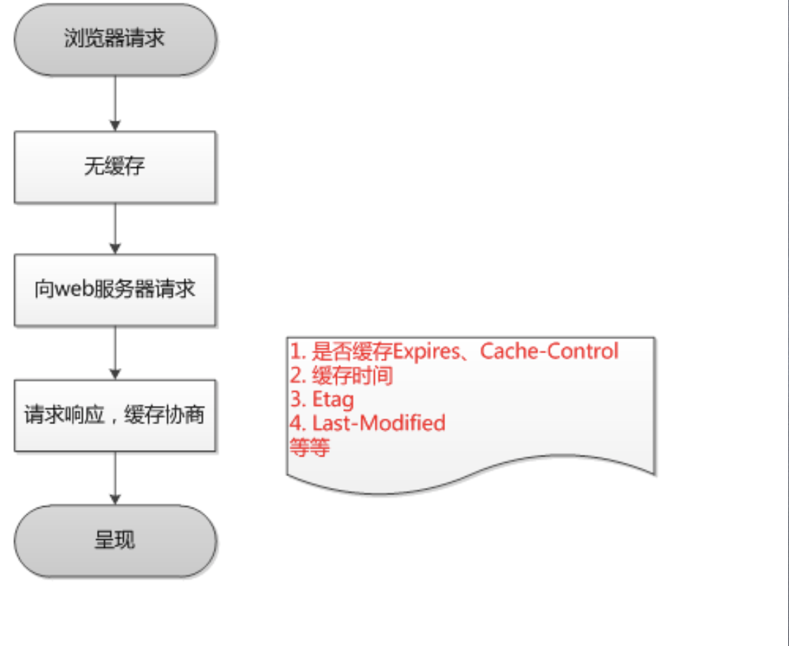

浏览器在**第一次请求服务器**的时候，本地肯定是没有缓存的，所以就向服务器发起请求，服务器肯定要返回数据和缓存协商，这时候服务器会制定缓存策略，是否缓存，设置缓存时间（Expires和Cache-Control），Etag、Last-Modifired等，浏览器接收到数据进行解析和渲染。这是第一次请求服务器，缓存是非常简单的。

然后我们再看第N次请求服务器，强制缓存和协商缓存同时使用的情况：

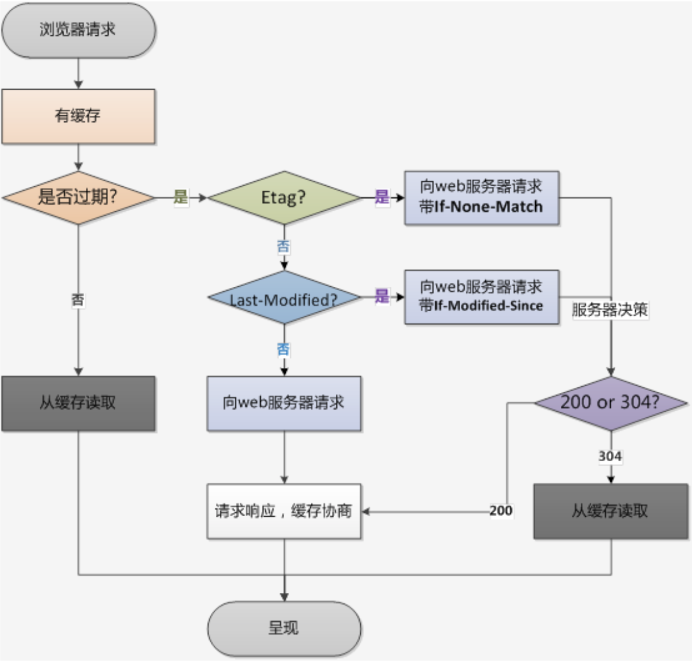

当浏览器再次进行请求的时候，要检查有没有强制缓存，如果强制缓存没有过期那就直接在本地缓存中取出数据，直接作为响应并渲染。如果强制缓存过期了，这时候我们遇到了一个问题，往往服务器在设置协商缓存时，两种策略会都带上，这时候Etag的优先级会比Last-Modified高，所以先去检查Etag策略，如果存在Etag，那么向服务器发送请求，把Etag放在请求头的If-None-Match中，服务器接收到之后与服务器上保存的md5比对，如果一样返回一个304状态，浏览器就从本地缓存里拿之后再进行渲染。如果检查Etag发现没有Etag策略，那就检查Last-Modified，如果是Last-Modified，那么就把时间戳放在If-Modified-Since中向服务器发送请求，服务器接收到之后就能检查时间戳，如果时间戳没变，返回304状态码，依然告诉浏览器缓存可用，浏览器就直接取缓存数据进行渲染。不管是Etag或者是Last-Modified如果服务器对比之后返现值对不上，就意味着服务器资源发生了变动，那么就把资源加到响应体里重新推送这个资源。这时候浏览器要进行新一轮的缓存处理，把文件从缓存里更新并且更新关联的数据。如果Etag和Last-Modify都不存在那么直接向服务器请求，这时浏览器仍然要进行新一轮的缓存处理。

**Etag和Last-Modify同时用是为了更加严密**

对于浏览器缓存这一内容，笔者认为讲的不好，还要进行跟深层次的学习，以后补充更加详细的讲解。