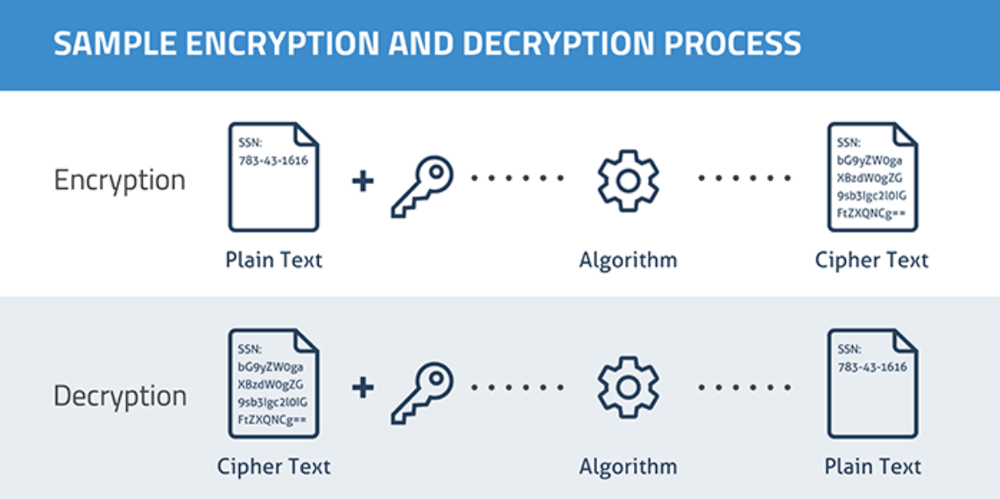
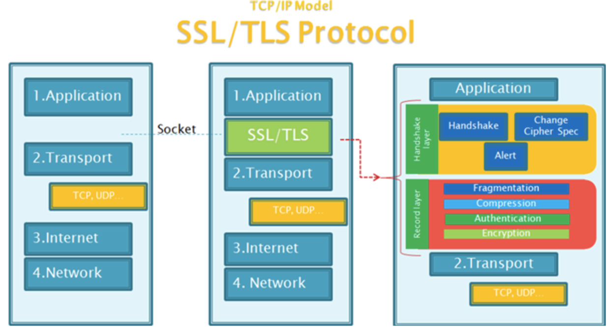
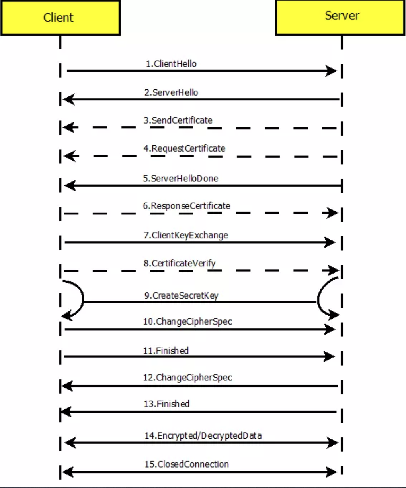
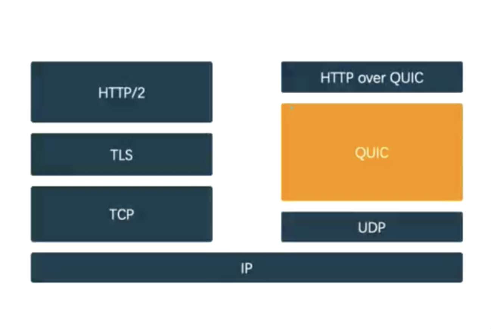
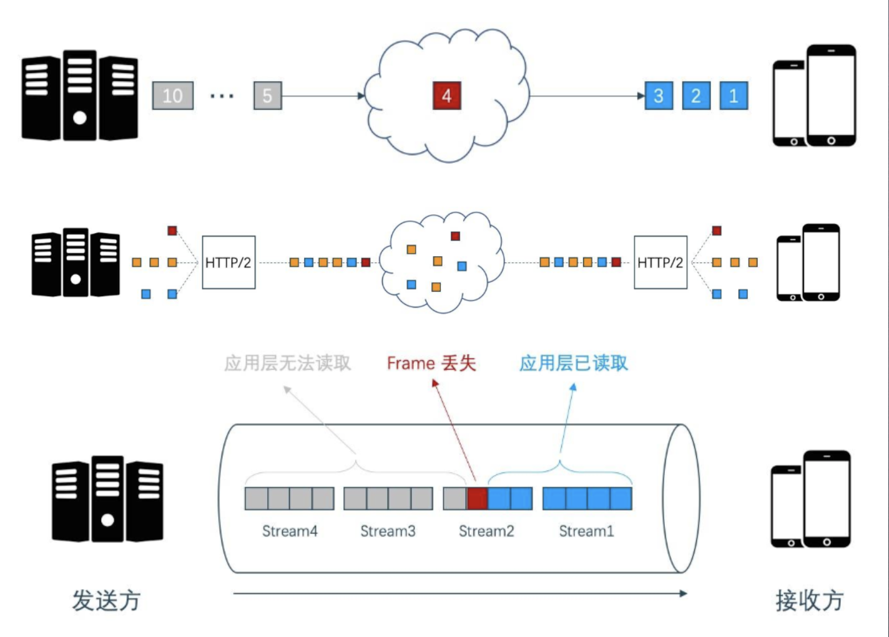

# HTTP协议那些事儿

## 零、写在前面

这篇文章我们将探讨一下内容：

+ 密码学入门

## 一、密码学入门

**密码学处理的对象是数字和字符串**，在计算机里面本质上所有的东西都是数字（二级制数字）。我们在做登录功能的时候，有时会进行md5加密，本质上md5是一种散列运算，是不可逆的。而我们一般的加密都是在做异或运算或者移位，是可以恢复的。

**散列是一种数据一旦转换为其他形式将永远无法恢复的加密形式。**一般的我们说加密，是可以正向加密成密文，然后偶反向可以根据密文解密出原文，我们看一张图片：

我们先看Encryption（加密），原始数据（Plain Text）也就是明文，加上秘钥，两者经过加密算法的处理加密成密文。然后就是Decryption（解密），密文加上秘钥经过解密算法还原出明文。这个过程就是加密和解密，需要注意的是加密和解密是一个可逆的过程，md5是一个散列的算法，是不可逆的，所以严格来说，MD5不是加密。

加密的方式分为两种：

+ 对称加密：加密和解密的秘钥相同，则是对称加密。常见的对称加密算法有：AES、DES、3DES。
+ 非对称加密：加密和解密的秘钥不同，则是非对称加密。常见的非对称加密算法有：RSA。

我们先来看对称加密，对称加密中有两个算法很像，DES和3DES，这两种算法的区别就在于DES是做一次DES运算，3DES是做三次DES运算。非对称加密需要有公钥和私钥，其中最著名的就是RSA算法，RSA是个商用的加密算法，这种算法的保密是非常严格的，不只是私钥保密就连算法本身都是保密的。但是RSA比较特殊，算法是公开的，只需要保存好秘钥就OK。

不对称加密的秘钥需要有两个，公钥和私钥，使用公钥加密，私钥解密。一般我们把公钥公开出去，加密的密文也可以公开，私钥保存好。用自己的私钥解密，这就保证了密文的安全。如果想破解非对称加密，就需要生成很多的私钥，一个个去试，所以要想破解RSA需要有强大的算力的计算机。

在密码学中，加密算法只是一部分，还有很大一部分是保证秘钥的安全性。密码学更多的是研究密码的安全。接下来我们来说一下秘钥交换算法：

### 秘钥交换算法

秘钥在交换的时候，很有可能被截获，也有可能在传输的时候被窃听，那么就要使用Diffie-Hellman，Diffie-Hellman交换算法是一种著名的秘钥协商算法，这种算法可以使得信息交换的双方通过公开的非安全的网络协商生成安全的共享秘钥。

我们设定两个人Alice和Bob，交换秘钥，看一下交换的算法（Diffie-Hellman交换算法）：

1. Alice与Bob确定两个大的素数n和g，这两个素数不用保密。注意：在密码学中找到大素数是很重要的一个步骤，一般使用椭圆算法。
2. Alice选择一个大的随机数x，并计算A如下：A = gx mod n;
3. Alice将A发给Bob。
4. Bob选择另一个大随机数y，并计算B如下：B = gy mod n;
5. Bob将B发给Alice。
6. 计算秘密秘钥K1如下：K1 = Bx mod n
7. 计算秘密秘钥K2如下：K2 = Ay mod n
8. K1 = K2，因此Alice和Bob可以用其进行加密和解密

**HTTPS的加密，TLS ，SSL就是用的秘钥交换算法。**HTTP加密的作用就是提供一个不被篡改的依据。

### HTTPS的网站证书

我们在访问HTTPS的网站时，会下载一个证书，这个证书会和你本地的证书做验证，如果验证通过就可以访问。本地的证书在安装操作系统或者浏览器的时候会添加到本地。证书可以验证服务器的身份，反过来也可以验证客户端的身份。

发证书的是具有公信力的权威的第三方机构，这个机构就是CA。中国也有自己的CA机构。根证书还可以签发二级认证机构，一旦二级认证机构的证书泄漏，就废掉二级签发机构，尽可能的把损失降低，同时这也是一种安全策略。

CA的工作流程：

+ 服务器example.com将从CA请求TLS证书，例如Digiert。浏览器通过根证书验证网站的证书是否合法。
+ Digiert将为example.com创建证书，证书将包含必要的数据，例如服务器的名称，服务器的公钥等。
+ Digiert创建证书的hash值，并使用自己的私钥对其进行加密。
+ 浏览器和操作系统自带Digiert等权威机构的公钥。
+ 当浏览器收到签名证书的时候，它将使用公钥和签名生成哈希值，它还将使用证书中执行的散列算法生成证书的散列数据。如果两个哈希值匹配（一致），则签名验证成功并且证书的可信的。
+ 现在，浏览器可以使用证书中指定的example.com的公钥继续进行身份验证过程。

## 二、TLS和SSL协议

我们先来看一张图：

这张图描述了SSL在五层协议和七层协议中的具体位置，在TCP/IP五层协议中，SSL/TLS协议是嵌入到应用层的，不属于单独的一层。但是在七层协议中是插入到应用层和传输层之间的，属于单独的一层。

+ 传输层安全协议TLS（Transport layer security）和其前身安全套接层（Secure Sockets Layer - SSL）是一种安全协议，目的是为互联网通信提供安全及数据完整性保障。TLS是SSL的后续版本，兼容SSL。
+ HTTP协议的安全性由SSL协议实现，现在的SSL是TLS的一部分，当前使用的TLS1.2版本包含了四个子协议：握手协议、秘钥配置切换协议、应用数据协议，及报警协议。我们先来说一下这四个协议各自干了些什么：
  + 握手协议：TCP在建立连接的时候本身是不能加密的，在TCP连接之后再进行加密连接握手。也就是双方进行加密协商，加密协商中最终要的东西就是秘钥交换。首先要保证链路是安全的，才能进行后续的操作。所以握手的过程是包含秘钥交换的。这也是整个过程最危险的一步。
  + 秘钥配置切换协议：在握手的时候使用的是对称加密，然后这一步骤要把对称加密切换成不对称加密。双方交换不对称秘钥。究竟用那种加密算法也在这一步协商。
  + 应用数据协议：数据该怎么进行传输
  + 报警协议：当安全性出现问题时，比如证书过期时，报警协议会报警。
  + **TLS适用于对称加密**
  + **对称秘钥可以通过安全秘钥交换算法共享**
  + **如果请求被截获，秘钥交换可能被欺骗**
  + **使用数字签名进行身份验证**
  + **证书颁发机构和信任链**
+ HTTPS协议、SSL协议、TLS协议、握手协议的关系
  + HTTPS是Hypertext Transfer Protocol over Secure Socket Layer的缩写，即**HTTP over SSL**，可以理解为基于SSL的HTTP协议。HTTPS的安全性是由SSL协议实现的。
  + SSL协议是TLS协议的前身，SSL协议是一种记录协议，扩展性良好，可以添加子协议。
  + 握手协议是SSL协议的一个子协议。

## 三、HTTPS的协议分析

我们先来看一张HTTPS协议的图：

对于HTTP的协议分析，主要是在最后的S上，也就是**TLS的握手过程的分析**，那么我们在面试中最经常问到的也就是两个握手，第一个就是TCP连接的握手，第二个就是就是TLS的握手。

那么我们就来分析一下HTTPS中TLS的握手步骤：

1. ClientHello：客户端发送所支持的SSL/TLS最高协议版本号和所支持的加密算法集合以及压缩方法集合等信息给服务端。
2. ServerHello：服务器端接收到客户端信息后，返回服务器和客户端都支持的加密算法和压缩方法返回客户端。
3. SendCertificate(可选)：服务端发送服务端的证书给客户端。
4. RequestCertificate(可选)：如果选择双向验证，服务端会向客户端请求客户端的证书。
5. ServerHelloDone：服务器端通知客户端初始协商结束。
6. ResponseCertificate(可选)：如果选择双向验证，客户端向服务端发送客户端的证书。
7. ClientKeyExchange：客户端使用服务器端的公钥，对客户端公钥和私钥种子（大随机数）进行加密。在发送给服务器端。
8. CertificateVerify(可选)：如果选择双向验证，客户端用本地私钥生成数字签名（用来验证第六步的客户端证书），并发送给服务器端，让其通过收到的客户端公钥进行身份验证。
9. CreateSecretKey：通讯双方通过秘钥种子等信息，生成通信秘钥。
10. ChangeCipherSpec：客户端通知服务器端已经将通讯方式切换成加密方式。
11. Finished：客户端做好加密通讯的准备。。
12. ChangeCipherSpec：服务器端通知客户端已将通讯方式切换到加密模式。
13. Finished：服务器做好加密通信的准备。
14. Encrypted/DecryptedData：双方使用客户端秘钥，通过对称加密算法对通讯内容进行加密。
15. ClosedConnection：通讯结束后，任何一方发出断开 SSL 连接的消息。

第一步是客户端给服务端发信息，第二步是服务端向客户端做响应，前两步是客户端和服务端进行加密协商。

接下来是三、四、五步，首要的是要把服务器的证书发给客户端，如果需要双向验证，还需要请求客户端的证书。

反过来是六、七、八步，这三步是客户端在干活了，如果客户端选择了双向验证，就需要发送自己的证书给服务端。

第一步到第八步都是明文通信还没加密。从第十步到第十三步都是秘钥的交换过程，属于协商阶段。这些完事儿之后就可以加密通信了。

从第十四步开始就是加密之后的通信，**真正的加密过程就是第一步到第十三步。**通信结束之后断开连接，要先断开加密连接也就是TLS连接，然后再断开TCP连接。

## 三、HTTP2协议分析

HTTP2对比HTTP1.1对于应用层的开发人员来书是没有任何区别的，也就是说在API上没有任何的变动，HTTP2的变动只存在于底层实现上，底层实现是实现在了浏览器层面上或者操作系统的层面上。前端不需要写协议的。这些协议都是用底层语言来写的，比如C或者C++，Golang也是可以的。

**在语义上HTTP2没有任何变化，应用层的调用也没有任何变化，变化的是数据的封装格式。**我们在上篇文章中讲到，HTTP的头信息都是以字符串的形式实现的，这种格式是不稳定的，在解析的时候很容易出错。HTTP2把头信息封装成了二进制封装，二进制更加紧凑。在处理的时候也是按照二进制的方式去处理，效率很低。

HTTP2新加了一个分帧层，是在数据结构上加的新特性，所以产生了伪头。

HTTP2的特点：

+ 使用二进制格式传输，更紧凑更高效。
+ HTTP2可以对报头进行压缩，降低开销。HTTP1.1的压缩只是对于报文体进行压缩，对于头信息是不压缩的。
+ 多路复用，一个网络连接实现并行请求。一个TCP连接可以并行的传输多个HTTP连接。
+ 服务器主动推送，减少请求的延迟。HTTP1.1只要客户端不请求，服务器是不会主动向客户端发消息的。
+ 默认使用的是HTTPS协议，也就是说默认使用了加密链路。

### HTTP2的二进制分帧层

HTTP1.1请求行和请求头信息之间没有明显的界限，请求头和请求体之间只有一个空行做界限，这是很不严密的，容易被破坏。但是HTTP2解决了这个问题，直接把请求头和请求体分为了两帧，一个是头帧，一个是数据帧。两者的分界线十分明显，是使用二进制的方式进行分割，而且还使用了一个字段描述了请求头的长度。这样就更加严密了。

### HTTP2的多路复用

在HTTP1.1中，如果想要并行发送多个HTTP请求，就要建立多个TCP连接的，这种模型会导致阻塞问题，从而造成底层TCP连接的效率低下。而且TCP的连接数也是有上限的，TCP连接的上限就是socket网络套接字的上限。这个上限是2^16-1个，实在不大。

但是HTTP2的多路复用在一条TCP链路上就可以并行发送多个HTTP请求。在HTTP1.1版本如果想用一条链路发送多个HTTP请求，必须得串行传输，这样的话如果其中一个文件在传输的时候丢包了会进行重传，那么这种情况就会导致阻塞问题。

HTTP2的多路复用本质上是一会发一个文件1的块，一会儿发文件二的块，看上去就像并行发送一样。HTTP2的多路复用减轻的是服务器的连接数的压力。本质上还是一条链路，只是这条链路上不同的事件传送的是不同的文件包。为更多的客户端提供服务。HTTP2也是会出现阻塞。HTTP1.1的阻塞是出现在传输的整个文件上，而HTTP2的阻塞是发生在传输文件的一小块上。HTTP2的阻塞叫做队首阻塞。

对首阻塞问题的本质是因为TCP连接是需要确定客户端收到了上一次的数据，才会再次传输信息。所以只要是TCP连接，一旦出现丢包问题，阻塞是在所难免的。因为客户端没有收到服务端传输的数据，那么服务端就会一直处于等待状态，阻塞也就随之发生。那么这个对首阻塞问题要怎么解决呢？这就要使用HTTP3了，因为HTTP3底层使用的是QUIC协议实现的，而QUIC协议是基于UDP协议实现的，不是TCP协议，所以自然就没有了对首阻塞的问题。

将 HTTP 消息分解为独立的帧，交错发送，然后在另一端重新组装是 HTTP 2 最重要的一项增强。这个机制会在整个网络技术栈中引发一系列连锁反 应，从而带来巨大的性能提升。

+ 并行交错地发送多个请求，请求之间互不影响。
+ 并行交错地发送多个响应，响应之间互不干扰。
+ 使用一个连接并行发送多个请求和响应。
+ 不必再为绕过 HTTP/1.x 限制而做很多工作
+ 消除不必要的延迟和提高现有网络容量的利用率，从而减少页面加载时间。

### HTTP2的伪头字段

因为HTTP2的头信息是以二进制形式封装的，所以在解析的时候和HTTP1.1就有所不同，就没有了HTTP1.1的字符串形式的头字段，所以HTTP2会使用伪头。伪头部字段是http2内置的几个特殊的以”:”开始的 key，用于替代HTTP/1.x中请求行/响应行中的信 息，比如请求方法，响应状态码等。伪头的个数也并不多一共有四个：

+ :method 目标URL模式部分(请求)
+ :scheme 目标URL模式部分(请求)
+ :authority 目标RUL认证部分(请求)
+ :path 目标URL的路径和查询部分(绝对路径 产生式和一个跟着"?"字符的查询产生式)。 (请求)
+ :status 响应头中的HTTP状态码部分(响应)

## 四、了解HTTP3

在最开始HTTP3不叫这个名字，HTTP3是后来改的，我们知道HTTP3是google开发的协议，以前叫做`HTTP Over QUIC`。意思是是建立在QUIC之上的HTTP协议。QUIC是Google基于UDP封装的一个新的协议。就是为了解决TCP的性能问题所设计的。UDP是很简洁的，不用像TCP那样建立连接需要三次握手，传输完了还需要挥手断开连接。而且UDP只管发送数据，客户端收没收到不管，但是这种处理方式是很不严密的，传过去的数据客户端到底收没收到不知道。

UDP和TCP的区别就像我们到邮局寄信，分平信和挂号信。UDP就相当于平信，TCP相当于挂号信。

`其实挂号信，更像QUIC。`QUIC不需要握手，同时严密性也能满足要求。QUIC在发送信息之前，会发送一个探测包，来检查链路是不是通的。而且QUIC会对单独的数据包进行加密，也保证了数据的安全性。而TCP是在链路上加密，明显QUIC效率高。另外QUIC是不存在链路的，也就不会依赖链路。TCP如果出现链路问题，数据是不肯能发送成功的。QUIC除非物理链路出现问题，不然是不会在链路上出问题的。

**QUIC所在的层：**

我们先来看一张图

从图上我们可以看出QUIC是跨多层的，跨了UDP，在UDP之上加了验证机制，在网上加了加密机制，再往上加了封包机制，再往上才是HTTP的实现，如果在七层模型上，QUIC是处于第二层和第三层的。通过上文的描述我们可以得出：QUIC 协议(Quick UDP Internet Connection)基于 UDP，正是看中了 UDP 的速度与效率。同时 QUIC 也整合了 TCP、TLS 和 HTTP/2 的优 点，并加以优化。

HTTP3的特点：

+ 减少了握手的延迟(1-RTT 或 0-RTT)，只需要最多一次握手，也就是最先的那一次（探测包）。
+ 多路复用，并且没有 TCP 的阻塞问题。基于UDP，所以服务器不会等待确认消息。
+ 连接迁移，(主要是在客户端)当由 Wifi 转移到 4G 时，连接不 会被断开。

由此我们可以想到HTTP 3与HTTP 1.1和HTTP 2没有直接的关系，也不是http2的扩展。HTTP3也将会是一个全新的WEB协议。HTTP3目前还处于测试和定制阶段。

[HTTP3官网](https://www.chromium.org/quic)，HTTP3国内也有很多公司研究BAT等公司。

## 五、对首阻塞问题

首先明确一个概念，不管是HTTP1和HTTP2都存在队首阻塞问题，队首阻塞问题是由于TCP连接的特性决定的。不同的是HTTP1的对首阻塞是对于整个文件的阻塞，HTTP2的对首阻塞是发生在传输文件的一个数据块上发生的。

关于HTTP1和HTTP2队首阻塞的不同，我们来看一张图：

我们先看第一张图的第一部分，这一部分是描述的HTTP1.1的队首阻塞问题，当发送一个文件的时候出现丢包，客户端会一直等待，后面的其他文件也会一直阻塞。第二部分的HTTP2的队首阻塞则完全不一样。HTTP2是把要传送的多个文件分为小块儿，分别发送，多路复用。其中一个小块发生丢包之后，只会阻塞那个小块所在的文件，不会影响到其他文件的传输。所以说HTTP2是在一定程度上解决了队首阻塞的问题，而不是彻底解决。

HTTP3则是完全解决了队首阻塞的问题，UDP在传输的时候是不按照顺序传送的，只不过会给每个数据包都标上序号，客户端接收到之后会按照序号进行组装，如果这中间出现了丢包的情况，客户端会要求服务器重传。

相比QUIC，为什么HTTP2会慢很多，最重要的原因就是TCP是要建立连接的，这个协议分为两层，第一层是传输的TCP链路，第二层是加密链路，HTTP2是对链路加密的，所以是要把所有传输的数据都收集齐全，然后再对链路进行解密。这就缓慢了很多。而QUIC是不面向连接的，而且QUIC传输的单位是数据包，加密的单位也是数据包，又不需要建立连接，客户端接收到数据包就可以对其进行解密，这就避免了TLS层面上的阻塞。QUIC基于UDP，UDP数据包在接收端没有顺序，即使出现丢包，要求服务器重传就可以，不会阻塞整个链路。相比之下QUIC效率高了很多。

## 六、HTTP与反向代理

### I、什么是代理，什么是反向代理？

上图就形象的描述了正向代理和反向代理。

正向代理是局域网里的客户机不能访问局域网之外的网路，如果想访问需要通过一台代理服务器，这台代理服务器是可以访问局域网之外的网络的，客户机先访问代理服务器，由代理服务器访问局域网之外的网络。举个例子，比如说我们想访问掘进的服务器，要先在客户机上设置代理服务器的IP，设置好代理服务器的IP之后要想访问掘进的服务器，我们要先访问代理服务器，代理服务器收到你的请求之后，代理服务器帮你请求掘金的服务器，请求回来之后，暂存到代理服务器上，然后再发送给客户机。

反向代理正好和正向代理相反，如果一个局域网之外的机器想要访问局域网之内的服务器，内网出入口就一个，想访问就得通过这个内网的入口（出入口就是一个IP），但是通过这个IP进去之后里面有很多机器，每台局域网中的机器都有自己的IP，怎么才能访问到一台具体的机器？这个时候还是需要一台服务器，这个代理服务器收到请求之后，需要查看一下这个最终是访问哪一台机器的，然后再转发到目标服务器上。这就是反向代理。

### II、反向代理的用处

+ 加密和SSL加速
+ 负载均衡
+ 缓存静态内容
+ 压缩
+ 减速上传（晚点返回确认包）
+ 安全（当做堡垒）
+ 外网发布

### III、Nginx的配置和运行

+ 在Linux下的两种安装方案:yum/apt安装、源码编译安装（源码编译安装一般用不到）
+ yum安装：
  + rpm -Uvh http://nginx.org/packages/centos/7/noarch/RPMS/nginx-release-centos-7-0.el7.ngx.noarch.rpm这一步是添加源。
  + yum install -y nginx
+ 编译安装：
  + 准备环境:Linux服务器、gcc编译器、nginx源代码
  + 获取nginx源码:http://nginx.org
  + 编译安装nginx源码
+ 配置规则

需要注意的是：

+ 不要使用编译安装，太麻烦了。
+ yum安装的时候如果是自己的Linux机器，需要先添加源。
+ 如果在VPS上安装则不需要添加源，直接执行yum install ...
+ 安装好之后需要配置nginx，配置nginx之前，一定要先把配置文件（nginx.conf）备份，防止配置失败之后回退。
+ 只要是通过yum安装的nginx，配置文件都在/etc/nginx下。 
+ 配置文件中的work_process设置为你机器cpu的核心数。
+ 配置HTTPS需要把证书（pem）和私钥（key）的文件放在配置目录的同级目录下。

