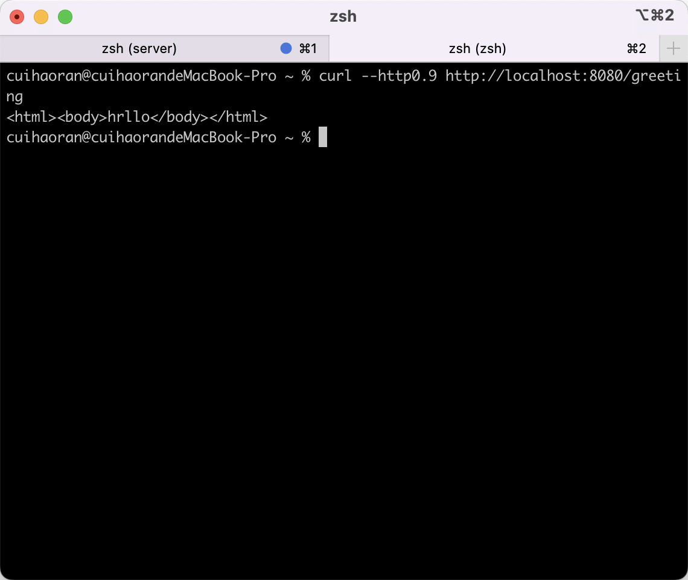

# HTTP系列详解——HTTP/1.0：四个基本元素

## 前言

本篇文章主要介绍HTTP的发展历史，同时会通过GO语言运行一个简单的HTTP服务器，并且使用`Curl`做客户端，以此来清晰描述HTTP 1.0的基本语法和四个基本元素。


## HTTP版本的时间节点

+ 1990年——HTTP0.9
+ 1996年——HTTP1.0
+ 1997年——HTTP1.1
+ 2015年——HTTP2.0

这里要注意一个问题HTTP 0.9是HTTP 1.0收到关注之后才命名为HTTP 0.9的。

## GO语言实现HTTP服务器

新建一个server.go文件

```go
package main

import (
	"fmt"
	"log"
	"net/http"
	"net/http/httputil"
)

func handle(w http.ResponseWriter, r *http.Request) {
	dump, err := httputil.DumpRequest(r, true)
	if err != nil {
		http.Error(w, fmt.Sprint(err), http.StatusInternalServerError)
		return
	}

	fmt.Println(string(dump))
	fmt.Fprintf(w, "<html><body>hrllo</body></html>\n")
}

func main() {
	var httpServer http.Server
	http.HandleFunc("/", handle)
	log.Println("start http listening on 8080")
	httpServer.Addr = ":8080"
	log.Println(httpServer.ListenAndServe())
}
```

然后在终端运行这段代码：

```bash
$ go run server.go
```

终端显示：


这就证明我们的HTTP服务器已经运行起来了。接下来我们使用`curl`来模拟一下HTTP 0.9的请求。

重启一个终端，然后输入以下命令：

```bash
$ curl --http0.9 http://localhost:8080/greeting
```

得到的结果如下：



根据上面服务器的代码所示，这是显而易见的，会得到一串html字符串。

可以看到HTTP服务器的终端会输出以下内容：


我们再用curl发送一个http 1.0的请求：

```bash
$ curl --http1.0 http://localhost:8080/greeting
```

服务器的结果如下：


我们分别把HTTP1.0和HTTP0.9的结果进行对比：

### HTTP 0.9的响应结果

GET /greeting HTTP/1.1
Host: localhost:8080
Accept: */*
User-Agent: curl/7.79.1

### HTTP 1.0的响应结果

GET /greeting HTTP/1.0
Host: localhost:8080
Connection: close
Accept: */*
User-Agent: curl/7.79.1

会发现HTTP1.0的响应结果多了一个响应头——Connection，这个响应头的含义是