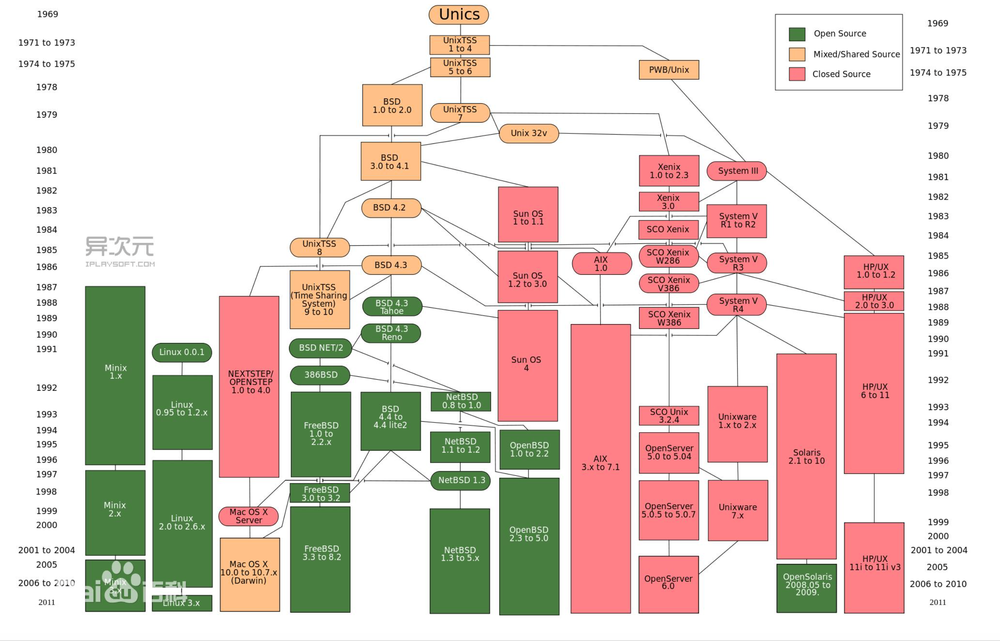
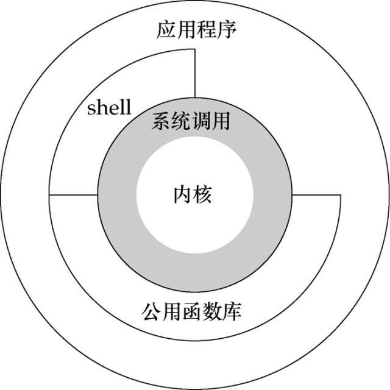
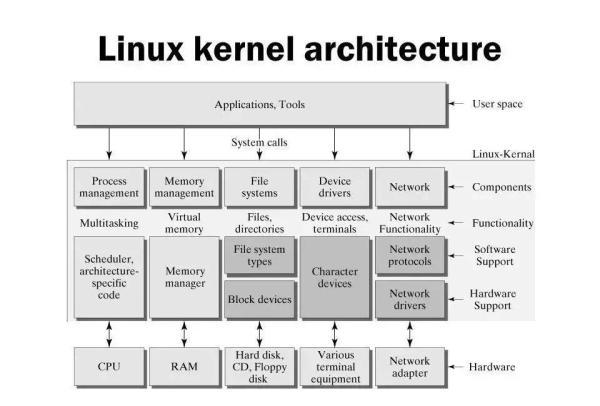
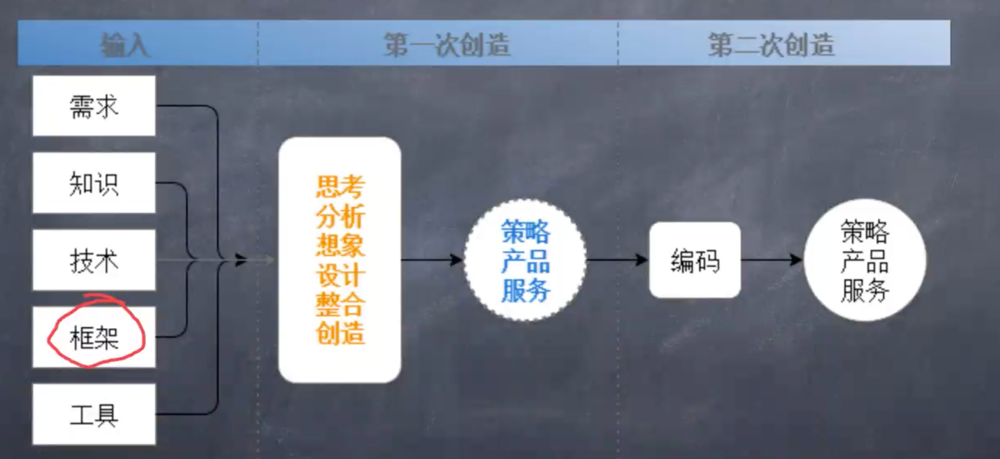

# 操作系统与后端语言核心

## 零、前言

### I、什么是操作系统

操作系统（operation system，简称OS）是管理计算机硬件与[软件](https://baike.baidu.com/item/软件/12053)资源的[计算机程序](https://baike.baidu.com/item/计算机程序/3220205)。操作系统需要处理如管理与配置[内存](https://baike.baidu.com/item/内存/103614)、决定[系统资源](https://baike.baidu.com/item/系统资源/974435)供需的优先次序、控制[输入设备](https://baike.baidu.com/item/输入设备/10823368)与[输出设备](https://baike.baidu.com/item/输出设备/10823333)、操作网络与管理文件系统等基本事务。

##  一、操作系统概述

### I、操作系统概述

* 讲讲操作系统
  * 哪些古老的操作系统
  * 更适合工作和娱乐的windows
  * 适合开发的Linux
  * 非常好用的MacOS
* Ubuntu、CentOS、redhat、Fedora、Debian哪个比较好？
  * Ubuntu的桌面比较好看，开发Android可以使用Ubuntu，因为Google官方推荐使用的就是Ubuntu系统。
  * CentOS比较适合服务器，这里说的是CentOS7，CentOS8好多命令有变化，并且已经走向了商业化。CentOS本身也是在redhat基础上编译过来的。
  * Redhat系统是一个商业的Linux系统，提供商业服务，虽然开源，但是得不到商业服务。
  * Fedora也是脱胎于红帽（Redhat），是一个技术比较激进的分支，新的技术会比较早的运用到Fedora上，成熟之后Redhat会把这些技术运用到Redhat系统上去。另外CentOS、Redhat和Fedora用的软件源是相同的。
  * Debian是Ubuntu的老爸，也就是说Ubuntu是Debian的一个分支。欧美国家用的比较多。
  * Ubuntu的体系（Ubuntu、Debian）和Redhat（CentOS、Redhat、Fedora）的体系中的系统有些命令是不一样的，比如说包管理命令、服务管理命令。

### II、Unix操作系统的历史发展图谱



Unix最早是由贝尔实验室开发出来，然后进行了商业化，在Unix商业化之后，又出现了BSD分支，现在BSD分支又分为三个分支，分别是`Open BSD`、`Free BSD` 、`Net BSD`。我们所熟悉的MacOS就是基于`Free BSD`的。所以Mac是Unix系统！

大名鼎鼎的Linux系统不属于Unix，但是两者的底层架构和系统调用（API）是极为相似的，所以Linux系统又称为`类Unix系统`。

这个体系图上唯独没有Windows系统的影子，那是因为Windows不配出现在这张图上！

此外我们再涂上还可以看到一个奇怪的东西，那就是`Minix`，也是一个类Unix系统，最早的Linux的作者是看到了Minix系统觉得很棒，所以就开发了Linux！相传windows的CPU中有一个后门，那里面就跑着一个Minix！

我们需要知道一件事情，那就是Intel的CPU是分权限的，根据不同的权限可以访问到不同的层！最里面的是R0层，一共分了R0、R1、R2、R3层。咱们的操作系统跑在第0层，普通的程序跑在R3上。中间的两层没有用到。R0层是操作权限最高的，R3层操作全下最低。在R0上可以使用所有的CPU指令，但是神奇的是Intel芯片的后门，也就是哪个Minix系统跑在了负1层！

右面的一些系统都是一些大厂家在用的商用Unix。比如Unixware、HP/Unix。一般Android开发在Linux上，Google官方推荐的系统就是Ubuntu。但是国内的Android开发一般都是在Windows上。

### 远程登录Linux

我们在操作服务器的时候肯定是要使用到远程登录的，在我们本地的机器上，远程登录到我们的服务器上，进行部署等等。那么远程登录就需要用到ssh命令，所以在不同系统上我们就需要不同的工具来执行ssh命令：

+ Windows
  + putty
  + Xshell
  + Cmder终端（笔者推荐，感觉比较好看。。。）
  + PowerShell
+ Linux和Mac上
  + 终端直接执行ssh命令
  + iTem2（Mac）

**远程登录的ssh命令**

```javascript
// ssh 用户名@主机名，主机名就是服务器的IP
/*
* 主机名分两种：
* 1. 服务器的域名
* 2. 服务器的IP地址
*/
$ ssh username@hostname
```

这里需要强调一个事情，如果使用服务器的域名来远程登录服务器，千万不要带协议，也就是说**不要**写成：

```
$ ssh username@http://hostname
```

如果想在两台不同的Linux机器之间传文件或者目录，可以使用`scp`命令。

```
$ scp ./xxx.zip username@hostname:/opt/backup
```

scp后面空格跟一个是当前机器上的文件或者目录，然后空格，填写的是上传到什么地方去，填完ip之后，最重要的是要紧跟一个冒号，这个冒号不能丢，丢了会报错，最后冒号后面紧跟目标服务器的目录。


## 二、重要的常用Linux命令

### I、常用命令概述

* 行编辑器Vi
* 服务器管理命令 systemctl
* 网络管理命令
  * ifconfig
  * ip
  * router
* 命令行下载命令
  * curl
  * wget
* 怎样查看Linux命令的帮助
* 在终端不小心Ctrl + S了怎么办？

### II、Linux常用命令详解

* systemctl

```
$ systemctl
```

systemctl是把当前系统下所有的服务都列出来，列出来之后敲空格是上下翻页，也可以使用上下箭头。退出按Q。

另外我们还需要记住几个子命令：

```
$ systemctl status
```

这条子命令可以按照树状结构，列出所有的服务。

```
$ systemctl status 服务名
```

这条子命令可以查看特定服务的状况，比如我们想要查看nginx服务的状况就可以这么写：`$ systemctl status nginx`。

```
$ systemctl stop 服务名
```

这条子命令可以停止某项服务，但是执行之后不会有任何反馈，那么我们想要知道是否停止成功的话，我们需要再次执行`systemctl status 服务名`这条命令，来查看是否已经停止服务了。

```
$ systemctl start 服务名
```

这条子命令可以启动某项服务，但是执行之后仍然不会有任何的反馈，那么如果想要知道是否启动成功，方法和stop命令是相同的。

```
$ systemctl restart 服务名
```

这条子命令可以重启某项服务。同样的执行之后你不会有任何反馈。

* ifconfig和ip

这两条命令都是获取当前的网络IP的，为什么有两个呢，那是因为ifconfig只在旧版本的CentOS（CentOS6之前）上才有，新版本的CentOS上使用的是ip命令。Ubuntu这两个命令都是可以的。

```
$ ifconfig

$ ip addr
```

* curl和wget本质上是命令行里http协议的支持工具，所以我们一般用它来从网络上下载东西。

如果我们想下载百度的logo，我们就可以这么操作：

```
$ wget https://www.baidu.com/img/PCtm_d9c8750bed0b3c7d089fa7d55720d6cf.png
```

但是我们需要注意一个问题，新装的Linux系统中可能没有这个命令，解决方法就是安装wget软件包：

```
$ yum install wget
```

如果没有wget命令可以使用curl：

```
$ curl http://www.baidu.com -o baidu.html
```

我们可以发现使用curl下载与wget不同的是我们需要手动加上-o才能下载下来，如果不加-o，只会把要下载的内容以文本的方式显示在终端上，并不会保存成一个文件，-o就是output的意思。并且会把下载的内容命名为baidu.html。

curl用起来稍微比wget麻烦一点，但是curl要比wget的功能强大很多。

另外wget可以当做爬虫来用：

```
$ wget https://www.baidu.com -r
```

 加上一个`-r`，可以对百度整站进行递归下载，从而能把百度首页全站的东西下载下来。

* 使用windows的兄弟会发现在终端下使用ctrl + S会锁定终端，怎么键盘都没有反应。解决方法就是按`ctrl + q`。


### II、常用Linux终端快捷键

+ ctrl + c	结束正在运行的程序
+ ctrl + d    结束输入或退出shell
+ ctrl + s    暂停屏幕输出
+ ctrl + q    回复屏幕输出
+ ctrl + l     清屏，等于clear
+ ctrl + a/ctrl + e    快速移动光标到行首/行尾


### III、进程管理的相关命令

+ top命令详解
+ ps命令详解
+ kill、pkill命令及使用注意事项
+ w命令


```
$ top
```

top命令是文本模式的任务管理器，PID是进程ID，VIRT内存的消耗。类似于mac上的活动监视器。

```
$ kill 进程号

$ pkill 进程的名字
```

kill和pkill命令都是用来杀死进程的，所不同的是kii命令是用进程号来杀死进程，而pkill是利用进程的名字来杀死进程。

w命令是会输出当前系统上有谁登录上去了。

## 三、Unix、Linux的体系架构



这张就是Linux的体系架构图，最内部的圆就是系统内核也就是我们在第一次讲Linux的时候所提到的kernel，往外一层是系统调用，也就是我们平时所接触到的系统的API，只不过在操作系统层面它叫做系统调用。接着往外是shell和公共函数库，shell就是我们使用的shell黑窗口，执行shell命令的东西，我们在使用Linux或者Unix系统的时候最常用的方法就是通过shell来进行对系统的使用。公共函数库我们不需要做太多的研究，都是一些C语言写的程序（实际上是笔者也没研究过，不会）。最外层是应用程序层，在这里就是一些我们熟悉的像nginx、apatch、mysql、Java等等这些。

这里要说一个事情，与Windows不同的是，Windows的可视化界面是嵌入到系统内核的，但是Linux的可视化界面在应用程序层，这也是我们为什么会觉得Linux的可视化界面不稳定的核心原因，但是作为单纯的操作系统，Linux还是十分稳定的。

Linux在运行系统调用的时候就处于内核模式，在运行应用程序的时候就处于用户模式。

### I、Linux体系结构

先上一张Linux分层的体系结构图



图我们一定要学会分层看

* 第一层，Applications、Tools这一曾是应用程序和工具层，主要是运行应用程序和我们的一些工具。属于用户空间。
* 第二层，属于内核空间：
  * Conponents对应的层，也就是`Process management（进程管理）`、`Memory management （内存管理）`、`File System（文件系统） `、`Device dirvers（设备驱动）`、`Network（网络）`这五个子系统。
  * Software Support、Hardware Support底层的支持。
* Hardware底层硬件。

Linux系统也是根据这个层级逐层调用。我们来看这个图所描述的各层之间的调用关系，你会发现有单项箭头也有双向箭头。这表示了用户层只能调用内核的系统调用，但是内核不能调用用户空间的东西。但是内核和硬件之间是可以相互调用的。

我们现在不需要关心第一层和第三层，主要研究的是第二层。

### II、Windows体系结构

下面我们来看一下Windows系统的架构图：


Windows操作系统和Linux操作系统一样分为用户模式和内核模式，但是Windows要比Linux复杂的多，这也就造成了Windows系统在早期版本中不稳定。Windows是混合内核而Linux是宏内核。

到这里，操作系统的讲解告一段落。


## 四、关于开发

我们平时有没有想过一个问题，那就是同样都是会同一门语言，别的的程序写的既复杂有好，但是自己的既简单又low？这其实是一个编程思维的问题。

### I、编程的思路从哪儿来？

为了解决这个问题我们先来看一张图：



有些读者喜欢一上来了解需求之后，把重点放在了框架上，可是不对的。

我们先说输入的部分，所谓输入就是我们需要掌握什么，需要会些什么东西：

+ 需求：这个其实很好理解，需求就是这个产品要做成什么样子就是需求。
+ 知识：知识是技术的基础，知识一部分来自于课堂书本，一部分来自于社会实践。大概包含以下几个方面：
  + 数学
  + 物理
  + 沟通和交流
  + 。。。。
+ 技术：这里的技术不是单指的编程语言，技术实际上指的是计算机领域内的基础学科，基本包含以下几个方面
  + 数据结构
  + 算法
  + 操作系统
  + 计算机组成原理与计算机体系结构
  + 操作系统
  + 数据库
  + 编译原理
  + 浏览器的有关知识
+ 框架：打个比方框架就像是建筑图纸，是一个架子，只需要你去在上面填东西。前端的框架很多，但其实认真研究三五个框架，就会发现每个框架的背后本质都是大同小异。所以我们在接触框架的时候一定要弄清楚他的背后的实现原理和实现细节，而不要知识满足于怎么使用。
+ 工具：这个就很简单了，所谓工具就是我们拿来即用的东西。

这几个方面中，重要的是知识和技术。这两个东西使我们要绝对把握的。

至于后面的思考、分析、想象、设计、整合、创造，这些是在工作和学习中不断的摸索出来的。经过学习不断的灌输到脑海里。这是一个潜移默化的过程。

至于编码，则完全是一个体力劳动，没什么可说的，也是整个过程中占比最少的部分。

### II、面向对象的思想

**计算机编程的两个方法：**

+ 面向过程
+ 面向对象

在前端中我们最常用的就是JS，前几年微软出了一个TS，我相信还有部分读者没有用过。但是JS不是面向对象的编程语言，尽管他也有new关键字，class类，不过这些都是语法糖，与传统意义上的面向对象编程还是有区别。

面向对象和面向过程的区别是什么？

面向对象是一件事”让谁去做“，面向过程则是”一件事该怎么做“。面向对象中的那个”谁“就是对象，至于对象该怎么做，那是对象内部的逻辑我们不用关心，只是对象自己的事儿，只要是所有的对象合力把事情做好就行。

面向对象的三大特征：封装、继承、多态。

常用的后端语言：

+ Java
+ Python（抽空学一下）
+ PHP
+ GoLang（有机会一定要学一下GoLang）
+ C#

关于PHP的优缺点：

+ 开放源码、免费
+ 开发快捷，入门快
+ 跨平台，配置简单
+ 开源框架丰富
+ 面向对象
+ 多线程支持不好
+ 编码规范不统一
+ 语法不严谨

PHP的框架

+ ThinkPHP
+ YII

**宝刀不老的JAVA**

+ 重量级开发语言
+ 面向对象
+ 强类型、动态语言
+ 跨平台、高移植性
+ 稳定、安全性高
+ 各种类库十分丰富

**微软的亲儿子C#**

+ 微软公司发布
+ 安全稳定
+ 面向对象
+ 开发高效
+ 依赖.NET

**万能胶Python**

+ 免费开源
+ 完全面向对象
+ 语法简洁
+ 语言本身是可扩充的
+ 扩展类库丰富
+ 某些情况下跨平台较差

**后起之秀GoLang**

+ Google的亲儿子
+ 全新的语言
+ 编译型的语言
+ 运行速度接近C
+ 可能会应用于浏览器，可能挑战JS

**Go语言的特性**

+ 编译和执行速度极快
+ 静态类型语言
+ 支持完全垃圾回收
+ 支持多核CPU运算
+ 非常适合后端大型程序

**前端第四大语言——WASM**


