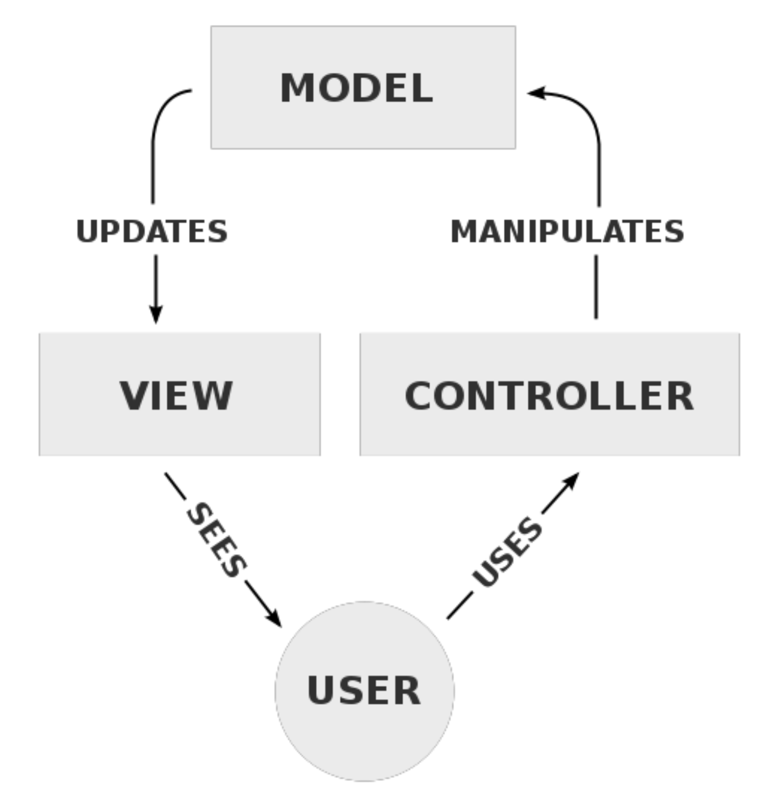
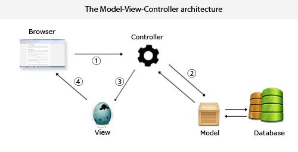
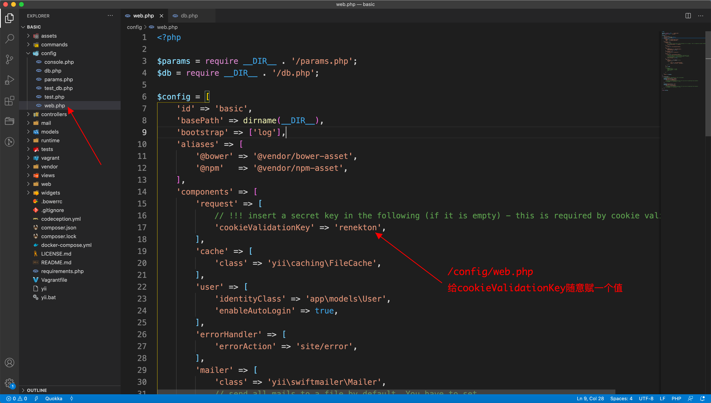
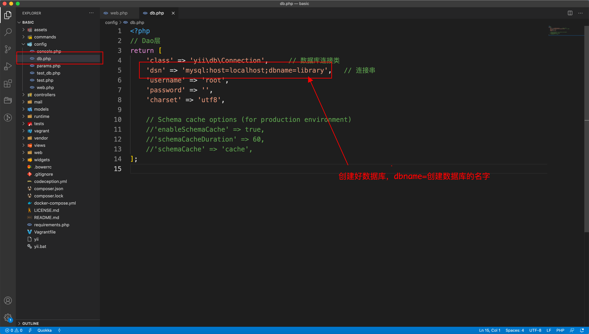
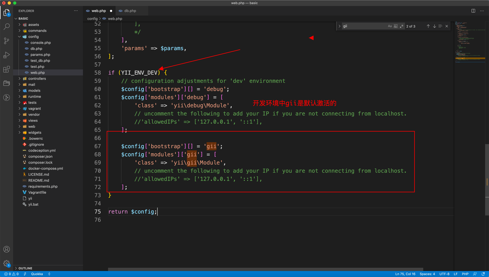
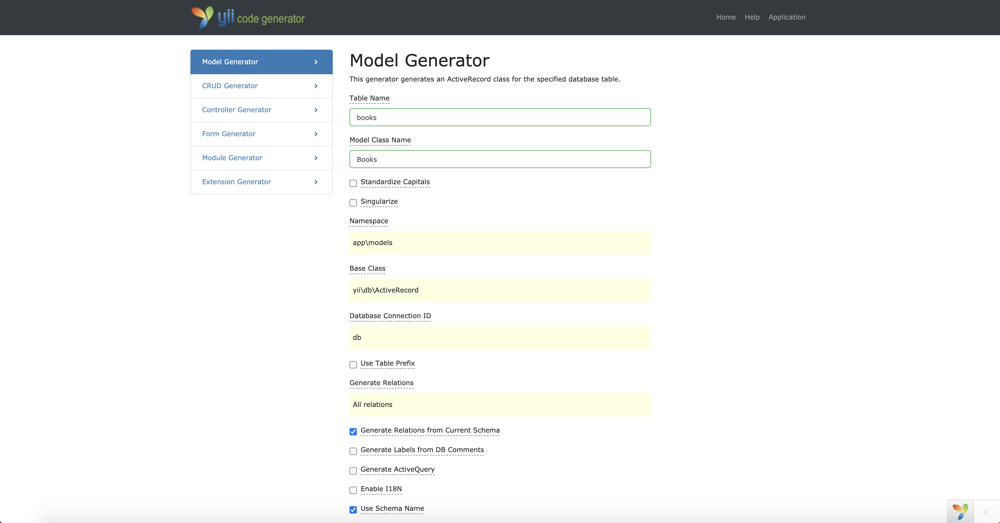
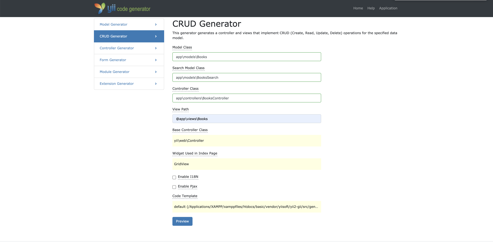

# 前端架构分离之后端开发

## 零、前言

作为现代的前端，市场对我们的要求更加高，这就使我们需要懂一些后端的知识，这篇文章就是从传统的后端角度出发，做一个单体应用，从而让前端知道传统的前后端不分离的项目是怎么搭建的。

## 一、MVC模式

MVC是一种最常见的经典的程序设计模型。在以前webAPP还不是很成熟的时候，很多复杂的系统都是C/S模式的。C代表客户端（Client）S代表服务端（Server）,随着WebApp的逐渐成熟，现在更多的采用B/S模式，B代表的是浏览器（Bower），S代表服务端（Server）。在CS模式下，一些管理系统的大部分业务逻辑都放在了C端，S基本就当做数据库来用。如果是一些复杂的系统，S端就比较复杂，会有很多业务逻辑。

在以前的开发中，大多数都是经典的三层结构：

+ UI层
+ 业务逻辑层
+ 数据持久层

UI层就相当于现在的前端，业务逻辑层相当于后端的业务逻辑，也就是这个程序要做什么工作，数据持久层就是数据库。

现在的BS结构，是浏览器加服务端，显然浏览器只能负责UI层的逻辑，那么只能把业务逻辑层和数据持久层挪到后端里面去。在上个世纪还没有Java和PHP这种Web框架的时候Web程序是拿C语言写的，当时的apach就是一个web容器，如果想实现一个动态网站那就需要用C语言写CGI程序交给apach去调用。也就是说一个CGI模块会往外吐一个页面，显然这种开发的方式是很麻烦的。后来就产生了ASP、JSP等等。

随着互联网的发展，开发人员也逐渐摸索出来了一些开发的经验，逐步的成为设计模式，MVC就是其中之一。

MVC只是一个简称，实际上对应了三个东西：

+ Model（模型）
+ View（视图）
+ Controller（控制器）

除了MVC其实还有一个角色被我们忽略了，那就是用户（USER）。

下面我们来看看MVC模式的流程图：



MVC模式想要运转起来，是少不了用户的操作的，平时所说的MVC只是静态的来看，但是只有把用户加进去才能理解的更加透彻。在以前没有前后端分离的概念时，所以有的程序都是在后端，页面也是后端拼好之后，发给浏览器，然后浏览器进行渲染，所有的程序都集中在一起，这种程序叫做单体应用。

下面我们就MVC来简单解释一下这三个部分各自都是做什么的：

+ M（Model）：模型，指的是数据模型。数据从数据库中来，那么这个model就是和数据持久层也就是数据库打交道的。Model里面可以带有逻辑，但是主要逻辑不再这里而是Controller
+ C（Controller）：控制器，控制的是数据的流向，也就是说控制着数据从哪里来，应该把数据送到哪里去。
+ V（View）：视图，这个视图并不是我们最后在浏览器中看到的东西，准确的来说这里的View是把视图的模板和数据结合在一起的一个控制器，也可以说是一个模块。View控制器输出的东西才是最后我们看到的视图！

现在我们所看到的的MVC模式是一个静态的，要想让MVC运转起来需要有用户的操作，在讲这一部分之前，我们需要先说一下计算机程序的本质：**计算机程序的本质是数据 + 操作**。我们在学习计算机基础的时候也会知道`程序 = 数据结构 + 算法`，正好可以对应上。

Model是表示业务模型的，模型就是真实世界在计算机中的映射。View里既有数据又有算法，根据数据来更新界面。Controller是对流程的控制，从哪里拿到数据，送到哪里去，这是典型的操作部分，可以归入算法里面。 

### MVC详解

为了讲清楚MVC模式怎么运转，我们来举一个登录表单提交的例子说明：

首先我们要给上面的流程图划分为两个部分，一个是MVC部分，另一个是用户（user）部分。对应了B/S结构，USER肯定是在B端（浏览器）与程序进行交互，那么第一个问题就来了：交互的页面是从哪里来的？

**交互页面的来源**

交互页面试View模块的输出，View模块是在服务器端实现的。在服务端生成页面，用户通过HTTP协议进行访问，浏览器把页面推到浏览器里，用户才能看见页面，才能操作。

**正常的MVC流程**

用户得到登录页面之后，进行操作，输入用户名和密码，点击登录。点击登录的这个事件是发生在浏览器中的，但是浏览器会把登录的这个动作通过HTTP协议发送到服务器上（携带用户名和密码，请求登录的接口），服务器上经过路由的处理，转发到对应的controller上来，我们叫这个controller为`loginController`，loginController一看这个动作是给自己的，那么loginController就会检查用户给他的这个数据是不是自己能够处理的，也就是说在这一步loginController会检查数据的合法性。如果是合法的，我就把数据转送给`Model`，我们知道Controller的作用只是用来控制流程的，不能直接操作数据库，我们拿到用户的数据不能只是在内存中放着，我们还要做数据的持久化，也就是说我们的目的是要把数据经过处理之后存起来，所以我们要把数据转给Model，告诉Model要把数据保存到数据库里。这样我们的就完成了用户提交数据的保存，但是我们不能只是把数据存到数据库中就完事儿了，我们还要告诉用户的处理结果是什么样的。不过关于用户登录的这一块不一定只存在一个Model，还可能存在着其他的Model，比如说拿到用户名和口令（注意不是密码），我们可能会根据用户名去除数据库中的口令与用户提交的口令做对比检查，看是否正确，正确之后才能允许登录，那么取出口令这一数据库操作就是另一个model来做。登录成功之后我们会得到成功的信息，成功信息的得到也是由model来做，所以model拿到数据之后，要通过Controller来控制把数据塞到哪个页面（也就是View的模板）中，View收到了Controller的命令，来组装页面，页面组装完成之后，才能通过HTTP的响应回传到用户的浏览器中进行显示。

上面这些是正常情况，还有很多一场情况，例如服务器的内部异常，就会终端正常的流程，所以在写服务器程序的时候，我们要注意容错，发生错误的时候要有一个友好的错误页面。

通过上面的详细解读，我们可以得出，这种架构就是设计了数据的流向。程序的本质也就是控制数据的流向。

**四句话总结MVC流程：**

+ Controller截获用户发出的请求
+ Controller调用Model完成状态的读写操作
+ Controller把数据传给View
+ View渲染最终结果并呈现给用户

我们再看一张mvc的图示：



+ 步骤一：用户操作浏览器，把数据传到服务器上，承载在HTTP的请求中。
+ 步骤二：Controller截获用户的请求拿到用户请求的数据，然后去调用Model。把数据塞给Model，然后告诉Model保存数据，Model就把数据保存到数据库中，数据库会把报错的结果告诉Model，然后Model就得到了保存的状态（成功或失败），然后就会把登录状态告知Controller。
+ 步骤三：Controller根据数据决定哪个模板，把数据塞到模板里，View模块根据数据和模板生成HTML。
+ 步骤四：组装好的页面使用HTTP的响应（Response），返回给用户的浏览器，浏览器渲染页面，用户得以看到。

到这里一个完整的HTTP请求的事务就完成了。

**事务的特点**：

+ 事务是一种机制。

+ 事务不可被中断，如果被中断，任务失败。
+ 一个事务里有多个操作，其中任何一个操作做失败，那么整个事务失败。
+ 事务失败后会有回滚操作。


## 二、使用XAMPP + YII搭建单体应用

### I、环境安装基本配置

+ 配置好XAMPP环境
+ [下载YII Basic版本](https://www.yiiframework.com/download)
+ 解压缩放到xampp的htdoc目录下，这里在htdoc下也可以创建多层目录，但是必须要在htdoc里面。
+ 修改config/web.php文件，给`cookieValidationKey`随意赋一个值，为了配置cookie。
+ 保证YII安装目录的访问权限。
+ 通过浏览器访问web路径就可以看到主页面。

**YII配置文件注意事项：**

+ 配置cookieValidationKey



+ 更改安装目录与静态资源目录的权限

```javascript
$ chmod -R 777 /Application/XAMPP/xamppfiles/htdocs

$ chmod 777 /Applications/XAMPP/xamppfiles/htdocs/basic/web/assets
```

+ YII数据库配置文件



### II、使用GII生成代码

我们使用gii生成CRUD代码，是为了在开发中提高效率。因为增删改查的逻辑是全世界通用的！我们既然要使用GII，就要先激活GII工具，不过在YII Basic版本中GII是默认激活的：



**访问http://localhost/basic/web/index.php?r=gii 进入GII，开始使用。**

使用方法很简单，只有两步：

+ 生成Model



+ 生成CRUD



按照以上截图的步骤自动生成CRUD应用的代码。

**注意：Table Name是你数据库中表的名字，比如笔者的数据库名字是library，表名是books。**

ModelGenerator会自动在model目录内生成`Books.php`，用来操作数据库表（books）。然后第二步，则会生成以下文件及目录：

+ app\model\BooksSearch.php
+ app\controllers\BooksController.php
+ app\books
  + _form.php
  + _search.php
  + create.php
  + Index.php
  + update.php
  + View.php

访问http://localhost/basic/web/index.php?r=books，即可看到gii生成的页面。现在就可以进行增删改查了。

这样的方法搭建CRUD，只能是搬砖，学不到任何东西，我们在搭建好之后必须要仔细的阅读源码。这一部分的讲解，我们会留到下一次。


