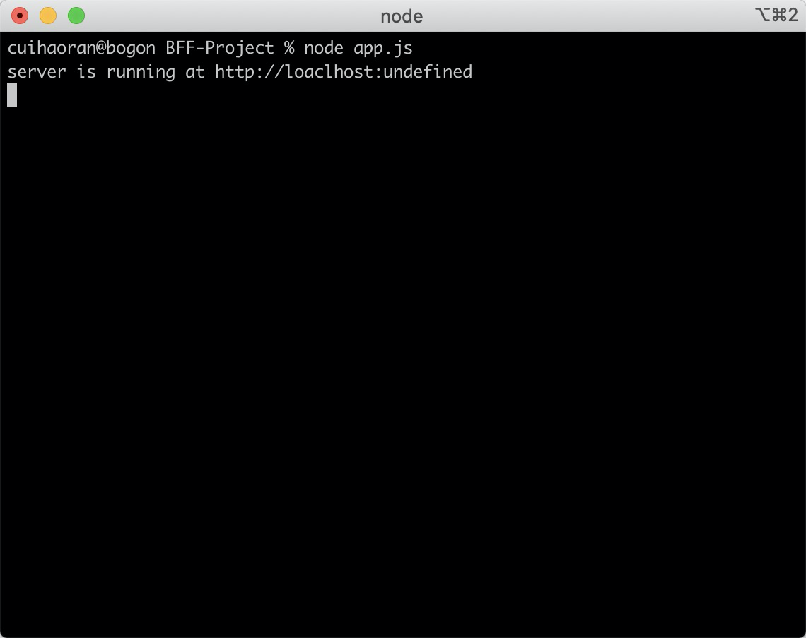

# 前后端实现BFF架构（一）

* BFF架构的前置准备
* 什么是BFF
* BFF架构项目目录


## 零、BFF架构的前置准备

### I、理解MVC分层的设计原理

### II、熟悉HTTP协议

### III、熟悉KOA全家桶

* Koa
* Koa-router
* Koa-static
* swig模板
* 项目热更新
  * 开发环境使用nodemon
  * 生产环境使用pm2
* 前端模块化方案
  * CMD
  * AMD
  * UMD
  * ESModules
* SystemJS


## 一、什么是BFF架构

BFF（Backends for Frontends）是服务于前端的后端应用程序，主要是用来解决多访问终端的意业务耦合问题。在日常的需求当中很容易出现多终端访问接口的情况，但是每种终端的业务场景又很不相同，比如web大多数场景是用来管理数据，但是移动端仅仅是数据的采集和展示，所以接口的设计一般是和终端的业务逻辑有着高度的耦合，很难重用。为了解决这个问题，微服务架构中就提出了BFF架构，为不同的终端设计一层BFF。  

实际应用中，我们会为每个端设计相应的BFF，每个端的`BFF`处理自身的业务逻辑，需要数据时从`基础服务`内获取，然后在接口返回之前进行组装数据用于实例化返回对象。  

这样基础服务如果有新功能添加，`BFF`几乎不会受到影响，而我们如果后期把`App`端点进行拆分成`Android`、`IOS`时我们只需要将`app-bff`进行拆分为`android-bff`、`ios-bff`，基础服务同样也不会受到影响。

这样每当新增一个访问端点时，我们需要修改的地方也只有`网关的转发`以及`添加一个BFF`即可，`基础服务`内提供的服务接口我们完全可以复用，因为`基础服务`提供的接口都是没有业务针对性的，总的来说BFF解决了业务场景的问题。  

### BFF的缺点

* 响应时间延迟（服务如果是内网之间访问，延迟时间较低）。
* 增加了代码量，编写起来较为浪费时间（因为在基础服务上添加的一层转发，所以会多写一部分代码）。
* 业务异常处理（统一格式化业务异常的返回内容）。
* 分布式事务（微服务的通病）。

## 二、BFF架构目录

### I、BFF目录树

BFF-Project  
├── .gitignore  
├── app.js   
├── assets    
├── components  
├── config  
├── controllers   
├── middleware  
├── models   
├── package.json  
├── tests  
├── tree.md  
├── utils   
├── views  
└── yarn.lock   


### II、目录结构详解

* .gitignore

  这是一个git上传的忽略文件，主要忽略一些不需要上传到远程仓库（比如说github、gitlab等等）的文件或者目录（比如说node_moudles）。

* app.js

  app.js文件是整个项目的入口，里面主要是编写了后端http服务器的运行代码。

* assets

  assets目录主要是存放整个项目静态文件，有vue开发经验的小伙伴可以对比vue中的assets目录进行理解。里面主要存放项目中所需的图片、音频、视频、css文件等等。

* components

  见名知意，components目录主要存放的是项目中用到的组件，这里需要注意的是这个组件仍然是前端组件的概念。

* config

  config目录主要存放项目的各种配置文件，配置文件配置的一般是不同环境下的相同配置，以及根据不同环境的个性化私有配置，举个例子，我们的环境分为development（开发环境）、test（测试环境）、production（生产环境），这些环境下http服务器的运行端口是不一样的，那么端口号则是根据不同环境需要不同的配置（这里端口号就属于不同环境下的个性化配置），与之相对的就是公共配置，例如静态文件的地址，无论什么环境，静态文件的地址一般都是相同的。

* controllers

  controllers目录存放的是对于后端路由的管理，这里的路由指的是两种类型的路由，第一是页面的渲染路由，比如说你在浏览器地址栏输入www.baidu.com，回车就能看到百度的首页一样。第二种是接口的路由，一般情况下接口的路由用于前后端分离的项目，我们随后也会讲解。总结下来就一句话，controllers里面的逻辑就是对于路由的管理，就是MVC结构中的C（Controller）层。

* middleware

  middleware目录为中间件，中间件可以理解为用于扩展功能的可拆装模块。比如对于koa框架来说，koa只是实现了一些核心的功能，像路由的功能我们就要依靠koa-router中间件。当然我们也可以自定义中间件，middleware一般用来存放一些自定义的中间件。

* models

  moddles主要是处理数据相关的逻辑，BFF架构中我们使用node做中间层，这里的models主要是处理向后端请求数据的逻辑，对应了MVC中的M（Model）层。

* tests

  tests目录主要是存放一些测试文件。我在前端测试会着重讲解。

* utils

  utils目录存放的是公共方法

* views

  views目录存放的是模板文件，也就是服务器发送到浏览器端，由浏览器进行渲染后用户最终看到的结果。由Controller层控制路由，然后渲染路由对应的模板，这里cotroller渲染的内容就是views中的某一个模板。这也就对应了MVC中的V（View）层。

* package.json

  Package.json文件是当前项目所用到的所有包的配置文件。相当于一个包的明细。npm install命令就是根据这个文件从npm服务器中下载对应的包。


## 三、使用NodeJS实现BFF架构

### I、动手之前

这里首先要交代的是，本文实现BFF架构用的是Koa全家桶。  

* http服务器：Koa2
* 路由：@koa-router
* 模板：swig
* 静态文件处理：koa-static
* 项目热更新
  * dev：nodemon
  * prod：pm2


### II、开始实现

#### Step1、安装Koa2并启动http服务

安装Koa2  

```js
npm install koa
```

创建BFF程序入口文件，app.js   

```javascript
/* app.js */
const Koa = require("koa");
const app = new Koa();

app.use(ctx => {
  ctx.body = 'hello koa!';
});
 
app.listen(3000, function() {
  console.log("Server is running at http://localhost:3000.");
});
```

在终端里输入：`node app.js` 命令启动服务，然后打开浏览器在地址栏输入`localhost:3000`，你会看见熟悉的 `hello koa`。  




执行结果如图所示  

#### Step2、项目环境的区分

一般开发中，环境分为开发环境（development）和生产环境（production）。

区分环境我们要在config目录下新建index.js.     

废话不多说，我们先看代码：  

```js
/* config/index.js */
let config = {};
// 在node中区分环境一般使用process.env.NODE_ENV的值来进行判断（这一点是走向工程化的第一步，重要程度不言而喻）。
// 一般情况下，process.env.NODE_ENV参数是在脚本命令（package.json中的"script"项）启动项目的时候注入的。
if(process.env.NODE_ENV === "development"){
  const devConfig = {
    port: 3000
  };
  config = {
    ...config,
    ...devConfig
  }
}
if(process.env.NODE_ENV === "production"){
  const prodConfig = {
    port: 8080
  };
  config = {
    ...config,
    ...prodConfig
  }
}
// 这里使用的是CommonJS语法，因为Node是天生支持CommonJS的。
// node12之后把.js文件的后缀改成.mjs是可以支持ESModule的。
module.exports = config;
```

到现在为止，可以看到已经实现了项目环境的区分，并且我们实现了不同环境对应不同的端口号。相应的我们的程序入口文件app.js也是需要更改的。废话不多说，我们show code！  

```javascript
/* app.js */
const Koa = require("koa");
const app = new Koa();
// 引入config目录下的index.js配置文件
const config = require("./config");

app.use(ctx => {
  ctx.body = 'hello koa!';
});

app.listen(config.port, function() {
  console.log(`Server is running at http://localhost:${config.port}.`);
});
```

我们修改了app.js，接下来我们区分环境还需要在脚本命令中注入一个环境变量。  

```json
/* package.json */
{
  "name": "BFF-Project",
  "version": "1.0.0",
  "main": "index.js",
  "license": "MIT",
  "scripts": {
    "start": "NODE_ENV=development node ./app.js"
  },
  "dependencies": {}
}
```

可以看到我们在package.json中添加了`"script"`脚本项，并声明了一个`start`命令，在命令中注入`NODE_ENV`环境变量为`development`，这样的话我们在项目中访问`process.env.NODE_ENV`就会得到`“developent”`，这就是环境呢变量的注入。`node ./app.js`，执行app.js，启动http服务器。

此外我们还可以根据环境变量的不同声明多个脚本命令，例如我们可以为开发环境，测试环境以及生产环境各自配置项目的启动命令：

* development："start": "NODE_ENV=development node ./app.js"
* test："test": "NODE_ENV=test node ./app.js"
* production："dev": "NODE_ENV=production node ./app.js"

```json
/* package.json */
{
  "name": "BFF-Project",
  "version": "1.0.0",
  "main": "index.js",
  "license": "MIT",
  "scripts": {
    "start": "NODE_ENV=production node ./app.js",
    "dev": "NODE_ENV=development node ./app.js",
    "test": "NODE_ENV=test node ./app.js",
  },
  "dependencies": {}
}
```

我们可以看到上面的代码，为每个环境都配置了启动服务的命令，不同的是注入的NODE_DEV不同。  

> 注意：现在我们存在了一个问题，每次更改完代码之后我们都需要重新启动服务，改动才能生效，我们的想法是最好能够有一个方法能够监听代码的变化，所以我们可以使用nodemon来运行我们的app.js，nodemon可以监听代码的变化，能够热更新程序，不需要重新启动服务，更新后的代码就可以生效。

> nodemon的安装：  
>
> ```
> $ sudo npm install nodemon -g 
> ```
>
>  全局安装nodemon，安装之后运行nodemon可能会提示 command not found。  
>
> 解决办法：  
>
> ```
> $ npm config set prefix /usr/local
> $ sudo npm install nodemon -g
> ```

我们在开发环境使用nodemon监听代码的变更进行热更新，生产环境则需要使用pm2。  


#### Step3、路由

koa2对应的路由处理一般使用koa-router中间件。koa-router就是配合koa使用的。这里我们使用koa-router的最新版，当前koa-router的最新版本是@koa-router。  

我们是用 `npm install @koa/router`  来安装koa-router。安装好之后，我们来使用一下koa-router。不废话直接上代码。  

```javascript
/* app.js */
const Koa = require("koa");
// 引入@koa/router
const Router = require("@kou/router");
const app = new Koa();
// 实例化router对象
const router = new Router();
const config = require("./config");

// 访问http://localhost:3000/ 页面会显示hello world
router.get('/', (ctx, next) => {
  ctx.body = 'hello world!';
});

// 使用router中间件，需要use一下。
app
  .use(router.routes())
  .use(router.allowedMethods());

app.listen(config.port, function() {
  console.log(`Server is running at http://localhost:${config.port}.`);
});
```

引入@koa/router之后我们就要开始在controllers中编写控制router的逻辑，上文中我们已经说明了controller是控制路由的。我们可以写一个路由的基类（controllers/Controller.js），所有的路由都继承自这个路由。  

在controllers目录里新建一个Controller.js文件。直接上代码：

```javascript
/* controllers/Controller.js */
class Controller{
  log() {
    console.log('log打印');
  }
}

module.exports = Controller;
```

我们可以看到Controller基类中什么逻辑也没有，只有一个日志打印功能。下一节我们会讲到。编写好基类，我们就可以编写对应的路由逻辑了。我们可以拿index路由举例：  

在controllers目录中新建IndexController.js，直接看代码：

```javascript
/* controllers/IndexController */
// 引入Controller基类
const Controller = require('./Controller');
// IndexController继承自Controller基类
class IndexController extends Controller {
  constructor() {
    super();
  }
  
  // 根据index路由渲染页面的函数（类比yii的actionIndex方法）
  actionIndex() {
    // todo...
  }
}

module.exports = IndexController;
```

现在有一个问题就是，如何把地址上的输入和controller联系起来，毫无疑问，我们需要使用路由。  

我们在controllers目录中新建index.js，统一对所有的路由进行处理，匹配各自的controller。你会发现所有的mvc框架都是这么做的，比如php的yii框架。yii我们之前已经讲到了。在controllers中新建index.js。  

```javascript
/* controllers/index.js */

// 引入Router中间件
const Router = require("@koa/router");
// 实例化router对象
const router = new Router();

//定义初始化的路由入口，传入app实例
initController(app) {
  // 同样我们在使用koa-router的时候要use一下
  app
    .use(router.routes())
    .use(router.allowedMethods());
}

// 导出initController，在app.js中引入并执行
module.exports = initController;
```

我们来看一下app.js中应该怎么写。上代码：  

```javascript
/* app.js */
const Koa = require("koa");
const app = new Koa();
const config = require('./config');
const initController = require('./controllers');

initController(app);

app.listen(config.port, function() {  
  console.log(`Server is running at http://localhost:${config.port}.`);
});
```

处理完app.js我们改写一下controllers/index.js。  

```javascript
/* controllers/index.js */

// 引入Router中间件
const Router = require("@koa/router");
// 实例化router对象
const router = new Router();

//定义初始化的路由入口，传入app实例
initController(app) {
  router.get('/', (ctx, next) => {
    ctx.body = 'hello world!!!'
  });
  
  // 同样我们在使用koa-router的时候要use一下
  app
    .use(router.routes())
  	// 主要是对http的请求头有影响
    .use(router.allowedMethods());
}

// 导出initController，在app.js中引入并执行
module.exports = initController;
```

这样的话，我们想要把controller和url关联起来我们就在controllers/index.js引入各种的controller控制器。  

```javascript
/* controllers/index.js */

// 引入Router中间件
const Router = require("@koa/router");

// 引入controller  IndexController
const IndexController = require('./IndexController');

// 实例化IndexController
const indexController = new IndexController();

// 实例化router对象
const router = new Router();

//定义初始化的路由入口，传入app实例
initController(app) {
  // 在这里给路由注册一个路由处理函数，这一步是真正的把路由和controller中的action也就是动作联系在一起，是一种映射关系。
  // 我们可以看到我们是把indexController中的actionIndex方法整个当做参数传入，这样的话actionIndex方法就自动的接收了ctx和next两个参数
  router.get('/', indexController.actionIndex);
  // 如果需要更多的路由的映射，可以直接在这里添加
  // router.get('/about', aboutController.actionAbout);
  
  // 同样我们在使用koa-router的时候要use一下
  app
    .use(router.routes())
  	// 主要是对http的请求头有影响
    .use(router.allowedMethods());
}

// 导出initController，在app.js中引入并执行
module.exports = initController;
```

我们再补充一下IndexController中的todo部分：  

```javascript
/* controllers/IndexController */
// 引入Controller基类
const Controller = require('./Controller');
// IndexController继承自Controller基类
class IndexController extends Controller {
  constructor() {
    super();
  }
  
  // 根据index路由渲染页面的函数（类比yii的actionIndex方法）
  actionIndex(ctx, next) {
    ctx.body = 'action index';
  }
}

module.exports = IndexController;
```

到现在为止我们把路由和controller联系起来了，并且我们还做了很好的扩展，我们如果想要给不同的url路由匹配相应的控制器动作，直接可以在controllers/index.js中的initController方法中添加路由和controller的action方法的映射。这样做的好处就是我们给controller和router之间做了一个桥梁，可以很好的联通，并且能很好的扩展。  

我们除了在controllers中编写页面的处理方法，我们还可以添加接口的处理方法。  

在controllers新建一个ApiController.js  

```javascript
// controller/ApiController.js

// 引入Controller基类
const Controller = require('./Controller');
// IndexController继承自Controller基类
class ApiController extends Controller {
  constructor() {
    super();
  }
  
  // 根据index路由渲染页面的函数（类比yii的actionIndex方法）
  actionDataList(ctx, next) {
    ctx.body = [
      {
        id: 1,
        data: '1'
      },
      {
        id: 2,
        data: '2'
      },
      ...
    ];
  }
}

module.exports = IndexController;
```

接口的Controller写好之后，使用的方式和页面的路由一模一样。  

```javascript
/* controllers/index.js */

const Router = require("@koa/router");
const IndexController = require('./IndexController');
const indexController = new IndexController();
// 引入ApiController
const ApiController = require('./ApiController');
const apiController = new ApiController();

const router = new Router();

initController(app) {
  
  router.get('/', indexController.actionIndex);
  // 约定俗成的接口路由以api为前缀，都为/api/...
  router.get('/api/getDataList', apiController.actionDataList);
  
  app
    .use(router.routes())
    .use(router.allowedMethods());
}

module.exports = initController;
```

到了这里我们的路由已经搭建完毕，并且完成了路由和controller关系的建立。下面就是View层的编写了。  


#### step4 View模板

刚才我们输入url只是在页面上显示了一个字符串，现在我们要显示一个真正的页面。  

* 方法一：直接在代码中硬编码我们的html代码。
* 方法二：利用模板引擎，这里我们推荐使用swig模板。

我们先来看一下方法一：  

```javascript
/* controllers/IndexController */
// 引入Controller基类
const Controller = require('./Controller');
// IndexController继承自Controller基类
class IndexController extends Controller {
  constructor() {
    super();
  }
  
  // 根据index路由渲染页面的函数（类比yii的actionIndex方法）
  actionIndex(ctx, next) {
    ctx.body = `
				<html>
					<body>
						<h1>index</h1>
					</body>
				</html>
		`;
  }
}

module.exports = IndexController;
```

方法一是直接在给ctx.body赋值一个html字符串。这种方式无疑是最简单的，但是同时它不太灵活。  

我们更希望的是像平时我们写静态网页一样，为了达到这个目的我们就要使用模板，swig。  

方法二：使用模板引擎，这里我们以swig为例，koa-swig。  

我们先来安装kao-swig，使用 `npm install koa-swig` 来安装koa-swig，这里我们要注意一件事情，使用koa2的时候，swig对应的是koa2的版本，这个版本还需要一个`co`库来配合使用，我们需要使用 `npm install co` 来安装co库。具体的使用方式我们会贴出代码，安装好时候我们开始编写。  

我们现在app.js中引入并配置好koa-swig。  

```javascript
/* app.js */
const Koa = require("koa");
const app = new Koa();
// 引入koa-swig
const render = require("koa-swig");
// 引入co模块
const co = require('co');
const config = require('./config');
const initController = require('./controllers');

// 把koa-swig挂载到context上，并配置koa-swig。要用co模块包裹！！
// 因为模板的渲染是一个异步的过程，所以需要co的包裹，co库就是来处理异步调用的。这里不详细解释。
app.context.render = co.wrap(render({
  root: path.join(__dirname, 'views'),
  cache: 'memory', // disable, set to false 是否需要缓存，开发环境不需要缓存，生产环境需要缓存。根据环境不同做不同的配置。
}))

initController(app);

app.listen(config.port, function() {  
  console.log(`Server is running at http://localhost:${config.port}.`);
});
```

这里koa-swig的配置，我们建议放在config中进行统一的管理，cache本身就需要根据不同的环境做不同的配置，生产环境为'memory'，开发环境为false。 

我们把koa-swig的配置项放在config中。   

```javascript
/* config/index.js */

// 引入node的path模块
const path = require('path');

let config = {
  // 模板的路径生产环境和开发环境相同
  viewDir: path.join(__dirname, '../', 'views');
};
// 在node中区分环境一般使用process.env.NODE_ENV的值来进行判断（这一点是走向工程化的第一步，重要程度不言而喻）。
// 一般情况下，process.env.NODE_ENV参数是在脚本命令（package.json中的"script"项）启动项目的时候注入的。
if(process.env.NODE_ENV === "development"){
  const devConfig = {
    port: 3000,
    // 模板缓存在开发环境不需要
    cache: false,
  };
  config = {
    ...config,
    ...devConfig
  }
}
if(process.env.NODE_ENV === "production"){
  const prodConfig = {
    port: 8080,
    // 在生产环境需要缓存模板
    cache: 'memory',
  };
  config = {
    ...config,
    ...prodConfig
  }
}
// 这里使用的是CommonJS语法，因为Node是天生支持CommonJS的。
// node12之后把.js文件的后缀改成.mjs是可以支持ESModule的。
module.exports = config;
```

配置好koa-swig的配置，我们来修改一下app.js中关于koa-swig的配置。  

```javascript
/* app.js */
const Koa = require("koa");
const app = new Koa();
const render = require("koa-swig");
const co = require('co');
const config = require('./config');
const initController = require('./controllers');

app.context.render = co.wrap(render({
  root: config.viewDir,
  cache: config.cache,
}));

initController(app);

app.listen(config.port, function() {  
  console.log(`Server is running at http://localhost:${config.port}.`);
});
```

现在我们可以来编写一个模板，在views目录中新建一个index.html.  

```html
<!DOCTYPE html>
<html lang="en">
<head>
  <meta charset="UTF-8">
  <meta http-equiv="X-UA-Compatible" content="IE=edge">
  <meta name="viewport" content="width=device-width, initial-scale=1.0">
  <title>BFF架构首页</title>
</head>
<body>
  <h1>BFF架构首页</h1>
</body>
</html>
```

创建好模板之后，我们要在IndexController中渲染模板。  

```javascript
/* controllers/IndexController */

const Controller = require('./Controller');

class IndexController extends Controller {
  constructor() {
    super();
  }
  
  actionIndex(ctx, next) {
    // 把ctx.render()之后的结果赋值给ctx.body
    ctx.body = ctx.render('index'); //这里的参数也可以支持多层目录，也可以支持第二个参数，往模板中动态渲染数据。
  }
}

module.exports = IndexController;
```

现在我们从Controller层到View层就关联起来了。到此我们就把mvc的架构搭建完成了。恭喜各位读者，坚持到这里不容易，给你们一朵小红花🌷。  

在这里我们需要注意，我们利用node的服务完全可以把页面渲染出来并不需要nginx服务器之类的，不论vue的spa项目或者是普通的mpa项目，我们都可以用node来渲染出来。  


#### 扩展篇（如何用node来渲染vue的spa项目）

* 先创建一个vue项目
* 把npm项目打包编译好，命令：`npm run build`
* 把打包好的dist目录中的文件放进node server的assets目录中。
* 把vue项目中的index.html文件单独拿出来放进views/vue目录中。
* 然后使用上文中搭好的mvc框架进行渲染。

现在我们在url中输入相应的路由，应该是空白页面的，这是为什么呢？原因就是我们的所有的静态文件都放进了assets中，但是我们并没有指定静态文件的存放目录，现在我们就指定一下静态文件的存放位置。  

这里我们会使用到koa-static插件。  

使用`npm install koa-static ` 安装静态文件服务器。然后我们来使用它。

```javascript
/* app.js */
const Koa = require("koa");
const app = new Koa();
const render = require("koa-swig");
const co = require('co');
// 引入koa-static
const staticServer = require("koa-static");
const config = require('./config');
const initController = require('./controllers');

// 我们同样把静态资源的目录配置在config中，config配置文件见下文。。
app.use(staticServer(config.staticDir));

app.context.render = co.wrap(render({
  root: config.viewDir,
  cache: config.cache,
}));

initController(app);

app.listen(config.port, function() {  
  console.log(`Server is running at http://localhost:${config.port}.`);
});
```

```javascript
/* config/index.js */

const path = require('path');

let config = {
  viewDir: path.join(__dirname, '../', 'views'),
  // 静态资源路径生产环境和开发环境相同
  staticDir: path.join(__dirname, '../', 'assets'),
};

if(process.env.NODE_ENV === "development"){
  const devConfig = {
    port: 3000,
    cache: false,
  };
  config = {
    ...config,
    ...devConfig
  }
}
if(process.env.NODE_ENV === "production"){
  const prodConfig = {
    port: 8080,
    cache: 'memory',
  };
  config = {
    ...config,
    ...prodConfig
  }
}

module.exports = config;
```

现在我们访问http://localhost:3000，可以看到我们能够正常访问页面。  但是现在存在着一个严重的问题，现在我们切换到about页面的时候，刷新浏览器，你会发现页面访问不到了。  

其实这个问题的原因很简单，在about页面刷新，实际上就是请求了后端/about路由，我们后端并没有about的真正路由，所以mvc的架构在收到/about路由时并不知道要渲染什么，/about的这个路由实际上是前端的假路由，这也是为什么说前端spa项目都是假路由的原因。  

当我们访问首页，再切换路由的时候我们会发现就能够正常看到页面，这是因为我们在访问跟路由的时候会把所有的静态文件下载到本地。所以我们是看到的是正常的。  

要解决这个问题我们就需要解决一下前后端真假路由的问题了，这里我们使用koa2-connect-history-api-fallback这个库来解决这个问题。  

首先 `npm install koa2-connect-history-api-fallback` 安装这个库。这个库可以让我们在访问不存在的路由的时候，可以重定向到某一个存在的路由。当我们访问到about路由的时候，重定向到跟路由。  

现在我们来使用这个库，上代码：  

```javascript
/* app.js */
const Koa = require("koa");
const app = new Koa();
const render = require("koa-swig");
const co = require('co');
const staticServer = require("koa-static");
// 引入koa2-connect-history-api-fallback
const { historyApiFallback } = require('koa2-connect-history-api-fallback');
const config = require('./config');
const initController = require('./controllers');

// 我们同样把静态资源的目录配置在config中，config配置文件见下文。。
app.use(staticServer(config.staticDir));
// 访问不存在的路由时，重定向到根路由，设置/api路由白名单，在访问/api/xxx时不会重定向到跟路由。
app.use(historyApiFallback(index: '/', { whiteList: ['/api'] }));

app.context.render = co.wrap(render({
  root: config.viewDir,
  cache: config.cache,
}));

initController(app);

app.listen(config.port, function() {  
  console.log(`Server is running at http://localhost:${config.port}.`);
});
```

现在我们就可以渲染spa应用了。接下来我们给node服务做一个容错机制。  

稍等我们还有一个问题：如果在模板中使用vue模板的差值表达式，会与swig模板语法冲突。这个问题我们可以通过改变swig的配置来把`{{}}`符号改成其他的符号。原因是改vue的差值表达式难度太大。  

#### step4、容错机制

我们现在给node项目做一个容错机制，使用中间件来完成，在middleware中新建一个ErrorHandle.js。  

```javascript
/* middleware/ErrorHandle.js */

class ErrorHandle {
  static error(app) {
    app.use(async(ctx, next) => {
      try {
        await next();
        if(ctx.status === 404) {
           ctx.body = '友好的404页面';
        }
      }catch {
        ctx.body = '500请求，正在积极修复。'
      }
    })
  }
}

module.exports = ErrorHandle;
```

现在在app.js中引入一下：  

```javascript
/* app.js */
const Koa = require("koa");
const app = new Koa();
const render = require("koa-swig");
const co = require('co');
const staticServer = require("koa-static");
// 引入koa2-connect-history-api-fallback
const { historyApiFallback } = require('koa2-connect-history-api-fallback');
const config = require('./config');
const initController = require('./controllers');
const ErrorHandle = require('./middleware/ErrorHandle');

app.use(staticServer(config.staticDir));
app.use(historyApiFallback(index: '/', { whiteList: ['/api'] }));
// 传入app
ErrorHandle.error(app);

app.context.render = co.wrap(render({
  root: config.viewDir,
  cache: config.cache,
}));

initController(app);

app.listen(config.port, function() {  
  console.log(`Server is running at http://localhost:${config.port}.`);
});
```

我们可以在IndexController中自定义一个错误来验证一下：  

```javascript
/* controllers/IndexController */

const Controller = require('./Controller');

class IndexController extends Controller {
  constructor() {
    super();
  }
  
  actionIndex(ctx, next) {
    throw Error('自定义错误。');
    // 把ctx.render()之后的结果赋值给ctx.body
    ctx.body = ctx.render('index'); //这里的参数也可以支持多层目录
  }
}

module.exports = IndexController;
```

这样的话，我们在访问跟路由的时候会出现服务器错误，出发容错机制，页面会出现 `500请求，正在积极修复。` 我们把spa重定向的代码干掉，如果访问一个不存在的路由，会出现404页面。  

到此为止，我们把容错也处理完成了。  


#### step5、ES6、babel、system.js重构项目

现在chrome浏览器已经原生支持es6模块化了。我们首先在assets的js目录中新建一个data.js：  

```javascript
/* assets/js/data.js */

export default const data = "前端数据";

// 使用ESmodule的方式导出
```

这样的话，只需要给html文件中的script标签加上type="module"属性就可以支持es6的模块化语法：  

```html
<!DOCTYPE html>
<html lang="en">
<head>
  <meta charset="UTF-8">
  <meta http-equiv="X-UA-Compatible" content="IE=edge">
  <meta name="viewport" content="width=device-width, initial-scale=1.0">
  <title>BFF架构首页</title>
</head>
<body>
  <h1>BFF架构首页</h1>
  <!-- 这种写法现在还有一些浏览器不支持，解决方式就是使用babel编译，system.js加载 -->
  <script src="https://cdn.bootcdn.net/ajax/libs/systemjs/6.8.3/system.js"></script>
  <script type="module">
    import('/js/data.js').then(res => {
      // 可以输出res
      console.log(res);
    })
  </script>
  <script type="nomodule">
  	console.log('不支持模块化导入');
  	// 如果不支持es6模块化导入，就使用babel编译成System能够识别的代码格式，然后使用system.js导入
  	
  	// 显然这段代码在浏览器中会报错，因为我们还没有对data.js进行babel编译。稍后补充...
  	System.import('/js/data.js').thn(res => {
  		console.log(res);
  	})
	</script>
</body>
</html>
```

在这一步我们在不支持ESmodule的浏览器中使用system.js的话，需要安装babel来对js代码进行编译。使用`npm install --save-dev @babel/plugin-transform-modules-systemjs` 来进行安装bebel，然后还要安装babel的cli和babel的核心代码才能正常使用babel，使用 `npm install @babel/cli -D` 安装babel-cli，使用 `npm install @babel/core -D` 安装babel-core。 另外我们还需要在项目根目录创建babel的配置文件.babelrc：  

```javascript
/* .babelrc */

{
  "plugins": ["@babel/plugin-transform-modules-systemjs"]
}
```

我们既然想要打包，就需要在package.json中创建一个打包命令：  

```json
/* package.json */
{
  "name": "BFF-Project",
  "version": "1.0.0",
  "main": "index.js",
  "license": "MIT",
  "scripts": {
    "start": "NODE_ENV=development node ./app.js",
    "build": "babel ./assets/js/data.js -o ./assets/js/data-bundle.js"
  },
  "dependencies": {}
}
```

在命令行输入 `npm run build` 之后，在asset/js 目录下回生成一个data-bundle.js文件，这就是system.js能够识别的JS代码格式，现在我们来修改一下html文件：  

```html
<!DOCTYPE html>
<html lang="en">
<head>
  <meta charset="UTF-8">
  <meta http-equiv="X-UA-Compatible" content="IE=edge">
  <meta name="viewport" content="width=device-width, initial-scale=1.0">
  <title>BFF架构首页</title>
</head>
<body>
  <h1>BFF架构首页</h1>
  <!-- 这种写法现在还有一些浏览器不支持，解决方式就是使用babel编译，system.js加载 -->
  <script src="https://cdn.bootcdn.net/ajax/libs/systemjs/6.8.3/system.js"></script>
  <script type="module">
    import('/js/data.js').then(res => {
      // 可以输出res
      console.log(res);
    })
  </script>
  <script type="nomodule">
  	console.log('不支持模块化导入');
  	// 如果不支持es6模块化导入，就使用babel编译成System能够识别的代码格式，然后使用system.js导入
  	System.import('/js/data-bundle.js').thn(res => {
  		console.log(res);
  	});
	</script>
</body>
</html>
```

我们回过头来看其实我们这么做的目的就是能够使用一些新的语法，新的技术。技术发展很快我们要尽量的拥抱新的技术。  

对于ES6Module的兼容性处理，github上也有一些polify来对浏览器做一些对ES6模块化导入的兼容。多看github也会有很大的收获。

