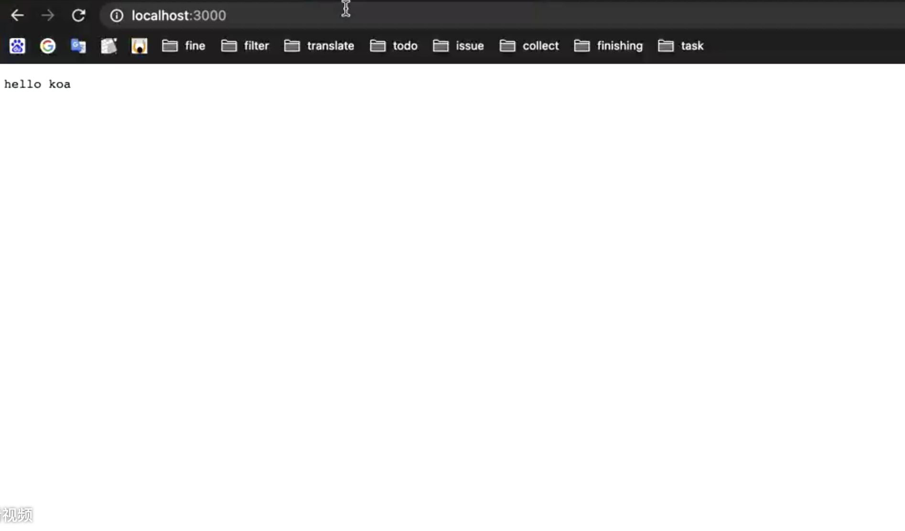

# 前后端实现BFF架构

* BFF架构的前置准备
* 什么是BFF
* BFF架构项目目录


## 零、BFF架构的前置准备

### I、理解MVC分层的设计原理

### II、熟悉HTTP协议

### III、熟悉KOA全家桶

* Koa
* Koa-router
* Koa-static
* swig模板
* 项目热更新
  * 开发环境使用nodemon
  * 生产环境使用pm2
* 前端模块化方案
  * CMD
  * AMD
  * UMD
  * ESModules
* SystemJS


## 一、什么是BFF架构

BFF（Backends for Frontends）是服务于前端的后端应用程序，主要是用来解决多访问终端的意业务耦合问题。在日常的需求当中很容易出现多终端访问接口的情况，但是每种终端的业务场景又很不相同，比如web大多数场景是用来管理数据，但是移动端仅仅是数据的采集和展示，所以接口的设计一般是和终端的业务逻辑有着高度的耦合，很难重用。为了解决这个问题，微服务架构中就提出了BFF架构，为不同的终端设计一层BFF。  

实际应用中，我们会为每个端设计相应的BFF，每个端的`BFF`处理自身的业务逻辑，需要数据时从`基础服务`内获取，然后在接口返回之前进行组装数据用于实例化返回对象。  

这样基础服务如果有新功能添加，`BFF`几乎不会受到影响，而我们如果后期把`App`端点进行拆分成`Android`、`IOS`时我们只需要将`app-bff`进行拆分为`android-bff`、`ios-bff`，基础服务同样也不会受到影响。

这样每当新增一个访问端点时，我们需要修改的地方也只有`网关的转发`以及`添加一个BFF`即可，`基础服务`内提供的服务接口我们完全可以复用，因为`基础服务`提供的接口都是没有业务针对性的，总的来说BFF解决了业务场景的问题。  

### BFF的缺点

* 响应时间延迟（服务如果是内网之间访问，延迟时间较低）。
* 增加了代码量，编写起来较为浪费时间（因为在基础服务上添加的一层转发，所以会多写一部分代码）。
* 业务异常处理（统一格式化业务异常的返回内容）。
* 分布式事务（微服务的通病）。

## 二、BFF架构目录

### I、BFF目录树

BFF-Project  
├── .gitignore  
├── app.js   
├── assets    
├── components  
├── config  
├── controllers   
├── middleware  
├── models   
├── package.json  
├── tests  
├── tree.md  
├── utils   
├── views  
└── yarn.lock   


### II、目录结构详解

* .gitignore

  这是一个git上传的忽略文件，主要忽略一些不需要上传到远程仓库（比如说github、gitlab等等）的文件或者目录（比如说node_moudles）。

* app.js

  app.js文件是整个项目的入口，里面主要是编写了后端http服务器的运行代码。

* assets

  assets目录主要是存放整个项目静态文件，有vue开发经验的小伙伴可以对比vue中的assets目录进行理解。里面主要存放项目中所需的图片、音频、视频、css文件等等。

* components

  见名知意，components目录主要存放的是项目中用到的组件，这里需要注意的是这个组件仍然是前端组件的概念。

* config

  config目录主要存放项目的各种配置文件，配置文件配置的一般是不同环境下的相同配置，以及根据不同环境的个性化私有配置，举个例子，我们的环境分为development（开发环境）、test（测试环境）、production（生产环境），这些环境下http服务器的运行端口是不一样的，那么端口号则是根据不同环境需要不同的配置（这里端口号就属于不同环境下的个性化配置），与之相对的就是公共配置，例如静态文件的地址，无论什么环境，静态文件的地址一般都是相同的。

* controllers

  controllers目录存放的是对于后端路由的管理，这里的路由指的是两种类型的路由，第一是页面的渲染路由，比如说你在浏览器地址栏输入www.baidu.com，回车就能看到百度的首页一样。第二种是接口的路由，一般情况下接口的路由用于前后端分离的项目，我们随后也会讲解。总结下来就一句话，controllers里面的逻辑就是对于路由的管理，就是MVC结构中的C（Controller）层。

* middleware

  middleware目录为中间件，中间件可以理解为用于扩展功能的可拆装模块。比如对于koa框架来说，koa只是实现了一些核心的功能，像路由的功能我们就要依靠koa-router中间件。当然我们也可以自定义中间件，middleware一般用来存放一些自定义的中间件。

* models

  moddles主要是处理数据相关的逻辑，BFF架构中我们使用node做中间层，这里的models主要是处理向后端请求数据的逻辑，对应了MVC中的M（Model）层。

* tests

  tests目录主要是存放一些测试文件。我在前端测试会着重讲解。

* utils

  utils目录存放的是公共方法

* views

  views目录存放的是模板文件，也就是服务器发送到浏览器端，由浏览器进行渲染后用户最终看到的结果。由Controller层控制路由，然后渲染路由对应的模板，这里cotroller渲染的内容就是views中的某一个模板。这也就对应了MVC中的V（View）层。

* package.json

  Package.json文件是当前项目所用到的所有包的配置文件。相当于一个包的明细。npm install命令就是根据这个文件从npm服务器中下载对应的包。


## 三、使用NodeJS实现BFF架构

### I、动手之前

这里首先要交代的是，本文实现BFF架构用的是Koa全家桶。  

* http服务器：Koa2
* 路由：@koa-router
* 模板：swig
* 静态文件处理：koa-static
* 项目热更新
  * dev：nodemon
  * prod：pm2


### II、开始实现

#### Step1、安装Koa2并启动http服务

安装Koa2  

```js
npm install koa
```

创建BFF程序入口文件，app.js   

```javascript
/* app.js */
const Koa = require("koa");
const app = new Koa();

app.use(ctx => {
  ctx.body = 'hello koa!';
});

app.listen(3000, function() {
  console.log("Server is running at http://localhost:3000.");
});
```

在终端里输入：`node app.js` 命令启动服务，然后打开浏览器在地址栏输入`localhost:3000`，你会看见熟悉的 `hello koa`。  




执行结果如图所示  

#### Step2、项目环境的区分

一般开发中，环境分为开发环境（development）和生产环境（production）。

区分环境我们要在config目录下新建index.js.     

废话不多说，我们先看代码：  

```js
/* config/index.js */
let config = {};
// 在node中区分环境一般使用process.env.NODE_ENV的值来进行判断（这一点是走向工程化的第一步，重要程度不言而喻）。
// 一般情况下，process.env.NODE_ENV参数是在脚本命令（package.json中的"script"项）启动项目的时候注入的。
if(process.env.NODE_ENV === "development"){
  const devConfig = {
    port: 3000
  };
  config = {
    ...config,
    ...devConfig
  }
}
if(process.env.NODE_ENV === "production"){
  const prodConfig = {
    port: 8080
  };
  config = {
    ...config,
    ...prodConfig
  }
}
// 这里使用的是CommonJS语法，因为Node是天生支持CommonJS的。
// node12之后把.js文件的后缀改成.mjs是可以支持ESModule的。
module.exports = config;
```

到现在为止，可以看到已经实现了项目环境的区分，并且我们实现了不同环境对应不同的端口号。相应的我们的程序入口文件app.js也是需要更改的。废话不多说，我们show code！  

```javascript
/* app.js */
const Koa = require("koa");
const app = new Koa();
// 引入config目录下的index.js配置文件
const config = require("./config");

app.use(ctx => {
  ctx.body = 'hello koa!';
});

app.listen(config.port, function() {
  console.log(`Server is running at http://localhost:${config.port}.`);
});
```

我们修改了app.js，接下来我们区分环境还需要在脚本命令中注入一个环境变量。  

```json
/* package.json */
{
  "name": "BFF-Project",
  "version": "1.0.0",
  "main": "index.js",
  "license": "MIT",
  "scripts": {
    "start": "NODE_ENV=development nodemon ./app.js"
  },
  "dependencies": {}
}
```

可以看到我们在package.json中添加了`"script"`脚本项，并声明了一个`start`命令，在命令中注入`NODE_ENV`环境变量为`development`，这样的话我们在项目中访问`process.env.NODE_ENV`就会得到`“developent”`，这就是环境呢变量的注入。`node ./app.js`，执行app.js，启动http服务器。

此外我们还可以根据环境变量的不同声明多个脚本命令，例如我们可以为开发环境，测试环境以及生产环境各自配置项目的启动命令：

* development："start": "NODE_ENV=development node ./app.js"
* test："start": "NODE_ENV=test node ./app.js"
* production："start": "NODE_ENV=production node ./app.js"