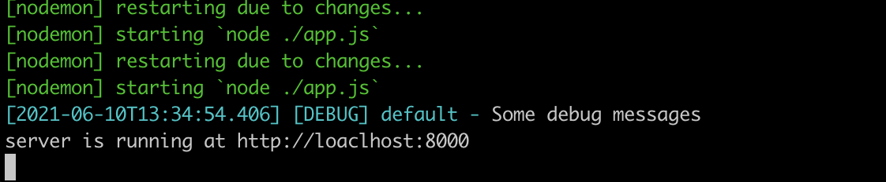
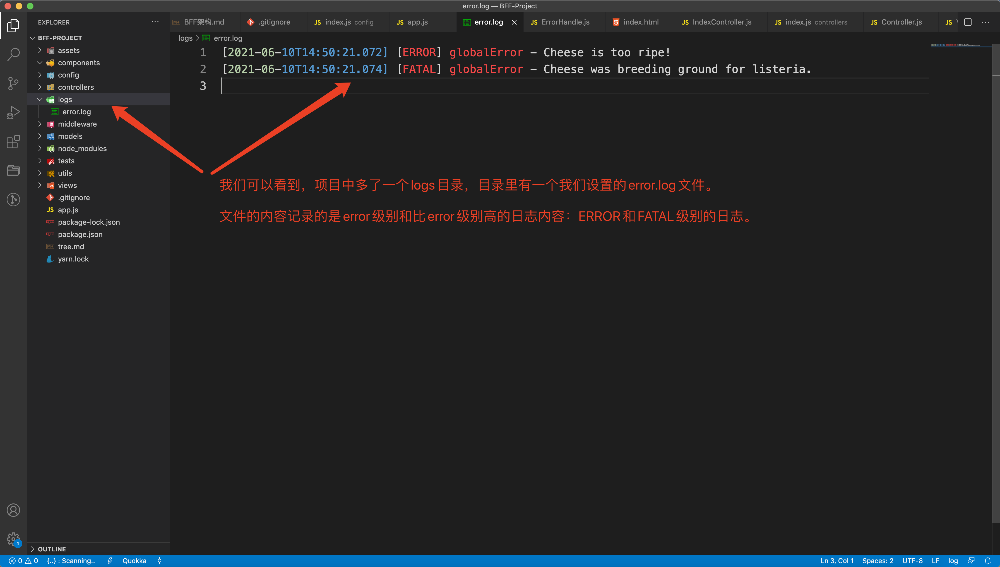
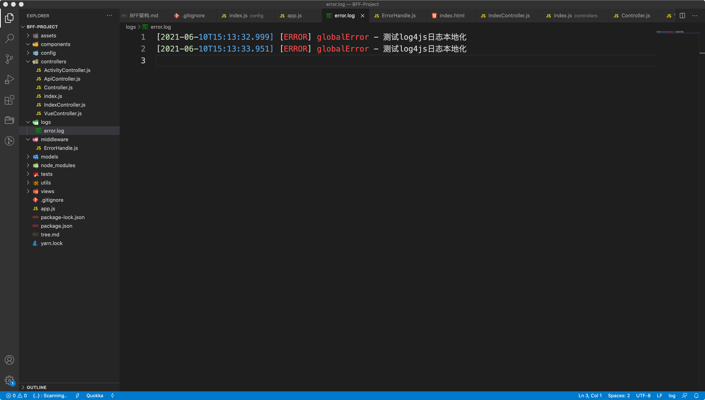
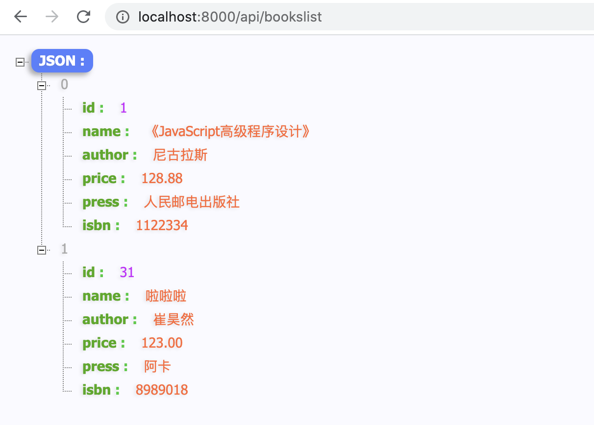

# 前后端实现BFF架构（二）

## 零、写在前面

在**前后端实现BFF架构（一）**里面我们使用Koa2及一系列的插件简单的搭出了Node服务的MVC框架，这篇文章是上一篇文章的后续，来完成接下来的一些工作。这篇文章我们将从以下几个点来完善我们的BFF架构：

+ 对KOA2项目做一些容错

+ 将YII的后端项目写成只提供接口的形式，给NodeJS使用

+ PlayWright完成页面测试

  mocha完成Node接口测试

+ 业务逻辑用ES6编写，并将浏览器支持分开，不支持的用babel编译system.js加载

+ 每一次新增记录的点击用函数式编程的方式稀释（节流）。


## 一、添加错误日志记录

添加错误日志记录需要使用一个库`log4js`。我们先安装这个插件，因为我们的日志记录要在线上使用，所以就不需要只安装在开发环境中了：

```shell
$ npm install log4js
```

安装完之后我们在app.js中引入`log4js`，

```javascript
/* app.js */

const Koa = require('koa');
const render = require('koa-swig');
const co = require('co');
const server_static = require('koa-static');
const { historyApiFallback } = require('koa2-connect-history-api-fallback');
const app = new Koa();
const log4js = require("log4js");		// 引入log4js
const config = require('./config');
const initController = require('./controllers/index');
const errorHandle = require('./middleware/ErrorHandle');

// log4js的初始化和设置
const logger = log4js.getLogger();
// 设置日志级别为debug级别，也可以设置为其他的级别。
logger.level = "debug";
// 这条日志会在控制台输出
logger.debug("Some debug messages");

app.use(server_static(config.staticDir));
app.use(historyApiFallback({ index: '/', whiteList: ['/api', '/activity'] }));
app.context.render = co.wrap(render({
  // 模板文件的路径和是否缓存尽量的放在配置文件中，可以随意配置。
  root: config.viewsDir,
  cache: config.cache
}));

errorHandle.error(app);

initController(app);

app.listen(config.port, () => {
  console.log(`server is running at http://loaclhost:${config.port}`);
});
```

根据上面的代码注释，我们可以看到控制台中输出了`Some debug message`字样的日志。log4js比自带的日志打印优越的地方还在于，它带有时间戳，可以更加细致的去定位问题。除了日志的时间，log4js还会区分日志的级别和日志的分类。



我们可以看一下log4js都支持什么日志级别：

```javascript
/* log4js日志级别 */

const logger = log4js.getLogger("cheese");

logger.trace("Entering cheese testing");
logger.debug("Got cheese.");
logger.info("Cheese is Comté.");
logger.warn("Cheese is quite smelly.");
logger.error("Cheese is too ripe!");
logger.fatal("Cheese was breeding ground for listeria.");
```

我们可以看到log4js支持的日志级别一共是六种级别，分别是`trace`、`debug`、`info`、`warn`、`error`、`fatel`。我们在生产中遇到问题排查的时候一般都是去查看问题的日志，但是日志如果只在控制台中输出，这样的话不利于管理，那么为了解决这个问题，我们需要对日志就行本地的持久化，也就是把日志写入到日志文件中去。下面我们来实现一下日志的本地化。

```javascript
/* app.js */

const Koa = require('koa');
const render = require('koa-swig');
const co = require('co');
const server_static = require('koa-static');
const { historyApiFallback } = require('koa2-connect-history-api-fallback');
const app = new Koa();
const log4js = require("log4js");		// 引入log4js
const config = require('./config');
const initController = require('./controllers/index');
const errorHandle = require('./middleware/ErrorHandle');

// log4js的初始化和设置
const logger = log4js.getLogger();
// 设置日志级别为debug级别，也可以设置为其他的级别。
logger.level = "debug";
// 这条日志会在控制台输出
logger.debug("Some debug messages");
// 配置log输出文件
log4js.configure({
  appenders: { globalError: { type: "file", filename: "./logs/error.log" } },
  categories: { default: { appenders: ["globalError"], level: "error" } }
});

app.use(server_static(config.staticDir));
app.use(historyApiFallback({ index: '/', whiteList: ['/api', '/activity'] }));
app.context.render = co.wrap(render({
  // 模板文件的路径和是否缓存尽量的放在配置文件中，可以随意配置。
  root: config.viewsDir,
  cache: config.cache
}));

errorHandle.error(app);

initController(app);

app.listen(config.port, () => {
  console.log(`server is running at http://loaclhost:${config.port}`);
});
```

通过我们的设置我们可以清楚的看到，记录的错误的名称是`globalError`，`type: "file"`就是以文件的形式存储在filename所指定的`./logs/error.log`文件中。categories中的appenders是错误类型 ”globalError“对应了 appenders中的globalError。**level: "error"**，这个设置的是error级别或者大于error级别的的错误日志才会记录到文件中。

那么，现在配置好之后我们来测试一下，首先我们在app.js中手动输出全部等级的log：

```javascript
/* app.js */

const Koa = require('koa');
const render = require('koa-swig');
const co = require('co');
const server_static = require('koa-static');
const { historyApiFallback } = require('koa2-connect-history-api-fallback');
const app = new Koa();
const log4js = require("log4js");		// 引入log4js
const config = require('./config');
const initController = require('./controllers/index');
const errorHandle = require('./middleware/ErrorHandle');

// 配置log输出文件
log4js.configure({
  appenders: { globalError: { type: "file", filename: "./logs/error.log" } },
  categories: { default: { appenders: ["globalError"], level: "error" } }
});

// log4js的初始化和设置，日志类型配置成globalError，这里要与前面的日志文件的错误名称配置相同。
const logger = log4js.getLogger('globalError');
// 我们手动输出所有的日志类型
logger.trace("Entering cheese testing");
logger.debug("Got cheese.");
logger.info("Cheese is Comté.");
logger.warn("Cheese is quite smelly.");
logger.error("Cheese is too ripe!");
logger.fatal("Cheese was breeding ground for listeria.");

app.use(server_static(config.staticDir));
app.use(historyApiFallback({ index: '/', whiteList: ['/api', '/activity'] }));
app.context.render = co.wrap(render({
  // 模板文件的路径和是否缓存尽量的放在配置文件中，可以随意配置。
  root: config.viewsDir,
  cache: config.cache
}));

errorHandle.error(app);

initController(app);

app.listen(config.port, () => {
  console.log(`server is running at http://loaclhost:${config.port}`);
});
```

保存代码，自动执行之后，我们在看一下我们的项目目录：



我们可以看到项目中多了一个log目录，里面有一个error.log日志文件，里面记录的日志和我们手动输出的日志是相同的，日记的级别也和我们的设置相同，说明日志的本地化功能是生效的。

那么我们现在就要在容错的功能中加入错误日志的记录，这个功能毫无疑问要添加在errorHandle的中间件中（/middleware/errorHandle），日志的记录需要log4js的getterLogger，所以我们要把logger实例传到errorHandle的error方法中：

```javascript
/* app.js */

const Koa = require('koa');
const render = require('koa-swig');
const co = require('co');
const server_static = require('koa-static');
const { historyApiFallback } = require('koa2-connect-history-api-fallback');
const app = new Koa();
const log4js = require("log4js");
const config = require('./config');
const initController = require('./controllers/index');
const errorHandle = require('./middleware/ErrorHandle');

// 配置log输出文件
log4js.configure({
  appenders: { globalError: { type: "file", filename: "./logs/error.log" } },
  categories: { default: { appenders: ["globalError"], level: "error" } }
});

// log4js的初始化和设置，日志类型配置成globalError，这里要与前面的日志文件的错误名称配置相同。
const logger = log4js.getLogger('globalError');

app.use(server_static(config.staticDir));
app.use(historyApiFallback({ index: '/', whiteList: ['/api', '/activity'] }));
app.context.render = co.wrap(render({
  // 模板文件的路径和是否缓存尽量的放在配置文件中，可以随意配置。
  root: config.viewsDir,
  cache: config.cache
}));

// 传入logger实例
errorHandle.error(app, logger);

initController(app);

app.listen(config.port, () => {
  console.log(`server is running at http://loaclhost:${config.port}`);
});
```

```javascript
/* middleware/errorHandle.js */

class ErrorHandle {
  // app传入的logger实例
  static error(app, logger) {
    app.use(async (ctx, next) => {
      try {
        await next();
        if(ctx.status === 404) {
          ctx.body = '友好的404页面';
        }
      } catch(err) {  // catch把错误对象传入
        // 发生错误的时候，记录日志
        logger.error(err.message);
        ctx.body = '500请求，正在积极修复。';
      }
    });
  }
}

module.exports = ErrorHandle;
```

```javascript
/* conteollers/indexController.js */

const Controller = require('./Controller');

class IndexController extends Controller {
  constructor () {
    super();
  }

  async actionIndex(ctx, next) {
    throw Error('测试log4js日志本地化');
    ctx.body = await ctx.render('home/index');
    next();
  }
}

module.exports = IndexController;
```

以上的代码就是log4js的所有测试代码，我们来简单的分析一下。首先我们在app.js中初始化logger实例，然后把logger实例传入错误捕获中间件的`errorHandle.error`中，再看错误捕获中间件的处理，需要拿到logger实例，然后再出错的分支下，记录错误日志。这是后的try……catch必须要传入err对象。以便记录错误的详细信息。最后我们在indexController中手动抛出一个错误。我们来请求一下首页，首页毫无疑问会出现`500请求，正在积极修复。`，看看最终的错误日志：



到此为止，我们使用log4js实现错误日志的本地化存储功能全部实现。最后我们还要解决一个问题，如果日志文件过大怎么解决？

**解决日志文件过大的问题：**

+ 设置一个最大日志数以及清理日志的时间间隔，
+ 以清理日志时间间隔开启一个定时任务
+ 获取所有日志，按日志生成时间（日志名）做一个倒序，按照排列顺序保留前最大数值的文件。其余删除。


## 二、ES6模块化改造

我们项目的编写现在都是使用的CommonJS，在Node中也可以使用ES6的模块化进行开发，所以我们可以使用把现在项目中的CommonJS改写成ESModule形式。

在代码的书写形式上做如下修改：

```javascript
// 修改之前
const xxx = require('xxx');

// 修改之后
import xxx from 'xxx';
```

但是如果我们只是在引入的时候做这种改写，代码必定会挂掉，原因很简单我们只是在引入的时候使用了ESModule的形式，但是在导出的时候还是使用的CommonJS，这必定会出问题。我们自己编写的模块要改成ESModule的导出形式，但是问题时Koa等相当一部分Node库是使用CommonJS编写的，并不支持ESModule。

为了解决上述的问题我们可以使用`@babel/node` 插件解决，安装@babel/node：

```
$ npm install @babel/node -D
```

除了@babel/node我们还需要安装一个babel套件,，在开发环境进行代码的转化：

```javascript
$ npm install @babel/preset-env -D
```

安装完这些之后我们还需要一些简单的配置：

```javascript
// .babelrc
{
  "presets": ["@babel/preset-env"]
}
```

配置完之后我们需要对更改package.json中的启动命令，让babel转化一下app.js：

```json
{
  "name": "BFF-Project",
  "version": "1.0.0",
  "main": "index.js",
  "license": "MIT",
  "scripts": {
    "start": "NODE_ENV=development nodemon --exec 'babel-node ./app.js'"
  },
  "dependencies": {
    "@koa/router": "^10.0.0",
    "co": "^4.6.0",
    "koa": "^2.13.1",
    "koa-static": "^5.0.0",
    "koa-swig": "^2.2.1",
    "koa2-connect-history-api-fallback": "^0.1.3",
    "log4js": "^6.3.0"
  },
  "devDependencies": {
    "@babel/core": "^7.14.5",
    "@babel/node": "^7.14.5",
    "@babel/preset-env": "^7.14.5"
  }
}
```

最后我们把自己编写的代码，导出方式全部改写成ESModule的形式。


## 三、添加Model层调用后端接口

BFF层需要通过HTTP请求PHP后端的数据：

+ 首先我们先改写PHP的后端代码，把PHP的代码改成接口：

```php
/* basic/controllers/BooksController.js */

public function actionIndex()
{
    $searchModel = new BooksSearch();
    $dataProvider = $searchModel->search(Yii::$app->request->queryParams);

    // return $this->render('index', [
    //     'searchModel' => $searchModel,
    //     'dataProvider' => $dataProvider,
    // ]);
  	// 可以看到这里我们把actioninIndex的数据注入，改写成了返回JSON数据，接口改造完成
    Yii::$app->response->format = Response::FORMAT_JSON;
    return $dataProvider -> getModels();
}
```

我们把YII单体应用的controller里面的方法改写成了接口，用以返回JSON数据。

+ 然后我们在Node项目下的models目录下创建一个BooksModel，代码如下：

```javascript
/* /models/BooksModel.js */

import axios from 'axios';

class BooksModel {
  // 获取图书列表
  getBookList() {
    // 这里请求的是PHP后端服务器的接口
    return axios.get("http://localhost/basic/web/index.php?r=books/index");
  }
  
  // 查找图书
  findBooB(id) {
    
  }
}

export default BooksModel;
```

我们在Node中使用axios请求PHP后端的接口。然后作为getBookList方法的返回值，在这里由于我们的Node也是MVC模式，所以我们要创建一个BooksModel类来管理所有关于图书的增删改查的操作，每个操作我们使用一个方法来实现。getBookList就是获取如数列表的方法。

+ 现在我们准备好了Model，就需要controller管理路由，然后返回接口数据了。

```javascript
/* controllers/ApiController.js */

import Controller from './Controller';
import BooksModel from '../models/BooksModel';

class ApiController extends Controller {
  constructor () {
    super();
  }
  
  async actionBooksList(ctx, next) {
    const booksModel = new BooksModel();
    const result = await booksModel.getBookList();
    ctx.body = result.data;
  }
}

export default ApiController;

```

之前的ApiController是返回的一个写死的JSON，现在我们改写它使控制器对象上的实例方法返回动态数据，首先引入BooksModel，然后actionBooksList方法中实例化BooksModel对象，调用实例方法，取得从PHP后台请求到Node的数据，要注意的是当前的请求时HTTP请求是异步操作。所以使用了async await。最后把JSON数据返回。

下面我们来添加一下Node的getBookList路由：

```javascript
/* controllers/index.js */

import Router from "@koa/router";
const router = new Router();
import IndexController from './IndexController';
const indexController = new IndexController();
import ApiController  from './ApiController';
const apiController = new ApiController();
import ActivityController from './ActivityController';
const actionActivity = new ActivityController();
import VueController from './VueController';
const vueController = new VueController();
import BooksController from './BooksController';
const booksController = new BooksController();

function initController(app) {
  router.get('/', indexController.actionIndex);
  // 这里添加了bookslist接口路由
  router.get('/api/bookslist', apiController.actionBooksList);
  router.get('/vue', vueController.actionVue);

  app
    .use(router.routes())
    .use(router.allowedMethods());
}

export default initController;
```

+ 最后我们在浏览器地址栏输入 `http://localhost:8000/api/booklist`：



到现在为止我们的BFF层调用后端的接口这一功能就全部实现了。


## 四、BFF请求后端数据渲染到页面

我们在Node中请求后端的接口，获得数据之后希望渲染到页面上，这个功能的实现需要以下几步：

+ 编写BooksController控制器：

  ```javascript
  /* controllers/BookController */
  
  import Controller from './Controller';
  import BooksModel from '../models/BooksModel'
  
  class BooksController extends Controller {
    constructor () {
      super();
    }
  
    async actionBooksListPage(ctx, next) {
      const booksModel = new BooksModel();
      const result = await booksModel.getBookList();
      ctx.body = await ctx.render('books/list', { data: result.data });
      next();
    }
  }
  
  export default BooksController;
  ```

  引入BooksModel之后，在actionBooksListPage方法中调用getBookList方法获取数据，最后把数据注入到view模板中。

+ 编写books/list模板

  ```html
  <!-- views/books/list.html -->
  <!DOCTYPE html>
  <html lang="en">
  <head>
    <meta charset="UTF-8">
    <meta http-equiv="X-UA-Compatible" content="IE=edge">
    <meta name="viewport" content="width=device-width, initial-scale=1.0">
    <title>图书列表页</title>
  </head>
  <body>
    <h1>图书列表页</h1>
    
    <div>{{ item.name }} - {{ item.price }}</div>
    
  </body>
  </html>
  ```

  循环渲染bookslist数据。

到这里我们就明确的讲完了怎么把Node请求回来的JSON数据渲染到模板中。

到现在为止，我们整体上BFF的流程就完全的讲解完毕了，代码也进行了完全的实现。实现完成之后我们还有很多工作要做：

1. 对于axios我们需要进行封装，一般不能直接使用，因为我们不能完全信任从后端请求过来的数据。需要在axios这一步骤中进行容错的处理。
2. 还要对前端的页面进行自动化的测试。

### 对Axios进行简单的容错处理

我们在请求后端的数据时，有可能后端没有给我们正确的数据，这时候很可能导致我们的页面崩溃。所以我们有必要封装一下axios，对请求做一些容错。

在utils目录中新建一个safeRequest.js：

```javascript
/* utils/safeRequest.js */

import axios from 'axios';

class SafeRequest {
  // 统一设置返回的响应状态码和状态信息，这里的响应状态码一般都是公司内部指定的一套标准。

  static fetch(url) {
    let result = {
      code: 0,
      message: '',
      data: null
    }

    return new Promise(resolve => {
      axios(url).then(res => {
        result.message = 'OK';
        result.data = res.data;
        resolve(result);
      }).catch(err => {
        // 这里可以做统一的错误日志捕获
        result.message = err.message;
        result.code = -1;
        resolve(result);
      });
    });
  }
}

export default SafeRequest;
```

我们看到，在封装之后的axios中，我们可以定义一些公司内部使用的响应状态规范，然后根据不同的状态组装result对象，最后返回。而且在出错的时候还可以统一的做错误日志的捕获。

这样封装的好处在于我们对于请求能够集中的管理，不至于写重复的代码。其实axios的功能十分强大，还可以做请求的拦截和响应的拦截，让我们在请求发出之前和收到响应之前做一些业务需要的事情。在真正的业务场景中，可以根据业务的独特性，不断的丰富和健壮这一部分代码。


## 五、如何编写一个自己的函数式编程库

我们如果想编写一个自己的函数式编程库，那么就需要阅读一下经典的函数式编程库的源码：

+ Underscore
+ Lodash

以上这两个都是非常优秀的函数式编程库，笔者建议大家先熟练使用Lodash，然后再尝试读一下Lodash的源码。下面我们就尝试阅读源码，源码的阅读我在github上已经分析过了，接下来我们直接写一个自己的函数式编程库：

```javascript
/* utils/myUtils */

/* 编写自己的库 */

// 写一个闭包  函数级作用域去隔离
(function () {
    // 判断执行环境
    var root = typeof self == 'object' && self.self === self && self ||
        typeof global == 'object' && global.global === global && global ||
        this || {};

    // 核心
    // 构造安全的构造函数
    var _ = function (obj) {
        // 
        if (obj instanceof _) return obj;
        console.log('new之前',this);
        if (!(this instanceof _)) return new _(obj);

        // 如果前边两个条件都不满足
        this._wrapped = obj;
    };

     // 功能非常丰富
     _.map = function () {}
    _.each = function (arr, fn) {
        for (let i = 0; i < arr.length; i++) {
            fn(arr[i], i);
        }
        return arr;
    }

    _.functions = function (obj) {
        var names = [];
        for (var key in obj) {
            if (_.isFunction(obj[key])) names.push(key);
        }
        return names.sort();
    };
    _.isFunction = function (obj) {
        return typeof obj == 'function' || false;
    };
    /* 
      节流函数
      一般打三个点
      1. 在一定的时间内，函数只执行一次
      2. 第一次触发，会立即执行
      3. 如果再间隔时间内触发，会在间隔时间末尾再执行一次
    */
   _.throttle = function(cb,t){
        let isFirst = true;
        let execDate = + new Date();
        let timeoutId = null;
        return function(){
            if(isFirst){
                // 立即执行
                cb();
                execDate = + new Date();
                isFirst = false;
            }else{
                // 如果不是第一次
                const currentDate = +new Date();
                if(currentDate - execDate >=t){
                    cb();
                    execDate = + new Date();
                }else{
                    timeoutId && clearTimeout(timeoutId);
                    // 要间隔的时间 - 已经过了多长时间(currentDate-execDate)
                    const timeWait = t - (currentDate - execDate);
                    timeoutId = setTimeout(()=>{
                        cb();
                        execDate = + new Date();
                    },timeWait)
                }
            }
        }
   }
   _.xxx = function(){
       
   }

    var push = Array.prototype.push;

    _.mixin = function (obj) {
        // 1. 遍历undescore 上的所有方法 name-方法名
        _.each(_.functions(obj), function (name) {
            // console.log(name);
            // _[name] = obj[name] => 扩展自定义方法
            var func = _[name] = obj[name];
            //  第二种方法执行的一个关键
            _.prototype[name] = function () {
                console.log(this);
                // 参数的一个合并
                // console.log(this._wrapped,arguments);
                /* 第一种方法 */
                var args = [this._wrapped];
                push.apply(args, arguments);
                // return chainResult(this, func.apply(_, args));
                /* ES6的方式 */
                args.push(...arguments);
                return func.apply(_, args);
            };
        });
        return _;
    };
    _.mixin(_);


    /* 全局挂载 */
    root._ = _;
})();
```

函数式编程库一般都是一种可插拔的方式，可插拔的方式的特点就是代码的核心非常小，但是功能非常丰富。

函数式编程的两个特点：

+ 通过函数对数据进行转换
+ 通过串联多个函数来求结果

这里的函数式编程不做讲解，如果想看具体的函数式编程的介绍，可以前往第十一卷。

## 六、前端测试

### I、e2e测试

测试框架：

playWright，微软开源的测试框架，我们来看一下是怎么使用的，要注意的是playWright是没有断言库的，所以我们还要是用chai断言库进行断言：

安装chai断言库：

```
$ npm install chai -D
```

安装playWright：

```
$ npm install playWright -D
```

编写测试脚本：

```javascript
/* tests/e2e.test.js */

const playwright = require('playwright');
const expect = require('chain').expect;

(async () => {
  for (const browserType of ['chromium', 'firefox', 'webkit']) {
    const browser = await playwright[browserType].launch();
    const context = await browser.newContext();
    const page = await context.newPage();
    // 测试项目中的图书列表页
    await page.goto('http://localhost:8000/bookslist');
    // 模拟用户点击
    const content = await page.textContent("#btn");
    expect(content).equal('点击');
    await page.screenshot({ path: `report/example-${browserType}.png` });
    await browser.close();
  }
})();
```

编写测试命令（package.json）：

```json
...
"scripts": {
    "start": "NODE_ENV=development nodemon --exec 'babel-node ./app.js'",
    "test:e2e": "node tests/e2e.test.js"
  },
...
```

### II、前端接口测试

我们在平时的开发中面对后端给我们的接口我们不知道对不对，就需要事先测试一下，这时候我们一般会用psotman进行接口测试，但是如果接口的数量比较多，我们用postman测试是手动测试的，这样会比较浪费时间，所以在前端我们还可以使用接口的自动化测试工具，测试一下后端的接口好不好用。这里我们使用mocha和supertest来进行接口的自动化测试：

首先安装mocha和supertest

```
$ npm install mocha -D

$ npm install supertest -
```

安装完成之后我们来编写测试脚本：

```javascript
/* tests/api.test.js */

const request = require('supertest');

describe('nodejs api test', function() {
  it('获取图书列表接口', function() {
    request('http://localhost:8000')
      .get('api/getBooksList')
    	.expect(200)
    	.end((err, res) => {
      	console.log('res--->', res.body)
    });
  });
});
```

编写完之后我们还要添加一个测试接口的命令：

```json
...
"scripts": {
    "start": "NODE_ENV=development nodemon --exec 'babel-node ./app.js'",
    "test:e2e": "node tests/e2e.test.js",
  	"test:api": "mocha --file ./tests/api.test.js"
  },
...
```

另外接口测试还可以搭配断言库，来检查返回数据的长度，以及返回数据的格式是否正确。


## 七、总结

BFF架构的实现，到这里也就告一段落了，但这也知识核心的实现部分，还有许多工作要完善。 比如如果要上线的话，Node项目的上线，维护等工作。这就需要PM2来做进程管理和负载均衡。还有就是webpack的打包，这一点很重要我们会在以后慢慢的细化。