# Webpack从0-1深度细化BFF（一）

## 零、写在前面

这篇文章承接上文的**前后端实现BFF架构**来深度探讨一下BFF的另一些内容，以及前端的一些较为新颖的技术实现。

我们将会探讨下列问题：

+ Web Components：[MDN文档](https://developer.mozilla.org/zh-CN/docs/Web/Web_Components)
+ BFF项目架构的工程化改造


## 一、Web Conponents

前端最近出现了一种浏览器原生支持的web组件，就像Vue组件和React组件类似，不同的是Vue和React的组件需要经过模板编译器编译成浏览器能够识别的HTML和CSS、JS，然后渲染在浏览器中。但是WebComponents是浏览器天然能够识别的web组件。

### I、什么是Web Components？

这是我们探讨Web Components的第一个问题。**Web Components 是一套不同的技术，允许您创建可重用的定制元素（它们的功能封装在您的代码之外）并且在您的web应用中使用它们。**这句话很好的揭示了什么是Web Components。就是我们所说的类似于Reac和Vue组件的原生Web组件。这里的原生是指可以不经过任何的编译浏览器就能直接渲染。

## II、为什么要使用Web Coponents？

作为软件开发者我们肯定知道这么一句话：Don't Repeat Youerself！我们都要尽可能的重用代码，工程中尽量少的出现重复性的代码（当然这也是代码质量检测的一个重要的方面）。

Web Coponents由三项技术组成（摘自MDN）：

+ **Custom Elements（自定义元素）**：一组JavaScript API，允许您定义custom elements及其行为，然后可以在您的用户界面中按照需要使用它们。
+ **Shadow DOM（影子DOM）**：一组JavaScript API，用于将封装的“影子”DOM树附加到元素（与主文档DOM分开呈现）并控制其关联的功能。通过这种方式，您可以保持元素的功能私有，这样它们就可以被脚本化和样式化，而不用担心与文档的其他部分发生冲突。
+ **HTML Templates（HTML模板）**：`template`和`slot`元素使您可以编写不在呈现页面中显示的标记模板。然后它们可以作为自定义元素结构的基础被多次重用。

### III、兼容性

Web Componets的兼容性到现在支持的还是挺好的，主流的现代浏览器都是可以使用的，但是如果有同学想在IE下使用，那就是百日做梦。劝使用IE开发的开发者们放弃IE这个垃圾的浏览器。Edge现在也是不支持的，不过Edge正在开发一个实现。

总的来说: 

+ Firefox(版本63)、Chrome和Opera都默认支持Web组件。
+ Safari支持许多web组件特性，但比上述浏览器少。
+ Edge正在开发一个实现。

### IV、实践者

可能会有人提出疑问Web Component能够使用在生产环境吗？毫无疑问这个是可以的。YouTube已经在使用了。

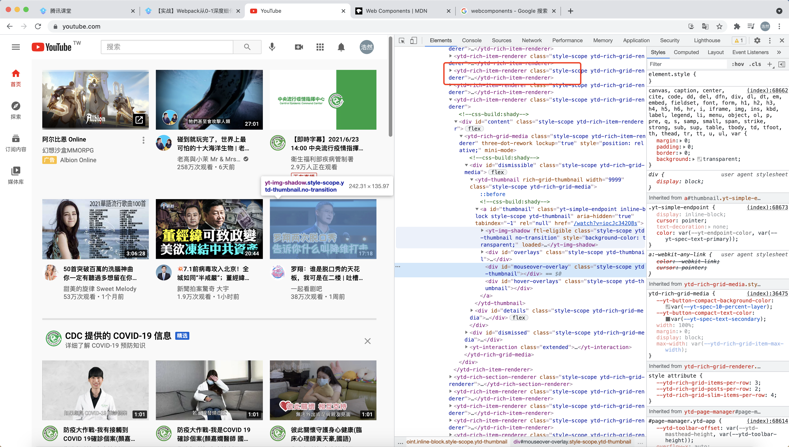

### V、相关框架

现在市面上也出现了很多基于Web Components的框架：

+ X-TAG
+ PolymerJS
+ omi

前三个是国外的，omi是中国的。有兴趣的可以去了解一下，使用一下。这篇文章也会使用X-TAG来进行页面的编写。


## 二、BFF项目架构的工程化改造

我们在**前后端实现BFF架构**一文中实践了BFF架构，现在我们对BFF的项目进行工程化的改造。使用Webpack对于前端的代码进行编译打包，后端的Node代码使用gulp来打包编译，实现BFF层面的前后端分离。

在工程化改造之前给大家推荐几个好用的工具：

+ **scripty** 这个工具主要是用来优化package.json中的打包命令的。有的时候我们的打包命令不可避免的会很长，这样编写起来不是很方便，有了scripty就可以解决这个问题。

  在YII的项目中存在一个`bin`目录，是用来存放执行命令的。我们在BFF项目里面也可以新建一个`scripts`目录来存放package.json中执行的命令。

  安装：

  ```
  $ npm install --save-dev scripty
  ```

  随着我们项目越来越复杂，那么随之而来的就是package.json中的scripts命令就会越来越多，为了便于管理我们就要使用scripty。我们来看一下工程化之后的package.json：

  ```json
  {
    "name": "BFF-Project",
    "version": "1.0.0",
    "main": "index.js",
    "license": "MIT",
    "scripts": {
      "client:dev": "scripty",
      "client:prod": "scripty",
      "server:dev": "scripty",
      "server:prod": "scripty",
      "server:start": "scripty",
      
      "start": "NODE_ENV=development nodemon --delay 500ms --exec 'babel-node ./app.js'",
      "test:e2e": "node tests/e2e.test.js",
      "test:api": "mocha --file ./tests/api.test.js"
    },
    "dependencies": {
      "@koa/router": "^10.0.0",
      "axios": "^0.21.1",
      "co": "^4.6.0",
      "koa": "^2.13.1",
      "koa-static": "^5.0.0",
      "koa-swig": "^2.2.1",
      "koa2-connect-history-api-fallback": "^0.1.3",
      "log4js": "^6.3.0"
    },
    "devDependencies": {
      "@babel/core": "^7.14.5",
      "@babel/node": "^7.14.5",
      "@babel/preset-env": "^7.14.5",
      "chai": "^4.3.4",
      "mocha": "^9.0.0",
      "playwright": "^1.12.2",
      "scripty": "^2.0.0",
      "supertest": "^6.1.3"
    }
  }
  ```

  可以看到我们改写了package.json中的scripts脚本，增加了包含服务端和客户端的一些命令。这样的话我们就可以使用scripty来对.sh脚本进行管理。根据[scripty的使用方法](https://github.com/testdouble/scripty#readme)我们进行如下操作：

  + 根据package.json中scripts的配置，我们在项目的script目录里新建client目录和server目录。

  + 在`/scripts/client`目录中新建dev.sh和prod.sh文件。

  + 在`/scripts/server`目录中新建dev.sh和prod.sh文件以及start.sh文件。

  + 需要注意的是.sh就是可执行文件，所以我们需要赋给script目录可执行权限。

    ```
    // 执行完这条命令，scripts中的.sh文件就拥有了可执行权限，就可以被直接执行
    $ chmod -R +x scripts
    ```

  + 然后我们做一下测试：

    ```shell
    # /scripts/client/dev.sh
    echo 'hello world'
    ```

    执行`npm run client:dev`，得到如下结果：

    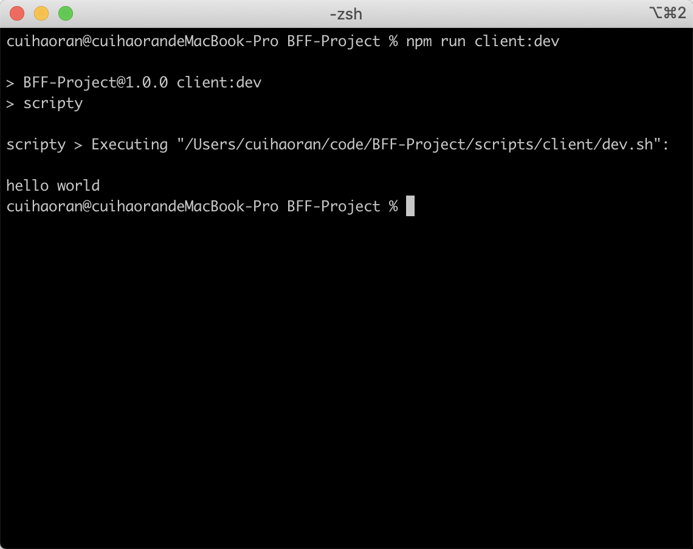

    > 需要注意的是我们在编写package.json的scripts脚本的时候，`start`、`test`、`build`这三个脚本命令是不要轻易的自定义的，这三个命令一般是上线的时候才运行的。start在生产环境一般是pm2启动，test是测试线上的代码，build是打包生产环境的client端和server端的代码。

    这里着重说一下build和test这两条命令的配置：

    ```json
    {
      "name": "BFF-Project",
      "version": "1.0.0",
      "main": "index.js",
      "license": "MIT",
      "scripts": {
        "client:dev": "scripty",
        "client:prod": "scripty",
        "server:dev": "scripty",
        "server:prod": "scripty",
        "server:start": "scripty",
        "test:e2e": "scripty",
        "test:api": "scripty",
    
        "start": "pm2",
        "test": "npm run test:api & npm run test:e2e",
        "build": "npm run server:prod & npm run client:prod"
      },
      ...
    }
    ```

    看上面的代码，我们会发现test和build实际上是各自并行的执行了两条命令，这是一种简便的写法，可以简化我们的shell脚本。这里有一个点，两条命令以`&`连接说明前后两条命令是并行执行，如果以`&&`连接，前后两条命令是串行执行。

一个重要的概念就是对于package.json来说是有生命周期的，开发者可以决定在某条命令之前执行别的命令：

```json
{
  "name": "BFF-Project",
  "version": "1.0.0",
  "main": "index.js",
  "license": "MIT",
  "scripts": {
		"demo": "echo demo执行",
    "predemo": "echo demo之前执行",
    "start": "pm2",
    "test": "npm run test:api & npm run test:e2e",
    "build": "npm run server:prod & npm run client:prod"
  },
  ...
}
```

我们来运行`npm run demo`：

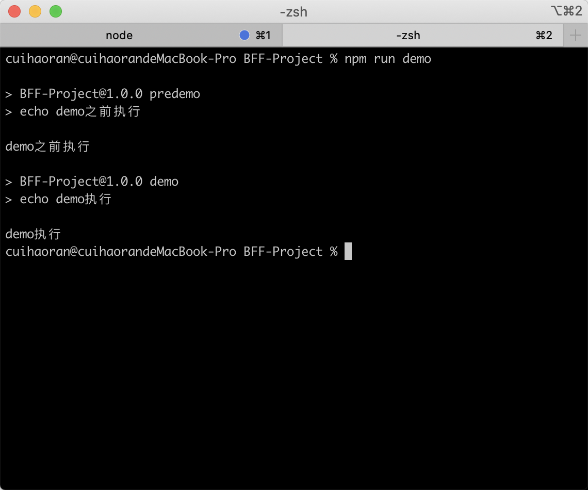

我们可以看到先执行了predemo后执行demo。

+ 第二个工具是**jscpd**，这个工具主要是代码重复率的检查。我们先来安装上：

  ```
  $ npm install jscpd -D
  ```

  和babel差不多需要先配置一个.jscpd.json文件：

  ```json
  {
    "threshold": 0,
    "reporters": ["html", "console"]
  }
  ```

  在配置文件中我们只配置了一个阈值和html报告以及控制台输出。

  我们创建一个需要测试的JS文件：

  ```javascript
  // /demo/test.js
  
  function testFun() {
    return 'hello world';
  }
  
  function testFun() {
    return 'hello world';
  }
  
  function testFun() {
    return 'hello world';
  }
  
  function testFun() {
    return 'hello world';
  }
  ```

  我们可以看到里面全是重复代码，然后我们在package.json中配置测试命令：

  ```json
  {
    "name": "BFF-Project",
    "version": "1.0.0",
    "main": "index.js",
    "license": "MIT",
    "scripts": {
  		"demo": "echo demo执行",
      "predemo": "echo demo之前执行",
      "start": "pm2",
      "jscpd": "jscpd './demo/test.js'",
      "test": "npm run test:api & npm run test:e2e",
      "build": "npm run server:prod & npm run client:prod"
    },
    ...
  }
  ```

  配置完这些我们就可以运行一下测试命令了：

  ```
  $ npm run jscpd
  ```

  结果如下图，会输出控制台信息和report HTML，report HTML存储在项目的report目录中：

  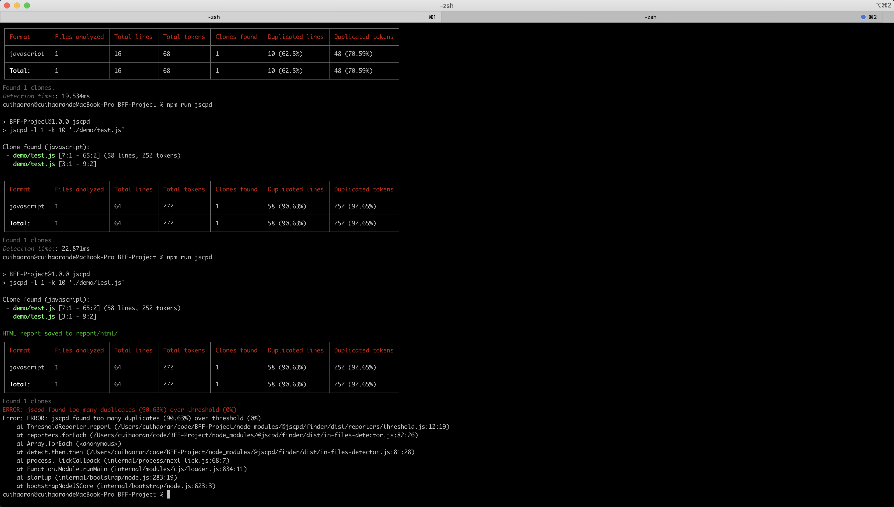

  浏览器打开report中html目录下的index.html可以看到：

  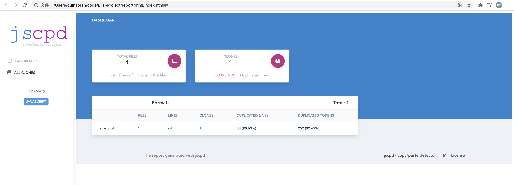

  控制台和网页都清楚的展示出了被测试的文件代码的重复率。非常直观好用。

**到此为止我们就把工程化改造需要的小工具介绍完了，下面我们正式开始工程化改造。**


## 三、工程化改造具体步骤

第一步需要我们整理并更改一下项目的目录结构，新建一个src目录，在src中新建两个目录一个是web目录一个是server目录，server目录存放Node服务端的代码，web目录存放前端的代码。

服务端的代码包含项目中的以下这些目录和文件：

+ app.js

+ config
+ controllers
+ models
+ middleware
+ utils

前端的代码包含项目中以下这些目录：

+ assets
+ components
+ views

然后我们删除一些测试生成的报告文件，把report目录整个删除。现在的目录结构如下图：

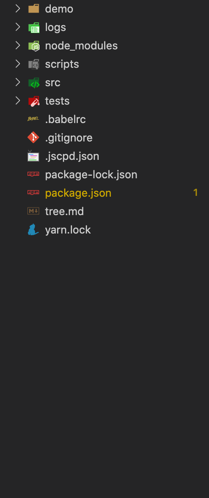

由于目录结构的变化我们需要改变一些某些文件的路径：

```javascript
/* /src/server/config/index.js */

import path from 'path';
let config = {
  viewsDir: path.join(__dirname, '../../', 'web/views'),
  staticDir: path.join(__dirname, '../../', 'web/assets')
};

if(process.env.NODE_ENV === 'development') {
  const devConfig = {
    port: 8000,
    catch: false,
  }
  config = { ...config, ...devConfig };
}

if(process.env.NODE_ENV === 'production') {
  const prodConfig = {
    port: 8080,
    catch: 'memory'
  }
  config = { ...config, ...prodConfig };
}


export default config;
```

由于app.js的路径发生了变化，所以执行的命令也要发生响应的变化：

```shell
NODE_ENV=development nodemon --delay 500ms --exec 'babel-node ./src/server/app.js'
```

现在我们更改完成了，执行一下`npm run server:start`启动服务。

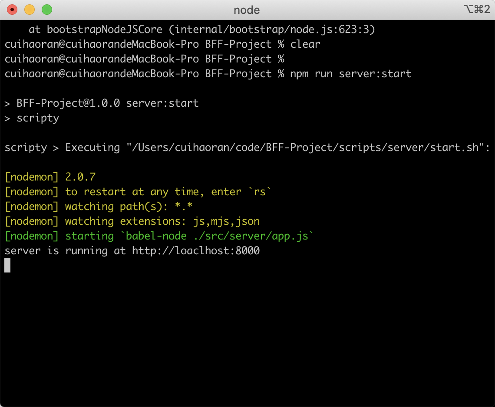

可以看到可以正常启动，说明我们的目录改造工作已经完成。

第二步，我们现在是一个多页应用MPA（many page application）。如果使用webpack打包的话就涉及到一个多入口的问题。

首先我们要安装webpack和webpack-cli：

```
$ npm install -D webpack webpack-cli
```

我们在使用webpack对我们的前端代码进行打包的时候，webpack默认会到项目的根目录下寻找`webpack.config.js`，所以我们需要在项目根目录新建一个webpack.config.js。

```javascript
// webpack.config.js

module.exports = {
  entry: "",		// 入口 要打包的文件
  output: "",		// 出口 打包完成之后输出的文件
  module: ""		// 需要打包的模块
}
```

然后我们再处理一下web目录中的views目录，把其他的都删掉，处理成**views/books/pages/list.html**这样的层级。在pages目录下新建一个**create.html**。webpack在打包的时候是需要一个js文件作为入口的，所以我们打包多页面应用那么就要给每个页面都配置一个入口的JS文件，这个入口文件是webpack为了更好的处理JS和CSS文件。在views/books目录下新建**books-create.entry.js**和**books-list.entry.js**两个文件作为list.html和create.html的入口文件。**这里要注意我们所有的入口文件都是*.entry.js命名**。配置完这两个入口文件就可以打包了。

对于webpack的打包我们也是需要区分环境的，所以webpack的配置也是要和服务端的config是一样的，区分公共配置的不同环境下的私有配置。在项目开发中一般把公共的配置放在**webpack.config.js**中，创建几个不同的webpack配置文件来编写不同环境下个性化的配置。

现在我们的项目区分了开发环境和生产环境，所以我们在**/scripts/client**目录中会存在两个脚本dev.sh和prod.sh。

```shell
/* /scripts/client/dev.sh */

webpack --mode development
```

```shell
/* /scripts/client/prod.sh */

webpack --mode production
```

这是前端webpack打包的命令，webpack利用`--mode development`的方式进行环境变量的注入，然后在**webpack.config.js**可以拿到，以此区分不同环境下的打包，这个环境变量我们能够使用node的process下的argv来获得：

```javascript
// webpack.config.js

// 在webpack.config.js中打印argv
console.log('dev', process.argv);
```

打印结果如下：

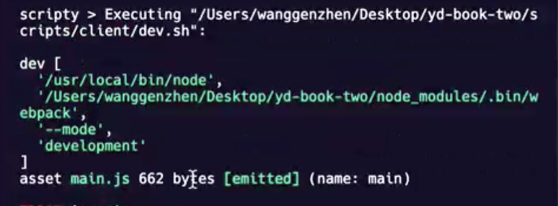

我们可以看到输出的结果是一个数组，这样的话我们就可以使用下标来获取环境变量。但是这里存在一个问题，在不同的系统下我们得到的数组不同，环境变量在数组中的位置也不同，这就使得用下标获取会出现取错的情况，未解决这个问题我们可以使用一个库，**yargs**。yargs可以把process.argv数组转换为对象。

```shell
$ npm install -D yargs
```

然后我们在webpack.config.js中引入并使用：

```javascript
// webpack.config.js

const { argv } = require('yargs');

console.log(argv);
```

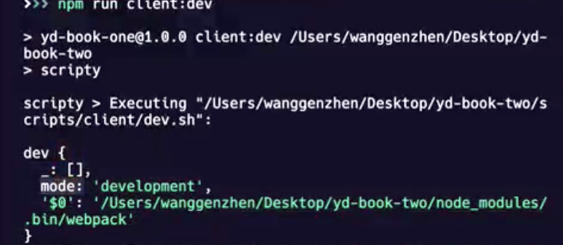

我们可以看到输出是一个对象，我们使用argv.mode就能拿到当前的webpack的环境变量。现在拿到了环境变量就表示我们能够对环境进行代码逻辑的区分了。

```javascript
// webpack.config.js

const { argv } = require('yargs');
const mode = argv.mode || 'development';

module.exports = {
  mode,
  entry: "",		// 入口 要打包的文件
  output: "",		// 出口 打包完成之后输出的文件
  module: ""		// 需要打包的模块
}
```

在webpack中设置mode，wepack会根据mode的环境做不同的处理，比如说如果是development环境代码就不会压缩，如果是production代码就会默认压缩。现在我们正式进行打包环境的区分。为了配置清晰分环境打包的webpack配置文件都放在build目录下，在build目录先新建`webpak.development.js`、`webpack.production.js`分别对应开发环境和生产环境。现在开始修改webpack.config.js：

```javascript
// webpack.config.js

const { argv } = require('yargs');
const mode = argv.mode || 'development';

const envConfig = require(`./build/webpack.${mode}.js`);

module.exports = {
  mode,
  entry: "",		// 入口 要打包的文件
  output: "",		// 出口 打包完成之后输出的文件
  module: ""		// 需要打包的模块
}
```

现在webpack.config.js中有两个配置一个是环境的webpack配置，一个是公共配置，这两个配置需要合并在一起，所以我们要使用webpack-merge这个库来完成配置的合并：

安装webpack-merge

```shell
$ npm install -D webpack-merge
```

合并webpack配置：

```javascript
// webpack.config.js

const { argv } = require('yargs');
const { merge } = require('webpack-merge')
const mode = argv.mode || 'development';
// 分环境加载配置
const envConfig = require(`./build/webpack.${mode}.js`);
// 公共的webpack配置
const bisicConfig = {
  mode,
  entry: "",		// 入口 要打包的文件
  output: "",		// 出口 打包完成之后输出的文件
  module: ""		// 需要打包的模块
}

// 合并配置
module.exports = merge(basicConfig, envConfig);
```

到这里我们就完成了webpack的配置合并。

因为要对多页面应用进行打包，接下来我们要对webpack打包进行多入口处理。多入口处理就是entry接收一个入口的数组。这个数组我们可以根据我们的页面位置和文件名进行手写，但是页面一旦达到一定的量级我们手写的话就会很麻烦，我们可以自动的识别开发的多页面，从而自动生成多入口数组。自动识别文件需要使用到**glob**这个库：

```shell
$ npm install -D glob
```

然后再webpack.config.js中使用：

```javascript
// webpack.config.js

const { argv } = require('yargs');
const { merge } = require('webpack-merge');
const glob = require('glob');
const mode = argv.mode || 'development';
// 分环境加载配置
const envConfig = require(`./build/webpack.${mode}.js`);
// 匹配文件  入口文件统一的命名方式就是为了在这里容易匹配，好处理。
const files = glob.sync('./src/web/views/**/*.entry.js');
// 先来输出一下匹配到的files
console.log("files --->", files);

// 公共的webpack配置
const bisicConfig = {
  mode,
  entry: "",		// 入口 要打包的文件
  output: "",		// 出口 打包完成之后输出的文件
  module: ""		// 需要打包的模块
}

// 合并配置
module.exports = merge(basicConfig, envConfig);
```

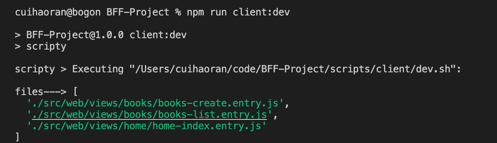

可以看到输出出来的files是一个入口文件路径的数组。下面我们就是要用这个数组来处理成entry入口的数组格式，我们先来看一下entry的入口格式：

```javascript
...
const bisicConfig = {
  mode,
  entry: {
    "打包后的文件名称": "打包文件的位置",
    "books-create": "./src/web/views/books/books-create.entry.js"
  },		// 入口 要打包的文件
  output: "",		// 出口 打包完成之后输出的文件
  module: ""		// 需要打包的模块
}
...
```

接下来我们把entry处理成这个格式：

```javascript
// webpack.config.js

const { argv } = require('yargs');
const { merge } = require('webpack-merge');
const glob = require('glob');
const mode = argv.mode || 'development';
// 分环境加载配置
const envConfig = require(`./build/webpack.${mode}.js`);
// 匹配文件  入口文件统一的命名方式就是为了在这里容易匹配，好处理。
const files = glob.sync('./src/web/views/**/*.entry.js');
// webpack入口对象
const entries = {};
files.forEach(path => {
  // 使用正则匹配 匹配到”xxx-xxx.entry.js“，然后取出"xxx-xxx"
  if(/([a-zA-Z]+-[a-zA-Z]+)\.entry\.js/.test(path)) {
    const entryKey = RegExp.$1;
    entries[entryKey] = path;
  }
});

// 输出一下处理完的entries
console.log('entries---->', entries);

// 公共的webpack配置
const bisicConfig = {
  mode,
  entry: entries,		// 入口 要打包的文件
  output: "",		// 出口 打包完成之后输出的文件
  module: ""		// 需要打包的模块
}

// 合并配置
module.exports = merge(basicConfig, envConfig);
```

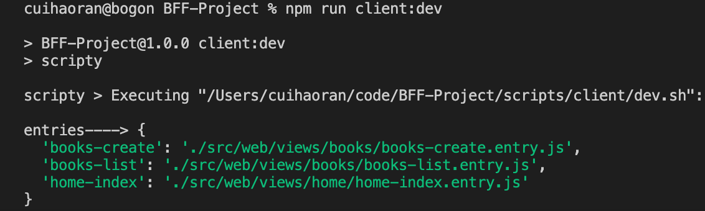

我们可以看到输出的结果，是正确的的，到现在我们已经把多入口对象处理完毕。

那么接下来我们配置一下**output对象**，这里我们要使用到node的path对象，来统一不同操作系统的路径。先在**books-list.entry.js**中随意编写一段代码：

```javascript
// /src/web/views/books-list.entry.js

class BooksList {
  constructor() {
    console.log('books list init');
  }
}

new BooksList();
```

> loader和babel的区别：
>
> + lodaer是一个转换器，比如说把a.less转成a.css
> + plugin丰富了webpack的功能

然后，我们安装一下**babel-loader**：

```shell
npm install -D babel-laoder
```

我们现在开始添加output和model：

```javascript
// webpack.config.js

const { argv } = require('yargs');
const { merge } = require('webpack-merge');
const path = require('path');
const glob = require('glob');
const mode = argv.mode || 'development';
// 分环境加载配置
const envConfig = require(`./build/webpack.${mode}.js`);
// 匹配文件  入口文件统一的命名方式就是为了在这里容易匹配，好处理。
const files = glob.sync('./src/web/views/**/*.entry.js');
// webpack入口对象
const entries = {};
files.forEach(path => {
  // 使用正则匹配 匹配到”xxx-xxx.entry.js“，然后取出"xxx-xxx"
  if(/([a-zA-Z]+-[a-zA-Z]+)\.entry\.js/.test(path)) {
    const entryKey = RegExp.$1;
    entries[entryKey] = path;
  }
});

// 输出一下处理完的entries
console.log('entries---->', entries);

// 公共的webpack配置
const bisicConfig = {
  mode,
  entry: entries,		// 入口 要打包的文件
  output: {
    path: path.join(__dirname, './dist/assets'),
    filename: 'scripts/[name].bundle.js'
  },		// 出口 打包完成之后输出的文件
  module: {
    rules: [{
        test: /\.js$/,
        use: ['babel-loader']
    }]
  }		// 需要打包的模块
}

// 合并配置
module.exports = merge(basicConfig, envConfig);
```

这样配置完之后，执行`npm run client:dev`就可以打包成功。这时你就会发现dist目录里生成了一个scripts目录，目录里生成了两个打包好的文件：`books-create-bundle.js`、`books-list-bundle.js`。可以看一下**books-list-bundle.js**里面的内容，你会发现打包出了很多没有见过的代码，这写代码包含了Webpack运行时，然后把我们写的ES6的类，打包成了ES5的原型链写法。

通过这种webpack打包的方式我们可以在入口文件中引入JS文件和CSS文件，然后打包完成之后再塞到Node后端的swig模板中去。这是我们使用webpack打包静态前端代码的根本目的。

**看一下swig模板和组件的使用**

接下来我们新建一个**src/web/views/layouts/layout.html**：

```html
<!-- src/web/views/layouts/layout.html -->
<!DOCTYPE html>
<html lang="en">
<head>
  <meta charset="UTF-8">
  <meta http-equiv="X-UA-Compatible" content="IE=edge">
  <meta name="viewport" content="width=device-width, initial-scale=1.0">
  <title></title>
  
</head>
<body>
  
  
</body>
</html>
```

这些``就是一些占位符，其他的页面都继承自这一页面，然后把不同的内容渲染到占位符中。我们分别说一下layout.html中的占位符：

+ `````` title的占位符
+ ``````head的占位符
+ ``````页面内容的站位符
+ ``````JS脚本的占位符

创建一个前端的组件，在**src/web/components**新建一个nav目录，在里面创建nav.html、nav.css、nav.js：

```html
<!-- src/web/components/nav/nav.html -->
<!-- 只需要写内容   不需要写html的完整结构 -->
<ul>
  <li><a href="/">首页</a></li>
  <li><a href="/books/list">图书列表页</a></li>
  <li><a href="/books/create">图书创建页</a></li>
</ul>
```

```css
/* src/web/components/nav/nav.css */

ul {
  background-color: aqua;
}
```

```javascript
/* src/web/components/nav/nav.js */

function nav() {
  console.log('nav init');
}

export default nav;
```

写好了layout页面和nav组件，我们来修改一下**src/web/views/book/book-list.html**，book-list.html页面继承自layout页面，然后把nav组件塞进去：

```html


图书列表页


<style>
  body {
    background-color: yellow;
  }
</style>



  
  
    <div>{{ item.name }} - {{ item.price }}</div>
  



  

```

list页面继承自layout页面，然后就可以往layout页面里的占位符中渲染dom了，还使用include模板语法引入了一个组件。使用for …… in语法渲染了列表。

更改完了list页面之后我们还需要更改一些后端的路由，因为我们的页面的位置在工程化改造过程中发生了变化。

```javascript
import Controller from './Controller';
import BooksModel from '../models/BooksModel'

class BooksController extends Controller {
  constructor () {
    super();
  }

  async actionBooksListPage(ctx, next) {
    console.log('books/list')
    const booksModel = new BooksModel();
    const result = await booksModel.getBookList();
    // 更改为'books/pages/list'
    ctx.body = await ctx.render('books/pages/list', { data: result.data });
    next();
  }

  // 新建一个actionBooksCreatePage函数，用啦渲染create页面
  async actionBooksCreatePage(ctx, next) {
    ctx.body = await ctx.render('books/pages/create');
    next();
  }
}

export default BooksController;
```

改完之后我们来看一下浏览器的渲染效果，在地址栏输入`localhost:8000/books/list`：

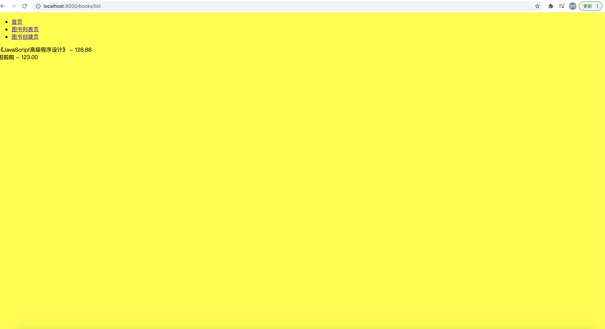

相同的我们也可以改一下create页面。现在我们模板已经处理的差不多了，接下来就是使用webpack进行打包了，我们需要把JS和CSS文件都打包到HTML中。需要使用`html-webpack-plugin`。

```shell
$ npm install -D html-webpack-plugin
```

安装完成之后，在webpack.config.js中引入使用：

```javascript
// webpack.config.js

const { argv } = require('yargs');
const { merge } = require('webpack-merge');
// 页面模板处理，webpack会把css和js注入到HTML中
const HTMLWebpackPlugin = require('html-webpack-plugin');
const path = require('path');
const glob = require('glob');
const mode = argv.mode || 'development';
// 分环境加载配置
const envConfig = require(`./build/webpack.${mode}.js`);
// 匹配文件  入口文件统一的命名方式就是为了在这里容易匹配，好处理。
const files = glob.sync('./src/web/views/**/*.entry.js');
// webpack入口对象
const entries = {};
files.forEach(path => {
  // 使用正则匹配 匹配到”xxx-xxx.entry.js“，然后取出"xxx-xxx"
  if(/([a-zA-Z]+-[a-zA-Z]+)\.entry\.js/.test(path)) {
    const entryKey = RegExp.$1;
    entries[entryKey] = path;
  }
});

// 输出一下处理完的entries
console.log('entries---->', entries);

// 公共的webpack配置
const bisicConfig = {
  mode,
  entry: entries,		// 入口 要打包的文件
  output: {
    path: path.join(__dirname, './dist/assets'),
    filename: 'scripts/[name].bundle.js'
  },		// 出口 打包完成之后输出的文件
  module: {
    rules: [{
        test: /\.js$/,
        use: ['babel-loader']
    }]
  },		// 需要打包的模块
  plugins: [ new HTMLWebpackPlugin() ]
}

// 合并配置
module.exports = merge(basicConfig, envConfig);
```

执行**npm run client:dev**，我们看一下结果：

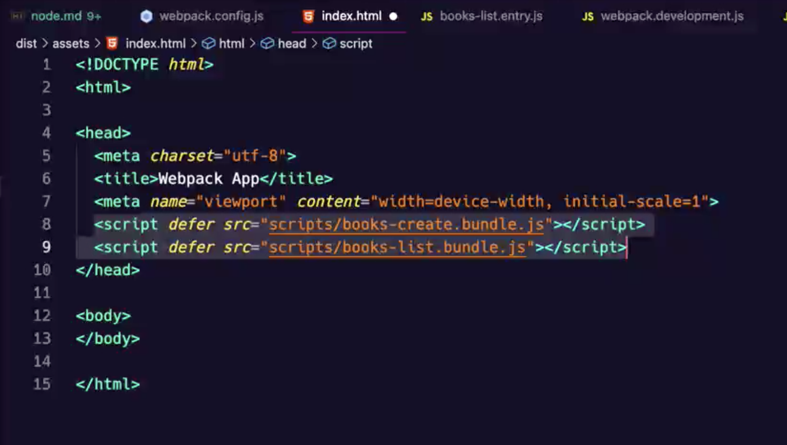

我们会发现，我们是个多页面应用，但是webpack就打包出一个index.html，这显然是不合适的，这里的html打包和上文中的JS打包相同的需要根据每个入口打包，一个入口文件对应一个html，并且每个html中需要引入各自的JS和CSS而不是全部引入，这样的话我们就要对webpack.config.js进行配置：

```javascript
// webpack.config.js

const { argv } = require('yargs');
const { merge } = require('webpack-merge');
// 页面模板处理，webpack会把css和js注入到HTML中
const HTMLWebpackPlugin = require('html-webpack-plugin');
const path = require('path');
const glob = require('glob');
const mode = argv.mode || 'development';
// 分环境加载配置
const envConfig = require(`./build/webpack.${mode}.js`);
// 匹配文件  入口文件统一的命名方式就是为了在这里容易匹配，好处理。
const files = glob.sync('./src/web/views/**/*.entry.js');
// webpack入口对象
const entries = {};
// 多页面资源注入处理
const htmlPlugins = [];
files.forEach(path => {
  // 使用正则匹配 匹配到”xxx-xxx.entry.js“，然后取出"xxx-xxx"
  if(/([a-zA-Z]+-[a-zA-Z]+)\.entry\.js/.test(path)) {
    const entryKey = RegExp.$1;
    const [ pageName, template ] = entryKey.split('-');
    entries[entryKey] = path;
    // new HTMLWebpackPlugin要做两个配置，filename是打包之后文件输出到哪里，template是打包的页面在哪儿
    htmlPlugins.push(new HTMLWebpackPlugin({
      // 这里的路径是以output下的path路径为基准的。
      filename: `../views/${pageName}/pages/${template}.html`,
      // 模板文件的路径是以当前webpack文件的位置为基准（正常找就可以）
      template: `./src/web/views/${pageName}/pages/${template}.html`
    }));
  }
});

// 公共的webpack配置
const bisicConfig = {
  mode,
  entry: entries,		// 入口 要打包的文件
  output: {
    path: path.join(__dirname, './dist/assets'),
    filename: 'scripts/[name].bundle.js'
  },		// 出口 打包完成之后输出的文件
  module: {
    rules: [{
        test: /\.js$/,
        use: ['babel-loader']
    }]
  },		// 需要打包的模块
  plugins: [ ...htmlPlugins ]
}

// 合并配置
module.exports = merge(basicConfig, envConfig);
```

现在打包，就会发现打包了多页面。但是现在还存在两个问题：

+ 每个html文件中引入了全部的JS文件
+ JS文件并没有被引入到```...```里面

现在我们要做的就是解决这两个问题。首先处理第一个问题，我们让每个HTML只引入该引入的JS文件并做一个优化把webpack入口的JS文件的运行时代码抽离出来，更改webpack配置：

```javascript
// webpack.config.js

const { argv } = require('yargs');
const { merge } = require('webpack-merge');
// 页面模板处理，webpack会把css和js注入到HTML中
const HTMLWebpackPlugin = require('html-webpack-plugin');
const path = require('path');
const glob = require('glob');
const mode = argv.mode || 'development';
// 分环境加载配置
const envConfig = require(`./build/webpack.${mode}.js`);
// 匹配文件  入口文件统一的命名方式就是为了在这里容易匹配，好处理。
const files = glob.sync('./src/web/views/**/*.entry.js');
// webpack入口对象
const entries = {};
// 多页面资源注入处理
const htmlPlugins = [];
files.forEach(path => {
  // 使用正则匹配 匹配到”xxx-xxx.entry.js“，然后取出"xxx-xxx"
  if(/([a-zA-Z]+-[a-zA-Z]+)\.entry\.js/.test(path)) {
    const entryKey = RegExp.$1;
    const [ pageName, template ] = entryKey.split('-');
    entries[entryKey] = path;
    // new HTMLWebpackPlugin要做两个配置，filename是打包之后文件输出到哪里，template是打包的页面在哪儿
    htmlPlugins.push(new HTMLWebpackPlugin({
      // 这里的路径是以output下的path路径为基准的。
      filename: `../views/${pageName}/pages/${template}.html`,
      // 模板文件的路径是以当前webpack文件的位置为基准（正常找就可以）
      template: `./src/web/views/${pageName}/pages/${template}.html`,
      // 解决JS文件全部引入的问题只需要设置chunks为当前入口的entryKey
      chunks: [entryKey]
    }));
  }
});

// 公共的webpack配置
const bisicConfig = {
  mode,
  entry: entries,		// 入口 要打包的文件
  output: {
    path: path.join(__dirname, './dist/assets'),
    filename: 'scripts/[name].bundle.js'
  },		// 出口 打包完成之后输出的文件
  optimization: {
    runtimeChunk: "single"
  },
  module: {
    rules: [{
        test: /\.js$/,
        use: ['babel-loader']
    }]
  },		// 需要打包的模块
  plugins: [ ...htmlPlugins ]
}

// 合并配置
module.exports = merge(basicConfig, envConfig);
```

优化完的打包结果如图：

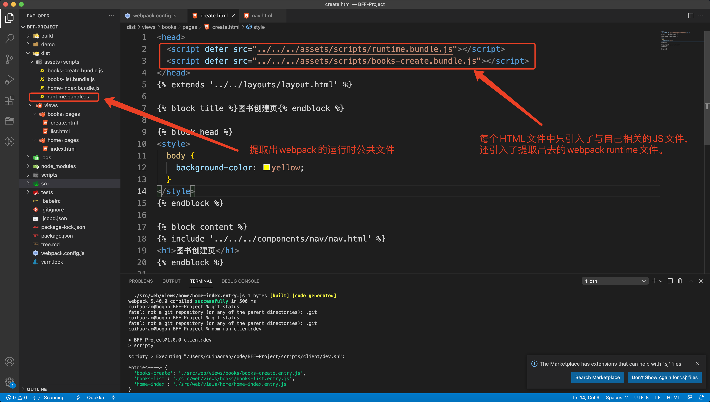

关于第二个问题的解决思路是：

+ 在要插入JS的地方事先做好标记。

+ 在webpack的打包过程中做拦截，把打包好的JS插入到做标记的地方。类似于Vue的`<router-view>`。

到这里我们的Webpack深度细化BFF就完成了一半了。


