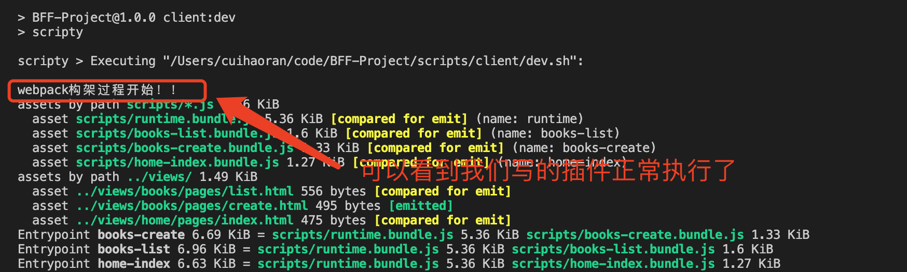
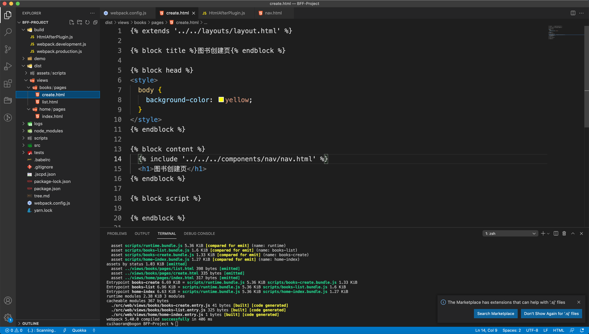
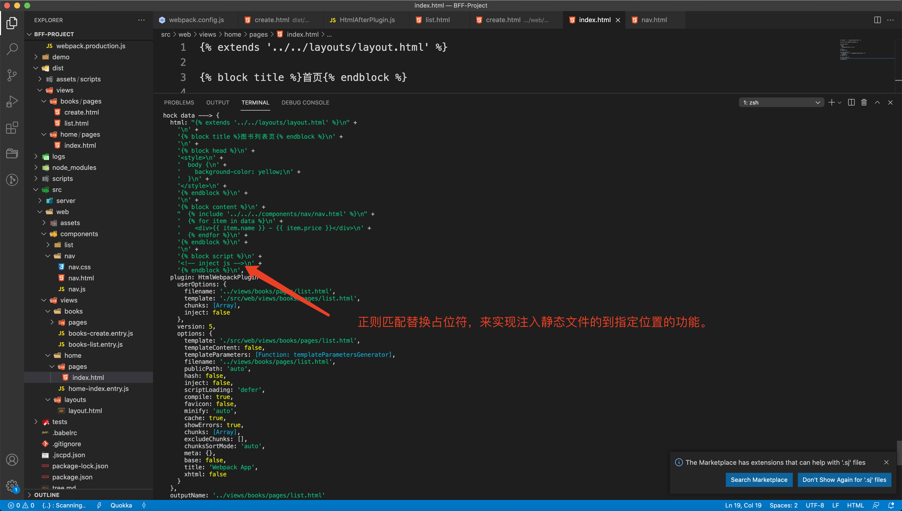
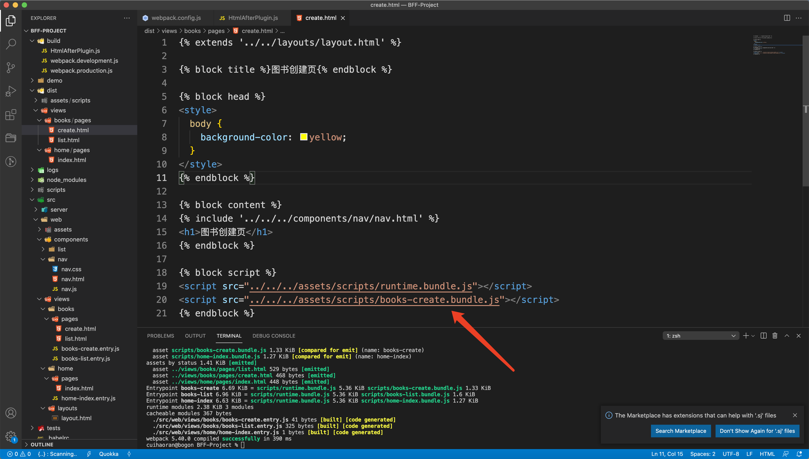
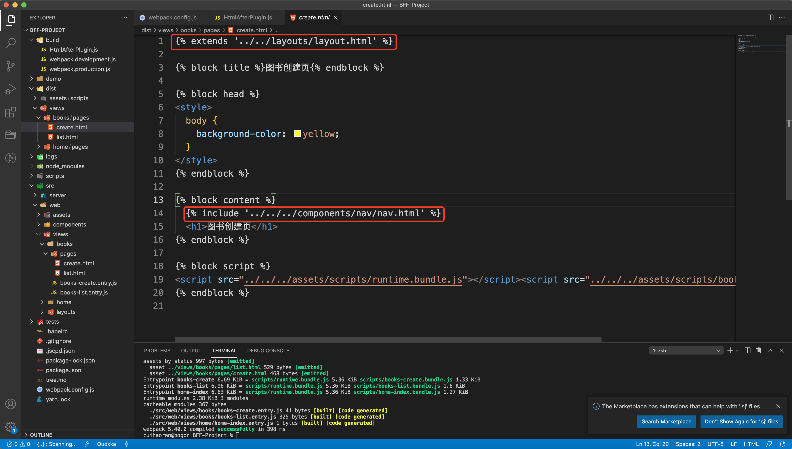
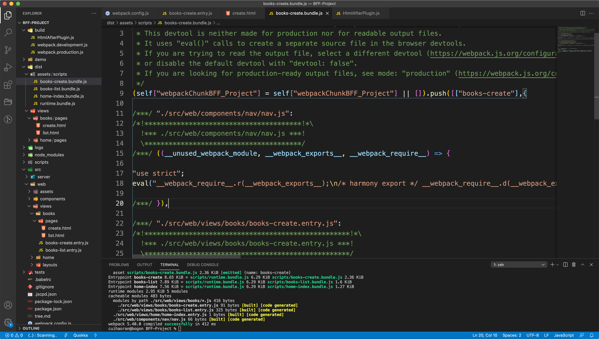
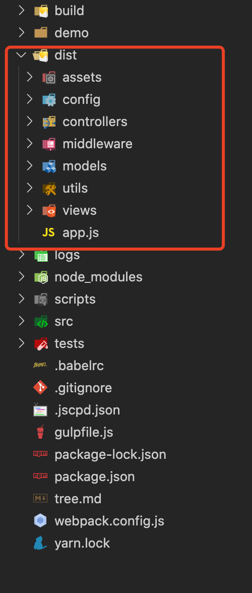
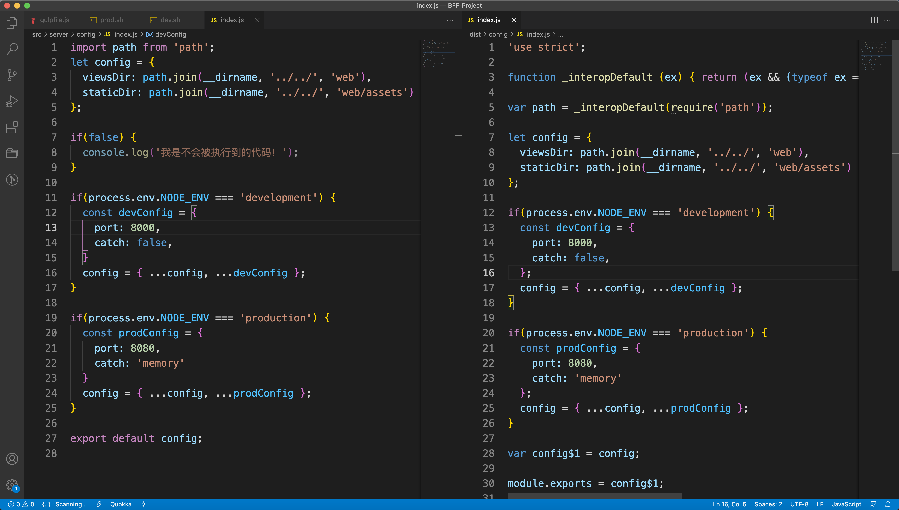
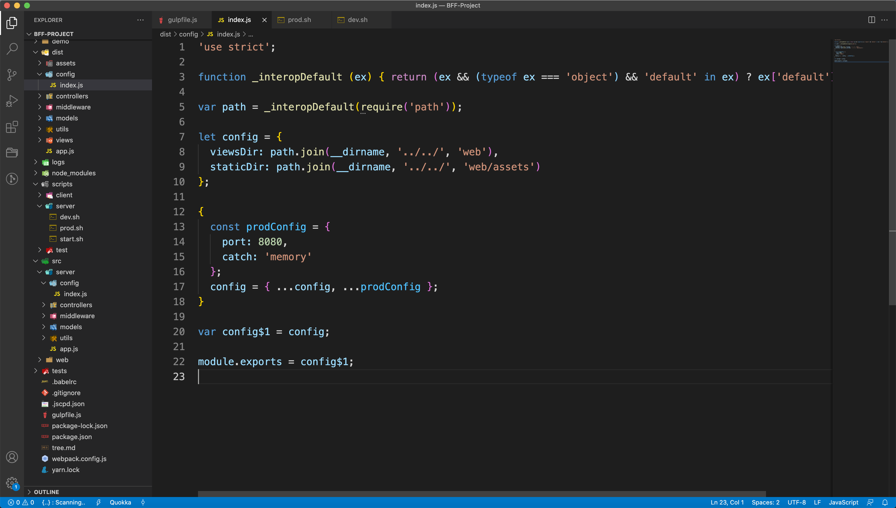

# Webpack从0-1深度细化BFF（二）

## 零、写在前面

我们这篇文章会把深度细化BFF的所有内容讲完：

+ 编写一个自定义的plugin，用于将JS塞到模板的指定位置


## 一、编写Webpack Plugin

在build目录中新建**HtmlAfterPlugin.js**文件。我们先看一下[Webpack官网](https://webpack.js.org/concepts/plugins/)，摘录一下plugin的一段代码到HtmlAfterPlugin.js，然后根据我们具体的需求更改一下：

```javascript
// HtmlAfterPlugin.js

const pluginName = 'ConsoleLogOnBuildWebpackPlugin';

class ConsoleLogOnBuildWebpackPlugin {
  // compiler是wabpack的核心
  apply(compiler) {
    // 钩子
    compiler.hooks.run.tap(pluginName, (compilation) => {
      console.log('webpack构架过程开始！！');
    });
  }
}

module.exports = ConsoleLogOnBuildWebpackPlugin;
```

然后我们写了这么一个demo，接下来需要引入到webpack.config.js中使用一下：

```javascript
// webpack.config.js

const { argv } = require('yargs');
const { merge } = require('webpack-merge');
const path = require('path');
// 匹配文件使用
const glob = require('glob');

// 页面模板处理
const HTMLWebpackPlugin = require('html-webpack-plugin');
// 引入自定义插件，这个自定义插件的功能是基于HTMLWebpackPlugin插件的功能之上开发的
const HtmlAfterPlugin = require('./build/HtmlAfterPlugin.js');

const mode = argv.mode || 'development';
// 分环境加载配置
const envConfig = require(`./build/webpack.${mode}.js`);
const files = glob.sync('./src/web/views/**/*.entry.js');
// webopack多入口配置对象
const entries = {};
// 多页面资源注入处理
const htmlPlugins = [];

files.forEach(path => {
  if(/([a-zA-Z]+-[a-zA-Z]+)\.entry\.js/.test(path)) {
    const entryKey = RegExp.$1;
    const [pageName, template] = entryKey.split('-');
    entries[entryKey] = path;
    htmlPlugins.push(
      new HTMLWebpackPlugin({
        filename: `../views/${pageName}/pages/${template}.html`,
        template: `./src/web/views/${pageName}/pages/${template}.html`,
        chunks: [entryKey]
      })
    )
  }
});

/**
 * @baseConfig 不同环境下公共的配置
 */
const baseConfig = {
  mode,
  entry: entries,
  output: {
    path: path.join(__dirname, './dist/assets'),
    filename: 'scripts/[name].bundle.js'
  },
  optimization: {
    runtimeChunk: "single"
  },
  module: {
    rules: [
      {
        test: /\.js$/,
        use: ['babel-loader']
      }
    ]
  },
  plugins: [
    ...htmlPlugins,
    // 注意一定要在HTMLWebpackPlugin之后注入，这里的顺序一定不能乱！
    new HtmlAfterPlugin()
  ]
}

// 合并配置
module.exports = merge(baseConfig, envConfig);
```

然后我们执行`npm run client:dev`：



这里要注意我们的自定义插件是基于**HTMLWebpackPlugin**这个插件的功能之上进行开发的，所以一定要让HTMLWebpackPlugin先执行，所以在webpack.config.js注入plugin的时候一定要注意插件的注入顺序（也就是plugins数组中元素的位置先后一定是HTMLWebpackPlugin在前，我们自定义的插件在后）。

我们自定义插件**HtmlAfterPlugin**的功能就是自定义注入JS文件，把JS文件注入到模板中我们想要注入的地方。所以说我们不需要HTMLWebpackPlugin来进行JS文件的注入，那么我们就要更改一下HTMLWebpackPlugin的配置，不让它注入JS文件。

更改一下webpack.config.js

```javascript
// webpack.config.js

const { argv } = require('yargs');
const { merge } = require('webpack-merge');
const path = require('path');
// 匹配文件使用
const glob = require('glob');

// 页面模板处理
const HTMLWebpackPlugin = require('html-webpack-plugin');
// 引入自定义插件，这个自定义插件的功能是基于HTMLWebpackPlugin插件的功能之上开发的
const HtmlAfterPlugin = require('./build/HtmlAfterPlugin.js');

const mode = argv.mode || 'development';
// 分环境加载配置
const envConfig = require(`./build/webpack.${mode}.js`);
const files = glob.sync('./src/web/views/**/*.entry.js');
// webopack多入口配置对象
const entries = {};
// 多页面资源注入处理
const htmlPlugins = [];

files.forEach(path => {
  if(/([a-zA-Z]+-[a-zA-Z]+)\.entry\.js/.test(path)) {
    const entryKey = RegExp.$1;
    const [pageName, template] = entryKey.split('-');
    entries[entryKey] = path;
    htmlPlugins.push(
      new HTMLWebpackPlugin({
        filename: `../views/${pageName}/pages/${template}.html`,
        template: `./src/web/views/${pageName}/pages/${template}.html`,
        chunks: [entryKey],
        // 设置inject: false
        inject: false
      })
    )
  }
});

...
```

如我们所看见的设置HTMLWebpackPlugin`inject: false`。就这么简单？我们来试一下运行`npm run client:dev`命令，然后查看打包好的html文件：



我们可以看到以前注入的CSS文件和JS文件现在都不存在了。说明我们配置生效了，把HTMLWebpackPlugin插件的注入功能干掉了。接下来就是我们在自定义插件里面按照我们自己的需求编写静态文件注入的逻辑。

关于这部分功能我们可以看看HTMLWebpackPlugin的文档给我们流出来的钩子函数（hook），根据钩子函数来完成静态文件的注入

[HTMLWebpackPlugin文档](https://www.npmjs.com/package/html-webpack-plugin)

下面我们来正式开发我们的HtmlAfterPlugin：

```javascript
// HtmlAfterPlugin.js

// 引入HTMLWebpackPlugin
const HtmlWebpackPlugin = require('html-webpack-plugin');
const pluginName = 'HtmlAfterPlugin';

class HtmlAfterPlugin {
  // compiler是wabpack的核心
  apply(compiler) {
    // 钩子，这里需要按照HTMLWebpackPlugin文档中的demo，不能根据webpack官网中的代码（上文中的）。
    compiler.hooks.compilation.tap(pluginName, (compilation) => {
      console.log('webpack构架过程开始！！');
      // 在beforeEmit钩子函数中写入注入逻辑
      HtmlWebpackPlugin.getHooks(compilation).beforeEmit.tapAsync(
        'HtmlAfterPlugin',
        (data, cb) => {
          console.log('hock data --->', data);
          // 所有的数据都能在data中拿到
          data.html += 'The Magic Footer'
          // 一定要执行这个回调函数
          cb(null, data)
        }
      )
    });
  }
}

module.exports = HtmlAfterPlugin;
```

执行打包命令的结果如下：



可以看到我们拿到了所有的数据（data）。这样的话我们就可以编写注入逻辑了，往下读...

```javascript
// HtmlAfterPlugin.js

// 引入HTMLWebpackPlugin
const HtmlWebpackPlugin = require('html-webpack-plugin');
const pluginName = 'HtmlAfterPlugin';

// 动态生成<script src="...">
const assetHelp = (data) => {
  let js = [];
  for(let item of data.assets.js) {
    js.push(`<script src="${item}"></script>`);
  }
  
  return {
    js
  }
}

class HtmlAfterPlugin {
  constroctor() {
    this.jsArr = [];
  }
  
  // compiler是wabpack的核心
  apply(compiler) {
    // 钩子，这里需要按照HTMLWebpackPlugin文档中的demo，不能根据webpack官网中的代码（上文中的）。
    compiler.hooks.compilation.tap(pluginName, (compilation) => {
      
      // beforeAssetTagGeneration钩子函数能够拿到打包好的JS和CSS文件
      HtmlWebpackPlugin.getHooks(compilation).beforeAssetTagGeneration.tapAsync(
        'HtmlAfterPlugin',
        (data, cb) => {
          const { js } = assetHelp(data);
          this.jsArr = js;
          cb(null, data)
        }
      );
      
      
      // 在beforeEmit钩子函数中写入注入逻辑
      HtmlWebpackPlugin.getHooks(compilation).beforeEmit.tapAsync(
        'HtmlAfterPlugin',
        (data, cb) => {
          // 1.首先我们要把HTML字符串提取出来
          let _html = data.html;
          // 2.进行正则替换
          data.html = _html.replace('<!-- inject js -->', this.jsArr.join(""));
          cb(null, data)
        }
      );
      
    });
  }
}

module.exports = HtmlAfterPlugin;
```

这样的话我们就可以把JS打包到指定的位置了，同样的CSS也是相同的操作，可以仿照JS自行处理。



可以看到打包的结果和我们想要的一样，实现JS文件的执定位置插入。现在关于前端的代码我们还有一个小小的优化要做，可以看到在模板中引入`layout.html`和`nav.html`的时候都是用的当前文件的相对路径进行查找，这样文件层级一旦多了就会变得很繁琐，我们可以像Vue项目中的@符号一样，也写成那样子，然后再webpack打包的过程中再进行还原，这样的话就降低了开发人员的心智负担。

我们先把未打包之前的模板源文件改写成带@符号的路径，然后在beforeEmit钩子函数中拿到HTML字符串再按照正则匹配替换成按照层级查找路径的方式，这样就完成了这个小优化，当然笔者个人认为这种优化可以有也可以没有，完全看开发人员怎么想。当然有了这种小优化代码可以逼格高一点，其实实现原理并不难。

```html
<!-- 以 src/web/views/books/list.html 为例 -->



图书列表页


<style>
  body {
    background-color: yellow;
  }
</style>



  
  
    <div>{{ item.name }} - {{ item.price }}</div>
  



<!-- inject js -->

```

然后我们在html-webpack-plugin中的beforeEmit钩子函数中做正则替换：

```javascript
// HtmlAfterPlugin.js

// 引入HTMLWebpackPlugin
const HtmlWebpackPlugin = require('html-webpack-plugin');
const pluginName = 'HtmlAfterPlugin';

// 动态生成<script src="...">
const assetHelp = (data) => {
  let js = [];
  for(let item of data.assets.js) {
    js.push(`<script src="${item}"></script>`);
  }
  
  return {
    js
  }
}

class HtmlAfterPlugin {
  constroctor() {
    this.jsArr = [];
  }
  
  // compiler是wabpack的核心
  apply(compiler) {
    // 钩子，这里需要按照HTMLWebpackPlugin文档中的demo，不能根据webpack官网中的代码（上文中的）。
    compiler.hooks.compilation.tap(pluginName, (compilation) => {
      
      // beforeAssetTagGeneration钩子函数能够拿到打包好的JS和CSS文件
      HtmlWebpackPlugin.getHooks(compilation).beforeAssetTagGeneration.tapAsync(
        'HtmlAfterPlugin',
        (data, cb) => {
          const { js } = assetHelp(data);
          this.jsArr = js;
          cb(null, data)
        }
      );
      
      
      // 在beforeEmit钩子函数中写入注入逻辑
      HtmlWebpackPlugin.getHooks(compilation).beforeEmit.tapAsync(
        'HtmlAfterPlugin',
        (data, cb) => {
          // 1.首先我们要把HTML字符串提取出来
          let _html = data.html;
          // 2.进行正则替换
          _html = _html.replace('<!-- inject js -->', this.jsArr.join(""));
          _html = _html.replace(/@layouts/g, "../../layouts");
          _html = _html.replace(/@components/g, "../../../components");
          data.html = _html;
          cb(null, data)
        }
      );
      
    });
  }
}

module.exports = HtmlAfterPlugin;
```

执行`npm run client:dev`打包结果如下：



如我们的预期，此功能实现完毕。此外webpack也是支持配置简写路径的，直接配置一个resolve字段就OK：

```javascript
// webpack.config.js

const { argv } = require('yargs');
const { merge } = require('webpack-merge');
const path = require('path');
// 匹配文件使用
const glob = require('glob');

// 页面模板处理
const HTMLWebpackPlugin = require('html-webpack-plugin');
// 引入自定义插件，这个自定义插件的功能是基于HTMLWebpackPlugin插件的功能之上开发的
const HtmlAfterPlugin = require('./build/HtmlAfterPlugin.js');

const mode = argv.mode || 'development';
// 分环境加载配置
const envConfig = require(`./build/webpack.${mode}.js`);
const files = glob.sync('./src/web/views/**/*.entry.js');
// webopack多入口配置对象
const entries = {};
// 多页面资源注入处理
const htmlPlugins = [];

files.forEach(path => {
  if(/([a-zA-Z]+-[a-zA-Z]+)\.entry\.js/.test(path)) {
    const entryKey = RegExp.$1;
    const [pageName, template] = entryKey.split('-');
    entries[entryKey] = path;
    htmlPlugins.push(
      new HTMLWebpackPlugin({
        filename: `../views/${pageName}/pages/${template}.html`,
        template: `./src/web/views/${pageName}/pages/${template}.html`,
        chunks: [entryKey],
        inject: false
      })
    )
  }
});

/**
 * @baseConfig 不同环境下公共的配置
 */
const baseConfig = {
  mode,
  entry: entries,
  output: {
    path: path.join(__dirname, './dist/assets'),
    filename: 'scripts/[name].bundle.js'
  },
  optimization: {
    runtimeChunk: "single"
  },
  module: {
    rules: [
      {
        test: /\.js$/,
        use: ['babel-loader']
      }
    ]
  },
  plugins: [
    ...htmlPlugins,
    // 注意一定要在HTMLWebpackPlugin之后注入，这里的顺序一定不能乱！
    new HtmlAfterPlugin()
  ],
  resolve: {
    // 配置路径的简写
    alias: {
      "@": path.resolve('./src/web')
    }
  }
}

// 合并配置
module.exports = merge(baseConfig, envConfig);
```

然后我们以**books-create.entry.js**为例，来引入一下js：

```javascript
// books-create.entry.js

// books/pages/create.html的入口页面
import nav from "@/components/nav/nav.js";
nav();
```

执行`npm run client:dev`，这样nav.js就能被打包到dist的books-create.bundle.js中：



到现在为止我们的前端代码已经完全处理完毕了。接着我们来处理Node后端的代码，后端我们是用Gulp来打包。


## 二、后端代码的打包

首先我们在项目的根目录下创建`gulpfile.js`文件，然后安装gulp包：

```shell
$ npm install -D gulp
```

接着我们来编写gulp的配置文件：

```javascript
// gulpfile.js
const gulp = require('gulp');

// 开发环境任务
function buildDev() {

}

// 生产环境任务
function buildProd() {

}

// 流清洗任务
function buildConfig() {

}

// 默认执行开发环境的任务
let build = gulp.series(buildDev);

if(process.env.NODE_ENV === 'production') {
  // 默认是串行的
  build = gulp.series(buildProd, buildConfig);
}

gulp.task("default", build);
```

这样我们就写完了gulp的基本配置。我们还需要监听后端代码的变化，所以安装gulp-watch包：

```shell
$ npm install -D gulp-watch
```

安装完成之后我们要在gulpfile.js文件中引入并使用：

```javascript
// gulpfile.js

...
const watch = require('gulp-watch');

// 和webpack一样，gulp也是需要入口文件的
const entry = "./src/server/**/*.js";

// 开发环境任务
function buildDev() {
	return watch(entry, () => {
    gulp.src(entry).pipe(gulp.dest("dist"));
  });
}

...
```

可以看到我们监听文件的变动然后gulp利用管道（pipe）的流操作进行编译，把编译的结果打包到dist目录中。但是现在我们在流中什么逻辑也没写，在后端代码中我们大量的使用了ESModule的语法，但是我们知道Node是只支持CommonJS语法的，所以我们在打包的时候需要用babel编译，在gulp中对应的babel是`gulp-babel`。

安装`gulp-babel`和@babel/plugin-transform-modules-commonjs：

```shell
$ npm install -D gulp-babel

## @babel/plugin-transform-modules-commonjs是把ESModule转换成CommonJS的

$ npm install -D @babel/plugin-transform-modules-commonjs
```

安装完成之后我们需要在gulpfile.js中配置一下gulp-babel的使用：

```javascript
// gulpfile.js

...
const watch = require('gulp-watch');
const babel = require('gulp-babel');

// 和webpack一样，gulp也是需要入口文件的
const entry = "./src/server/**/*.js";

// 开发环境任务
function buildDev() {
	return watch(entry, () => {
    gulp.src(entry).
    pipe(
      babel({
        // babel的配置也可以支持这种内联的配置方式，设置babelrc: false;目的是不让gulp-babel去根目录下读babelrc的配置
        babelrc: false,
        // 配置@babel/plugin-transform-modules-commonjs
        "plugins": ["@babel/plugin-transform-modules-commonjs"]
      })
    ).
    pipe(gulp.dest("dist"));
  });
}

...
```

配置完成之后，我们要编写server目录中的dev.sh的脚本命令：

```shell
## scripts/server/dev.sh

cross-env NODE_ENV=development gulp
```

我们在这个脚本中使用了cross-env插件实现了环境变量的注入，所以我们要安装它：

```shell
$ npm install -D cross-env
```

最后我们要给gulp-watch配置上ignoreInitial: false;，这样的话在第一次启动的时候就会出发gulp的打包。

```javascript
// gulpfile.js

...
const watch = require('gulp-watch');
const babel = require('gulp-babel');

// 和webpack一样，gulp也是需要入口文件的
const entry = "./src/server/**/*.js";

// 开发环境任务
function buildDev() {
	return watch(entry, { ignoreInitial: false }, () => {
    gulp.src(entry).
    pipe(
      babel({
        // babel的配置也可以支持这种内联的配置方式，设置babelrc: false;目的是不让gulp-babel去根目录下读babelrc的配置
        babelrc: false,
        // 配置@babel/plugin-transform-modules-commonjs
        "plugins": ["@babel/plugin-transform-modules-commonjs"]
      })
    ).
    pipe(gulp.dest("dist"));
  });
}

...
```

执行`npm run server:dev `：



我们可以看到已经打包完成，随便改一下server里面的文件内容，会重新打包（经过 笔者测试，可用！）。但是终端没有任何输出，直接重新打包。需要检查打包出来的文件才能知道已经重新打包了。

到这里我们Development环境的gulp打包流程已经完成了，接下来就是生产环境的gulp处理。

生产环境Gulp的配置：

```javascript
const gulp = require('gulp');
const watch = require('gulp-watch');
const babel = require('gulp-babel');

// 和webpack一样，gulp也是需要入口文件的
const entry = "./src/server/**/*.js";
// 需要清洗的文件
const cleanEntry = "./src/server/config/index.js";

// 开发环境任务
function buildDev() {
  return watch(entry, { ignoreInitial: false }, () => {
    gulp.src(entry).
    pipe(
      babel({
        // babel的配置也可以支持这种内联的配置方式，设置babelrc: false;目的是不让gulp-babel去根目录下读babelrc的配置
        babelrc: false,
        // 配置@babel/plugin-transform-modules-commonjs
        "plugins": ["@babel/plugin-transform-modules-commonjs"],
        // 忽略掉需要清洗的文件
        ignore: [cleanEntry]
      })
    ).
    pipe(gulp.dest("dist"));
  });
}

// 生产环境任务
function buildProd() {
  return gulp.src(entry).
    pipe(
      babel({
        // babel的配置也可以支持这种内联的配置方式，设置babelrc: false;目的是不让gulp-babel去根目录下读babelrc的配置
        babelrc: false,
        // 配置@babel/plugin-transform-modules-commonjs
        "plugins": ["@babel/plugin-transform-modules-commonjs"]
      })
    ).
    pipe(gulp.dest("dist"));
}

// 流清洗任务
function buildConfig() {
  
}

// 默认执行开发环境的任务
let build = gulp.series(buildDev);

if(process.env.NODE_ENV === 'production') {
  // 默认是串行的
  build = gulp.series(buildProd, buildConfig);
}

gulp.task("default", build);
```

关于glup-watch还有一个弊端，如果监听的代码出现语法错误，glup-watch会马上停止服务，这显然是不合理的，为了解决这个问题我们还要引入另外一个包`gulp-plumber`：

```shell
$ npm install -D gulp-plumber
```

安装完成之后在gulpfile.js中引入并应用：

```javascript
// gulpfile.js

const gulp = require('gulp');
const watch = require('gulp-watch');
const babel = require('gulp-babel');
const plumber = require('gulp-plumber');

// 和webpack一样，gulp也是需要入口文件的
const entry = "./src/server/**/*.js";
// 需要清洗的文件
const cleanEntry = "./src/server/config/index.js";

// 开发环境任务
function buildDev() {
  return watch(entry, { ignoreInitial: false }, () => {
    gulp.src(entry).
    // 在这里加上
    pipe(plumber).
    pipe(
      babel({
        // babel的配置也可以支持这种内联的配置方式，设置babelrc: false;目的是不让gulp-babel去根目录下读babelrc的配置
        babelrc: false,
        // 配置@babel/plugin-transform-modules-commonjs
        "plugins": ["@babel/plugin-transform-modules-commonjs"],
        // 忽略掉需要清洗的文件
        ignore: [cleanEntry]
      })
    ).
    pipe(gulp.dest("dist"));
  });
}

// 生产环境任务
function buildProd() {
  return gulp.src(entry).
    pipe(
      babel({
        // babel的配置也可以支持这种内联的配置方式，设置babelrc: false;目的是不让gulp-babel去根目录下读babelrc的配置
        babelrc: false,
        // 配置@babel/plugin-transform-modules-commonjs
        "plugins": ["@babel/plugin-transform-modules-commonjs"]
      })
    ).
    pipe(gulp.dest("dist"));
}

// 流清洗任务
function buildConfig() {
  
}

// 默认执行开发环境的任务
let build = gulp.series(buildDev);

if(process.env.NODE_ENV === 'production') {
  // 默认是串行的
  build = gulp.series(buildProd, buildConfig);
}

gulp.task("default", build);
```

这样配置完，即使有语法错误监听也不会挂掉，然后改正完毕依然会正常编译。

接下来就是流清洗，所谓的流清洗就是Tree Shaking，摇树优化，这也是Rollup最先提出来的。要进行Tree Shaking优化那么就要安装gulp-rollup包：

```shell
$ npm install -D gulp-rollup
```

然后在gulpfile.js中引入使用：

```javascript
// gulpfile.js

const gulp = require('gulp');
const watch = require('gulp-watch');
const babel = require('gulp-babel');
const plumber = require('gulp-plumber');
const rollup = require('gulp-rollup');

// 和webpack一样，gulp也是需要入口文件的
const entry = "./src/server/**/*.js";
// 需要清洗的文件
const cleanEntry = "./src/server/config/index.js";

// 开发环境任务
function buildDev() {
  return watch(entry, { ignoreInitial: false }, () => {
    gulp.src(entry).
    // 在这里加上
    pipe(plumber).
    pipe(
      babel({
        // babel的配置也可以支持这种内联的配置方式，设置babelrc: false;目的是不让gulp-babel去根目录下读babelrc的配置
        babelrc: false,
        // 配置@babel/plugin-transform-modules-commonjs
        "plugins": ["@babel/plugin-transform-modules-commonjs"],
        // 忽略掉需要清洗的文件
        ignore: [cleanEntry]
      })
    ).
    pipe(gulp.dest("dist"));
  });
}

// 生产环境任务
function buildProd() {
  return gulp.src(entry).
    pipe(
      babel({
        // babel的配置也可以支持这种内联的配置方式，设置babelrc: false;目的是不让gulp-babel去根目录下读babelrc的配置
        babelrc: false,
        // 配置@babel/plugin-transform-modules-commonjs
        "plugins": ["@babel/plugin-transform-modules-commonjs"]
      })
    ).
    pipe(gulp.dest("dist"));
}

// 流清洗任务
function buildConfig() {
  return gulp.src(entry)
    .pipe(rollup({
      input: cleanEntry,
    	output: {
        format: 'cjs'
      }
    }))
    .pipe(gulp.dest('./dist'));
}

// 默认执行开发环境的任务
let build = gulp.series(buildDev);

if(process.env.NODE_ENV === 'production') {
  // 默认是串行的
  build = gulp.series(buildProd, buildConfig);
}

gulp.task("default", build);
```

在config中的index.js中写一段不会执行到的代码，看是否能够被清洗掉：

```javascript
// src/server/config/index.js

import path from 'path';
let config = {
  viewsDir: path.join(__dirname, '../../', 'web'),
  staticDir: path.join(__dirname, '../../', 'web/assets')
};

if(false) {
  console.log('我是不会被执行到的代码！');
}

if(process.env.NODE_ENV === 'development') {
  const devConfig = {
    port: 8000,
    catch: false,
  }
  config = { ...config, ...devConfig };
}

if(process.env.NODE_ENV === 'production') {
  const prodConfig = {
    port: 8080,
    catch: 'memory'
  }
  config = { ...config, ...prodConfig };
}

export default config;
```

由于我们在gulpfile.js中配置了在线上才会进行代码的Tree Shaking优化，所以我们配置一个线上的命令：

```shell
## scripts/server/dev.sh

cross-env NODE_ENV=production gulp
```

在来看编译之前与编译之后的差别：



我们可以看到Tree Shaking已经生效。现在我们的需求是需要优化压缩config中的index.js，再生产环境中对于环境的判断和开发环境的代码都是无意义的，直接执行production环境下的config代码就OK了，rollup是没有提供这个功能的，但是它提供了一个插件可以做到实现这个需求：`@rollup/plugin-replace`

```shell
$ npm install -D @rollup/plugin-replace
```

引入gulpfile.js并使用：

```javascript
const gulp = require('gulp');
const watch = require('gulp-watch');
const babel = require('gulp-babel');
const plumber = require('gulp-plumber');
const rollup = require('gulp-rollup');
// 引入@rollup/plugin-replace
const replace = require('@rollup/plugin-replace');


// 和webpack一样，gulp也是需要入口文件的
const entry = "./src/server/**/*.js";
// 需要清洗的文件
const cleanEntry = "./src/server/config/index.js";

// 开发环境任务
function buildDev() {
  return watch(entry, { ignoreInitial: false }, () => {
    gulp.src(entry).
    pipe(plumber()).
    pipe(
      babel({
        // babel的配置也可以支持这种内联的配置方式，设置babelrc: false;目的是不让gulp-babel去根目录下读babelrc的配置
        babelrc: false,
        // 配置@babel/plugin-transform-modules-commonjs
        "plugins": ["@babel/plugin-transform-modules-commonjs"],
        // 忽略掉需要清洗的文件
        ignore: [cleanEntry]
      })
    ).
    pipe(gulp.dest("dist"));
  });
}

// 生产环境任务
function buildProd() {
  return gulp.src(entry).
    pipe(
      babel({
        // babel的配置也可以支持这种内联的配置方式，设置babelrc: false;目的是不让gulp-babel去根目录下读babelrc的配置
        babelrc: false,
        // 配置@babel/plugin-transform-modules-commonjs
        "plugins": ["@babel/plugin-transform-modules-commonjs"]
      })
    ).
    pipe(gulp.dest("dist"));
}

// 流清洗任务
function buildConfig() {
  return gulp.src(entry)
    .pipe(rollup({
      input: cleanEntry,
    	output: {
        // 打包成CommonJS格式
        format: 'cjs'
      },
      plugins: [
        // 在生产环境优化的时候配置@rollup/plugin-replace插件
        replace({
          'process.env.NODE_ENV': JSON.stringify('production')
        })
      ]
    }))
    .pipe(gulp.dest('./dist'));
}

// 默认执行开发环境的任务
let build = gulp.series(buildDev);
console.log('process.env.NODE_ENV---->', process.env.NODE_ENV);
if(process.env.NODE_ENV === 'production') {
  // 默认是串行的
  build = gulp.series(buildProd, buildConfig);
}

gulp.task("default", build);
```

我们看一下打包好的dist/config/index.js



毫无疑问我们已经把开发环境下的所有配置都优化掉了只保留了生产环境的配置，实现了TreeShaking。还有一个插件是`prepack`也有类似的预处理的功能，有兴趣的可以试一下：

```shell
$ npm install -D prepack
```

[prepack官方网站](https://prepack.io/)，官网奉上，有兴趣的可以了解一下，激进的JS代码优化工具。

**带现在位置我们前后端的代码处理已经完成，最后就是让我们整个打包完成的项目运行起来！**

我们需要执行以下几个步骤：

+ 改写scripts/server/start.sh

  ```shell
  NODE_ENV=development nodemon --delay 500ms './dist/app.js'
  ```

+ 执行前端代码打包命令：npm run client:dev

+ 执行后端代码打包命令：npm run server:dev

+ 修改config/index.js:

  ```javascript
  import path from 'path';
  let config = {
    viewsDir: path.join(__dirname, '../', 'views'),
    staticDir: path.join(__dirname, '../', 'assets')
  };
  ...
  ```

+ components和layouts目录是没有打包到dist的，这两个都是模板文件不需要打包，直接copy到dist就行，需要用到copy-webpack-plugin:

  ```shell
  $ npm install -D copy-webpack-plugin
  ```

  在webpack.config.js中引入并使用：

  ```javascript
  const { argv } = require('yargs');
  const { merge } = require('webpack-merge');
  const path = require('path');
  // 匹配文件使用
  const glob = require('glob');
  
  // 页面模板处理
  const HTMLWebpackPlugin = require('html-webpack-plugin');
  // 引入自定义插件，这个自定义插件的功能是基于HTMLWebpackPlugin插件的功能之上开发的
  const HtmlAfterPlugin = require('./build/HtmlAfterPlugin.js');
  const CopyPlugin = require("copy-webpack-plugin");
  
  const mode = argv.mode || 'development';
  // 分环境加载配置
  const envConfig = require(`./build/webpack.${mode}.js`);
  const files = glob.sync('./src/web/views/**/*.entry.js');
  // webopack多入口配置对象
  const entries = {};
  // 多页面资源注入处理
  const htmlPlugins = [];
  
  files.forEach(path => {
    if(/([a-zA-Z]+-[a-zA-Z]+)\.entry\.js/.test(path)) {
      const entryKey = RegExp.$1;
      const [pageName, template] = entryKey.split('-');
      entries[entryKey] = path;
      htmlPlugins.push(
        new HTMLWebpackPlugin({
          filename: `../views/${pageName}/pages/${template}.html`,
          template: `./src/web/views/${pageName}/pages/${template}.html`,
          chunks: [entryKey],
          inject: false
        })
      )
    }
  });
  
  /**
   * @baseConfig 不同环境下公共的配置
   */
  const baseConfig = {
    mode,
    entry: entries,
    output: {
      path: path.join(__dirname, './dist/assets'),
      filename: 'scripts/[name].bundle.js'
    },
    optimization: {
      runtimeChunk: "single"
    },
    module: {
      rules: [
        {
          test: /\.js$/,
          use: ['babel-loader']
        }
      ]
    },
    plugins: [
      ...htmlPlugins,
      // 注意一定要在HTMLWebpackPlugin之后注入，这里的顺序一定不能乱！
      new HtmlAfterPlugin(),
      new CopyPlugin({
        patterns: [
          { 
            from: path.join(__dirname, "./src/web/views/layouts/layout.html"),
            to: '../views/layouts/layout.html' 
          },
          { 
            from: path.join(__dirname, "./src/web/components"), 
            to: "../components",
            filter: (url) => {
              if(/\.(js|css)$/.test(url)) {
                return false;
              }
              return true;
            }
          },
        ],
      }),
    ],
    resolve: {
      alias: {
        "@": path.resolve('./src/web')
      }
    }
  }
  
  // 合并配置
  module.exports = merge(baseConfig, envConfig);
  ```

  在使用CopyPlugin复制components的时候我们需要用到filter函数，把CSS文件和JS文件过滤出来。

  最后一步就是代码的压缩，我们在生产环境要进行代码的压缩。也就是分环境对代码进行处理。

**到这里我们整体的工程化已经介绍完了。。。**


## 三、总结

我们用了两篇长文来粗浅的探讨了BFF架构的工程化改造，其实就是解决一个核心的问题，使用webpack对src中的client目录中的前端代码进行打包。使用gulp对server目录中的node后端代码进行打包。**前后端打包完成之后的输出结果放到dist目录，从而组成一个打包之后的MVC结构的BFF**。就像没打包之前的目录结构一样，只是代码进行的构建工具编译。

其实现在的技术栈的选取很多，只要选一个能够满足需求并且自己熟悉的就OK。最后一点心得，还是要熟练掌握三四种打包工具，以及对应的常用插件。推荐Webpack、gulp、rollup。

