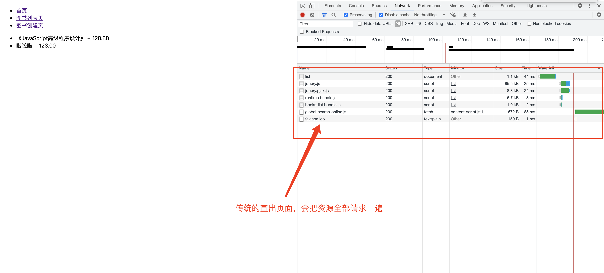
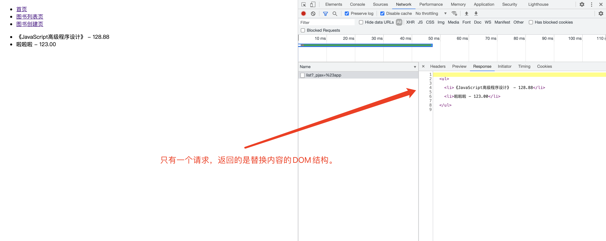

# 深度实现Vue SSR原理

## 零、写在前面

首先，这篇文章探讨的并不是Vue SSR这个框架，而是探讨它的原理。这次的实战也是从上次的实战基础上进行扩展和重构。我们上次实战的内容是把BFF架构的前后端代码分别使用webpack和gulp进行了打包处理。

我们的BFF架构的项目实战，整体上使用的是MVC的设计模式。MVC的优点在于简单易懂，对于程序员的心智负担不是很重。而且我们大多数的业务都可以做成MVC的模式。但是它的劣势也显而易见，MVC三者之间的耦合度是相当高的，相互之间的嵌套也太深，只要一个出现了问题那么整个程序就会崩溃。

为了不出现上述的情况，我们需要把MVC改成IOC（控制反转），IOC使用的技术手段叫DI（依赖注入）。这中设计模式和技术手段最早是由Java的Struct和Spring提出的。依赖注入的概念在前端框架**Angular**中也有应用。利用了AOP（面向切面）的编程思想，使用DI来实现了IOC。


### 一、什么是IOC、DI、AOP？

+ **IOC（Inversion Of Control）：**控制反转。是获取对象的方式，由原来的主动获取，转变为被动接收。是Spring框架用于创建对象和管理对象的容器。IOC是工厂模式的体现。

+ **DI（Dependency Injection）：**依赖注入。它是Spring框架核心IOC的具体实现。我们在编写程序代码时，通过控制反转，把对象交给Spring管理。但是代码中必然会存在一定的依赖关系。比如在业务层中需要引入持久层对象，这种层与层之间ctx的关系，我们也交给Spring来维护。**简单来说：依赖注入就是通过类的构造方法给类的成员变量赋值。**

+ **AOP（Aspect Oriented Programming）**，即面向切面编程。通过预编译方式和运行期动态代理实现程序功能的统一维护的一种技术。AOP是OOP的延续，是软件系统开发中的一个热点，也是spring框架的一个重点。利用AOP可以实现业务逻辑各个部分的隔离，从而使得业务逻辑各个部分的耦合性降低，提高程序的可重用性，同时提高开发效率。

  **简单理解：aop是面向切面编程，是使用动态代理技术，实现在不修改java源代码的情况下，运行时实现方法功能的增强。**


## 二、实战改造

我们了解IOC、DI、AOP的概念之后，就要上手改造我们上次完成的BFF项目。

**首先我们要解决的第一个问题就是，我们要在路由层面判断是在站内切换的，还是用户刷新？**

+ 第一，我们需要判断这个路由是站内切换还是直接落地。
+ 第二，针对这两种情况我们做不同的处理：
  + 站内切换：我们为了避免资源的重复加载，直接返回一个json
  + 直接落地：如果是页面直接落地，包括用户刷新页面，那么就正常调用render函数，直接渲染页面。
+ 第三，我们要考虑到一个严重的问题，那就是如果是直接渲染页面，数据量会很大，为了解决这个问题可以使用`Bigpip`进行分片加载。

```javascript
// /src/server/controllers/BookController.js

import Controller from './Controller';
import BooksModel from '../models/BooksModel'

class BooksController extends Controller {
  constructor () {
    super();
  }

  async actionBooksListPage(ctx, next) {
    const booksModel = new BooksModel();
    const result = await booksModel.getBookList();
    ctx.body = await ctx.render('books/pages/list', { data: result.data });
    next();
  }

  async actionBooksCreatePage(ctx, next) {
    // 先写一点伪代码，说明逻辑
    if(站内切换) {
			// 不要重复加载资源，需要什么就加载什么。
    }else {
			// 直接落地或者强制刷新，资源全部加载。
    }
    ctx.body = await ctx.render('books/pages/create');
    next();
  }
}

export default BooksController;
```

那么我们现在面临的第一个问题就是：**如何判断是站内切换还是直接落地？**

需要使用到一个库：`pajax`，什么是pjax，pjax = pushState + ajax。pjax 的实现是利用 HTML5 的 pushState() 和 replaceState() 新特性和 ajax 结合实现。pushState() 和 replaceState() 用来操作 State（状态）对象，即可添加和修改历史记录，进而更新 url 和提供前进、后退操作 ajax 实现数据的异步加载进而局部刷新。

使用pjax监听代理a连接，如果点击a连接，请求头中会增加几个参数：

+ X-PJAX: true
+ X-PJAX-Container:  #app

其中我们使用到的就是`x-pjax`这个参数，如果是点击a连接，也就是说为站内切换，x-pjax就位true。如果是直接落到页面上，那么请求头中就不会存在这个x-pjax参数。

解释完判断依据之后我们上代码，先来看一下如果在页面中代理掉所有的a连接：

```html
<!-- 改造一下src/web/views/layouts/layout.html -->
<!DOCTYPE html>
<html lang="en">
<head>
  <meta charset="UTF-8">
  <meta http-equiv="X-UA-Compatible" content="IE=edge">
  <meta name="viewport" content="width=device-width, initial-scale=1.0">
  <title></title>
  
</head>
<body>
  
  <div id="app">
    
  </div>
  <script src="https://cdn.bootcdn.net/ajax/libs/jquery/3.6.0/jquery.js"></script>
  <script src="https://cdn.bootcdn.net/ajax/libs/jquery.pjax/2.0.1/jquery.pjax.js"></script>
  <script>
    $(document).pjax('a', '#app');
  </script>
  
</body>
</html>
```

在代码中我们可以知道，pjax需要依赖jquery，所以我们要先引入jquery，再引入pjax。然后用div把要动态渲染的dom结构包裹起来，并设置id为app，读到这里我们观察一下代码是不是有Vue的味道了？其实这就是**Vue SSR的核心实现**。最后一步就是把整个页面的a连接用pjax代理。（**注：这里需要说明一点，我们一定要在layout.html中做代理，因为整站所有的页面都继承了layout.html。所以只有在layout.html中才能得到页面中的所有a链接。**）

代理完a连接之后，我们开始处理`BooksController.js`：

```javascript
// /src/server/controllers/BookController.js

import Controller from './Controller';
import BooksModel from '../models/BooksModel'

class BooksController extends Controller {
  constructor () {
    super();
  }

  async actionBooksListPage(ctx, next) {
    const booksModel = new BooksModel();
    const result = await booksModel.getBookList();
    // 我们把逻辑写到图书列表页，有真实的数据可以渲染，会比较有趣
    if(ctx.request.header['x-pjax']) {
			// 不要重复加载资源，需要什么就加载什么。
      console.log('站内切换');
    }else {
			// 直接落地或者强制刷新，资源全部加载。
      console.log('直接落地');
      ctx.body = await ctx.render('books/pages/list', { data: result.data });
    }
    next();
  }

  async actionBooksCreatePage(ctx, next) {
    ctx.body = await ctx.render('books/pages/create');
    next();
  }
}

export default BooksController;
```

我们利用了pjax在站内跳转会给header添加参数的特性，判断是否是站内跳转还是直接落地，如果是直接落地，我们还是之前的方式，SSR直接渲染。如果是站内跳转，则是按照Vue这种SPA的框架处理，直接渲染改变的内容。

我们先来改一下list/index.html：

```html
<div class="pjaxcontent">
  <ul>
    
    <li>{{ item.name }} - {{ item.price }}</li>
    
  </ul>
</div>
```

我们把不变的东西都去掉，值保留列表部分。然后把nva.html在layouts.html中引入，作为网页的公共 部分。这样就可以实现，在站内切换的时候值渲染更改的内容，也就是说当站内切换到`boos/list`的路由时，只请求list/index.html。

现在我们观察一下list/index.html，只保留了列表，而且用div包裹起来并设置pjaxcontent的类名。

如果想在切换路由的时候只请求list/index.html，不是全网页重新渲染一遍，我们还要在BooksController中下点工夫。

+ 我们需要使用到一个服务端渲染的jquery核心实现：cheerio

  ```shell
  $ npm install cheerio
  ```

+ 只返回改变路由后需要渲染的DOM结构，并不是整个网页直接返回。

```javascript
// src/server/constrollers/BooksController.js

import Controller from './Controller';
import BooksModel from '../models/BooksModel';
// 引入cheerio
import cheerio from 'cheerio';

class BooksController extends Controller {
  constructor () {
    super();
  }

  async actionBooksListPage(ctx, next) {
    const booksModel = new BooksModel();
    const result = await booksModel.getBookList();
    // 后端渲染html直接提出来
    const html = await ctx.render('books/pages/list', { data: result.data });
    // 我们把逻辑写到图书列表页，有真实的数据可以渲染，会比较有趣
    if(ctx.request.header['x-pjax']) {
			// 使用cheerio的load方法，
      const $ = cheerio.load(html);
      $(".pjaxcontent").each(function() {
        // 这样就做到了服务器只返回 $(".pjaxcontent") 的DOM结构
        ctx.res.write($(this).html());
      })
    }else {
			// 直接落地或者强制刷新，资源全部加载。
      console.log('直接落地');
      ctx.body = html;
    }
    next();
  }

  async actionBooksCreatePage(ctx, next) {
    ctx.body = await ctx.render('books/pages/create');
    next();
  }
}

export default BooksController;
```

这里有写读者可能会有疑问，服务器返回的DOM怎么会渲染到合适的位置呢？这是因为刚才我们在layout.html中做了如下的设置：

```html
<!-- 改造一下src/web/views/layouts/layout.html -->
<!DOCTYPE html>
<html lang="en">
<head>
  <meta charset="UTF-8">
  <meta http-equiv="X-UA-Compatible" content="IE=edge">
  <meta name="viewport" content="width=device-width, initial-scale=1.0">
  <title></title>
  
</head>
<body>
  
  <div id="app">
    
  </div>
  <script src="https://cdn.bootcdn.net/ajax/libs/jquery/3.6.0/jquery.js"></script>
  <script src="https://cdn.bootcdn.net/ajax/libs/jquery.pjax/2.0.1/jquery.pjax.js"></script>
  <script>
    $(document).pjax('a', '#app');
  </script>
  
</body>
</html>
```

我们用div#app包裹了需要渲染的**block content**，并且用pjax代理了所有的a连接，并指定a连接返回的内容渲染在id为'app'的容器里面。其他的保持不变。

还有一个问题：**既然是SSR，为什么其他的网页内容没有重新的渲染呢？**

这个问题其实是很好解释的，我们实现的是Vue的SSR，不是传统意义上的服务器渲染。我们的目的就是把普通的SSR和现在市面上流行的SPA框架，比如Vue和React的单页面渲染结合。实现局部渲染。而且上文中我们在解释pjax原理的时候也说了，**pjax 的实现是利用 HTML5 的 pushState() 和 replaceState() 新特性和 ajax 结合实现。pushState() 和 replaceState() 用来操作 State（状态）对象，即可添加和修改历史记录，进而更新 url 和提供前进、后退操作 ajax 实现数据的异步加载进而局部刷新。**

所以本质上pjax的路由改变本质上和SPA路由的切换实际上没什么不同，是不会触发网页的跳转的。

我们在改造完这些的时候会发现一个问题，在切换到`book/list`，会出现404的情况，这是使用pjax会出现的正常情况，这样就要求我们在返回DOM之前设置一下http的状态：

```javascript
// src/server/constrollers/BooksController.js

import Controller from './Controller';
import BooksModel from '../models/BooksModel';
// 引入cheerio
import cheerio from 'cheerio';

class BooksController extends Controller {
  constructor () {
    super();
  }

  async actionBooksListPage(ctx, next) {
    const booksModel = new BooksModel();
    const result = await booksModel.getBookList();
    // 后端渲染html直接提出来
    const html = await ctx.render('books/pages/list', { data: result.data });
    // 手动设置请求状态和content-type
    ctx.status = 200;
    ctx.type = 'html';
    // 我们把逻辑写到图书列表页，有真实的数据可以渲染，会比较有趣
    if(ctx.request.header['x-pjax']) {
			// 使用cheerio的load方法，
      const $ = cheerio.load(html);
      $(".pjaxcontent").each(function() {
        // 这样就做到了服务器只返回 $(".pjaxcontent") 的DOM结构
        ctx.res.write($(this).html());
      })
    }else {
			// 直接落地或者强制刷新，资源全部加载。
      console.log('直接落地');
      ctx.body = html;
    }
    next();
  }

  async actionBooksCreatePage(ctx, next) {
    ctx.body = await ctx.render('books/pages/create');
    next();
  }
}

export default BooksController;
```

到这里我们就基本完成了对Vue SSR的原理实现，实现了在切页的时候只需要ajax请求改变的数据，然后完成替换。这也是Vue SSR的核心原理。现在最后一步就是对模板进行设置：

```javascript
// src/server/app.js

...

// 第一步，我们要把historyApiFallBack干掉，这里就不需要配合Vue的假路由了。

app.context.render = co.wrap(render({
  // 模板文件的路径和是否缓存尽量的放在配置文件中，可以随意配置。
  root: config.viewsDir,
  cache: config.cache,
  // 设置writeBody: false
  writeBody: false,
}));

errorHandle.error(app, logger);

initController(app);

app.listen(config.port, () => {
  console.log(`server is running at http://loaclhost:${config.port}`);
});
```

在文档中关于`writeBody: false`是这么解释的：**writeBody: default(true) auto write body and response.**设置为false是为了缓存（其实这一点我也没弄明白，关于koa-swig的文档实在太少，没查到）。

最后我们来看一下直接落地页和站内切换有什么不同：

+ 传统的直接落地页面

  

  我们可以看到完全是把页面用到的所有的资源全部加载了一遍。

+ 实现了Vue SSR原理的栈内切页

  

  我们可以看到在站内切页的时候只有一个请求，而且这个请求是个xhr请求，也就是ajax请求，请求的返回值就是要替换的DOM结构。

说到这里我们已经把Vue SSR的原理实现完了，其实很简单，纯手写不利用任何的Vue和React的框架就能完全把Vue SSR的原理实现出来，这种方式把单页应用和后端渲染的多页应用的优点集于一身。主要解决了以下几个问题：

+ SPA首页加载慢的问题
+ 传统SSR资源重复加载的问题
+ SPA不利于SEO的问题


## 三、总结

其实Vue的SSR主要是兼顾了传统SSR和SPA的优点，既可以分片渲染，直接替换内容而不是重新渲染整个网页。今天我们实现的就是Next.js和Nuxt.js的原理，并没有什么神奇的。

总结一下我们实现Vue SSR的流程：

+ 在全局的页面（我们这里是layout.html）中引入`jquery.js`和`pjax.js`两个文件。
+ 用`div#app`包裹渲染的内容部分。
+ 编写JS代理全部的a链接到**div#app**。`$(document).pjax('a', '#app');`
+ 改写views中的页面，把creat、list、home这几个页面全都变为组件，写入component中，并引入到pages中的页面中。
+ 然后将components中的页面内容用`div.pjaxcontent`包裹起来。
+ 改写Conteoller，每一个路由都分直接落地和站内切换两种情况渲染。这里需要注意的是，使用pjax返回的时候我们需要手动修改返回的状态和类型，否则会报404。
  + 直接落地页：`ctx.body = await ctx.render('books/pages/list', { data: result.data });`
  + 站内切页：使用cheerio拿出组件中**div.pjaxcontent**的内容（一般是DOM结构），直接作为Ajax的返回值。
+ 这样做之后，站内切页的返回值自然会被pjax库处理渲染在`div#app`里面。
+ 配置app.js中的swig模板配置，添加`writeBody: false`。

至此，有关于Node + koa 实现Vue SSR原理的内容已经全部写完了，接下来会用TS重构。

