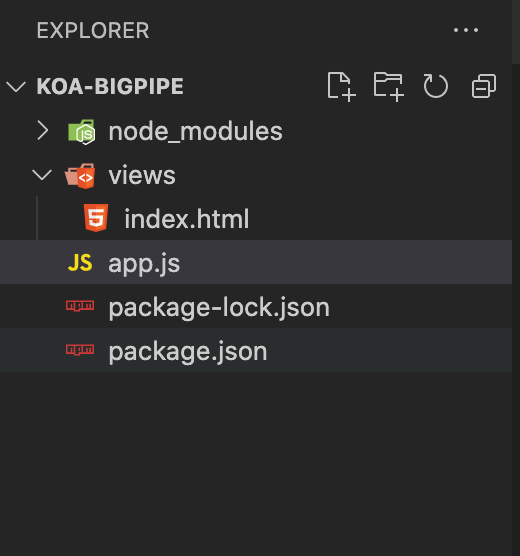
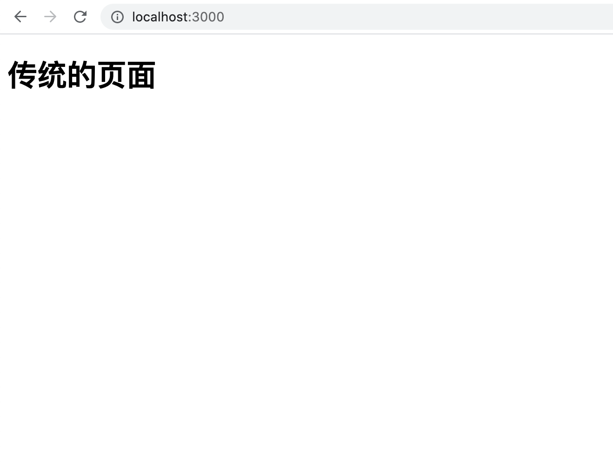
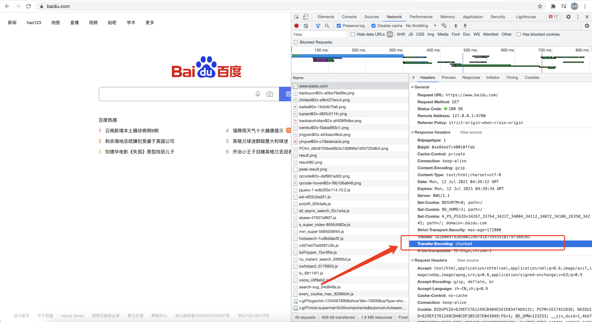
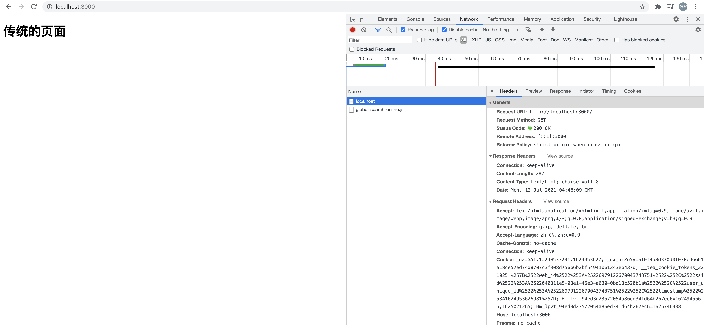
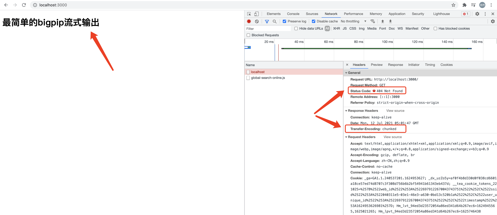
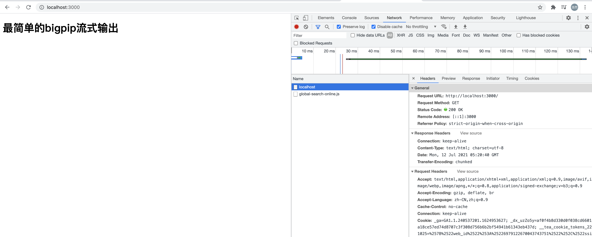
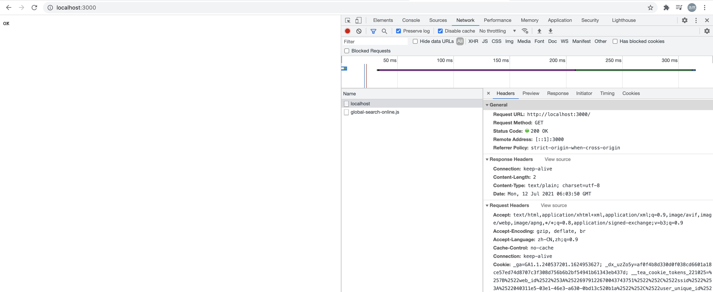
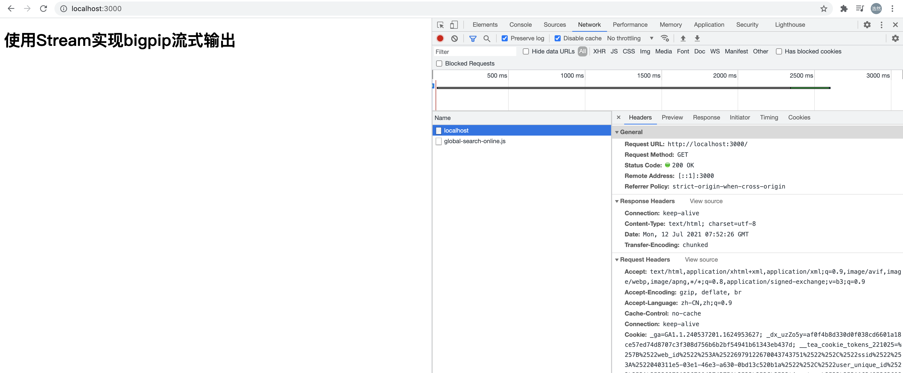
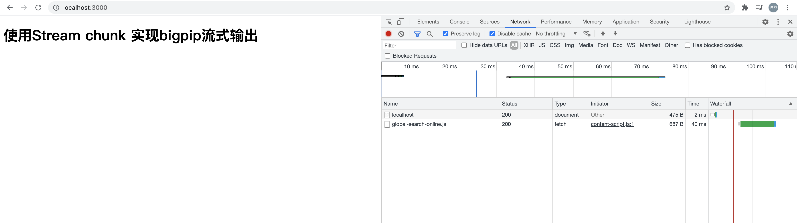

# 前端架构师启蒙课第一讲-走进IOC


## 零、写在前面

这篇文章和前面我们的实战文章相比有了质的区别，这篇文章我们要探讨一下SOLID（**单一功能、开闭原则、里氏替换、接口隔离**以及**依赖反转**），也就是面向对象设计。

这篇文章主要分三个部分：

+ 完善前面写的SSR的性能
+ Bigpipe
+ SOLID的探讨


## 一、KOA-Bigpipe

在我们使用SSR的形式渲染网页的时候，最担心的一个问题就是性能问题，因为有时候我们需要渲染的页面内容太多，结构比较复杂。当遇到这种网页的时候，如果我们要对整页进行一次性渲染完成的话，会出现加载太慢的情况，造成用户的等待时间太长，影响用户体验。这个时候我们就选择使用**bigpipe**输出网页从而解决这个问题。

### I、什么是bigpipe？

当MPA的网页输出的时候（SSR ---> render），如果页面内容过大，结构复杂，正常的一次性渲染对用户来说就是一次性的等待，但是这个等待时间如果过长就会影响用户体验，那么bigpipe会分段进行渲染页面，这样的话就缩短了这个过长的一次性的等待，用户体验得到了改善。

既然是分段，我们理所当然大的想到了chunk，那么在请求头上我们就会得到**chunked**这么一个参数。

### II、怎么实现bigpipe？

实现bigpipe我们仍然是基于Koa的，所以先传建一个基于Koa的项目`KOA-BIGPIPE`。然后npm初始化，安装koa等步骤，我们在这里就不做你赘述了，如果不了解这一部分的读者，可以先阅读一下**BFF架构的实现**一系列文章。

我们贴出**KOA-BIGPIPE**的项目基本结构：



接下来上代码：

```javascript
// app.js
const Koa = require("koa");
const Router = require("@koa/router");
const co = require("co");
const render = require("koa-swig");
const app = new Koa();
const router = new Router();
const path = require('path');

app.context.render = co.wrap(render({
  root: path.join(__dirname, 'views'),
  autoescape: true,
  cache: false,
  ext: 'html',
  writeBody: false
}));

// 传统的页面渲染
router.get('/', async (ctx, next) => {
  ctx.body = await ctx.render('index');
});

app
  .use(router.routes())
  .use(router.allowedMethods());

app.listen(3000, function() {
  console.log('server is runing at http://localhost:3000.');
})
```

然后我们在package.json中的scripts中配置dev命令，用来启动项目：

```json
...
"scripts": {
    "dev": "nodemon ./app.js",
    "test": "echo \"Error: no test specified\" && exit 1"
  },
...
```

在终端运行`npm run dev`命令，用浏览器访问`http://localhost:3000/`：



这是传统的页面，到这里我们一切都很熟悉。但是我们并不是要讨论传统一次性渲染直出的web服务怎么搭建，而是要了解分段渲染，也就是说以chunk的方式渲染页面。接下来进入正题，我们首先打开[百度](https://www.baidu.com/)的页面观察一下百度首页的network：



我们可以看到在百度首页请求的响应头中存在一个`Transfer-Encoding: chunked`的参数项，值为`chunked`，这就代表了百度的首页是使用了流式的，串行的输出。并不是传统的一次性等待的方式。我们再来看一下我们刚才写的首页的响应头：



我们可以看到在响应头中并没有`Transfer-Encoding: chunked`。那么我们需要怎么改造一下我们自己写的代码，才能让网页变成像百度一样的流式输出呢？那就要使用bigpipe的方式：

**1. 最简单的流式输出**

我们改一下刚才的代码：

```javascript
// app.js
const Koa = require("koa");
const Router = require("@koa/router");
const co = require("co");
const render = require("koa-swig");
const app = new Koa();
const router = new Router();
const { join, resolve } = require("path");
const fs = require("fs");

app.context.render = co.wrap(render({
  root: join(__dirname, 'views'),
  autoescape: true,
  cache: false,
  ext: 'html',
  writeBody: false
}));

// 把传统的页面渲染改成test路由上
router.get('/test', async (ctx, next) => {
  ctx.body = await ctx.render('index');
});

router.get('/', async (ctx, next) => {
  // 最简单的网页流式输出
  // 先获取文件位置
  const filename = resolve(join(__dirname, './views/index.html'));
  // 使用fs.readFileSync方法读出文件流
  const file = fs.readFileSync(filename, 'utf-8');
  // 然后使用ctx.res.write(file)方法把文件流写到http响应体中
  ctx.res.write(file);
  // 传输完成之后关闭流输出
  ctx.res.end();
});

app
  .use(router.routes())
  .use(router.allowedMethods());

app.listen(3000, function() {
  console.log('server is runing at http://localhost:3000.');
})
```

因为全部都是流操作，所以有开始就有关闭，最后一定不要忘了调用res.end()方法。然后把html中的代码稍作修改：

```html
<!DOCTYPE html>
<html lang="en">
<head>
  <meta charset="UTF-8">
  <meta http-equiv="X-UA-Compatible" content="IE=edge">
  <meta name="viewport" content="width=device-width, initial-scale=1.0">
  <title>首页内容输出</title>
</head>
<body>
  <h1>最简单的bigpip流式输出</h1>
</body>
</html>
```

使用浏览器访问`http://localhost:3000/`：



我们可以看到三个关键的信息：

+ 一、页面可以正常输出
+ 二、响应状态是404
+ 三、响应头中多出了`Transfer-Encoding: chunked`

那么为什么会404呢，是因为bipipe的流式输出并没有遵循传统网页的正常流程，当请求的时候就会被认为是404，出现这个问题的原因是koa框架决定的**（如果想深入了解一下，推荐看一下Koa的源码）**，那么我们需要怎么解决这个问题呢？方法就是我们需要手动修正：

```javascript
// app.js
const Koa = require("koa");
const Router = require("@koa/router");
const co = require("co");
const render = require("koa-swig");
const app = new Koa();
const router = new Router();
const { join, resolve } = require("path");
const fs = require("fs");

app.context.render = co.wrap(render({
  root: join(__dirname, 'views'),
  autoescape: true,
  cache: false,
  ext: 'html',
  writeBody: false
}));

// 传统的页面渲染
router.get('/test', async (ctx, next) => {
  ctx.body = await ctx.render('index');
});

router.get('/', async (ctx, next) => {
  // 手动修正status和type
  ctx.status = 200;
  ctx.type = 'html';
  // 最简单的网页流式输出
  const filename = resolve(join(__dirname, './views/index.html'));
  const file = fs.readFileSync(filename, 'utf-8');
  ctx.res.write(file);
  ctx.res.end();
});

app
  .use(router.routes())
  .use(router.allowedMethods());

app.listen(3000, function() {
  console.log('server is runing at http://localhost:3000.');
})
```

这时候我们再次访问`http://localhost:3000/`：



请求已经正常了，到这里我们最简单的实现bigpipe的方式已经实现了。这样的输出比一次性全部渲染的方式相比性能要高出无数倍。

**2. stream方式实现bigpipe**

除了上边那种方式，我们在处理html文件的时候还可以直接把html文件处理成流的形式进行输出：

```javascript
const Koa = require("koa");
const Router = require("@koa/router");
const co = require("co");
const render = require("koa-swig");
const app = new Koa();
const router = new Router();
const { join, resolve } = require("path");
const fs = require("fs");

app.context.render = co.wrap(render({
  root: join(__dirname, 'views'),
  autoescape: true,
  cache: false,
  ext: 'html',
  writeBody: false
}));

// 传统的页面渲染
router.get('/test', async (ctx, next) => {
  ctx.body = await ctx.render('index');
});

// demo1简单方式的bigpipe
router.get('/demo1', async (ctx, next) => {
  // 手动修正status和type
  ctx.status = 200;
  ctx.type = 'html';
  // 最简单的网页流式输出 demo1
  const filename = resolve(join(__dirname, './views/index.html'));
  const file = fs.readFileSync(filename, 'utf-8');
  ctx.res.write(file);
  ctx.res.end();
});

// demo2官方推荐的bigpipe方式
router.get('/', async (ctx, next) => {
  ctx.status = 200;
  ctx.type = 'html';
  // demo2
  const filename = resolve(join(__dirname, './views/index.html'));
  const stream = fs.createReadStream(filename);
  stream.on('error', error => {}).pipe(ctx.res);
});

app
  .use(router.routes())
  .use(router.allowedMethods());

app.listen(3000, function() {
  console.log('server is runing at http://localhost:3000.');
});
```

顺便改一下输出的HTML文件：

```html
<!DOCTYPE html>
<html lang="en">
<head>
  <meta charset="UTF-8">
  <meta http-equiv="X-UA-Compatible" content="IE=edge">
  <meta name="viewport" content="width=device-width, initial-scale=1.0">
  <title>首页内容输出</title>
</head>
<body>
  <h1>使用Stream实现bigpip流式输出</h1>
</body>
</html>
```


我们重新访问一下`http://loaclhost:3000/`



我们惊奇的发现，页面上输出了一个`OK`，但是我们的代码中并没有写任何关于OK的内容。这是因为我们的代码编辑是有问题的，Koa源码中要求stream的输出要是一个Promise对象，我们用Promise来改写一下上面的代码：

```javascript
// app.js
const Koa = require("koa");
const Router = require("@koa/router");
const co = require("co");
const render = require("koa-swig");
const app = new Koa();
const router = new Router();
const { join, resolve } = require("path");
const fs = require("fs");

app.context.render = co.wrap(render({
  root: join(__dirname, 'views'),
  autoescape: true,
  cache: false,
  ext: 'html',
  writeBody: false
}));

// 传统的页面渲染
router.get('/test', async (ctx, next) => {
  ctx.body = await ctx.render('index');
});

router.get('/demo1', async (ctx, next) => {
  // 手动修正status和type
  ctx.status = 200;
  ctx.type = 'html';
  // 最简单的网页流式输出 demo1
  const filename = resolve(join(__dirname, './views/index.html'));
  const file = fs.readFileSync(filename, 'utf-8');
  ctx.res.write(file);
  ctx.res.end();
});

router.get('/', async (ctx, next) => {
  ctx.status = 200;
  ctx.type = 'html';
  // demo2，这是最常用的一种实现bigpipe的方式
  const filename = resolve(join(__dirname, './views/index.html'));
  function createSSRStreamPromise() {
    return new Promise((resolve, reject) => {
      const stream = fs.createReadStream(filename);
      stream.on('error', error => {
        reject(error);
      }).pipe(ctx.res);
    });
  }

  await createSSRStreamPromise();
});

app
  .use(router.routes())
  .use(router.allowedMethods());

app.listen(3000, function() {
  console.log('server is runing at http://localhost:3000.');
});
```

这种方式是最常用的方式，也是Vue和React中bigpipe的实现方式。重新访问`http://localhost:3000/`：



**3. 使用chunk的方式实现bigpipe**

我们可以对上面的那个常用的方法进行优化，上面的哪个方式虽然是使用了流，但是传输的时候使用了pip这种管道的形式。但是作为stream，可以监听`data`事件获取到chunk，我们就可以直接来获取一点就渲染一点，直接写入chunk数据，这样性能会更好一些。

```javascript
const Koa = require("koa");
const Router = require("@koa/router");
const co = require("co");
const render = require("koa-swig");
const app = new Koa();
const router = new Router();
const { join, resolve } = require("path");
const fs = require("fs");

app.context.render = co.wrap(render({
  root: join(__dirname, 'views'),
  autoescape: true,
  cache: false,
  ext: 'html',
  writeBody: false
}));

// 传统的页面渲染
router.get('/test', async (ctx, next) => {
  ctx.body = await ctx.render('index');
});

router.get('/demo1', async (ctx, next) => {
  // 手动修正status和type
  ctx.status = 200;
  ctx.type = 'html';
  // 最简单的网页流式输出 demo1
  const filename = resolve(join(__dirname, './views/index.html'));
  const file = fs.readFileSync(filename, 'utf-8');
  ctx.res.write(file);
  ctx.res.end();
});

router.get('/demo2', async (ctx, next) => {
  ctx.status = 200;
  ctx.type = 'html';
  // demo2
  const filename = resolve(join(__dirname, './views/index.html'));
  function createSSRStreamPromise() {
    return new Promise((resolve, reject) => {
      const stream = fs.createReadStream(filename);
      stream.on('error', error => {
        reject(error);
      }).pipe(ctx.res);
    });
  }

  await createSSRStreamPromise();
});

router.get('/', async (ctx, next) => {
  ctx.status = 200;
  ctx.type = 'html';
  // demo3
  const filename = resolve(join(__dirname, './views/index.html'));
  function createSSRStreamPromise() {
    return new Promise((resolve, reject) => {
      const stream = fs.createReadStream(filename);
      stream.on('data', chunk => {
        ctx.res.write(chunk);
      }).on('end', () => {
        ctx.res.end();
      })
    });
  }

  await createSSRStreamPromise();
});

app
  .use(router.routes())
  .use(router.allowedMethods());

app.listen(3000, function() {
  console.log('server is runing at http://localhost:3000.');
});
```

从代码中可以看出，我们使用chunk的方式，使用stream流监听data事件，获取到chunk直接输出并渲染。这种方式需要特别注意的一点就是我们是使用`ctx.res.write(chunk);`，所以我们必须要在write完全部HTML流之后，调用end方法。在stream流对象上要监听end事件，在stream的end事件里执行ctx.res.end。如果不执行end方法，请求就会一直处于pending状态，最后请求失败。

更改HTML：

```html
<!DOCTYPE html>
<html lang="en">
<head>
  <meta charset="UTF-8">
  <meta http-equiv="X-UA-Compatible" content="IE=edge">
  <meta name="viewport" content="width=device-width, initial-scale=1.0">
  <title>首页内容输出</title>
</head>
<body>
  <h1>使用Stream chunk 实现bigpip流式输出</h1>
</body>
</html>
```

最后我们访问`http://localhost:3000/`：



到现在为止我们手写了三种方法实现bigpipe，但是我们并不能直观的感受到bigpipe给我们带来的性能优化，即使它的性能就是非常高的，但是在观感上和传统的方式并无不同。设想一下如果我们的后端数据使用bigpipe能够一行一行的显示在浏览器中，那么我们就能直观的感受到性能的变化！

**4. 带后端推送task的bigpipe**

我们在Node后端增加两个task，作为我们异步任务的模拟，然后在我们把bigpipe执行完之后，把这两个task推送到前端，从而在前端调用JS函数，动态的进行渲染DOM：

```JavaScript
// app.js
const Koa = require("koa");
const Router = require("@koa/router");
const co = require("co");
const render = require("koa-swig");
const app = new Koa();
const router = new Router();
const { join, resolve } = require("path");
const fs = require("fs");

app.context.render = co.wrap(render({
  root: join(__dirname, 'views'),
  autoescape: true,
  cache: false,
  ext: 'html',
  writeBody: false
}));

const task1 = () => {
  return new Promise((resolve, reject) => {
    setTimeout(() => {
      resolve('<script>addHTML("part1", "第一次传输<br/>")</script>');
    }, 2000);
  });
}

const task2 = () => {
  return new Promise((resolve, reject) => {
    setTimeout(() => {
      resolve('<script>addHTML("part2", "第二次传输<br/>")</script>');
    }, 3000);
  });
}

// 传统的页面渲染
router.get('/test', async (ctx, next) => {
  ctx.body = await ctx.render('index');
});

router.get('/demo1', async (ctx, next) => {
  // 手动修正status和type
  ctx.status = 200;
  ctx.type = 'html';
  // 最简单的网页流式输出 demo1
  const filename = resolve(join(__dirname, './views/index.html'));
  const file = fs.readFileSync(filename, 'utf-8');
  ctx.res.write(file);
  ctx.res.end();
});

router.get('/demo2', async (ctx, next) => {
  ctx.status = 200;
  ctx.type = 'html';
  // demo2
  const filename = resolve(join(__dirname, './views/index.html'));
  function createSSRStreamPromise() {
    return new Promise((resolve, reject) => {
      const stream = fs.createReadStream(filename);
      stream.on('error', error => {
        reject(error);
      }).pipe(ctx.res);
    });
  }

  await createSSRStreamPromise();
});

router.get('/', async (ctx, next) => {
  ctx.status = 200;
  ctx.type = 'html';
  // demo3
  const filename = resolve(join(__dirname, './views/index.html'));
  function createSSRStreamPromise() {
    return new Promise((resolve, reject) => {
      const stream = fs.createReadStream(filename);
      stream.on('data', chunk => {
        ctx.res.write(chunk);
      }).on('end', async () => {
        const result1 = await task1();
        ctx.res.write(result1);
        const result2 = await task2();
        ctx.res.write(result2);
        ctx.res.end();
      })
    });
  }

  await createSSRStreamPromise();
});

app
  .use(router.routes())
  .use(router.allowedMethods());

app.listen(3000, function() {
  console.log('server is runing at http://localhost:3000.');
});
```

我们从代码中可以看到在bigpipe传输完之后，我们在end事件中向前端写入两个task，然后我们在前端进行渲染，我们可以看到两个task是延迟加载的。现在我们改写一下HTML：

```html
<!DOCTYPE html>
<html lang="en">
<head>
  <meta charset="UTF-8">
  <meta http-equiv="X-UA-Compatible" content="IE=edge">
  <meta name="viewport" content="width=device-width, initial-scale=1.0">
  <title>首页内容输出</title>
</head>
<body>
  <h1>使用Stream chunk 实现bigpip流式输出</h1>
  <div id="part1">
    loading...
  </div>
  <div id="part2">
    loading...
  </div>

  <script>
    function addHTML(eleID, content) {
      document.getElementById(eleID).innerHTML = content;
    }
  </script>
</body>
</html>
```

通过这个HTML我们可以知道，推送到前端，前端会执行addHTML方法，向前端预留的两个位置：`part1`、`part2`进行渲染。这种方式有两个问题：

+ 如果后端的资源加载不过来浏览器会一直转圈圈。
+ 我们可以打开源代码查看，源代码中并不包含script中动态加载的内容，所以不利于SEO。

这个方式的好处在于我们使用了bigpipe和后端推送script动态渲染两种方式进行页面的渲染，可以很好的保证首屏加载的速度，提升和用户体验。bigpipe把页面核心的内容输出出来，然后再使用script动态推送加载其他内容**（注意这个方式的核心就是要预留位置）**。

### III、使用bigpipe改造Vue SSR原理的项目

我们之前做了一个项目实现了Vue SSR的原理，在直接落地的情况下我们直接输出了整个页面，当然这是没有问题的，但是我们现在知道了bigpipe的概念，所以我们来尝试使用bigpipe对它进行改造：

```javascript
import Controller from './Controller';
import BooksModel from '../models/BooksModel';
import cheerio from 'cheerio';
import { Readable } from 'stream';

class BooksController extends Controller {
  constructor() {
    super();
  }

  async actionBooksListPage(ctx, next) {
    const booksModel = new BooksModel();
    const result = await booksModel.getBookList();

    // 先在后端渲染出来
    const html = await ctx.render('books/pages/list', { data: result.data });

    ctx.status = 200;
    ctx.type = 'html';
    // 判断是在站内切换还是直接落本地（包括用户刷新）
    if (ctx.request.header['x-pjax']) {
      const $ = cheerio.load(html);
      $(".pjaxcontent").each(function () {
        ctx.res.write($(this).html());
      });
      ctx.res.end();
    } else {
      // bigpipe改造
      function createSSRStreamPromise() {
        return new Promise((resolve, reject) => {
          const htmlStream = new Readable();
          htmlStream.push(html);
          htmlStream.push(null);
          htmlStream.on('error', error => {
            reject(error);
          }).pipe(ctx.res);
        });
      }

      await createSSRStreamPromise();
      // ctx.body = html;
    }
  }

...

export default BooksController;
```

我们可以看到，在落本地页面的时候传统的方式是`ctx.body = html`，我们使用bigpipe改造，让这个页面以流的方式进行输出。这里和之前不同的是我们没办法得到具体的文件，能得到的只是`ctx.render('books/pages/list')`渲染过之后的html，所以我们需要把这个html做处理使之成为流（stream）。处理流程如下：

+ 在stream模块中引入Readable。

+ 实例化一个Readable对象htmlStream。htmlStream就是一个可读流。
+ 然后把html push到htmlStream，最后在push进一个null，作为结束的标志位。
+ 最后htmlStream监听error事件，使用pipe输出流。

这样我们对于Vue SSR的bigpipe改造就完成了。

**未完待续.....**


