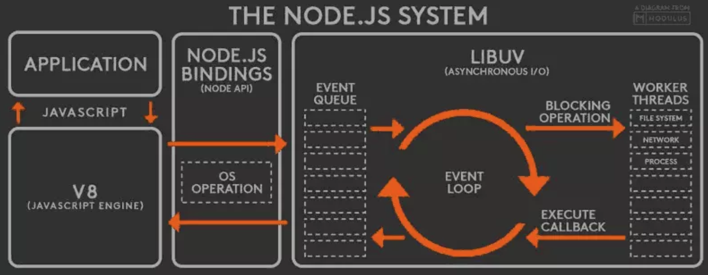
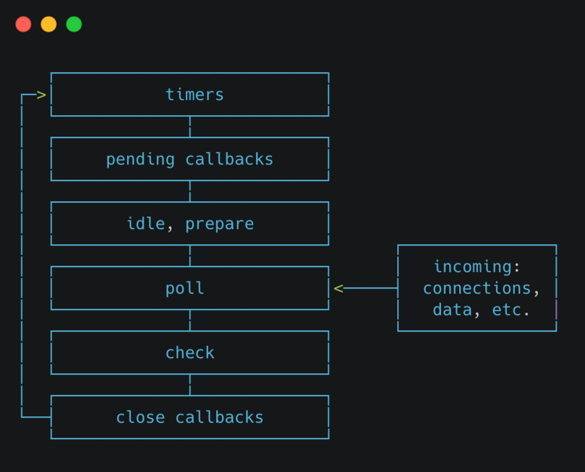
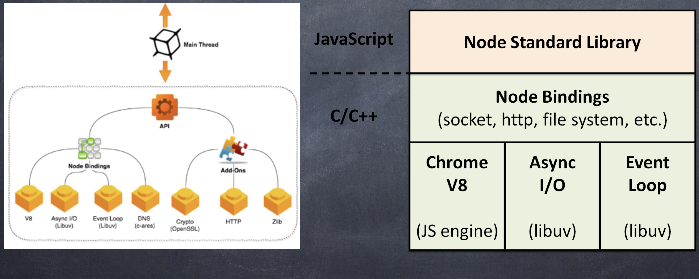
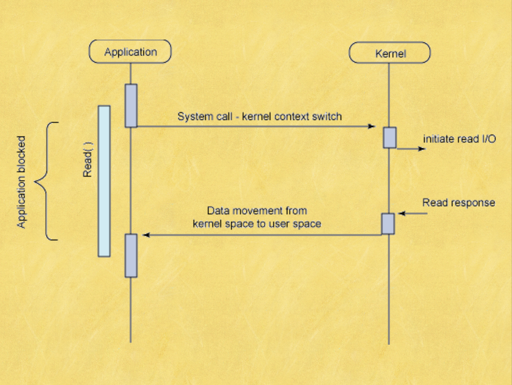
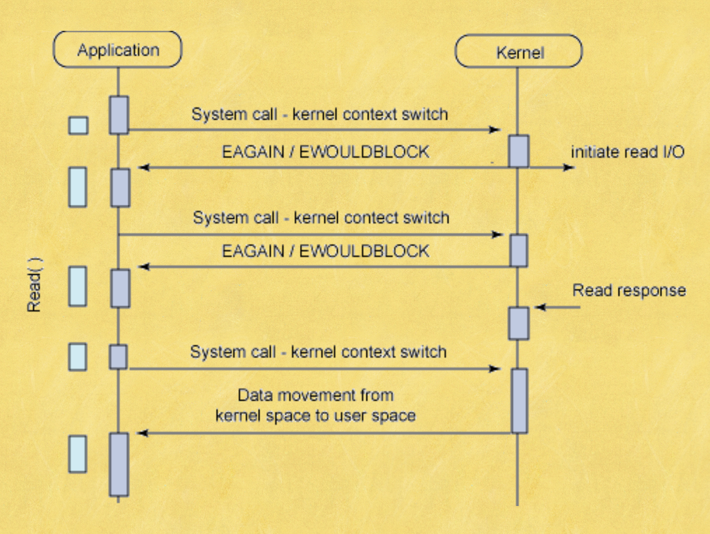
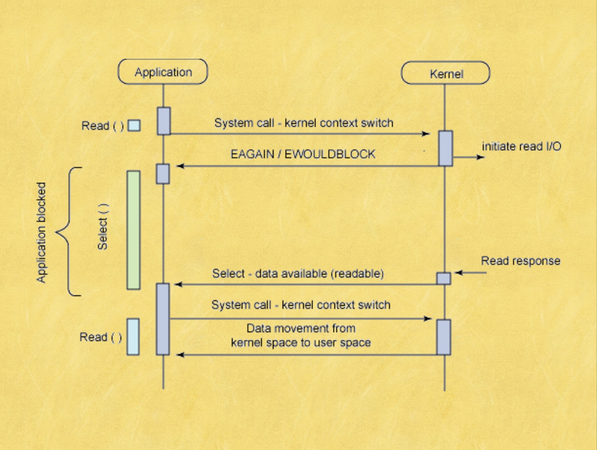
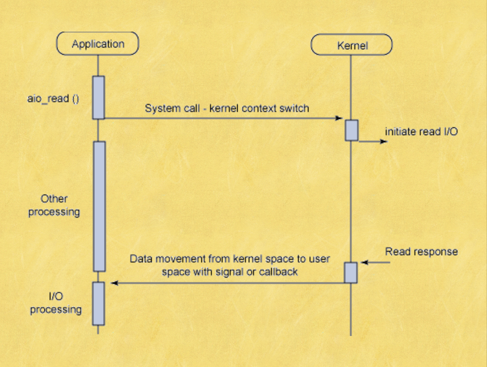

# 24期直播打点——知识点梳理

## [专题二]

### HTTP那些事儿①

1. **当我们输入网址后会发生什么？**

> 这是一道对于web考察的非常全面的经典面试题，可以说的非常详细，也可以说的非常简略，非常考验前端工程师的功底！
>
> 以下是这个题的参考答案：
>
> 1. 在浏览器中输入`www.google.com`之后按回车，浏览器会发出请求指令。
> 2. 发出指令之后需要测试网络的连通性保证网络是通的，并且连接到网络上。这个步骤需要经过很多网络设备，常见的有路由器和防火墙。
> 3. 然后，进行DNS查询，这一步的目的是把浏览器地址栏中的字符串形式的域名映射为ip地址并拿到这个IP。这里需要注意，DNS查询这一过程涉及的点也是非常多的，要先看本地的DNS缓存以及host文件，如果DNS缓存中存在这个域名的映射IP，则无需进行DNS查询。如果没有缓存，则需要进行DNS查询。`DNS查询也需要非常多的步骤，对于这个面试题不做赘述`。
> 4. 通过DNS查询拿到IP地址后，客户端和服务器就可以建立TCP连接，建立TCP连接需要`三次握手`，通俗的讲就是客户端与服务器进行三次通信从而建立TCP连接。`TCP的三次握手也是前端一个重要的问题，这里不做赘述`。
> 5. 建立TCP连接之后，我们向服务端发送请求。请求所走的线路是通过`路由技术`计算得出，`关于路由技术这里不做赘述`。
> 6. 到达IP所指定的入口，这里应该是一个服务器集群的入口地址，服务器集群要经过`反向代理`，把这个请求落在一个具体的服务器上。`关于正向代理和反向代理，以及Nginx这些概念，这里不做赘述。`
> 7. 服务器接收到请求，做出响应，把html在服务端组装完成，并发送给客户端。**（这一步是服务器是重点，和前端关系不大，但是如果做Node开发就要清楚这里的处理流程）**`那么返回的具体路径也是需要经过路由技术的计算得出最优路径`
> 8. 客户端，也就是浏览器，接收到服务器返回的数据，经过浏览器的解析，呈现在页面上。`这里涉及到了浏览器内核对于HTML、CSS、JS的解析，解释和执行，并且涉及到了GUP渲染，这里不做赘述`。


**2. HTTP请求模型**

> 关于HTTP请求模型，简单来说就是`两端`和`两个动作`。
>
> **两端：客户端、服务端**
>
> **两个动作：请求、响应**
>
> 什么是客户端？
>
> 主动发起请求的是客户端。
>
> 什么是服务端？
>
> 被动等待被请求，并且根据请求作出相应的一端是服务端。


**3. 什么是HTTP协议？**

> HTTP协议又叫`超文本传输协议`，超文本的概念就是不只是文本，包括图片、音频、视频等格式的文件。HTTP协议是应用层协议，也就是说HTTP协议是可以让程序直接调用的协议。目的是为了文本、图片、音视频等文件从服务器到客户端的传输。
>
> HTTP协议分为请求和响应两部分：
>
> 1. 请求：请求行、请求头、请求体
>
> 2. 响应：状态行、响应头、响应体


**4. HTTP发展史**

> 1990年，HTTP0.9。
>
> 1996，HTTP1.0 所有的连接都为短连接。
>
> 1999，HTTP1.1 加入了长链接。
>
> 2015，HTTP2 多路复用，从单个文件层面上解决了队首阻塞问题。
>
> HTTP3 （HTTP over QUIC）从协议层面（HTTP3使用的是UDP协议）上彻底解决了队首阻塞。


**5. TCP/IP协议栈（记忆不充分）**

> 想要弄清楚TCP/IP协议栈，那么就得先说IOS/OSI七层协议模型，OSI七层模型是协议栈的标准。这个标准是分层设计的，共分为七层，从上到下分别为：
>
> 1. 应用层
> 2. 表示层
> 3. 会话层
> 4. 传输层
> 5. 网络层
> 6. 数据链路层
> 7. 物理层
>
> 这七层是逐层调用的，上面一层只能调用其下面一层的接口，其中物理层没有接口。OSI是一个国际标准化模型，但是由于互联网发展初期，通信比较简单，设计方面没有考虑的非常清楚，所以设计了TCP/IP四层协议栈。`TCP/IP也就成了事实上使用的协议栈。`
>
> TCP/IP协议栈一般分为四层，也有说五层的。从上到下分别是：
>
> 1. 应用层
> 2. 传输层
> 3. 网络层
> 4. 网络接口层
>
> 其中应用层的协议重要的有HTTP协议，传输层为TCP、UDP协议，网络层为IP协议，网络接口层没有协议，属于硬件部分。TCP/IP协议栈的名字就是从传输层和网络层各拿出最重要的协议来命名。
>
> **为什么叫协议栈？**
>
> 因为整个协议是分层的，从上到下像数据结构中栈的结构。


**6. HTTP的工作过程？（完全没记忆）**

> 1. 客户端与服务器建立TCP连接（三次握手）
> 2. 客户端向服务端发送请求（这里涉及到请求的格式）
> 3. 服务端向客户端响应请求（这里涉及到相应的格式）
> 4. 客户端接收到服务端的响应之后，断开连接（四次挥手）
>
> **长链接：请求建立TCP连接之后，一次请求完成不断开TCP连接，复用链路**


**7. 请求和响应格式（记忆不充分）**

> 请求包括：
>
> 1. 请求行：请求方法、协议名称、协议版本号
> 2. 请求头：请求修饰符，客户机信息
> 3. 请求体：可能的内容，get是没有请求体的
>
> 响应包括：
>
> 1. 状态行：协议版本号、状态码、状态描述
> 2. 响应头：服务器信息
> 3. 响应体：实体信息和可能的内容


**8. session、cookie**

> 关于cookie和session，出现的原因是HTTP是一个无连接的协议，所谓无连接的协议是指服务器无法通过连接来判断客户端的状态，`服务端无法维持客户端的状态`，也就是说对于同一客户端发送的两次HTTP请求，服务端会认为是完全不同的两个客户端发送的。为了解决这个问题，客户端就需要告诉服务端自己是谁，那么就出现了Cookie和Session机制。
>
> Session：存在于服务器的一小段信息，用户第一次请求服务端的时候会把登录的用户名和密码发送给服务端，服务端同过验证会生成一些用户相关的信息存入session表中，或者session数据库中，那么就会有sessionID，然后把sessionID通过setCookie的方式给到客户端。
>
> Cookie：客户端在接收到服务端响应的时候，响应头中的setCookie会让浏览器把setCookie中的SessionID种到浏览器的Cookie中，下一次的请求会自动带上这个cookie，也就是sessionID到服务端，服务端通过sessionID查询Session表，这样就维持住了客户端的状态，知道客户端具体是谁。
>
> `这个题目还可以引申出很多东西，比如一般登录的处理，维持登录状态的实现方式，token的用途等等`


**9. HTTP缓存机制**

> 关于HTTP缓存，分为两种情况：
>
> 1. 客户端第一次请求服务器，这时候客户端本地没有任何缓存，所以只能在服务器拿到数据，然后这个时候服务器会定制一套缓存策略，包括cache-control、exprice、Etag、last-modified，这些通通放在了响应头中。浏览器会通过这些头信息对服务端返回的信息进行缓存。
> 2. 浏览器第N（N > 1）次请求服务器：
>    1. 先判断强制缓存的保险时间（cache-control和Expires），如果没有过期那么直接使用本地缓存。
>    2. 如果强制缓存过期，那么就会走到协商缓存，这里的协商是浏览器跟服务器进行协商，协商缓存包括`Etag`和`Last-Modifiried`，这两个是有优先级的`Etag > Last-Modifiried`
>    3. Etag是一个MD5的字符串，浏览器会把这个字符串放到`if-none-match`中发送给服务器，服务器会拿到这个md5的字符串与服务器上存储的md5的值进行比较如果一致，证明浏览器的本地缓存仍然有效，那么就会告诉浏览器使用本地缓存的数据。如果对比的结果不一致就会检查`last-modifiried`，`last-modifiried`是一个时间戳，浏览器会把这个时间戳放到If-Modifiried-Since中带到服务器，服务器拿到这个时间戳进行比对，如果比对结果正确，会告诉浏览器直接使用本地缓存，如果不正确证明服务器上的数据已经发生变化，那么就在服务器中重新取出新的数据，然后重新制定缓存策略连同数据返回给浏览器。
>
> **关于HTTP的缓存机制，不同的情况会导致响应的状态码不同。**
>
> `这里需要知道的细节是cache-control的取值对于缓存策略的影响，以及HTTP状态码的含义，这里不做赘述。`


###  HTTP那些事儿②

**1. 什么是对称加密和非对称加密（对于常用算法记忆不充分）**

> 对称加密：加密和解密的秘钥相同，这样的加密为对称加密。
>
> 非对称加密：加密和解密的秘钥不同，这样的加密为非对称加密。
>
> 对称和非对称的概念是相对于秘钥来说的。
>
> 常用的对称加密算法：AES、DES、3DES
>
> 常用的非对称加密算法：RSA
>
> 公钥加密，私钥解密


**2. CA证书的签发流程（记忆不充分）**

> CA证书的签发流程分为6步：
>
> 1. www.example.com服务器先从CA机构（如Digicert）申请TLS证书。
> 2. CA机构就会为www.example.com这个域名创建证书，证书的内容包括服务器名称、服务器公钥等。
> 3. CA机构创建证书的hash值，然后使用CA机构自己的私钥对其加密。
> 4. 浏览器和操作系统自带CA等权威机构的公钥。公钥可以在操作系统中找到。
> 5. 当浏览器收到签名证书时，将使用公钥从签名生成hash值，还需要根据证书指定的散列算法生成证书的hash值，这两个hash值如果相同，则认为证书是可以信任的。
> 6. 浏览器可以使用证书中的公钥继续进行身份验证。


**3. 浏览器如何验证服务器证书有效？**

> 从根证书开始逐层验证


**4. SSL/TLS**

> SSL协议是TLS前身，TLS协议也就是HTTPS中的S，是为了加密TCP链路使HTTP连接更加安全。
>
> TLS包括四个子协议，分别是：
>
> 1. 握手协议（对称加密）
> 2. 秘钥配置切换协议（不对称加密）
> 3. 应用数据协议
> 4. 报警协议（证书失效会触发报警）
>
> **HTTPS不是绝对安全的，在握手的时候可能会出现中间人攻击。秘钥交换会被截获。**


**5.  HTTPS的协议分析——TLS握手步骤（记忆不充分）**

> TLS的握手共分为15个步骤，但是比较好记，因为我们可以分为几个部分来记忆：
>
> 0. TLS握手之前为TCP握手。
>
> 1. ClientHello： 客户端发送自己所支持的SSL/TLS协议最高版本号，以及所支持加密算发集合和压缩算法等信息集合到服务器。
> 2. ServerHello：服务端接收到客户端发送过来的信息后，挑选两端都支持的SSL/TLS版本号以及加密算法和压缩方法，返回给客户端。
>
> `前两步为客户端与服务端协商的过程——hello过程，这可以看做TLS握手步骤的第一部分。`
>
> 3. SendCertificate（可选）：服务端要把自己的证书发送给客户端。
> 4. RequestCertificate（可选）：如果选择双向验证，服务端会向客户端请求客户端的证书。
> 5. ServerHelloDown：服务端通知客户端初始协商结束。
>
> `第3、4、5步全都是服务端想客户端发送消息，连续发送三次消息，分别是服务端证书、请求客户端证书、通知客户端初始协商结束。第四步是双向验证，但是HTTPS一般是单向验证，所以HTTPS的TLS握手不需要第四步。`
>
> 6. ResponseCertificate（可选）：如果选择了双向验证，客户端会把自己的证书发送给服务端。
> 7. ClientKeyExchange：客户端需要使用服务端的公钥对自己的公钥和秘钥种子进行加密，再发给服务端。
> 8. CertificateVerify（可选）：如果选择双向验证，客户端用本地私钥生成数字签名，并发送给服务器端，让其通过收到的客户端公钥进行身份验证。**（这一步是为了验证第六步）**
>
> `第6、7、8步全都是客户端向服务端发送消息，分别是发送自己的证书、发送加密后的公钥和秘钥种子、数字签名。其中第七步是重点，客户端和服务端进行秘钥交换。对于HTTPS来说第六步和第八步是不需要的，原因就是HTTPS不需要双向验证！`
>
> 9. CreateSecretKey：通讯双发通过秘钥种子生成通讯秘钥。**这一步就是各自进行计算把秘钥解出来。这一步双方并没有做通信！**
>
> `这一步是要把加密通讯所要具备的秘钥通过得到，并不会进行通信！`
>
> 10. ChangeCipherSpec：客户端通知服务端已将通信方式切换为加密模式。
>
> 11. Finished：客户端做好加密通讯的准备。
> 12. ChangeCipherSpec：服务端通知客户端已将通讯方式切换为加密模式。
> 13. Finished：服务端做好加密通讯的准备。
>
> `10-13步实际上是客户端与服务端进行秘钥的协商，这是加密链路的最后一个步骤`
>
> 14. Encrypted/DecryptedData：双方使用客户端秘钥，通过对称加密算法对通信内容进行加密。
> 15. ClosedConnection：通讯结束后，任何一方断开TLS连接。
>
> **和第0步成对儿的，当TLS断开后，还需要断开TCP连接**


**6. HTTP2协议分析**

> HTTP2在使用方面和HTTP1.1并没有任何区别。
>
> 对比HTTP1.1，HTTP2：
>
> 1. 改变了数据的分装格式数据包更小，处理速度更快。
> 2. 实现了二进制分帧层，出现了伪头。
> 3. HTTP2可以对报头压缩。
> 4. 多路复用，一个网络连接实现并行传输。
> 5. 服务器主动推送。
> 6. 默认使用加密


**7. HTTP2的二进制分帧层**

> HTTP2的二进制分帧层是一个封装规则。HTTP2的分帧层可以是HTTP的请求头和请求体更加严密，`HTTP2直接把请求分成了两部分，一个是头帧，一个是数据帧。`HTTP2还有一个头数据的偏移量，方便取出头信息，不至于越界，HTTP2更加严密了。


**8. HTTP2多路复用（记忆不充分）**

> 在HTTP1.1中如果需要并行的传输多个文件，需要建立多个TCP连接，这样的话会有两个缺点：
>
> 1. 多个TCP连接的建立会增加服务器的压力，服务器TCP连接的数量和socket数量是一致的，这个数量有其上限，一旦数量到达一定的量级服务器的压力就会很大，因为服务器要分出一部分算力和空间来维护TCP的连接。
> 2. HTTP1如果想在一个连接上传输多个数据的话，需要串行的发送，也就是说传输完上一个文件，才能传输下一个，这样的话如果网络情况不好出现丢包的话就很有可能出现`队首阻塞`，而且这种队首阻塞是发生在整个链路上。
>
> HTTP2在一定程度上解决了上述的这两个问题：
>
> 1. HTTP2是把一个个文件细粒度的分割成若干个小块，然后并行交错的发送，看上去就像是在并行的传输。
> 2. 并行交错的发送请求和响应，底层的协议保证了多个请求之间或者多个响应之间互不影响。
> 3. 传输到另一端的后在进行重新组装。
>
> HTTP2实际上是减轻了服务器TCP连接数的压力。


**9. HTTP3解决对首阻塞问题**

> HTTP3又叫做HTTP over QUIC，底层是用的UDP协议而不是TCP协议，`对首阻塞`的产生就是因为TCP协议是一个面向连接的协议，一旦发生丢包就会等待重传，从而产生对首阻塞。HTTP3使用UDP协议实际上是从协议层面上根本的解决了对首阻塞问题。因为UDP是不面向连接的协议，所以就不会产生对首阻塞问题。


**10. HTTP3的优点**

> HTTP3的优点实际不是HTTP协议带来的，关键点在于QUIC协议，QUIC协议是Google基于UDP封装的，既具有UDP协议的简单快捷，有具有TLS、TCP和HTTP2的优点：
>
> 1. 去掉了握手的延迟，UDP是不需要握手的。
> 2. 多路复用
> 3. 加密不是在链路上而是对数据包加密，更加简单。
> 4. 连接迁移。（从4g迁移到wifi不会重连）


**11. 正向代理和方向代理**

> **正向代理（出不去圈，帮你出圈）**：加入我们在公司的内网，我们想访问外网的话，内网的机器需要访问一台能够连接到外网的机器，通过这台机器访问外网，这种方式叫做代理也就是正向代理。
>
> **反向代理（进不去圈，帮你进圈）**：反向代理和正向代理正好相反，如果一台机器想访问Google的某一台具体的服务器，需要先连接到Google的一台机器上，再通过这一台机器访问Google的一台具体的服务器，这就叫反向代理。
>
> **反向代理的用途（记忆不完全）：**
>
> 1. 负载均衡
> 2. 减速上传
> 3. 静态文件缓存
> 4. 安全
> 5. 外网发布
> 6. 加密和SSL加速
> 7. 压缩


**12. Nginx具体配置（这个还不会，没有亲手配置过）**

> 看具体文档这里不做讲述


### 大规模NodeJS项目架构与优化

**1. Node能做些什么？**

> 1. SPA
> 2. MPA
> 3. SPA + MPA（真假路由混用）
> 4. BFF架构
> 5. 做游戏的中间层，使用低配置抗住高IO


**2. 异步IO的好处？**

> 1. 前端通过异步IO消除UI的阻塞。
> 2. 如果有多个IO操作时间分别为A、B、C...，同步IO的时间会随着IO操作的数量增加呈线性增长为A + B + C，异步IO的事件为Math.max(A、B、C...)


**3. Unix Domain Socket**

>使用BFF架构时，如果Node进程与后端服务器进行同信选择Http通信，那么势必会增加一次网络请求的时间，那么前端的响应时间势必会变长，为了解决这个问题，我们可以把Node服务和后端的PHP或者Java服务部署在同一台机器上，使用Unix Domain Socket进行进程间通信，解决多一次HTTP请求的问题。
>
>当然除了Unix Domain Socket，我们是可以使用HTTP的。那么就要严格的控制Node请求后端服务器的时间，也就是要做超时控制。


**4. 不参与eventloop的几个特殊的api**

> 1. setTimeout
> 2. setImmediate
> 3. process.nextTick


**5. 三类观察者及其优先级**

> 1. Idle观察者：process.nextTick()
> 2. IO观察者：setTimeout()
> 3. check观察者：setImmediate()
>
> **优先级：Idle观察者 > process.nextTick > Process().then > IO观察者 > check观察者**
>
> `关于观察者的一道经典面试题`
>
> ```javascript
> setTimeout(function() {
>   console.log(1);
> }, 0);
> 
> setImmediate(function() {
>   console.log(2);
> });
> 
> // 如果只是setTimeout和setImmediate执行那么顺序就不一定了。
> 
> process.nextTick(() => {
>   console.log(3);
> });
> 
> new Promise((resolve, reject) => {
>   console.log(4);
>   resolve(4);
> }).then(() => {
>   console.log(5);
> });
> 
> console.log(6);
> 
> 
> // 根据观察者优先级可以知道执行顺序为： 4、6、3、5、1、2
> ```


**6. V8的垃圾回收机制（大概弄懂了）**

> 所谓的垃圾回收处理机制实际上就是把内存中不用的变量空间给回收掉。V8的垃圾回收机制把内存分为新生代和老生代，这主要是受到了`"代际假说"`的影响，认为在内存中存在较长时间的对象会更长久的存在于内存中。新生代为存活时间较短的对象，老生代为存活时间较长的对象。
>
> V8的垃圾回收器分为主垃圾回收器和副垃圾回收器，主垃圾回收器负责老生代的回收，副垃圾回收器负责新生代的回收。新生代的垃圾回收机制使用了Scavenge算法，Scavenge算法在具体实现时是根据Cheney算法来实现的。
>
> **代际假说：**
>
> 1. 在内存中大部分的对象都是“朝生夕死”，存活的事件都非常短。
> 2. 不死的对象会存活的更久。
>
> **新生代垃圾回收——Scavenge（Cheney）算法：**
>
> Cheney算法是一种采用复制方式进行垃圾回收的算法，Cheney会把堆内存分为两部分，每一部分空间都叫`semispace`，这两部分空间，一部分在使用，一部分空闲。处于使用的空间为`from`，处于空闲的时间为`to`，当分配对象的时候也是会分配到from空间中，那么当垃圾回收开始的时候会检查from中被用到的对象（存活的对象），把存活的对象复制到to空间去，把from空间中非活对象的空间释放掉。完成复制后，from和to的角色会互换。
>
> 晋升：
>
> From空间中的对象在复制之前会经过两个检查，符合检查条件的会被晋升为老生代：
>
> 1. 经过两次Scavenge算法存活下来的对象
> 2. to空间占用超过25%
>
> **老生代垃圾回收——Mark-Sweep&Mark-Compact**
>
> V8在老生代垃圾回收中使用的是Mark-Sweep和Mark-Compact相结合的方式进行回收。Mark-Sweep会遍历老生代堆中的对象，并标记活着的对象，垃圾回收的时候只清楚未标记的对象。这就出现了一个问题，清除之后内存会出现不连续的情况，这就出现了内存碎片化，会直接影响到后续的内存分配，后续很大可能会分配一个大对象，这样的话就会触发一次垃圾回收，而这次垃圾回收则是不必要的。为了解决内存碎片化的问题，提出了Mark-Compact，和Mark-Sweep不同的是Mark-Compact会在标记死亡之后，在清理的过程中会把存活的对象往一端移动，移动完成之后清理掉边界外的内存。
>
> **V8什么时候启动GC？**
>
> 新生代垃圾回收比较频繁，Scavenge算法实现了垃圾回收的机制，只要是新生代内存不够用就会启动。
>
> 老生代垃圾回收扫描指针和分配指针分配到老生代时触发GC。
>
> **三色标记**
>
> 黑白灰三色标记，黑色是已经使用的，白色是没有使用的，灰色是新加入的。


**7. Node集群**

> PM2做node应用的本机负载。
>
> 关于Node集群
>
> 1. 首先是Nginx做服务器之间负载均衡
> 2. 然后是PM2几台机器做进程守护
> 3. PM2之后是stupid或者Vanish机器做缓存
> 4. 之后才能到后端（比如PHP、Java）的服务器集群
> 5. Java之后是DB的集群（写集群、读集群）
> 6. PM2如果load的是静态资源的话应该走CDN
> 7. 每个机器都有心跳监测


## [专题四]

### 前端性能优化必备服务器知识

**1. Navigation Timing**

> 关于`Navigation Timing`，是一个很复杂的话题，首先他是一个运行在客户端（也就是浏览器）的一套性能指标。所以我们对于前端性能的优化是离不开对于Navigation Timing的分析的。
>
> 在Navigation Timing可以分为两个角色，一个是浏览器，一个是网络，在Navigation Timing中只能清楚的体现这两者，并不能拿到服务器的任何性能相关的信息（这一点在前面其实也说明了，Navigation Timing是运行在浏览器端的）。
>
> 浏览器也给出了Navigation Timing相关的API供我们分析前端性能，具体的使用在MDN上都是有的。
>
> 
>
> 这个是Navigation Timing的图示：
>
> 1. Prompt for unload：浏览器在渲染新的页面之前会卸载掉原来的页面，这一步是浏览器准备卸载旧页面。
> 2. redirect&unload：这一步是浏览器做本地重定向，并且会并行的卸载掉之前的页面。这里的重定向实际上和本地缓存有关，所谓重定向就是取缓存的数据进行渲染。
> 3. APP Cache：检查本地的缓存，如果有缓存那么就可以渲染，这一步和redirect正好配合，在第一次请求页面的时候是不会走重定向和缓存的。
> 4. DNS：DNS查询，对于DNS查询底层使用的UDP协议，具体步骤这里不做赘述，稍后会整理。
> 5. TCP：建立TCP连接，三次握手。
> 6. Request：客户端请求
> 7. Response：服务器响应，根据服务器返回的状态，可能会返回redirect步骤。
> 8. Processing：浏览器内核渲染
> 9. onLoad：浏览器onLoad事件


**2. DNS查询**

> DNS查询是为了把域名转换为IP地址，这就要先分析域名。
>
> 域名是分等级的：
>
> 1. 顶级域名：.com，.cn这些是顶级域名
> 2. 一级域名：google.com是一级域名
> 3. 二级域名：www.google.com是二级域名
> 4. 以此类推接下来的是三级域名 bj.5i5j.com是三级域名
>
> DNS查询使用的是UDP协议，简单快捷。
>
> `以上的这些为DNS查询的前置知识`
>
> **DNS查询步骤：**
>
> 1. 在DNS查询时浏览器会先查询本地DNS缓存
> 2. 如果缓存中没有查到，那么就会把域名发送到DNS服务器上。这个DNS服务器的地址在电脑连上网之后就会告知DNS服务器的地址。
> 3. 但是这个DNS服务器也并不是真正意义上的DNS服务器，他收到DNS请求之后会把请求中转到真正的DNS服务器。也就是说我们电脑里面存储的DNS服务器的IP地址就是一个中转的服务器，DNS请求转到真正的DNS服务器上。当然这个服务器上也会做DNS缓存，它缓存的是频率比较高的域名。
> 4. 从这一步DNS解析真正的开始，先请求`Root Server(根服务器)`，根服务器会把`.com`的顶级域名服务器（TLD）的地址告诉你。
> 5. 得到`TLD`的顶级域名服务器地址，然后再次向TLD服务器发送DNS查询，TLD服务器会把Name Server也就是名称服务器的地址返回，这个地址就是一级域名。
> 6. 客户端得到了`name server`的地址，向名称服务器发送DNS查询请求，NameServer会把二级域名乃至N级域名的IP返回
> 7. 客户端就完成了域名到IP地址的解析。
>
> 我们可以看到DNS解析的过程是非常复杂的，需要和很多服务器进行通信，为了保证速度，不可能使用TCP协议（握手延迟），从而使用了UDP。
>
> **DNS查询的优化：**
>
> DNS查询的优化手段和HTTP的优化手段实际上都是想通的，就是利用`缓存`，是的DNS查询不用经过这么多的服务器，减少查询的次数。方法就是把解析频率高的域名和IP的映射缓存在中转服务器上。


**3. CDN概念**

> CDN又叫内容分发网络，是为了减轻服务器的压力，把一些静态的资源存储到多台服务器上，这几个服务器存储的内容和配置都是一样的，叫做镜像服务器。多个服务器会分散在全国甚至世界不同的地方，当客户端请求数据的时候就需要一个最短的路径`(这个最短路径是综合网络和地理位置的最短路径，就近原则)`，所以要找到一个符合最短路径的IP，就需要DNS解析的帮助。DNS解析会根据客户端的位置，解析出一个相对于客户端最短路径的服务器地址。
>
> **所以CND和DNS解析是分不开的！**


**4. TCP协议头**

> TCP协议头包括：
>
> 1. 两个端口号：客户端端口号，服务器端口号。
> 2. 顺序号：数字
> 3. 应答号：数字


**5. 三次握手、四次挥手**

> **TCP建立连接的时候需要经过三次握手：**
>
> 1. 客户端向服务器发送一个顺序号`数字 X` 。
> 2. 服务器返回一个应答号`数字X + 1`，同时也返回一个顺序号 `数字Y`。这时客户端就知道服务端已经准备好。
> 3. 客户端向服务端发送一个应答号 `数字Y + 1 ` ，这样服务端就知道客户端也做好了准备。
>
> TCP断开连接的时候需要经过四次挥手：
>
> 1. 客户端向服务端发送一个Finish指令、一个顺序号 `数字 X + 2`、一个应答号 `数字 Y + 1`。
> 2. 服务端马上响应，发送一个应答号 `X + 3`
> 3. 然后接着发送一个Finish指令和顺序号 `Y + 1`
> 4. 客户端收到之后，向服务器发送一个应答号 `Y + 2`


### Chrome浏览器渲染机制内幕

**1. 现代浏览器的特征**

> 1. 网络
> 2. 资源管理
> 3. 网页浏览
> 4. 插件和扩展
> 5. 多页面管理
> 6. 安全机制
> 7. 开发者工具
> 8. 账户和同步


**2. 现代浏览器的结构**

> 1. 用户界面
> 2. 浏览器引擎
> 3. 渲染引擎
> 4. XML解析器
> 5. 网络
> 6. 显示后端
> 7. 数据持久层


**3. 渲染引擎结构与工作流程**

> 渲染引擎是webkit的核心，渲染引擎的作用是将HTML、CSS、JS这些文本，转化为用户能够看见的网页。
>
> 渲染引擎的结构如下：
>
> 1. HTML Parser  ---->  DOM tree
> 2. CSS Parser ----> DOM tree + css片段  => Render Tree
> 3. JavaScript 解释器 ---> 独立为一个模块
>
> **工作过程：**
>
> 1. 首先，HTML Parser 会把HTML解析成DOM Tree。
> 2. 在解析HTML的时候遇到CSS文件或者代码，会调用CSS Parser把CSS代码解析成CSS片段，挂载到DOM树上，这样就形成了渲染树。
> 3. JS代码的执行是用JS解释器解释执行的，JS代码也会对DOM树和CSS进行操作，直接作用在渲染树上。在DOM上我们也可以有JS代码，比如说点击事件。也就是说DOM也可以调用JS解释器。
> 4. Render Tree 加上布局规则，经过位置计算生成布局树（Layout Tree）
> 5. 布局完成之后，进行绘制，调用显示后端，呈现在屏幕上。
>
> **这只是一个简单的工作流程！**
>
> `根据这个工作流程我们可以得出一个结论HTML Parser是解析HTML生成DOM树，然后JS解释器又可以操作DOM树，所以我们在写JS的时候，尽量在HTML文档的最后。否则会出现争抢，产生解析的错误。`


**4. Chrome架构**

> 1. Broswer进程——主进程
> 2. Renderer进程（多个）
> 3. Plugin进程（多个）
> 4. Untils进程
> 5. GPU进程


**5. Chrome渲染过程**

> 1. 解析部分
>    1. 通过网络请求得到HTML、CSS、JS
>    2. HTML Parser首先开始工作，解析HTML，生成DOM树。`这里要注意的是遇到样式文件或者style标签会让CSS Parser进行CSS解析，遇到JS代码需要让JS解释器进行解释执行（JS的解释执行会阻塞HTML解析）`
>    3. CSS Parser会把CSS解析成CSS 片段，然后基于DOM Tree，与DOM Tree上的节点做关联，生成渲染树。
>    4. 渲染树通过对于每个节点上CSS片段的计算得出每个节点的样式和坐标，生成了布局树。
> 2. 合成部分：生成层树`（Layer Tree）`
> 3. GUP渲染：Layer Tree是最后生成图像的规则，最后需要把Layer Tree交给GPU，把整个图像分成若干个小块，每一个小块叫做一个tail，把每一个tail交给GUP的一个核心去处理，然后处理的结果存到显存中，在描点画在屏幕上。


### 前端架构与性能优化那些事儿

**1. 为什么要进行性能优化？（大概能记得）**

> 1. 52%的用户认为网站打开的速度影响他们对网站的忠实度。
> 2. 57%的用户更在乎网站是否能在三秒之内打开。
> 3. 每慢一秒PV降低11%，用户满意度降低16%。
> 4. 近半数的移动用户因为网站没有在10秒内打开而放弃使用。

**2. 性能优化的学徒工（记得）**

> 1. 请求的压缩与合并之间的冲突，压缩使请求的体积变小，合并多个请求使请求的体积变大。
> 2. 根据绝大多数浏览器同一个域下并发请求的数量，我们要把同一个域下的请求控制在五个以内。
> 3. 使用localstorage、indexDB等做缓存，或者使用service-worker做PWA离线缓存。
> 4. 对于网站的资源加载使用CDN，一个是控制请求并发，而是去cookie化。`关于CDN的去cookie化可以对比百度`
> 5. 缓存的极致处理——使用md5，做资源非覆盖式的全量发布。`这里的非覆盖式全量发布是解决缓存的成熟手段，稍后会进行解析`
> 6. 使用多普勒测试得到用户的网速，根据用户的网络情况来选择不同的清晰度的图，使得用户能够尽快的看到页面的内容。`关于多普勒测速稍后会分析，这里不做赘述。`

**3. 非覆盖式的全量发布（理解记忆）**

> 这个问题涵盖了两个方面，第一个是前端部署问题，第二个是前端代码的优化问题，这里说的优化主要是缓存的解决方案。
>
> 1. 从原始的前端开始，就是把测试完成的html、css、JavaScript文件丢到服务器，然后直接请求，完美~这个谁都会做。`但是这样对于前端的性能非常不好，你会发现没有任何的缓存，每一次都会请求后端，这样就会浪费带宽。`
>
>    
>
>    
>
> 2. 我们希望的是客户端可以缓存这张图片，这样的话就可以不从服务器请求这张图片，而是使用本地的。使用缓存，请求状态返回304，这样的话就是使用的协商缓存。因为这样的话可以做到和服务器进行协商，本地图片和服务器的图片如果不同则重新请求，如果相同那么直接使用本地的资源。
>
>    
>
>    `但是我们的性能要求是很高的，返回304，还是要和服务器通信一次，如果想要直接干掉这次请求，性能会进一步提升，那么只有使用强制缓存。`
>
>    `那么问题就来了，使用强制缓存是能够干掉请求的，那么保鲜期内如果服务器的资源发生了变化，怎么更新呢？`
>
> 3. 首先，使用强制缓存的策略是没有问题的，我们需要解决的就是强制缓存的情况下如何更新缓存的问题。我们可以`改变请求资源的路径`，让浏览器主动的放弃缓存，重新向服务器请求新的资源。也就是说我们可以把html文件中的script标签或者link标签中的资源地址加一个版本号的形式，每一次更新一个新的资源版本浏览器都会重新请求。
>
> 
>
> 4. 这样的话是可以在一定程度上解决缓存问题，但还没有完全的解决问题，因为有下面这么一种场景：
>
>    
>
>    
>
>    `怎样实现非覆盖？`
>
>    可以使用md5内容摘要对资源文件命名，而不是简单的更换资源路径，这样的话就会生成一个完全不同的资源文件发布到服务器也不会对原有的文件进行覆盖。
>
>    
>
>    新的页面请求新的资源，老的页面使用老的资源，互不干扰。完美的解决了缓存的问题。
>
>    最后可能还有一个问题：`把资源进行非覆盖式的发布，新旧资源都存在服务器上，对存储是一种浪费？`
>
>    **答：对于带宽来说，硬盘便宜的很。一个前端一辈子也写不了十个G的CSS、JS。**
>

**4. 多普勒测试（理解记忆）**

> 多普勒测试是通过客户端发送HTTP请求，让服务端得知用户网速的一种手段。得知用户的网速是非常有必要的，服务器可以根据用户的网速来决定是给用户展示高清图还是普通图。以便让用户更加快速的看到网页的内容。
>
> 服务端得到用户的网络情况的方式有三种：
>
> 1. H5自带接口window.navigator.connection.downlink，得出的结果上报服务器。这个方式不太准确。
>
> 2. 图片探测法，发送一个体积较小的图片给服务器，通过HTTP的时间和图片的大小进行粗估。
>
>    ```js
>    文件大小（KB） * 1000 /( end -start )
>    ```
>
> 3. **多普勒测速：**我们知道不管是http1.0还是http1.1超过三次相同的请求就会复用链路：
>
>    https://res1.5i5j.com/test_pixel?http=1.0&t=1&size=0k
>
>    https://res1.5i5j.com/test_pixel?http=1.1&t=2&size=0k
>
>    https://res1.5i5j.com/test_pixel?http=1.1&t=3&size=0k
>
>    https://res1.5i5j.com/test_pixel?http=1.1&t=4&size=10k
>
>    https://res1.5i5j.com/test_pixel?http=1.1&t=5&size=40k
>
>    T1 = DNS + New Connection + RTT
>
>    T2 = New Connection + RTT
>
>    T3 = RTT
>
>    
>
>    计算公式：(40K - 10K) / (t5 - t4) 约等于

**5. HTTP2的多路复用（更加明晰）**

> 1. http1.1的keep-alive实现的是在一定时间内多次请求同一域名下的数据，会复用这条链路，只建立一次HTTP连接，不用创建多个连接。以达到提升请求效率的作用。
> 2. 但是HTTP1.1还是存在效率问题：
>    1. 服务器请求连接数的并发问题。
>    2. 多个请求串行传输的问题。如果一个请求的数据出现丢包的情况，那么剧需要启动重传机制，那么这条链路上这个请求之后的所有请求都会出现等待的情况（HTTP1的对首阻塞）。
> 3. HTTP2的多路复用就解决了请求连接的并发问题。HTTP2的请求是基于流的，同一域名下请求多个文件的时候，会把所有的文件进行分割，打散，以交织的形式进行传输。然后再客户端再进行重新组装。也就是说在微观上还是串行的传输，不过传输的是一个个小的文件块，在宏观上实现了多个文件的并行传输，那么当一个文件发生丢包的时候，只会阻塞这一个文件，并不会影响其他文件的传输。
> 4. HTTP2虽然在宏观上是并行传输的，但是还是会发生`对首阻塞`，这个是因为底层是TCP链接，`HTTP3从根本上解决了HTTP2的对首阻塞，这里不做赘述。`

**6. 四个经典的面试题：HTML、CSS、JS加载，三者之间的相互影响（结合webkie内核对于网页的解析）**

1. **JS代码会不会影响HTML的解析和渲染？**

```html
<!DOCTYPE html>
<html lang="en">
<head>
  <meta charset="UTF-8">
  <meta http-equiv="X-UA-Compatible" content="IE=edge">
  <meta name="viewport" content="width=device-width, initial-scale=1.0">
  <title>JS代码会不会影响HTML的解析和渲染？</title>
</head>
<body>
  <h1>标题</h1>

  <script>
    // 这段JS会影响HTML的解析吗？会影响HTML的渲染吗？
    prompt('测试')
  </script>
</body>
</html>
```

这段JS代码会影响HTML的渲染，不会影响HTML的解析。

2. **CSS加载会不会影响HTML的解析和渲染？**

```html
<!DOCTYPE html>
<html lang="en">
<head>
  <meta charset="UTF-8">
  <meta http-equiv="X-UA-Compatible" content="IE=edge">
  <meta name="viewport" content="width=device-width, initial-scale=1.0">
  <style>
    h1 {
      color: red;
    }
  </style>
  <script>
    setTimeout(function() {
      console.log(document.getElementsByTagName('h1'));
    }, 0)
  </script>
  <link href="https://cdn.bootcdn.net/ajax/libs/twitter-bootstrap/4.6.1/css/bootstrap-grid.css" rel="stylesheet">
  <title>CSS加载会不会影响HTML的解析和渲染</title>
</head>
<body>
  <h1>标题</h1>
</body>
</html>
```

CSS的加载会影响HTML的渲染不会影响HTML的解析。

3. **CSS的加载会不会阻塞JS的执行？**

```html
<!DOCTYPE html>
<html lang="en">
<head>
  <meta charset="UTF-8">
  <meta http-equiv="X-UA-Compatible" content="IE=edge">
  <meta name="viewport" content="width=device-width, initial-scale=1.0">
  <script>
    console.log('before...');
  </script>
  <link href="https://cdn.bootcdn.net/ajax/libs/twitter-bootstrap/4.6.1/css/bootstrap-grid.css" rel="stylesheet">
  <title>CSS的加载会不会阻塞JS的执行</title>
</head>
<body>
  <h1>标题</h1>
  <script>
    console.log('after...')
  </script>
</body>
</html>
```

CSS的加载会阻塞JS的执行。主要是JS解释器担心你的JS代码会用到CSS的某个类，造成页面的重绘和重排。

4. **CSS加载会不会影响domready？**

这个问题取决于html后面还有没有JS语句的执行，如果有就会影响到domready，如果没有则不会影响。

**`从这个题目我们可以明白一个问题，现在的性能优化都提倡CSS in JS或者CSS inline，就是因为CSS加载会影响HTML和JS。`**

**7. 渲染流程总结（更加明晰，还要再次细化，图很重要）**

> 1. 网页是分层的
>
>    1. 获取dom元素，对网页进行分层
>
>    2. 对每一个节点进行样式计算
>
>    3. 对每一个节点进行位置计算  Layout
>
>    4. 将每个节点绘制到图层位图中 Paint
>
>    5. 图层作为纹理上传到GPU
>
>       CPU给GPU一个最小的BitMapGUP进行偏移、缩放
>
>    6. Composite Layer （合成层）将符合的图层生成图像
>
>    7. Composite Layer （合成层）的具体工作
>
>       1. 主线程把绘制列表commit到合成线程
>       2. 合成线程根据viewport切成小的tile
>       3. 小图块生成位图，栅格化raster保存在GPU中
>       4. 合成线程绘制图块发送DrawQued命令给浏览器进程
>       5. 浏览器中的viz组件接收命令
>       6. 进行绘制，首次绘制是一个低分辨率的图
>
> 2. 大致流程   DOM、Layout、Composite Layer、Paint
>
> 3. 要注意一点translate独立成层。
>
> 


### 手摸手带你从0实现前端监控SDK

**1. 性能指标**

> 1. TTFB
> 2. FP
> 3. FCP
> 4. TTI
> 5. Long Task
> 6. LCP
> 7. FID：react的fiber专门解决了这个
> 8. TBT
> 9. CLS

**2. 关于指标的评定**

> 详情见：[Chrome官方对于性能指标的描述（权威）](https://web.dev/learn-web-vitals/)
>
> 一定要仔细学习，篇幅太长，在此不做赘述，`笔者正在进行`。

**3. 前端性能监控SDK的开发——看源码**

**4. 用户上报的三种方式**

> 1. fetch、ajax
> 2. navigator.sendBeacon
> 3. ``容易丢包
>
> 这三种方式是有优先级的：fetch > navigator.sendBeacon > img

**5. 前端性能监控的方案**

> 1. 埋点（不推荐）
> 2. PerformanceObserver（FRP）
> 3. 错误捕获：
>    1. 同步错误使用try...catch
>    2. 异步错误使用error事件进行捕获
>    3. promise错误的捕获有自己的捕获方式
> 4. 用户操作的回溯——rrweb**（为什么最终选择rrweb，这个问题需要说清楚）**


### 前端架构师启蒙课第一讲——走进IOC

> 待更新...


## [专题六]

### React17最新API+原理深入①


## [专题七]

### EventLoop、WebKit、V8原理分析【上】

**1. NodeJS系统体系结构（基本记得，更加明晰）**

> NodeJS的体系结构图：
>
> 
>
> 这幅图就很好的表达了Node的体系结构，首先NodeJS体系结构分为：
>
> 1. Application（用户自己编写的程序）
> 2. V8（JS引擎）——解释执行JS代码
> 3. NodeJS Buildings —— 相当于一个交换机，它把V8和操作系统底层的操作连接起来，使得V8能够调用操作系统底层的功能（系统调用），比如说文件的操作和网络的操作。`这一部分我们一定要着重注意`
> 4. libuv——这个是C语言编写的异步IO库。`这是Node的重点`
>
> 从大的方面NodeJS就分为这四个部分，其中大部分内容都是第三方的 —— V8是Chrome的JS引擎、Libuv是第三方的异步IO库。所以真正属于NodeJS自己的东西只有NodeJS Buildings。
>
> 从流程上来说：
>
> 1. 用户的JS代码是交给V8来解释执行，在顺序执行程序的时候，如果遇到了异步操作——比如说文件操作或者是网络请求，这时候会通过NodeJS Buildings 调用操作系统底层的系统调用。
>
> 2. 图中的NodeJS Buildings有一个用虚线框起来的 `OS Operation (操作系统操作)`，表示的是对于V8或者程序来说是直接调用NodeJS Buildings提供的API，看起来好像是NodeBuildings提供的文件操作或者是网络请求的功能，但是真正提供功能的实际上操作系统，只不过在图中没有表示出来，操作系统的位置在Libuv后面。
>
> 3. 通过NodeJS Buildings的异步调用`（注意，这里一定是异步调用）`会进libuv的异步队列`（进入队列的实际上是异步调用请求）`，由异步队列进入事件循环，然后由异步队列的顺序调用阻塞式的调用工作线程。工作线程根据异步调用请求会执行操作，这里以网络请求为例：
>
>    network工作线程会去调用操作系统的系统调用，操作系统会调用自己的网络协议栈，然后网络协议栈会往远程服务器上发送请求信息，然后等待响应结果。这一段过程是需要时间的，这个时间段内程序并不会停止执行傻等，而是继续执行，`这里需要注意一个问题网络请求是阻塞式的，这个时候是工作线程帮我们的程序在等待`。
>
> 4. 工作线程执行完毕拿到结果后，把结果交给事件循环，由事件循环进行统一调度`(至于怎么调度在这里不做赘述)`，执行用户的回调函数。
>
> 
>
> **事件循环怎么统一调度？**
>
> 我们在发出调用请求的时候，要把调用请求的响应事件放到事件队列中，这个响应事件和程序中的回调是有一对一关联的，事件循环循环的就是事件队列，一旦工作线程得到结果，事件循环就会找到对应的具体的响应事件，然后把结果塞到回调函数中返回给程序。
>
> `JS代码的执行是在NodeJS的主线程中的，主线程包括V8、NodeJS Buildings、Libuv`，那么主线程和工作线程之间的通信也不是直接通信，使用的是线程间通信的机制。

**2. NodeJS的数据流向**

> NodeJS的数据流向图：
>
> 
>
> NodeJS的数据从V8来，V8之前是用户编写的程序，程序数据交给V8，然后V8把数据交给事件循环，事件循环里的工作线程去调用操作系统的系统调用，操作系统去工作，然后返回数据。最后根据返回的数据找到对应的事件，执行回调。

**3. 对于事件循环机制的详解（这个问题大家需要深入研究）**

> 官方文档地址（这篇文章需要背下来）：
>
> [Node.js 事件循环，定时器和 `process.nextTick()`](https://nodejs.org/zh-cn/docs/guides/event-loop-timers-and-nexttick/)
>
> libuv的事件循环本质是一种IO轮询机制的抽象。是libuv的核心`（至于libuv是什么这里不做赘述）`。事件循环会在NodeJS开始时，进行初始化`（要注意这里只是初始化eventloop）`。每一个eventloop都会有六个阶段`（有的地方会说是七个或者八个，都是对的，只是表述不同）`。
>
> 
>
> 1. timers：这个阶段执行的是setTimeout(callback)、setInterval(callback)`预定`的callbacks。`* 要注意这里的‘预定’的意思，是指到达执行时刻并已经存在timers的事件队列里的callback`
> 2. I/O callbacks：这个阶段主要是一些系统调用（如TCP连接失败）的callback。
> 3. idle、prepare：Node系统内部使用
> 4. poll：事件轮询阶段，用来获取新的事件，Node有一定的几率阻塞在这里。
> 5. check：执行setImmediate()的设定的callback。
> 6. close callbacks阶段：比如`socket.on('close', callback)`的callback会在这个阶段执行。
>
> 在这六个阶段里，每个阶段都会有一个`FIFO`的callbacks队列，当循环到某一阶段时，会顺序执行队列里的callbacks，一直到队列为空，或者达到执行callback的数量上限。这时eventloop就会到下一阶段。
>
> **`需要注意的是process.nextTick(callback)不在这六个阶段里（死死的记住）！`**
>
> ```c
> int uv_run(uv_loop_t* loop, uv_run_mode mode) {
>   int timeout;
>   int r;
>   int ran_pending;
> 
>   r = uv__loop_alive(loop);
>   if (!r)
>     uv__update_time(loop);
> 	
>   // 鼎鼎大名的libuv竟然是个	while 循环
>   while (r != 0 && loop->stop_flag == 0) {
>     // 获取一下时间戳，让setTimeout 有一个具体的时间标准
>     // loop->time 表示loop开始的时间，每次开始时都会更新成当前时间。loop不是只有一次！
>     uv__update_time(loop);
>     // timer 阶段，执行timer heap（堆）,
>     // timer heap，你可以认为是根据定时器执行时间排序的降序链表
>     // uv__run_timers 循环遍历timer_heap, 假设每一个待处理的timer事件对象为handle 
>     // 1. 如果当前 handle->time < loop->time, 执行handle->cb()。
>     // 2. 如果当前 handle->timeout > loop->time，循环break。
>     // 为什么break? 是因为timer_heap是有序的
>     uv__run_timers(loop);
>     // 执行i/o callback 队列;
>     ran_pending = uv__run_pending(loop);
>     // 执行idle队列
>     uv__run_idle(loop);
>    	// 执行prepare队列
>     uv__run_prepare(loop);
> 
>     timeout = 0;
>     if ((mode == UV_RUN_ONCE && !ran_pending) || mode == UV_RUN_DEFAULT)
>       timeout = uv_backend_timeout(loop);
> 	
>     // poll阶段, 使用的是epoll模型，轮询开始，决定执行哪个队列。
>     uv__io_poll(loop, timeout);
>     // check阶段
>     uv__run_check(loop);
>     // close阶段
>     uv__run_closing_handles(loop);
> 
>     if (mode == UV_RUN_ONCE) {
>       /* UV_RUN_ONCE implies forward progress: at least one callback must have
>        * been invoked when it returns. uv__io_poll() can return without doing
>        * I/O (meaning: no callbacks) when its timeout expires - which means we
>        * have pending timers that satisfy the forward progress constraint.
>        *
>        * UV_RUN_NOWAIT makes no guarantees about progress so it's omitted from
>        * the check.
>        */
>       // 如果代码只是执行一次，进程就退出，进程推出前再执行一次，uv__run_timers
>       // 很好理解，因为上面第一次uv__run_timers，可能timer事件还未ready
>       uv__update_time(loop);
>       uv__run_timers(loop);
>     }
> 
>     r = uv__loop_alive(loop);
>     if (mode == UV_RUN_ONCE || mode == UV_RUN_NOWAIT)
>       break;
>   }
> 
>   /* The if statement lets gcc compile it to a conditional store. Avoids
>    * dirtying a cache line.
>    */
>   if (loop->stop_flag != 0)
>     loop->stop_flag = 0;
> 
>   return r;
> }
> ```
>
> 事件循环的重点是poll阶段`(也就是uv__io_poll)`，在NodeJS里面任何异步方法`（除了timer【setTimeout、setInterval】、setImmediate、close之外）`完成时都会把自己的callback入队到poll queue里面，并且`立即执行`。
>
> poll 阶段主要有两个功能：
>
> 1. 执行poll队列中的callbacks
> 2. 执行timers队列中的callbacks`（这里是重点）`
>
> 按照timers队列是否为空分为两种情况。
>
> **如果eventloop进入到poll阶段，且程序并没有设置timers，即timers队列为空：**
>
> + 如果poll队列不为空，则执行poll队列中的callbacks直到queue为空，或者执行数量达到上限。
> + 如果poll队列为空：
>   + 进入到check阶段，如果程序已经设置了setImmediate，那么则执行check队列中的callbacks，直到check队列为空。
>   + 如果程序没有设置setImmediate，那么则会阻塞在poll阶段，等待 IO callback入队。
>
> **如果eventloop进入到poll阶段，且程序设置了timers，即timers队列不为空：**
>
> + 如果poll队列不为空，则执行poll队列中的callbacks直到queue为空，或者执行数量达到上限。
> + 如果poll队列为空：
>   + **event loop将检查timers,如果有1个或多个timers时间时间已经到达，event loop将`按照循环顺序`进入 timers 阶段，并执行timer queue。**
>   + 既然是按照循环顺序那么还是会进入到check阶段，如果程序已经设置了setImmediate，那么则执行check队列中的callbacks，直到check队列为空。
>   + `如果程序没有设置setImmediate，那么则不会阻塞在poll阶段，继续按照顺序往下执行close队列`。
>   + 执行完close队列再去执行timers队列。
>
> **注意：关于setTimeout和setInterval的callback入队时机，并不是程序执行到定时器，而是定时器到时间之后才会把callback入队。**
>
> 三个例子：
>
> 1. 示例一：
>
> ```javascript
> const fs = require('fs');
> const path = require('path');
> 
> function asyncOperation(callback) {
>   fs.readFile(path.join(__dirname, './test2.html'), callback);
> }
> 
> var timeoutScheduled = Date.now();
> var fileReadTime = 0;
> 
> setTimeout(function() {
>   const delay = Date.now() - timeoutScheduled;
>   console.log(delay);
>   console.log('fileReaderTime',fileReadtime - timeoutScheduled);
> }, 10);
> 
> asyncOperation(function() {
>   fileReadtime = Date.now();
> 
>   while (Date.now() - fileReadtime < 20) {
> 
>   }
> });
> ```
>
> 运行结果：
>
> ```
> setTimeout: 22ms have passed since I was scheduled
> fileReaderTime 2
> ```
>
> 解析：
>
> 1. timers阶段：timers queue为空。因为setTimeout为10ms。
> 2. I/O callback阶段：队列为空，因为读文件需要一定的时间，没有callback入队。
> 3. idle、prepare阶段，忽略。
> 4. poll阶段，因为timers队列为空，那么会阻塞在这里等待callbacks入队。`2ms`后asyncOperation读文件操作完成，callback进入I/O callbacks 队列，入队之后立即执行（这个过程需要`20ms`）。毫无疑问在asyncOperation的callback执行期间（20ms），setTimeout的callback必定会进入到timers队列。那么，在执行完`asyncOperation的callback`之后，会按顺序循环到timers阶段，然后执行setTimeout的callback。
> 5. 所以即可得出结论。
>
> #### setTimeout和setImmediate
>
> setImmediate在poll阶段完成之后，在check阶段执行。
>
> setTimeout在poll阶段为空时且到了setTimeout过期时间的时候会在timers阶段执行。
>
> `其二者的调用顺序取决于当前event loop的上下文，如果他们在异步i／o callback之外调用，其执行先后顺序是不确定的`
>
> ```javascript
> setTimeout(function timeout () {
>   console.log('timeout');
> }, 0);
> 
> setImmediate(function immediate () {
>   console.log('immediate');
> });
> ```
>
> 执行结果：
>
> ```
> $ node timeout_vs_immediate.js
> timeout
> immediate
> 
> $ node timeout_vs_immediate.js
> immediate
> timeout
> ```
>
> 二者执行的先后顺序是不一定的，由系统执行状态决定。具体的细节详见libuv的源码，这里不做赘述。
>
> 但是两者如果在I/O callback中，执行顺序是确定的，总是setImmediate先执行：
>
> ```javascript
> fs.readFile(path.join(__dirname, './index.html'), () => {
>   setTimeout(() => {
>     console.log('timeout')
>   }, 0)
>   setImmediate(() => {
>     console.log('immediate')
>   })
> })
> ```
>
> 解析：`fs.readFile`的callback总是在poll阶段入队，入队之后立马执行，然后setImmediate的callback会立马入队到check queue中，在check阶段会执行，poll阶段的下一个阶段为check阶段，所以setImmediate的回调函数会立即执行。然后按顺序进入timers阶段，执行setTimeout的callback。
>
> **process.nextTick()**
>
> `process.nextTick不属于任何一个阶段，它会在一个阶段切换到另一个阶段中间进行。`
>
> ```javascript
> var fs = require('fs');
> 
> fs.readFile(__dirname, () => {
>   setTimeout(() => {
>     console.log('setTimeout');
>   }, 0);
>   setImmediate(() => {
>     console.log('setImmediate');
>   });
>   process.nextTick(()=>{
>     console.log('nextTick');
>   })
> });
> ```
>
> 执行结果：
>
> ```
> nextTick
> setImmediate
> setTimeout
> ```

**4. 同步异步、阻塞非阻塞之间的关系**

> 同步、异步说的是运行机制
>
> **同步：**主线程的程序在执行的时候，需要执行一个操作，这个操作需要交给别的线程去做，而
>
> **异步：**
>
> 阻塞、非阻塞说的是调用机制

**5. NodeJS的实现结构**

> 两张图：
>
> 
>
> NodeJS是运行在主线程上的：
>
> 第一层是Node标准库（Node Standard Library）。
>
> 第二层是Node Buildings，这一层就像一个交换机，把程序的调用交给操作系统底层。还有一些第三方插件。
>
> 第三层是V8、libuv。

**6. Linux的IO模型**

> Linux下的IO模型一共有四种：
>
> 1. 同步阻塞式
> 2. 同步非阻塞式
> 3. 异步阻塞式
> 4. 异步非阻塞式
>
> **1. 同步阻塞式**
>
> 
>
> 应用程序在调用操作系统底层的系统调用（比如说读文件操作），用户的程序执行会被阻塞，这时候程序的执行由用户态转变成为内核态，程序的执行也就被阻塞在内核态，此时的程序实际上是被`挂起`，并不会消耗CPU。等到操作系统的系统调用返回结果给用户空间之后，程序才能继续执行。
>
> **2. 同步非阻塞式**
>
> 
>
> 还是读文件的例子，应用程序在调用底层API的时候，程序的执行从用户态切换到了内核态，然后操作系统内核开始工作，工作还没完成然后立马就返回一个值，这个值是个状态，一般是告诉用户态的程序工作并没有做完，隔一段时间用户的程序就又会问系统内侧是不是做完了，然后系统内核又会给响应的状态。直到最后一次用户的程序询问操作系统内核，内核做完了返回正确的结果。
>
> 这种模型会发生很多次用户态和内核态的相互切换，这对于CPU是非常不友好的，对CPU也是非常低效的。非阻塞调用意味着IO操作不能立马完成，需要用户程序多次调用，直到完成。
>
> **3. 异步阻塞式**
>
> 
>
> 异步是一个运行机制上的不同，异步就是说用户程序在调用IO操作的时候可以做别的事情，但是阻塞式API是无法立即返回的，所以就需要引入一个`东西`来帮程序等待，这个`东西`就是`select`，select替程序等待系统调用的结果，有了结果之后，再通知用户程序。
>
> select是Linux系统提供的API，好处是能工监听维护多个文件描述符，IO操作的系统调用一般是对设备进行操作——比如硬盘等，在LInux系统中不管什么样的设备都被看做文件。在同步阻塞式的IO模型下使用户程序自己负责监听文件描述符，在异步阻塞模型下是交给了select去维护。等到了结果返回的时候由select通知童虎程序。
>
> **4. 异步非阻塞式**
>
> 
>
> 异步非阻塞式涉及到多任务，程序运行在主线程上，调用`aio_read()`之后，把这个读文件的任务交给了其他进程，读完之后把结果交给主线程，这样在读文件的过程中主线程还可以调用其他的IO操作，只要再增加相应的进行去做就可以。相当于调用一个IO就要分配一个工作进程或者线程。
>
> 这种方式的缺点就是浪费资源。

### EventLoop、WebKit、V8原理分析【下】

**1. JS引擎的工作流程**

> 1. JS的源代码要经过compiler（编译器），做词法分析生成`抽象语法树`。
> 2. 抽象语法树再经过compiler生成字节码`（也就是说compiler有两个功能，一是词法分析，二是把抽象语法树编译成字节码）`。
> 3. 生成的字节码要交给`解析器`，解析器是处理和执行代码的。但是解析器还有一个重要的工作，那就是会把执行频率高的代码交给JIT，由JIT把字节码转成二进制代码，二进制代码就可以不通过解析器，直接跑在CPU上`（这是JS引擎提高效率的方式）`。JIT把代码处理成本地代码（二进制）后，会给解释器一个调用方式。`字节码的出现实现了JS引擎的虚拟机化。`
> 4. 解析器的工作还需要GC的参与。
> 5. 在一小部分V8中，还存在过直接把AST（抽象语法树）直接编译成二进制代码的情况。

## [专题八]

### 前端开发中的《数据结构和算法》

**1. 理解堆栈**

> 栈中存放的是基本数据类型，堆中存放的是引用数据类型。
>
> 函数执行的时候会把所有的局部变量都压到一个栈里面。堆中则是存放的引用对象。
>
> 堆从内存的低位向高位增长，栈正好相反。

**2. V8中对象和Map的实现原理**

> V8中的对象由`in-object`、`elements`、`properties`三部分组成。其中`in-object`和`elements`属于快属性，使用的是偏静态的方式进行优化。如果多次删除和添加属性，那么快对象就会变成慢对象，这里的快对象指的是对象的属性全部是由`in-object类型`或者`elements`类型。慢对象指的是属性全部是`peoperties类型`的。这里的快和慢指的是访问或者读取属性的速度，而不是改变属性的速度。
>
> **每一个JS对象都关联了一个隐藏类，这个隐藏类描述了对象的形状信息，以及从属性名称到属性索引的映射。**
>
> 在内存中，`in-object`和`elements`是连续的线性结构，这种结构就决定了这一类的属性访问快，增删改的速度慢。但是`properties`类型在内存中是一个哈希表，这种数据结构增加和删除的速度快，但是读的速度慢。
>
> 所以说我们在初始化一个对象的时候，会优先把属性默认成`in-object`的类型，超过`in-object`的配额后，之后的属性默认成`elements`类型`（elements有其特殊性，除了排序属性，其他的属性不会存在elements里面）`，也就是我们所说的`fast类型`。如果超出了fast类型，那么整个对象变为slow类型，这时候每个属性都是`properties类型`。
>
> `in-object`的数量是固定的，一般是`10`个。
>
> 我们在频繁的对一个对象添加或者删除属性的时候，这个对象整体会变成一个慢对象。这是因为V8认为我们会一直动态的添加或者删除属性，所以变成hash结构，提高添加或者删除的效率。`但是这样毫无疑问会降低读的效率。`
>
> **V8中的Map对象创建的时候就是字典形式，也就是hash形式。并且Map对象不存在原型链。**
>
> V8对象的小结：
>
> 1. 对象的属性有三个模式：`in-object`、`fast(elements)`、`slow(properties)`。
> 2. 三种模式的访问速度从左往右递减。
> 3. 属性默认使用`in-object`，超过配额后使用`fast(elements)`，但是fast(elements)只能存排序属性，如果超如配额后，整个对象变为慢对象。
> 4. 初始 inobject 的配额会因为使⽤的是「构造函数创建」还是「对象字⾯量」创建⽽不同，前者根据编译器收集的信息（⼤致属性数 + 8，且上限为 252），后者是固定的 4。
> 5. 使用Object.create(null)创建的对象直接就为慢对象。
> 6. 对象变为慢对象之后，不会变回fast型。
>
> 根据上述的规则，我们在使用JS对象的时候要做到：
>
> 1. 尽量使用new操作符以及对象字面量的方式创建对象，而且不要动态的添加和删除属性，尽量保持对象的静态性，这是为了迎合V8对于对象访问的处理和优化。在操作对象属性的时候也不要随意的改变数据类型，这是为了使JIT内的代码不失效，也就是为了不让V8产生去优化操作。
> 2. 如果动态的添加和删除对象属性时不可避免的，选择使用Map对象。为的是不让V8在内部切换，从而造成内存的消耗。

**3. V8中的数组**

> JS的数组可以存储不同的类型的值，这是因为JS的数组实际上是继承自JS的Object的，本质上是一个特殊的对象，存储的结构也是key-value的形式。所以数组中也可以存储不同类型的值。
>
> JS的数组继承自JSObject，它有两种存储方式：
>
> 1. Fast：存储结构是FixedArray，数组的长度是 `<= elements.length()`，push或者pop的时候可能会发生数组的扩容和减容。
> 2. Slow：存储结构是HashTable（哈希表），并且数组的下标做为key。
>
> 快数组：V8实现的类似于数组的类，是一块连续的内存空间，可以使用索引直接定位，新建数组的时候就是快数组。当新建的数组满了的时候，继续push，数组会动态的扩容。
>
> 慢数组：慢数组以hash表的形式存在于内存中，不是连续的内存空间，需要维护一个hash表，性能较差。
>
> 当新定义的数组下标比当前的容量大1024的时候，快数组会变为慢数组。
>
> 数组扩容的计算公式：当前最大容量 * 1.5 + 16
>
> 数组减容：如果数组的容量大于等于数组length的2倍，进行减容。

## [专题十]

### 前端工程师必会的V8

**1. 事件观察者**

> V8的事件观察者一共有三个：
>
> 1. idle观察者——process.nextTick()
> 2. IO观察者——setTimeout()
> 3. check观察者——setImmediate()
>
> 经常说的JS代码会等待，等待的是观察者的告知。
>
> 三个观察者之间的优先级（加上Promise().then()）:
>
> idle观察者 	>	 IO观察者 	>	 check观察者
>
> `process.nextTick() > Promise().then() > setTimeout > setImmetiate`
>
> process.nextTick：效率高，资源消耗小，但是会阻塞CPU的后续调用。也就是说process.nextTick()在当前执行栈和等待队列之间运行。`后面的eventloop还会说到这个。`
>
> setTimeout：时间的精确度不高，有可能出现延迟，因为动用了红黑树，所以资源消耗过大。
>
> setImmediate：精确度高，资源消耗低，但是效率不高。

**2. eventloop七个阶段**

> 1. update_loop_time：更新事件循环的开始时间为当前的时间戳。
> 2. timers阶段：执行timers queue里面的callbacks，直到队列为空或者达到执行数量上限`（这个阶段主要是执行setTimeout和setInterval的callbacks）`。
> 3. I/O callbacks阶段：执行I/O callbacks队列中的callbacks，直到队列为空或者达到执行数量上限。
> 4. idle、prepack阶段：Node的内部调用。`这个阶段与idle事件观察者有关系。`
> 5. poll阶段：这个阶段比较复杂，是整个eventloop调度的核心，同样的也维护一个poll队列，在这个阶段需要判断是执行timers还是阻塞在这个阶段，等待新的 callbacks 入队，然后立即执行。
> 6. check阶段：这个阶段维护的是setImmediate的 callbacks 队列。
> 7. close阶段：这个阶段是一些close事件的的执行。
>
> `详细过程此处不再赘述，上文已分析。这七个步骤是事件循环机制的全部过程。七个步骤必须按照步骤全部走完，不会跳过。`

**3.  一道题解释IO操作对于IO观察者和check的影响——理解libuv的七个阶段**

> 1. setTimeout和setImmediate的执行顺序不一定。
> 2. 如果在IOcallback中声明setTimeout和setImmediate，则必然是setImmediate先执行。

**4. 浏览器和Node中eventloop的区别**

> 对于Node中的eventloop前文已经深入研究过这里不再赘述。只是说一下浏览器中的eventloop：
>
> JS被设计成单线程是因为JS的主要功能是为用户提供可交互的网页内容，所以JS会操作DOM，如果JS被设计成多线程，那么就会出现同时对一个DOM元素的修改和删除，这会造成资源的争抢，大大的增加了渲染的复杂性。所以JS的单线程已经成为了这门语言的特点，不会被改变。现在的JS虽然可以实现多线程，但是其他线程完全受主线程的控制，并且不能操作DOM，这并不违背JS的设计初衷。JS单线程这一特点未来也并不会被改变。
>
> JavaScript是一个单线程的语言，单线程的意思就是JS只能有一个`调用栈（call stack）`，也就是说在同一时间内只能做一件事情`（one thread === on call stack === one thing at time）`。
>
> 调用栈是一个记录当前程序所在位置的数据结构，如果当前程序的执行进入了一个函数那么这个函数就入栈，离开了一个函数，那么这个函数就弹出栈。JS其实是有一个主函数的，在看其他的JS书籍的时候会经常看到这么一句话`JS代码的执行本身就是一个闭包`，那么有闭包就得有函数，这个函数就是JS的主函数（anonymous），相当于C语言中的main函数。它指的是JS文件本身。
>
> 在浏览器中，以Chrome为例，它的JS引擎是V8，但是在V8的源码中并没有`SetTimeout`、`DOM`、`AJAX(XMLHttpRequest)`，这些操作只是一些`WebAPI（这个概念比较重要）`。
>
> 那么如果我们所有的程序都是按照单线程，并且同步的方式来执行，那么会出现一个问题，我发送一个`网络请求`或者读一个`超大的文件`，那么JS的主线程就会被阻塞住，我们不能点击按钮或者选中任何文字，浏览器也不能刷新渲染。这显然是不合适的。所以，在JS单线程的情况下，JS提供了一套异步IO的解决方案——eventloop：
>
> 简单来说就是JS在执行的时候，维护了一个`执行栈（调用栈）`，当前执行的函数入栈，并执行其中的语句，如果遇到别的函数调用，再次入栈。当前的函数执行完之后，立即弹出`调用栈（执行栈）`。当执行到`setTimeout(cb, 5000)`的时候，V8会知道这并不是V8能够执行的，所以会把`setTimeout(cb, 5000)`交给浏览器，浏览器调用`timeer`，并且携带一个`cb`。这时候对于V8来讲，`setTimeout（）`这个函数的调用已经结束，所以弹出执行栈。接着执行下面的程序。对于浏览器的webAPI来说，timer计时器在5秒计时结束的时候，会把`cb`推入`task queue（任务队列）`中，当JS执行栈为空时，启动`事件循环`，按照队列的FIFO的性质，把`task queue `中位于队头的回调函数`压入执行栈`中，V8继续运行执行栈中的代码。
>
> **通过上面的描述可以得出结论：V8遇到异步执行的函数会把这些函数要执行的操作连同cb，交给WebAPI，然后JS执行的主线程不会被阻塞，继续往下运行。WebAPI会在完成操作之后把cb推入task队中，等待JS执行栈为空的时候，eventloop会把task queue中位于对首的cb压入执行栈中，继续执行。`注意只有执行栈为空的时候eventloop才会启动。`**
>
> 在浏览器中`task queue`不止有一个，而且除了`task queue`之外还有`microtaskQueue（也就是我们经常说的微任务队列）`，而taskQueue则是宏任务队列。浏览器的eventloop大概是下面这样：
>
> ```javascript
> while (true) {
>   queue = getNextQueue();
>   task = queue.pop();
>   execute(task);
>   
>   while(microtaskQueue.hsaTask()) {
>     doMicrotask();
>   }
>   
>   if(isRepainTime()) {
>     animationTasks = animationQueue.copyTasks();
>     for(task in animationTasks) {
>       doAnimationTask(task);
>     }
>     repaint();
>   }
> }
> ```
>
> **整个事件循环是一个无限循环，每次从宏任务队列中取出对首任务并执行，执行完成之后，检查微任务队列，如果队列中有回调函数，那么直接执行所有的微任务队列。**
>
> 浏览器中的异步队列有两种：
>
> 1. 宏任务队列：setTimeout、setInterval、 setImmediate、script（整体代码）、 I/O 操作、UI 渲染等。
> 2. 微任务队列：process.nextTick、new Promise().then(回调)、MutationObserver(html5 新特性) 等。
>
> **异步执行的运行机制：**
>
> 1. 在执行JS的代码的时候是同步执行的，这样的话就形成了一个调用栈或者说是执行栈。
> 2. 主线程之外还存在一个“任务队列”（task queue）。异步任务一旦有了运行结果就会在任务队列中放置一个事件，异步任务必须制定一个回调函数。
> 3. 执行栈的一旦为空，那么系统就会读取“任务队列”，看看里面有哪些事件。那些对应的异步任务结束等待，进入执行栈，执行对应的回调函数。
> 4. 主线程不断重复上面的第三步。

**5. V8的性能调优**

> 1. JIT（Just in time）：即时编译，直接把JS代码编译成机器码，提高JS的执行效率。
> 2. GC：垃圾回收机制，JS借鉴了Java的精准垃圾回收处理机制，而不是保守的方式。把内存分为新生代和老生代，新生代的垃圾回收处理使用的Scavenge算法。老生代使用的是Mark-Sweep&Mark-Compact算法实现。还可以设置新生代和老生代的内存大小。不过一般不建议这么做。
> 3. 内联缓存：在访问this.a的时候不必重新查找hash表进行寻址，加入内联缓存之后能马上知道地址的偏移量。
> 4. 隐藏类：HiddenClass + 内联缓存是V8提升性能的一大利器。
>
> `至于什么是内联缓存和隐藏类这里不做赘述。单独作为一个题目分析。`

**6. V8的几个重要概念（每一个概念都是一个重要的面试题）**

> 1. 优化编译器：
>    1. 使用type feedback做动态检查
>    2. 一般而言，在编译阶段提前检查
>    3. 检查之后使用该类型作为动态类型
>    4. 如果检查失败——去优化
>    5. 去优化之后，可能会用解释器运行中间代码
> 2. NodeJS的去优化
> 3. 内联缓存
> 4. 隐藏类


### 模拟试卷

**1. 状态管理**

> 请问如下代码最大的问题是什么，怎么解决？
>
> ```java
> const x = () => {
>   const [num, setNum] = useState(Math.random());
>   setNum(1);
>   return <p>{num}</p>
> }
> ```
>
> Q：会出现无限rerender
>
> 解决方法：使用Immer
>
> ```java
> import { useAtom, atom } from 'jotai'
> import { atomWithImmer } from 'jotai/immer'
> 
> // 注册一个以immer为更新状态方法的immer atom
> const numAtom = atomWithImmer(Math.random())
> 
> const Updater = () => {
> 	const [num, setNum] = useAtom(numAtom)
> 	setNum(1);
> 	return <p>{num}</p>
> }
> 
> ```
>
> 

**2. React Hooks 无法写在判断与函数中。**

> 把判断逻辑写在hooks中的回调函数里面。

**3. 请描述你所认知的状态管理工具**

> redux：
>
> 优点：
>
> + Redux生态丰富。
>
> - Redux的写法比较固定。
> - 因为Redux中的reducer更新时，每次return的都是不可变对象。
>
> 缺点：
>
> - 状态更新效率相对较低。
> - Redux核心是不可变对象，在Reducer中的操作都要比较小心，注意不能修改到state的属性。
> - Redux中写法固定，写起来比较拖沓。
>
> recoil
>
> 优点：
>
> + 状态原子化，写起来比较舒服。
> + 无需修改对应的组件，就能将它们本地的 state 用派生数据替换。
>
> 项目中用的是recoil，基于上述优点选取。

**4. 步骤条**

> 项目里有

**5. KOA流程图**


**6. React项目的优化**

> 1. 使用 React.memo 进行组件记忆
> 2. 使用 useImmer 避免重复渲染


**7. webpack4和webpack5的区别**

> **使用上的区别：**
>
> 1. webpack5移除了很多处理文件的loader如：`file-loader、url-loader等`，webpack5通通使用type: asserts代替。
> 2. Webpack5移除了catch-loader、集成在了webpack5自身，配置cache属性即可
> 3. webpack5增加了prepack的功能
> 4. webpack5打包去掉了polyfill
> 5. webpack5增加了模块联邦
>
> **原理上的区别：**
>
> 打包流程上是没有区别的，但是打包结果上体积小了很多。重点在于移除了polyfill和优化了require。

**8. React的事件合成机制是什么？**

> 由于Fiber机制的特点，对应的DOM节点还没有挂载，类似于onChange事件还是Fiber节点的props——`也就是说并没有挂载到DOM节点上`。为了解决这个问题，React提供了一种“顶层注册，事件收集，统一触发”的事件机制。
>
> **顶层注册：**指的在root元素上绑定一个统一的事件处理函数。
>
> **事件收集：**指的是事件触发时（实际上是root上的事件处理函数被执行），构造合成事件对象，按照冒泡或捕获的路径去组件中收集真正的事件处理函数。
>
> **统一触发：**发生在收集过程之后，对所收集的事件逐一执行，并共享同一个合成事件对象。这里有一个重点是绑定到root上的事件监听并非我们写在组件中的事件处理函数。

**9. React的生命周期**

> React生命周期分为三个阶段：挂载、更新、卸载。
>
> 挂载
>
> - constructor  React类组件执行的时候首先触发constructor方法。
> - getDerivedStateFromProps  ：`getDerivedStateFromProps` 会在调用 render 方法之前调用，并且在初始挂载及后续更新时都会被调用。它应返回一个对象来更新 state，如果返回 `null` 则不更新任何内容。
> - render：渲染函数，UI渲染调用这个方法。
> - componentDidMount：`componentDidMount()` 会在组件挂载后（插入 DOM 树中）立即调用。依赖于 DOM 节点的初始化应该放在这里。如需通过网络请求获取数据，此处是实例化请求的好地方。
>
> 更新
>
> - getDerivedStateFromProps
> - shouldComponentUpdate：当 props 或 state 发生变化时，`shouldComponentUpdate()` 会在渲染执行之前被调用。返回值默认为 true。首次渲染或使用 `forceUpdate()` 时不会调用该方法。这里可以做新能优化。
> - render
> - getSnapshotBeforeUpdate：`getSnapshotBeforeUpdate()` 在最近一次渲染输出（提交到 DOM 节点）之前调用。它使得组件能在发生更改之前从 DOM 中捕获一些信息（例如，滚动位置）。此生命周期方法的任何返回值将作为参数传递给 `componentDidUpdate()`。
> - componentDidUpdate：`componentDidUpdate()` 会在更新后会被立即调用。首次渲染不会执行此方法。
>
> 卸载
>
> - componentWillUnmount：`componentWillUnmount()` 会在组件卸载及销毁之前直接调用。在此方法中执行必要的清理操作，例如，清除 timer，取消网络请求或清除在 `componentDidMount()` 中创建的订阅等。

**10.useMemo、momo、useEffect的区别？**

> **useMemo：**父组件将一个 `值` 传递给子组件，若父组件的其他值发生变化时，子组件也会跟着渲染多次，会造成性能浪费； useMemo是将父组件传递给`子组件的值缓存起来`，只有当 useMemo中的第二个参数状态变化时，子组件才重新渲染
>
> useMemo便是用于`缓存该函数的执行结果`，仅当依赖项改变后才会重新计算。
>
> **memo：**父组件name属性或text属性变化都会导致Parent函数重新执行，所以即使传入子组件props没有任何变化，甚至子组件没有依赖于任何props属性，`都会导致子组件重新渲染`
>
> 使用memo包裹子组件时，`只有props发生改变子组件才会重新渲染`,以提升一定的性能。
>
> 如果你的组件在相同 props 的情况下渲染相同的结果，那么你可以通过将其包装在 `React.memo` 中调用，以此通过记忆组件渲染结果的方式来提高组件的性能表现。这意味着在这种情况下，React 将跳过渲染组件的操作并直接复用最近一次渲染的结果。
>
> **useEffect：**默认情况下，effect 将在每轮渲染结束后执行，但你可以选择让它在只有某些值改变的时候 才执行。

**11. 怎样给Vuex添加TS支持**

> 1. 把state的类型补充完整
> 2. 补充getters的类型
> 3. 改造Action
>
> [参考文章](http://soiiy.com/index.php/Vue-js/16469.html)


# 面试经验

>  css:  伪类, 伪元素, 效果实现
>  ts:  interface, type, extends继承, 约束, 联合类型推断,泛型, infer, 实现Pick, 实现IsUnion, 实现获取数组长度
>  react: class fn, ref, key, memo, usexxx, scu
>  js: promise, 协程, number, WeakMap, 标记清除, 标记整理, Scavenger, 三色标记法, gc, array, 内存分配
>  const {length} = [1,2,3]
>  1+'1' => '11'


> 总结：5分，React技术栈不深入，简历上写的内容应该有很多挑战的东西，聊下来感觉都不深入
> 1. React hooks, setState, Redux, 性能优化， 说是给umi贡献过hooks，没说出来是哪两个hooks
> 2. TS 泛型，pick, Omit
> 3. ES Promise, set, map, 
> 4. VUE 只是基于腾讯TDesign开发，一些细节不太了解
> 5. 探索低代码平台，腾讯内部的一个低代码平台，只是使用，不了解细节
> 6. Webpack 优化，简历上有些，但具体没说出来啥
> 7. 项目都不复杂，自己都说很简单。相关的性能优化没做过


> 1. js set, map, promise, 实现promise.all, 数组去重
> 2. js事件循环，node事件循环
> 3. vue 生命周期，虚拟Dom，组件传值， keep alive， Vuex
> 4. 物料可视化平台，功能模块不完善，只能属于个Demo基本
> 5. webpack
> 6. graphql
