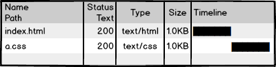
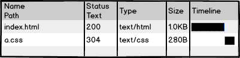
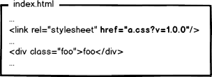
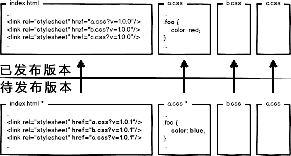
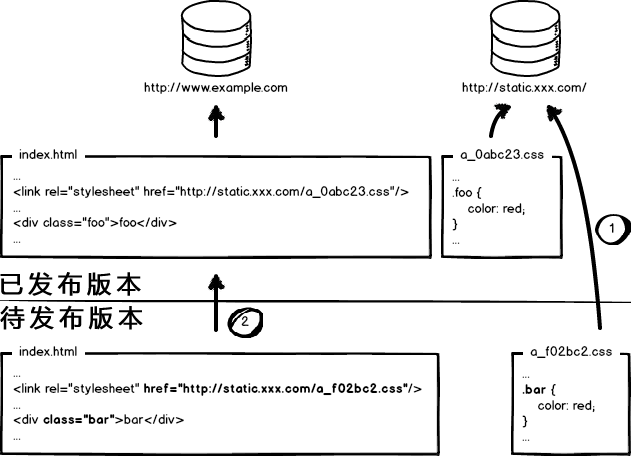
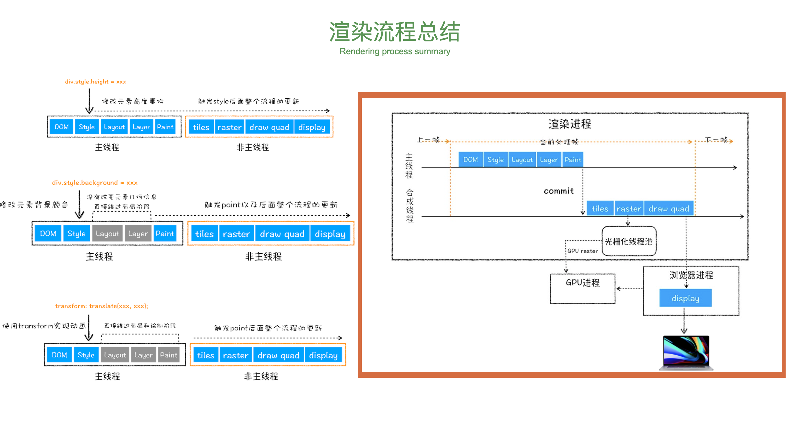

# 24期直播打点——知识点梳理

## [专题二]

### HTTP那些事儿①

1. **当我们输入网址后会发生什么？**

> 这是一道对于web考察的非常全面的经典面试题，可以说的非常详细，也可以说的非常简略，非常考验前端工程师的功底！
>
> 以下是这个题的参考答案：
>
> 1. 在浏览器中输入`www.google.com`之后按回车，浏览器会发出请求指令。
> 2. 发出指令之后需要测试网络的连通性保证网络是通的，并且连接到网络上。这个步骤需要经过很多网络设备，常见的有路由器和防火墙。
> 3. 然后，进行DNS查询，这一步的目的是把浏览器地址栏中的字符串形式的域名映射为ip地址并拿到这个IP。这里需要注意，DNS查询这一过程涉及的点也是非常多的，要先看本地的DNS缓存以及host文件，如果DNS缓存中存在这个域名的映射IP，则无需进行DNS查询。如果没有缓存，则需要进行DNS查询。`DNS查询也需要非常多的步骤，对于这个面试题不做赘述`。
> 4. 通过DNS查询拿到IP地址后，客户端和服务器就可以建立TCP连接，建立TCP连接需要`三次握手`，通俗的讲就是客户端与服务器进行三次通信从而建立TCP连接。`TCP的三次握手也是前端一个重要的问题，这里不做赘述`。
> 5. 建立TCP连接之后，我们向服务端发送请求。请求所走的线路是通过`路由技术`计算得出，`关于路由技术这里不做赘述`。
> 6. 到达IP所指定的入口，这里应该是一个服务器集群的入口地址，服务器集群要经过`反向代理`，把这个请求落在一个具体的服务器上。`关于正向代理和反向代理，以及Nginx这些概念，这里不做赘述。`
> 7. 服务器接收到请求，做出响应，把html在服务端组装完成，并发送给客户端。**（这一步是服务器是重点，和前端关系不大，但是如果做Node开发就要清楚这里的处理流程）**`那么返回的具体路径也是需要经过路由技术的计算得出最优路径`
> 8. 客户端，也就是浏览器，接收到服务器返回的数据，经过浏览器的解析，呈现在页面上。`这里涉及到了浏览器内核对于HTML、CSS、JS的解析，解释和执行，并且涉及到了GUP渲染，这里不做赘述`。


**2. HTTP请求模型**

> 关于HTTP请求模型，简单来说就是`两端`和`两个动作`。
>
> **两端：客户端、服务端**
>
> **两个动作：请求、响应**
>
> 什么是客户端？
>
> 主动发起请求的是客户端。
>
> 什么是服务端？
>
> 被动等待被请求，并且根据请求作出相应的一端是服务端。


**3. 什么是HTTP协议？**

> HTTP协议又叫`超文本传输协议`，超文本的概念就是不只是文本，包括图片、音频、视频等格式的文件。HTTP协议是应用层协议，也就是说HTTP协议是可以让程序直接调用的协议。目的是为了文本、图片、音视频等文件从服务器到客户端的传输。
>
> HTTP协议分为请求和响应两部分：
>
> 1. 请求：请求行、请求头、请求体
>
> 2. 响应：状态行、响应头、响应体


**4. HTTP发展史**

> 1990年，HTTP0.9。
>
> 1996，HTTP1.0 所有的连接都为短连接。
>
> 1999，HTTP1.1 加入了长链接。
>
> 2015，HTTP2 多路复用，从单个文件层面上解决了队首阻塞问题。
>
> HTTP3 （HTTP over QUIC）从协议层面（HTTP3使用的是UDP协议）上彻底解决了队首阻塞。


**5. TCP/IP协议栈（记忆不充分）**

> 想要弄清楚TCP/IP协议栈，那么就得先说IOS/OSI七层协议模型，OSI七层模型是协议栈的标准。这个标准是分层设计的，共分为七层，从上到下分别为：
>
> 1. 应用层
> 2. 表示层
> 3. 会话层
> 4. 传输层
> 5. 网络层
> 6. 数据链路层
> 7. 物理层
>
> 这七层是逐层调用的，上面一层只能调用其下面一层的接口，其中物理层没有接口。OSI是一个国际标准化模型，但是由于互联网发展初期，通信比较简单，设计方面没有考虑的非常清楚，所以设计了TCP/IP四层协议栈。`TCP/IP也就成了事实上使用的协议栈。`
>
> TCP/IP协议栈一般分为四层，也有说五层的。从上到下分别是：
>
> 1. 应用层
> 2. 传输层
> 3. 网络层
> 4. 网络接口层
>
> 其中应用层的协议重要的有HTTP协议，传输层为TCP、UDP协议，网络层为IP协议，网络接口层没有协议，属于硬件部分。TCP/IP协议栈的名字就是从传输层和网络层各拿出最重要的协议来命名。
>
> **为什么叫协议栈？**
>
> 因为整个协议是分层的，从上到下像数据结构中栈的结构。


**6. HTTP的工作过程？（完全没记忆）**

> 1. 客户端与服务器建立TCP连接（三次握手）
> 2. 客户端向服务端发送请求（这里涉及到请求的格式）
> 3. 服务端向客户端响应请求（这里涉及到相应的格式）
> 4. 客户端接收到服务端的响应之后，断开连接（四次挥手）
>
> **长链接：请求建立TCP连接之后，一次请求完成不断开TCP连接，复用链路**


**7. 请求和响应格式（记忆不充分）**

> 请求包括：
>
> 1. 请求行：请求方法、协议名称、协议版本号
> 2. 请求头：请求修饰符，客户机信息
> 3. 请求体：可能的内容，get是没有请求体的
>
> 响应包括：
>
> 1. 状态行：协议版本号、状态码、状态描述
> 2. 响应头：服务器信息
> 3. 响应体：实体信息和可能的内容


**8. session、cookie**

> 关于cookie和session，出现的原因是HTTP是一个无连接的协议，所谓无连接的协议是指服务器无法通过连接来判断客户端的状态，`服务端无法维持客户端的状态`，也就是说对于同一客户端发送的两次HTTP请求，服务端会认为是完全不同的两个客户端发送的。为了解决这个问题，客户端就需要告诉服务端自己是谁，那么就出现了Cookie和Session机制。
>
> Session：存在于服务器的一小段信息，用户第一次请求服务端的时候会把登录的用户名和密码发送给服务端，服务端同过验证会生成一些用户相关的信息存入session表中，或者session数据库中，那么就会有sessionID，然后把sessionID通过setCookie的方式给到客户端。
>
> Cookie：客户端在接收到服务端响应的时候，响应头中的setCookie会让浏览器把setCookie中的SessionID种到浏览器的Cookie中，下一次的请求会自动带上这个cookie，也就是sessionID到服务端，服务端通过sessionID查询Session表，这样就维持住了客户端的状态，知道客户端具体是谁。
>
> `这个题目还可以引申出很多东西，比如一般登录的处理，维持登录状态的实现方式，token的用途等等`


**9. HTTP缓存机制**

> 关于HTTP缓存，分为两种情况：
>
> 1. 客户端第一次请求服务器，这时候客户端本地没有任何缓存，所以只能在服务器拿到数据，然后这个时候服务器会定制一套缓存策略，包括cache-control、exprice、Etag、last-modified，这些通通放在了响应头中。浏览器会通过这些头信息对服务端返回的信息进行缓存。
> 2. 浏览器第N（N > 1）次请求服务器：
>    1. 先判断强制缓存的保险时间（cache-control和Expires），如果没有过期那么直接使用本地缓存。
>    2. 如果强制缓存过期，那么就会走到协商缓存，这里的协商是浏览器跟服务器进行协商，协商缓存包括`Etag`和`Last-Modifiried`，这两个是有优先级的`Etag > Last-Modifiried`
>    3. Etag是一个MD5的字符串，浏览器会把这个字符串放到`if-none-match`中发送给服务器，服务器会拿到这个md5的字符串与服务器上存储的md5的值进行比较如果一致，证明浏览器的本地缓存仍然有效，那么就会告诉浏览器使用本地缓存的数据。如果对比的结果不一致就会检查`last-modifiried`，`last-modifiried`是一个时间戳，浏览器会把这个时间戳放到If-Modifiried-Since中带到服务器，服务器拿到这个时间戳进行比对，如果比对结果正确，会告诉浏览器直接使用本地缓存，如果不正确证明服务器上的数据已经发生变化，那么就在服务器中重新取出新的数据，然后重新制定缓存策略连同数据返回给浏览器。
>
> **关于HTTP的缓存机制，不同的情况会导致响应的状态码不同。**
>
> `这里需要知道的细节是cache-control的取值对于缓存策略的影响，以及HTTP状态码的含义，这里不做赘述。`


###  HTTP那些事儿②

**1. 什么是对称加密和非对称加密（对于常用算法记忆不充分）**

> 对称加密：加密和解密的秘钥相同，这样的加密为对称加密。
>
> 非对称加密：加密和解密的秘钥不同，这样的加密为非对称加密。
>
> 对称和非对称的概念是相对于秘钥来说的。
>
> 常用的对称加密算法：AES、DES、3DES
>
> 常用的非对称加密算法：RSA
>
> 公钥加密，私钥解密


**2. CA证书的签发流程（记忆不充分）**

> CA证书的签发流程分为6步：
>
> 1. www.example.com服务器先从CA机构（如Digicert）申请TLS证书。
> 2. CA机构就会为www.example.com这个域名创建证书，证书的内容包括服务器名称、服务器公钥等。
> 3. CA机构创建证书的hash值，然后使用CA机构自己的私钥对其加密。
> 4. 浏览器和操作系统自带CA等权威机构的公钥。公钥可以在操作系统中找到。
> 5. 当浏览器收到签名证书时，将使用公钥从签名生成hash值，还需要根据证书指定的散列算法生成证书的hash值，这两个hash值如果相同，则认为证书是可以信任的。
> 6. 浏览器可以使用证书中的公钥继续进行身份验证。


**3. 浏览器如何验证服务器证书有效？**

> 从根证书开始逐层验证


**4. SSL/TLS**

> SSL协议是TLS前身，TLS协议也就是HTTPS中的S，是为了加密TCP链路使HTTP连接更加安全。
>
> TLS包括四个子协议，分别是：
>
> 1. 握手协议（对称加密）
> 2. 秘钥配置切换协议（不对称加密）
> 3. 应用数据协议
> 4. 报警协议（证书失效会触发报警）
>
> **HTTPS不是绝对安全的，在握手的时候可能会出现中间人攻击。秘钥交换会被截获。**


**5.  HTTPS的协议分析——TLS握手步骤（记忆不充分）**

> TLS的握手共分为15个步骤，但是比较好记，因为我们可以分为几个部分来记忆：
>
> 0. TLS握手之前为TCP握手。
>
> 1. ClientHello： 客户端发送自己所支持的SSL/TLS协议最高版本号，以及所支持加密算发集合和压缩算法等信息集合到服务器。
> 2. ServerHello：服务端接收到客户端发送过来的信息后，挑选两端都支持的SSL/TLS版本号以及加密算法和压缩方法，返回给客户端。
>
> `前两步为客户端与服务端协商的过程——hello过程，这可以看做TLS握手步骤的第一部分。`
>
> 3. SendCertificate（可选）：服务端要把自己的证书发送给客户端。
> 4. RequestCertificate（可选）：如果选择双向验证，服务端会向客户端请求客户端的证书。
> 5. ServerHelloDown：服务端通知客户端初始协商结束。
>
> `第3、4、5步全都是服务端想客户端发送消息，连续发送三次消息，分别是服务端证书、请求客户端证书、通知客户端初始协商结束。第四步是双向验证，但是HTTPS一般是单向验证，所以HTTPS的TLS握手不需要第四步。`
>
> 6. ResponseCertificate（可选）：如果选择了双向验证，客户端会把自己的证书发送给服务端。
> 7. ClientKeyExchange：客户端需要使用服务端的公钥对自己的公钥和秘钥种子进行加密，再发给服务端。
> 8. CertificateVerify（可选）：如果选择双向验证，客户端用本地私钥生成数字签名，并发送给服务器端，让其通过收到的客户端公钥进行身份验证。**（这一步是为了验证第六步）**
>
> `第6、7、8步全都是客户端向服务端发送消息，分别是发送自己的证书、发送加密后的公钥和秘钥种子、数字签名。其中第七步是重点，客户端和服务端进行秘钥交换。对于HTTPS来说第六步和第八步是不需要的，原因就是HTTPS不需要双向验证！`
>
> 9. CreateSecretKey：通讯双发通过秘钥种子生成通讯秘钥。**这一步就是各自进行计算把秘钥解出来。这一步双方并没有做通信！**
>
> `这一步是要把加密通讯所要具备的秘钥通过得到，并不会进行通信！`
>
> 10. ChangeCipherSpec：客户端通知服务端已将通信方式切换为加密模式。
>
> 11. Finished：客户端做好加密通讯的准备。
> 12. ChangeCipherSpec：服务端通知客户端已将通讯方式切换为加密模式。
> 13. Finished：服务端做好加密通讯的准备。
>
> `10-13步实际上是客户端与服务端进行秘钥的协商，这是加密链路的最后一个步骤`
>
> 14. Encrypted/DecryptedData：双方使用客户端秘钥，通过对称加密算法对通信内容进行加密。
> 15. ClosedConnection：通讯结束后，任何一方断开TLS连接。
>
> **和第0步成对儿的，当TLS断开后，还需要断开TCP连接**


**6. HTTP2协议分析**

> HTTP2在使用方面和HTTP1.1并没有任何区别。
>
> 对比HTTP1.1，HTTP2：
>
> 1. 改变了数据的分装格式数据包更小，处理速度更快。
> 2. 实现了二进制分帧层，出现了伪头。
> 3. HTTP2可以对报头压缩。
> 4. 多路复用，一个网络连接实现并行传输。
> 5. 服务器主动推送。
> 6. 默认使用加密


**7. HTTP2的二进制分帧层**

> HTTP2的二进制分帧层是一个封装规则。HTTP2的分帧层可以是HTTP的请求头和请求体更加严密，`HTTP2直接把请求分成了两部分，一个是头帧，一个是数据帧。`HTTP2还有一个头数据的偏移量，方便取出头信息，不至于越界，HTTP2更加严密了。


**8. HTTP2多路复用（记忆不充分）**

> 在HTTP1.1中如果需要并行的传输多个文件，需要建立多个TCP连接，这样的话会有两个缺点：
>
> 1. 多个TCP连接的建立会增加服务器的压力，服务器TCP连接的数量和socket数量是一致的，这个数量有其上限，一旦数量到达一定的量级服务器的压力就会很大，因为服务器要分出一部分算力和空间来维护TCP的连接。
> 2. HTTP1如果想在一个连接上传输多个数据的话，需要串行的发送，也就是说传输完上一个文件，才能传输下一个，这样的话如果网络情况不好出现丢包的话就很有可能出现`队首阻塞`，而且这种队首阻塞是发生在整个链路上。
>
> HTTP2在一定程度上解决了上述的这两个问题：
>
> 1. HTTP2是把一个个文件细粒度的分割成若干个小块，然后并行交错的发送，看上去就像是在并行的传输。
> 2. 并行交错的发送请求和响应，底层的协议保证了多个请求之间或者多个响应之间互不影响。
> 3. 传输到另一端的后在进行重新组装。
>
> HTTP2实际上是减轻了服务器TCP连接数的压力。


**9. HTTP3解决对首阻塞问题**

> HTTP3又叫做HTTP over QUIC，底层是用的UDP协议而不是TCP协议，`对首阻塞`的产生就是因为TCP协议是一个面向连接的协议，一旦发生丢包就会等待重传，从而产生对首阻塞。HTTP3使用UDP协议实际上是从协议层面上根本的解决了对首阻塞问题。因为UDP是不面向连接的协议，所以就不会产生对首阻塞问题。


**10. HTTP3的优点**

> HTTP3的优点实际不是HTTP协议带来的，关键点在于QUIC协议，QUIC协议是Google基于UDP封装的，既具有UDP协议的简单快捷，有具有TLS、TCP和HTTP2的优点：
>
> 1. 去掉了握手的延迟，UDP是不需要握手的。
> 2. 多路复用
> 3. 加密不是在链路上而是对数据包加密，更加简单。
> 4. 连接迁移。（从4g迁移到wifi不会重连）


**11. 正向代理和方向代理**

> **正向代理（出不去圈，帮你出圈）**：加入我们在公司的内网，我们想访问外网的话，内网的机器需要访问一台能够连接到外网的机器，通过这台机器访问外网，这种方式叫做代理也就是正向代理。
>
> **反向代理（进不去圈，帮你进圈）**：反向代理和正向代理正好相反，如果一台机器想访问Google的某一台具体的服务器，需要先连接到Google的一台机器上，再通过这一台机器访问Google的一台具体的服务器，这就叫反向代理。
>
> **反向代理的用途（记忆不完全）：**
>
> 1. 负载均衡
> 2. 减速上传
> 3. 静态文件缓存
> 4. 安全
> 5. 外网发布
> 6. 加密和SSL加速
> 7. 压缩


**12. Nginx具体配置（这个还不会，没有亲手配置过）**

> 看具体文档这里不做讲述


### 大规模NodeJS项目架构与优化

**1. Node能做些什么？**

> 1. SPA
> 2. MPA
> 3. SPA + MPA（真假路由混用）
> 4. BFF架构
> 5. 做游戏的中间层，使用低配置抗住高IO


**2. 异步IO的好处？**

> 1. 前端通过异步IO消除UI的阻塞。
> 2. 如果有多个IO操作时间分别为A、B、C...，同步IO的时间会随着IO操作的数量增加呈线性增长为A + B + C，异步IO的事件为Math.max(A、B、C...)


**3. Unix Domain Socket**

>使用BFF架构时，如果Node进程与后端服务器进行同信选择Http通信，那么势必会增加一次网络请求的时间，那么前端的响应时间势必会变长，为了解决这个问题，我们可以把Node服务和后端的PHP或者Java服务部署在同一台机器上，使用Unix Domain Socket进行进程间通信，解决多一次HTTP请求的问题。
>
>当然除了Unix Domain Socket，我们是可以使用HTTP的。那么就要严格的控制Node请求后端服务器的时间，也就是要做超时控制。


**4. 不参与eventloop的几个特殊的api**

> 1. setTimeout
> 2. setImmediate
> 3. process.nextTick


**5. 三类观察者及其优先级**

> 1. Idle观察者：process.nextTick()
> 2. IO观察者：setTimeout()
> 3. check观察者：setImmediate()
>
> **优先级：Idle观察者 > process.nextTick > Process().then > IO观察者 > check观察者**
>
> `关于观察者的一道经典面试题`
>
> ```javascript
> setTimeout(function() {
>   console.log(1);
> }, 0);
> 
> setImmediate(function() {
>   console.log(2);
> });
> 
> // 如果只是setTimeout和setImmediate执行那么顺序就不一定了。
> 
> process.nextTick(() => {
>   console.log(3);
> });
> 
> new Promise((resolve, reject) => {
>   console.log(4);
>   resolve(4);
> }).then(() => {
>   console.log(5);
> });
> 
> console.log(6);
> 
> 
> // 根据观察者优先级可以知道执行顺序为： 4、6、3、5、1、2
> ```


**6. V8的垃圾回收机制（大概弄懂了）**

> 所谓的垃圾回收处理机制实际上就是把内存中不用的变量空间给回收掉。V8的垃圾回收机制把内存分为新生代和老生代，这主要是受到了`"代际假说"`的影响，认为在内存中存在较长时间的对象会更长久的存在于内存中。新生代为存活时间较短的对象，老生代为存活时间较长的对象。
>
> V8的垃圾回收器分为主垃圾回收器和副垃圾回收器，主垃圾回收器负责老生代的回收，副垃圾回收器负责新生代的回收。新生代的垃圾回收机制使用了Scavenge算法，Scavenge算法在具体实现时是根据Cheney算法来实现的。
>
> **代际假说：**
>
> 1. 在内存中大部分的对象都是“朝生夕死”，存活的事件都非常短。
> 2. 不死的对象会存活的更久。
>
> **新生代垃圾回收——Scavenge（Cheney）算法：**
>
> Cheney算法是一种采用复制方式进行垃圾回收的算法，Cheney会把堆内存分为两部分，每一部分空间都叫`semispace`，这两部分空间，一部分在使用，一部分空闲。处于使用的空间为`from`，处于空闲的时间为`to`，当分配对象的时候也是会分配到from空间中，那么当垃圾回收开始的时候会检查from中被用到的对象（存活的对象），把存活的对象复制到to空间去，把from空间中非活对象的空间释放掉。完成复制后，from和to的角色会互换。
>
> 晋升：
>
> From空间中的对象在复制之前会经过两个检查，符合检查条件的会被晋升为老生代：
>
> 1. 经过两次Scavenge算法存活下来的对象
> 2. to空间占用超过25%
>
> **老生代垃圾回收——Mark-Sweep&Mark-Compact**
>
> V8在老生代垃圾回收中使用的是Mark-Sweep和Mark-Compact相结合的方式进行回收。Mark-Sweep会遍历老生代堆中的对象，并标记活着的对象，垃圾回收的时候只清楚未标记的对象。这就出现了一个问题，清除之后内存会出现不连续的情况，这就出现了内存碎片化，会直接影响到后续的内存分配，后续很大可能会分配一个大对象，这样的话就会触发一次垃圾回收，而这次垃圾回收则是不必要的。为了解决内存碎片化的问题，提出了Mark-Compact，和Mark-Sweep不同的是Mark-Compact会在标记死亡之后，在清理的过程中会把存活的对象往一端移动，移动完成之后清理掉边界外的内存。
>
> **V8什么时候启动GC？**
>
> 新生代垃圾回收比较频繁，Scavenge算法实现了垃圾回收的机制，只要是新生代内存不够用就会启动。
>
> 老生代垃圾回收扫描指针和分配指针分配到老生代时触发GC。
>
> **三色标记**
>
> 黑白灰三色标记，黑色是已经使用的，白色是没有使用的，灰色是新加入的。


**7. Node集群**

> PM2做node应用的本机负载。
>
> 关于Node集群
>
> 1. 首先是Nginx做服务器之间负载均衡
> 2. 然后是PM2几台机器做进程守护
> 3. PM2之后是stupid或者Vanish机器做缓存
> 4. 之后才能到后端（比如PHP、Java）的服务器集群
> 5. Java之后是DB的集群（写集群、读集群）
> 6. PM2如果load的是静态资源的话应该走CDN
> 7. 每个机器都有心跳监测


## [专题四]

### 前端性能优化必备服务器知识

**1. Navigation Timing**

> 关于`Navigation Timing`，是一个很复杂的话题，首先他是一个运行在客户端（也就是浏览器）的一套性能指标。所以我们对于前端性能的优化是离不开对于Navigation Timing的分析的。
>
> 在Navigation Timing可以分为两个角色，一个是浏览器，一个是网络，在Navigation Timing中只能清楚的体现这两者，并不能拿到服务器的任何性能相关的信息（这一点在前面其实也说明了，Navigation Timing是运行在浏览器端的）。
>
> 浏览器也给出了Navigation Timing相关的API供我们分析前端性能，具体的使用在MDN上都是有的。
>
> 
>
> 这个是Navigation Timing的图示：
>
> 1. Prompt for unload：浏览器在渲染新的页面之前会卸载掉原来的页面，这一步是浏览器准备卸载旧页面。
> 2. redirect&unload：这一步是浏览器做本地重定向，并且会并行的卸载掉之前的页面。这里的重定向实际上和本地缓存有关，所谓重定向就是取缓存的数据进行渲染。
> 3. APP Cache：检查本地的缓存，如果有缓存那么就可以渲染，这一步和redirect正好配合，在第一次请求页面的时候是不会走重定向和缓存的。
> 4. DNS：DNS查询，对于DNS查询底层使用的UDP协议，具体步骤这里不做赘述，稍后会整理。
> 5. TCP：建立TCP连接，三次握手。
> 6. Request：客户端请求
> 7. Response：服务器响应，根据服务器返回的状态，可能会返回redirect步骤。
> 8. Processing：浏览器内核渲染
> 9. onLoad：浏览器onLoad事件


**2. DNS查询**

> DNS查询是为了把域名转换为IP地址，这就要先分析域名。
>
> 域名是分等级的：
>
> 1. 顶级域名：.com，.cn这些是顶级域名
> 2. 一级域名：google.com是一级域名
> 3. 二级域名：www.google.com是二级域名
> 4. 以此类推接下来的是三级域名 bj.5i5j.com是三级域名
>
> DNS查询使用的是UDP协议，简单快捷。
>
> `以上的这些为DNS查询的前置知识`
>
> **DNS查询步骤：**
>
> 1. 在DNS查询时浏览器会先查询本地DNS缓存
> 2. 如果缓存中没有查到，那么就会把域名发送到DNS服务器上。这个DNS服务器的地址在电脑连上网之后就会告知DNS服务器的地址。
> 3. 但是这个DNS服务器也并不是真正意义上的DNS服务器，他收到DNS请求之后会把请求中转到真正的DNS服务器。也就是说我们电脑里面存储的DNS服务器的IP地址就是一个中转的服务器，DNS请求转到真正的DNS服务器上。当然这个服务器上也会做DNS缓存，它缓存的是频率比较高的域名。
> 4. 从这一步DNS解析真正的开始，先请求`Root Server(根服务器)`，根服务器会把`.com`的顶级域名服务器（TLD）的地址告诉你。
> 5. 得到`TLD`的顶级域名服务器地址，然后再次向TLD服务器发送DNS查询，TLD服务器会把Name Server也就是名称服务器的地址返回，这个地址就是一级域名。
> 6. 客户端得到了`name server`的地址，向名称服务器发送DNS查询请求，NameServer会把二级域名乃至N级域名的IP返回
> 7. 客户端就完成了域名到IP地址的解析。
>
> 我们可以看到DNS解析的过程是非常复杂的，需要和很多服务器进行通信，为了保证速度，不可能使用TCP协议（握手延迟），从而使用了UDP。
>
> **DNS查询的优化：**
>
> DNS查询的优化手段和HTTP的优化手段实际上都是想通的，就是利用`缓存`，是的DNS查询不用经过这么多的服务器，减少查询的次数。方法就是把解析频率高的域名和IP的映射缓存在中转服务器上。


**3. CDN概念**

> CDN又叫内容分发网络，是为了减轻服务器的压力，把一些静态的资源存储到多台服务器上，这几个服务器存储的内容和配置都是一样的，叫做镜像服务器。多个服务器会分散在全国甚至世界不同的地方，当客户端请求数据的时候就需要一个最短的路径`(这个最短路径是综合网络和地理位置的最短路径，就近原则)`，所以要找到一个符合最短路径的IP，就需要DNS解析的帮助。DNS解析会根据客户端的位置，解析出一个相对于客户端最短路径的服务器地址。
>
> **所以CND和DNS解析是分不开的！**


**4. TCP协议头**

> TCP协议头包括：
>
> 1. 两个端口号：客户端端口号，服务器端口号。
> 2. 顺序号：数字
> 3. 应答号：数字


**5. 三次握手、四次挥手**

> **TCP建立连接的时候需要经过三次握手：**
>
> 1. 客户端向服务器发送一个顺序号`数字 X` 。
> 2. 服务器返回一个应答号`数字X + 1`，同时也返回一个顺序号 `数字Y`。这时客户端就知道服务端已经准备好。
> 3. 客户端向服务端发送一个应答号 `数字Y + 1 ` ，这样服务端就知道客户端也做好了准备。
>
> TCP断开连接的时候需要经过四次挥手：
>
> 1. 客户端向服务端发送一个Finish指令、一个顺序号 `数字 X + 2`、一个应答号 `数字 Y + 1`。
> 2. 服务端马上响应，发送一个应答号 `X + 3`
> 3. 然后接着发送一个Finish指令和顺序号 `Y + 1`
> 4. 客户端收到之后，向服务器发送一个应答号 `Y + 2`


### Chrome浏览器渲染机制内幕

**1. 现代浏览器的特征**

> 1. 网络
> 2. 资源管理
> 3. 网页浏览
> 4. 插件和扩展
> 5. 多页面管理
> 6. 安全机制
> 7. 开发者工具
> 8. 账户和同步


**2. 现代浏览器的结构**

> 1. 用户界面
> 2. 浏览器引擎
> 3. 渲染引擎
> 4. XML解析器
> 5. 网络
> 6. 显示后端
> 7. 数据持久层


**3. 渲染引擎结构与工作流程**

> 渲染引擎是webkit的核心，渲染引擎的作用是将HTML、CSS、JS这些文本，转化为用户能够看见的网页。
>
> 渲染引擎的结构如下：
>
> 1. HTML Parser  ---->  DOM tree
> 2. CSS Parser ----> DOM tree + css片段  => Render Tree
> 3. JavaScript 解释器 ---> 独立为一个模块
>
> **工作过程：**
>
> 1. 首先，HTML Parser 会把HTML解析成DOM Tree。
> 2. 在解析HTML的时候遇到CSS文件或者代码，会调用CSS Parser把CSS代码解析成CSS片段，挂载到DOM树上，这样就形成了渲染树。
> 3. JS代码的执行是用JS解释器解释执行的，JS代码也会对DOM树和CSS进行操作，直接作用在渲染树上。在DOM上我们也可以有JS代码，比如说点击事件。也就是说DOM也可以调用JS解释器。
> 4. Render Tree 加上布局规则，经过位置计算生成布局树（Layout Tree）
> 5. 布局完成之后，进行绘制，调用显示后端，呈现在屏幕上。
>
> **这只是一个简单的工作流程！**
>
> `根据这个工作流程我们可以得出一个结论HTML Parser是解析HTML生成DOM树，然后JS解释器又可以操作DOM树，所以我们在写JS的时候，尽量在HTML文档的最后。否则会出现争抢，产生解析的错误。`


**4. Chrome架构**

> 1. Broswer进程——主进程
> 2. Renderer进程（多个）
> 3. Plugin进程（多个）
> 4. Untils进程
> 5. GPU进程


**5. Chrome渲染过程**

> 1. 解析部分
>    1. 通过网络请求得到HTML、CSS、JS
>    2. HTML Parser首先开始工作，解析HTML，生成DOM树。`这里要注意的是遇到样式文件或者style标签会让CSS Parser进行CSS解析，遇到JS代码需要让JS解释器进行解释执行（JS的解释执行会阻塞HTML解析）`
>    3. CSS Parser会把CSS解析成CSS 片段，然后基于DOM Tree，与DOM Tree上的节点做关联，生成渲染树。
>    4. 渲染树通过对于每个节点上CSS片段的计算得出每个节点的样式和坐标，生成了布局树。
> 2. 合成部分：生成层树`（Layer Tree）`
> 3. GUP渲染：Layer Tree是最后生成图像的规则，最后需要把Layer Tree交给GPU，把整个图像分成若干个小块，每一个小块叫做一个tail，把每一个tail交给GUP的一个核心去处理，然后处理的结果存到显存中，在描点画在屏幕上。


### 前端架构与性能优化那些事儿

**1. 为什么要进行性能优化？（大概能记得）**

> 1. 52%的用户认为网站打开的速度影响他们对网站的忠实度。
> 2. 57%的用户更在乎网站是否能在三秒之内打开。
> 3. 每慢一秒PV降低11%，用户满意度降低16%。
> 4. 近半数的移动用户因为网站没有在10秒内打开而放弃使用。

**2. 性能优化的学徒工（记得）**

> 1. 请求的压缩与合并之间的冲突，压缩使请求的体积变小，合并多个请求使请求的体积变大。
> 2. 根据绝大多数浏览器同一个域下并发请求的数量，我们要把同一个域下的请求控制在五个以内。
> 3. 使用localstorage、indexDB等做缓存，或者使用service-worker做PWA离线缓存。
> 4. 对于网站的资源加载使用CDN，一个是控制请求并发，而是去cookie化。`关于CDN的去cookie化可以对比百度`
> 5. 缓存的极致处理——使用md5，做资源非覆盖式的全量发布。`这里的非覆盖式全量发布是解决缓存的成熟手段，稍后会进行解析`
> 6. 使用多普勒测试得到用户的网速，根据用户的网络情况来选择不同的清晰度的图，使得用户能够尽快的看到页面的内容。`关于多普勒测速稍后会分析，这里不做赘述。`

**3. 非覆盖式的全量发布（理解记忆）**

> 这个问题涵盖了两个方面，第一个是前端部署问题，第二个是前端代码的优化问题，这里说的优化主要是缓存的解决方案。
>
> 1. 从原始的前端开始，就是把测试完成的html、css、JavaScript文件丢到服务器，然后直接请求，完美~这个谁都会做。`但是这样对于前端的性能非常不好，你会发现没有任何的缓存，每一次都会请求后端，这样就会浪费带宽。`
>
>    
>
>    
>
> 2. 我们希望的是客户端可以缓存这张图片，这样的话就可以不从服务器请求这张图片，而是使用本地的。使用缓存，请求状态返回304，这样的话就是使用的协商缓存。因为这样的话可以做到和服务器进行协商，本地图片和服务器的图片如果不同则重新请求，如果相同那么直接使用本地的资源。
>
>    
>
>    `但是我们的性能要求是很高的，返回304，还是要和服务器通信一次，如果想要直接干掉这次请求，性能会进一步提升，那么只有使用强制缓存。`
>
>    `那么问题就来了，使用强制缓存是能够干掉请求的，那么保鲜期内如果服务器的资源发生了变化，怎么更新呢？`
>
> 3. 首先，使用强制缓存的策略是没有问题的，我们需要解决的就是强制缓存的情况下如何更新缓存的问题。我们可以`改变请求资源的路径`，让浏览器主动的放弃缓存，重新向服务器请求新的资源。也就是说我们可以把html文件中的script标签或者link标签中的资源地址加一个版本号的形式，每一次更新一个新的资源版本浏览器都会重新请求。
>
> 
>
> 4. 这样的话是可以在一定程度上解决缓存问题，但还没有完全的解决问题，因为有下面这么一种场景：
>
>    
>
>    图中表示的是，如果是引用了a、b、c三个css文件，但是新的版本只更改了其中的一个css，`如果按照版本更新来让浏览器把所有的css缓存放弃重新请求，不是又多了两次请求，又造成了浪费。`
>
> 5. 如果想解决上述的问题，我们需要把url和文件内容的变化相关联，也就是说url参数的值要跟着文件的变化而变化。那么我们可以很自然的想到数据摘要算法，对CSS内容进行摘要（也就是md5）。这样的话我们对于缓存的控制就达到了单个文件的粒度。
>
>    `这样是不是就万事大吉了，其实不然，现在的公司为了追求web站点的性能，会把资源文件放在另一台专门的资源服务器上，利用CDN技术把资源部署在CDN节点上，也就是说资源和业务服务器进行分离。`
>
>    这样的话我们就面临一个很尴尬的问题，在资源有更新的情况下，我们的html（主服务器）和资源（CDN节点）这两个东西哪一个先上线？完了芭比Q了，没招了。仔细想想，线上哪一个都不好使，因为有时间差，就有可能在时间差内的请求，造成页面的混乱。
>
>    **先部署页面，再部署资源**：在二者部署的时间间隔内，如果有用户访问页面，就会在新的页面结构中加载旧的资源，并且把这个旧版本的资源当做新版本缓存起来，其结果就是：用户访问到了一个样式错乱的页面，除非手动刷新，否则在资源缓存过期之前，页面会一直执行错误。
>
>    **先部署资源，再部署页面**：在部署时间间隔之内，有旧版本资源本地缓存的用户访问网站，由于请求的页面是旧版本的，资源引用没有改变，浏览器将直接使用本地缓存，这种情况下页面展现正常；但没有本地缓存或者缓存过期的用户访问网站，就会出现旧版本页面加载新版本资源的情况，导致页面执行错误，但当页面完成部署，这部分用户再次访问页面又会恢复正常了。
>
> 6. 上述问题的起源在于资源的覆盖式发布，那么为了解决这个问题就要使用非覆盖式的发布，也就是说新版和老版的资源都存在服务器上。
>
>    `怎样实现非覆盖？`
>
>    可以使用md5内容摘要对资源文件命名，而不是简单的更换资源路径，这样的话就会生成一个完全不同的资源文件发布到服务器也不会对原有的文件进行覆盖。
>
>    
>
>    新的页面请求新的资源，老的页面使用老的资源，互不干扰。完美的解决了缓存的问题。
>
>    最后可能还有一个问题：`把资源进行非覆盖式的发布，新旧资源都存在服务器上，对存储是一种浪费？`
>
>    **答：对于带宽来说，硬盘便宜的很。一个前端一辈子也写不了十个G的CSS、JS。**

**4. 多普勒测试（理解记忆）**

> 多普勒测试是通过客户端发送HTTP请求，让服务端得知用户网速的一种手段。得知用户的网速是非常有必要的，服务器可以根据用户的网速来决定是给用户展示高清图还是普通图。以便让用户更加快速的看到网页的内容。
>
> 服务端得到用户的网络情况的方式有三种：
>
> 1. H5自带接口window.navigator.connection.downlink，得出的结果上报服务器。这个方式不太准确。
>
> 2. 图片探测法，发送一个体积较小的图片给服务器，通过HTTP的时间和图片的大小进行粗估。
>
>    ```js
>    文件大小（KB） * 1000 /( end -start )
>    ```
>
> 3. **多普勒测速：**我们知道不管是http1.0还是http1.1超过三次相同的请求就会复用链路：
>
>    https://res1.5i5j.com/test_pixel?http=1.0&t=1&size=0k
>
>    https://res1.5i5j.com/test_pixel?http=1.1&t=2&size=0k
>
>    https://res1.5i5j.com/test_pixel?http=1.1&t=3&size=0k
>
>    https://res1.5i5j.com/test_pixel?http=1.1&t=4&size=10k
>
>    https://res1.5i5j.com/test_pixel?http=1.1&t=5&size=40k
>
>    T1 = DNS + New Connection + RTT
>
>    T2 = New Connection + RTT
>
>    T3 = RTT
>
>    
>
>    计算公式：(40K - 10K) / (t5 - t4) 约等于

**5. HTTP2的多路复用（更加明晰）**

> 1. http1.1的keep-alive实现的是在一定时间内多次请求同一域名下的数据，会复用这条链路，只建立一次HTTP连接，不用创建多个连接。以达到提升请求效率的作用。
> 2. 但是HTTP1.1还是存在效率问题：
>    1. 服务器请求连接数的并发问题。
>    2. 多个请求串行传输的问题。如果一个请求的数据出现丢包的情况，那么剧需要启动重传机制，那么这条链路上这个请求之后的所有请求都会出现等待的情况（HTTP1的对首阻塞）。
> 3. HTTP2的多路复用就解决了请求连接的并发问题。HTTP2的请求是基于流的，同一域名下请求多个文件的时候，会把所有的文件进行分割，打散，以交织的形式进行传输。然后再客户端再进行重新组装。也就是说在微观上还是串行的传输，不过传输的是一个个小的文件块，在宏观上实现了多个文件的并行传输，那么当一个文件发生丢包的时候，只会阻塞这一个文件，并不会影响其他文件的传输。
> 4. HTTP2虽然在宏观上是并行传输的，但是还是会发生`对首阻塞`，这个是因为底层是TCP链接，`HTTP3从根本上解决了HTTP2的对首阻塞，这里不做赘述。`

**6. 四个经典的面试题：HTML、CSS、JS加载，三者之间的相互影响（结合webkie内核对于网页的解析）**

1. **JS代码会不会影响HTML的解析和渲染？**

```html
<!DOCTYPE html>
<html lang="en">
<head>
  <meta charset="UTF-8">
  <meta http-equiv="X-UA-Compatible" content="IE=edge">
  <meta name="viewport" content="width=device-width, initial-scale=1.0">
  <title>JS代码会不会影响HTML的解析和渲染？</title>
</head>
<body>
  <h1>标题</h1>

  <script>
    // 这段JS会影响HTML的解析吗？会影响HTML的渲染吗？
    prompt('测试')
  </script>
</body>
</html>
```

这段JS代码会影响HTML的渲染，不会影响HTML的解析。

2. **CSS加载会不会影响HTML的解析和渲染？**

```html
<!DOCTYPE html>
<html lang="en">
<head>
  <meta charset="UTF-8">
  <meta http-equiv="X-UA-Compatible" content="IE=edge">
  <meta name="viewport" content="width=device-width, initial-scale=1.0">
  <style>
    h1 {
      color: red;
    }
  </style>
  <script>
    setTimeout(function() {
      console.log(document.getElementsByTagName('h1'));
    }, 0)
  </script>
  <link href="https://cdn.bootcdn.net/ajax/libs/twitter-bootstrap/4.6.1/css/bootstrap-grid.css" rel="stylesheet">
  <title>CSS加载会不会影响HTML的解析和渲染</title>
</head>
<body>
  <h1>标题</h1>
</body>
</html>
```

CSS的加载会影响HTML的渲染不会影响HTML的解析。

3. **CSS的加载会不会阻塞JS的执行？**

```html
<!DOCTYPE html>
<html lang="en">
<head>
  <meta charset="UTF-8">
  <meta http-equiv="X-UA-Compatible" content="IE=edge">
  <meta name="viewport" content="width=device-width, initial-scale=1.0">
  <script>
    console.log('before...');
  </script>
  <link href="https://cdn.bootcdn.net/ajax/libs/twitter-bootstrap/4.6.1/css/bootstrap-grid.css" rel="stylesheet">
  <title>CSS的加载会不会阻塞JS的执行</title>
</head>
<body>
  <h1>标题</h1>
  <script>
    console.log('after...')
  </script>
</body>
</html>
```

CSS的加载会阻塞JS的执行。主要是JS解释器担心你的JS代码会用到CSS的某个类，造成页面的重绘和重排。

4. **CSS加载会不会影响domready？**

这个问题取决于html后面还有没有JS语句的执行，如果有就会影响到domready，如果没有则不会影响。

**`从这个题目我们可以明白一个问题，现在的性能优化都提倡CSS in JS或者CSS inline，就是因为CSS加载会影响HTML和JS。`**

**7. 渲染流程总结（更加明晰，还要再次细化，图很重要）**

> 1. 网页是分层的
>
>    1. 获取dom元素，对网页进行分层
>
>    2. 对每一个节点进行样式计算
>
>    3. 对每一个节点进行位置计算  Layout
>
>    4. 将每个节点绘制到图层位图中 Paint
>
>    5. 图层作为纹理上传到GPU
>
>       CPU给GPU一个最小的BitMapGUP进行偏移、缩放
>
>    6. Composite Layer （合成层）将符合的图层生成图像
>
>    7. Composite Layer （合成层）的具体工作
>
>       1. 主线程把绘制列表commit到合成线程
>       2. 合成线程根据viewport切成小的tile
>       3. 小图块生成位图，栅格化raster保存在GPU中
>       4. 合成线程绘制图块发送DrawQued命令给浏览器进程
>       5. 浏览器中的viz组件接收命令
>       6. 进行绘制，首次绘制是一个低分辨率的图
>
> 2. 大致流程   DOM、Layout、Composite Layer、Paint
>
> 3. 要注意一点translate独立成层。
>
> 


### 手摸手带你从0实现前端监控SDK

**1. 性能指标**

> 1. TTFB
> 2. FP
> 3. FCP
> 4. TTI
> 5. Long Task
> 6. LCP
> 7. FID：react的fiber专门解决了这个
> 8. TBT
> 9. CLS

**2. 关于指标的评定**

> 详情见：[Chrome官方对于性能指标的描述（权威）](https://web.dev/learn-web-vitals/)
>
> 一定要仔细学习，篇幅太长，在此不做赘述，`笔者正在进行`。

**3. 前端性能监控SDK的开发——看源码**

**4. 用户上报的三种方式**

> 1. fetch、ajax
> 2. navigator.sendBeacon
> 3. ``容易丢包
>
> 这三种方式是有优先级的：fetch > navigator.sendBeacon > img

**5. 前端性能监控的方案**

> 1. 埋点（不推荐）
> 2. PerformanceObserver（FRP）
> 3. 错误捕获：
>    1. 同步错误使用try...catch
>    2. 异步错误使用error事件进行捕获
>    3. promise错误的捕获有自己的捕获方式
> 4. 用户操作的回溯——rrweb**（为什么最终选择rrweb，这个问题需要说清楚）**


### 前端架构师启蒙课第一讲——走进IOC


