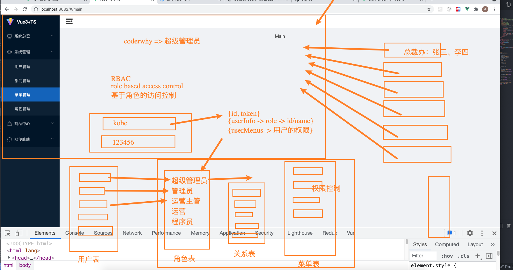

# 权限管理的具体实施方案

**`本方案与具体的技术栈无关，主要是权限管理设计原理的说明书~~`**

## 零、前言

在设计`开箱即用中后台解决方案`这种前端架构时，权限管理是绕不开的一个话题，也是所谓的中后台管理系统不可或缺的一个核心功能，可算作基础建设中重要的一环。

本方案一共包含以下几个重点：

+ **左侧菜单与权限管理的关系**


## 左侧导航与权限管理的关系

一般的，我们的中后台管理系统都会有一个左侧菜单，常规的操作就是点击左侧菜单的导航，会跳转不同的URL，内容区域会渲染不同的`页面级组件`。这样就会出现两个问题：

+ 第一个问题，左侧导航是怎么渲染的？导航的渲染是写死在前端还是由后端来决定。
+ 第二个问题，左侧导航是怎么和页面级的组件对应上的，也就是说左侧导航和内容区域的页面级组件的映射关系怎么设计。

先解决第一个问题——**左侧导航是怎么渲染的？**

作为一个管理系统，登录的人员是有很多角色的，例如超级管理员、运营总监、销售总监、技术总监、一线运营、一线销售、一线技术人员都可以登录。多种不同的角色左侧菜单的显示内容绝大多数情况是不同的。这也很好理解超级管理员能看到全量的左侧导航，其他的人员也许只能看到和自己的岗位相关的导航。

这就是权限管理的一个基本问题：**不同的角色对应不同的权限（有些内容是对特定的角色开放的，这就是对权限的理解）**

这个问题在技术上被称为——**`权限控制`**

### 

### 权限管理的后端处理方式——从User的角度考虑

一个中后台管理系统中一定会有的是用户表（User），不管是超级管理员、运营总监、销售总监、技术总监、一线运营、一线销售、一线技术人员等等，这些人都会存在于用户表里，是表里的一条条数据。但是如果给每一个用户设置权限，多个用户的权限可能是一样的，也可能是不一样的，这对于用户表来说那将是非常繁杂的。

那么解决这个问题往往会依靠**`RBAC（Role Based Access Control）`**的思想——基于角色的访问控制。


#### RBAC思想

基于RBAC思想设计的权限管理一般会有以下几个表：

+ 用户表
+ 用户-角色关系表
+ 角色表
+ 权限表（菜单表）
+ 角色-权限关系表

用户表、角色表、权限表这三个比较好理解，那么为什么会有`用户角色关系表`和`角色权限关系表`？这是因为用户与角色是一个多对多的关系——一个用户可能会有多个角色，一个角色可能会有多个用户。同理，角色和权限也是多对多的关系，所以两者之间需要关系表。

后端的结构如下图（画的有点不太好）：



从上图我们可以看到，登录管理系统之后我们可以获得登录数据——id（userid）、token（登录状态的凭证），通过`id`可以获得`userInfo（用户信息）`，userInfo中就包含了`roleInfo（角色信息）`。那么前端就可以根据角色信息去请求这个角色下的权限信息——`userMenus`，也就是左侧的菜单权限（菜单权限是整个系统权限的入口）。


### 左侧导航的前端渲染——根据用户权限信息

对于前端来说，并不能确定登录人员是谁——管理员、运营总监等都可能登录管理系统，这些登录的用户又有着不同的角色，所以这就要求左侧的导航是不能前端写死的。一切都要根据用户的权限信息来生成。

那么从上文我们可以得知，导航是对应页面的，也就是说导航要与前端的路由做一对一的映射。那么前端的路由注册也要是动态的。例如超级管理员和一线程序员的可访问的页面肯定是不同的，那么也就是说路由注册肯定是不同的。


## 前端路由注册与权限的关系

上面我们已经实现了根据用户的角色权限确定左侧导航。那么我们的路由要怎么注册呢？一般有三种处理方式。


### 一、全量注册（不推荐）

也就是说我们不按照后端返回的权限来动态注册，直接把所有的路由写死在前端的路由文件中，但是由于左侧的导航是按照权限渲染的，所以也一定程度上实现了权限控制。

但是这样设计会有一个严重的问题，那就是用户可以不以点击左侧导航的方式访问页面，而是直接在地址栏中输入url，这就有可能访问到当前登录用户权限之外的页面。

尽管输入URL访问的情况极少，但是从理论上来说这种方案是有风险的。


### 二、前端按角色配置不同的路由

前端把不同角色的路由权限分成不同的路由文件进行提前编写。然后根据登录用户的角色，拿到事先在前端编写好的权限路由的内容进行动态整合到`全局routes`里面。

这也是一种动态注册路由的方式，解决的`全量注册`的风险。真正实现了根据角色动态注册路由。但是这种方式会有一个缺陷，那就是每次后台的角色有增加或者删除的情况，前端对应的角色的路由文件就需要增加或者删除。这样的话在后端进行角色权限变更的时候前端也需要跟着一起变更，重新打包上线——这是非常麻烦的。


### 三、权限动态生成路由映射

映射关系如下：

权限 ——> 菜单 ——> URL ——> 路由 ——> path——> component

这样映射下来就可以动态的生成路由数组，将这个路由数组直接添加到`全局routes`里面。

这种方案需要前后端配合，后端需要告诉前端，当前登录用户能够访问的路由列表。也就是说前端的路由一切都由后端给出。

返回值大概如下

```json
{
    "code": 0,
    "data": [
        {
            "id": 38,
            "name": "系统总览",
            "type": 1,
            "url": "/main/analysis",
            "icon": "el-icon-monitor",
            "sort": 1,
            "children": [
                {
                    "id": 39,
                    "url": "/main/analysis/overview",
                    "name": "核心技术",
                    "sort": 106,
                    "type": 2,
                    "children": null,
                    "parentId": 38
                },
                {
                    "id": 40,
                    "url": "/main/analysis/dashboard",
                    "name": "商品统计",
                    "sort": 107,
                    "type": 2,
                    "children": null,
                    "parentId": 38
                }
            ]
        },
        {
            "id": 1,
            "name": "系统管理",
            "type": 1,
            "url": "/main/system",
            "icon": "el-icon-setting",
            "sort": 2,
            "children": [
                {
                    "id": 2,
                    "url": "/main/system/user",
                    "name": "用户管理",
                    "sort": 100,
                    "type": 2,
                    "children": [
                        {
                            "id": 5,
                            "url": null,
                            "name": "创建用户",
                            "sort": null,
                            "type": 3,
                            "parentId": 2,
                            "permission": "system:users:create"
                        },
                        {
                            "id": 6,
                            "url": null,
                            "name": "删除用户",
                            "sort": null,
                            "type": 3,
                            "parentId": 2,
                            "permission": "system:users:delete"
                        },
                        {
                            "id": 7,
                            "url": null,
                            "name": "修改用户",
                            "sort": null,
                            "type": 3,
                            "parentId": 2,
                            "permission": "system:users:update"
                        },
                        {
                            "id": 8,
                            "url": null,
                            "name": "查询用户",
                            "sort": null,
                            "type": 3,
                            "parentId": 2,
                            "permission": "system:users:query"
                        }
                    ],
                    "parentId": 1
                },
                {
                    "id": 3,
                    "url": "/main/system/department",
                    "name": "部门管理",
                    "sort": 101,
                    "type": 2,
                    "children": [
                        {
                            "id": 17,
                            "url": null,
                            "name": "创建部门",
                            "sort": null,
                            "type": 3,
                            "parentId": 3,
                            "permission": "system:department:create"
                        },
                        {
                            "id": 18,
                            "url": null,
                            "name": "删除部门",
                            "sort": null,
                            "type": 3,
                            "parentId": 3,
                            "permission": "system:department:delete"
                        },
                        {
                            "id": 19,
                            "url": null,
                            "name": "修改部门",
                            "sort": null,
                            "type": 3,
                            "parentId": 3,
                            "permission": "system:department:update"
                        },
                        {
                            "id": 20,
                            "url": null,
                            "name": "查询部门",
                            "sort": null,
                            "type": 3,
                            "parentId": 3,
                            "permission": "system:department:query"
                        }
                    ],
                    "parentId": 1
                },
                {
                    "id": 4,
                    "url": "/main/system/menu",
                    "name": "菜单管理",
                    "sort": 103,
                    "type": 2,
                    "children": [
                        {
                            "id": 21,
                            "url": null,
                            "name": "创建菜单",
                            "sort": null,
                            "type": 3,
                            "parentId": 4,
                            "permission": "system:menu:create"
                        },
                        {
                            "id": 22,
                            "url": null,
                            "name": "删除菜单",
                            "sort": null,
                            "type": 3,
                            "parentId": 4,
                            "permission": "system:menu:delete"
                        },
                        {
                            "id": 23,
                            "url": null,
                            "name": "修改菜单",
                            "sort": null,
                            "type": 3,
                            "parentId": 4,
                            "permission": "system:menu:update"
                        },
                        {
                            "id": 24,
                            "url": null,
                            "name": "查询菜单",
                            "sort": null,
                            "type": 3,
                            "parentId": 4,
                            "permission": "system:menu:query"
                        }
                    ],
                    "parentId": 1
                },
                {
                    "id": 25,
                    "url": "/main/system/role",
                    "name": "角色管理",
                    "sort": 102,
                    "type": 2,
                    "children": [
                        {
                            "id": 26,
                            "url": null,
                            "name": "创建角色",
                            "sort": null,
                            "type": 3,
                            "parentId": 25,
                            "permission": "system:role:create"
                        },
                        {
                            "id": 27,
                            "url": null,
                            "name": "删除角色",
                            "sort": null,
                            "type": 3,
                            "parentId": 25,
                            "permission": "system:role:delete"
                        },
                        {
                            "id": 28,
                            "url": null,
                            "name": "修改角色",
                            "sort": null,
                            "type": 3,
                            "parentId": 25,
                            "permission": "system:role:update"
                        },
                        {
                            "id": 29,
                            "url": null,
                            "name": "查询角色",
                            "sort": null,
                            "type": 3,
                            "parentId": 25,
                            "permission": "system:role:query"
                        }
                    ],
                    "parentId": 1
                }
            ]
        },
        {
            "id": 9,
            "name": "商品中心",
            "type": 1,
            "url": "/main/product",
            "icon": "el-icon-goods",
            "sort": 3,
            "children": [
                {
                    "id": 15,
                    "url": "/main/product/category",
                    "name": "商品类别",
                    "sort": 104,
                    "type": 2,
                    "children": [
                        {
                            "id": 30,
                            "url": null,
                            "name": "创建类别",
                            "sort": null,
                            "type": 3,
                            "parentId": 15,
                            "permission": "system:category:create"
                        },
                        {
                            "id": 31,
                            "url": null,
                            "name": "删除类别",
                            "sort": null,
                            "type": 3,
                            "parentId": 15,
                            "permission": "system:category:delete"
                        },
                        {
                            "id": 32,
                            "url": null,
                            "name": "修改类别",
                            "sort": null,
                            "type": 3,
                            "parentId": 15,
                            "permission": "system:category:update"
                        },
                        {
                            "id": 33,
                            "url": null,
                            "name": "查询类别",
                            "sort": null,
                            "type": 3,
                            "parentId": 15,
                            "permission": "system:category:query"
                        }
                    ],
                    "parentId": 9
                },
                {
                    "id": 16,
                    "url": "/main/product/goods",
                    "name": "商品信息",
                    "sort": 105,
                    "type": 2,
                    "children": [
                        {
                            "id": 34,
                            "url": null,
                            "name": "创建商品",
                            "sort": null,
                            "type": 3,
                            "parentId": 16,
                            "permission": "system:goods:create"
                        },
                        {
                            "id": 35,
                            "url": null,
                            "name": "删除商品",
                            "sort": null,
                            "type": 3,
                            "parentId": 16,
                            "permission": "system:goods:delete"
                        },
                        {
                            "id": 36,
                            "url": null,
                            "name": "修改商品",
                            "sort": null,
                            "type": 3,
                            "parentId": 16,
                            "permission": "system:goods:update"
                        },
                        {
                            "id": 37,
                            "url": null,
                            "name": "查询商品",
                            "sort": null,
                            "type": 3,
                            "parentId": 16,
                            "permission": "system:goods:query"
                        }
                    ],
                    "parentId": 9
                }
            ]
        },
        {
            "id": 41,
            "name": "随便聊聊",
            "type": 1,
            "url": "/main/story",
            "icon": "el-icon-chat-line-round",
            "sort": 4,
            "children": [
                {
                    "id": 42,
                    "url": "/main/story/chat",
                    "name": "你的故事",
                    "sort": 108,
                    "type": 2,
                    "children": null,
                    "parentId": 41
                },
                {
                    "id": 43,
                    "url": "/main/story/list",
                    "name": "故事列表",
                    "sort": 109,
                    "type": 2,
                    "children": [],
                    "parentId": 41
                }
            ]
        }
    ]
}
```


一般情况下，大多数公司会选择方案三，这里也推荐使用方案三。好处是不言而喻的。


笔者已经实现了基于Vue的权限管理，欢迎关注笔者的gihub。

项目名：`vue3-ts-cms`


